:::note

Currently, this feature is behind the feature flags `AZURE_WEBAPP_NG, NG_SVC_ENV_REDESIGN`. Contact [Harness Support](mailto:support@harness.io) to enable the feature.

:::

Harness can deploy a Docker image or non-containerized artifact for your Azure Web App. You can deploy to slots, perform traffic shifting, and swap slots. Harness supports common deployment strategies (Basic, Canary, and Blue Green).

This tutorial shows you how to set up and run an Azure Web App deployment in Harness.

## Objectives

You'll learn how to:

* Specify the Web App startup command, configuration, and artifact you want to deploy as a Harness Service.
* Connect Harness with your Azure subscription.
* Define the target Web App in Harness and install a Harness Delegate to perform the deployment.
* Define the steps for the different deployment strategies:
	+ **Basic:** Slot Deployment step. No traffic shifting takes place.
	+ **Canary:** Slot Deployment, Traffic Shift, and Swap Slot steps. Traffic is shifted from the source slot to the target slot incrementally.
	+ **Blue Green:** Slot Deployment and Swap Slot steps. All traffic is shifted from the source slot to the target slot at once.

## Before You Begin

Harness will deploy a new artifact version to your existing Azure Web App. You will need the following:

* **An existing Azure Web App using a Docker image or non-containerized artifact:** you can create one in minutes in Azure.
	+ Web App must have **Always on** setting set to **On**.
	  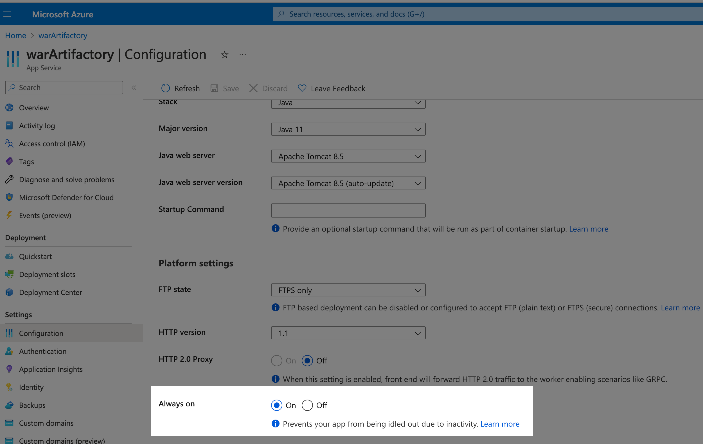
	+ **One or more running slots:** the slots created for your existing Azure Web App. If you are doing a Blue Green deployment, you will need two slots.
* **A Docker image or non-containerized artifact:** this is the same image or artifact you used when you created the Azure Web App.
* **Azure account connection information:** The required permissions are described below.
* **App Service Plan:** the name of the Azure App Service configured for your existing Web App.

## Add an Azure Stage

Azure deployments are done using an CD stage with the Deployment Type **Azure Web App**.

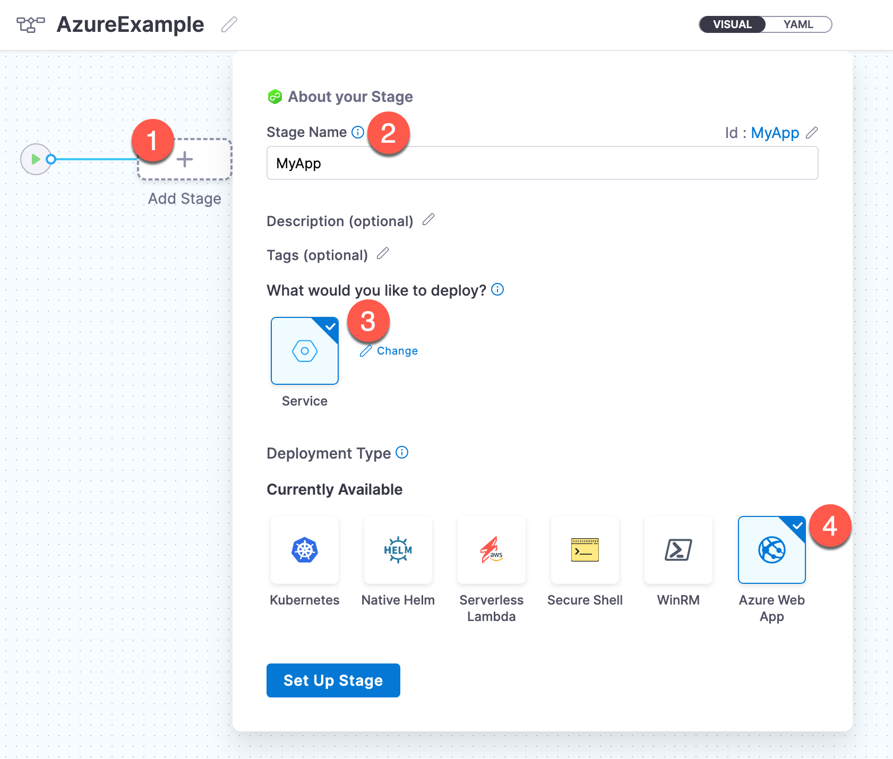

For more info on stages, got to [Add a Stage](/docs/platform/Pipelines/add-a-stage) and [CD Pipeline modeling overview](/docs/continuous-delivery/get-started/cd-pipeline-modeling-overview).

## Define the Service

The Harness Service represents your Azure Web App.

You identify the artifact for the app, configuration settings, and any secrets and configuration variables.

1. Click **New Service**.
2. Enter a name for the new Service. The **Azure Web App** deployment type is selected already.

The **Artifact** is required but the rest of the setting are optional, and will depend on your Web App.

### Startup Command

You can use **Startup Command** to add a startup script for your app.

For details on Web App startup commands, go to [What are the expected values for the Startup File section when I configure the runtime stack?](https://docs.microsoft.com/en-us/azure/app-service/faq-app-service-linux#what-are-the-expected-values-for-the-startup-file-section-when-i-configure-the-runtime-stack-) and [Azure App Service on Linux FAQ](https://docs.microsoft.com/en-us/troubleshoot/azure/app-service/faqs-app-service-linux#built-in-images) from Azure.

1. Click **Add Startup Command**.

You can use remote Git repos that contain your start command file, or you can click **Harness** to use the [Harness File Store](/docs/continuous-delivery/x-platform-cd-features/services/add-inline-manifests-using-file-store) to add them to your Harness Project.

Here's an example of the startup command to start your JAR app for a Java SE stack:


```
java -jar /home/site/wwwroot/app.jar --server.port=80
```
### App Services Configuration

In Azure App Service, App settings are variables passed as environment variables to the application code.

In Harness, you have the option of setting **Application settings** and **Connection strings** in the Harness Service under **App Services Configuration**.

1. Click **Add Application Settings** and **Add Connection Strings** to add your settings.

You can use remote Git repos that contain your settings files, or you can click **Harness** to use the [Harness File Store](/docs/continuous-delivery/x-platform-cd-features/services/add-inline-manifests-using-file-store) to add them to your Harness Project. For example:

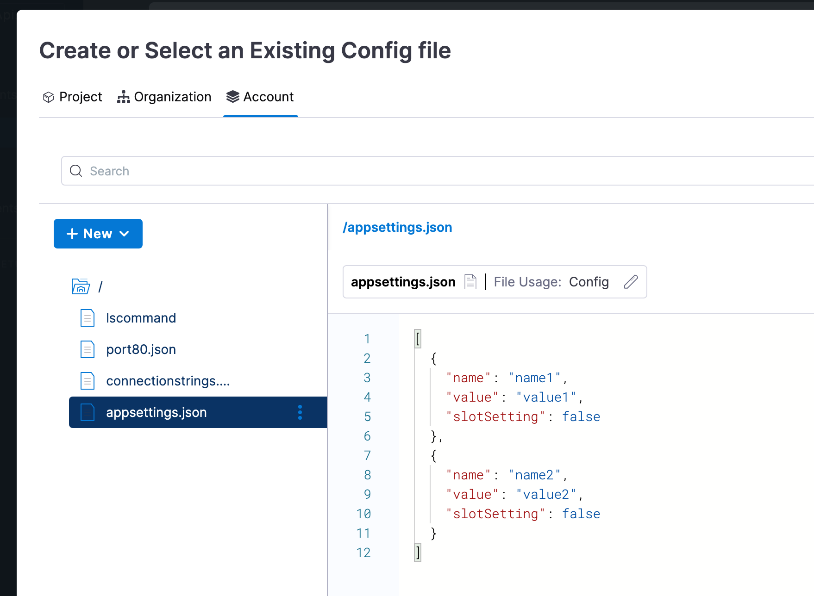

See [Configure an App Service app in the Azure portal](https://docs.microsoft.com/en-us/azure/app-service/configure-common) from Azure.These are the same setting you would normally set for your App using the Azure CLI:

```
az webapp config appsettings set --resource-group <group-name> --name <app-name> --settings DB_HOST="myownserver.mysql.database.azure.com"
```

Or via the portal:

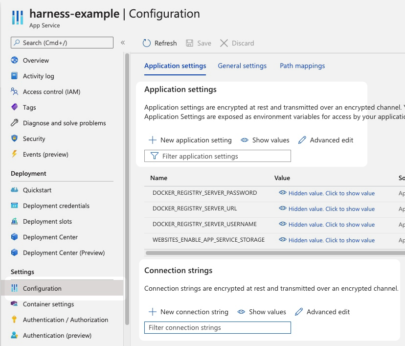

### Add your Artifact

You will add the same Docker image or non-containerized artifact you use in your Azure Web App.

1. In the Harness Service **Artifacts**, click **Add Primary Artifact**.
2. In **Specify Artifact Repository Type**, select the artifact registry type.
3. Select or create a Connector to this registry.

  For details on setting up each registry, go to [Connect to an Artifact Repo](/docs/platform/Connectors/Artifact-Repositories/connect-to-an-artifact-repo).

  Once you have an artifact Connector set up and selected, you can fill out the **Artifact Details** settings.

  Here are some common examples.

  | **ACR** | **Artifactory** | **Docker Registry** |
  | --- | --- | --- |
  | 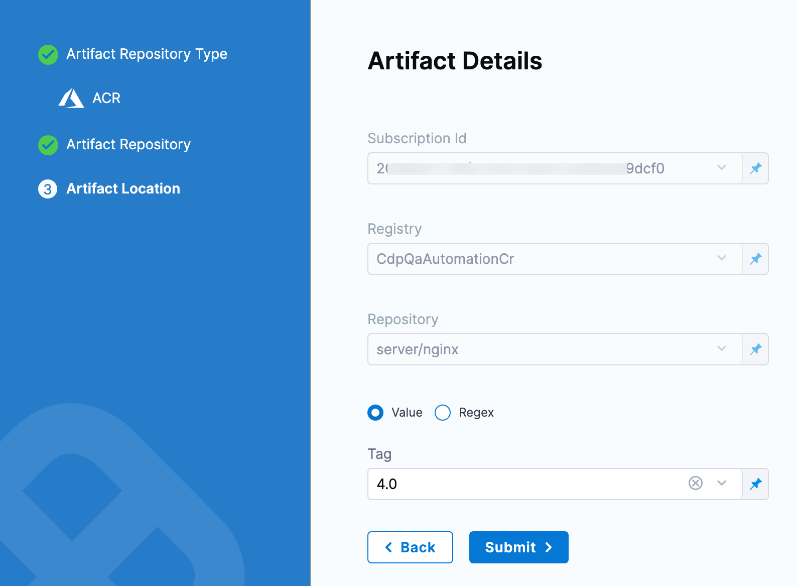 | 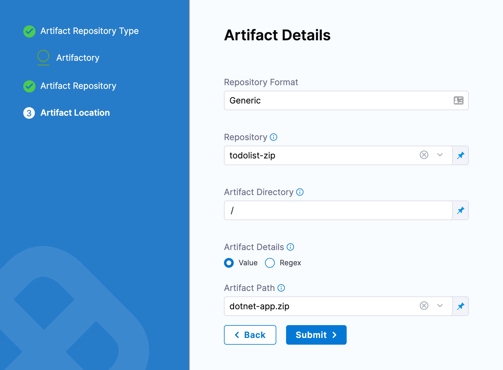 | 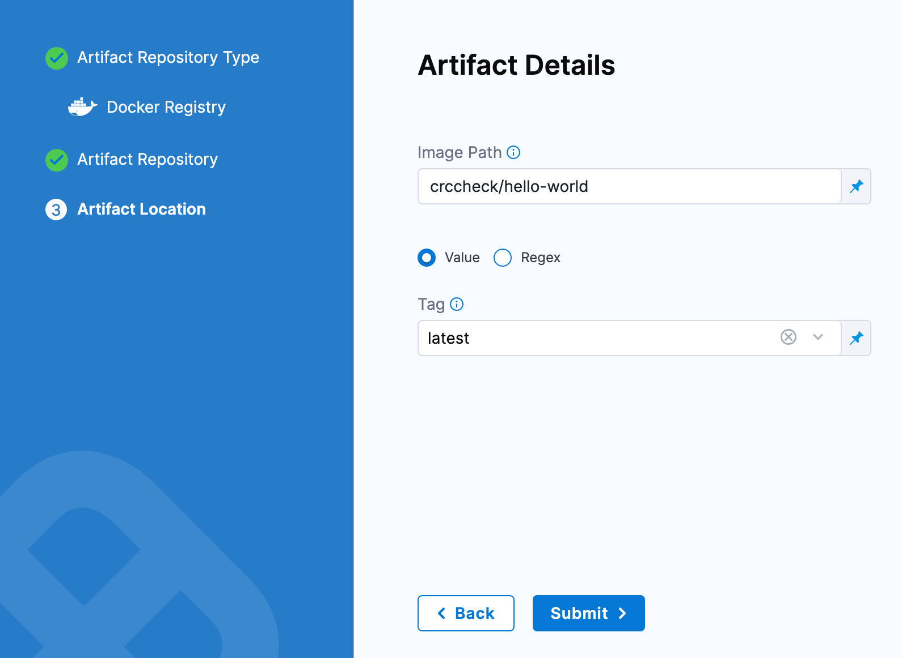 |

  The settings for the Harness Connector and Artifact Details are a combination of the container settings in your Azure Web App.

  For example, here are the Docker Hub settings in Harness and an Azure Web App:

  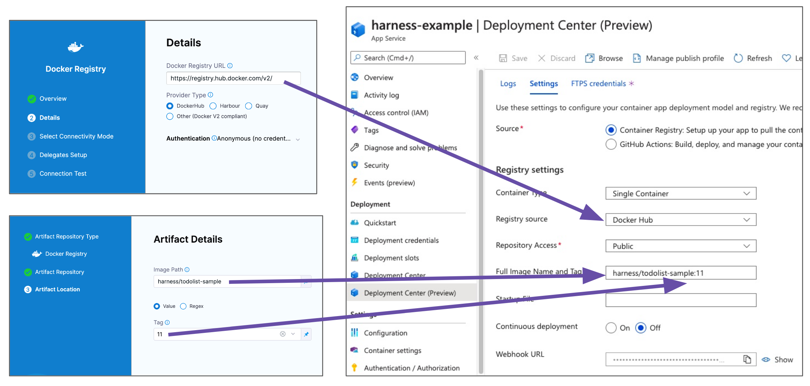

  The above example uses a [publicly available Docker image from Harness](https://hub.docker.com/r/harness/todolist-sample/tags?page=1&ordering=last_updated). 

  You might want to use that the first time you set up an Azure Web App deployment.
4. When are done, click **Submit**.
5. Click **Continue** to move onto **Infrastructure**.

### Harness Delegate

As covered in [Harness Platform architecture](/docs/getting-started/harness-platform-architecture), a Harness Delegate must be installed in your infrastructure for Harness to perform tasks.

You will install a Harness Delegate in your infrastructure as part of adding the Connector for the **App Services Configuration** or **Artifacts**.

There are several types of Delegates you can use for an Azure App Service deployment, such as Kubernetes and Docker Delegates, as listed in the [Delegates](/docs/category/delegates) category.

For Azure Web App deployments, user typically install a Kubernetes Delegate in AKS or a Docker Delegate on a VMSS.

## Define Web App Infrastructure Details

The target Azure environment for your Harness Web App deployment is defined in a Harness Environment's **Infrastructure**. You will provide the Web App name later in your stage's **Execution**.

You simply provide select or create an Azure Cloud Provider Connector and then select the Web App's Subscription Id and Resource Group.

1. In your stage **Infrastructure**, in Environment, select an Environment or click **New Environment** and add a new Production or Pre-production Environment.
2. In **Specify Infrastructure**, select an Infrastructure or click **New Infrastructure** and follow these steps.
3. Enter a name for the new Infrastructure.
4. In **Web App Infrastructure Details**, you will select or create an Azure Cloud Provider Connector and then select the Web App's Subscription Id and Resource Group.
5. In **Connector**, select or create an Azure Cloud Provider Connector that connects to your Application and Tenant Ids.

  For steps on setting up a new Azure Cloud Provider Connector, go to [Add a Microsoft Azure Cloud Connector](/docs/platform/Connectors/Cloud-providers/add-a-microsoft-azure-connector).

  Azure Web App Roles and PermissionsIf you use Microsoft Azure Cloud Connector and Service Principal or Managed Identity credentials, you can use a custom role or the **Contributor** role. The **Contributor** role is the minimum requirement.

  Below are the Azure RBAC permissions used for System Assigned Managed Identity permissions to perform Azure Web App deployments for container and non-container artifacts.

  ```
  [  
                      "microsoft.web/sites/slots/deployments/read",  
                      "Microsoft.Web/sites/Read",  
                      "Microsoft.Web/sites/config/Read",  
                      "Microsoft.Web/sites/slots/config/Read",  
                      "microsoft.web/sites/slots/config/appsettings/read",  
                      "Microsoft.Web/sites/slots/*/Read",  
                      "Microsoft.Web/sites/slots/config/list/Action",  
                      "Microsoft.Web/sites/slots/stop/Action",  
                      "Microsoft.Web/sites/slots/start/Action",  
                      "Microsoft.Web/sites/slots/config/Write",  
                      "Microsoft.Web/sites/slots/Write",  
                      "microsoft.web/sites/slots/containerlogs/action",  
                      "Microsoft.Web/sites/config/Write",  
                      "Microsoft.Web/sites/slots/slotsswap/Action",  
                      "Microsoft.Web/sites/config/list/Action",  
                      "Microsoft.Web/sites/start/Action",  
                      "Microsoft.Web/sites/stop/Action",  
                      "Microsoft.Web/sites/Write",  
                      "microsoft.web/sites/containerlogs/action",  
                      "Microsoft.Web/sites/publish/Action",  
                      "Microsoft.Web/sites/slots/publish/Action"  
  ]
  ```
1. In **Subscription Id**, select the Azure subscription used by your Web App.
  
  The subscription is located in the Web App **Overview** section of the Azure portal.
  
  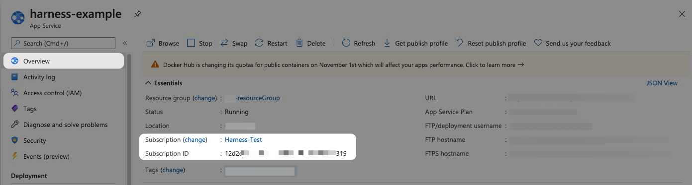

2. In **Resource Group**, select the resource group used by your Web App.
  
  The resource group is located in the Web App **Overview** section of the Azure portal.
  
  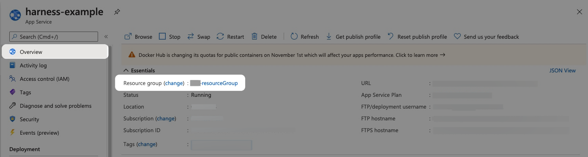

Within the same resource group, you can't mix Windows and Linux apps in the same region. See [Limitations](https://docs.microsoft.com/en-us/azure/app-service/overview#limitations) from Azure.

When you're done, Infrastructure will look something like this:

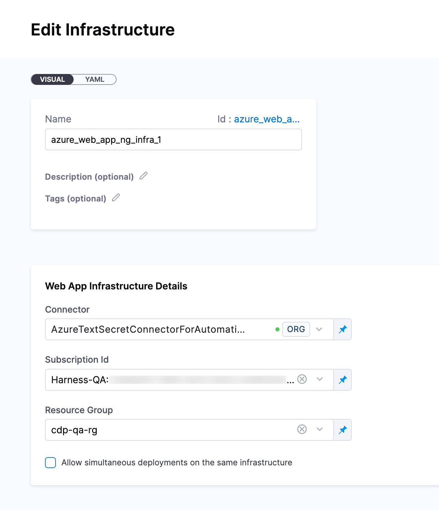

Now that you have the **Service** and **Infrastructure** defined, you can select a deployment strategy and configure its step in your stage **Execution**.

1. Click **Continue** and select a [deployment strategy](/docs/continuous-delivery/manage-deployments/deployment-concepts). 

The steps for the strategy are added automatically.

## Basic Deployments

In a Basic deployment, a new Service/Artifact version is deployed to the deployment slot. Basic deployments are useful for development, learning Harness, and any non-mission critical workflows.

The Basic strategy adds the **Slot Deployment** step automatically, but it does not add other steps like **Traffic Shift** or **Swap Slot**.

While **Traffic Shift** and **Swap Slot** can be added, it's better to select the Canary or Blue Green strategies for these steps.

### Slot Deployment Step

The Slot Deployment step is where you select the Web App and source deployment slot for the deployment.

1. Open the **Slot Deployment** step.
2. Enter the following settings and click **Apply Changes**.
   * **Name:** enter a name for the step.
   * **Timeout:** enter a minimum of **10m**. The slot deployment relies on Azure and can take time.
   * **Web App Name:** enter the name of the Azure Web App for deployment.
   * **Deployment Slot:** enter the name of the Source slot for the deployment. This slot is where Harness deploys the new Web App version.Make sure the slot you enter is running.

Here's an example.

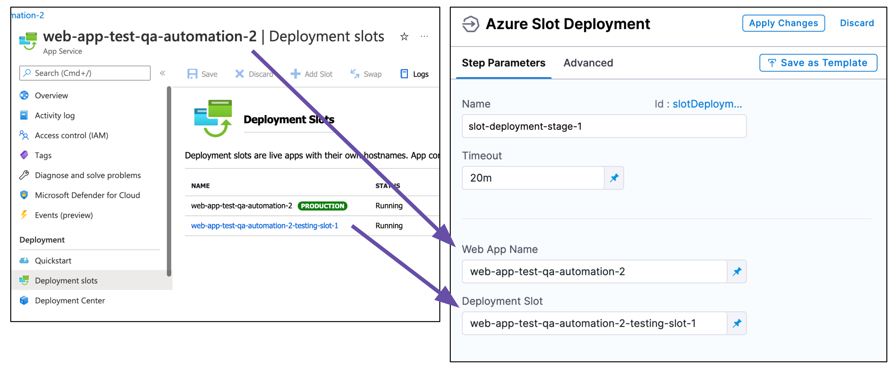  

:::note

Currently, the following functionality is behind the feature flag `CDS_AZURE_WEBAPP_NG_LISTING_APP_NAMES_AND_SLOTS`. Contact [Harness Support](mailto:support@harness.io) to enable the feature.

When you select a Web App in **Web App Name**, Harness will automatically update the **Deployment Slot** setting with the slots for that Web App.

:::

### Web App Rollback

In the Execution Rollback section you will see the **Web App Rollback** step.

For details on rollbacks, see [Notes](#notes) below.

## Canary Deployments

A Harness Azure Web App Canary deployment shifts traffic from one deployment slot to another incrementally.

First, you select the deployment slot where the deployment will be done. Next, you add Traffic Shift steps to incrementally shift traffic from the production slot to the deployment slot.

Finally, you swap the deployment slot with the target slot. Azure swaps the Virtual IP addresses and URLs of the deployment and target slots.

First, you need to collect the existing Deployment slots from your Azure Web App.

1. In the Azure portal, click your Web App, and then click **Deployment slots**. You can see the Deployment slots for your Web App.
2. Click **Swap**. You can see the Source and Target slots.


You'll use these slot names in your Harness steps.

For a Canary deployment, Harness adds the following steps.

### Slot Deployment Step

The Slot Deployment step is where you select the Web App and source deployment slot for the deployment.

1. Open the **Slot Deployment** step.
2. Enter the following settings and click **Apply Changes**.
   * **Name:** enter a name for the step.
   * **Timeout:** enter a minimum of **10m**. The slot deployment relies on Azure and can take time.
   * **Web App Name:** enter the name of the Azure Web App for deployment.
   * **Deployment Slot:** enter the name of the Source slot for the deployment. This slot is where Harness deploys the new Web App version.Make sure the slot you enter is running.

Here's an example.


### Add a Health Check after Slot Deployment

Typically, it's a good practice to add a health check to ensure that the Docker container or non-containerized app is running correctly.

The Slot Deployment step is considered successful once the slot is in a running state. A running state does not ensure that your new app is accessible. It can take some time for new content to become available on Azure. Also, the slot deployment might succeed but the Docker container or non-containerized artifact could be corrupted.

A health check after Slot Deployment can ensure a successful deployment.

A health check can be performed using a [Shell Script](/docs/continuous-delivery/x-platform-cd-features/cd-steps/cd-general-steps/using-shell-scripts) step. You can also use Harness [Approval](/docs/category/approvals) steps to ensure the app is running before proceeding to the Traffic Shift step.

### Traffic Shift steps

The **Traffic Shift** step shifts network traffic from the production slot to the deployment slot specified in the **Slot Deployment** step.

**Traffic Shift steps are** **not** **cumulative.** If you set 25% in one and 25% in the next one, only 25% of traffic is routed.

1. Open the **Traffic Shift** step.
2. In **Traffic %**, enter a number (without the % character).
3. Click **Apply Changes**.

You can use multiple **Traffic Shift** steps to incrementally increase traffic. In-between each **Traffic Shift** step, you can add a health check and/or Approval step.

### Swap Slot step

The final step in the phase is Swap Slot. This step swaps the deployment slot you entered in the **Slot Deployment** step with the **Target Slot** mentioned in the **Swap Slots** step. It is similar to doing a swap in the Azure portal or via the Azure CLI:

```
az webapp deployment slot swap -n "web app name" -g "resource group name" -s "source slot name" --target-slot "target slot"
```
If you are new to Azure Web App deployment slot swapping, see [What happens during a swap](https://docs.microsoft.com/en-us/azure/app-service/deploy-staging-slots#what-happens-during-a-swap) from Azure.

1. Open the **Swap Slot** step.
2. In **Target Slot**, enter the name of the target (production) slot.

Once you run the Pipeline you will see the swap in the Swap Slot step logs:

```
Sending request for swapping source slot: [stage] with target slot: [production]  
Operation - [Swap Slots] was success  
Swapping request returned successfully  
Swapping slots done successfully
```

### Web App Rollback

In the Execution Rollback section you will see the **Web App Rollback** step.

For details on rollbacks, see [Notes](#notes) below.

## Blue Green Deployments

A Harness Azure Web App Blue Green deployment swaps traffic from one deployment slot to another.

If you are new to Azure Web App deployment slot swapping, see [What happens during a swap](https://docs.microsoft.com/en-us/azure/app-service/deploy-staging-slots#what-happens-during-a-swap) from Azure.

First, you need to collect the existing Deployment slots from your Azure Web App.

1. In the Azure portal, click your Web App, and then click **Deployment slots**. You can see the Deployment slots for your Web App.
2. Click **Swap**. You can see the Source and Target slots.

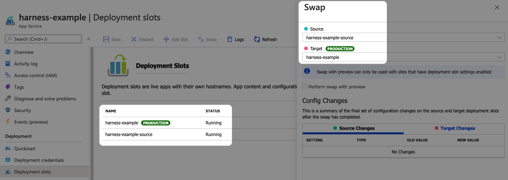

You'll use these slot names in your Harness steps.

For a Blue Green deployment, Harness adds the following steps.

### Slot Deployment Step

The Slot Deployment step is where you select the Web App and source deployment slot for the deployment.

1. Open the **Slot Deployment** step.
2. Enter the following settings and click **Submit**.
   * **Name:** enter a name for the step.
   * **Timeout:** enter a minimum of **10m**. The slot deployment relies on Azure and can take time.
   * **Web App Name:** enter the Azure Web App for deployment.
   * **Deployment Slot:** enter the Source slot for the deployment. This slot is where Harness deploys the new Web App version.Make sure the slot you select is running. Harness shows all slots regardless of their status.

### Add a Health Check after Slot Deployment

Typically, it's a good practice to add a health check to ensure that the Docker container or non-containerized app is running correctly.

The Slot Deployment step is considered successful once the slot is in a running state. A running state does not ensure that your new app is accessible. It can take some time for new content to become available on Azure. Also, the slot deployment might succeed but the Docker container or non-containerized artifact could be corrupted.

A health check after Slot Deployment can ensure a successful deployment.

A health check can be performed using a [Shell Script](/docs/continuous-delivery/x-platform-cd-features/cd-steps/cd-general-steps/using-shell-scripts) step. You can also use Harness [Approval](/docs/category/approvals) steps to ensure the app is running before proceeding to the Traffic Shift step.

### Swap Slot step

This step performs the Web App deployment slot swap. It's like doing a swap in the Azure portal or via the Azure CLI:

```
az webapp deployment slot swap -n "web app name" -g "resource group name" -s "source slot name" --target-slot "target slot"
```

1. Open the **Swap** **Slot** step.
  * **Target Slot:** enter the Target slot (production) for the deployment. This slot is where Harness will swap the App content and configurations elements during the **Swap Slot** step.

### Web App Rollback

In the Execution Rollback section you will see the **Web App Rollback** step.

For details on rollbacks, see [Notes](#notes) below.

## Notes

### Limitations

* App Service on Linux isn't supported on [Shared](https://azure.microsoft.com/pricing/details/app-service/plans/) pricing tier.
* You can't mix Windows and Linux apps in the same App Service plan.
* Within the same resource group, you can't mix Windows and Linux apps in the same region.
* Harness uses the Azure SDK among other methods and Authenticated proxy is not supported for Azure SDK. Consequently, you cannot use Azure connections for artifacts, machine images, etc, that require proxy authentication. This is an Azure limitation, not a Harness limitation. This is a known Azure limitation with Java environment properties and their SDK.

### Rollback Summary

For Azure Web App deployments, Harness saves the previous Docker or non-containerized app details that were running on the slot.

In case of an Azure Web App deployment failure, Harness rollback redeploys the previous instance.

#### Web App Rollback

Harness will try to recover the state before deployment.

For a Docker image deployment rollback, Harness will fetch the Web App details (artifact, app settings, connection strings, startup script) of the existing slot and use this data to bring the slot to its previous state.

For non-containerized artifact rollback, Harness will rollback to the last successful deployment done with Harness. Harness saves deployment details after a successful deployment and uses this data for rollback in the next deployment.

#### Traffic Rollback

Harness returns all traffic to the previous, pre-deployment percentages.

If the pre-deployment traffic was arranged with the source slot at 20% and the target slot at 80%, rollback will return network traffic to these percentages.

#### Rollback Example for Non-Containerized Rollbacks

Here's an example of a rollback.

**Update Slot Configuration Settings**:

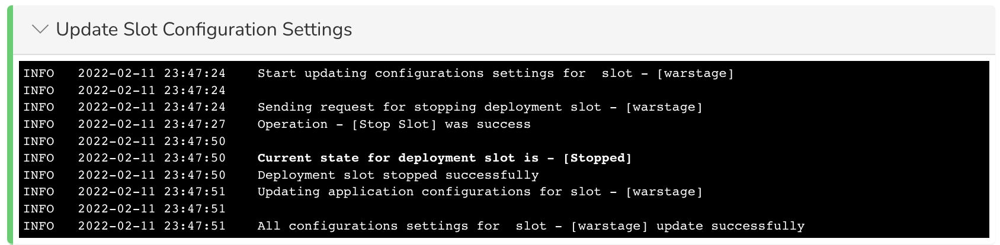

**Deploy to Slot**:

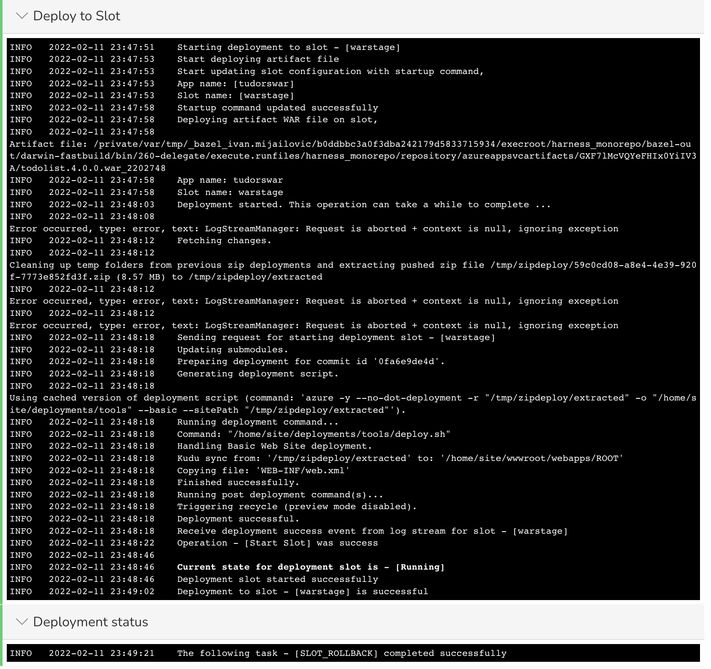

#### Rollback Logs

Here's the log activity from a rollback with the timestamps removed:

```
Sending request for stopping deployment slot - [stage]  
Operation - [Stop Slot] was success  
Request sent successfully  
  
Start updating Container settings for slot - [stage]  
Start cleaning existing container settings  
  
Current state for deployment slot is - [Stopped]  
Deployment slot stopped successfully  
  
Start updating application configurations for slot - [stage]  
Deployment slot configuration updated successfully  
  
Existing container settings deleted successfully  
Start cleaning existing image settings  
  
Existing image settings deleted successfully  
Start updating Container settings:   
[[DOCKER_REGISTRY_SERVER_URL]]  
  
Container settings updated successfully  
Start updating container image and tag:   
[library/nginx:1.19-alpine-perl], web app hosting OS [LINUX]  
  
Image and tag updated successfully for slot [stage]  
Deployment slot container settings updated successfully  
  
Sending request for starting deployment slot - [stage]  
Operation - [Start Slot] was success  
Request sent successfully  
  
Sending request to shift [0.00] traffic to deployment slot: [stage]  
  
Current state for deployment slot is - [Running]  
Deployment slot started successfully  
  
Traffic percentage updated successfully  
  
The following task - [SLOT_ROLLBACK] completed successfully
```

### Rollback Limitations

#### Rollback Limitations for Non-Containerized Rollbacks

Rollback for Non-Containerized artifact deployments is not supported for the first two deployments because the necessary artifact details are not available to perform a rollback.

#### Streaming Logs Limitations for both Azure Container and Non-Containerized Deployments

You might face timeout issues as a result of limitations with streaming Web App slot deployment logs. For example, you might see `java.net.SocketTimeoutException: timeout` or some other socket errors as a result of the Azure SDK client.

Harness is working with the Azure team for a resolution (see [issue 27221](https://github.com/Azure/azure-sdk-for-java/issues/27221)). At this time, you can use a Harness [HTTP step](../../../first-gen/continuous-delivery/model-cd-pipeline/workflows/using-the-http-command) to verify that the slot is up and ready.

### Application Settings and Connection Strings

* If you add App Service Configuration settings in the Harness Service, you must include a **name** (`"name":`), and the name must be unique. This is the same requirement in Azure App Services.
* Do not set Docker settings in the Harness Service **Application Settings** and **Connection Strings**. Harness will override these using the Docker settings in the artifact you add to the Harness Service in **Artifact**.

#### Using Secrets and Variables Settings

You can use [Harness secrets](/docs/platform/Secrets/add-use-text-secrets) and Service or Workflow variables in the **Application settings** and **Connection strings** in the Harness Service.

These settings use JSON, so ensure that you use quotes around the variable or secret reference:

```json
  {  
    "name": "PASSWORD",  
    "value": "<+secrets.getValue('doc-secret')>",  
    "slotSetting": false  
  },
```
#### What about the Rolling strategy?

The Rolling strategy doesn't suit Azure Web App deployments as they are use slots for staging and production environments. The Rolling strategy uses a single environment and roll out a new app version incrementally.

