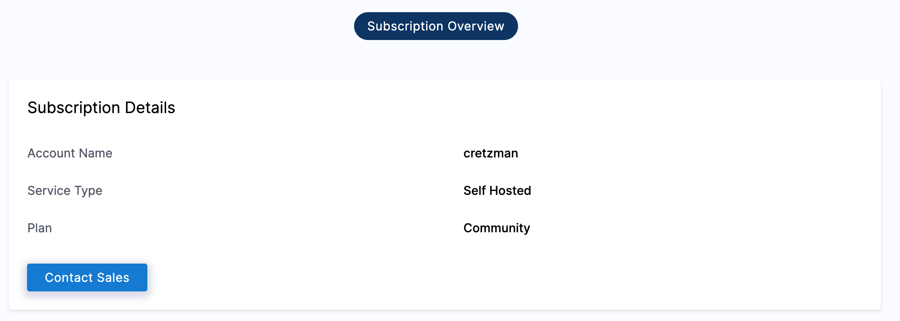

This topic describes Harness CD Community Edition (CE).

Harness CD Community Edition is a lightweight version of Harness that you can download and run on your laptop or any VM.

Harness CD Community Edition is intended to get devs started with Harness quickly without having to sign up for a Harness SaaS account.

:::note

**Want to get started right away?** See [Harness CD Community Edition quickstart](/docs/continuous-delivery/deploy-srv-diff-platforms/community-ed/harness-community-edition-quickstart).

:::

## What is Harness CD Community Edition?

* Harness CD Community Edition is a free and open edition of Harness.
* Harness CD Community Edition can be downloaded and run without any Harness signup. You simply sign up to the local account.
* Run on any laptop or single VM with only 3GB RAM and 2 CPUs. You will also need additional resources for any local Kubernetes clusters used in deployments.
* Has both Docker Compose and Helm chart installers.
* The modules in Harness CD Community Edition are available as a PolyForm Shield license.

## What can I do with Harness CD Community Edition?

* Today, Harness CD Community Edition can perform Kubernetes deployments only. This means pulling remote manifests and artifacts and deploying them to a local or remote Kubernetes cluster.
* You can also use Harness CD features such as automated rolling, canary and blue green deployments, automated infrastructure provisioning, integrated approvals and notifications, full YAML-based development, and Harness Git Experience.
* In the near future, Amazon Web Services (AWS) (Elastic Container Service (ECS), Auto Scale Groups (ASG), CloudFormation, Lambda, etc), Microsoft Azure (Virtual Machine Scale Sets (VMSS), WebApps, Azure Kubernetes Service (AKS), Azure Container Registry (ACR), Azure Resource Manager (ARM), Blueprint), .NET, Google Cloud Build, VM, Tanzu Application Services (TAS), Serverless, and traditional (Tomcat, etc) deployments will be supported.  

For the full list of the currently supported integrations, see **Continuous Delivery (CD)** in [supported platforms and technologies](/docs/getting-started/supported-platforms-and-technologies).

## Can I upgrade to a paid plan from Harness CD Community Edition?

Yes, you can upgrade from within Harness in **Account Settings** > **Subscriptions** or by contacting [Harness Sales](mailto:sales@harness.io).



## Diagnostics and usage data

By default, Harness CD Community Edition shares minor usage details with Harness. These details help us understand and improve how the system behaves in real-world scenarios.

### Collection at registration

When a user first installs and signs up in their first Harness CD Community Edition, the system sends a `NEW_SIGNUP` track event and identify event to Harness.

Details of `NEW_SIGNUP` track event:

* Email of the first user who signs up in Harness CD Community Edition.
* Time of registration.
* Public IP address.
* Version of installer.
* Hostname.
* Harness account Id.

Here's an example of the JSON payload:


```json
{  
    "accountId": "tRfsCBTDxxxxxxJcg0g",  
    "category": "SIGNUP",  
    "email": "john.doe@gmail.com",  
    "firstInstallTime": "1641598599622",  
    "groupId": "tRfsCBxxxxxxJcg0g",  
    "hostName": "218864e95d77",  
    "id": "ahnwoP1xxxxxxtROJg",  
    "name": "doe",  
    "remoteIpAddress": "76.22.55.244",  
    "source": "community",  
    "version": "VersionInfo(version=1.0.73225, buildNo=73225, gitCommit=f66ad1343fd5e068615b185caa05c125282826b6, gitBranch=release/on-prem/732xx, timestamp=220105-1908, patch=000)"  
}
```
### Collection every day

Once you have a successful installation and set up, the system sends a daily ping to Harness with the following key details:

* Total pipelines
* Pipelines created per day
* Total pipeline executions
* Pipeline executions per day
* Total active services per day
* Total active services per month
* Total service instances per day
* Total service instances per month
* IP address

### Disable data collection

Today, user tracking can be disabled manually. Soon, it will be an option in the Harness installation process.

To disable user tracking, navigate to the **environment** folder in your Harness CD Community Edition installation: `harness-cd-community/docker-compose/harness/environment`.

Change the following environment variables in the following files:

* **manager.env:** change `SEGMENT_ENABLED_NG=true` to `SEGMENT_ENABLED_NG=false`.
* **ng-manager.env:** change `SEGMENT_ENABLED=true` to `SEGMENT_ENABLED=false`.
* **pipeline-service.env:** change `SEGMENT_ENABLED=true` to `SEGMENT_ENABLED=false`.

Save all files, and then restart Harness using `docker-compose up -d`.

## Privacy notice

When you install an instance of Harness CD Community Edition, Harness collects the email address used to sign up in Harness, the number of users added to your Harness CD Community Edition, and the number of builds, deployments, and pipelines, and the information described above.

Harness uses this information for sales, support, product updates, security updates, policy updates, and license compliance.

The use of this information is governed by our [Privacy Policy](https://harness.io/privacy).

If you would like us to stop processing your data, or if you have any other questions or requests concerning your data, contact the [Harness Privacy Team](mailto:privacy@harness.io). For more information on how we process your data, see our [Privacy Policy](https://harness.io/privacy).

