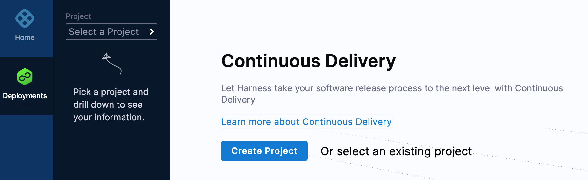
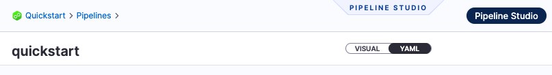
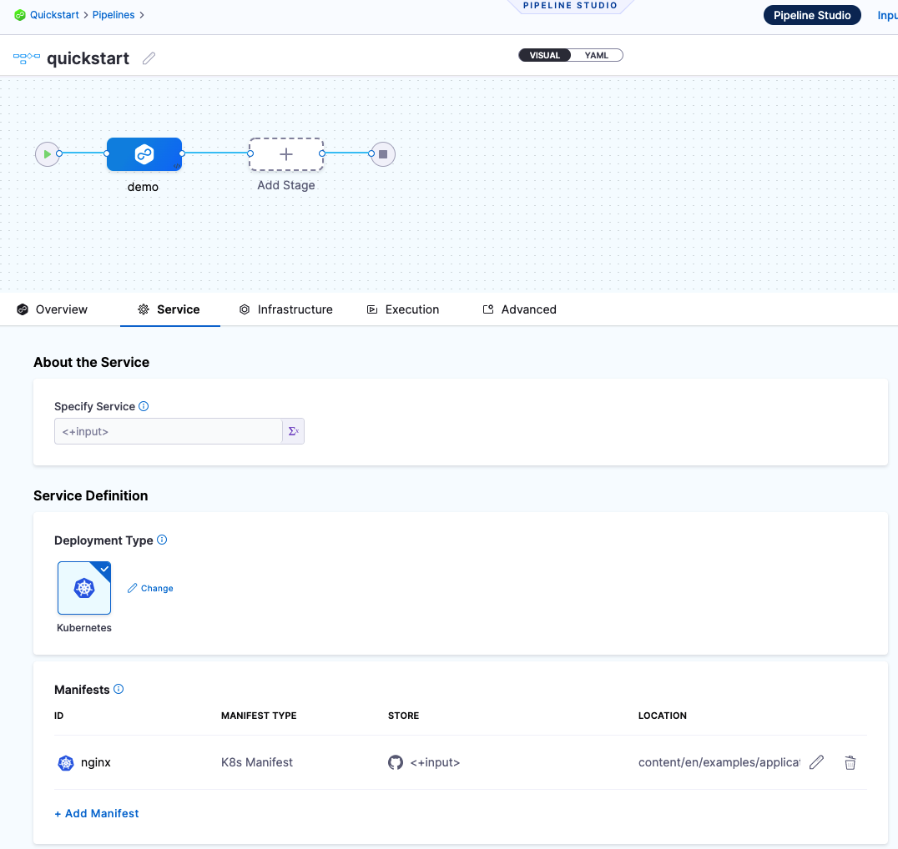
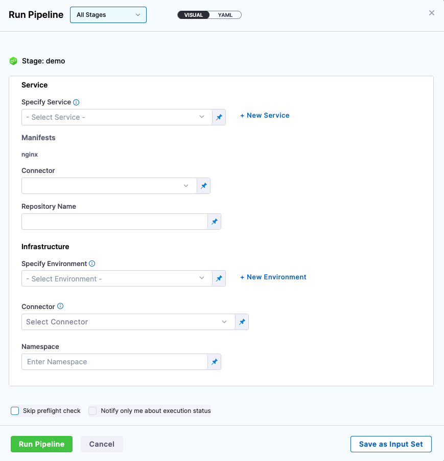
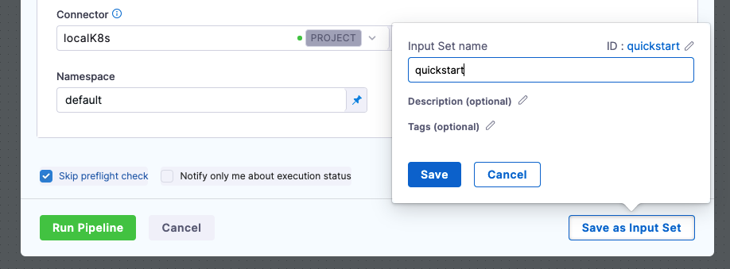
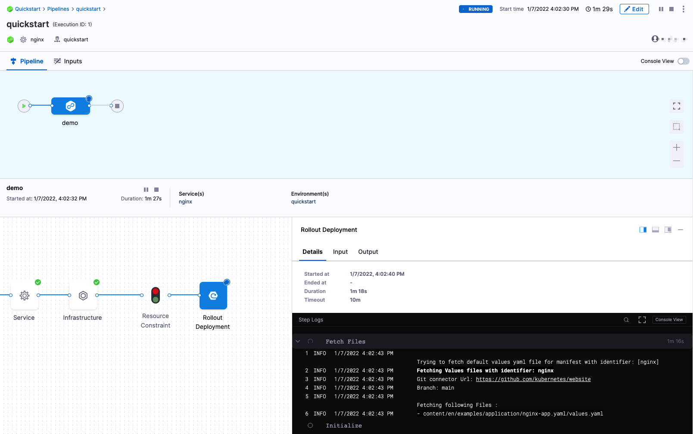
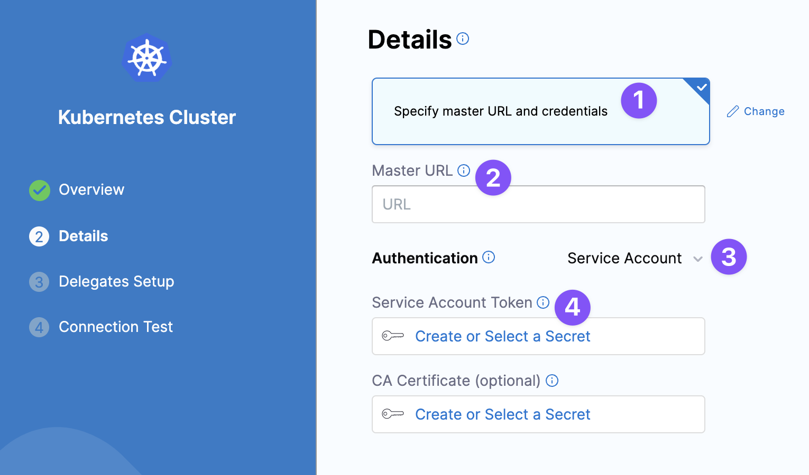

This quickstart shows you how to set up Harness CD Community Edition locally and create a CD pipeline that deploys a public NGINX image to a local cluster.

Harness CD Community Edition is a lightweight version of Harness that you can download and run on your laptop or any VM with 3GB RAM and 2 CPUs. Harness CD Community Edition is intended to get devs started with Harness quickly without having to sign up for a Harness SaaS account.

For an overview, see [Harness CD Community Edition overview](/docs/continuous-delivery/deploy-srv-diff-platforms/community-ed/harness-community-edition-overview).

## Objectives

You'll learn how to:

* Install and run Harness CD Community Edition locally.
* Create and deploy a CD pipeline in Harness CD Community Edition using a public Docker image and a local Kubernetes cluster.

## Requirements

* **Harness CD Community Edition:**
	+ Docker Desktop minimum version 4.3.1 (72247)
		- 3GB RAM and 2 CPUs is the minimum.
		- Docker Compose (included in Docker Desktop).
	+ 20GB of free disk space.
* **Tutorial:**
	+ GitHub account.
  	+ You will use your GitHub account to pull a publicly available manifest (`https://github.com/kubernetes/website/blob/main/content/en/examples/application/nginx-app.yaml`).
	+ Docker Compose Kubernetes is installed and running in Docker Desktop (a new installation of Docker Desktop might need to have Kubernetes enabled in its **Settings**).  
	  - Docker Compose Kubernetes should have at least 2GB memory and 1 CPU. That will bring the total Docker Desktop resources up to a minimum of **5GB and 3 CPUs**.
	  - If you want to use Minikube instead of Docker Desktop Kubernetes, use Minikube minimum version v1.22.0 or later installed locally.
  	  - Minikube needs 4GB and 4 CPUs: `minikube start --memory 4g --cpus 4`.
	+ Kubernetes cluster.
  	+ This is the target cluster for the deployment you will set up in this quickstart. When Docker Compose Kubernetes is installed it comes with a cluster and the **default** namespace. You don't need to make any changes to Docker Compose Kubernetes. Don't have a cluster? Go to [Notes](#notes) below.
	+ Review [Harness CD Community Edition overview](/docs/continuous-delivery/deploy-srv-diff-platforms/community-ed/harness-community-edition-overview) and [Harness key concepts](/docs/getting-started/learn-harness-key-concepts) to establish a general understanding of Harness.

The Docker Compose installer is described below, but Harness also supports a [Helm installer](https://github.com/harness/harness-cd-community/blob/main/helm/README.md).

### Completely new to Continuous Delivery (CD)?

Simply put, CD is the automation of a software release process. In Harness, you model this process as a pipeline.

#### What do I need for a CD pipeline?

1. An artifact to deploy: an artifact is the application or microservice you are deploying. It can be a Docker image, a zip file, etc.
2. A deployment method: this is whatever specification or manifest is needed by the deployment platform you are using, such as a Kubernetes manifest.
3. A place to deploy it: this is your target environment, such as a Kubernetes cluster.

Harness takes care of the rest.

## Architecture summary

Harness CD Community Edition has two main components:

* **Harness Manager:** the Harness Manager is where your CD configurations are stored and your pipelines are managed.
  * After you install Harness, you sign up in the Manager at `http://localhost/#/signup`.
  * Pipelines are triggered manually in the Harness Manager or automatically in response to Git events, schedules, new artifacts, and so on.
* **Harness Delegate:** the Harness Delegate is a software service you install in your environment that connects to the Harness Manager and performs tasks using your container orchestration platforms, artifact repositories, etc. 
  * You can install a Delegate inline when setting up connections to your resources or separately as needed. This guide will walk you through setting up a Harness Delegate inline.

## Installation

Installation and deployment should take about 10 minutes.

The Docker Compose installer is described below, but Harness also supports a [Helm installer](https://github.com/harness/harness-cd-community/blob/main/helm/README.md).

Make sure your system meets the [requirements](#requirements) above.

Ensure Docker Desktop is running and Docker Desktop Kubernetes is running with it.

1. Clone the Harness Git repo into your local directory:

   ```git
   git clone https://github.com/harness/harness-cd-community
   ```

  The output will look something like this:

  ```
  Cloning into 'harness-cd-community'...  
  remote: Enumerating objects: 793, done.  
  remote: Counting objects: 100% (793/793), done.  
  remote: Compressing objects: 100% (371/371), done.  
  remote: Total 793 (delta 497), reused 592 (delta 339), pack-reused 0  
  Receiving objects: 100% (793/793), 116.39 KiB | 2.42 MiB/s, done.  
  Resolving deltas: 100% (497/497), done.
  ```
2. Change directory to the **harness** folder:

   ```
   cd harness-cd-community/docker-compose/harness
   ```
3. Build and run Harness using Docker Compose:

   ```
   docker-compose up -d
   ```
   Do not try to bring up containers one by one. Harness CD Community Edition is a distributed system with dependencies. The only way to bring it up is using `docker-compose up -d`.

   The first download can take 3–12 mins (downloading images and starting all containers) depending on the speed of your Internet connection. You won't be able to sign up until all the required containers are up and running.The output will look something like this:

   ```
   [+] Running 13/13  
   ⠿ Network harness_harness-network       Created                                                                                                                                                  0.1s  
   ⠿ Container harness_log-service_1       Started                                                                                                                                                  2.9s  
  ⠿ Container harness_redis_1             Started                                                                                                                                                  2.7s  
  ...
  ```

4. Run the following command to ensure all services are running:

   ```
   docker-compose ps
   ```

   All services should show `running (healthy)`. If any show `running (starting)`, wait a minute, and run `docker-compose ps` again until they are all `running (healthy)`.

5. Run the following command to start the Harness Manager (it will wait until all services are healthy):

   ```
   docker-compose run --rm proxy wait-for-it.sh ng-manager:7090 -t 180
   ```

   The output will look like this:

   ```
   [+] Running 6/0  
   ⠿ Container harness_platform-service_1  Running                                                                                                                                                  0.0s  
   ⠿ Container harness_pipeline-service_1  Running                                                                                                                                                  0.0s  
   ⠿ Container harness_manager_1           Running                                                                                                                                                  0.0s  
   ⠿ Container harness_delegate-proxy_1    Running                                                                                                                                                  0.0s  
   ⠿ Container harness_ng-manager_1        Running                                                                                                                                                  0.0s  
   ⠿ Container harness_ng-ui_1             Running                                                                                                                                                  0.0s  
   wait-for-it.sh: waiting 180 seconds for ng-manager:7090  
   wait-for-it.sh: ng-manager:7090 is available after 0 seconds
   ```

   Wait until you see that `ng-manager` is available:

   ```
   wait-for-it.sh: ng-manager:7090 is available after 0 seconds
   ```

6. In your browser, go to the URL `http://localhost/#/signup`.

   If you see a 403 error, that just means the Harness Manager service isn't up and running yet. Make sure you ran the wait-for-it.sh script earlier and wait a few minutes: `docker-compose run --rm proxy wait-for-it.sh ng-manager:7090 -t 180`.

7. Enter an email address and password and select **Sign up**.

   You'll see the CD page:
   
   

You're now using Harness!

The next section walks you through setting up and running a simple CD Pipeline using a public manifest and Docker image.

## Create pipeline

We'll create a quick CD pipeline that deploys a public manifest and image to a local Kubernetes cluster. The following steps are similar to the [Kubernetes CD quickstart](/docs/continuous-delivery/deploy-srv-diff-platforms/kubernetes/kubernetes-cd-quickstart).

1. In Harness, select **Create Project**.
2. In **About the Project**, in **Name**, enter **Quickstart**, and then select **Save and Continue**.
3. In **Invite Collaborators**, select **Save and Continue**. Your new project appears. Let's add a CD pipeline.
4. In **Setup Pipeline**, enter the name **quickstart**, and then select **Start**. Your new pipeline is started.

  Now let's jumpstart your pipeline setup by pasting in the YAML for a pipeline. Once it's pasted in, we'll update a few placeholders and then deploy.

  Copy the following YAML:

  ```yaml
  pipeline:  
      name: quickstart  
      identifier: quickstart  
      projectIdentifier: Quickstart  
      orgIdentifier: default  
      tags: {}  
      stages:  
          - stage:  
                name: demo  
                identifier: demo  
                description: ""  
                type: Deployment  
                spec:  
                    serviceConfig:  
                        serviceRef: <+input>  
                        serviceDefinition:  
                            type: Kubernetes  
                            spec:  
                                variables: []  
                                manifests:  
                                    - manifest:  
                                          identifier: nginx  
                                          type: K8sManifest  
                                          spec:  
                                              store:  
                                                  type: Github  
                                                  spec:  
                                                      connectorRef: <+input>  
                                                      gitFetchType: Branch  
                                                      paths:  
                                                          - content/en/examples/application/nginx-app.yaml  
                                                      repoName: <+input>  
                                                      branch: main  
                                              skipResourceVersioning: false  
                    infrastructure:  
                        environmentRef: <+input>  
                        infrastructureDefinition:  
                            type: KubernetesDirect  
                            spec:  
                                connectorRef: <+input>  
                                namespace: <+input>  
                                releaseName: release-<+INFRA_KEY>  
                        allowSimultaneousDeployments: false  
                    execution:  
                        steps:  
                            - step:  
                                  type: K8sRollingDeploy  
                                  name: Rollout Deployment  
                                  identifier: Rollout_Deployment  
                                  spec:  
                                      skipDryRun: false  
                                  timeout: 10m  
                        rollbackSteps: []  
                tags: {}  
                failureStrategies:  
                    - onFailure:  
                          errors:  
                              - AllErrors  
                          action:  
                              type: StageRollback
  ```
1. In Pipeline Studio, select **YAML**.
   
  

2. Select **Edit YAML**.
3. Replace the YAML contents with the YAML you copied above.
4. Select **Save**.
5. Select **Visual**. The new pipeline is created.
   
  

  Let's quickly review some key pipeline concepts:

  * **Harness Delegate:** the Harness Delegate is a software service you install in your environment that connects to the Harness Manager and performs tasks using your container orchestration platforms, artifact repositories, monitoring systems, etc.
  * **Pipelines:** A CD pipeline is a series of stages where each stage deploys a service to an environment.
  * **Stages:** A CD stage is a subset of a pipeline that contains the logic to perform one major segment of the deployment process.
  * **Services:** A service represents your microservices and other workloads logically. A service is a logical entity to be deployed, monitored, or changed independently.
  * **Service Definition:** Service definitions represent the real artifacts, manifests, and variables of a service. They are the actual files and variable values.
  * **Environments:** Environments represent your deployment targets logically (QA, Prod, etc).
  * **Infrastructure Definition:** Infrastructure definitions represent an environment's infrastructure physically. They are the actual target clusters, hosts, etc.
  * **Execution Steps:** Execution steps perform the CD operations like applying a manifest, asking for approval, rollback, and so on. Harness automatically adds the steps you need for the deployment strategy you select. You can then add additional steps to perform many other operations.
  * **Connectors:** Connectors contain the information necessary to integrate and work with 3rd party tools such as Git providers and artifact repos. Harness uses connectors at pipeline runtime to authenticate and perform operations with a 3rd party tool.

  You'll notice a runtime input expression `<+input>` for most of the settings. These are placeholders we'll replace when we run the pipeline.
6. Select **Run**. The **Run Pipeline** settings appear.



Now let's update the placeholders.

### Specify Service

1. Select **New Service**.
2. In **Name**, enter **nginx**.
3. Select **Save**.

### Manifests

Here you'll add a connector to Github using your personal GitHub credentials.

Credentials are encrypted and stored locally in the MongoDB service installed as part of Harness CE

You'll also install a Harness Kubernetes Delegate in your local Kubernetes cluster.

This Delegate will perform all operations at runtime.

#### Connector

1. Select the **Connector** dropdown menu.
2. Select **New Connector**.
3. In **Name**, enter **GitHub**, and then select **Continue**.
4. In **URL Type**, select **Repository**.
5. In **Connection Type**, select **HTTP**.
6. In **GitHub Repository URL**, enter `https://github.com/kubernetes/website`.
7. Select **Continue**.
8. In **Username**, enter your GitHub account username.
9. In **Personal Access Token**, select **Create or Select a Secret**.
10. Select **New Secret Text**.
11. In **Secret Name**, enter the name **github-pat**.
12. In **Secret Value**, paste in a GitHub Personal Access Token (PAT). When you're logged into GitHub, these are typically listed at <https://github.com/settings/tokens>.
  For steps on setting up a GitHub PAT, see [Creating a personal access token](https://docs.github.com/en/authentication/keeping-your-account-and-data-secure/creating-a-personal-access-token) from GitHub.
  Ensure you PAT has the **repo** scope selected:

  

13. Select **Save**, and then select **Continue**.
14. In **Connect to the provider**, select **Connect through a Harness Delegate**, and then **Continue**.
15. In **Delegates Setup**, select **Install a New Delegate**.
16. Select **Kubernetes**, and then select **Continue**.
17. Enter a name **quickstart** for the Delegate, select the **Laptop** size, and then select **Continue**.
18. Select **Download YAML file**.
  The YAML file for the Kubernetes Delegate will download to your computer. 

19. Open a terminal and navigate to where the Delegate file is located.If you're using a remote Kubernetes cluster, go to [notes](#notes) below.

    On a terminal, run this command:

    ```bash
    kubectl apply -f harness-delegate.yaml
    ```

    This installs the Delegate into the default cluster that comes with Docker Desktop Kubernetes. It can take a few minutes for the Delegate pod to run.
20. Run `kubectl get pods -n harness-delegate-ng` to verify that it is **Ready: 1/1** and **Status: Running**.
21. Back in Harness, select **Continue**.
22. Once the Delegate registers, select **Done**.
23. In **Delegates Setup**, select **Connect only via Delegates which has all of the following tags**, and then select the tag for your new Delegate (**quickstart**).
24. Select **Save and Continue**.
25. The **Connection Test** should prove successful. If not, review your credentials.
26. Select **Finish**.

#### Repository name

1. Enter `https://github.com/kubernetes/website`.

### Infrastructure

Here you'll create a connection to the target cluster for this CD stage.

1. Select **New Environment**.
2. In **Name**, enter **quickstart**, select **Non-Production**, and select **Save**.

#### Connector

1. Select the **Connector** dropdown menu, and then select **New Connector**.
2. In **Name**, enter **localK8s**, and then select **Continue**.
3. In **Details**, select **Use the credentials of a specific Harness Delegate**, and then select **Continue**.
   + If you are running a local Delegate but using a target cluster that does not have a Delegate installed in it, select **Specify master URL and credentials**, and then go to [Notes](#notes) below.
4. In **Delegates Setup**, select **Connect only via Delegates which has all of the following tags**, and then enter and select **quickstart**. The Delegate you added earlier is selected.
5. Select **Save and Continue**.
6. In **Connection Test**, select **Finish**.

#### Namespace

1. Enter **default**.
   If you are using a different namespace, such as a namespace given to you by someone in your company, enter that namespace instead.

Now that the placeholders are configured, you can deploy the pipeline.

If you want to save these settings, you can select **Save as Input Set**. Then you can use them whenever you run this pipeline.



## Deploy

1. In **Run Pipeline**, select **Run Pipeline**.

   You can see the pipeline fetch the manifest and deploy the NGINX artifact to your local cluster.

   

2. Select **Console View** to see more of the logs and watch the deployment in realtime.

3. In the **Rollout Deployment** step, in **Wait for Steady State**, you'll see that NGINX was deployed successfully:

   ```
   Status : my-nginx   deployment "my-nginx" successfully rolled out
   ```
Congratulations! You have a successful local deployment using Harness CD Community Edition!

Now you can use Harness to deploy remotely. Simply follow the same steps but use a remote target cluster.

## Clean Up

To clean up your environment, do the following.

* To delete the Delegate, run the following:

  ```
  kubectl delete statefulset -n harness-delegate-ng quickstart
  ```

* To remove Harness CD Community Edition, run the following:

  ```
  docker-compose down -v
  ```

* To remove the Harness images, use `docker rmi` to removes images by their ID.

  To remove the image, you first need to list all the images to get the Image IDs, Image name and other details. Run `docker images -a` or `docker images`.

  Note the images you want to remove, and then run:

  ```
  docker rmi <image-id> <image-id> ...
  ```

* To remove all images at once, run:

  ```
  docker rmi $(docker images -q)
  ```

## Community and Support

Use the following resources to ask questions, find answers, and give feedback:

* Community Forum. Use the [Harness Community Forum](https://community.harness.io/) to ask questions and get answers from Harness experts.
* Community on Slack. Join [here](https://join.slack.com/t/harnesscommunity/shared_invite/zt-y4hdqh7p-RVuEQyIl5Hcx4Ck8VCvzBw).

### Upgrade

We are updating builds on a daily basis to fix issues and add features. To upgrade your setup, do the following:

1. Navigate to the **harness-cd-community** folder in your terminal.
2. Run `git pull` in a terminal in the **harness-cd-community** folder.
3. Run `docker-compose down` in the **harness-cd-community/docker-compose/harness** folder.
4. Run `docker-compose up -d` in the **harness-cd-community/docker-compose/harness** folder.

:::note
 You must manually pull the delegate image after the delegate is disconnected. This updates the version and allows you to restart.
:::

### Next Steps

In this tutorial, you learned how to:

1. Install and run Harness CD Community Edition locally.
2. Create and deploy CD pipeline in Harness CD Community Edition using a public Docker image and a local Kubernetes cluster.

Try some other tutorials to learn more about Harness CD:

* [Kubernetes deployment tutorial](/docs/continuous-delivery/deploy-srv-diff-platforms/kubernetes/kubernetes-cd-quickstart)
* [Helm Chart deployment tutorial](/docs/continuous-delivery/deploy-srv-diff-platforms/helm/helm-cd-quickstart)
* [Kustomize deployment tutorial](/docs/continuous-delivery/deploy-srv-diff-platforms/kustomize/kustomize-quickstart)
* [Harness YAML quickstart](/docs/platform/Pipelines/harness-yaml-quickstart)

## Notes

The following notes will help you if your set up is different from the general steps in this quickstart.

### Harness Docker Delegate and the M1 processor

This quickstart uses the Harness Kubernetes Delegate. If you decide to use the Harness Docker Delegate and your laptop uses an M1 processor, edit the Docker Delegate YAML `cpus` to use `1` before installation:

```yaml
version: "3.7"  
services:  
  harness-ng-delegate:  
    restart: unless-stopped  
    deploy:  
      resources:  
        limits:  
          cpus: "1"  
          memory: 2048M  
...
```

This is a temporary change. In the next release of Harness CD Community Edition, the Docker Delegate YAML will use `cpus: "1"` by default.

### What if I don't have my own Kubernetes cluster?

You have a few Kubernetes cluster options.

<details> 
<summary>Docker Compose Kubernetes</summary>

When Docker Compose Kubernetes is installed it comes with a cluster and the **default** namespace. You don't need to make any changes to Docker Compose Kubernetes. This is recommended.

</details> 

<details> 
<summary>Free-tier account Kubernetes cluster on AWS, GCP, Azure</summary>

The popular cloud providers offer free-tier accounts that include their Kubernetes services. You can create a cluster in these accounts.

</details> 

<details> 
<summary>Use one of your company's Kubernetes clusters</summary>

If your company uses Kubernetes, they likely have dev or QA accounts on a cloud platform. If you have access to those environments, you can add a cluster there.

If you don't have access, you can request access to a namespace in an existing cluster. Just ask for access to a namespace and a service account with permission to create entities in the target namespace.

The YAML provided for the Harness Delegate defaults to the `cluster-admin` role because that ensures anything could be applied. If you can't use `cluster-admin` because you are using a cluster in your company, you'll need to edit the Delegate YAML.

The set of permissions should include `list`, `get`, `create`, `watch` (to fetch the pod events), and `delete` permissions for each of the entity types Harness uses.

If you don’t want to use `resources: [“*”]` for the Role, you can list out the resources you want to grant. Harness needs `configMap`, `secret`, `event`, `deployment`, and `pod` at a minimum for deployments, as stated above.

</details> 

### What if I have a local cluster for the Delegate but want to deploy to a remote cluster?

If you can't use a local or remote cluster for both the Harness Delegate and the deployment, you'll be fine.

Install the Delegate locally and then when you set up the Harness Kubernetes Cluster Connector, select **Specify master URL and credentials** and use the target cluster master URL and a Kubernetes service account token from the target cluster to connect.



You can get the master URL by connecting to the cluster and running `kubectl cluster-info`.

To use a Kubernetes Service Account (SA) and token, you will need to either use an existing SA that has the `cluster-admin` permission (or namespace-level admin permissions) or create a new SA and grant it the `cluster-admin` permission (or namespace-level admin permissions).

For example, here's a manifest that creates a new SA named `harness-service-account` in the `harness` namespace.

```yaml
# harness-service-account.yml  
apiVersion: v1  
kind: ServiceAccount  
metadata:  
  name: harness-service-account  
  namespace: harness
```

Next, you apply the SA.

```
kubectl apply -f harness-service-account.yml
```

Next, grant the SA the `cluster-admin` permission.

```yaml
# harness-clusterrolebinding.yml  
apiVersion: rbac.authorization.k8s.io/v1beta1  
kind: ClusterRoleBinding  
metadata:  
  name: harness-admin  
roleRef:  
  apiGroup: rbac.authorization.k8s.io  
  kind: ClusterRole  
  name: cluster-admin  
subjects:  
- kind: ServiceAccount  
  name: harness-service-account  
  namespace: harness
```

Next, apply the ClusterRoleBinding.

```
kubectl apply -f harness-clusterrolebinding.yml
```

Once you have the SA added, you can gets its token using the following commands.

```
SERVICE_ACCOUNT_NAME={SA name}  
  
NAMESPACE={target namespace}  
  
SECRET_NAME=$(kubectl get sa "${SERVICE_ACCOUNT_NAME}" --namespace "${NAMESPACE}" -o=jsonpath='{.secrets[].name}')  
  
TOKEN=$(kubectl get secret "${SECRET_NAME}" --namespace "${NAMESPACE}" -o=jsonpath='{.data.token}' | base64 -d)  
  
echo $TOKEN
```

The `| base64 -d` piping decodes the token. You can now enter it into the Harness Kubernetes Cluster Connector **Service Account Token** using a Harness secret.

###  How do I connect to a remote Kubernetes cluster?

If you are using a remote Kubernetes cluster, you must log into it before you can install the Harness Kubernetes Delegate and deploy to that cluster.

How you connect to the remote cluster depends on the provider. Typically, you will need to install the provider's CLI locally and then use the CLI to connect to the cluster and run the kubectl command to install the Harness Delegate. See the following:

<details> 
<summary>Azure AKS</summary>

See the Azure doc [Quickstart: Deploy an Azure Kubernetes Service cluster using the Azure CLI](https://docs.microsoft.com/en-us/azure/aks/kubernetes-walkthrough) for a good overview.

The commands will look something like this.

Install the Azure CLI:

```
az aks install-cli
```

Set the Azure subscription to use:

```
az account set --subscription [subscription-id]
```

Connect to the cluster:

```
az aks get-credentials --resource-group [resource-group-name] --name [cluster-name]
```

Test the connection:

```
kubectl get nodes
```

Next, you simply run the command to install the Delegate:

```
kubectl apply -f harness-delegate.yaml
```
</details> 

<details> 
<summary>AWS EKS</summary>

See the AWS doc [Connecting a cluster](https://docs.aws.amazon.com/eks/latest/userguide/connecting-cluster.html) for a good overview.

Once you're connected, you simply run the command to install the Delegate:

```
kubectl apply -f harness-delegate.yaml
```
</details> 

<details> 
<summary>GCP GKE</summary>

See the GCP doc [Install kubectl and configure cluster access](https://cloud.google.com/kubernetes-engine/docs/how-to/cluster-access-for-kubectl) for a good overview.

Basically, you just need to install the gcloud CLI as described in [Installing the gcloud CLI](https://cloud.google.com/sdk/docs/install) from GCP.

Once gcloud is installed you can connect to the remote cluster.

The command will look something like this.

```
gcloud container clusters get-credentials [cluster-name] --zone [zone-name] --project [project-name]
```

Once you're connected, you simply run the command to install the Delegate:

```
kubectl apply -f harness-delegate.yaml
```
</details> 
