:::note

Currently, this feature is behind the feature flag `NG_SVC_ENV_REDESIGN`. Contact [Harness Support](mailto:support@harness.io) to enable the feature.Harness CD supports all of the major platforms and we're adding more all the time.

:::

In some cases, you might be using a platform that does not have first class support in Harness, such as OpenStack, WebLogic, WebSphere, etc. We call these non-native deployments.

For non-native deployments, Harness provides a custom deployment option using Deployment Templates.

Deployment Templates use shell scripts to connect to target platforms, obtain target host information, and execute deployment steps.

This tutorial will walk you through a very simple Deployment Templates using Kubernetes. Harness includes first-class Kubernetes support (see [Kubernetes deployment tutorial](/docs/continuous-delivery/deploy-srv-diff-platforms/kubernetes/kubernetes-cd-quickstart)), but we will use it in this tutorial as it is a very simple way to review Deployment Templates features.

## Objectives

You'll learn how to:

* Install and register a Harness Delegate for Deployment Templates use cases.
* Create the Deployment Template.
	* Add a script to fetch a JSON array containing target instance information.
* Create the Deployment Template Pipeline.
* Add your Docker image to Harness.
* Define the Pipeline Service, Infrastructure, and Execution.
* Run and verify the deployment.

The tutorial should only take about 15 minutes.

## Custom deployment using Deployment Templates summary

Here is a summary of the steps for setting up custom deployments using Deployment Templates:

1. Create a Deployment Template.
	1. In the template, include a script that returns a JSON array containing a list of the target instances where Harness will deploy your artifact.
	2. Identify the array path to the host object in the JSON so Harness can locate these at deployment runtime.
	3. Map any important host attributes that you want to reference later, like IP, region, etc.
2. Create a Harness Pipeline stage using the Deployment Template type and the Deployment Template.
	1. In your Harness Pipeline stage Service, create a Harness Service that uses the Deployment Template. Add the artifact you want to deploy.
	2. In your Harness Pipeline stage Environment, create a Harness Infrastructure Definition that uses the Deployment Template.
	3. In your Harness Pipeline stage Execution, review the automatically added **Fetch Instances** step, and move it to wherever you want to execute the script from your Deployment Template.
	4. Add a deployment step to Execution to deploy your artifact to the instances retrieved using the **Fetch Instances** step.

That's it. Your Pipeline will fetch the target instances as you requested and deploy your artifact to them.

## Important notes

Unlike the deployments for supported platforms, like Kubernetes and AWS, Deployment Templates have certain limitations:

* All artifact providers and [Custom artifact](/docs/continuous-delivery/x-platform-cd-features/services/add-a-custom-artifact-source-for-cd) are supported:  

|        **Type**         | **Nexus3** | **Artifactory** | **Jenkins** | **Amazon S3** | **Docker Registry** | **AWS ECR** | **GCR** | **ACR** | **Google Artifact Registry** | **Custom** | **GCS** | **Bamboo** | **AMI** | **Azure Artifacts** |
| ----------------------- | ---------- | --------------- | ----------- | ------------- | ------------------- | ----------- | ------- | ------- | ---------------------------- | ---------- | ------- | ---------- | ------- | ------------------- |
| Docker                  | ✅          | ✅               |             |               | ✅                   | ✅           | ✅       | ✅       |                              | ✅          | ✅       | ✅          |         |                     |
| Other (ZIP, Jobs, etc.) | ✅          | ✅               | ✅           | ✅             |                     |             |         |         | ✅                            | ✅          |         | ✅          | ✅       | ✅                   |

* No steady state checks on deployed services.
* Harness does not track releases.

You can add your own scripts or tests to your Pipelines to describe deployments, check steady state, and track releases. For example, using the [Shell Script](/docs/continuous-delivery/x-platform-cd-features/cd-steps/cd-general-steps/using-shell-scripts) or [HTTP](/docs/continuous-delivery/x-platform-cd-features/cd-steps/cd-general-steps/using-http-requests-in-cd-pipelines) steps.

## Harness Delegate setup

1. Install a Harness Kubernetes Delegate in a cluster. For steps on installing a Delegate, go to [Install a delegate](https://developer.harness.io/docs/platform/Delegates/install-delegates/overview).

  The Delegate you use for Deployment Templates should be in an environment where it can connect and query your artifact repo and target instances. Typically, you'll want a Delegate in the same subnet as the target instances.

  If your scripts will use utilities or software that does not come with the Delegate by default, you can install them on the Delegate manually or using the Delegate `INIT_SCRIPT` environment variable.

  For steps on using `INIT_SCRIPT`, see [Build custom delegate images with third-party tools](https://developer.harness.io/docs/platform/Delegates/install-delegates/build-custom-delegate-images-with-third-party-tools).

  Harness Delegate installation packages include `TAR` and `cURL`. You can use `cURL` and `TAR` in your Delegate scripts and Pipeline steps without installing these tools.

  Harness Delegate installation packages also include standard tools and SDKs for the main platform integrations Harness uses, such as Kubernetes, Helm, AWS, Azure, GCP. You do not need to install their CLI tools on the Delegate.

  Once the Delegate is installed and registers with your Harness account, you will see it listed on the Delegates page.

1. Note the default tag added to the Delegate. You will use this to select this Delegate in future steps.

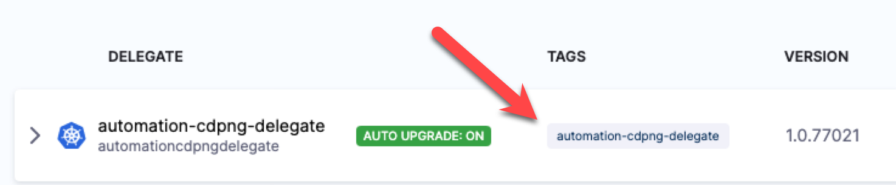

## Create custom Deployment Template

You can create a Deployment Template at the Account, Org, or Project level. For this tutorial, we'll use the Project level.

1. In your Harness Project, click **Project Setup**.
2. Click **Templates**.
3. Click **New Template**.
4. Select **Deployment**.
1. In **Create New Deployment Template**, in **Name**, enter **DT**.
2. In **Version Label**, enter **v1**.In **Logo**, you can upload an image to use as the icon for this template.
  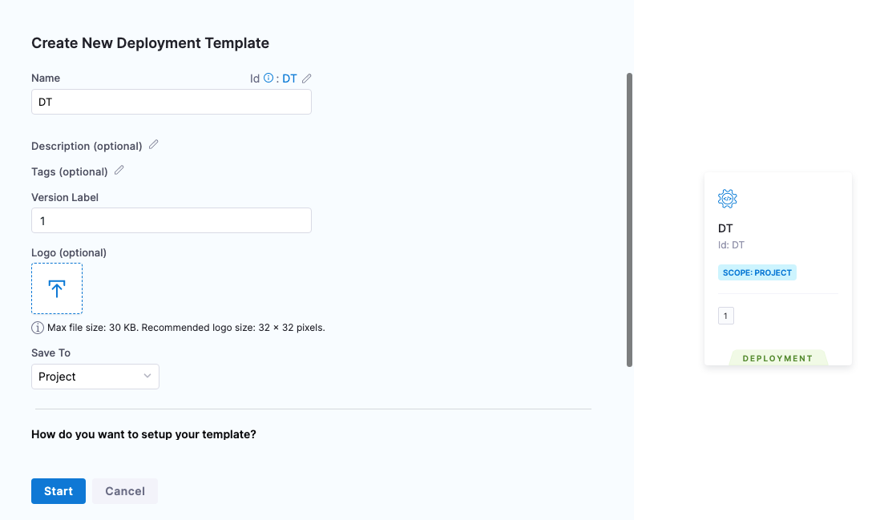
3. Click **Start**.

The Deployment Template is composed of two major sections:

- **Infrastructure:**

  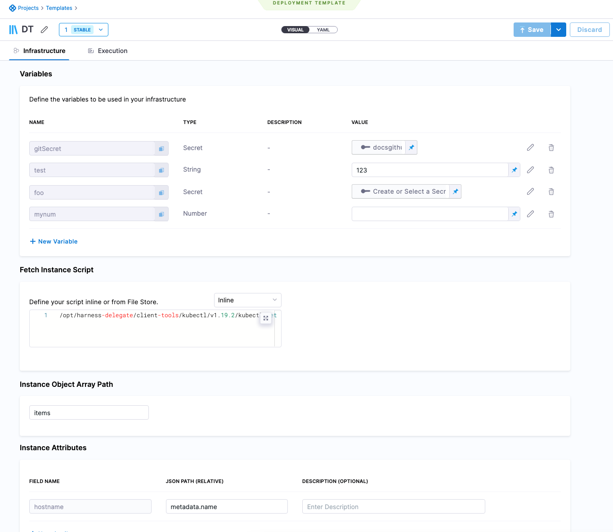

  - **Variables:** variables that can be used when the script is run.
  - **Fetch Instances Script:** script needed to fetch a JSON array of the target instances. The script can be entered here or you can use the [Harness File Store](../x-platform-cd-features/services/add-inline-manifests-using-file-store.mdo share scripts with others.
  - **Instance Object Array Path:** the JSON path to the label that lists the array of instances, such as `items`.
  - **Instance Attributes:** the JSON path to the instance name label for the target instances.Mapping the fieldname `instancename` to the JSON Path is mandatory.You can add more instance attributes for additional target instance values you want to use.
- **Execution:**
  
  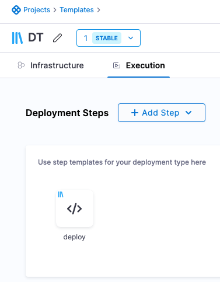

  - Any steps that you want to use in the stage and associate with this template. If you create these in the Deployment Template, they are automatically created as separate Step Templates.
  - Your stage is not limited to using these steps. You can add any steps you want to your stage.

For this tutorial, we'll only use some of these settings, but the rest of the settings are described in [Notes](#notes).

## Add the Fetch Instance Script

In **Fetch Instance Script**, you enter the script to pull the JSON collection of target instances from a server or service.

The script is expected to query the server and receive a JSON array containing the target hosts, saved in the file `$INSTANCE_OUTPUT_PATH`.

This shell script will be executed at runtime by the Harness Delegate on its host. This should be a shell script you have run on the Delegate host to ensure that the host can connect to your server(s).

The script should return a JSON array containing the target host information Harness needs to deploy.

The script you use depends on the platform you're using.

For this tutorial, we want to deploy to all the Kubernetes pods in the namespace example, so our script looks like this:

```bash
/opt/harness-delegate/client-tools/kubectl/v1.19.2/kubectl get pods --namespace=harness-delegate-ng -o json > $INSTANCE_OUTPUT_PATH
```

If you want, you can replace the namespace `harness-delegate-ng` with a namespace in your own cluster that has pods that can be fetched.

**Important:** The `$INSTANCE_OUTPUT_PATH` expression must come last. You can enter the script inline, or use the Harness File Store to store it in a file.

This script returns a JSON array of pods in the namespace, similar to this:


```json
{  
    "apiVersion": "v1",  
    "items": [  
        {  
            "apiVersion": "v1",  
            "kind": "Pod",  
            "metadata": {  
                "creationTimestamp": "2022-09-28T20:13:50Z",  
                "generateName": "example-deployment-69877c747f-",  
                "labels": {  
                    "pod-template-hash": "69877c747f"  
                },  
                "name": "example-deployment-69877c747f-gllvt",  
                "namespace": "harness-delegate-ng",  
...  
        {  
            "apiVersion": "v1",  
            "kind": "Pod",  
            "metadata": {  
                "creationTimestamp": "2022-09-28T20:13:50Z",  
                "generateName": "example-deployment-69877c747f-",  
                "labels": {  
                    "pod-template-hash": "69877c747f"  
                },  
                "name": "example-deployment-69877c747f-gpkkk",  
                "namespace": "harness-delegate-ng",  
...  
}
```

This example uses Kubernetes. Harness already has full, first-class support for Kubernetes deployments. We just use this script as an example. 

For the main Kubernetes support, go to [Kubernetes deployment tutorial](/docs/continuous-delivery/deploy-srv-diff-platforms/kubernetes/kubernetes-cd-quickstart).

Next, you need to provide the JSON path to the JSON array object for the target hosts.

## Define the Instance Object Array Path

1. In **Instance Object Array Path**, you enter the JSON path to the JSON array object. In our example above, you can see that the array is under `items`.
2. In **Instance Object Array Path**, you simply enter `items`. Harness will use this path to traverse the JSON array.

## Define Instance Attributes

Now that you have provided a path to the instances array, you can map any useful JSON keys in **Instance Attributes**.

**Important** The `instancename` value in the Field Name setting is **mandatory**.

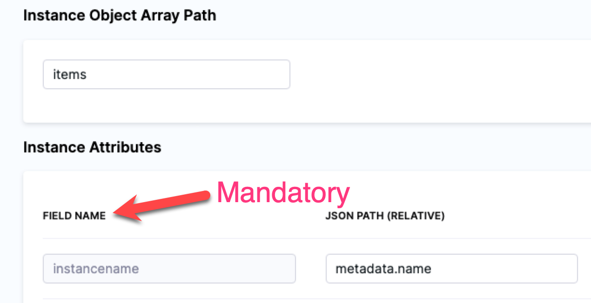

You must use `instancename` to identify the target host(s) in the JSON array.

For our Kubernetes example, we will use:

* **Field Name:** `instancename`.
* **JSON Path:** `metadata.name`.

You can map any additional attributes containing information you want to reference in your Execution, most likely in a Shell Script step. See [Referencing fetched instances using expressions](#referencing_fetched_instances_using_expressions).

## Add Execution steps

1. Now that the Deployment Template **Infrastructure** is complete, click **Continue** to view **Exectuion**.

  You can create or select step templates in Execution.

  You don't have to use any of these steps in your stage. Execution is simply a way of associating steps with Deployment Templates.

  We'll create a Shell Script step template to deploy our Docker image artifact to the instances we fetch using the script we added in **Fetch Instance Script**.

1. In **Deployment Steps**, click **Add Step**, and click **Create and Use Template**.
2. In **Step Library**, click **Shell Script**.
3. In **Name**, enter **deploy**.
4. In **Script**, enter the following:
  
  ```bash
  /opt/harness-delegate/client-tools/kubectl/v1.19.2/kubectl apply -f deployment.yaml
  ```
1. Click **Save**.
2. In **Save as new Template**, in **Name**, enter **deploy**.
3. In **Version Label**, enter **v1**.
  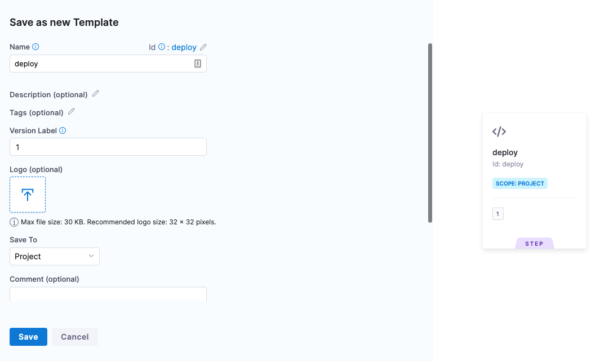
4. Click **Save**. The step template is added to the Deployment Template.
  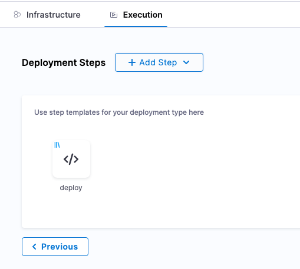
5. Click **Save** to save the Deployment Template. If you haven't already, name the Deployment Template **DT**.

## Create the Pipeline

Now we'll create a Harness Pipeline that will use the Deployment Template.

1. Click **Pipelines**.
2. Click **Create a Pipeline**.
3. In **Create new Pipeline**, enter the name **DT Tutorial**, and click **Start**.
4. Click **Add Stage**.
5. Click **Deploy**, and enter the name **DT Tutorial**.
6. In **Deployment** **Templates**, click the Deployment Template you created, **DT**, and then click **Use Template**.  
  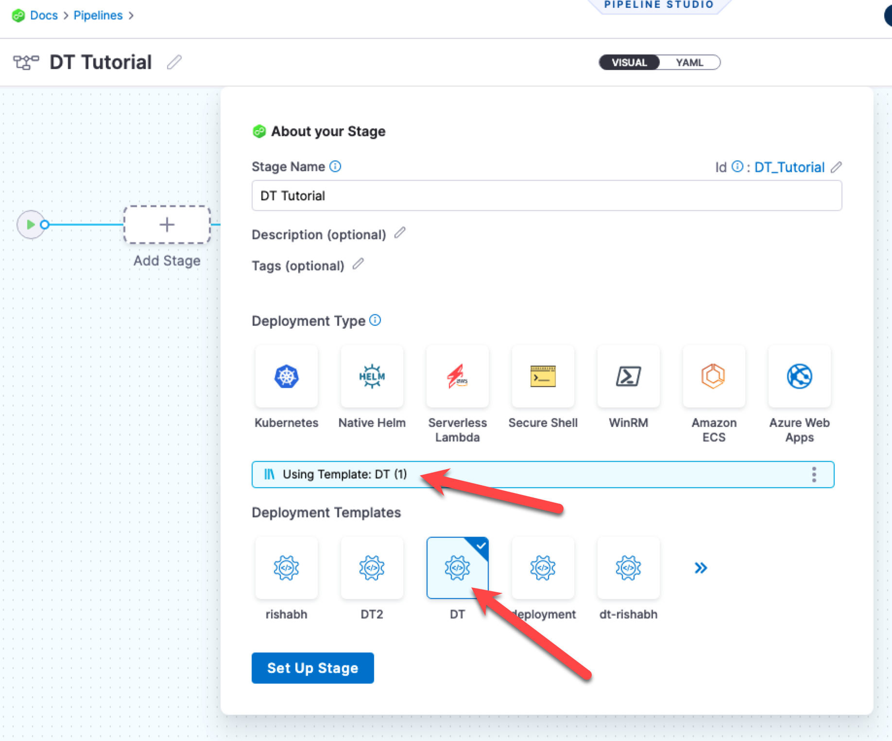
7. Click **Set Up Stage**.

The stage is created and you are on the **Service** tab.

Next we'll define the Harness Service using the Deployment Template you created and a Docker artifact for deployment.

If you are new to Harness, learn about the basics in [CD overview and key concepts](/docs/continuous-delivery/get-started/cd-pipeline-basics) and [CD Pipeline modeling overview](/docs/continuous-delivery/get-started/cd-pipeline-modeling-overview).

## Create the Service

Next, we'll add the artifact for deployment to the Harness Service.

You don't always need to add an artifact to the Harness Service. If the script in your deployment step(s) pulls in an artifact, or uses in a hardcoded artifact in a spec or manifest, you can skip adding the artifact to the Harness Service.

1. In **Select Service**, click **Add Service**.
2. Name the new Service **DT Tutorial**.
3. In **Deployment Type**, you can see your template is selected.

Now let's add the Docker image for deployment.

## Add the Docker image to deploy

1. In **Artifacts**, click **Add Primary Artifact**.
2. In **Specify Artifact Repository Type**, click **Docker Registry**, and click **Continue**.
3. In **Docker Registry Repository**, click **New Docker Registry Repository**.
4. In **Overview**, enter the name **Docker Hub**, and click **Continue**.
5. In **Docker Registry URL**, enter the following:
	1. **URL** `https://registry.hub.docker.com/v2/`.
	2. In **Authentication**, select **Anonymous**, and click **Continue**.
  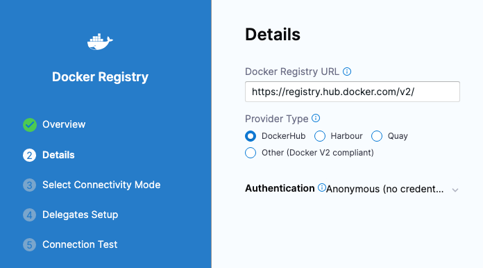
6. In **Connect to the provider**, click **Connect through a Harness Delegate**, and then click **Continue**.
7. In **Delegates Setup**, click **Only use Delegates with all of the following tags**, and then enter the tag of the Delegate you set up earlier.
8. Click **Save and Continue**.
9. After the test, click **Continue**.
10. In **Artifact Details**, enter the following:
	3. **Image Path:** `library/nginx`.
	4. **Tag:** Change the setting to a **Fixed value**, and then select **perl**.
11. Click **Submit**. The artifact is now added to the Service.
  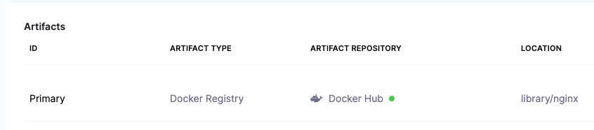
1.  Click **Save**. The Service is now added to the stage.
  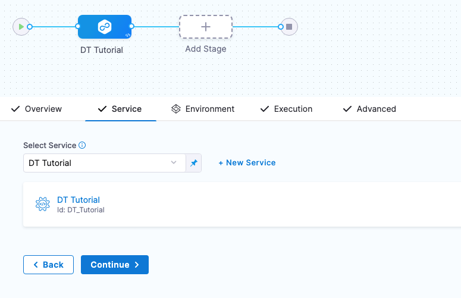
1. Click **Continue** to set up the Environment for the stage.

## Referencing the artifact in your files

Later, in the stage Execution, we will add a deployment step that will download and apply a Kubernetes manifest. The manifest is located in a [public GitHub repo](https://github.com/wings-software/harness-docs/blob/main/default-k8s-manifests/Manifests/deployment.yaml). 

In order for the manifest's Deployment object to use the artifact added to Harness, the expression `<+artifact.image>` is added to the image label (`image: <+artifact.image>`).

You must use `<+artifact.image>` somewhere in your stage Execution to reference the artifact you added to Harness. You can reference it in a Shell Script step, a spec or manifest, or any other relevant step or setting.

If you do not use `<+artifact.image>`, Harness will not attempt to download and deploy the artifact.

For non-containerized artifacts, use `<+artifact.path>`.

To learn more, go to [Built-in and Custom Harness Variables Reference](/docs/platform/Variables-and-Expressions/harness-variables#artifact).

## Create the Environment

You can create Environments and their Infrastructure Definitions inside a stage or in the **Environments** section of your Project. In this tutorial, we'll create everything inside the stage.

1. In **Specify Environment**, click **New Environment**.
2. Name the Environment **DT Tutorial**, click **Pre-Production**, and then click **Save**.
3. Click **New Infrastructure**.
  You can see that any variables you added to the Deployment Template are displayed. You can override their values here these new values will be used in this stage.
4. Name the Infrastructure Definition **DT Tutorial**, and then click **Save**.
  The Infrastructure Definition is added to the stage.
  
  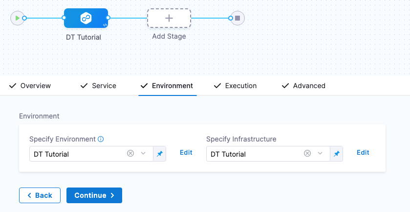

  Next, we'll define the Execution steps for the deployment.
5. Click **Continue** to see Execution.

## Define the Execution

The **Fetch Instances** step is added automatically.

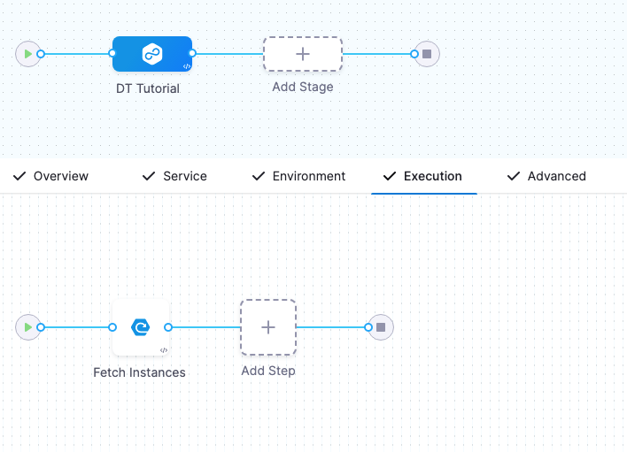

When the pipeline runs, that step will run your Deployment Template's script and traverse the JSON instances array returned to identify the target instances for deployment.

Execution has Fetch Instances but it still needs a step for deployment.

1. Click the **+** sign after **Fetch Instances** and select **Deployment Template Steps**.
  
  We are adding the deployment step after **Fetch Instances** because we know there are existing pods to be fetched in the `default` namespace.
  
  The **deploy** step you added to the Deployment Template is displayed.
  
  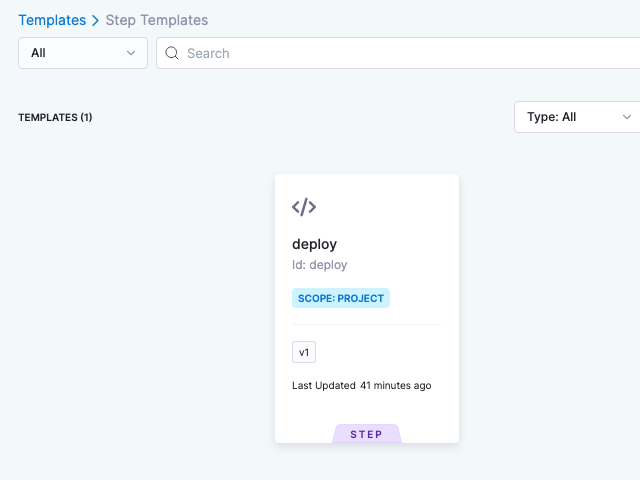

2. Click the **deploy** step and click **Use Template**.
3. Enter the name **DT Tutorial** for the step and click **Apply Changes**.

Let's add one more step to describe the deployment and see how it worked on each fetched instance.

1. After the **DT Tutorial** step, click **Add Step**, and select **Shell Script**.
2. Name the step **kubectl describe deployments**.
3. In **Script**, enter the following:
   
```bash
kubectl describe deployment nginx-deployment
```
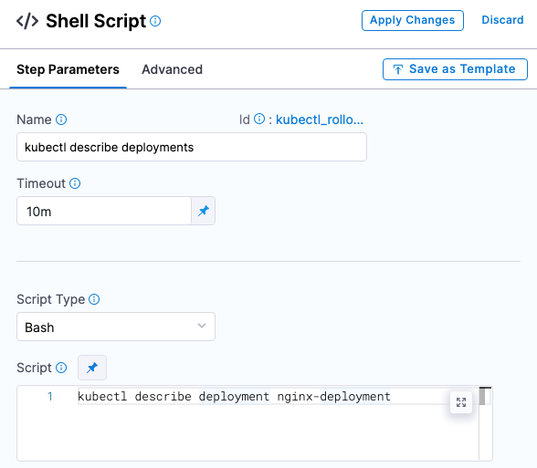

Next, we need this script to loop through all the fetched instances. We do that by using a [Looping Strategy](../../platform/8_Pipelines/looping-strategies-matrix-repeat-and-parallelism.mdn the step's **Advanced** section.

1. Click **Advanced**.
2. Click **Looping Strategy**.
3. Click Repeat, and enter the following script:

  ```yaml
  repeat:  
    items: <+stage.output.hosts>
  ```

  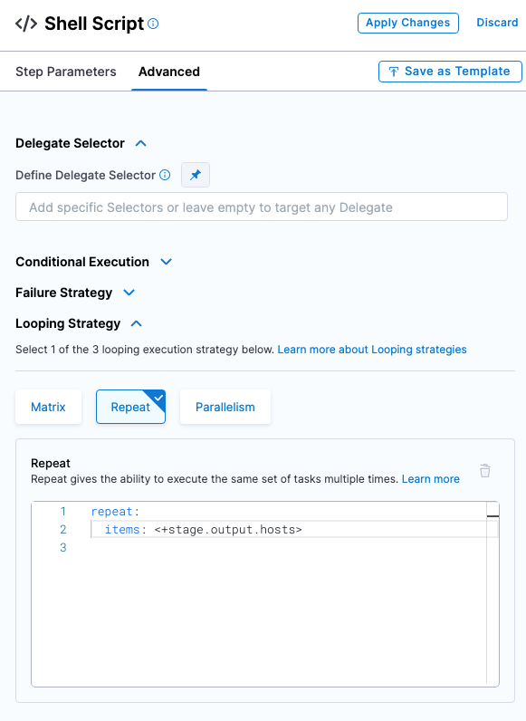

  The `<+stage.output.hosts>` expression references all of the hosts/pods/instances returned by your script.
4. Click **Apply Changes**.

Execution is complete. Now we'll select the Delegate you set up as the Delegate to use for the entire stage.

## Select the Delegate for the stage

You don't have to use the same Delegate for the entire stage. If multiple Delegates are used, Harness will ensure that they can perform the deployment.

For this tutorial, we'll use a single Delegate because we are deploying to its cluster.

1. Click the **Advanced** tab.
2. Click in **Define Delegate Selector** and select the tag of the Delegate you installed earlier.

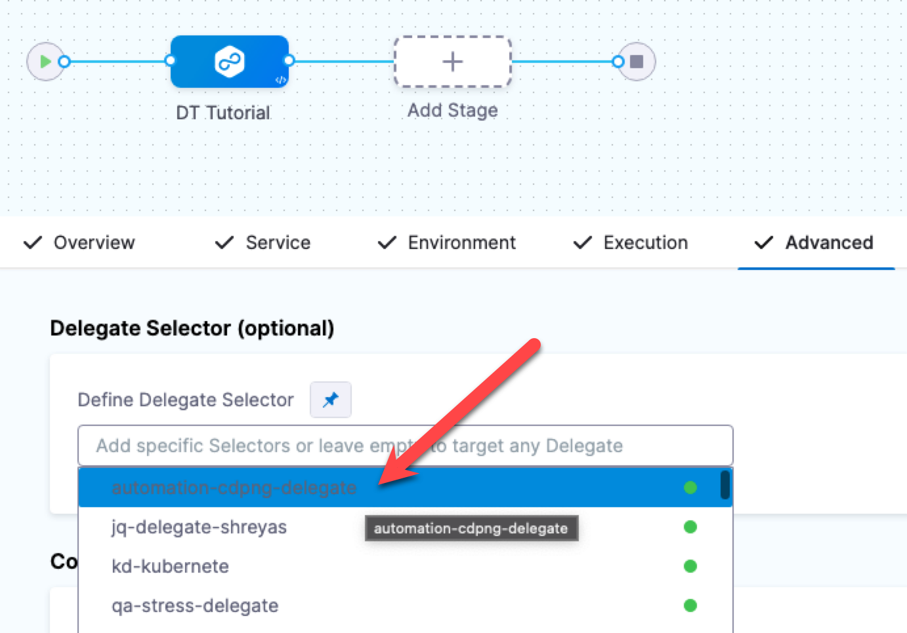

## Run and verify the pipeline

1. Click **Save**. The Pipeline is ready to run.
2. Click **Run**, and then click **Run Pipeline**.

The Pipeline runs and you can see the Kubernetes Deployment object created and the target instances fetched.

Click the **Fetch Instances** step, and then click **Output** to see the instances output from your script:

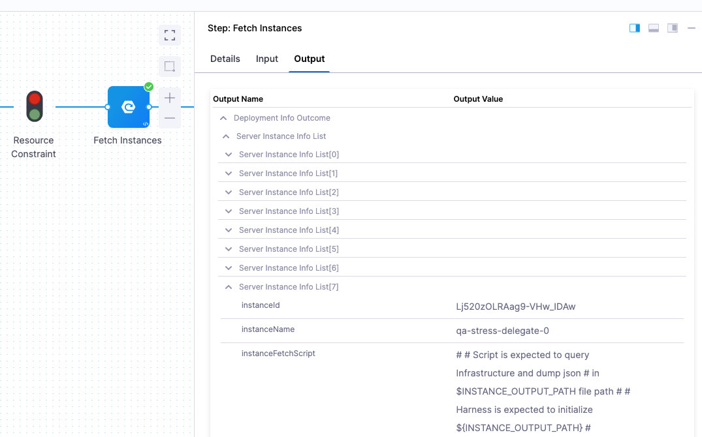

Lastly, look at the **kubectl describe deployments** step to see the deployment on each pod:

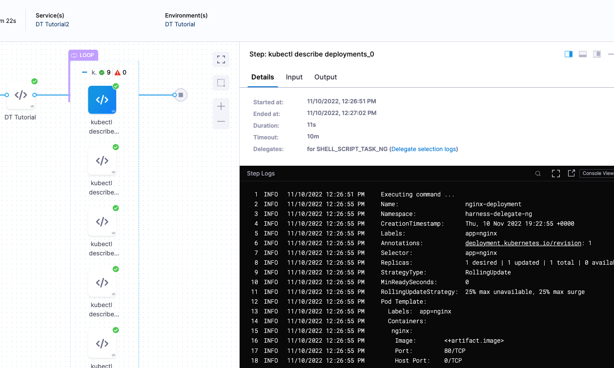

Congratulations!

## Review

You successfully deployed an artifact to a Kubernetes cluster using a Harness Deployment Template.

In this tutorial, you learned how to:

* Install and register a Harness Delegate.
* Create the Deployment Template.
* Create the Deployment Template Pipeline.
* Add your Docker image to Harness.
* Define the Pipeline Service, Infrastructure, and Execution.
* Run and verify the deployment.

## Notes

See the following sections for information on other settings.

### Deployment Template Infrastructure variables

You can create the following types of variables.

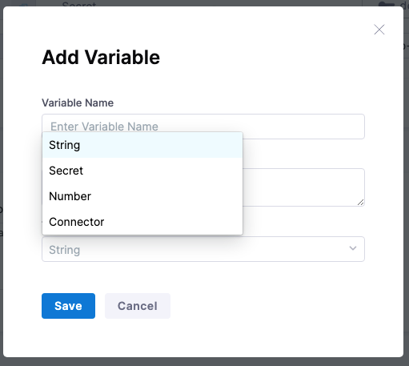

* **String:** any string you might want to reference in your stage steps.
* **Secret:** select or create a secret in Harness using Harness default Secret Manager or a Secret Manager you have configured in Harness. For more information, go to [Secrets and Secret Management](/docs/category/security).
* **Number:** a number you might want to reference in your stage steps.
* **Connector:** a Harness Connector that you want to use for this deployment. Any Connector can be used, such as an infrastructure Connector, like an AWS Connector, or a repo Connector for your manifests and specs, like a GitHub Connector.

#### Using variables

These are variables that you can use in the following places:

* In the script in **Fetch Instances** step. For example, you can create a variable for the URL that the script in **Fetch Instances** uses.
* Any step in your stage **Execution**.

#### Referencing variables

You reference variables using a Harness expression with the syntax `<+infra.variables.[variable Id]>`. You can reference any setting in the variable entity, such as a Connector's URL.

Here are some examples.

First, here's the variables:

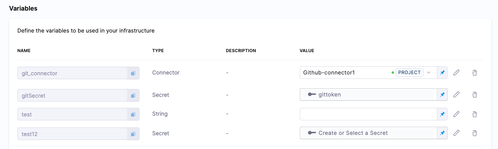

Here's the expressions referencing these variables:

```
<+infra.variables.git_connector.spec.url>

<+infra.variables.git_connector.spec.authentication.type>

<+infra.variables.git_connector.spec.authentication.spec.type>

<+infra.variables.git_connector.spec.authentication.spec.spec.username>

<+infra.variables.git_connector.spec.authentication.spec.spec.tokenRef>

<+secrets.getValue(<+infra.variables.git_connector.spec.authentication.spec.spec.tokenRef.identifier>)>

<+stage.spec.infrastructure.output.variables.gitSecret>

<+infra.variables.gitSecret>

<+infra.variables.test1>

<+infra.variables.test12>
```

Reference [Secret Manager](/docs/platform/Secrets/Secrets-Management/add-secrets-manager) connector variables using the following expressions.

* [AWS KMS](/docs/platform/Secrets/Secrets-Management/add-an-aws-kms-secrets-manager): `<+infra.variables.AwsKms.spec.credential.type>`
* [AWS Secrets Manager](/docs/platform/Secrets/Secrets-Management/add-an-aws-secret-manager): `<+infra.variables.AwsSecretsManager.spec.region>`
* [Azure Key Vault](/docs/platform/Secrets/Secrets-Management/azure-key-vault): `<+infra.variables.AzureKeyVault.spec.vaultName>`
* [Google KMS](/docs/platform/Secrets/Secrets-Management/add-google-kms-secrets-manager): `<+infra.variables.GcpKms.spec.keyName>`
* [Google Cloud secret manager](/docs/platform/Secrets/Secrets-Management/add-a-google-cloud-secret-manager): `<+infra.variables.GcpSecMan.spec.credentialsRef.identifier>`
* [Custom secret manager](/docs/platform/Secrets/Secrets-Management/custom-secret-manager): `<+infra.variables.CustomSecMan.spec.isDefault>`
* [HashiCorp Vault](/docs/platform/Secrets/Secrets-Management/add-hashicorp-vault): `<+infra.variables.HashiCorp.spec.vaultUrl>`

#### Overwriting variables

When you define the Infrastructure Definition in your stage **Environment**, you can override any variable values.

| **Deployment Template** | **Infrastructure Definition** |
| --- | --- |
|  ../static/dtinfra2.pngnfra2.png) |

#### Target host instance variable expressions

You can use `<+instance...>` expressions to reference host(s) properties.

The `<+instance...>` expressions refer to the **Instance Attributes** in the Deployment Template:

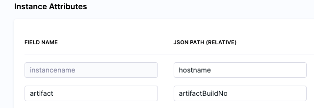

The following expressions refer to instance(s) collected by the mandatory **instancename** field:

* [<+instance.hostName>](/docs/platform/Variables-and-Expressions/harness-variables#instancehostname)
* [<+instance.host.hostName>](/docs/platform/Variables-and-Expressions/harness-variables#instancehostinstancename)
* [<+instance.name>](/docs/platform/Variables-and-Expressions/harness-variables#instancename)

The expression `<+instance.host.properties.[property name]>` can used to reference the other properties you added to **Instance Attributes**.

For example, in the example above you can see the `artifact` field name mapped to the `artifactBuildNo` property.

To reference `artifact` you would use `<+instance.host.properties.artifact>`.

`instance.name` has the same value as `instance.hostName`. Both are available for backward compatibility.

To use these expressions, you need to enable the Repeat Looping Strategy and use the expression `<+stage.output.hosts>` on the step that follows **Fetch Instances**.

For example, here is a Shell Script step that outputs these expressions:

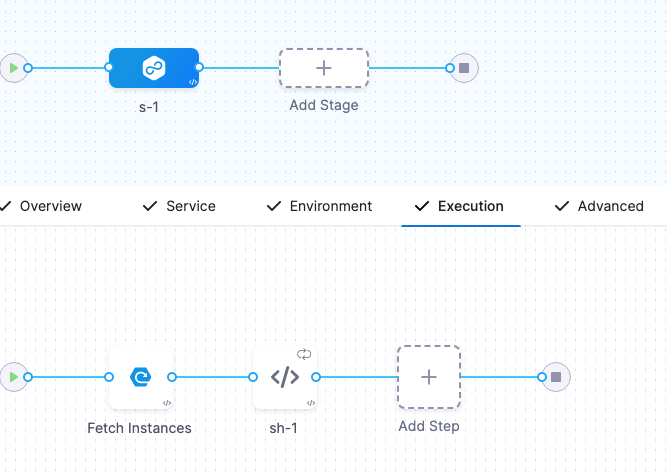

1. In the step, in **Advanced**, click **Looping Strategy**.
2. Select **Repeat**.
3. In **Repeat**, use the Repeat [Looping Strategy](/docs/platform/Pipelines/looping-strategies-matrix-repeat-and-parallelism) and identify all the hosts for the stage as the target:

```yaml
repeat:  
  items: <+stage.output.hosts>
```
Now when this step runs, it will run on every host returned by **Fetch Instances**.

### Where to put Fetch Instances and deployment steps

The stage Execution must include the **Fetch Instances** step and a step to deploy the artifact to the instances fetched.

Typically, the deployment steps come after the **Fetch Instances** step because you are fetching existing instances.

### Command step in Deployment Template deployments

A Command step can run scripts, download artifacts, or copy artifacts and config files.

Since a Deployment Template can be used on any host type, the Command step can only be run on the Delegate. You must use the **Run on Delegate** option in the step.

Consequently, there is no reason to use a Looping Strategy when using the Command step with Deployment Templates.

For more information, go to [Use the Command step to download, copy, or run scripts](/docs/continuous-delivery/x-platform-cd-features/cd-steps/cd-general-steps/download-and-copy-artifacts-using-the-command-step).

### Payloads without High-Level Objects

In some cases, you might have a JSON payload without a high-level object. In these cases, you can use `$` in **Host Object Array Path**.

Let's look at an example:

```json
[  
  {  
    "id": "aef-default-0000000000000-qnhh",  
    "instance": {  
      "id": "aef-default-0000000000000-qnhh",  
      "name": "apps/sales/services/default/versions/0000000000000/instances/aef-default-0000000000000-qnhh",  
      "startTime": "2021-01-07T21:05:54.658Z",  
      "vmIp": "192.168.0.0",  
      "vmLiveness": "HEALTHY",  
      "vmStatus": "RUNNING"  
    },  
    "service": "default",  
    "version": "0000000000000"  
  },  
  {  
    "id": "aef-default-0000000000000-0sbt",  
    "instance": {  
      "id": "aef-default-0000000000000-0sbt",  
      "name": "apps/sales/services/default/versions/0000000000000/instances/aef-default-0000000000000-0sbt",  
      "startTime": "2021-01-07T21:05:46.262Z",  
      "vmIp": "192.168.255.255",  
      "vmLiveness": "HEALTHY",  
      "vmStatus": "RUNNING"  
    },  
    "service": "default",  
    "version": "0000000000000"  
  }  
]
```

In this example, the **Host Object Array Path** is `$` and the **instancename** field would use  `instance.vmIp`.

### Referencing fetched instances using expressions

You can reference each instance fetched by the **Fetched Instances** step using the step's **Output** tab.


You can expand each instances and copy the expression for the instance metadata you need.

For example, the expression for the instancename of the 4th instance fetched here is (the stage name is `DT_Tutorial`):

```
<+pipeline.stages.DT_Tutorial.spec.execution.steps.fetchInstances.deploymentInfoOutcome.serverInstanceInfoList[3].hostName>
```

To reference the entire instance list, you can use this expression:

```
<+pipeline.stages.DT_Tutorial.spec.execution.steps.fetchInstances.deploymentInfoOutcome.serverInstanceInfoList>
```

