In some cases, you might be using a platform that does not have first-class support in Harness, such as OpenStack, WebLogic, WebSphere, etc. We call these non-native deployments.

For non-native deployments, Harness provides a custom deployment option using Deployment Templates.

Deployment Templates use shell scripts to connect to target platforms, obtain target host information, and execute deployment steps.

This tutorial will walk you through very simple Deployment Templates using Kubernetes. Harness includes first-class Kubernetes support (see [Kubernetes deployment tutorial](/docs/continuous-delivery/deploy-srv-diff-platforms/kubernetes/kubernetes-cd-quickstart)), but we will use it in this tutorial as it is a very simple way to review Deployment Templates features.

## Objectives

You'll learn how to:

* Install and register a Harness Delegate for Deployment Templates use cases.
* Create the Deployment Template.
	* Add a script to fetch a JSON array containing target instance information.
* Create the Deployment Template Pipeline.
* Add your Docker image to Harness.
* Define the Pipeline Service, Infrastructure, and Execution.
* Run and verify the deployment.

The tutorial should only take about 15 minutes.

## Custom deployment using Deployment Templates summary

Here is a summary of the steps for setting up custom deployments using Deployment Templates:

1. Create a Deployment Template.
	1. In the template, include a script that returns a JSON array containing a list of the target instances where Harness will deploy your artifact.
	2. Identify the array path to the host object in the JSON so Harness can locate these at deployment runtime.
	3. Map any important host attributes that you want to reference later, like IP, region, etc.
2. Create a Harness Pipeline stage using the Deployment Template type and the Deployment Template.
	1. In your Harness Pipeline stage Service, create a Harness Service that uses the Deployment Template. Add the artifact you want to deploy.
	2. In your Harness Pipeline stage Environment, create a Harness Infrastructure Definition that uses the Deployment Template.
	3. In your Harness Pipeline stage Execution, review the automatically added **Fetch Instances** step, and move it to wherever you want to execute the script from your Deployment Template.
	4. Add a deployment step to Execution to deploy your artifact to the instances retrieved using the **Fetch Instances** step.

That's it. Your Pipeline will fetch the target instances as you requested and deploy your artifact to them.

## Important notes

Unlike the deployments for supported platforms, like Kubernetes and AWS, Deployment Templates have certain limitations:

* All artifact providers and [Custom artifact](/docs/continuous-delivery/x-platform-cd-features/services/add-a-custom-artifact-source-for-cd) are supported:  

|        **Type**         | **Nexus3** | **Artifactory** | **Jenkins** | **Amazon S3** | **Docker Registry** | **AWS ECR** | **GCR** | **ACR** | **Google Artifact Registry** | **Custom** | **GCS** | **Bamboo** | **AMI** | **Azure Artifacts** |
| ----------------------- | ---------- | --------------- | ----------- | ------------- | ------------------- | ----------- | ------- | ------- | ---------------------------- | ---------- | ------- | ---------- | ------- | ------------------- |
| Docker                  | ✅          | ✅               |             |               | ✅                   | ✅           | ✅       | ✅       |                              | ✅          | ✅       | ✅          |         |                     |
| Other (ZIP, Jobs, etc.) | ✅          | ✅               | ✅           | ✅             |                     |             |         |         | ✅                            | ✅          |         | ✅          | ✅       | ✅                   |

* No steady state checks on deployed services.
* Harness does not track releases.

You can add your own scripts or tests to your Pipelines to describe deployments, check steady state, and track releases. For example, using the [Shell Script](/docs/continuous-delivery/x-platform-cd-features/cd-steps/utilities/shell-script-step) or [HTTP](/docs/continuous-delivery/x-platform-cd-features/cd-steps/utilities/http-step) steps.

## Harness Delegate setup

1. Install a Harness Kubernetes Delegate in a cluster. For steps on installing a Delegate, go to [Install a delegate](/docs/platform/delegates/install-delegates/overview).

  The Delegate you use for Deployment Templates should be in an environment where it can connect and query your artifact repo and target instances. Typically, you'll want a Delegate in the same subnet as the target instances.

  If your scripts will use utilities or software that does not come with the Delegate by default, you can install them on the Delegate manually or using the Delegate `INIT_SCRIPT` environment variable.

  For steps on using `INIT_SCRIPT`, see [Build custom delegate images with third-party tools](/docs/platform/delegates/install-delegates/build-custom-delegate-images-with-third-party-tools).

  Harness Delegate installation packages include `TAR` and `cURL`. You can use `cURL` and `TAR` in your Delegate scripts and Pipeline steps without installing these tools.

  Harness Delegate installation packages also include standard tools and SDKs for the main platform integrations Harness uses, such as Kubernetes, Helm, AWS, Azure, GCP. You do not need to install their CLI tools on the Delegate.

  Once the Delegate is installed and registers with your Harness account, you will see it listed on the Delegates page.

1. Note the default tag added to the Delegate. You will use this to select this Delegate in future steps.

   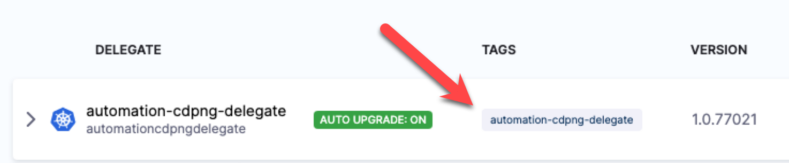

## Create custom Deployment Template

You can create a Deployment Template at the Account, Org, or Project level. For this tutorial, we'll use the Project level.

1. In your Harness Project, click **Project Setup**.
2. Click **Templates**.
3. Click **New Template**.
4. Select **Deployment**.
1. In **Create New Deployment Template**, in **Name**, enter **DT**.
2. In **Version Label**, enter **v1**.In **Logo**, you can upload an image to use as the icon for this template.
  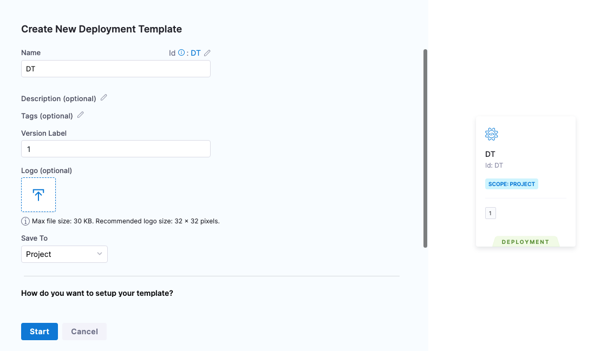
3. Click **Start**.

The Deployment Template is composed of two major sections:

- **Infrastructure:**

  

  - **Variables:** variables that can be used when the script is run.
  - **Fetch Instances Script:** script needed to fetch a JSON array of the target instances. The script can be entered here or you can use the [Harness File Store](../x-platform-cd-features/services/add-inline-manifests-using-file-store.mdo share scripts with others.
  - **Instance Object Array Path:** the JSON path to the label that lists the array of instances, such as `items`.
  - **Instance Attributes:** the JSON path to the instance name label for the target instances.Mapping the fieldname `instancename` to the JSON Path is mandatory.You can add more instance attributes for additional target instance values you want to use.
- **Execution:**
  
  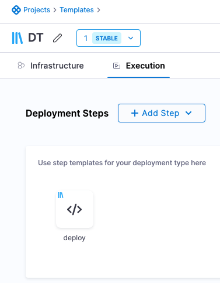

  - Any steps that you want to use in the stage and associate with this template. If you create these in the Deployment Template, they are automatically created as separate Step Templates.
  - Your stage is not limited to using these steps. You can add any steps you want to your stage.

For this tutorial, we'll only use some of these settings, but the rest of the settings are described in [Notes](#notes).

## Add the Fetch Instance Script

In **Fetch Instance Script**, you enter the script to pull the JSON collection of target instances from a server or service.

The script is expected to query the server and receive a JSON array containing the target hosts, saved in the file `$INSTANCE_OUTPUT_PATH`.

This shell script will be executed at runtime by the Harness Delegate on its host. This should be a shell script you have run on the Delegate host to ensure that the host can connect to your server(s).

The script should return a JSON array containing the target host information Harness needs to deploy.

The script you use depends on the platform you're using.

For this tutorial, we want to deploy to all the Kubernetes pods in the namespace example, so our script looks like this:

```bash
/opt/harness-delegate/client-tools/kubectl/v1.19.2/kubectl get pods --namespace=harness-delegate-ng -o json > $INSTANCE_OUTPUT_PATH
```

If you want, you can replace the namespace `harness-delegate-ng` with a namespace in your own cluster that has pods that can be fetched.

**Important:** The `$INSTANCE_OUTPUT_PATH` expression must come last. You can enter the script inline, or use the Harness File Store to store it in a file.

This script returns a JSON array of pods in the namespace, similar to this:


```json
{  
    "apiVersion": "v1",  
    "items": [  
        {  
            "apiVersion": "v1",  
            "kind": "Pod",  
            "metadata": {  
                "creationTimestamp": "2022-09-28T20:13:50Z",  
                "generateName": "example-deployment-69877c747f-",  
                "labels": {  
                    "pod-template-hash": "69877c747f"  
                },  
                "name": "example-deployment-69877c747f-gllvt",  
                "namespace": "harness-delegate-ng",  
...  
        {  
            "apiVersion": "v1",  
            "kind": "Pod",  
            "metadata": {  
                "creationTimestamp": "2022-09-28T20:13:50Z",  
                "generateName": "example-deployment-69877c747f-",  
                "labels": {  
                    "pod-template-hash": "69877c747f"  
                },  
                "name": "example-deployment-69877c747f-gpkkk",  
                "namespace": "harness-delegate-ng",  
...  
}
```

This example uses Kubernetes. Harness already has full, first-class support for Kubernetes deployments. We just use this script as an example. 

For the main Kubernetes support, go to [Kubernetes deployment tutorial](/docs/continuous-delivery/deploy-srv-diff-platforms/kubernetes/kubernetes-cd-quickstart).

Next, you need to provide the JSON path to the JSON array object for the target hosts.

### Important notes on the Fetch Instances script

- The script must return an array of target instances (virtual machine, pod. etc.). If the template is to be used for executing a trigger to an external orchestrator (for example, Ansible, Puppet, etc.), the script should query the orchestrator to return the total instances running inside. If the script simply returns the application name, Harness cannot track the actual SI count.
- If a service is scaling up/down post-deployemnt, the Fetch Instances script should be written in that way that it should always return the current state of the system. This script is run periodically post-deployment as part of a perpetual task.

## Define the Instance Object Array Path

1. In **Instance Object Array Path**, you enter the JSON path to the JSON array object. In our example above, you can see that the array is under `items`.
2. In **Instance Object Array Path**, you simply enter `items`. Harness will use this path to traverse the JSON array.

## Define Instance Attributes

Now that you have provided a path to the instances array, you can map any useful JSON keys in **Instance Attributes**.

**Important** The `instancename` value in the Field Name setting is **mandatory**.

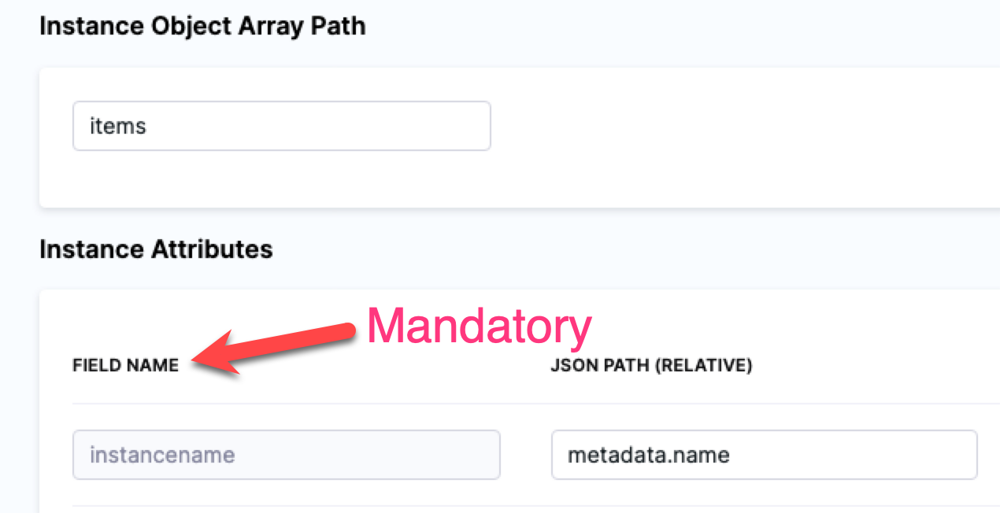

You must use `instancename` to identify the target host(s) in the JSON array.

For our Kubernetes example, we will use:

* **Field Name:** `instancename`.
* **JSON Path:** `metadata.name`.

You can map any additional attributes containing information you want to reference in your Execution, most likely in a Shell Script step. See [Referencing fetched instances using expressions](#referencing-fetched-instances-using-expressions).

## Add Execution steps

1. Now that the Deployment Template **Infrastructure** is complete, click **Continue** to view **Execution**.

  You can create or select step templates in Execution.

  You don't have to use any of these steps in your stage. Execution is simply a way of associating steps with Deployment Templates.

  We'll create a Shell Script step template to deploy our Docker image artifact to the instances we fetch using the script we added in **Fetch Instance Script**.

1. In **Deployment Steps**, click **Add Step**, and click **Create and Use Template**.
2. In **Step Library**, click **Shell Script**.
3. In **Name**, enter **deploy**.
4. In **Script**, enter the following:
  
  ```bash
  /opt/harness-delegate/client-tools/kubectl/v1.19.2/kubectl apply -f deployment.yaml
  ```
1. Click **Save**.
2. In **Save as new Template**, in **Name**, enter **deploy**.
3. In **Version Label**, enter **v1**.
  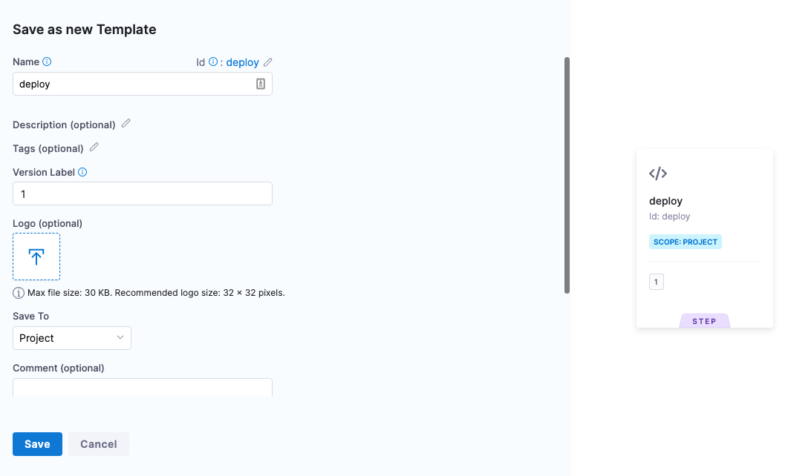
4. Click **Save**. The step template is added to the Deployment Template.
  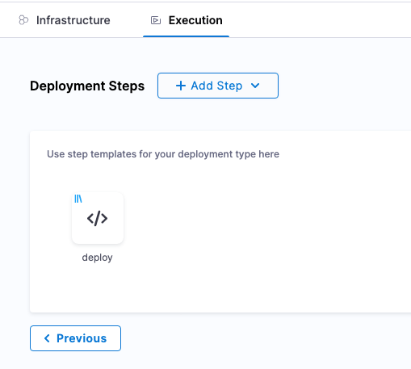
5. Click **Save** to save the Deployment Template. If you haven't already, name the Deployment Template **DT**.

## Create the Pipeline

Now we'll create a Harness Pipeline that will use the Deployment Template.

1. Click **Pipelines**.
2. Click **Create a Pipeline**.
3. In **Create new Pipeline**, enter the name **DT Tutorial**, and click **Start**.
4. Click **Add Stage**.
5. Click **Deploy**, and enter the name **DT Tutorial**.
6. In **Deployment** **Templates**, click the Deployment Template you created, **DT**, and then click **Use Template**.  
  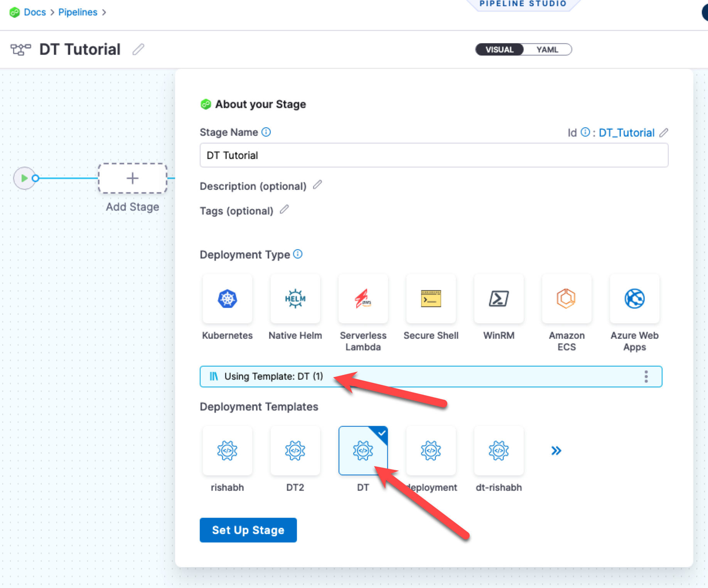
7. Click **Set Up Stage**.

The stage is created and you are on the **Service** tab.

Next we'll define the Harness Service using the Deployment Template you created and a Docker artifact for deployment.

If you are new to Harness, learn about the basics in [CD overview and key concepts](/docs/continuous-delivery/get-started/key-concepts) and [CD Pipeline modeling overview](/docs/continuous-delivery/get-started/cd-pipeline-modeling-overview).

## Create the Service

Next, we'll add the artifact for deployment to the Harness Service.

You don't always need to add an artifact to the Harness Service. If the script in your deployment step(s) pulls in an artifact, or uses in a hardcoded artifact in a spec or manifest, you can skip adding the artifact to the Harness Service.

1. In **Select Service**, click **Add Service**.
2. Name the new Service **DT Tutorial**.
3. In **Deployment Type**, you can see your template is selected.

Now let's add the Docker image for deployment.

## Add the Docker image to deploy

1. In **Artifacts**, click **Add Primary Artifact**.
2. In **Specify Artifact Repository Type**, click **Docker Registry**, and click **Continue**.
3. In **Docker Registry Repository**, click **New Docker Registry Repository**.
4. In **Overview**, enter the name **Docker Hub**, and click **Continue**.
5. In **Docker Registry URL**, enter the following:
	1. **URL** `https://registry.hub.docker.com/v2/`.
	2. In **Authentication**, select **Anonymous**, and click **Continue**.
  
6. In **Connect to the provider**, click **Connect through a Harness Delegate**, and then click **Continue**.
7. In **Delegates Setup**, click **Only use Delegates with all of the following tags**, and then enter the tag of the Delegate you set up earlier.
8. Click **Save and Continue**.
9. After the test, click **Continue**.
10. In **Artifact Details**, enter the following:
	3. **Image Path:** `library/nginx`.
	4. **Tag:** Change the setting to a **Fixed value**, and then select **perl**.
11. Click **Submit**. The artifact is now added to the Service.
  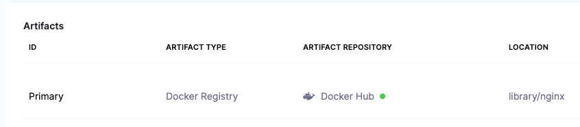
1.  Click **Save**. The Service is now added to the stage.
  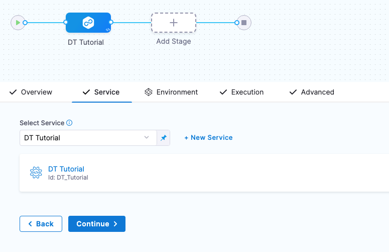
1. Click **Continue** to set up the Environment for the stage.

## Referencing the artifact in your files

Later, in the stage Execution, we will add a deployment step that will download and apply a Kubernetes manifest. The manifest is located in a [public GitHub repo](https://github.com/wings-software/harness-docs/blob/main/default-k8s-manifests/Manifests/deployment.yaml). 

In order for the manifest's Deployment object to use the artifact added to Harness, the expression `<+artifact.image>` is added to the image label (`image: <+artifact.image>`).

You must use `<+artifact.image>` somewhere in your stage Execution to reference the artifact you added to Harness. You can reference it in a Shell Script step, a spec or manifest, or any other relevant step or setting.

If you do not use `<+artifact.image>`, Harness will not attempt to download and deploy the artifact.

For non-containerized artifacts, use `<+artifact.path>`.

To learn more, go to [Use Harness expressions](/docs/platform/variables-and-expressions/harness-variables).

## Create the Environment

You can create Environments and their Infrastructure Definitions inside a stage or in the **Environments** section of your Project. In this tutorial, we'll create everything inside the stage.

1. In **Specify Environment**, click **New Environment**.
2. Name the Environment **DT Tutorial**, click **Pre-Production**, and then click **Save**.
3. Click **New Infrastructure**.
  You can see that any variables you added to the Deployment Template are displayed. You can override their values here these new values will be used in this stage.
4. Name the Infrastructure Definition **DT Tutorial**, and then click **Save**.
  The Infrastructure Definition is added to the stage.
  
  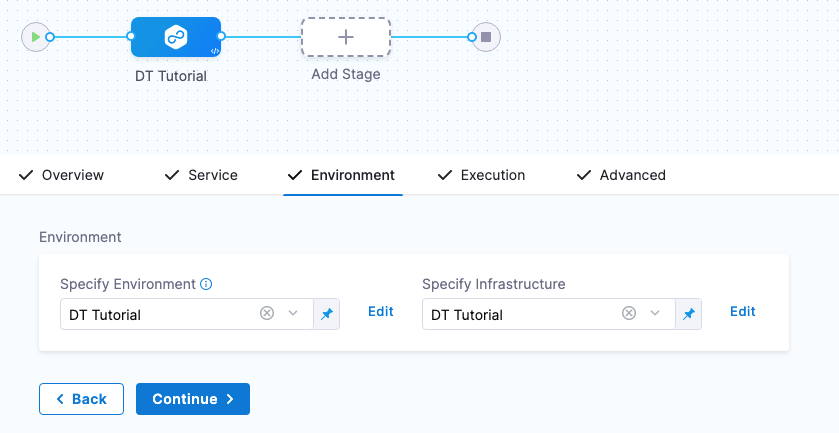

  Next, we'll define the Execution steps for the deployment.
5. Click **Continue** to see Execution.

## Define the Execution

The **Fetch Instances** step is added automatically.

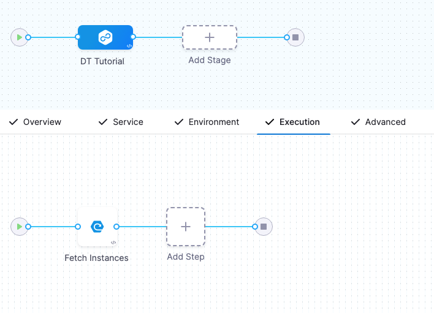

When the pipeline runs, that step will run your Deployment Template's script and traverse the JSON instances array returned to identify the target instances for deployment.

Execution has Fetch Instances but it still needs a step for deployment.

1. Click the **+** sign after **Fetch Instances** and select **Deployment Template Steps**.
  
  We are adding the deployment step after **Fetch Instances** because we know there are existing pods to be fetched in the `default` namespace.
  
  The **deploy** step you added to the Deployment Template is displayed.
  
  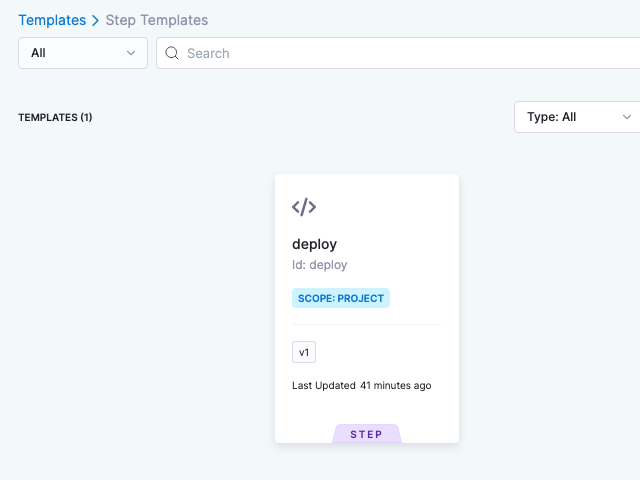

2. Click the **deploy** step and click **Use Template**.
3. Enter the name **DT Tutorial** for the step and click **Apply Changes**.

Let's add one more step to describe the deployment and see how it worked on each fetched instance.

1. After the **DT Tutorial** step, click **Add Step**, and select **Shell Script**.
2. Name the step **kubectl describe deployments**.
3. In **Script**, enter the following:
   
```bash
kubectl describe pod <+repeat.item> --namespace=harness-delegate-ng
```


Next, we need this script to loop through all the fetched instances. We do that by using a [Looping Strategy](/docs/platform/pipelines/looping-strategies/looping-strategies-matrix-repeat-and-parallelism) in the step's **Advanced** section.

1. Click **Advanced**.
2. Click **Looping Strategy**.
3. Click Repeat, and enter the following script:

  ```yaml
  repeat:  
    items: <+stage.output.hosts>
  ```

  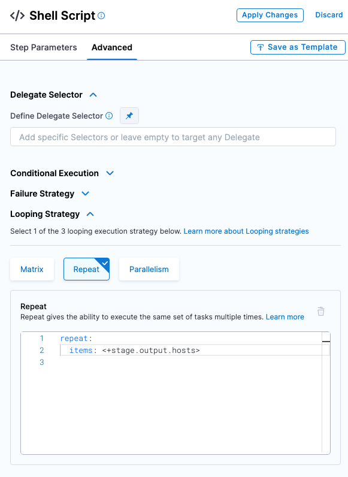

  The `<+stage.output.hosts>` expression references all of the hosts/pods/instances returned by your script.
4. Click **Apply Changes**.

Execution is complete. Now we'll select the Delegate you set up as the Delegate to use for the entire stage.

## Select the Delegate for the stage

You don't have to use the same Delegate for the entire stage. If multiple Delegates are used, Harness will ensure that they can perform the deployment.

For this tutorial, we'll use a single Delegate because we are deploying to its cluster.

1. Click the **Advanced** tab.
2. Click in **Define Delegate Selector** and select the tag of the Delegate you installed earlier.

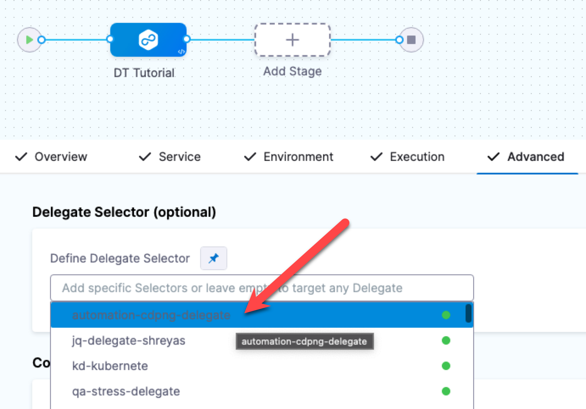

## Run and verify the pipeline

1. Click **Save**. The Pipeline is ready to run.
2. Click **Run**, and then click **Run Pipeline**.

The Pipeline runs and you can see the Kubernetes Deployment object created and the target instances fetched.

Click the **Fetch Instances** step, and then click **Output** to see the instances output from your script:

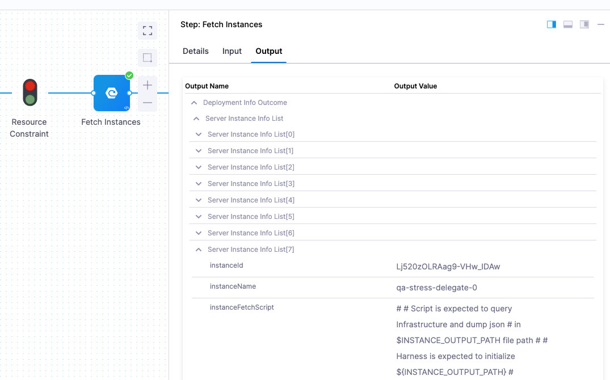

Lastly, look at the **kubectl describe deployments** step to see the deployment on each pod:

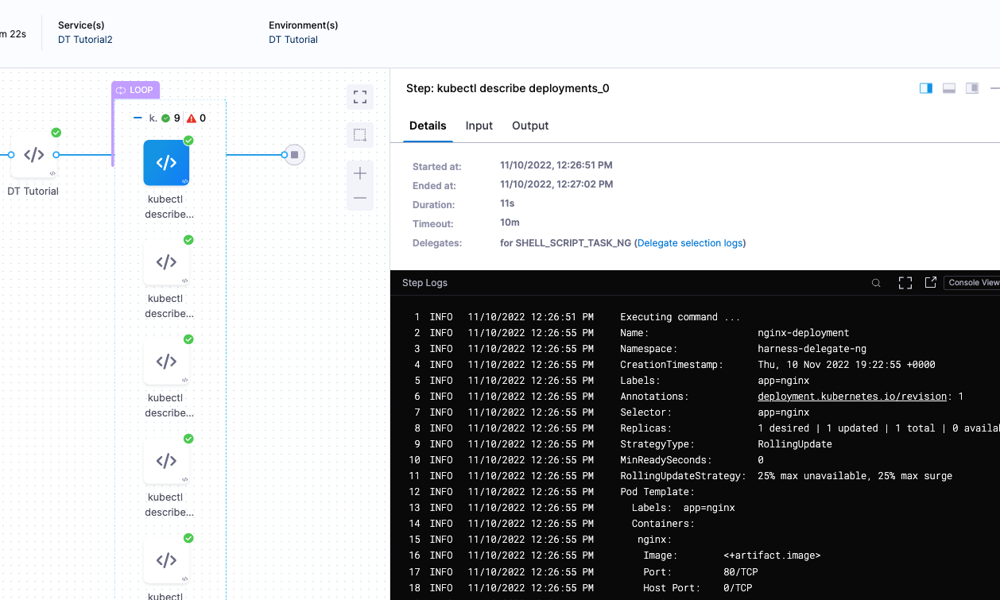

Congratulations!

## Review

You successfully deployed an artifact to a Kubernetes cluster using a Harness Deployment Template.

In this tutorial, you learned how to:

* Install and register a Harness Delegate.
* Create the Deployment Template.
* Create the Deployment Template Pipeline.
* Add your Docker image to Harness.
* Define the Pipeline Service, Infrastructure, and Execution.
* Run and verify the deployment.

## Notes

See the following sections for information on other settings.

### Deployment Template Infrastructure variables

You can create the following types of variables.


* **String:** any string you might want to reference in your stage steps.
* **Secret:** select or create a secret in Harness using Harness default Secret Manager or a Secret Manager you have configured in Harness. For more information, go to [Secrets and Secret Management](/docs/category/security).
* **Number:** a number you might want to reference in your stage steps.
* **Connector:** a Harness Connector that you want to use for this deployment. Any Connector can be used, such as an infrastructure Connector, like an AWS Connector, or a repo Connector for your manifests and specs, like a GitHub Connector.

#### Using variables

These are variables that you can use in the following places:

* In the script in **Fetch Instances** step. For example, you can create a variable for the URL that the script in **Fetch Instances** uses.
* Any step in your stage **Execution**.

#### Referencing variables

You reference variables using a Harness expression with the syntax `<+infra.variables.[variable Id]>`. You can reference any setting in the variable entity, such as a Connector's URL.

Here are some examples.

First, here's the variables:

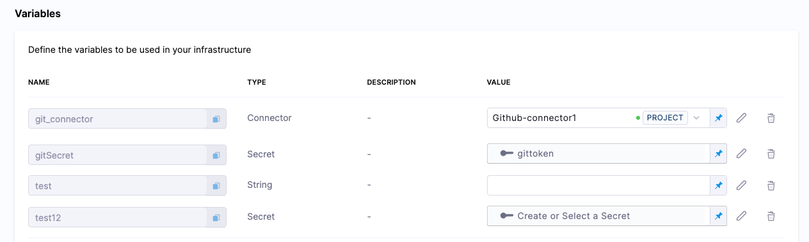

Here's the expressions referencing these variables:

```
<+infra.variables.git_connector.spec.url>

<+infra.variables.git_connector.spec.authentication.type>

<+infra.variables.git_connector.spec.authentication.spec.type>

<+infra.variables.git_connector.spec.authentication.spec.spec.username>

<+infra.variables.git_connector.spec.authentication.spec.spec.tokenRef>

<+secrets.getValue(<+infra.variables.git_connector.spec.authentication.spec.spec.tokenRef.identifier>)>

<+stage.spec.infrastructure.output.variables.gitSecret>

<+infra.variables.gitSecret>

<+infra.variables.test1>

<+infra.variables.test12>
```

Reference [Secret Manager](/docs/platform/get-started/tutorials/add-secrets-manager) connector variables using the following expressions.

* [AWS KMS](/docs/platform/secrets/secrets-management/add-an-aws-kms-secrets-manager): `<+infra.variables.AwsKms.spec.credential.type>`
* [AWS Secrets Manager](/docs/platform/secrets/secrets-management/add-an-aws-secret-manager): `<+infra.variables.AwsSecretsManager.spec.region>`
* [Azure Key Vault](/docs/platform/secrets/secrets-management/azure-key-vault): `<+infra.variables.AzureKeyVault.spec.vaultName>`
* [Google KMS](/docs/platform/secrets/secrets-management/add-google-kms-secrets-manager): `<+infra.variables.GcpKms.spec.keyName>`
* [Google Cloud secret manager](/docs/platform/secrets/secrets-management/add-a-google-cloud-secret-manager): `<+infra.variables.GcpSecMan.spec.credentialsRef.identifier>`
* [Custom secret manager](/docs/platform/secrets/secrets-management/custom-secret-manager): `<+infra.variables.CustomSecMan.spec.isDefault>`
* [HashiCorp Vault](/docs/platform/secrets/secrets-management/add-hashicorp-vault): `<+infra.variables.HashiCorp.spec.vaultUrl>`

#### Overwriting variables

When you define the Infrastructure Definition in your stage **Environment**, you can override any variable values.

| **Deployment Template** | **Infrastructure Definition** |
| --- | --- |
|  ../static/dtinfra2.pngnfra2.png) |

#### Target host instance variable expressions

You can use `<+instance...>` expressions to reference host(s) properties.

The `<+instance...>` expressions refer to the **Instance Attributes** in the Deployment Template:

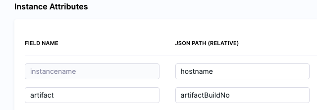

The following [expressions](/docs/platform/variables-and-expressions/harness-variables) refer to instance(s) collected by the mandatory **instancename** field:

* `<+instance.hostName>`
* `<+instance.host.hostName>`
* `<+instance.name>`

The expression `<+instance.host.properties.[property name]>` can used to reference the other properties you added to **Instance Attributes**.

For example, in the example above you can see the `artifact` field name mapped to the `artifactBuildNo` property.

To reference `artifact` you would use `<+instance.host.properties.artifact>`.

`instance.name` has the same value as `instance.hostName`. Both are available for backward compatibility.

To use these expressions, you need to enable the Repeat Looping Strategy and use the expression `<+stage.output.hosts>` on the step that follows **Fetch Instances**.

For example, here is a Shell Script step that outputs these expressions:

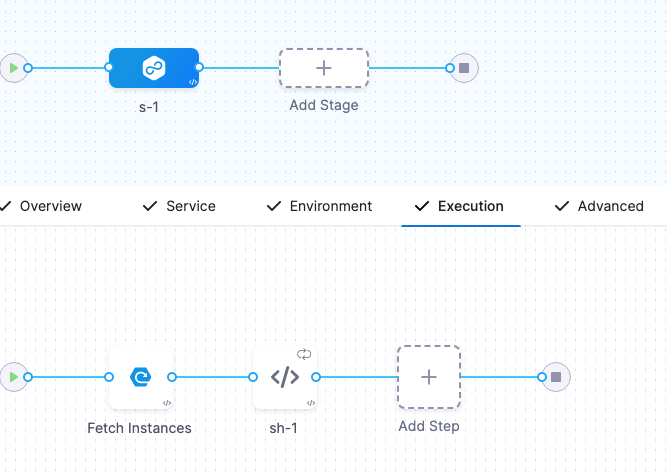

1. In the step, in **Advanced**, click **Looping Strategy**.
2. Select **Repeat**.
3. In **Repeat**, use the Repeat [Looping Strategy](/docs/platform/pipelines/looping-strategies/looping-strategies-matrix-repeat-and-parallelism) and identify all the hosts for the stage as the target:

```yaml
repeat:  
  items: <+stage.output.hosts>
```
Now when this step runs, it will run on every host returned by **Fetch Instances**.

### Where to put Fetch Instances and deployment steps

The stage **Execution** must include the **Fetch Instances** step and a step to deploy the artifact to the instances fetched.

There are two questions to consider when deciding where to put the **Fetch Instances** and deployment steps:

1. Will you only know the instances **before** deployment? Do you need to query some external source to be able to know which instances exist and then iterate over them to deploy to each instance?
2. Will you only know the instances **after** deployment? For example, if an external source like an orchestrator actually creates the instances, you won't know which instances exist until after you deploy.

Typically, the deployment steps come after the **Fetch Instances** step because you are fetching existing instances. But in some cases, such as Kubernetes, you might want to place the **Fetch Instances** step after the deployment so that you are getting the pods that Kubernetes created. If you put **Fetch Instances** step before deployment, you will be using the pods that already exist.

### Command step in Deployment Template deployments

A Command step can run scripts, download artifacts, or copy artifacts and config files.

Since a Deployment Template can be used on any host type, the Command step can only be run on the Delegate. You must use the **Run on Delegate** option in the step.

Consequently, there is no reason to use a Looping Strategy when using the Command step with Deployment Templates.

For more information, go to [Use the Command step to download, copy, or run scripts](/docs/continuous-delivery/x-platform-cd-features/cd-steps/utilities/download-and-copy-artifacts-using-the-command-step).

### Payloads without High-Level Objects

In some cases, you might have a JSON payload without a high-level object. In these cases, you can use `$` in **Host Object Array Path**.

Let's look at an example:

```json
[  
  {  
    "id": "aef-default-0000000000000-qnhh",  
    "instance": {  
      "id": "aef-default-0000000000000-qnhh",  
      "name": "apps/sales/services/default/versions/0000000000000/instances/aef-default-0000000000000-qnhh",  
      "startTime": "2021-01-07T21:05:54.658Z",  
      "vmIp": "192.168.0.0",  
      "vmLiveness": "HEALTHY",  
      "vmStatus": "RUNNING"  
    },  
    "service": "default",  
    "version": "0000000000000"  
  },  
  {  
    "id": "aef-default-0000000000000-0sbt",  
    "instance": {  
      "id": "aef-default-0000000000000-0sbt",  
      "name": "apps/sales/services/default/versions/0000000000000/instances/aef-default-0000000000000-0sbt",  
      "startTime": "2021-01-07T21:05:46.262Z",  
      "vmIp": "192.168.255.255",  
      "vmLiveness": "HEALTHY",  
      "vmStatus": "RUNNING"  
    },  
    "service": "default",  
    "version": "0000000000000"  
  }  
]
```

In this example, the **Host Object Array Path** is `$` and the **instancename** field would use `instance.vmIp`.

### Referencing fetched instances using expressions

You can reference each instance fetched by the **Fetched Instances** step using the step's **Output** tab.

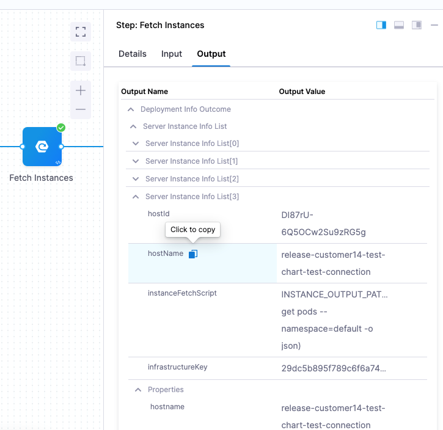

You can expand each instances and copy the expression for the instance metadata you need.

For example, the expression for the instancename of the 4th instance fetched here is (the stage name is `DT_Tutorial`):

```shell
<+pipeline.stages.DT_Tutorial.spec.execution.steps.fetchInstances.deploymentInfoOutcome.serverInstanceInfoList[3].hostName>
```

To reference the entire instance list, you can use this expression:

```shell
<+pipeline.stages.DT_Tutorial.spec.execution.steps.fetchInstances.deploymentInfoOutcome.serverInstanceInfoList>
```

## Deployment Template Sample Library

### Salesforce Deployment Template Support

**Author**: Harness.io 
**Version**: 1.0 
**Description**: This deployment template will help users deploy salesforce application. 

#### Pre-Requisite

You will need to ensure the salesforce binary is installed on your delegate. You can install the binary via the INIT_SCRIPT.

```yaml

initScript: "
            wget https://developer.salesforce.com/media/salesforce-cli/sf/channels/stable/sf-linux-x64.tar.xz
            tar xJf sf-linux-x64.tar.xz -C ~/cli/sf --strip-components 1 
            chmod +x ./sdfx 
            mv sdfx /usr/local/bin/"
```

#### Deployment Template Setup

This Deployment Template lets you define the deployment type for Salesforce Deployments. In the template, we define how to fetch the deployed salesforce app by fetching by the `componentName: <+service.name>`. 

```yaml
template:
  name: Salesforce
  identifier: Salesforce
  versionLabel: v1
  type: CustomDeployment
  tags: {}
  icon: 
  spec:
    infrastructure:
      variables: []
      fetchInstancesScript:
        store:
          type: Inline
          spec:
            content: |
              cat > $INSTANCE_OUTPUT_PATH <<_EOF_
              {
                "data": [
                  {
                    "componentName": "<+service.name>"
                  }
                ]
              } 
              _EOF_
      instanceAttributes:
        - name: instancename
          jsonPath: componentName
          description: ""
      instancesListPath: data
    execution:
      stepTemplateRefs:
        - account.Salesforce_download_artifact

```

#### Execution Salesforce Deployment Step Template 

```yaml
template:
  name: Salesforce download artifact
  type: Step
  spec:
    type: Command
    timeout: 10m
    spec:
      onDelegate: true
      environmentVariables: []
      outputVariables: []
      commandUnits:
        - identifier: Prepare
          name: Prepare
          type: Script
          spec:
            workingDirectory: ""
            shell: Bash
            source:
              type: Inline
              spec:
                script: |-
                  pwd
                  mkdir -p /tmp/harness
                  ls
                  rm /tmp/harness/harness-sfdc-lwc-deployment*
                  rm -rf /tmp/harness/HarnessSF
        - identifier: Download_Artifact
          name: Download Artifact
          type: DownloadArtifact
          spec:
            destinationPath: /tmp/harness
        - identifier: Unzip_artifact
          name: Unzip artifact
          type: Script
          spec:
            workingDirectory: /tmp/harness
            shell: Bash
            source:
              type: Inline
              spec:
                script: |
                  pwd
                  ls
                  unzip harness-sfdc-lwc-deployment_<+pipeline.sequenceId>.zip 
                  ls
        - identifier: Deploy_to_SalesForce
          name: Deploy to SalesForce
          type: Script
          spec:
            shell: Bash
            source:
              type: Inline
              spec:
                script: |
                  export PATH=~/sfdx/bin:$PATH
                  ls /tmp/harness
                  cd /tmp/harness/HarnessSF/
                  echo "<+secrets.getValue("sfdcauth")>" | tee -a authFile.json >/dev/null
                  /root/sfdx/bin/sfdx auth:sfdxurl:store -f authFile.json

                  /root/sfdx/bin/sfdx force:source:deploy -m LightningComponentBundle:helloWorldHarness --targetusername harness@harness.io.demo
        - identifier: Cleanup
          name: Cleanup
          type: Script
          spec:
            shell: Bash
            source:
              type: Inline
              spec:
                script: rm -rf cd /tmp/harness/
      delegateSelectors: <+input>
    strategy:
      repeat:
        items: <+stage.output.hosts>
  identifier: Salesforce_download_artifact
  versionLabel: v1

```

#### Salesforce App Service Setup - Sample

```yaml
service:
  name: helloWorldHarness
  identifier: helloWorldHarness
  serviceDefinition:
    type: CustomDeployment
    spec:
      customDeploymentRef:
        templateRef: account.Salesforce
        versionLabel: v1
      artifacts:
        primary:
          primaryArtifactRef: <+input>
          sources:
            - spec:
                connectorRef: AWSSalesDanF
                bucketName: harness-sfdc-artifacts
                region: us-east-1
                filePath: harness-sfdc-lwc-deployment_<+pipeline.sequenceId>.zip
              identifier: S3
              type: AmazonS3
  gitOpsEnabled: false

```

#### Salesforce App Infrastructure Definition Setup - Sample


```yaml
infrastructureDefinition:
  name: SalesForceDevSandbox
  identifier: SalesForceDevSandbox
  description: ""
  tags: {}
  orgIdentifier: default
  projectIdentifier: Platform_Demo
  environmentRef: dev
  deploymentType: CustomDeployment
  type: CustomDeployment
  spec:
    customDeploymentRef:
      templateRef: account.Salesforce
      versionLabel: v1
    variables: []
  allowSimultaneousDeployments: false

```

#### Sample Salesforce Pipeline Setup - CI/CD 

```yaml
pipeline:
  name: SalesForce E2E
  identifier: SalesForce_E2E
  projectIdentifier: Platform_Demo
  orgIdentifier: default
  tags: {}
  properties:
    ci:
      codebase:
        connectorRef: account.Public_Github
        repoName: luisredda/harness-sfdc-lwc-deployment
        build: <+input>
  stages:
    - stage:
        name: Build Salesforce Component
        identifier: Build_Salesforce_Component
        description: ""
        type: CI
        spec:
          cloneCodebase: true
          platform:
            os: Linux
            arch: Amd64
          runtime:
            type: Cloud
            spec: {}
          execution:
            steps:
              - stepGroup:
                  name: Security Scans
                  identifier: Security_Scans
                  steps:
                    - parallel:
                        - step:
                            type: Gitleaks
                            name: Gitleaks Scan
                            identifier: Gitleaks_Scan
                            spec:
                              mode: orchestration
                              config: default
                              target:
                                name: salesforceapp
                                type: repository
                                variant: main
                              advanced:
                                log:
                                  level: info
                        - step:
                            type: Owasp
                            name: Owasp
                            identifier: Owasp
                            spec:
                              mode: ingestion
                              config: default
                              target:
                                name: salesforceApp-owasp
                                type: repository
                                variant: main
                              advanced:
                                log:
                                  level: info
                              ingestion:
                                file: /harness/sto_tests/scan_tools/owasp/test_data/001
              - step:
                  type: Run
                  name: Unit Tests
                  identifier: Unit_Tests
                  spec:
                    connectorRef: ChaosDemoDockerHub
                    image: salesforce/salesforcedx:7.188.0-full
                    shell: Sh
                    command: |-
                      cd HarnessSF/
                      npm install jest-junit --save-dev 
                      npm run test:unit
                    reports:
                      type: JUnit
                      spec:
                        paths:
                          - ./HarnessSF/junit.xml
              - step:
                  type: Run
                  name: Compress Artifact
                  identifier: Compress_Artifact
                  spec:
                    shell: Sh
                    command: zip -r harness-sfdc-lwc-deployment_<+pipeline.sequenceId>.zip HarnessSF/
              - step:
                  type: S3Upload
                  name: Upload Artifacts to S3
                  identifier: Upload_Artifacts_to_S3
                  spec:
                    connectorRef: AWSSalesDanF
                    region: us-east-2
                    bucket: harness-sfdc-artifacts
                    sourcePath: harness-sfdc-lwc-deployment_<+pipeline.sequenceId>.zip
          slsa_provenance:
            enabled: false
    - stage:
        name: Approval
        identifier: Approval
        description: ""
        type: Approval
        spec:
          execution:
            steps:
              - step:
                  name: Approval
                  identifier: Approval
                  type: HarnessApproval
                  timeout: 1d
                  spec:
                    approvalMessage: |-
                      Please review the following information
                      and approve the pipeline progression
                    includePipelineExecutionHistory: true
                    approvers:
                      minimumCount: 1
                      disallowPipelineExecutor: false
                      userGroups:
                        - account.New_Demo_Group
                    approverInputs: []
        tags: {}
        when:
          pipelineStatus: Success
          condition: 0==1
    - stage:
        name: Deploy to Salesforce
        identifier: Deploy_to_Salesforce
        description: ""
        type: Deployment
        spec:
          deploymentType: CustomDeployment
          customDeploymentRef:
            templateRef: account.Salesforce
            versionLabel: v1
          service:
            serviceRef: helloWorldHarness
            serviceInputs:
              serviceDefinition:
                type: CustomDeployment
                spec:
                  artifacts:
                    primary:
                      primaryArtifactRef: S3
          execution:
            steps:
              - step:
                  name: Fetch Instances
                  identifier: fetchInstances
                  type: FetchInstanceScript
                  timeout: 10m
                  spec: {}
              - step:
                  name: Deploy
                  identifier: Download_artifact
                  template:
                    templateRef: account.Salesforce_download_artifact
                    versionLabel: v1
                    templateInputs:
                      type: Command
                      spec:
                        delegateSelectors:
                          - aws-serverless-elasticbeanstalk
            rollbackSteps:
              - step:
                  type: ShellScript
                  name: Rollback
                  identifier: Rollback
                  spec:
                    shell: Bash
                    onDelegate: true
                    source:
                      type: Inline
                      spec:
                        script: echo "This is Harness rolling back to the last stable version!"
                    environmentVariables: []
                    outputVariables: []
                  timeout: 10m
          environment:
            environmentRef: dev
            deployToAll: false
            infrastructureDefinitions:
              - identifier: SalesForceDevSandbox
        tags: {}
        failureStrategies:
          - onFailure:
              errors:
                - AllErrors
              action:
                type: StageRollback

```

### Google Cloud Run Deployment Template 

**Author**: Harness.io
**Version**: 1.0
**Description**: This deployment template will help users deploy Google Cloud Run-based services. 

#### Pre-Requisites

Users need to install the gcloud cli on the delegate to deploy this template.

```
initScript: "
            curl -O https://dl.google.com/dl/cloudsdk/channels/rapid/downloads/google-cloud-cli-459.0.0-linux-x86_64.tar.gz
            tar -xf google-cloud-cli-459.0.0-linux-x86_64.tar.gz
            ./google-cloud-sdk/install.sh
            ./google-cloud-sdk/bin/gcloud init
            mv gcloud /usr/local/bin/"
```


#### Deployment Template Setup

```yaml
template:
  name: Google Cloud Run
  identifier: Google_Cloud_Run
  versionLabel: 1.0.0
  type: CustomDeployment
  tags: {}
  spec:
    infrastructure:
      variables:
        - name: projectID
          type: String
          value: <+input>
          description: GCP Project ID
        - name: region
          type: String
          value: <+input>
          description: GCP Region
        - name: ingress
          type: String
          value: all
          description: Ingress traffic allowed to reach the service
        - name: maxinstances
          type: String
          value: default
          description: Number of container instances of the service to run, leave "default" to use system default
        - name: serviceName
          type: String
          value: <+service.name>
          description: The name of the Google Cloud Run service to deploy
          required: false
      fetchInstancesScript:
        store:
          type: Inline
          spec:
            content: |
              #
              # Script is expected to query Infrastructure and dump json
              # in $INSTANCE_OUTPUT_PATH file path
              #
              # Harness is expected to initialize ${INSTANCE_OUTPUT_PATH}
              # environment variable - a random unique file path on delegate,
              # so script execution can save the result.
              #

              cat > $INSTANCE_OUTPUT_PATH << _EOF_
              {
                "data": [
                  {
                    "name": "<+service.name>-<+env.name>-<+infra.name>"
                  }
                ]
              } 
              _EOF_
      instanceAttributes:
        - name: instancename
          jsonPath: name
          description: ""
        - name: hostname
          jsonPath: name
          description: ""
      instancesListPath: data
    execution:
      stepTemplateRefs:
        - account.Deploy_Google_Cloud_Run
```

#### Execution Step Setup

```yaml
template:
  name: Deploy Google Cloud Run
  identifier: Deploy_Google_Cloud_Run
  versionLabel: 1.0.0
  type: Step
  tags: {}
  spec:
    type: ShellScript
    timeout: 10m
    spec:
      shell: Bash
      onDelegate: true
      source:
        type: Inline
        spec:
          script: |-
            set -ex

            /opt/harness-delegate/google-cloud-sdk/bin/gcloud run deploy <+infra.variables.serviceName> \
              --image=<+spec.environmentVariables.artifact_image> \
              --allow-unauthenticated \
              --platform=managed \
              --max-instances=<+infra.variables.maxinstances> \
              --region=<+infra.variables.region> \
              --project=<+infra.variables.projectID> \
              --ingress=<+infra.variables.ingress>
      environmentVariables:
        - name: artifact_image
          type: String
          value: <+input>.default(<+artifact.image>)
      outputVariables: []
      delegateSelectors: <+input>

```

#### Pipeline Sample Setup - CI/CD 

```yaml
pipeline:
  name: Build and Deploy to Google Cloud Run
  identifier: Build_and_Deploy_to_Google_Cloud_Run
  projectIdentifier: GCP
  orgIdentifier: default
  tags: {}
  properties:
    ci:
      codebase:
        connectorRef: account.suranc_Account_Level_Connected_Through_Platform
        repoName: spring-forward-harness-example
        build: <+input>
  stages:
    - stage:
        name: Build
        identifier: Build
        description: ""
        type: CI
        spec:
          cloneCodebase: true
          platform:
            os: Linux
            arch: Amd64
          runtime:
            type: Cloud
            spec: {}
          execution:
            steps:
              - step:
                  type: BuildAndPushGAR
                  name: BuildAndPushGAR_1
                  identifier: BuildAndPushGAR_1
                  spec:
                    connectorRef: account.GCP_OIDC
                    host: us-central1-docker.pkg.dev
                    projectID: sales-209522
                    imageName: spring-forward/spring-forward
                    tags:
                      - harness-<+codebase.commitSha>
    - stage:
        name: Deploy
        identifier: Deploy
        description: ""
        type: Deployment
        spec:
          deploymentType: CustomDeployment
          customDeploymentRef:
            templateRef: account.Google_Cloud_Run
            versionLabel: 1.0.0
          service:
            serviceRef: Spring_Forward
            serviceInputs:
              serviceDefinition:
                type: CustomDeployment
                spec:
                  artifacts:
                    primary:
                      primaryArtifactRef: <+input>
                      sources: <+input>
          execution:
            steps:
              - step:
                  name: Fetch Instances
                  identifier: fetchInstances
                  type: FetchInstanceScript
                  timeout: 10m
                  spec: {}
              - step:
                  name: Deploy
                  identifier: Deploy
                  template:
                    templateRef: account.Deploy_Google_Cloud_Run
                    versionLabel: 1.0.0
                    templateInputs:
                      type: ShellScript
                      spec:
                        environmentVariables:
                          - name: artifact_image
                            type: String
                            value: <+artifact.image>
                        delegateSelectors:
                          - gcp-workload-delegate
              - step:
                  type: HarnessApproval
                  name: HarnessApproval_1
                  identifier: HarnessApproval_1
                  spec:
                    approvalMessage: Please review the following information and approve the pipeline progression
                    includePipelineExecutionHistory: true
                    isAutoRejectEnabled: false
                    approvers:
                      userGroups:
                        - account._account_all_users
                      minimumCount: 1
                      disallowPipelineExecutor: false
                    approverInputs: []
                  timeout: 1d
            rollbackSteps:
              - step:
                  name: Rollback Google Cloud Run Service
                  identifier: Rollback_Google_Cloud_Run_Service
                  template:
                    templateRef: account.Deploy_Google_Cloud_Run
                    versionLabel: 1.0.0
                    templateInputs:
                      type: ShellScript
                      spec:
                        environmentVariables:
                          - name: artifact_image
                            type: String
                            value: <+rollbackArtifact.image>
                        delegateSelectors:
                          - gcp-workload-delegate
          environment:
            environmentRef: Dev
            deployToAll: false
            infrastructureDefinitions:
              - identifier: Dev2
        tags: {}
        failureStrategies:
          - onFailure:
              errors:
                - AllErrors
              action:
                type: StageRollback

```

#### Google Cloud Run - Sample Service 

```yaml
service:
  name: spring-forward-harness-example
  identifier: Spring_Forward
  orgIdentifier: default
  projectIdentifier: GCP
  serviceDefinition:
    spec:
      customDeploymentRef:
        templateRef: account.Google_Cloud_Run
        versionLabel: 1.0.0
      artifacts:
        primary:
          primaryArtifactRef: <+input>
          sources:
            - identifier: SpringForward2
              spec:
                connectorRef: GCP_Project_Work_Delegate
                repositoryType: docker
                project: sales-209522
                region: us-central1
                repositoryName: spring-forward
                package: spring-forward
                version: <+input>
                digest: ""
              type: GoogleArtifactRegistry
    type: CustomDeployment

```

#### Google Cloud Run - Sample Infrastructure Definition

```yaml
infrastructureDefinition:
  name: Dev
  identifier: Dev
  orgIdentifier: default
  projectIdentifier: GCP
  environmentRef: Dev
  deploymentType: CustomDeployment
  type: CustomDeployment
  spec:
    customDeploymentRef:
      templateRef: account.Google_Cloud_Run
      versionLabel: 1.0.0
    variables:
      - name: projectID
        type: String
        description: GCP Project ID
        value: sales-209522
      - name: region
        type: String
        description: GCP Region
        value: us-central1
      - name: ingress
        type: String
        description: Ingress traffic allowed to reach the service
        value: all
      - name: maxinstances
        type: String
        description: Number of container instances of the service to run, leave "default" to use system default
        value: default
      - name: serviceName
        type: String
        description: The name of the Google Cloud Run service to deploy
        required: false
        value: <+service.name>
  allowSimultaneousDeployments: false
```

### Google App Engine - Sample

**Author**: Harness.io
**Version**: 1.0
**Description**: This deployment template will help users deploy Google Apple Engine services. 

#### Deployment Template

```yaml
template:
  name: Google AppEngine
  identifier: Google_AppEngine
  versionLabel: v1
  type: CustomDeployment
  tags: {}
  spec:
    infrastructure:
      variables: []
      fetchInstancesScript:
        store:
          type: Inline
          spec:
            content: |-
              #
              # Script is expected to query Infrastructure and dump json
              # in $INSTANCE_OUTPUT_PATH file path
              #
              # Harness is expected to initialize ${INSTANCE_OUTPUT_PATH}
              # environment variable - a random unique file path on delegate,
              # so script execution can save the result.
              #
              #

              cat > $INSTANCE_OUTPUT_PATH <<_EOF_
              {
                "data": [
                  {
                    "functionName": "<+service.name>"
                  }
                ]
              } 
              _EOF_
      instanceAttributes:
        - name: hostname
          jsonPath: functionName
          description: ""
      instancesListPath: data
    execution:
      stepTemplateRefs:
        - account.Deploy_AppEngine

```

#### Deployment Step - Google App Engine

```yaml
template:
  name: Deploy AppEngine
  type: Step
  spec:
    type: ShellScript
    timeout: 10m
    spec:
      shell: Bash
      onDelegate: true
      source:
        type: Inline
        spec:
          script: |
            #!/bin/bash
            export PATH=$PATH:/opt/harness-delegate/google-cloud-sdk/bin

            #KEY_FILE="/root/gae_sa.json"

            gcloud config set account harness@harnessauth.iam.gserviceaccount.com
            gcloud config set project ${GC_PROJECT}
            gcloud config list
            gcloud app versions list

            echo "Unzipping Artifact..."


            echo "Starting App Deploy..."

            gcloud app deploy app.yaml --project ${GC_PROJECT} -q --verbosity=debug
      environmentVariables: []
      outputVariables: []
  identifier: Deploy_AppEngine
  versionLabel: v1

```


### Elastic Beanstalk - Sample

**Author**: Harness.io
**Version**: 1.0
**Description**: This deployment template will help users deploy Elastic Beanstalk services. 

#### Deployment Template 

```yaml
template:
  name: Elastic Beanstalk
  identifier: Elastic_Beanstalk
  versionLabel: v1
  type: CustomDeployment
  tags:
    ElasticBeanstalk Template: ""
  spec:
    infrastructure:
      variables:
        - name: EnvironmentName
          type: String
          value: ""
          description: AWS Beanstalk Environment Name
        - name: Region
          type: String
          value: ""
          description: AWS Region
        - name: stsRole
          type: String
          value: None
          description: STS Role to Assume. Leave it blank if not necessary
      fetchInstancesScript:
        store:
          type: Inline
          spec:
            content: |+
              echo "Starting"

              export AWS_DEFAULT_REGION=<+infra.variables.Region>
              export AWS_STS_ROLE=<+infra.variables.stsRole>
              NAME="Harness-Assume-Role"

              if [ "$AWS_STS_ROLE" != "None" ]; then
                echo "Assuming STS Role..."

              # Cleanup current sessions
                unset AWS_ACCESS_KEY_ID AWS_SECRET_ACCESS_KEY AWS_SESSION_TOKEN AWS_SECURITY_TOKEN

                unset AWS_ACCESS_KEY AWS_SECRET_KEY AWS_DELEGATION_TOKEN

                KST=(`aws sts assume-role --role-arn "$AWS_STS_ROLE" \
                                        --role-session-name "$NAME" \
                                        --query '[Credentials.AccessKeyId,Credentials.SecretAccessKey,Credentials.SessionToken]' \
              --output text`)

                export AWS_ACCESS_KEY_ID=${KST[0]}
                export AWS_SECRET_ACCESS_KEY=${KST[1]}
                export AWS_SESSION_TOKEN=${KST[2]}

              else
                 echo "Skipping STS AssumeRole..."
              fi


              #INSTANCE_OUTPUT_PATH=`aws elasticbeanstalk describe-instances-health --environment-name=<+infra.variables.EnvironmentName>`
              aws elasticbeanstalk describe-instances-health --environment-name=<+infra.variables.EnvironmentName> > $INSTANCE_OUTPUT_PATH
              cat $INSTANCE_OUTPUT_PATH

      instanceAttributes:
        - name: hostname
          jsonPath: InstanceId
          description: Elastic Beanstalk InstanceID
        - name: instancename
          jsonPath: InstanceId
          description: Elastic Beanstalk InstanceID
      instancesListPath: InstanceHealthList
    execution:
      stepTemplateRefs:
        - account.Prepare_AWS_ElasticBeanstalk
        - account.Create_Version
        - account.Update_Environment
        - account.Steady_State_Check
  icon:

```

#### Execution Step - Elastic Beanstalk


##### Prepare Step

```yaml
template:
  name: Prepare AWS ElasticBeanstalk
  type: Step
  spec:
    type: ShellScript
    timeout: 10m
    spec:
      shell: Bash
      onDelegate: true
      source:
        type: Inline
        spec:
          script: |
            #!/bin/bash
            export AWS_DEFAULT_REGION=<+infra.custom.vars.Region>
            AWS_STS_ROLE=<+infra.custom.vars.stsRole>
            NAME="Harness-Assume-Role"
            export VERSION_LABEL=${VERSION}

            if [ ! -z "$AWS_STS_ROLE" ]; then
              echo "Assuming STS Role..."

            # Unset existing AWS session keys
              unset AWS_ACCESS_KEY_ID AWS_SECRET_ACCESS_KEY AWS_SESSION_TOKEN AWS_SECURITY_TOKEN

              unset AWS_ACCESS_KEY AWS_SECRET_KEY AWS_DELEGATION_TOKEN

              KST=(`aws sts assume-role --role-arn "$AWS_STS_ROLE" \
                                      --role-session-name "$NAME" \
                                      --query '[Credentials.AccessKeyId,Credentials.SecretAccessKey,Credentials.SessionToken]' \
            --output text`)

              export AWS_ACCESS_KEY_ID=${KST[0]}
              export AWS_SECRET_ACCESS_KEY=${KST[1]}
              export AWS_SESSION_TOKEN=${KST[2]}

            else
               echo "Skipping STS AssumeRole..."
            fi
      environmentVariables: []
      outputVariables: []
  identifier: Prepare_AWS_ElasticBeanstalk
  versionLabel: v1
  description: ""
  tags:
    ElasticBeanstalk Template: ""

```

##### Create Version Step

```yaml
template:
  name: Create Version
  identifier: Create_Version
  versionLabel: v1
  type: Step
  tags:
    ElasticBeanstalk Template: ""
  spec:
    timeout: 20m
    type: ShellScript
    spec:
      shell: Bash
      onDelegate: true
      source:
        type: Inline
        spec:
          script: |
            #!/bin/bash
            export AWS_DEFAULT_REGION=<+infra.variables.Region>
            export AWS_STS_ROLE=<+infra.variables.stsRole>
            NAME="Harness-Assume-Role"
            export VERSION_LABEL=<+artifact.filePath>

            if [ "$AWS_STS_ROLE" != "None" ]; then
            echo "Assuming STS Role..."

            # Unset existing AWS session keys
            unset AWS_ACCESS_KEY_ID AWS_SECRET_ACCESS_KEY AWS_SESSION_TOKEN AWS_SECURITY_TOKEN

            unset AWS_ACCESS_KEY AWS_SECRET_KEY AWS_DELEGATION_TOKEN

            KST=(`aws sts assume-role --role-arn "$AWS_STS_ROLE" \
                                      --role-session-name "$NAME" \
                                      --query '[Credentials.AccessKeyId,Credentials.SecretAccessKey,Credentials.SessionToken]' \
            --output text`)

            export AWS_ACCESS_KEY_ID=${KST[0]}
            export AWS_SECRET_ACCESS_KEY=${KST[1]}
            export AWS_SESSION_TOKEN=${KST[2]}

            else
            echo "Skipping STS AssumeRole... Will use the current IAM role."
            fi

            VERSION_EXISTS=`aws elasticbeanstalk describe-application-versions --application-name=<+service.name> --version-labels=${VERSION_LABEL} | jq -r '.ApplicationVersions' | jq length`

            if [ $VERSION_EXISTS -gt 0 ]; then
              echo "Version already exists, Harness skipping this step..."
            else

            echo "Creating EB app version ${VERSION_LABEL} in EB app \"<+service.name>\" on region ${AWS_DEFAULT_REGION}"

            aws elasticbeanstalk create-application-version --application-name "<+service.name>" --description "Version created by Harness." \
             --version-label "${VERSION_LABEL}" --source-bundle S3Bucket=<+artifact.bucketName>,S3Key=<+artifact.filePath>
            fi
      environmentVariables: []
      outputVariables: []
      delegateSelectors: <+input>

```

##### Update Environment Step

```yaml
template:
  name: Update Environment
  identifier: Update_Environment
  versionLabel: v1
  type: Step
  tags:
    ElasticBeanstalk Template: ""
  spec:
    timeout: 25m
    type: ShellScript
    spec:
      shell: Bash
      onDelegate: true
      source:
        type: Inline
        spec:
          script: "#!/bin/bash\nexport AWS_DEFAULT_REGION=<+infra.variables.Region>\nAWS_STS_ROLE=<+infra.variables.stsRole>\nNAME=\"Harness-Assume-Role\"\nexport VERSION_LABEL=<+artifact.filePath>\n\nif [ \"$AWS_STS_ROLE\" != \"None\" ]; then\necho \"Assuming STS Role...\"\n\n# Unset existing AWS session keys\nunset AWS_ACCESS_KEY_ID AWS_SECRET_ACCESS_KEY AWS_SESSION_TOKEN AWS_SECURITY_TOKEN\n\nunset AWS_ACCESS_KEY AWS_SECRET_KEY AWS_DELEGATION_TOKEN\n\nKST=(`aws sts assume-role --role-arn \"$AWS_STS_ROLE\" \\\n                          --role-session-name \"$NAME\" \\\n                          --query '[Credentials.AccessKeyId,Credentials.SecretAccessKey,Credentials.SessionToken]' \\\n--output text`)\n\nexport AWS_ACCESS_KEY_ID=${KST[0]}\nexport AWS_SECRET_ACCESS_KEY=${KST[1]}\nexport AWS_SESSION_TOKEN=${KST[2]}\n\nelse\necho \"Skipping STS AssumeRole...\"\nfi\n\n# See if EB_APP_VERSION is in the EB app\nNB_VERS=`aws elasticbeanstalk describe-applications --application-name \"<+service.name>\" | jq '.Applications[] | .Versions[]' | grep -c \"\\\"${VERSION_LABEL}\\\"\"`\nif [ ${NB_VERS} = 0 ];then\n\techo \"No app version called \\\"${VERSION_LABEL}\\\" in EB application \\\"${EB_APP}\\\".\"\n\texit 4\nfi\n\naws elasticbeanstalk update-environment --environment-name <+infra.variables.EnvironmentName> --version-label ${VERSION_LABEL}"
      environmentVariables: []
      outputVariables: []
      delegateSelectors: <+input>

```

##### Steady State Check Step

```yaml
template:
  name: Steady State Check
  identifier: Steady_State_Check
  versionLabel: v1
  type: Step
  tags:
    ElasticBeanstalk Template: ""
  spec:
    timeout: 25m
    type: ShellScript
    spec:
      shell: Bash
      onDelegate: true
      source:
        type: Inline
        spec:
          script: |-
            #!/bin/bash
            export AWS_DEFAULT_REGION=<+infra.variables.Region>
            AWS_STS_ROLE=<+infra.variables.stsRole>
            NAME="Harness-Assume-Role"
            export VERSION_LABEL=<+artifact.filePath>

            if [ ! -z "$AWS_STS_ROLE" ]; then
            echo "Assuming STS Role..."

            # Unset existing AWS session keys
            unset AWS_ACCESS_KEY_ID AWS_SECRET_ACCESS_KEY AWS_SESSION_TOKEN AWS_SECURITY_TOKEN

            unset AWS_ACCESS_KEY AWS_SECRET_KEY AWS_DELEGATION_TOKEN

            KST=(`aws sts assume-role --role-arn "$AWS_STS_ROLE" \
                                      --role-session-name "$NAME" \
                                      --query '[Credentials.AccessKeyId,Credentials.SecretAccessKey,Credentials.SessionToken]' \
            --output text`)

            export AWS_ACCESS_KEY_ID=${KST[0]}
            export AWS_SECRET_ACCESS_KEY=${KST[1]}
            export AWS_SESSION_TOKEN=${KST[2]}

            else
            echo "Skipping STS AssumeRole..."
            fi
            #######
            echo "Checking for Steady State..."
            APP_INFO=`aws elasticbeanstalk describe-environments --environment-name <+infra.variables.EnvironmentName>`
            APP_STATUS=`echo ${APP_INFO}  | jq '.Environments[] | .Status' | sed -e 's/^"//' -e 's/"$//'`
            APP_HEALTHSTATUS=`echo ${APP_INFO}  | jq '.Environments[] | .HealthStatus' | sed -e 's/^"//' -e 's/"$//'`
            APP_HEALTH=`echo ${APP_INFO}  | jq '.Environments[] | .Health' | sed -e 's/^"//' -e 's/"$//'`

            echo "Current APP Status: " ${APP_STATUS}
            echo "Current APP Health Status" ${APP_HEALTHSTATUS}
            echo "Current APP Health" ${APP_HEALTH}

            while [ "$APP_STATUS" != "Ready" ] || [ "$APP_HEALTHSTATUS" != "Ok" ] || [ "$APP_HEALTH" != "Green" ]; do
              APP_INFO=`aws elasticbeanstalk describe-environments --environment-name <+infra.variables.EnvironmentName>`
              APP_STATUS=`echo ${APP_INFO}  | jq '.Environments[] | .Status' | sed -e 's/^"//' -e 's/"$//'`
              APP_HEALTHSTATUS=`echo ${APP_INFO}  | jq '.Environments[] | .HealthStatus' | sed -e 's/^"//' -e 's/"$//'`
              APP_HEALTH=`echo ${APP_INFO}  | jq '.Environments[] | .Health' | sed -e 's/^"//' -e 's/"$//'`
              echo "---"
              echo "Checking for Steady State..."
              echo "Current APP Status: " ${APP_STATUS} " - Desired: Ready "
              echo "Current APP Health Status" ${APP_HEALTHSTATUS} " - Desired: Ok"
              echo "Current APP Health" ${APP_HEALTH} " - Desired: Green"
              sleep 2
            done

            echo "------"
            echo ${APP_INFO}
      environmentVariables: []
      outputVariables: []
      delegateSelectors: <+input>
```

### AWS CodeDeploy - Deployment Template Sample

**Author**: Harness.io
**Version**: 1.0
**Description**: This deployment template will help users deploy services using AWS CodeDeploy.

#### Pre-Requisites

- The user needs to install the AWS CLI on the Delegate, users can install it via the INIT_SCRIPT. 

#### Deployment Template Configuration

The Deployment Template will allow us to set the infrastructure and the ability to fetch the instances deployed via AWS CodeDeploy. 

##### Input Parameters 

- **AWS Connector**: You will need to provide us with an AWS Connector that has access to perform CodeDeploy Deployments.
- **Region**: This defines the region where Harness will be deploying the CodeDeploy Application
- **Application Name**: A name for the CodeDeploy application
- **Deployment Group**: The deployment group contains settings and configurations used during the deployment. In Harness, you will provide the name of the Deployment Group for the application.
- **Deployment Configuration**: A Deployment Configuration in AWS CodeDeploy is a set of rules and settings that define how a deployment will be conducted within the service. In Harness, you will provide the setting for the Deployment Configuration. The Default Setting is "CodeDeployDefault.OneAtATime".

The Deployment Template will be leveraged in the **Fetch Instances Step** to set the infrastructure and instance querying to track the deployed Services.

```yaml
template:
  name: AWS CodeDeploy
  identifier: AWS_CodeDeploy
  versionLabel: v1
  type: CustomDeployment
  projectIdentifier: default
  orgIdentifier: default
  tags: {}
  icon: 
  spec:
    infrastructure:
      variables:
        - name: AWSConnector
          type: Connector
          value: <+input>
          description: "Provide Your AWS Connector"
          required: false
        - name: region
          type: String
          value: us-east-1
          description: "Region for Deployment"
          required: false
        - name: ApplicationName
          type: String
          value: ""
          description: "Provide your existing CodeDeploy Application Name"
          required: false
        - name: DeploymentGroup
          type: String
          value: ""
          description: "Provide your existing Deployment Group"
          required: false
        - name: DeploymentConfiguration
          type: String
          value: "CodeDeployDefault.OneAtATime"
          description: "Default Setting for CodeDeploy"
          required: false
      fetchInstancesScript:
        store:
          type: Inline
          spec:
            content: |-
              #
              # Script is expected to query Infrastructure and dump JSON
              # in $INSTANCE_OUTPUT_PATH file path
              #
              # Harness is expected to initialize ${INSTANCE_OUTPUT_PATH}
              # environment variable - a random unique file path on delegate,
              # so script execution can save the result.
              #

              region=<+infra.variables.region>
              accessKey=<+infra.variables.AWSConnector.spec.credential.spec.accessKey>
              secretKey=<+secrets.getValue(<+infra.variables.AWSConnector.spec.credential.spec.secretKeyRef.identifier>)>
              aws configure set aws_access_key_id $accessKey  && aws configure set aws_secret_access_key $secretKey  && aws configure set region $region

              deploymentId=<+execution.steps.AWS_CodeDeploy.output.outputVariables.codeDeploymentId>

              instances=$(aws deploy list-deployment-targets --deployment-id $deploymentId | jq -r .targetIds[])
              echo -e "\nInstances list - [$instances]"

              aws ec2 describe-instances --instance-ids $instances > $INSTANCE_OUTPUT_PATH
              cat $INSTANCE_OUTPUT_PATH
      instanceAttributes:
        - name: instancename
          jsonPath: Instances[0].InstanceId
          description: "The instance name"
        - name: InstanceType
          jsonPath: Instances[0].InstanceType
          description: "The type of instance"
        - name: PublicIpAddress
          jsonPath: Instances[0].PublicIpAddress
          description: "The IP Address for the Instance"
        - name: OwnerId
          jsonPath: OwnerId
          description: "The Owner of the CodeDeploy Application"
        - name: ReservationId
          jsonPath: ReservationId
          description: "The Reservation ID for the CodeDeploy Application"
      instancesListPath: Reservations
    execution:
      stepTemplateRefs:
        - CodeDeploy_Steady_State
        - AWS_CodeDeploy_Step
  description: |-
    This is deployment template for AWS Code deploy for deployment group which has Compute platform as EC2/on-premises instances 

    Make sure the delegate has AWS CLI installed for this template to work correctly

```

##### Fetch Instances Sample Execution

```sh
"INSTANCE_OUTPUT_PATH" has been initialized to "/opt/harness-delegate/fetchInstanceScript/47if1ntCQceymk-GLJJsUg/output.json"
Executing command ...

Instances list - [i-0b77a163d64963817]
{
    "Reservations": [
        {
            "Groups": [],
            "Instances": [
                {
                    "AmiLaunchIndex": 0,
                    "ImageId": "ami-0c382fdca8edfdf0c",
                    "InstanceId": "i-0b77a163d64963817",
                    "InstanceType": "t3.micro",
                    "KeyName": "akhilesh-ssh",
                    "LaunchTime": "2023-09-03T17:55:02.000Z",
                    "Monitoring": {
                        "State": "disabled"
                    },
                    "Placement": {
                        "AvailabilityZone": "us-east-1f",
                        "GroupName": "",
                        "Tenancy": "default"
                    },
                    "PrivateDnsName": "ip-172-31-66-168.ec2.internal",
                    "PrivateIpAddress": "172.31.66.168",
                    "ProductCodes": [],
                    "PublicDnsName": "ec2-34-231-122-208.compute-1.amazonaws.com",
                    "PublicIpAddress": "34.231.122.208",
                    "State": {
                        "Code": 16,
                        "Name": "running"
                    },
                    "StateTransitionReason": "",
                    "SubnetId": "subnet-9757dc98",
                    "VpcId": "vpc-c20f38b9",
                    "Architecture": "x86_64",
                    "BlockDeviceMappings": [
                        {
                            "DeviceName": "/dev/xvda",
                            "Ebs": {
                                "AttachTime": "2020-09-25T05:22:40.000Z",
                                "DeleteOnTermination": true,
                                "Status": "attached",
                                "VolumeId": "vol-094601fdb87771186"
                            }
                        }
                    ],
                    "ClientToken": "*******************************************",
                    "EbsOptimized": false,
                    "EnaSupport": true,
                    "Hypervisor": "xen",
                    "IamInstanceProfile": {
                        "Arn": "arn:aws:iam::479370281431:instance-profile/CodeDeployDemo-EC2-Instance-Profile",
                        "Id": "AIPAW7HFSAHLQBJNGQ5CG"
                    },
                    "NetworkInterfaces": [
                        {
                            "Association": {
                                "IpOwnerId": "amazon",
                                "PublicDnsName": "ec2-34-231-122-208.compute-1.amazonaws.com",
                                "PublicIp": "34.231.122.208"
                            },
                            "Attachment": {
                                "AttachTime": "2020-09-25T05:22:39.000Z",
                                "AttachmentId": "eni-attach-0ae2c0b4826605455",
                                "DeleteOnTermination": true,
                                "DeviceIndex": 0,
                                "Status": "attached",
                                "NetworkCardIndex": 0
                            },
                            "Description": "",
                            "Groups": [
                                {
                                    "GroupName": "default",
                                    "GroupId": "sg-afc848e7"
                                }
                            ],
                            "Ipv6Addresses": [],
                            "MacAddress": "16:ad:51:e6:da:fd",
                            "NetworkInterfaceId": "eni-036688d5aca78078b",
                            "OwnerId": "479370281431",
                            "PrivateDnsName": "ip-172-31-66-168.ec2.internal",
                            "PrivateIpAddress": "172.31.66.168",
                            "PrivateIpAddresses": [
                                {
                                    "Association": {
                                        "IpOwnerId": "amazon",
                                        "PublicDnsName": "ec2-34-231-122-208.compute-1.amazonaws.com",
                                        "PublicIp": "34.231.122.208"
                                    },
                                    "Primary": true,
                                    "PrivateDnsName": "ip-172-31-66-168.ec2.internal",
                                    "PrivateIpAddress": "172.31.66.168"
                                }
                            ],
                            "SourceDestCheck": true,
                            "Status": "in-use",
                            "SubnetId": "subnet-9757dc98",
                            "VpcId": "vpc-c20f38b9",
                            "InterfaceType": "interface"
                        }
                    ],
                    "RootDeviceName": "/dev/xvda",
                    "RootDeviceType": "ebs",
                    "SecurityGroups": [
                        {
                            "GroupName": "default",
                            "GroupId": "sg-afc848e7"
                        }
                    ],
                    "SourceDestCheck": true,
                    "Tags": [
                        {
                            "Key": "team",
                            "Value": "cd"
                        },
                        {
                            "Key": "ttl",
                            "Value": "-1"
                        },
                        {
                            "Key": "Name",
                            "Value": "CodeDeploy Quality Instance Do-not-Delete"
                        },
                        {
                            "Key": "sample_key_2",
                            "Value": "sample_val_2"
                        }
                    ],
                    "VirtualizationType": "hvm",
                    "CpuOptions": {
                        "CoreCount": 1,
                        "ThreadsPerCore": 2
                    },
                    "CapacityReservationSpecification": {
                        "CapacityReservationPreference": "open"
                    },
                    "HibernationOptions": {
                        "Configured": false
                    },
                    "MetadataOptions": {
                        "State": "applied",
                        "HttpTokens": "optional",
                        "HttpPutResponseHopLimit": 1,
                        "HttpEndpoint": "enabled",
                        "HttpProtocolIpv6": "disabled",
                        "InstanceMetadataTags": "disabled"
                    },
                    "EnclaveOptions": {
                        "Enabled": false
                    },
                    "PlatformDetails": "Linux/UNIX",
                    "UsageOperation": "RunInstances",
                    "UsageOperationUpdateTime": "2020-09-25T05:22:39.000Z",
                    "PrivateDnsNameOptions": {},
                    "MaintenanceOptions": {
                        "AutoRecovery": "default"
                    }
                }
            ],
            "OwnerId": "479370281431",
            "ReservationId": "r-04f2c39ad6213b31d"
        }
    ]
}
Command completed with ExitCode (0)
Execution finished with status: SUCCESS
```

#### AWS CodeDeploy Steady State Check

This step will check for a steady state and ensure the application is healthy.

```yaml
template:
  name: CodeDeploy Steady State
  identifier: CodeDeploy_Steady_State
  versionLabel: v1
  type: Step
  projectIdentifier: default
  orgIdentifier: default
  tags: {}
  icon: 
  spec:
    timeout: 10m
    type: ShellScript
    spec:
      shell: Bash
      delegateSelectors: []
      source:
        type: Inline
        spec:
          script: |-
            #!/bin/bash
            region=<+infra.variables.region>
            accessKey=<+infra.variables.AWSConnector.spec.credential.spec.accessKey>
            secretKey=<+secrets.getValue(<+infra.variables.AWSConnector.spec.credential.spec.secretKeyRef.identifier>)>
            aws configure set aws_access_key_id $accessKey  && aws configure set aws_secret_access_key $secretKey  && aws configure set region $region

            deploymentId=<+execution.steps.AWS_CodeDeploy.output.outputVariables.codeDeploymentId>

            while :
            do
                    status=$(aws deploy get-deployment --deployment-id $deploymentId |  jq -r .deploymentInfo.status)
                    echo -e "\nCurrent status for deployment id - [ $deploymentId ] is $status ..."

                    if [[ $status == "Succeeded" ]]
                    then
                            break
                    fi

                    if [[ $status == "Failed" ]]
                    then
                            break
                    fi

                    if [[ $status == "Stopped" ]]
                    then
                            break
                    fi

                    echo "Sleeping for 10s ..."
                    sleep 10
            done

            echo "Reached steady state ..."
      environmentVariables: []
      outputVariables: []
      executionTarget: {}

```

##### Steady State Check Execution Logs

```sh
Executing command ...

Current status for deployment id - [ d-N36KENP64 ] is InProgress ...
Sleeping for 10s ...

Current status for deployment id - [ d-N36KENP64 ] is Succeeded ...
Reached steady state ...
Command completed with ExitCode (0)
```

#### AWS CodeDeploy Deploy Step

This step will perform the deployment of the AWS CodeDeploy Application. The Template will use the properties you have set in the Service and Deployment Template. 

```yaml
template:
  name: AWS CodeDeploy Step
  identifier: AWS_CodeDeploy_Step
  versionLabel: v1
  type: Step
  projectIdentifier: default
  orgIdentifier: default
  tags: {}
  icon: 
  spec:
    timeout: 10m
    type: ShellScript
    spec:
      shell: Bash
      delegateSelectors: []
      source:
        type: Inline
        spec:
          script: |+
            #!/bin/bash
            echo -e "\n********** Artifact details **********"
            bucket=<+artifacts.primary.bucketName>
            key=<+artifacts.primary.filePath>
            bundleType=<+serviceVariables.bundleType>

            echo "Bucket = $bucket"
            echo "Key = $key"
            echo "Bundle Type = $bundleType"

            accessKey=<+infra.variables.AWSConnector.spec.credential.spec.accessKey>
            secretKey=<+secrets.getValue(<+infra.variables.AWSConnector.spec.credential.spec.secretKeyRef.identifier>)>
            region=<+infra.variables.region>
            applicationName=<+infra.variables.ApplicationName>
            deploymentConfiguration=<+infra.variables.DeploymentConfiguration>
            deploymentGroup=<+infra.variables.DeploymentGroup>

            echo -e "\n********** Starting code deploy with following configuration **********"
            echo -e "Application Name: [$applicationName]"
            echo -e "Aws Region: [$region]"
            echo -e "Deployment Group: [$deploymentGroup]"
            echo -e "Deployment Configuration: [$deploymentConfiguration]"

            aws configure set aws_access_key_id $accessKey  && aws configure set aws_secret_access_key $secretKey  && aws configure set region $region

            deploymentId=$(aws deploy create-deployment \
                --application-name $applicationName \
                --deployment-config-name $deploymentConfiguration \
                --deployment-group-name $deploymentGroup \
                --description "My deployment using Deployment Template" \
                --s3-location bucket=$bucket,bundleType=$bundleType,key=$key | jq -r .deploymentId)

            echo -e "\nDeployment started successfully with deployment id - [$deploymentId]"

      environmentVariables: []
      outputVariables:
        - name: codeDeploymentId
          type: String
          value: deploymentId
      executionTarget: {}

```


##### Deploy Step Execution Logs

```sh
Executing command ...

********** Artifact details **********
Bucket = codedeploy-quickstart-sample
Key = SampleApp_Linux.zip
Bundle Type = zip

********** Starting code deploy with following configuration **********
Application Name: [CodeDeploy_Quality_Verification_App]
Aws Region: [us-east-1]
Deployment Group: [quality-deployment-group]
Deployment Configuration: [CodeDeployDefault.OneAtATime]

Deployment started successfully with deployment id - [d-N36KENP64]
Script Output: 
deploymentId=d-N36KENP64
Command completed with ExitCode (0)
```


#### AWS CodeDeploy Service Sample

This is a sample service that can be configured to represent the AWS CodeDeploy Service Type. In this example, we can fetch from S3.

##### Service Inputs

- **bundleType**: This is the type of artifact you are deploying, for default we recommend zip. 


```yaml
service:
  name: awsCodeDeployService
  identifier: awsCodeDeployService
  orgIdentifier: default
  projectIdentifier: default
  serviceDefinition:
    spec:
      customDeploymentRef:
        templateRef: AWS_CodeDeploy
        versionLabel: v1
      artifacts:
        primary:
          primaryArtifactRef: <+input>
          sources:
            - spec:
                connectorRef: awsQaSetup
                bucketName: codedeploy-quickstart-sample
                region: us-east-1
                filePath: SampleApp_Linux.zip
              identifier: a1
              type: AmazonS3
      variables:
        - name: bundleType
          type: String
          description: ""
          required: false
          value: zip
    type: CustomDeployment
```


##### Service Execution Logs

```sh
Starting service step...
Service Name: awsCodeDeployService , Identifier: awsCodeDeployService
Processed service &amp; environment variables
Processing primary artifact...
Primary artifact info: 
type: AmazonS3 
bucketName: codedeploy-quickstart-sample 
filePath: SampleApp_Linux.zip 
filePathRegex: null 
connectorRef: awsQaSetup

No config files configured in the service or in overrides. configFiles expressions will not work
No service hooks configured in the service. hooks expressions will not work
No manifests configured in the service or in overrides. manifest expressions will not work
Starting delegate task to fetch details of artifact
Delegate task id: bztoE5RoQsikdZT7tdvKhA-DEL
Fetched details of primary artifact [status:SUCCESS]
type: AmazonS3 
bucketName: codedeploy-quickstart-sample 
filePath: SampleApp_Linux.zip 
filePathRegex: null
Completed service step
```

### Azure VMSS - Deployment Template Sample

**Author**: Harness.io
**Version**: 1.0
**Description**: This deployment template will help users deploy services using Azure VMSS.

#### Azure VMSS Deployment Template

```yaml
template:
  name: Azure VMSS
  identifier: Azure_VMSS
  versionLabel: v1
  type: CustomDeployment
  projectIdentifier: AnilTest_DONOTDELETE
  orgIdentifier: Ng_Pipelines_K8s_Organisations
  tags: {}
  icon: 
  spec:
    infrastructure:
      variables:
        - name: AzureConnector
          type: Connector
          value: azure
          description: "Azure Connector Id"
          required: false
        - name: Subscription
          type: String
          value: <+input>
          description: "Your Subscription ID"
          required: false
        - name: ResourceGroup
          type: String
          value: <+input>
          description: "Resource Group Name"
          required: false
      fetchInstancesScript:
        store:
          type: Inline
          spec:
            content: |+
              #
              # Script is expected to query Infrastructure and dump json
              # in $INSTANCE_OUTPUT_PATH file path
              #
              # Harness is expected to initialize ${INSTANCE_OUTPUT_PATH}
              # environment variable - a random unique file path on delegate,
              # so script execution can save the result.
              #
              #!/bin/bash

              applicationId=<+infra.variables.AzureConnector.spec.credential.spec.applicationId>
              tenantId=<+infra.variables.AzureConnector.spec.credential.spec.tenantId>
              secretKey=<+secrets.getValue(<+infra.variables.AzureConnector.spec.credential.spec.auth.spec.secretRef.identifier>)>
              subscription=<+infra.variables.Subscription>
              resourceGroup=<+infra.variables.ResourceGroup>
              vmssName=<+serviceVariables.vmssName>

              echo "******* Infra Details *******"
              echo -e "Application ID = $applicationId"
              echo -e "Tenant ID = $tenantId"
              echo -e "Secret ID = $secretKey"
              echo -e "Subscription = $subscription"
              echo -e "Resource Group = $resourceGroup"
              echo -e "VMSS Name = $vmssName"
              echo -e ""

              az login --service-principal -u $applicationId -p $secretKey --tenant $tenantId > /dev/null
              az account set --subscription $subscription

              az vmss list-instances --name $vmssName --resource-group $resourceGroup > $INSTANCE_OUTPUT_PATH
              cat $INSTANCE_OUTPUT_PATH


      instanceAttributes:
        - name: instancename
          jsonPath: id
          description: "instance name to query"
        - name: vmId
          jsonPath: vmId
          description: "Azure VMSS VM Id"
        - name: vmName
          jsonPath: name
          description: "VM Name"
        - name: computerName
          jsonPath: osProfile.computerName
          description: "Computer Name"
        - name: artifact
          jsonPath: storageProfile.imageReference.id
          description: "Artifact ID"
        - name: resourceGroup
          jsonPath: resourceGroup
          description: "Azure Resource Group"
      instancesListPath: $
    execution:
      stepTemplateRefs: []
  description: |
    This is deployment template for Azure VMSS. Make sure the delegate has Azure CLI installed for this template to work correctly. The CLI commands used in these templates are defined here - https://learn.microsoft.com/en-us/cli/azure/vmss?view=azure-cli-latest#az-vmss-create

```

#### Azure VMSS Setup Step Template 

```yaml
template:
  name: VMSS Setup
  identifier: VMSS_Setup
  versionLabel: v1
  type: Step
  projectIdentifier: AnilTest_DONOTDELETE
  orgIdentifier: Ng_Pipelines_K8s_Organisations
  tags: {}
  spec:
    timeout: 10m
    type: ShellScript
    spec:
      shell: Bash
      executionTarget: {}
      delegateSelectors: []
      source:
        type: Inline
        spec:
          script: |
            #!/bin/bash

            applicationId=<+infra.variables.AzureConnector.spec.credential.spec.applicationId>
            tenantId=<+infra.variables.AzureConnector.spec.credential.spec.tenantId>
            secretKey=<+secrets.getValue(<+infra.variables.AzureConnector.spec.credential.spec.auth.spec.secretRef.identifier>)>
            subscription=<+infra.variables.Subscription>
            resourceGroup=<+infra.variables.ResourceGroup>

            echo "******* Infra Details *******"
            echo -e "Application ID = $applicationId"
            echo -e "Tenant ID = $tenantId"
            echo -e "Secret ID = $secretKey"
            echo -e "Subscription = $subscription"
            echo -e "Resource Group = $resourceGroup"
            echo -e ""

            imageGallery=<+serviceVariables.imageGallery>
            imageDefinition=<+serviceVariables.imageDefinition>
            imageVersion=<+serviceVariables.imageVersion>
            instanceCount=<+serviceVariables.instanceCount>
            vmssName=<+serviceVariables.vmssName>
            username=<+serviceVariables.vmUserName>
            vmPwd=<+serviceVariables.vmPwd>

            echo "******* Service Details *******"
            echo -e "Image Gallery = $imageGallery"
            echo -e "Image Definition = $imageDefinition"
            echo -e "Image Version = $imageVersion"
            echo -e "Instance Count = $instanceCount"
            echo -e "VMSS Name = $vmssName"
            echo -e "VM Username = $username"
            echo -e "VM Password = $vmPwd"
            echo -e ""

            az login --service-principal -u $applicationId -p $secretKey --tenant $tenantId > /dev/null
            az account set --subscription $subscription

            echo -e "Sending request to create VMSS - [$vmssName] ..."

            az vmss create \
            --resource-group $resourceGroup \
            --name $vmssName \
            --instance-count $instanceCount \
            --admin-username $username \
            --admin-password $vmPwd \
            --no-wait \
            --image "/subscriptions/$subscription/resourceGroups/$resourceGroup/providers/Microsoft.Compute/galleries/$imageGallery/images/$imageDefinition/versions/$imageVersion"
      environmentVariables: []
      outputVariables: []

```

#### Azure VMSS Steady State Check Step

```yaml
template:
  name: VMSS Steady State Check
  identifier: VMSS_Steady_State_Check
  versionLabel: v1
  type: Step
  projectIdentifier: AnilTest_DONOTDELETE
  orgIdentifier: Ng_Pipelines_K8s_Organisations
  tags: {}
  icon: 
  spec:
    timeout: 10m
    type: ShellScript
    spec:
      shell: Bash
      executionTarget: {}
      delegateSelectors: []
      source:
        type: Inline
        spec:
          script: |-
            #!/bin/bash

            #!/bin/bash
            sleep 15
            applicationId=<+infra.variables.AzureConnector.spec.credential.spec.applicationId>
            tenantId=<+infra.variables.AzureConnector.spec.credential.spec.tenantId>
            secretKey=<+secrets.getValue(<+infra.variables.AzureConnector.spec.credential.spec.auth.spec.secretRef.identifier>)>
            subscription=<+infra.variables.Subscription>
            resourceGroup=<+infra.variables.ResourceGroup>
            vmssName=<+serviceVariables.vmssName>

            echo "******* Infra Details *******"
            echo -e "Application ID = $applicationId"
            echo -e "Tenant ID = $tenantId"
            echo -e "Secret ID = $secretKey"
            echo -e "Subscription = $subscription"
            echo -e "Resource Group = $resourceGroup"
            echo -e "VMSS Name = $vmssName"
            echo -e ""

            az login --service-principal -u $applicationId -p $secretKey --tenant $tenantId > /dev/null
            az account set --subscription $subscription

            while :
            do
                    echo -e ""
                    reachedSteadyState="YES"

                    while read line; do
                            echo $line
                            status=$(echo $line | awk '{print $2}')

                            if [[ -z "$status" ]]; then
                                    continue
                            fi

                            if [[ $status != "Succeeded" ]]; then
                                    reachedSteadyState="NO"
                            fi
                    done <<< "$(az vmss list-instances --name $vmssName --resource-group $resourceGroup | jq -r '.[] | [.name,.provisioningState] | @tsv')"


                    if [[ $reachedSteadyState == "NO" ]]
                    then
                            echo "Some of the VMs are still being created/updated/deleted ..."
                            echo "Sleeping for 15s"
                            sleep 15

                    else
                            echo "All the VMs have reached steady state"
                            break;
                    fi
            done
      environmentVariables: []
      outputVariables: []

```

## FAQs

For frequently asked questions about Custom deployments in Harness, go to [Custom deployment FAQs](/docs/continuous-delivery/deploy-srv-diff-platforms/custom/custom-deployment-faqs).


