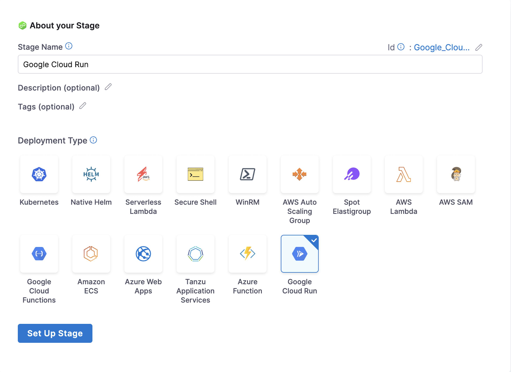
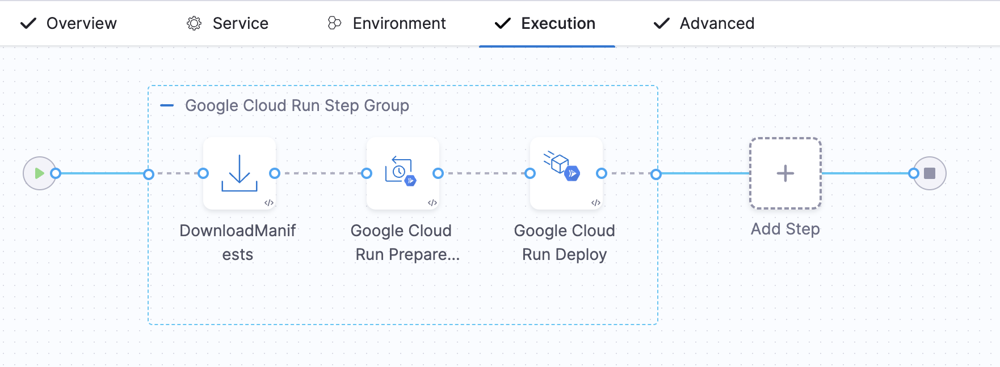
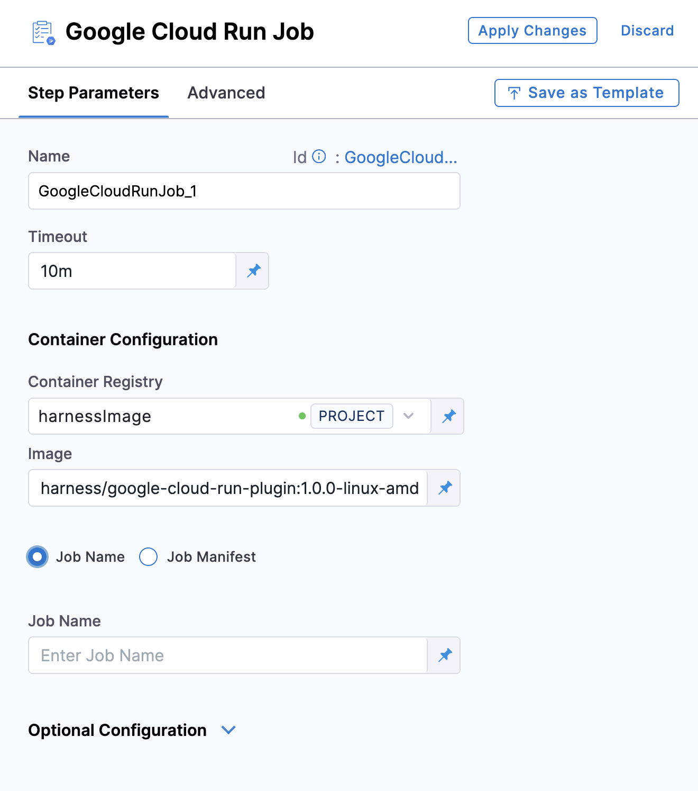

# Google Cloud Run Deployments

This guide explains how to deploy artifacts to Google Cloud Run using Harness.

:::note
Currently, this feature is behind the feature flag `CDS_GOOGLE_CLOUD_RUN`. Contact [Harness Support](mailto:support@harness.io) to enable the feature.
:::

## Overview

Harness supports deploying both **Google Cloud Run Services** and **Google Cloud Run Jobs**. 

- A **Google Cloud Run Service** is a stateless containerized application that scales automatically based on traffic. It is ideal for APIs, websites, and event-driven backends.  
- A **Google Cloud Run Job** is designed for task-based execution and runs to completion, making it ideal for batch processing, scheduled tasks, or background workloads.

Follow these steps to set up a **Google Cloud Run Service** in Harness:

## Create a CD Pipeline

1. In the Harness UI, create a new CD pipeline.
2. Add a Deploy stage and select **Google Cloud Run** as the deployment type.
3. Click **Set Up Stage**.

## Configure the Service

1. Select **Add Service** and add the **Google Cloud Run Service Manifest Definition**. This defines the containerized application compatible with Google Cloud Run.  

:::note 
Only Google Artifact Repository and Docker Registry are supported as artifact repositories.
:::

2. Save the new service.

## Configure the Environment and Infrastructure

1. Select **New Environment**, provide a name for the environment, and click **Save**.  
2. In the **Infrastructure Definition** section, click **New Infrastructure** and configure the following details:  

   - **Harness GCP Connector**: Create or select a Harness GCP connector to authenticate with your Google Account.  
   - **GCP Project**: Specify the project ID to define the target GCP project.  
   - **GCP Region**: Select the region where the Cloud Run service will be deployed.  

3. Save the infrastructure configuration.  

**GCP Authentication Support**

Harness supports the following methods for GCP authentication:  

- **Google OIDC Support**:  
   Create an OIDC connector to connect to the GCP account. For more details, refer to [Use OpenID Connect (OIDC) Connector](https://developer.harness.io/docs/platform/connectors/cloud-providers/ref-cloud-providers/gcs-connector-settings-reference/#use-openid-connect-oidc).  

- **Service Account**:  
   Create a GCP connector by providing a Service Account. For more details, refer to [Create a GCP connector](/docs/platform/connectors/cloud-providers/connect-to-google-cloud-platform-gcp).  

## Configure the Execution

In the **Execution** tab, select the deployment strategy. Currently, Harness supports the **Basic** and **Canary** deployment strategies for Google Cloud Run Service.

Harness automatically adds the **Deploy Cloud Run Step Group** based on the strategy you select.

The **Basic Strategy** includes the following steps:
1. **Download Manifest**
2. **Google Cloud Run Prepare Rollback**
3. **Google Cloud Run Deploy Step**

   

Optionally, you can add a **Google Cloud Run Traffic Shift Step**.

The **Canary Strategy** includes the following steps:
1. **Download Manifest**
2. **Google Cloud Run Prepare Rollback**
3. **Google Cloud Run Deploy Step**
4. **Google Cloud Run Traffic Shift Step**

### Download Manifest
- **Purpose**: Downloads the manifest specified in the service.  
- **Details**: The manifest contains all the configuration details necessary for deploying the service.

### Google Cloud Run Prepare Rollback
- **Purpose**: Fetches and saves the current deployment configurations for potential rollback scenarios.  
- **Details**:
  - Uses the `gcloud run services describe` command to retrieve service details.
  - Saves configuration details for use during rollback if required.
  - For more information, see the [Google Cloud Run Documentation](https://cloud.google.com/sdk/gcloud/reference/run/services/describe).

### Google Cloud Run Deploy Step
- **Purpose**: Applies the YAML manifest to create a new service or revision.  
- **Details**:
  - Executes the `gcloud run services replace` command to deploy the service.
  - Updates the container image in the YAML manifest to match the specified artifact.
  - Harness fetches and logs instance details using the **Google Cloud Monitoring SDK**.
  - Additional configuration options can be specified under **Google Cloud Run Services Replace Command Options**.
  - For more information, see the [Google Cloud Run Documentation](https://cloud.google.com/sdk/gcloud/reference/run/services/replace).

:::note
We do not use the Google Run Deploy command here as this command takes every field as a command flag. Instead, we use the replace command and replace all the configurations provided in the YAML file.
:::

### Google Cloud Run Traffic Shift Step
- **Purpose**: Manages traffic distribution across different revisions of the service.  
- **Details**:
  - Uses the `gcloud run services update-traffic` command.
  - Allows users to specify the percentage of traffic each revision should handle.
  - For more information, see the [Google Cloud Run Documentation](https://cloud.google.com/sdk/gcloud/reference/run/services/update-traffic).

### Container Configuration

For Container Registry, create or select a Docker connector to access the container registry. Use the following public Docker image:
- [`harness/google-cloud-run-plugin:1.0.1-linux-amd64`](https://hub.docker.com/layers/harness/google-cloud-run-plugin/1.0.1-linux-amd64/images/sha256-bfb25c236e59041452ca81c7370a5d1ca924b361acb5309de3424ccc0645d074).  

This image is required to perform deployments to Google Cloud Run

#### Optional Configurations
Harness allows for several optional configurations to customize deployment behavior:
- **Pre-Execution Command**: Run commands before deployment.
- **Image Pull Policy**: Specifies when to pull the container image from the registry.
- **Run as User**: Configures the user identity for security and access control.
- **Limit Memory**: Defines the maximum memory for the container or function.
- **Limit CPU**: Sets a limit on CPU usage for the container or function.
- **Environment Variables**: Additional environment variables can be configured.

### Rollback Steps
Harness provides rollback functionality to revert to previous configurations or states:
- **First Deployment**: Deletes the service using the `gcloud run services delete` command.
- **Subsequent Deployments**: Redirects traffic to older revisions using the `gcloud run services update-traffic` command.

:::note
Google Cloud Run does not allow deletion of the new revision; only traffic can be diverted to previous revisions.
:::

### Google Cloud Run Job Step

You can also add a Google Cloud Run Job step in the Execution tab.

**Container Configuration**

For Container Registry, create or select a Docker connector to access the container registry. Use the following public Docker image:
- [`harness/google-cloud-run-plugin:1.0.1-linux-amd64`](https://hub.docker.com/layers/harness/google-cloud-run-plugin/1.0.1-linux-amd64/images/sha256-bfb25c236e59041452ca81c7370a5d1ca924b361acb5309de3424ccc0645d074). 

This image is required to perform deployments to Google Cloud Run.

You can define your job using either Job Name or Job Manifest.

**Job Name**: Select Job Name when you already have a job defined in your Google Cloud Platform and you only want to execute it.  
   - Under **Job Name**, specify the name of the job you want to run.  
   - You can also make it a Runtime Input or an Expression.

**Job Manifest**: Select Job Manifest when you want to deploy a new job or update an existing job using a manifest file.  
   - Click **+ Google Cloud Run Job Manifest**.  
   - In the **Specify Google Cloud Run Job Manifest Store**, select the source where the manifest file is stored.  
   - In **Manifest Details**, specify the path where the manifest file is stored.

**Deploy Step**

The deploy step uses the deploy `gcloud run jobs replace` command and execute `gcloud run jobs execute` command in sequence.  
For more information on `gcloud run jobs replace` command, refer to the [Google Documentation](https://cloud.google.com/sdk/gcloud/reference/run/jobs/replace?hl=en).  
For more information on `gcloud run jobs execute` command, refer to the [Google Documentation](https://cloud.google.com/sdk/gcloud/reference/run/jobs/execute?hl=en).

**Optional Configurations**

You can provide additional command options (flags) in the Optional Configuration section:

- **Google Cloud Run Jobs Replace Command Options**: Used for the replace function.
- **Google Cloud Run Jobs Execute Command Options**: Used for the execute function.

Additionally, you can configure the following options:

- **Pre-Execution Command**: Run commands before deployment.
- **Image Pull Policy**: Specifies when the container image should be pulled from the registry.
- **Run as User**: Configures the user identity under which the function or container should run, useful for security and access control.
- **Limit Memory**: Defines the maximum memory that can be allocated to the container or function during execution.
- **Limit CPU**: Sets a limit on the CPU usage for the function or container, ensuring the function does not consume excessive resources.
- **Environment Variables**: Additional environment variables can be configured.

## Cloud Run Permission Requirements

Cloud Functions Minimum Permissions

The following are the minimum set of permissions required for deploying Google Cloud Run functions:

1. **List, Get, and Describe Services**:
   - `run.services.list`
   - `run.services.get`

2. **Create or Deploy Services**:
   - `run.services.create`
   - `run.services.update`

3. **Delete Services**:
   - `run.services.delete`

4. **Invoke Cloud Run Services** (if needed for execution):
   - `run.routes.invoke`

5. **Get Service Monitoring Data for Instance Sync**:
   - `monitoring.timeSeries.list`

6. **View Configuration and Permissions**:
   - `run.configurations.list`
   - `run.configurations.get`

7. **Manage IAM Policies for Services**:
   - `resourcemanager.projects.getIamPolicy`
   - `resourcemanager.projects.setIamPolicy`

8. **Authentication Using OIDC**:
   - `iam.workloadIdentityPools.createCredentialConfig`

9. **Authentication Using Service Account Key**:
   - `iam.serviceAccounts.get`
   - `iam.serviceAccounts.signBlob`

Alternatively, the following roles can also be used:

1. **Cloud Run Admin (`roles/run.admin`)**:
   - Grants full administrative access to manage Cloud Run services, including creating, updating, and deleting services.
   - Essential for deploying services to Cloud Run.

2. **Service Account User (`roles/iam.serviceAccountUser`)**:
   - Grants permission to use service accounts, which are required to run Cloud Run services.
   - Necessary when deploying services that use specific service accounts for execution.

3. **Logging Viewer (`roles/logging.viewer`)**:
   - Access to logs for debugging Cloud Run services.

4. **Monitoring Viewer (`roles/monitoring.viewer`)**:
   - Permission to view service monitoring data.

5. **IAM Workload Identity Pool Admin (`roles/iam.workloadIdentityPoolAdmin`)**:
   - This role grants you the necessary permissions to create, update, and delete workload identity pools and providers.

## Google CLoud Run Sample 

To see an example of how to deploy Google CLoud Run Service using Harness, visit the [Harness Community Repository](https://github.com/harness-community/harnesscd-example-apps/tree/master/google-cloud-run).

This repository provides a ready-to-use sample application and the necessary configuration files to help you get started quickly.
