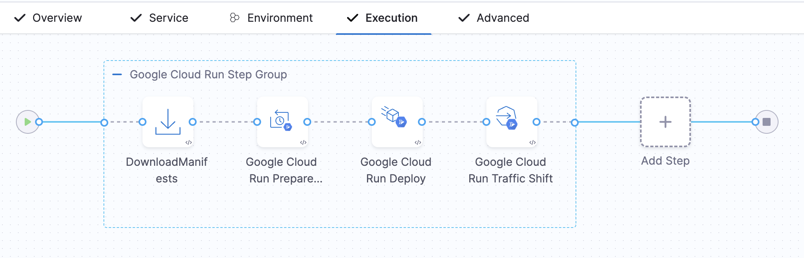

# Google Cloud Run Deployments

:::note

Currently, this feature is behind the feature flag `CDS_GOOGLE_CLOUD_RUN`. Contact [Harness Support](mailto:support@harness.io) to enable the feature.

:::

This topic explains how to deploy an artifact to Google Cloud Run using Harness.

## Deployment Summary

Here's a high-level summary of the setup steps:

1. Create a Harness CD pipeline.
2. Add a Deploy stage.
3. Select the deployment type **Google Cloud Run**, and then select **Set Up Stage**.
   
4. Select **Add Service**.
   1. Add the **Google Cloud Run Service Manifest Definition** to the new Cloud Run service. Manifest Definition must define stateless, containerized applications that are compatible with Google Cloud Run

   Currently, we support only two Artifact Repository types: Google Artifact Repository and Docker Registry.
   
   2. Save the new service.
5. Select **New Environment**, name the new environment, and select **Save**.
6. In **Infrastructure Definition**, select **New Infrastructure**.
     
     In Google Cloud Provider Details, create or select the Harness GCP connector, **GCP project**, and **GCP region**, and select **Save**.

      - The user can provide a GCP Connector to authenticate with the Google Account.
        - **GCP Authentication Support**:
          - Google OIDC Support. Users can create an OIDC connector to connect to the GCP account. For more information, go to [Use OpenID Connect (OIDC) Connector](https://developer.harness.io/docs/platform/connectors/cloud-providers/ref-cloud-providers/gcs-connector-settings-reference/#use-openid-connect-oidc)
          - Service Account. Users can create a GCP connector by providing a Service Account. For more information, go to [Create a GCP connector](/docs/platform/connectors/cloud-providers/connect-to-google-cloud-platform-gcp/)
      - Users can provide a project ID to specify which project.
      - Users can provide a region to specify the region they want to deploy the Cloud Run service.
      
7. In the **Execution** tab, select the deployment strategy. Currently, Harness supports the **Basic** and **Canary** deployment strategies
   
   Harness automatically adds the **Deploy Cloud Run Step Group** based on the strategy you select:
   - For **Basic Strategy**, the following steps are automatically added:
      1. Download Manifest
      2. Google Cloud Run Prepare Rollback
      3. Google Cloud Run Deploy Step

      

      Additionally, you can add Google Cloud Run Traffic Shift Step if required.

   - For **Canary Strategy**, the following steps are automatically added:
      1. Download Manifest
      2. Google Cloud Run Prepare Rollback
      3. Google Cloud Run Deploy Step
      4. Google Cloud Run Traffic Shift Step

      
   
   :::info note
In the deploy steps under Container Configuration, use the public Docker image:
[`harness/google-cloud-run-plugin:1.0.0-linux-amd64`](https://hub.docker.com/layers/harness/google-cloud-run-plugin/1.0.0-linux-amd64/images/sha256-2ad0c6d434673e56df47f1014c397d2bbc8248f8e76b5bbd48965f116f4843f2?context=explore). This image is required to perform deployments to Google Cloud Run.
:::

   All the configurations needed for the steps to run are passed as environment variables:
   1. **Download Manifest**:
      - Downloads the manifest specified in the service.
   2. **Google Cloud Run Prepare Rollback**:
      - Fetches the current configurations of the deployment and saves it. These details can be used during the rollback step.
      - The Prepare Rollback step uses the `gcloud run services describe` command to fetch the details of the service. For more information, go to [Google Cloud Run Documentation](https://cloud.google.com/sdk/gcloud/reference/run/services/replace).
   3. **Google Cloud Run Deploy Step**:
      - Applies the configurations YAML file and creates a new service or revision.
      - The Deploy Step uses the `gcloud run services replace` command to apply the YAML manifest provided by the user. For more information, go to [Google Cloud Run Documentation](https://cloud.google.com/sdk/gcloud/reference/run/services/replace).
      - Updates the container image field in the YAML manifest with the image provided in the service artifact, ensuring that the manifest reflects the correct configuration.
      - You can provide additional command options in the **Optional Configuration** under **Google Cloud Run Services Replace Command Options**.
      - Harness fetches the instance details configured by Google platform using the **Google Cloud Monitoring SDK** and saves them. These details can be viewed in the logs while running this step. For more information, go to [Google Cloud Run Documentation](https://cloud.google.com/monitoring/custom-metrics/reading-metrics).
      
      **Note**: We do not use the Google Run Deploy command here as this command takes every field as a command flag. Instead, we use the replace command and replace all the configurations provided in the YAML file.
   4. **Google Cloud Run Traffic Shift Step**:
      - Controls traffic distribution across different revisions.
      - The Traffic Shift Step leverages the `gcloud run services update-traffic` command to manage traffic distribution between service revisions. For more information, go to [Google Cloud Run Documentation](https://cloud.google.com/sdk/gcloud/reference/run/services/update-traffic).
      - Users can specify the percentage of traffic each revision should serve under **Revision Traffic Details**.

      Additionally, you can have **Optional Configurations** such as:

      - **Pre-Execution Command**: Run commands before deployment.
      - **Image Pull Policy**: Specifies when the container image should be pulled from the registry.
      - **Run as User**: Configures the user identity under which the function or container should run, useful for security and access control.
      - **Limit Memory**: Defines the maximum memory that can be allocated to the container or function during execution.
      - **Limit CPU**: Sets a limit on the CPU usage for the function or container, ensuring the function does not consume excessive resources.
      - **Environment Variables**: Additional environment variables can be configured.

8. Define the rollback step:
   - **Rollback Step**:
     - Reverts services to previous configurations or states.
     - If it’s the first deployment, the service is deleted using the `gcloud run services delete` command.
     - For subsequent deployments, traffic is redirected to older revisions using the `gcloud run services update-traffic` command.
     
     **Note**: Google Cloud Run does not allow you to delete the new revision. Only the traffic is diverted to the previous revisions.

10. Select **Save**, and then run the pipeline.

## Cloud Run Permission Requirements

When you set up a Harness GCP connector to connect Harness with your GCP account, the GCP IAM user or service account must have the appropriate permissions assigned to their account.

Cloud Functions Minimum Permissions

The following are the minimum set of permissions required for deploying Google Cloud Run functions:

1. **List, Get, and Describe Services**:
   - `run.services.list`
   - `run.services.get`

2. **Create or Deploy Services**:
   - `run.services.create`
   - `run.services.update`

3. **Delete Services**:
   - `run.services.delete`

4. **Invoke Cloud Run Services** (if needed for execution):
   - `run.routes.invoke`

5. **Get Service Monitoring Data for Instance Sync**:
   - `monitoring.timeSeries.list`

6. **View Configuration and Permissions**:
   - `run.configurations.list`
   - `run.configurations.get`

7. **Manage IAM Policies for Services**:
   - `resourcemanager.projects.getIamPolicy`
   - `resourcemanager.projects.setIamPolicy`

8. **Authentication Using OIDC**:
   - `iam.workloadIdentityPools.createCredentialConfig`

9. **Authentication Using Service Account Key**:
   - `iam.serviceAccounts.get`
   - `iam.serviceAccounts.signBlob`

Alternatively, the following roles can also be used:

1. **Cloud Run Admin (`roles/run.admin`)**:
   - Grants full administrative access to manage Cloud Run services, including creating, updating, and deleting services.
   - Essential for deploying services to Cloud Run.

2. **Service Account User (`roles/iam.serviceAccountUser`)**:
   - Grants permission to use service accounts, which are required to run Cloud Run services.
   - Necessary when deploying services that use specific service accounts for execution.

3. **Logging Viewer (`roles/logging.viewer`)**:
   - Access to logs for debugging Cloud Run services.

4. **Monitoring Viewer (`roles/monitoring.viewer`)**:
   - Permission to view service monitoring data.

5. **IAM Workload Identity Pool Admin (`roles/iam.workloadIdentityPoolAdmin`)**:
   - This role grants you the necessary permissions to create, update, and delete workload identity pools and providers.

