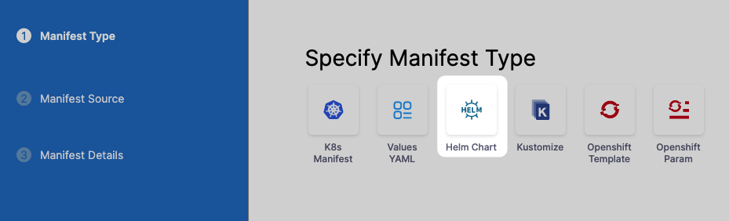
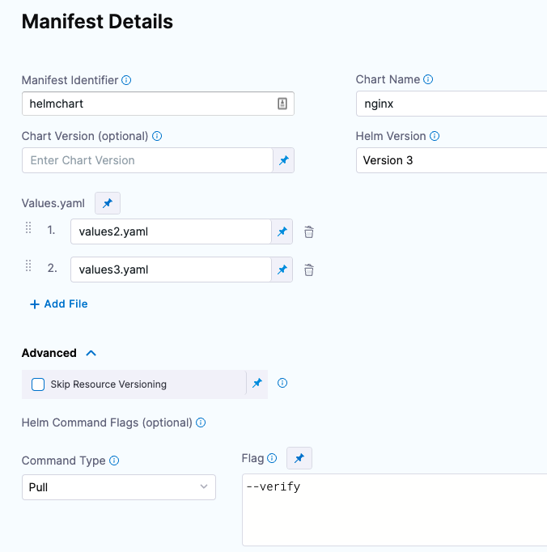
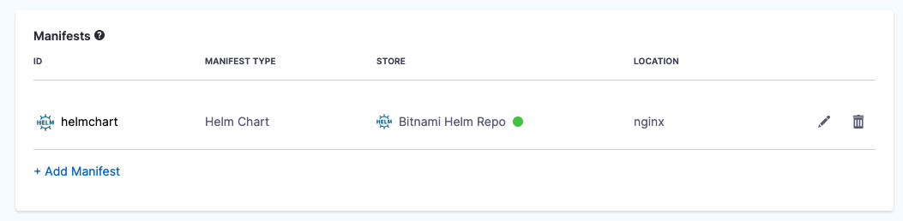
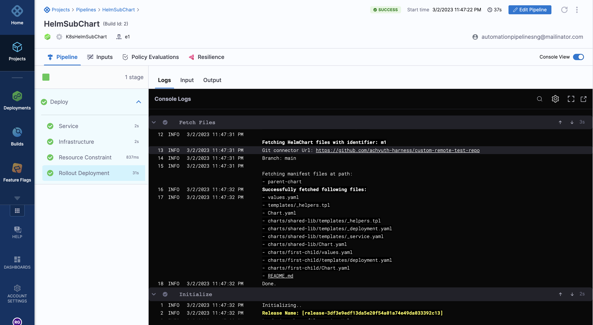
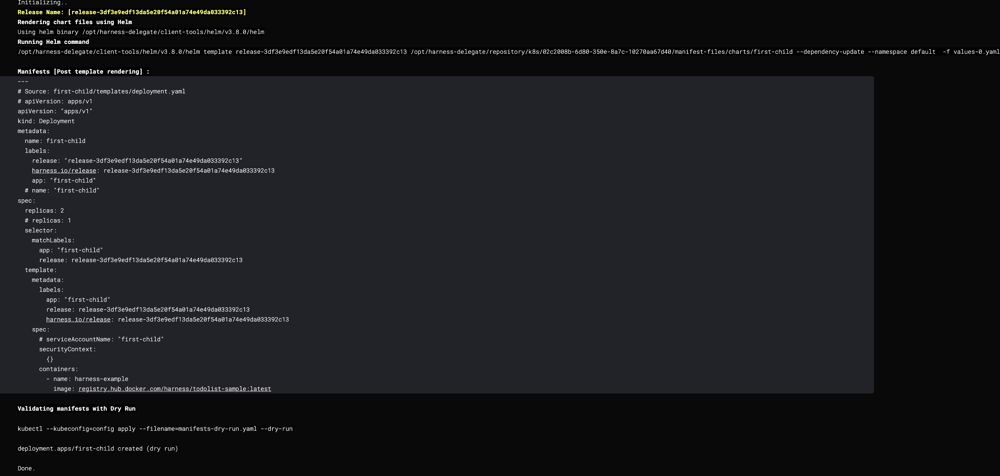
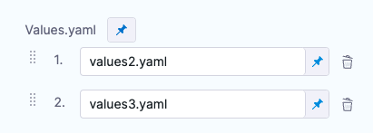
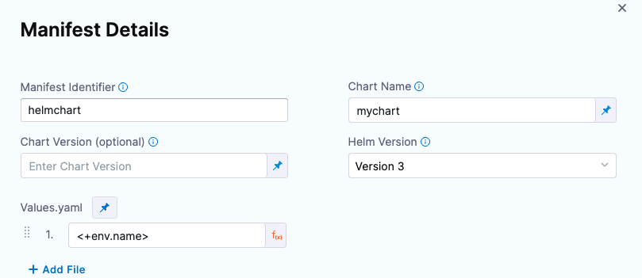
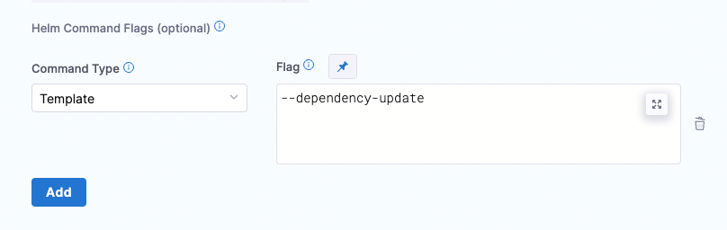
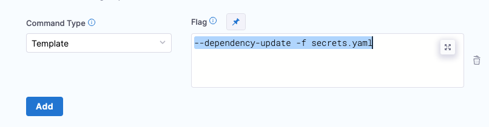

This topic describes how to deploy Helm charts in standard Helm syntax in YAML from a remote Git repo, HTTP Helm Repository, or cloud storage service (Google Cloud Storage, AWS S3).

This process is also covered in the [Helm Chart deployment tutorial](/docs/continuous-delivery/deploy-srv-diff-platforms/helm/helm-cd-quickstart).

## Before you begin

* [Helm CD Quickstart](/docs/continuous-delivery/deploy-srv-diff-platforms/helm/helm-cd-quickstart)
* [The Chart Template Developer's Guide](https://helm.sh/docs/chart_template_guide/) from Helm.
* The [Helm charts repo on GitHub](https://github.com/helm/charts) has many useful examples.

## Important notes

* Harness does not support AWS cross-account access for [ChartMuseum](https://chartmuseum.com/) and AWS S3. For example, if the Harness Delegate used to deploy charts is in AWS account A, and the S3 bucket is in AWS account B, the Harness Cloud Provider that uses this Delegate in A cannot assume the role for the B account.
* Helm 2 was deprecated by the Helm community in November 2020 and is no longer supported by Helm. If you continue to maintain the Helm 2 binary on your delegate, it might introduce high and critical vulnerabilities and put your infrastructure at risk.
  
  To safeguard your operations and protect against potential security vulnerabilities, Harness will launch an update to deprecate the Helm 2 binary from delegates with an immutable image type (image tag `yy.mm.xxxxx`) on **July 30, 2023**. For information on delegate types, go to [Delegate image types](/docs/platform/delegates/delegate-concepts/delegate-image-types).

  If your delegate is set to auto-upgrade, Harness will automatically remove the binary from your delegate. This will result in pipeline and workflow failures for services deployed via Helm 2. 

  :::info note
  If your development team still uses Helm 2, you can reintroduce the binary on the delegate. Harness is not responsible for any vulnerabilities or risks that might result from reintroducing the Helm 2 binary.
  :::

  For more information about updating your delegates to reintroduce Helm 2, go to:

  - [Delegate automatic upgrades and expiration policy](/docs/platform/delegates/install-delegates/delegate-upgrades-and-expiration/)

  - [Install a delegate with third-party tool custom binaries](/docs/platform/delegates/install-delegates/install-a-delegate-with-3-rd-party-tool-custom-binaries/)

  Contact [Harness Support](mailto:support@harness.io) if you have any questions.

## Supported platforms and technologies

See [Supported Platforms and Technologies](/docs/getting-started/supported-platforms-and-technologies).

## ChartMuseum binaries

Many Helm chart users use ChartMuseum as their Helm chart repository server.

* **ChartMuseum binary v0.8.2:** the default ChartMuseum binary used by Harness is v0.8.2.
* **ChartMuseum binary v0.12.0:** to use ChartMuseum binary v0.12.0 you must enable the feature flag `USE_LATEST_CHARTMUSEUM_VERSION`. Contact [Harness Support](mailto:support@harness.io) to enable the feature.

## Helm OCI Chart Registry Support

Harness supports the following Helm OCI chart registries:
  - Amazon ECR
  - Azure Container Registry
  - DockerHub
  - JFrog Artifactory
  - Google Artifact Registry

Helm OCI chart support includes the following deployment types:

- Native Helm
- Helm charts with Kubernetes deployments.

Harness OCI chart registry support details:

- You can use the Harness Helm OCI connector to authenticate Harness with any OCI compliant repository.
- Harness can fetch the list of chart versions for a respective Helm chart. These versions can be passed at runtime as a parameter into the service.
- You can define expressions for the **Chart Name** and **Path** settings, and, at runtime, Harness will resolve those expressions and let you pick a version.

### Important notes

- You cannot be trigger pipelines using the On New Manifest trigger if your service uses the OCI Helm connector. 


## Visual summary

Here's a quick video showing you how to add different types of manifests. It also describes how to add Helm charts and multiple values YAML files in the same repo as the chart, or in separate repos.

<!-- Video:
https://www.youtube.com/watch?v=dVk6-8tfwJc-->
<docvideo src="https://www.youtube.com/watch?v=dVk6-8tfwJc" />


## Artifacts and Helm charts

Harness supports image artifacts with Helm charts in the following ways.

<details>
<summary>Helm chart with hardcoded artifact</summary>

The image artifact is identified in the Helm chart values.yaml file. For example:


```yaml
...  
containers:  
  - name: nginx  
    image: docker.io/bitnami/nginx:1.21.1-debian-10-r0  
...
```

If the image is hardcoded then you do not use the **Artifacts** section of the service. Any artifacts added here are ignored.

</details>
<details>
<summary>Helm chart using artifact added to the stage</summary>

You add an image artifact to the **Artifacts** section of the service and then reference it in the Helm chart values.yaml file.

Artifacts in the **Artifacts** section are referenced using the `<+artifact.image>` expression. For example:


```yaml
...  
image: <+artifact.image>  
pullPolicy: IfNotPresent  
dockercfg: <+artifact.imagePullSecret>  
...
```

This is the same method when using artifacts with standard Kubernetes deployments. See [Add Container Images as Artifacts for Kubernetes Deployments](/docs/continuous-delivery/deploy-srv-diff-platforms/kubernetes/cd-kubernetes-category/add-artifacts-for-kubernetes-deployments).

</details>

## Add the Helm chart

Adding a Helm chart is a simple process of connecting Harness to the Git or HTTP Helm repo where your chart is located.

1. In your CD stage, click **Service**.
2. In **Service Definition**, select **Kubernetes**.
3. In **Manifests**, click **Add Manifest**.
4. In **Specify Manifest Type**, select **Helm Chart**, and click **Continue**.
   
   
5. In **Specify Helm Chart Store**, select the type of repo or or cloud storage service (Google Cloud Storage, AWS S3) you're using.

For the steps and settings of each option, see the [Connect to an Artifact Repo](https://developer.harness.io/docs/platform/connectors/artifact-repositories/connect-to-an-artifact-repo/) How-tos.

If you are using Google Cloud Storage or Amazon S3, see [Cloud Platform Connectors](/docs/category/cloud-providers).

You can also use a local Helm chart if you are deploying the same Helm chart and version to many clusters/namespaces in parallel. For information, see [Use a local Helm Chart](/docs/continuous-delivery/deploy-srv-diff-platforms/helm/use-a-local-helm-chart). For all of the Helm Chart Store types (Git, GitHub, HTTP Helm, OCI, etc), you will need to provide the following Helm info:


- **Manifest Identifier**: Enter a name that identifies this Helm chart. It doesn't have to be the chart name. It can be the name of the service you are deploying or another name. Ex: `helm_chart`.
- **Chart name**: Enter the name of the Helm chart for Harness to pull. Don't include the chart version. You will add that in the **Chart Version** setting. Ex: `todolist`.
- **Chart Version**: Enter the version of the chart you want to deploy. This is found in the Chart.yaml `version` label in your chart. You can list all available versions of a chart using the `search repo` command with the `--versions` option. See [helm search repo](https://helm.sh/docs/helm/helm_search_repo) from Helm.
  - If you leave **Chart Version** empty Harness gets the latest chart.
  - If you are going to use a Harness trigger to run this pipeline when a new version is added to your chart repo, select the **Runtime Input** option. When you set up the trigger, you will select this chart and Harness will listen on the repo for new versions. See [Trigger Pipelines on New Helm Chart](/docs/platform/Triggers/trigger-pipelines-on-new-helm-chart). For example, `1.4.1`.
- **Helm Version**: Select the version of Helm used in your chart. See [Helm Version Support Policy](https://helm.sh/docs/topics/version_skew/) from Helm. For example, `Version 2`.
- **Values YAML**: Your chart will have a default values.yaml file in its root folder.
  - If you do not enter a values.yaml in **Values YAML**, Harness uses the default values.yaml file in the root of the chart.
  - If you want to use a different values.yaml file, enter the path to that file.
  - For example, let's imagine a Helm Chart with the following Values YAML files:
  * dev-values.yaml
  * qa-values.yaml
  * prod-values.yaml
  * sample-chart/test-values.yaml

  You can specify the values YAML file based using a path to the file within the retrieved Helm chart.

  If you have additional values YAML files in the chart, and you want to use those to override some settings of the default values.yaml file for this deployment, you can enter the addition values YAML file(s) in **Values YAML**.

  For each additional values YAML file, specify its location within this chart. Enter the location from the root of the chart to the values.yaml file.

  If a values YAML file is located in a folder, enter the path from the root of the chart to the folder and values.yaml.

  The values YAML file(s) must be in this chart. You cannot enter a location to a values YAML file in a chart located somewhere else.If you use multiple files in **Values YAML**, priority is given from the last file to the first file.

  For example, let's say you have 3 files: the default values.yaml, values2.yaml added next, and values3.yaml added last. 
  
  ![]./static/deploy-helm-charts-05.png)
  
  All files contain the same key:value pair. 

  The values3.yaml key:value pair overrides the key:value pair of values2.yaml and values.yaml files.

  You can also select **Expression** and use [Harness expressions](/docs/platform/Variables-and-Expressions/harness-variables) in this setting. The resolved expression must be the name of a Values YAML file in the chart. For example, you could create a stage variable for **values4.yaml** named **qa** and then reference it in **Values YAML** like this: `<+stage.variables.qa>`.
- **Skip Resource Versioning**: By default, Harness versions ConfigMaps and secrets deployed into Kubernetes clusters. In some cases, such as when using public manifests or Helm charts, you cannot add the annotation. When you enable **Skip Resource Versioning**, Harness will not perform versioning of ConfigMaps and secrets for the resource. If you have enabled **Skip Resource Versioning** for a few deployments and then disable it, Harness will start versioning ConfigMaps and secrets.
- **Helm Command Flags**: You can use Helm command flags to extend the Helm commands that Harness runs when deploying your Helm chart. Harness will run Helm-specific Helm commands and their flags as part of preprocessing. All the commands you select are run before `helm install/upgrade`.
- **Command Type**: Select the Helm command type you want to use. For example:
  - [Template](https://v2.helm.sh/docs/helm/#helm-template): `helm template` to render the helm template files.
  - [Pull](https://helm.sh/docs/helm/helm_pull/): `helm pull` (v2) to get the Helm chart.
- **Flag**: Add any options for the command. Ex: `--verify`.

Here's an example:



If you haven't set up a Harness delegate, you can add one as part of the connector setup. This process is described in [Helm CD Quickstart](/docs/continuous-delivery/deploy-srv-diff-platforms/helm/helm-cd-quickstart) and [Install a Kubernetes Delegate](https://developer.harness.io/docs/platform/Delegates/install-delegates/overview).

Once your Helm chart is added, it appears in the **Manifests** section. For example:



## Using subcharts

:::note
This feature is currently behind the feature flag, `NG_CDS_HELM_SUB_CHARTS`. Contact [Harness Support](mailto:support@harness.io) to enable this feature. 
:::

Helm charts can have dependencies called subcharts. You can define subcharts in your service YAML. Helm downloads these dependencies from exisiting or seperate repositories. Harness fetches the defined subcharts during pipeline execution.

### Important notes

* Helm subcharts are supported for the following deployment types only.
    - Kubernetes deployments using canary, blue/green, and rolling deployment strategies
    - Native Helm deployments using basic strategy
* Harness Continuous Delivery (CD) captures the parent chart as the deployed instance. Harness Continuous Verification (CV) detects and verifies the parent chart as the deployed instance. CV cannot simultaneously verify all subcharts as deployed instances. 

### Service configuration

To configure Helm subcharts, you must define the subchart name and path in your service YAML. 

To resolve dependencies, you must configure the Helm command `Template` with the flag, `--dependency-update`. This allows Harness to fetch your dependencies defined in `Chart.yaml`.

:::important
Helm charts store their dependencies in the `charts/` folder. Make sure that all subcharts are located within the `charts/` folder inside your parent chart. Look at the sample [Harness respository](https://github.com/thisrohangupta/custom-remote-test-repo/tree/main/parent-chart) for structural guidance.

Here is a sample directory: 

```
charts/
	- subchart1/
		 - templates/
			 - app.yaml
		 - Chart.yaml
		 - values.yaml
```
:::

Here is a sample service YAML where a subchart is defined.

```
service:
  name: K8sHelmSubChart
  identifier: K8sHelmSubChart
  serviceDefinition:
    type: Kubernetes
    spec:
      manifests:
        - manifest:
            identifier: m1
            type: HelmChart
            spec:
              store:
                type: Github
                spec:
                  connectorRef: gitHubAchyuth
                  gitFetchType: Branch
                  folderPath: parent-chart
                  branch: main
              subChartName: first-child
              skipResourceVersioning: false
              enableDeclarativeRollback: false
              helmVersion: V3
              commandFlags:
                - commandType: Template
                  flag: "--dependency-update"
  gitOpsEnabled: false

```

### Pipeline execution of a Helm chart with subcharts

During pipeline execution, Harness fetches the subcharts and dependencies for the deployment based on the values in the service YAML. 

You can see the subchart and the list of files fetched in the fetch section of the pipeline execution log.



You can see the `template` command with the `--dependency-update` flag running in the prepare section of the pipeline execution.



## Reference the artifact

If the image artifact is not hardcoded in the Helm chart, add the artifact in **Artifacts** and use the expression `<+artifact.image>` in your values.yaml. For example:


```yaml
...  
image: <+artifact.image>  
pullPolicy: IfNotPresent  
dockercfg: <+artifact.imagePullSecret>  
...
```

This is the same method when using artifacts with standard Kubernetes deployments. For more information, go to [Add Container Images as Artifacts for Kubernetes Deployments](/docs/continuous-delivery/deploy-srv-diff-platforms/kubernetes/cd-kubernetes-category/add-artifacts-for-kubernetes-deployments).

## Override chart values YAML in service

You can override the values YAML in the Helm chart by adding multiple values YAML files when you add the chart.

If you use multiple files, priority is given from the last file to the first file.

For example, let's say you have 3 files: the default values.yaml, values2.yaml added next, and values3.yaml added last.



All files contain the same key:value pair. The values3.yaml key:value pair overrides the key:value pair of values2.yaml and values.yaml files.

Your values.yaml file can use [Go templating](https://godoc.org/text/template) and [Harness built-in variable expressions](/docs/platform/Variables-and-Expressions/harness-variables).

See [Example Kubernetes Manifests using Go Templating](/docs/continuous-delivery/deploy-srv-diff-platforms/kubernetes/cd-k8s-ref/example-kubernetes-manifests-using-go-templating).

## Override chart values YAML in environment

You can override the values YAML file for a stage's environment by mapping the environment name to the values file or folder. Next, you use the `<+env.name>` Harness expression in the values YAML path.

Let's look at an example.

Let's say there is a repo with three values YAML files, dev.yaml, qa.yaml. prod.yaml. In the **Values YAML** setting for the values file, you use the `<+env.name>` expression.



Next, in the environment setting, you add three environments, one for each YAML file name.

When you select an environment, such as **qa**, the name of the environment is used in **File Path** and resolves to **qa.yaml**. At runtime, the **qa.yaml** values file is used, and it overrides the values.yaml file in the chart.

Instead of selecting the environment in the **Infrastructure** each time, you can set the environment as a **Runtime Input** and then enter **dev**, **qa**, or **prod** at runtime.

## Define the infrastructure and execution

There is nothing unique about defining the target cluster infrastructure definition for a Helm chart deployment. It is the same process as a typical Harness Kubernetes deployment.

For more information, go to [Define Your Kubernetes Target Infrastructure](/docs/continuous-delivery/deploy-srv-diff-platforms/kubernetes/define-your-kubernetes-target-infrastructure).

Helm charts can be deployed using any of the execution steps and deployment strategies used in other Kubernetes deployments. For more information, go to [Kubernetes How-tos](/docs/category/kubernetes).

## Deploy

Each Helm chart deployment is treated as a release. During deployment, when Harness detects that there is a previous release for the chart, it upgrades the chart to the new release.

In your pipeline, click **Run**.

The Helm chart deployment runs.

You will see Harness fetch the Helm chart. Here is an example:


```bash
Helm repository: Bitnami Helm Repo  
  
Chart name: nginx  
  
Chart version: 9.4.1  
  
Helm version: V3  
  
Repo url: https://charts.bitnami.com/bitnami  
  
Successfully fetched values.yaml  
  
Fetching files from helm chart repo  
  
Helm repository: Bitnami Helm Repo  
  
Chart name: nginx  
  
Helm version: V3  
  
Repo url: https://charts.bitnami.com/bitnami  
  
Successfully fetched following files:  
  
- nginx/.helmignore  
- nginx/charts/common/.helmignore  
- nginx/charts/common/templates/validations/_postgresql.tpl  
- nginx/charts/common/templates/validations/_cassandra.tpl  
- nginx/charts/common/templates/validations/_mongodb.tpl  
- nginx/charts/common/templates/validations/_mariadb.tpl  
- nginx/charts/common/templates/validations/_validations.tpl  
- nginx/charts/common/templates/validations/_redis.tpl  
- nginx/charts/common/templates/_ingress.tpl  
- nginx/charts/common/templates/_names.tpl  
- nginx/charts/common/templates/_affinities.tpl  
- nginx/charts/common/templates/_storage.tpl  
- nginx/charts/common/templates/_utils.tpl  
- nginx/charts/common/templates/_errors.tpl  
- nginx/charts/common/templates/_capabilities.tpl  
- nginx/charts/common/templates/_secrets.tpl  
- nginx/charts/common/templates/_warnings.tpl  
- nginx/charts/common/templates/_tplvalues.tpl  
- nginx/charts/common/templates/_images.tpl  
- nginx/charts/common/templates/_labels.tpl  
- nginx/charts/common/Chart.yaml  
- nginx/charts/common/values.yaml  
- nginx/charts/common/README.md  
- nginx/Chart.lock  
- nginx/templates/svc.yaml  
- nginx/templates/health-ingress.yaml  
- nginx/templates/ldap-daemon-secrets.yaml  
- nginx/templates/tls-secrets.yaml  
- nginx/templates/NOTES.txt  
- nginx/templates/pdb.yaml  
- nginx/templates/ingress.yaml  
- nginx/templates/server-block-configmap.yaml  
- nginx/templates/serviceaccount.yaml  
- nginx/templates/hpa.yaml  
- nginx/templates/servicemonitor.yaml  
  
Done.
```

Next, Harness will initialize and prepare the workloads, apply the Kubernetes manifests, and wait for steady state.

In **Wait for Steady State** you will see the workloads deployed and the pods scaled up and running (the release name has been shortened for readability):


```bash
kubectl --kubeconfig=config get events --namespace=default --output=custom-columns=KIND:involvedObject.kind,NAME:.involvedObject.name,NAMESPACE:.involvedObject.namespace,MESSAGE:.message,REASON:.reason --watch-only  
  
kubectl --kubeconfig=config rollout status Deployment/release-e008...ee-nginx --namespace=default --watch=true  
  
Status : release-e008...ee-nginx   Waiting for deployment spec update to be observed...  
  
Event  : release-e008...ee-nginx   Deployment   release-e008...ee-nginx   default     Scaled up replica set release-e008...ee-nginx-779cd786f6 to 1   ScalingReplicaSet  
  
Status : release-e008...ee-nginx   Waiting for deployment spec update to be observed...  
  
Status : release-e008...ee-nginx   Waiting for deployment "release-e008...ee-nginx" rollout to finish: 0 out of   
  
Event  : release-e008...ee-nginx   ReplicaSet   release-e008...ee-nginx-779cd786f6   default   Created pod: release-e008...ee-nginx-779n765l   SuccessfulCreate  
  
Status : release-e008...ee-nginx   Waiting for deployment "release-e008...ee-nginx" rollout to finish: 0 of 1 updated replicas are available...  
  
Event  : release-e008...ee-nginx   Pod   release-e008...ee-nginx-779n765l   default   Successfully assigned default/release-e008...ee-nginx-779n765l to gke-doc-account-default-pool-d910b20f-argz   Scheduled  
  
Event  : release-e008...ee-nginx   Pod   release-e008...ee-nginx-779n765l   default   Pulling image "docker.io/bitnami/nginx:1.21.1-debian-10-r0"   Pulling  
  
Event  : release-e008...ee-nginx   Pod   release-e008...ee-nginx-779n765l   default   Successfully pulled image "docker.io/bitnami/nginx:1.21.1-debian-10-r0" in 3.495150157s   Pulled  
  
Event  : release-e008...ee-nginx   Pod   release-e008...ee-nginx-779n765l   default   Created container nginx   Created  
  
Event  : release-e008...ee-nginx   Pod   release-e008...ee-nginx-779n765l   default   Started container nginx   Started  
  
Status : release-e008...ee-nginx   deployment "release-e008...ee-nginx" successfully rolled out  
  
Done.
```
You deployment is successful.

### Versioning and rollback

Helm chart deployments support versioning and rollback in the same way as standard Kubernetes deployments.

For more information, go to [Kubernetes Rollback](/docs/continuous-delivery/deploy-srv-diff-platforms/kubernetes/cd-k8s-ref/kubernetes-rollback).

## Trigger the pipeline on a new chart version

You can set up a Harness trigger to listen on the chart repo and execute the pipeline when a new chart version appears. For more information, go to [Trigger Pipelines on New Helm Chart](/docs/platform/Triggers/trigger-pipelines-on-new-helm-chart).

## Fetch Helm chart dependencies

Harness can fetch Helm chart dependencies within GitHub using the `--dependency-update` command flag. 
  
Harness fetches dependent Helm charts along with the main Helm chart used for the deployment. Dependencies are resolved before Harness performs the deployment of the main Helm chart. 

For more information, go to [Helm Docs](https://helm.sh/docs/helm/helm_template/#helm).

To update Helm chart dependencies:

* For Kubernetes with Helm deployments (as described in this topic), configure **Helm Command Flags** with the **Template** command type and `--dependency-update` flag.

* For Native Kubernetes deployments, add the command flag `--depdency-update` to the **Install** and **Upgrade** command types.

:::info
  
All dependency repositories must be available and accessible from the Harness Delegate(s) used by the deployment.

:::

## Service hooks 
  
:::note

Currently, this feature is behind the feature flag `CDS_K8S_SERVICE_HOOKS_NG`. Contact [Harness Support](mailto:support@harness.io) to enable the feature.

:::

Kubernetes and Helm deployments use service hooks to fetch Helm Chart dependencies that refer to Git and other repositories, and install them with the main Helm Chart. 

Harness supports two types of service hooks: preHook and postHook. These are the service hook actions supported by Harness: 

* Fetch files: Service hooks can be triggered before or after the manifest files are fetched. 
* Manifest templates: Service hooks can be triggered before or after the manifest has been rendered. 
* Steady state check: Service hooks can be triggered before or after the steady state check.

Each service hook has its own context variable: 

| **Action** | **Context Variable and Description** |
| :--- | :--- |
| Fetch files | `$MANIFEST_FILES_DIRECTORY`: The path to the directory from where the manifest files can be downloaded. |
| Manifest template | `$MANIFEST_FILES_DIRECTORY`: The path to the directory where the original Kubernetes template is located. <br />`$MANIFEST_FILE_OUTPUT_PATH`: The path to the final `manifest.yaml` file. |
| Steady state check | `$WORKLOADS_LIST`: The comma separated list of all workloads. <br />`$MANAGED_WORKLOADS`: The comma separated list of workloads managed by Harness. <br />`$CUSTOM_WORKLOADS`: The comma separated list of custom workloads. |

You can use service hooks to run additional configurations when carrying out the actions above. For example, when you run a deployment, you must fetch files first. After fetching the files, you can resolve the secrets of those encrypted files using Helm secrets, SOPS, AGE keys, and so on. You can use the context variables above during deployment. For more details, go to [Using shell scripts in CD stages](/docs/continuous-delivery/x-platform-cd-features/cd-steps/cd-general-steps/using-shell-scripts).

Here are some sample service hook YAMLs: 

```
hooks:
  - preHook:
      identifier: sample
      storeType: Inline
      actions:
        - FetchFiles
        - TemplateManifest
        - SteadyStateCheck
      store:
        content: echo "sample Hook for all action"
```

```
hooks:
  - postHook:
      identifier: dependency
      storeType: Inline
      actions:
        - FetchFiles
      store:
        content: |
          cd $MANIFEST_FILES_DIRECTORY
          helm repo add test-art-remote https://sample.jfrog.io/artifactory/sample-charts/ --username automationuser --password <+secrets.getValue("reposecret")>
          helm dependency build
          cd charts
```

```
hooks:
  - postHook:
      identifier: cdasd
      storeType: Inline
      actions:
        - FetchFiles
      store:
        content: |-
          source $HOME/.profile
          cd $MANIFEST_FILES_DIRECTORY
          echo $MANIFEST_FILES_DIRECTORY
          export SOPS_AGE_KEY=<+secrets.getValue("agesecret")>
          helm secrets decrypt secrets.enc.yaml
          helm secrets decrypt secrets.enc.yaml > secrets.yaml
```

For more information about Helm dependencies, go to [Helm dependency](https://helm.sh/docs/helm/helm_dependency/) and [Helm dependency update](https://helm.sh/docs/helm/helm_dependency_update/).

### Video summary

<!-- Video:
https://www.loom.com/share/d6b8061648bb4b9fb2afc5142d340537-->
<docvideo src="https://www.loom.com/share/d6b8061648bb4b9fb2afc5142d340537" />

### Use case: Add private repositories as a Helm Chart dependency

1. Add a repository in Helm using the following script: 

   ```
   helm repo add test-remote-name 
   https://url.to.chart.example.artifactory/artifactory/harness-helm-charts/ --username 
   <+secrets.getValue("username")> --password <+secrets.getValue("password")>
   ```
2. Add the required name and version of the dependency in the `Chart.yaml` to reference these dependencies. 
   
   The repository name starts with `@` followed by the name you used for the repository in your script.

   ```
   apiVersion: v1
   appVersion: "1.0"
   description: A Helm chart for Kubernetes
   name: todolist
   version: 0.2.0
   
   dependencies:
     - name: trivy-operator
       version: "0.1.9"
       repository: "https://aquasecurity.github.io/helm-charts/"
     - name: kube-prometheus-stack
       version: "16.13.0"
       repository: "@test-art-remote"
   ```

3. Run the `--dependency-update` command flag in the manifest configuration to update dependencies as shown in the image below:
   
   

### Use case: Use secrets to encrypt and decrypt files

1. Install [SOPS](https://github.com/mozilla/sops) or [AGE](https://github.com/FiloSottile/age) keys to generate a public key to encrypt files. 
2. Enter the following commands to encrypt and save your files in your Git repository: 
   
   ```
   export SOPS_AGE_KEY=<"ENTER_YOUR_SOPS_AGE_KEY">
   sops --encrypt --age $SOPS_AGE_KEY secrets.yaml > secrets.enc.yaml
   ```
   This command creates a `secrets.yaml` file.
3. Enter the following commands to decrypt the `secrets.yaml` file and use it to resolve the values in your Chart:
   
   ```
   cd $MANIFEST_FILES_DIRECTORY    //go to the directory containing manifest-files
   export SOPS_AGE_KEY=<+secrets.getValue("agesecret")> // export the PRIVATE Key to be used to decrypt
   sops --decrypt secrets.enc.yaml     // you can decrypt using sops
   helm secrets decrypt secrets.enc.yaml     // or by using helm secrets
   helm secrets decrypt secrets.enc.yaml > secrets.yaml    // store the decrypted file in a temporary folder
   ```
   
   Alternatively, run the `--dependency-update -f secrets.yaml` command flag in the manifest configuration to resolve the values as shown in the image below:

   

## Uninstall command flag

If you want to use the uninstall command in the **Manifest Details**, be aware of the following:

* When the deployment is successful, Harness won't execute this command.
* If the deployment fails on the very first execution, then Harness will apply the `--uninstall` flag itself. You can see this in the logs under `Wait For Steady State`.
* If you want to pass in some command flags when Harness performs the `--uninstall`, enter uninstall in **Manifest Details** and enter in the relevant command flags.

## Authentication for Google Cloud with Helm OCI connector

 To configure authentication for GCP with a Helm OCI connector, you must provide the username and password to your Google service account.
  
 **Username**: A _json_key or _json_key_base64. We recommend that you use the json_key_base64 to encode your Google service account file to base64.
  
 **Password**: Your Google service account file content.
 


