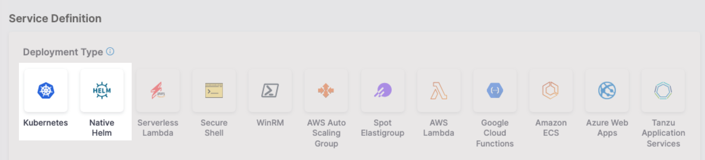

Harness supports Helm 3 deployments as part of its Kubernetes swimlane. You can deploy Helm charts and subcharts to your target infrastructure using all of the common chart and artifact repositories and cloud platforms.

This topic summarizes Helm support in Harness and provides links to Helm-related topics.

For a quick tutorial, go to [Deploy using Helm Chart](https://developer.harness.io/tutorials/cd-pipelines/kubernetes/helm-chart).

Learn [CD pipeline basics](/docs/continuous-delivery/get-started/cd-pipeline-basics) before you review Helm deployment basics below.

<details>
<summary>Visual summary</summary>

Here's a quick video showing you how to add different types of manifests. It also describes how to add Helm charts and multiple values YAML files in the same repo as the chart, or in separate repos.


<!-- Video:
https://www.youtube.com/watch?v=Wvr52UKDOJQ-->
<docvideo src="https://www.youtube.com/watch?v=Wvr52UKDOJQ" />


</details>

## Supported integrations with Helm

For details on supported Helm versions, tooling, limitations, and repositories, go to [Supported CD features and integrations](/docs/continuous-delivery/cd-integrations).


## Kubernetes and Helm vs Native Helm deployments

Harness supports the use of Helm in its Kubernetes deployment type. Harness also includes a separate Native Helm deployment type.

When you create a Harness service, you will see both Kubernetes and Native Helm options and wonder what are their differences.

  

Here are the differences:

```mdx-code-block
import Tabs from '@theme/Tabs';
import TabItem from '@theme/TabItem';
```
```mdx-code-block
<Tabs>
  <TabItem value="Kubernetes" label="Kubernetes" default>
```

- Harness Kubernetes deployments allow you to use your own Kubernetes manifests or a Helm chart (remote or local), and Harness executes the Kubernetes API calls to build everything without requiring a Helm installation in the target cluster.
- Harness Kubernetes deployments also support all deployment strategies (canary, blue green, rolling, custom).
- **Versioning:** Harness Kubernetes deployments version all objects, such as ConfigMaps and Secrets.
- **Rollback:** In the event of deployment failure, Harness Kubernetes deployments will roll back to the last successful version.

```mdx-code-block
  </TabItem>
  <TabItem value="Native Helm" label="Native Helm">
```

- For Harness Native Helm Deployments, you must always have Helm running on one pod in your target cluster.
- You can perform a rolling deployment strategy only (no canary or blue green). 
- **Versioning:** Native Helm does not version deployments.
- **Rollback:** Harness does not perform rollback. Instead, Harness uses Helm's native rollback functionality.

```mdx-code-block
  </TabItem>
</Tabs>
```

## Deployment requirements

A Harness Helm deployment requires the following:

- Helm chart stored remotely or locally using the Harness [Harness File Store](/docs/continuous-delivery/x-platform-cd-features/services/add-inline-manifests-using-file-store).
- Artifact, if not hardcoded in values YAML file.
- Harness delegate installed in a location where it can connect to Harness, the deployment cluster, the chart and artifact repositories, and any other integrations. You can install the delegate in the same cluster as the app you are deploying, but it's not required.
- Target Kubernetes cluster: You will need a target cluster your apps and Kubernetes workloads. Your cluster should have enough RAM to host the your apps and workloads.

## What does Harness deploy?

Harness takes the artifacts and Helm chart you provide and deploys the chart and its artifact to the target Kubernetes cluster.

You can hardcode the artifact in the chart or add its location to Harness and select the artifact dynamically, according to your rules.

For a list of the Kubernetes objects Harness supports, go to [Kubernetes deployments overview](/docs/continuous-delivery/deploy-srv-diff-platforms/kubernetes/kubernetes-deployments-overview).

### Local charts support

To support cases where you might be deploying the same Helm chart and version to many clusters/namespaces in parallel, Harness includes the option of using a local chart installed on the Harness delegate local disk.

For details on using local charts, go to [Use a local Helm chart](/docs/continuous-delivery/deploy-srv-diff-platforms/helm/use-a-local-helm-chart).

## Helm pipeline summary

A Helm pipeline uses a Harness **Deploy** stage to deploy your Helm chart and artifact to your target cluster according to your steps.

Let's quickly review the main components of a Harness Helm pipeline.

:::note

For a detailed explanation of Helm deployments, go to [Deploy Helm charts](/docs/continuous-delivery/deploy-srv-diff-platforms/helm/deploy-helm-charts). 

:::

<table>
	<tbody>
		<tr>
			<th></th>
			<th>Pipeline component</th>
			<th>Description</th>
		</tr>
		<tr>
			<td>What you want to deploy</td>
			<td>Service</td>
			<td>
            <ul>
               <li>The Helm chart and artifacts for your app.</li>
               <li>Harness connectors for your repositories.</li>
            </ul>
         </td>
		</tr>
		<tr>
			<td>Where you want to deploy</td>
			<td>Environment</td>
			<td>
            <ul>
               <li>The target cluster for your deployment.</li>
            </ul>
         </td>
		</tr>
		<tr>
			<td>How you want to deploy</td>
			<td>Execution steps</td>
			<td>
            <ul>
               <li>A <b>Deploy</b> stage includes the deployment strategy and steps.</li>
               <li>Pick a strategy and Harness automatically adds the required steps.</li>
               <li>Add custom steps to perform other tasks.</li>
            </ul>
         </td>
		</tr>
	</tbody>
</table>

## Trigger pipelines on Helm chart and artifact versions

You can add a trigger to your pipeline that will run the pipeline when the Helm chart or artifact version changes.

For details, go to:

- [Trigger pipelines on new Helm chart](https://developer.harness.io/docs/platform/Triggers/trigger-pipelines-on-new-helm-chart)
- [Trigger pipelines on a new artifact](https://developer.harness.io/docs/platform/Triggers/trigger-on-a-new-artifact)
- [Triggers](https://developer.harness.io/docs/category/triggers)

## Helm delegates
   
Harness includes a Helm-based Harness delegate but you can use any delegate type for Helm deployments.

For steps on Helm delegates, go to [Delegate installation overview](https://developer.harness.io/docs/platform/Delegates/install-delegates/overview).

If you select to build your own delegate and include only those tools needed for Helm deployments, go to [Delegate-required SDKs](https://developer.harness.io/docs/platform/delegates/delegate-reference/delegate-required-sdks/) to see what Kubernetes and Helm-related binaries are required.


