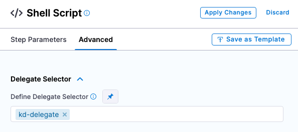
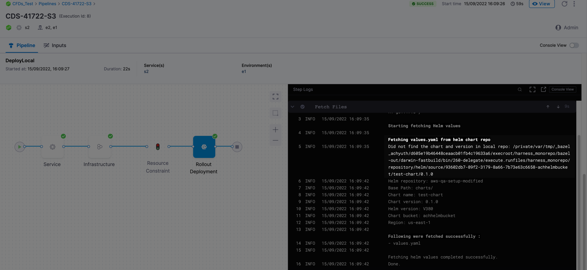

Harness supports Helm charts stored in a remote Helm Chart Repository, such as ChartMuseum. In some cases, you might be deploying the same Helm chart and version to many clusters/namespaces in parallel. This can cause many identical downloads and performance issues.

To support this use case, Harness includes the option of using a local chart installed on the Harness Delegate local disk.

Harness will check for the existence of the Helm chart on the local delegate disk, and then proceed to download from the remote repo only if the chart is not found.

Using a local Helm chart eliminates identical downloads and their related performance issues.

New to Helm deployments in Harness? Review [Helm Chart Deployment Tutorial](/docs/continuous-delivery/deploy-srv-diff-platforms/helm/helm-cd-quickstart) and [Native Helm Deployment Tutorial](/docs/continuous-delivery/deploy-srv-diff-platforms/native-helm-quickstart). For extensive details, go to [Deploy Helm Charts](/docs/continuous-delivery/deploy-srv-diff-platforms/helm/deploy-helm-charts).

### Add installation script to the delegate YAML

1. Install the chart on the delegate host.  
   The delegate host must have Helm installed on it. Harness installs Helm with the delegate automatically, so you don't need to do anything unless you have removed Helm for the delegate host.  
   For information on the Helm binaries installed by default, see [Supported platforms and technologies](/docs/getting-started/supported-platforms-and-technologies.md).  
   You can install the chart manually on the host, but it is easier to install it using the `INIT_SCRIPT` environment variable in the delegate YAML.  
2. Add the `INIT_SCRIPT` environment variable to the StatefulSet (legacy delegate) or deployment (delegate with an immutable image type) object in the delegate YAML, and add your Helm chart installation script. 

   For information on using `INIT_SCRIPT`, go to [Build custom delegate images with third-party tools](https://developer.harness.io/docs/platform/Delegates/install-delegates/build-custom-delegate-images-with-third-party-tools).

   For information on installing Helm charts, go to Helm's documentation for [Helm Install](https://helm.sh/docs/helm/helm_install/).

### Add the Helm local repo environment variable to delegate YAML

You need to provide the path to the local chart in the delegate YAML using the `HELM_LOCAL_REPOSITORY` environment variable.

1. Add the `HELM_LOCAL_REPOSITORY` environment variable to the StatefulSet (legacy delegate) or deployment (delegate with an immutable image type) object in the delegate YAML.

The format should be:

`<basePath>/<repoName(encoded)>/<chartName>/<version>/chartName/`

Here's an example:


```
...  
        env:  
        - name: HELM_LOCAL_REPOSITORY  
          value: "./repository/helm/source/69434bd8-4b9d-37d8-a61f-63df65cd8206/nginx/0.1.0/nginx"  
...
```
If the chart version is not included, Harness will fetch the `latest` version.

The `HELM_LOCAL_REPOSITORY` environment variable is the same for both delegate types.

#### Base path

You can also use the base path for `value`. For example:

```yaml

       env:
        - name: HELM_LOCAL_REPOSITORY
          value: "/opt"

```

### Important notes

Review the following important notes.

<details>
<summary>Use the same delegate for fetching chart and deployment steps</summary>

Chart fetching and deployment is performed by the same step. For example, in a Kubernetes Rolling deployment strategy it is performed by the Rolling step.

You can select a delegate for a step to use in the step's **Advanced** settings, **Delegate Selector**.



Ensure that the delegate(s) selected here is the same delegate(s) with the local Helm chart install and the delegate YAML updated accordingly.

</details>
<details>
<summary>Version selection</summary>

If chart version is left blank, Harness fetches the latest chart the first deployment. Subsequently, Harness checks if the chart the is present in the location specified using this format:

`<basePath>/<repoName(encoded)>/<chartName>/latest/chartName/`

</details>
<details>
<summary>Delegate local disk cleanup</summary>

If you use a local Helm chart, Harness does not clean up the downloaded files post deployment. You will need to perform any delegate local disk cleanup.

</details>
<details>
<summary>Logs</summary>

There is a slight difference in the logs for local and remote Helm charts. For example, if Harness doesn't find the chart in the local delegate disk at the time of first deployment, the logs include `Did not find the chart and version in local repo`:



When Harness finds the charts it displays the message `Found the chart at local repo at path`.

</details>
<details>
<summary>Support in Harness FirstGen and NextGen</summary>

Local Helm charts are supported in both Harness FirstGen and NextGen. There is no difference in setup.

Harness FirstGen does not include delegate selectors on many Workflow steps. Typically, you use infrastructure definition's cloud provider delegate Selectors to ensure that the delegate used for deployment has the local Helm chart installed. For more information, go to [Select Delegates with Selectors](/docs/first-gen/firstgen-platform/account/manage-delegates/select-delegates-for-specific-tasks-with-selectors).

</details>

