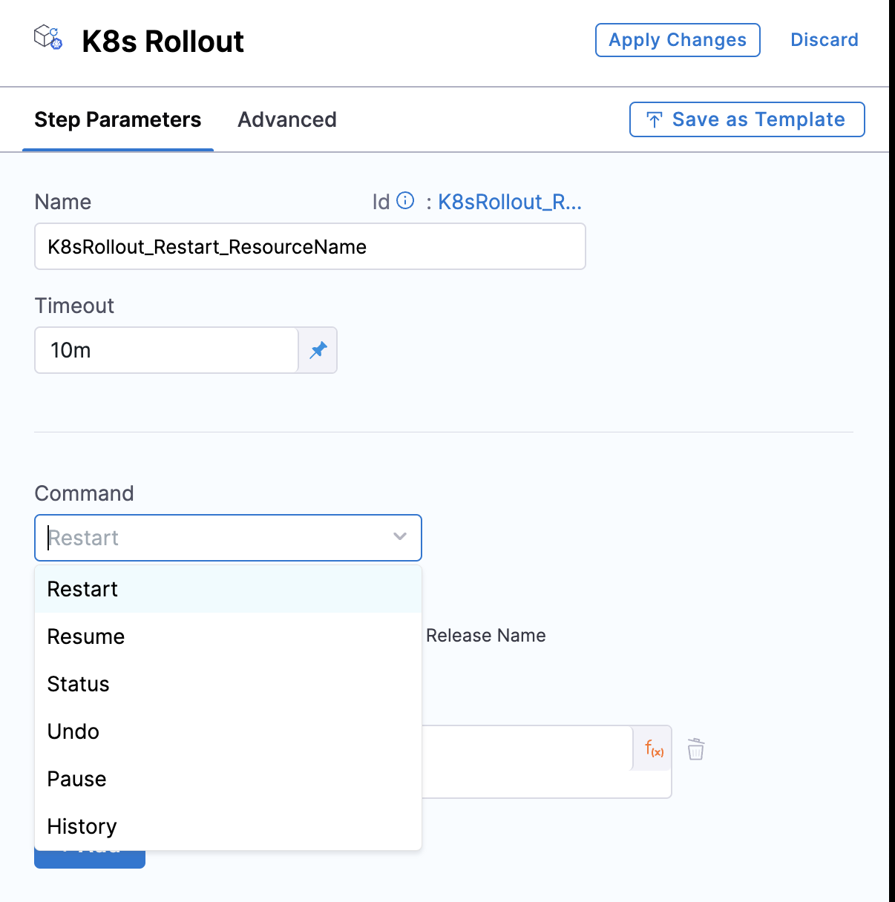
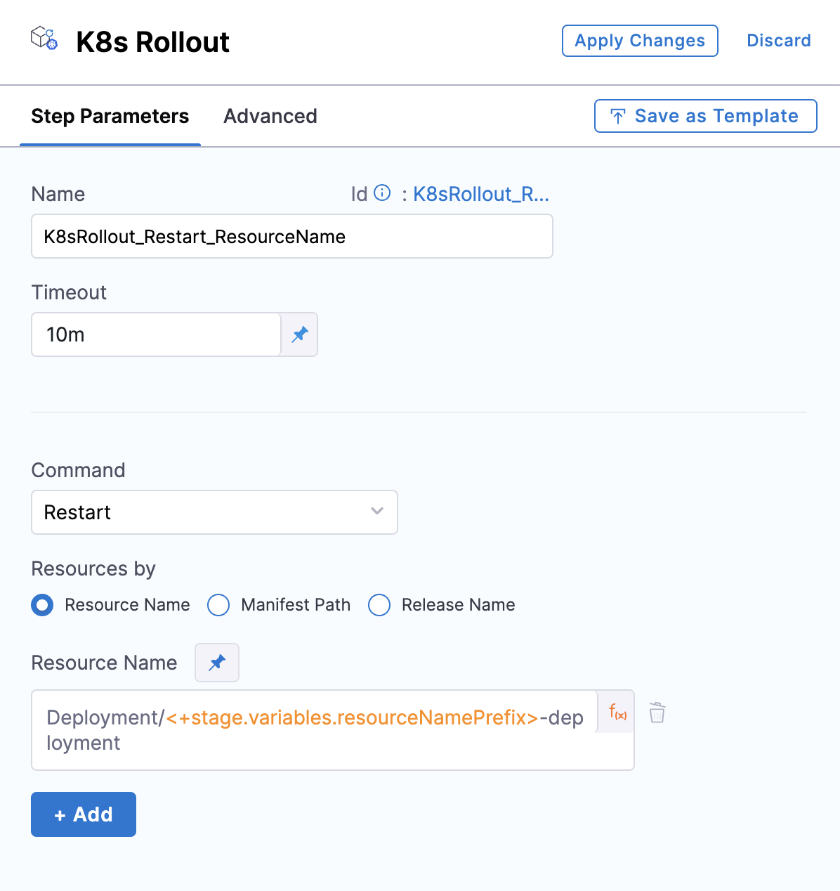

:::info note
1. This feature is currently behind the feature flag, `CDS_K8S_ROLLOUT_STEP`. Contact [Harness support](mailto:support@harness.io) to enable it.
2. This feature requires Harness Delegate version **832xx**.
:::

This topic describes the **K8s Rollout** step, which allows you to manage your **Kubernetes Rolling Deployment**. In Pipeline Studio, this step is labeled **K8sRollout**. On inspection, the step is labeled **K8s Rollout**. 

Harness follows standard Kubernetes behavior during rollout. To see what behavior this replicates, go to the subcommands of [kubectl rollout](https://kubernetes.io/docs/reference/kubectl/generated/kubectl_rollout/#see-also) in the Kubernetes documentation.

When to use the **K8s Rollout** step

- **Configuration Changes**: When there are changes in ConfigMaps, Secrets, or other configurations that your application depends on, and you need to apply these changes without changing the image.

- **Certificate Rotation**: To apply new certificates.

- **Environment Variables Update**: When there are updates to environment variables in the pod specifications.

- **General Pod Refresh**: To refresh the state of pods without making changes to the container image.

## K8s Rollout Step

This step provides various commands like **Restart**, **Resume**, **Status**, **Undo**, **Pause** and **History** on top of basic Kubernetes rollout command.





You can target a specific **Resource**, **Manifest** as well **Release name**.




## Kubernetes Rollout YAML using supported Subcommands

In these example yaml we are using **Manifest** you can use **Resource name** as well as **Release name**

### Kubernetes Rollout restart Yaml

Triggers a rolling restart of the pods managed by a deployment.

```yaml
- step:
    type: K8sRollout
    name: K8sRollout_Restart_ManifestPath_RuntimInput
    identifier: K8sRollout_Restart_ManifestPath_RuntimInput
    spec:
      command: restart
      resources:
        type: ManifestPath
        spec:
          manifestPaths: <+input>
    timeout: 10m
```

### Kubernetes Rollout Pause

Pauses the rollout of a deployment.

```yaml
- step:
    type: K8sRollout
    name: K8sRollout_Pause_ManifestPath_fixedInput
    identifier: K8sRollout_Pause_ManifestPath_fixedInput
    spec:
      command: pause
      resources:
        type: ManifestPath
        spec:
          manifestPaths:
            - deployment.yaml

```

### Kubernetes Rollout Status

Shows the status of the rollout.

```yaml
- step:
    type: K8sRollout
    name: K8sRollout_Status_ManifestPath_fixedInput
    identifier: K8sRollout_Status_ManifestPath_fixedInput
    spec:
      command: status
      resources:
        type: ManifestPath
        spec:
          manifestPaths:
            - deployment.yaml

```

### Kubernetes Rollout Resume 

Resumes a paused rollout.

```yaml
- step:
    type: K8sRollout
    name: K8sRollout_Resume_ManifestPath_fixedInput
    identifier: K8sRollout_History_ManifestPath_fixedInput
    spec:
      command: Resume
      resources:
        type: ManifestPath
        spec:
          manifestPaths:
            - deployment.yaml
    timeout: 10m
```


### Kubernetes Rollout History

Shows the rollout history for a deployment.

```yaml
- step:
    type: K8sRollout
    name: K8sRollout_History_ManifestPath_fixedInput
    identifier: K8sRollout_History_ManifestPath_fixedInput
    spec:
      command: history
      resources:
        type: ManifestPath
        spec:
          manifestPaths:
            - deployment.yaml
    timeout: 10m
```

### Kubernetes Rollout Undo

Reverts the deployment to a previous revision.

```yaml
- step:
    type: K8sRollout
    name: K8sRollout_Undo_ManifestPath_fixedInput
    identifier: K8sRollout_History_ManifestPath_fixedInput
    spec:
      command: Undo
      resources:
        type: ManifestPath
        spec:
          manifestPaths:
            - deployment.yaml
    timeout: 10m
```

## Video

Here's a video demo of how to add a K8s Rollout step:  

<!-- Video:
https://www.loom.com/share/e39980150e8e48dc8755885fc89afc72?sid=973d4a7c-1b7b-4178-8c87-a310b82d4dcd-->
<DocVideo src="https://www.loom.com/share/e39980150e8e48dc8755885fc89afc72" />

## See also

* [Kubernetes CD Quickstart](/docs/continuous-delivery/deploy-srv-diff-platforms/kubernetes/kubernetes-cd-quickstart)
* [Kubernetes How-tos](/docs/category/kubernetes)
* [Kubernetes Deployments Overview](/docs/continuous-delivery/deploy-srv-diff-platforms/kubernetes/kubernetes-deployments-overview)
