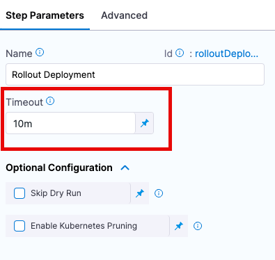

This topic describes how Harness Timeout settings relate to the Kubernetes deadline parameter.

Every step in a Harness Kubernetes Deploy stage includes a **Timeout** setting. This can be controlled from the field within the Deployment step, as per the following screenshot example



This setting determines how long Harness attempts to run the step before failing the step and initiating the step or stage [Failure Strategy](/docs/platform/pipelines/failure-handling/define-a-failure-strategy-on-stages-and-steps).

When setting step **Timeout** settings, it's important to know that Kubernetes itself also has an optional deadline parameter that specifies the number of seconds you want Kubernetes to wait for your Deployment to progress before the system reports back that the Deployment has [failed progressing](https://kubernetes.io/docs/concepts/workloads/controllers/deployment/#failed-deployment).

The Kubernetes deadline parameter `.spec.progressDeadlineSeconds` is an optional field that performs this function. 

See [Progress Deadline Seconds](https://kubernetes.io/docs/concepts/workloads/controllers/deployment/#progress-deadline-seconds) from Kubernetes.

Once the deadline has been exceeded, the Deployment controller adds a DeploymentCondition with the following attributes to the status of the resource (Deployment's `.status.conditions`):

* `type: Progressing`
* `status: "False"`
* `reason: ProgressDeadlineExceeded`

For example:


```bash
Status : demoservice2-deploy-app1   error: deployment "demoservice2-deploy-app1" exceeded its progress deadline
```

The Deployment controller will keep retrying the Deployment. This defaults to `600`. 

If you are using the Kubernetes deadline parameter `.spec.progressDeadlineSeconds` option, it is important to understand that the Step timeout parameter and the Kubernetes deadline parameter may supercede one another, if both are set (e.g. the one that is shorter will be enforced first).  To avoid confusion when troubleshooting, it is a best practice to ensure that you identify whether a timeout is the result of that parameter or the Harness step **Timeout** setting.

