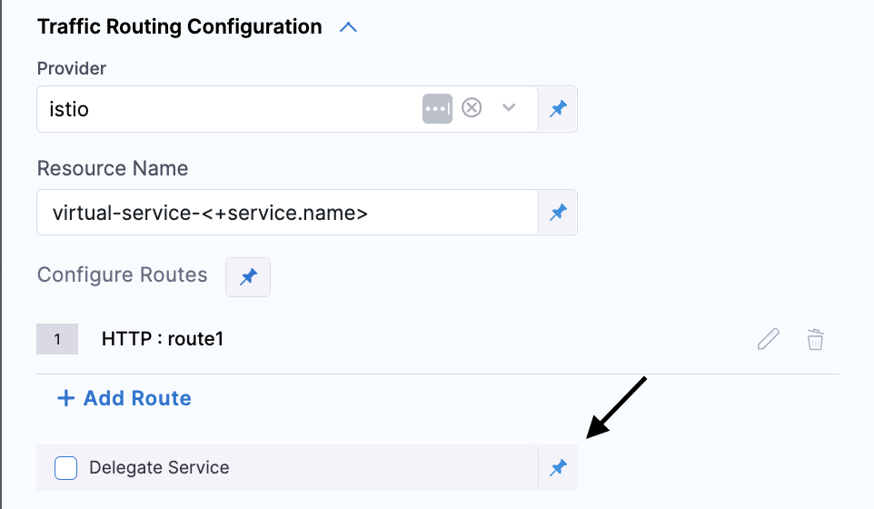

This topic describes the Kubernetes Traffic Routing step. These configuration options can also be found as part of the Blue Green (BG) Deployment step as well as the Canary Deployment step. 

This feature allows you to perform east-west routing of traffic. You would select a routing service mesh provider (currently supported SMI and Istio) and then configure one or more routes which are essentially groups of destinations and optional rules that applies for them.   

Here is a video demo of traffic shifting in a Kubernetes deployments.

<DocVideo src="https://www.loom.com/share/b1cf1db3300946b9b8fe48ae85bbfc26?sid=bef8f5d9-af26-4f24-a7ad-f244ac724572" />

## Traffic Routing Step Parameters

### Name
 
Name of the step.

### Config Type

Specify your configuration type here. Currently there are two choices:

* **New Config**: Select this option if you want to specify a new configuration for traffic routing in this step. If configuring this in a BlueGreen deployment step or a Canary step this option is implicitly assumed. This option will create a new resource(s).
* **Inherit**: Select this option if you want the traffic routing step to inherit a configuration from a previous Blue Green, Canary, or Traffic Routing step. This option will patch existing resources. 

### Provider

Specify your service mesh provider. Harness currently supports Service Mesh Interface (SMI) and Istio. 

Each provider will have some common configuration options and some provider specific ones. We have listed all configuration options for each provider. Please look at the one relevant for you.

#### Service Mesh Interface (SMI) - New Config option

Before you begin, make sure you have an understanding on what SMI is and how it works by [visiting their website](https://smi-spec.io/). 

:::note
Currently, we only support `specs.smi-spec.io/v1alpha3` and `specs.smi-spec.io/v1alpha4` TrafficSplit resource versions since these are the only versions that support having rules (such as uri, method, and headers described below).
:::

* **Parameters**:
    * **Resource Name:** This will be used in generating a name for a kubernetes traffic routing resources. Having that mind, the name needs to be kubernetes resource name compliant. 
    * **Root Service:** This should be a kubernetes service name which will be receiving incoming traffic (take a look in more details the SMI link provided above). Depending on which SMI implementation you are using this value may or may not be the same as one of the destination's host (described below)
    * **Routes**:
        * **Route type**: Currently, Harness supports only the `http` route type - for http traffic.
        * **Route name**: This will be used in generating kubernetes resources so the value should kubernetes name compliant. This should also be unique within the pipeline workflow as it is used as ID for updating purposes (described below)
        * **Route Rules**: This is the way incoming requests are filtered for the configured route destinations.

            * **uri**:
                * **Value**: Enter the value that you want matched against incoming request URI. 
                * **Match Type**: Used to determine how URI of the incoming request is matched against the `value` config parameter. Available to choose one of three values (`exact`, `prefix`, `regex`).

            * **method**:
                * **Value**: Used for matching the HTTP method of the incoming request.

            * **headers**:
                * **Values**:
                    - **Key**: Specify the name of the request header
                    - **Value**: Specify the value of the header
                    - **Match Type**: Specify which kind of matching should be done against the incoming header. Available to choose one of three values (`exact`, `prefix`, `regex`). 

        * **Destinations**: This is locations to which the filtered request will be routed to

            * **Host**: Should be the name of the Kubernetes service resource.

              :::note 
              *Only applicable when using the Blue/Green deployment step* - You can use placeholder `stable` and `stage` resource names. Which would effectively be replaced with the name of the stable and stage services, respectively. 
  
              *Only applicable when using the Canary deployment step* You can use the placeholder `stable` and `canary` resource names. Which would effectively be replaced with the name of the stable and canary services, respectively.
              :::

            * **Weight**: Specify the percentage of traffic that should be routed to this host. The weight should be a numeric value in range [0 - 100].

              :::note
              If the total weights for all host destinations is not equal to 100, the weight values will be normalized into a percentage, and the pipeline will run with a warning.
              :::

#### Istio - New Config option

Before you begin, make sure you have an understanding of Istio and how it works by referring to [their website](https://istio.io/latest/about/service-mesh/).

* **Parameters**:
    * **Resource Name:** This name will be used to generate a kubernetes name for traffic resources. Hence the name needs to be kubernetes resource name compliant. 
    * **Hosts:** Specify one or more host names. This is specific to Istio, please take a look [here](https://istio.io/latest/docs/concepts/traffic-management/#the-hosts-field).
    * **Gateways:** Specify one or more gateway names. This is specific to Istio, please take a look [here](https://istio.io/latest/docs/reference/config/networking/gateway/).
    * **Routes**: Currently, Harness supports only the `http` route type.
        * **Route type**: Currently, Harness supports only the `http` route type - for http traffic.
        * **Route name**: This will be used in generating kubernetes resources so the value should be kubernetes name compliant. This should also be unique within the pipeline workflow as it is used as an ID for updating purposes (described below).
        * **Route Rules**: This is the way incoming requests are filtered for the configured route destinations.
            * **uri**:
                * **Value**: Enter the value that you want matched against the incoming request URI.
                * **Match Type**: Used to determine how the URI of the incoming request is matched against the `value` config parameter. Choose from one of the three available values (`exact`, `prefix`, `regex`).

            * **method**:
                * **Value**: Used for matching the HTTP method of the incoming request.
                * **Match Type**: Used to determine how the HTTP method of the incoming request is matched against the `value` config parameter. Choose from one of the three available values (`exact`, `prefix`, `regex`).

            * **headers**:
                * **Values**:
                    - **Key**: Specify the name of the request header
                    - **Value**: Specify the value of the header
                    - **Match Type**: Specify which kind of matching should be done against the incoming header. Choose from one of the three available values  (`exact`, `prefix`, `regex`).
    
            * **scheme**:
                * **Value**: Specify which scheme you want to match with.
                * **Match Type**: Specify which kind of matching should be done against the incoming request scheme. Choose from one of the three available values (`exact`, `prefix`, `regex`).

            * **authority**:
                * **Value**: Specify which authority you want to match with.
                * **Match Type**: Specify which kind of matching should be done against the incoming request authority. Choose from one of the three available values (`exact`, `prefix`, `regex`).

            * **port**: 
                * **Value**: Specify which port you want to match the incoming request port with.

        * **Destinations**: The filtered requests will be routed to these locations.

            * **Host**: Should be the name of the Kubernetes service resource.

              :::note 
              *Only applicable when using the Blue/Green deployment step* - You can use placeholder `stable` and `stage` resource names. Which would effectively be replaced with the name of the stable and stage services, respectively. 

              *Only applicable when using the Canary deployment step* You can use the placeholder `stable` and `canary` resource names. Which would effectively be replaced with the name of the stable and canary services, respectively.
              :::

             

              - **Delegate Virtual Service Support** 
              :::info note
              Currently this feature is behind the feature flag `CDS_DELEGATE_VIRTUAL_SERVICE_SUPPORT`. Please contact [Harness support](mailto:support@harness.io) to enable this feature.
              :::

              With the introduction of [delegate virtual service](https://istio.io/latest/docs/reference/config/networking/virtual-service/#Delegate) support, the **Host** field can now be left empty when using custom rewrite logic. This allows for more dynamic traffic routing configurations, enabling users to rewrite traffic-routing logic to fit their deployment strategies. To configure this, you need to check the **Delegate Service** option, which creates a delegate virtual service.. When this option is checked, the **Host** field will be left empty.

              This is available for **Canary Deployment, K8s Traffic routing, K8s Blue Green Deploy**.

              
              

            * **Weight**: Specify the percentage of traffic that should be routed to this host. The weight should be a numeric value in range [0 - 100].

              :::note
              If the total weights for all host destinations is not equal to 100, the weight values will be normalized into a percentage, and the pipeline will run with a warning.
              :::

#### SMI and Istio - Inherit option
This options provides a way to update an existing traffic routing configuration destination's weights. With this step configuration there are two logical parts.
First one is to configure the `Route Name` and second one is to configure destination(s) which you want to update. Route name is an ID for us to know which traffic routing resource we need to update. The value of the route name should match one of the route names defined during the `New config` step configuration.
You can configure one or more destinations and their weights. 
You should also be aware that in case you configure lower number of destinations then the route contains, the update of the weights will occur, but it will respect [0-100] boundaries.

Example:
In original setup you have configured 3 destinations for a route:
```
Destination1 -> Host: svc1, Weight: 60
Destination2 -> Host: svc2, Weight: 30
Destination3 -> Host: svc3, Weight: 10
```

Now in the update step you configured to update only one destination for that same route. Let's say you want to update Destination `svc1` and you want to set its weight to `40`

This will lead to having the remaining 60 (max limit of 100 - configured update weight of 40) to be split amongst the remaining destinations, but keeping the same ratio they have amongst themselves.
Meaning the result would be:
```
Destination1 -> Host: svc1, Weight: 40
Destination2 -> Host: svc2, Weight: 45
Destination3 -> Host: svc3, Weight: 15
```

### Configuration examples

#### Istio service mesh configuration
Here we have an example of an Istio service mesh traffic routing step which will take all the traffic that is coming from gateway `testgateway` and with host `test.com`.
It will filter all incoming request that have URI `/login` with HTTP method `POST` and header `X-Request` with value `authxx`.
This request will be split between PODs which are behind two service `svc1` and `svc2` in ratio 65 to 35, respectively.
The resource created would be a `Virtual Service` with name `istio-vs-k8s-res`
```
  - step:
      identifier: K8sTrafficRoutingConfig
      type: K8sTrafficRouting
      name: config
      spec:
        type: config
        trafficRouting:
          provider: istio
          spec:
            name: istio-vs-k8s-res
            hosts:
              - test.com
            gateways:
              - testgateway
            routes:
              - route:
                  type: http
                  name: route1
                  rules:
                    - rule:
                        type: uri
                        spec:
                          value: /login
                          matchType: prefix
                    - rule:
                        type: method
                        spec:
                          value: POST
                    - rule:
                        type: headers
                        spec:
                          values:
                            - value: authxx
                              key: X-Request
                              matchType: prefix
                  destinations:
                    - destination:
                        host: svc1
                        weight: 65
                    - destination:
                        host: svc2
                        weight: 35
```


#### SMI service mesh configuration
Here we have an example of an SMI service mesh traffic routing step which will take all the traffic that is coming into service `svc1`
It will filter all incoming request that have URI `/login` with HTTP method `POST` and header `X-Request` with value `authxx`.
This request will be split between PODs which are behind two service `svc1` and `svc2` in ratio 65 to 35, respectively.
The resource created would be a `TrafficSplit` with name `smi-traffic-split-res-route1` and `HTTPRouteGroup` with name `smi-traffic-split-res-route1-http-rule`

```
  - step:
      identifier: K8sTrafficRoutingConfig
      type: K8sTrafficRouting
      name: config
      spec:
        type: config
        trafficRouting:
          provider: smi
          spec:
            rootService: svc1
            name: smi-traffic-split-res
            routes:
              - route:
                  type: http
                  rules:
                    - rule:
                        type: uri
                        spec:
                          value: /login
                          matchType: prefix
                    - rule:
                        type: method
                        spec:
                          value: POST
                    - rule:
                        type: headers
                        spec:
                          values:
                            - value: authxx
                              key: X-Request
                              matchType: prefix
                  name: route1
                  destinations:
                    - destination:
                        host: svc1
                        weight: 65
                    - destination:
                        host: svc2
                        weight: 35
```

### Advanced

See the following topics for advanced settings:

* [Delegate Selector](/docs/platform/delegates/manage-delegates/select-delegates-with-selectors)
* [Conditional Execution](/docs/platform/pipelines/step-skip-condition-settings)
* [Failure Strategy](/docs/platform/pipelines/failure-handling/define-a-failure-strategy-on-stages-and-steps)
* [Looping Strategy](/docs/platform/pipelines/looping-strategies/looping-strategies-matrix-repeat-and-parallelism)
* [Policy Enforcement](/docs/platform/governance/policy-as-code/harness-governance-overview)
