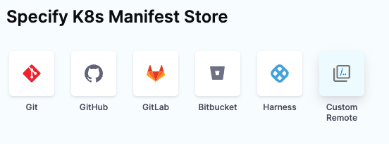
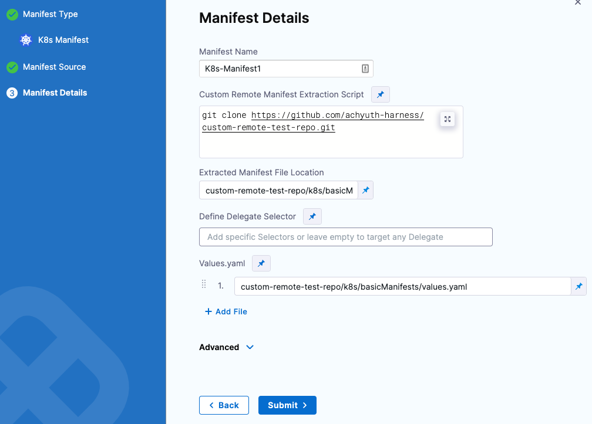
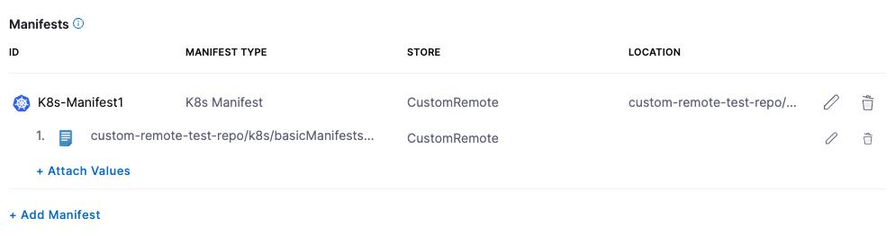

This topic describes how to use Custom Remote Manifests to run a script at deployment runtime and pull in your manifests.

Harness provides first-class support for all the major devops platforms manifests and specifications, but there are situations when you want to use a custom script to pull your manifests.

Harness provides Custom Remote Manifests to let you run your script at deployment runtime and pull in your manifests.

In some cases, your manifests are in a packaged archive and you simply wish to extract and use them at runtime. In these cases, you can use a packaged archive with Custom Remote Manifests.

You can simply use Custom Remote Manifests to add a script that pulls the package and extracts its contents. Next, you supply the path to the manifest or template for Harness to use.

Custom Remote Manifests are supported for:

* Kubernetes
* Helm chart
* OpenShift

Looking for other methods? See [Add Kubernetes Manifests](/docs/continuous-delivery/deploy-srv-diff-platforms/kubernetes/cd-kubernetes-category/define-kubernetes-manifests).

## Before you begin

* [Kubernetes Deployment Tutorial](/docs/continuous-delivery/deploy-srv-diff-platforms/kubernetes/kubernetes-cd-quickstart)
* [Kubernetes Deployment Basics](/docs/continuous-delivery/deploy-srv-diff-platforms/kubernetes/kubernetes-deployments-overview)

## Supported platforms and technologies

See [Supported Platforms and Technologies](/docs/getting-started/supported-platforms-and-technologies).

## Limitations

* Custom Remote Manifests scripts use Bash only.
* The Delegate that runs the script must have all the software needed for the scripts to execute.If you select a Delegate in the Kubernetes Cluster Connector used by the stage Infrastructure Definition, then the script is run on that Delegate.

## Add secrets for a script

Typically, your script to pull the remote package will use a user account. For example:


```bash
curl -sSf -u "johndoe:mypwd" -O 'https://mycompany.jfrog.io/module/example/manifest.zip'
```
You can use Harness secrets for the username and password in your script. For example:


```bash
curl -sSf -u "<+secrets.getValue("username")>:<+secrets.getValue("password")>" -O 'https://mycompany.jfrog.io/module/example/manifest.zip'
```
For more information, see [Add and Reference Text Secrets](/docs/platform/Secrets/add-use-text-secrets).


## Start a pipeline

This topic assumes you have a Harness Project set up. If not, see [Create Organizations and Projects](/docs/platform/organizations-and-projects/create-an-organization).

You can create a Pipeline from any module in your Project, or in the **Project Overview**, and then add stages for any module.

Enter a name for the Pipeline and click **Start**. Now you're ready to add a stage.

## Add a Deploy stage

For steps on adding a stage, see [Add a Stage](/docs/platform/8_Pipelines/add-a-stage.md).

1. Name the stage, and select what you'd like to deploy. For example, select Service.
2. Click **Set Up Stage**. The new stage's settings appear.
3. Click **Next** or **Service**.

## Create a Harness Kubernetes Service

In Service, you can define/select the Service and Service Definition.

Select or create the Service.

To add your manifests, go to **Manifests** in the **Service Definition**.

## Add the remote script and Kubernetes manifests

You can use your Git repo for the remote script and manifests in Manifests and Harness will use them at runtime.

If you are adding the image location to Harness as an Artifact in the Service Definition, see [Add Container Images as Artifacts for Kubernetes Deployments](/docs/continuous-delivery/deploy-srv-diff-platforms/kubernetes/cd-kubernetes-category/add-artifacts-for-kubernetes-deployments).

1. In your Harness Kubernetes Service, in **Manifests**, click **Add Manifest**.
2. In **Specify Manifest Type**, select **K8s Manifest**, and then click **Next**.
3. In **Specify K8s Manifest Store**, click **Custom Remote.**
    
    

4. Click **Continue**. The Manifest Details appear. Now you can add your script to pull the package containing your manifests and specify the folder path for the manifests.
    
    

5. Enter the name in **Manifest Name**.
6. In **Custom Remote Manifest Extraction Script**, enter the path to the Git repo where your remote manifest script is available. This script runs on the Harness Delegate selected for the deployment.
7. In **Extracted Manifest File Location**, enter the folder path for the manifests.
8. In **Define Delegate Selector**, Harness selects the best delegate.  Select a specific delegate from the list of tags available for delegates or leave this blank and allow Harness to select a delegate. Go to [Use delegate selectors](/docs/platform/2_Delegates/manage-delegates/select-delegates-with-selectors.md) for more information.

   :::info note
   Delegate selectors do not override service infrastructure connectors. Delegate selectors only determine the delegate that executes the operations of your pipeline.
   :::
   
9. In **Values.yaml**, the field is populated with the folder path for the values.yaml.
10. Click **Submit**. The new manifest is created and added to **Manifests** in Harness.

    

## View the Harness Delegate selected for the deployment

The custom script runs on the Harness Delegate selected for deployment. If you selected a Delegate in the Kubernetes Cluster Cloud Provider used by the Workflow's Infrastructure Definition, then the script is run on that Delegate.

Harness creates a temporary working directory on the Delegate host for the downloaded package. You can reference the working directory in your script with `WORKING_DIRECTORY=$(pwd)` or `cd $(pwd)/some/other/directory`.

After deploying your Workflow, you can view the Delegate that was selected for the deployment.

Click on **Execution Summary**, and then click on **Custom Manifest Values Fetch Task** in the console to view the selected Delegate.


## Kubernetes YAML

You can enter the path to a manifests folder.

For example, if your expanded package has this folder structure:


```yaml
manifest:  
 - values.yaml  
 - templates  
     - deployment.yaml  
     - service.yaml
```
In this example, you can enter manifest and Harness automatically detects the values.yaml and the other file (for example, deployment.yaml and service.yaml). If no values.yaml file is present, Harness will simply use the other files.

That's all the setup required. You can now deploy the Service and the script is executed at runtime.

## OpenShift manifest

Provide the path to the OpenShift template, Kubernetes manifest, or Helm file. For example, manifest/template.yaml.

Do not enter a folder. Harness requires a direct path to the file.

That's all the setup required. You can now deploy the Service and the script is executed at runtime.

## Helm chart manifests

When configuring a Helm chart with Custom Remote manifests, in the **Manifest Details** > **Advanced** section, you can select a **Helm Version**, and then add the command flags that you wish to pass based on the version. 

For more information on Helm command flags, go to [Add Helm chart](https://developer.harness.io/docs/continuous-delivery/deploy-srv-diff-platforms/helm/cd-helm-category/deploy-helm-charts/#add-the-helm-chart).


## Notes

You can use Go templating in your Kubernetes resource files, just as you would for files stored in Git or inline. See [Example Kubernetes Manifests Using Go Templating](/docs/continuous-delivery/deploy-srv-diff-platforms/kubernetes/cd-k8s-ref/example-kubernetes-manifests-using-go-templating). For OpenShift, you must use OpenShift templating.

If the artifact you are deploying with your manifest is public (DockerHub) and does not require credentials, you can use the standard public image reference, such as `image: harness/todolist-sample:11`.
