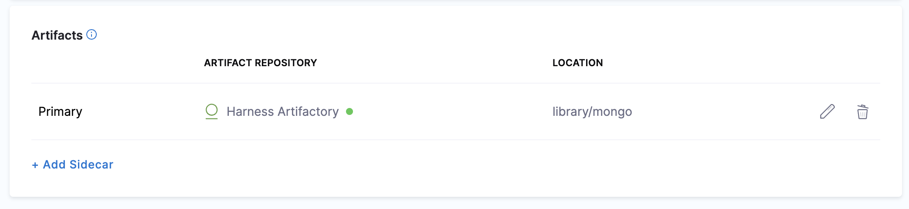
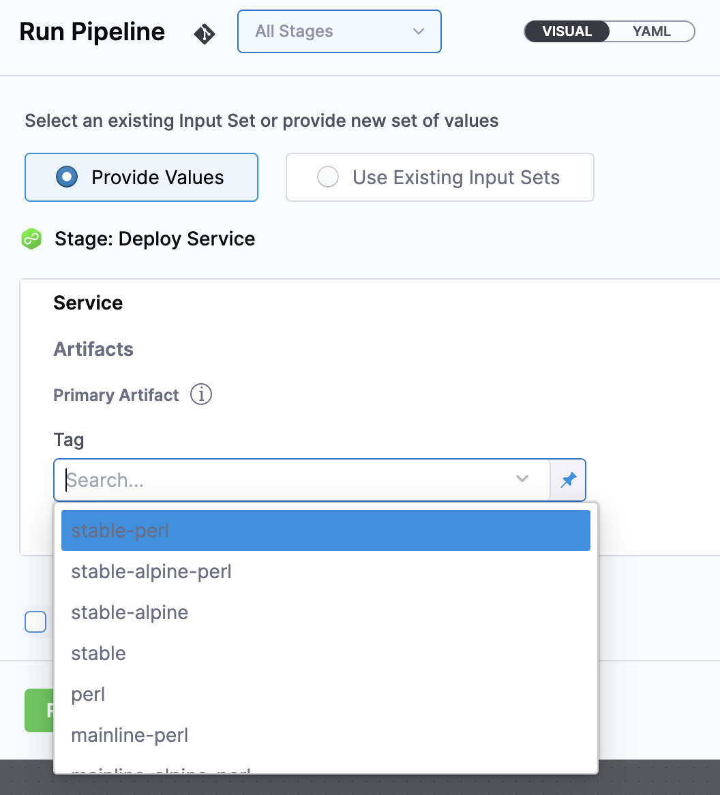
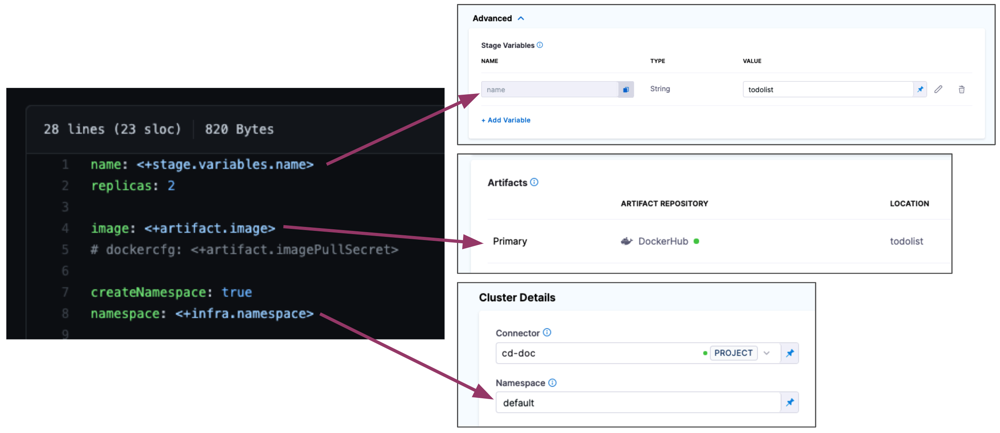
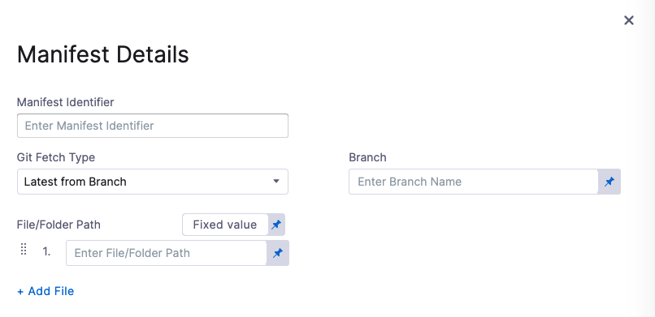
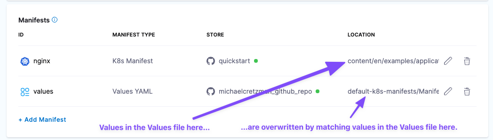

This topic describes how to add Kubernetes manifests in Harness.

Harness provides a simple and flexible way to use Kubernetes manifests in your Harness Pipelines.

You can simply link Harness to your remote files in a Git repo. At deployment runtime, Harness fetches and applies your files.

You can also use values YAML files with your manifests to provide different sets of values for the same manifests. The manifests can use Go templating to reference values in your values YAML files.

For example, multiple values files can contain specific deployment settings, such as separate values YAML files for QA and Production values. You simply select the values file you want to use during setup. You can the same manifests in all your Pipeline stages but use one values file in the first stage of your Pipeline (for example, a DEV stage) and a different values file in the next stage (for example, a QA stage).

This topics provides a quick overview or some options and steps when using Kubernetes manifests, with links to more details.

## Before you begin

* [Kubernetes deployment tutorial](/docs/continuous-delivery/deploy-srv-diff-platforms/kubernetes/kubernetes-cd-quickstart)
* [Kubernetes Deployments Overview](/docs/continuous-delivery/deploy-srv-diff-platforms/kubernetes/kubernetes-deployments-overview)
* [Add Container Images as Artifacts for Kubernetes Deployments](/docs/continuous-delivery/deploy-srv-diff-platforms/kubernetes/cd-kubernetes-category/add-artifacts-for-kubernetes-deployments)

## Important notes on Kubernetes manifests

You cannot use [Harness variables](/docs/platform/Variables-and-Expressions/harness-variables) in Kubernetes manifests. You can only use Harness variables in Values YAML files. Harness support Go templating, so you can use variables in Values YAML files and have the manifests reference those variables/values.

## Visual summary of using Kubernetes manifests

Here's a quick video that show how to add Kubernetes manifests and Values YAML files:

<!-- Video:
https://www.youtube.com/watch?v=dVk6-8tfwJc-->
<docvideo src="https://www.youtube.com/watch?v=dVk6-8tfwJc" />


## Artifacts and Kubernetes manifests in Harness

If a public Docker image location is hardcoded in your Kubernetes manifest or values YAML file (for example, `image: nginx:1.14.2`) then you can simply add the manifest or values YAML to Harness and the Harness Delegate will pull the image during deployment.

Alternatively, you can also add the image to Harness as an Artifact in the **Service Definition**. This allows you to reference the image in your manifests and elsewhere using a Harness expression.



Your values YAML file refers to the Artifact using the Harness variable expression `<+artifact.image>`:


```yaml
image: <+artifact.image>
```
When you deploy, Harness connects to your repo and you select which image version/tag to deploy.



With a Harness Artifact referenced in your values YAML files, you can template your manifests, detaching them from a hardcoded location. This makes your manifests reusable and dynamic.

See [Add Container Images as Artifacts for Kubernetes Deployments](/docs/continuous-delivery/deploy-srv-diff-platforms/kubernetes/cd-kubernetes-category/add-artifacts-for-kubernetes-deployments).

## Use Harness variables in values YAML

You cannot use Harness variables in Kubernetes manifests. You can only use Harness variables in Values YAML files. Let's look at an example. 

<details>
<summary>Values YAML using Harness variables for name, image, dockercfg, and namespace</summary>


```yaml
name: <+stage.variables.name>  
replicas: 2  
  
image: <+artifact.image>  
dockercfg: <+artifact.imagePullSecret>  
  
createNamespace: true  
namespace: <+infra.namespace>  
...
```
</details>

<details>
<summary>Deployment object that references the values.yaml using Go templating</summary>


```yaml
apiVersion: apps/v1  
kind: Deployment  
metadata:  
  name: {{.Values.name}}-deployment  
spec:  
  replicas: {{int .Values.replicas}}  
  selector:  
    matchLabels:  
      app: {{.Values.name}}  
  template:  
    metadata:  
      labels:  
        app: {{.Values.name}}  
    spec:  
      {{- if .Values.dockercfg}}  
      imagePullSecrets:  
      - name: {{.Values.name}}-dockercfg  
      {{- end}}  
      containers:  
      - name: {{.Values.name}}  
        image: {{.Values.image}}  
        {{- if or .Values.env.config .Values.env.secrets}}  
        envFrom:  
        {{- if .Values.env.config}}  
        - configMapRef:  
            name: {{.Values.name}}  
        {{- end}}  
        {{- if .Values.env.secrets}}  
        - secretRef:  
            name: {{.Values.name}}  
        {{- end}}  
        {{- end}}
```

</details>

In Harness, these variables come from multiple places:



At runtime, the Harness variables in the values.yaml file are replaced with the values you entered in the Stage as fixed values or as [Runtime Inputs](/docs/platform/References/runtime-inputs).

See [Built-in Harness Variables Reference](/docs/platform/Variables-and-Expressions/harness-variables) and [Example Kubernetes Manifests using Go Templating](/docs/continuous-delivery/deploy-srv-diff-platforms/kubernetes/cd-k8s-ref/example-kubernetes-manifests-using-go-templating.md).

## Start a Kubernetes pipeline

This topic assumes you have a Harness Project set up. If not, see [Create Organizations and Projects](/docs/platform/organizations-and-projects/create-an-organization).

You can create a Pipeline from any module in your Project, or in the **Project Overview**, and then add stages for any module.

Enter a name for the Pipeline and click **Start**. Now you're ready to add a stage.

## Add a Kubernetes Deploy stage

For steps on adding a stage, see [Add a Stage](/docs/platform/Pipelines/add-a-stage).

1. When you add a stage, select **Deploy**.
2. Name the stage, and select what you'd like to deploy. For example, select **Service**.
3. Click **Set Up Stage**. The new stage's settings appear.
4. Click **Next** or **Service**.

## Create the Harness Kubernetes service

1. In **Service**, you can define/select the Service and Service Definition.
  
  Let's take a moment and review Harness Services and Service Definitions (which are explained below). Harness Services represent your microservices/apps logically.  
  
  You can add the same Service to as many stages are you need. Service Definitions represent your artifacts, manifests, and variables physically. They are the actual files and variable values.  
  
  By separating Services and Service Definitions, you can propagate the same Service across stages and change artifacts, manifests, and variables with each stage.Select or create the Service.
2. To add your manifests, go to **Manifests** in the Service Definition.

## Add Kubernetes manifests to a service

You can use your Git repo for the configuration files in **Manifests** and Harness will use them at runtime.

If you are adding the image location to Harness as an Artifact in the Service Definition, see [Add Container Images as Artifacts for Kubernetes Deployments](add-artifacts-for-kubernetes-deployments.md).

1. In **Manifests**, click **Add Manifest**.
2. In **Specify Manifest Type**, select **K8s Manifest**, and then click **Next**.
3. In **Specify K8s Manifest Store**, select the Git provider. In this example, click GitHub, and then select or create a new GitHub Connector. See [Connect to Code Repo](/docs/platform/Connectors/Code-Repositories/connect-to-code-repo).
4. Click **Continue**. **Manifest Details** appears.
   
   

5. In **Manifest Identifier**, enter an Id for the manifest. It must be unique. It can be used in Harness expressions to reference this manifests settings.
   
   For example, if the Pipeline is named **MyPipeline** and **Manifest Identifier** were **myapp**, you could reference the **Branch** setting using this expression:
   
   `<+pipeline.stages.MyPipeline.spec.serviceConfig.serviceDefinition.spec.manifests.myapp.spec.store.spec.branch>`

6. In **Git Fetch Type**, select **Latest from Branch** or **Specific Commit ID**, and then enter the branch or commit ID for the repo.
7. For **Specific Commit ID**, you can also use a [Git commit tag](https://git-scm.com/book/en/v2/Git-Basics-Tagging).
8. In **File/Folder Path**, enter the path to the manifest file or folder in the repo. The Connector you selected already has the repo name, so you simply need to add the path from the root of the repo.
   1. **Add all manifests and values files in the folder:** If you enter a folder, Harness will automatically detect and use all of the manifests and values YAML files in that folder. Values files can also be added separately as a [Values YAML type](/docs/continuous-delivery/deploy-srv-diff-platforms/kubernetes/cd-kubernetes-category/add-and-override-values-yaml-files).
9. Click **Submit**. The manifest is added to **Manifests**.

## Skip resource versioning

By default, Harness versions ConfigMaps and Secrets deployed into Kubernetes clusters. In some cases, you might want to skip versioning.

When you enable **Skip Resource Versioning**, Harness won't perform versioning of ConfigMaps and Secrets for the deployment.

If you've enabled **Skip Resource Versioning** for a few deployments and then disable it, Harness will start versioning ConfigMaps and Secrets.

## Add values YAML file in manifest folder

If you have a Values YAML file in the same folder as the manifests, you can simply enter the folder path in **File/Folder Path** and Harness will fetch and apply the values file along with the manifests.

If you also add a separate Values YAML file in Manifests using the **Values YAML** type (described below), that Values YAML will overwrite any matching values in the Values YAML in the Manifest **File/Folder Path**.



## Add values YAML files

You add a values file in the same way you added your manifests. You simply select **Values YAML** in **Specify Manifest Type**.

In **Manifest Details**, you enter the path to each values.yaml file.

Your values YAML files can use [Harness variables](/docs/platform/Variables-and-Expressions/harness-variables) to reference artifacts in the **Service Definition** (`<+artifact.image>`), Stage and Service variables, and and other Harness variables.

Your manifests reference your values YAML file using [Go templating](https://godoc.org/text/template), as described above.

You cannot use [Harness variables](/docs/platform/Variables-and-Expressions/harness-variables) in Kubernetes manifests. You can only use Harness variables in values YAML files. See [Example Kubernetes Manifests using Go Templating](/docs/continuous-delivery/deploy-srv-diff-platforms/kubernetes/cd-k8s-ref/example-kubernetes-manifests-using-go-templating).

## Helm chart expressions

import HelmManifestExpressions from '/docs/continuous-delivery/shared/helm-manifest-expressions.md';

<HelmManifestExpressions name="helmexpressions" />

