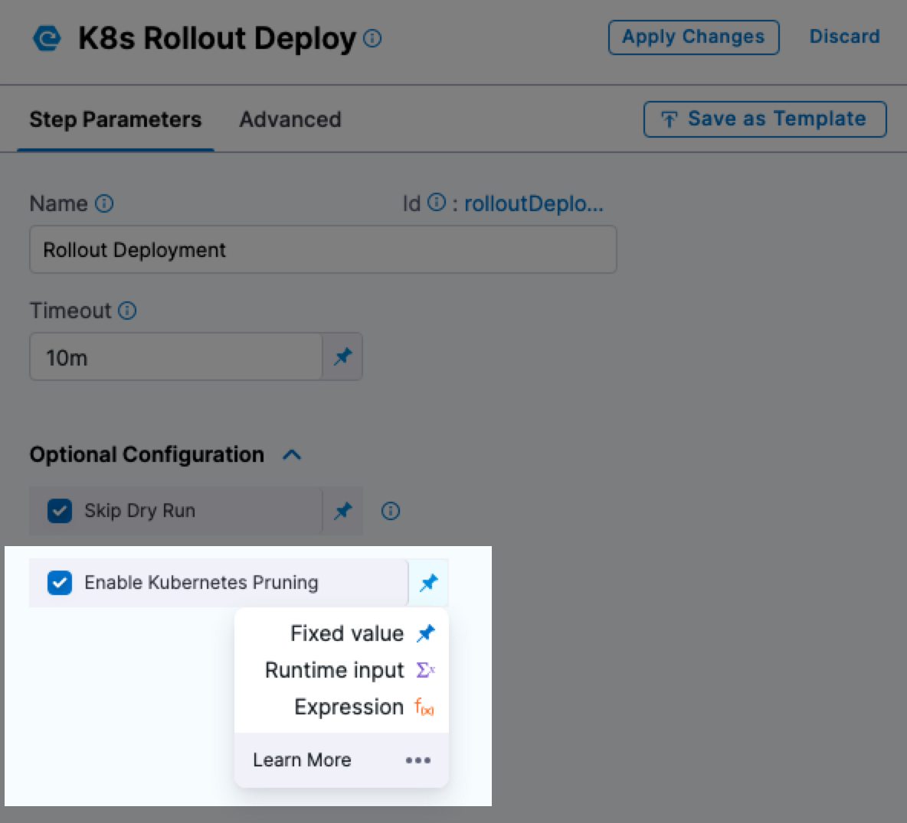

This topic describes how to perform Kubernetes pruning using Harness. 

Changes to the manifests used in Harness Kubernetes deployments can result in orphaned resources you are unaware of.

For example, one deployment might deploy resources A and B but the next deployment deploys A and C. C is the new resource and B was removed from the manifest. Without pruning, resource B will remain in the cluster.

You can manually delete Kubernetes resources using the [Delete](/docs/continuous-delivery/deploy-srv-diff-platforms/kubernetes/kubernetes-executions/delete-kubernetes-resources) step, but you can also set Harness to perform resource pruning during deployment using the **Enable Kubernetes Pruning** setting in the **Rolling Deployment** and **Stage Deployment** (used in Blue Green deployments) steps.



Harness will use pruning to remove any resources that were present in an old manifest, but no longer present in the manifest used for the current deployment.

Harness also allows you to identify resources you do not want pruned using the annotation `harness.io/skipPruning`.

## Before you begin

* [Kubernetes CD Quickstart](/docs/continuous-delivery/deploy-srv-diff-platforms/kubernetes/kubernetes-cd-quickstart)
* [Create a Kubernetes Rolling Deployment](/docs/continuous-delivery/deploy-srv-diff-platforms/kubernetes/kubernetes-executions/create-a-kubernetes-rolling-deployment)
* [Create a Kubernetes Canary Deployment](/docs/continuous-delivery/deploy-srv-diff-platforms/kubernetes/kubernetes-executions/create-a-kubernetes-canary-deployment)
* [Delete Kubernetes Resources](/docs/continuous-delivery/deploy-srv-diff-platforms/kubernetes/kubernetes-executions/delete-kubernetes-resources)

## Supported platforms and technologies

Pruning is supported for the following deployment strategies:

* Rolling Deployments
* Blue Green Deployments

See [Supported Platforms and Technologies](/docs/getting-started/supported-platforms-and-technologies).

## Important notes

* To prevent pruning using the Harness annotation `harness.io/skipPruning: "true"`, the resource must have been deployed by Harness.
  * Harness pruning does not consider resources outside of a Harness deployment.
  * If you make any changes to your Kubernetes resources using a tool other than Harness (before or after the deployment), Harness does not track those changes.
* The maximum manifest/chart size is 0.5MB. When Harness prunes, it stores the full manifest in configMap to use it as part of release history. While deploying very large manifests/charts though Kubernetes, Harness is limited by configMap capacity.
* While it is unlikely, if you are using the same entity in two Harness Services, Harness does not know this. So if you prune the resource in one deployment it might be unavailable in another deployment. Use the annotation `harness.io/skipPruning: "true"` to avoid issues.

## Harness Kubernetes pruning criteria

Kubernetes pruning in Harness is similar to the `kubectl apply --prune` method provided by [Kubernetes](https://kubernetes.io/docs/tasks/manage-kubernetes-objects/declarative-config/#alternative-kubectl-apply-f-directory-prune-l-your-label).

Kubernetes pruning queries the API server for all objects matching a set of labels and attempts to match the returned live object configurations against the object configuration files.

Similarly, Harness compares the objects you are deploying with the objects it finds in the cluster. If Harness finds objects which are not in the current release, it prunes them.

Harness also allows you to identify resources you do not want pruned using the annotation `harness.io/skipPruning`. This is described later in this topic.

<details>
<summary>Rolling deployments</summary>

When the **Enable Kubernetes Pruning** setting is enabled, Kubernetes Rolling deployments manage pruning as follows:

1. During deployment, Harness compares resources in the last successful release with the current release.
2. Harness prunes the resources from the last successful release that are not in current release.
3. If a deployment fails, Harness recreates the pruned resources during its Rollback stage.
4. During rollback, any new resources that were created in the failed deployment stage that were not in the last successful release are deleted also.

</details>

<details>
<summary>Blue Green deployments</summary>

When the **Enable Kubernetes Pruning** setting is enabled, Kubernetes Blue Green deployments manage pruning as follows:

- Harness does not recreate pruned resources during rollbacks caused by failure. 
  - By default, rollback for Blue Green deployments only consists of swapping back the service selectors.
- Pruning is not performed on the immediate previous release. Harness prunes the resources of all older non-primary releases (n-2 release onwards). For example:

1. release r1 → a, b, c
2. release r2 → a, b, d
3. release r3 → a, b, e (only c is pruned)
4. release r4 → a, b, e (d is now pruned) 


</details>

## Pruning examples

The first time you deploy a resource (Deployment, StatefulSet, ReplicaSet, etc) no pruning will take place.

In Harness Pipeline execution, you will see a **Prune** section with the following message:


```bash
No previous successful deployment found, so no pruning required
```

When the **Enable Kubernetes Pruning** setting is enabled and Harness finds resources that match the pruning criteria, you will see a message like this:


```bash
kubectl --kubeconfig=config delete Deployment/k8s-orphaned-resource-b --namespace=default  
  
deployment.apps "k8s-orphaned-resource-b" deleted  
  
kubectl --kubeconfig=config delete ConfigMap/k8s-orphaned-resource-configmap-b --namespace=default  
  
configmap "k8s-orphaned-resource-configmap-b" deleted  
  
Pruning step completed
```

If a deployment fails, Harness recreates any of the pruned resources it removed as part of the deployment. In the **Rollback** step, you will see a **Recreate Pruned Resources** section with message like this:


```bash
kubectl --kubeconfig=config apply --filename=manifests.yaml --record  
  
deployment.apps/k8s-orphaned-resource-f created  
  
Successfully recreated pruned resources.
```

## Skip pruning for a resource

To ensure that a resource is not pruned, add the annotation `harness.io/skipPruning: "true"`.

When Harness identifies resources from the last successful release which are not in current release, it searches for the `harness.io/skipPruning` annotation and ignores any resources that have it set to `true`.

You can deploy a resource using the annotation `harness.io/skipPruning: "true"`, and then if the manifest is removed and another deployment occurs, Harness will see the annotation `harness.io/skipPruning: "true"` on the resource previously deployed and skip pruning it.

As mentioned in **Limitations** above, you cannot add a resource with the annotation outside of a Harness deployment and have Harness skip the pruning of that resource.

### See also

* [Delete Kubernetes Resources](/docs/continuous-delivery/deploy-srv-diff-platforms/kubernetes/kubernetes-executions/delete-kubernetes-resources)

