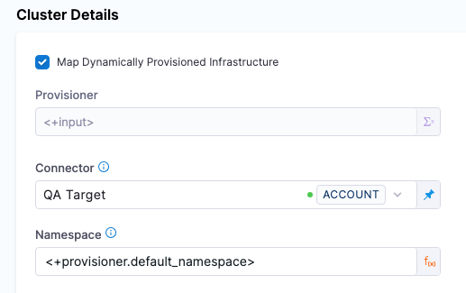
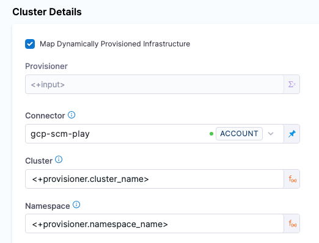
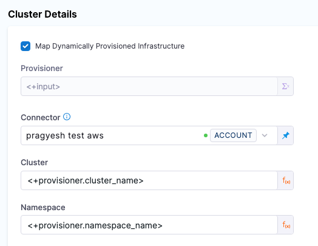
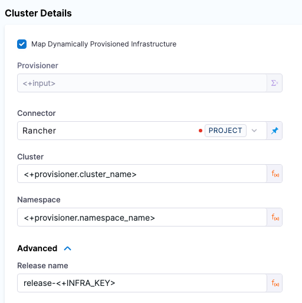
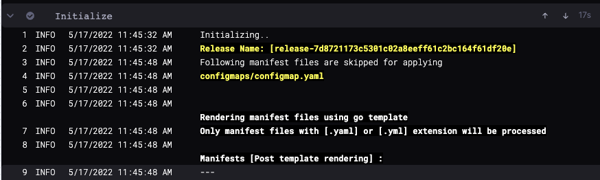

import Tabs from '@theme/Tabs';
import TabItem from '@theme/TabItem';

When you set up a Deploy stage, you specify the Kubernetes cluster and namespace where you want to deploy your service. In Harness, this is called the **Infrastructure Definition**.

A Harness **Infrastructure Definition** includes specific infrastructure details for the deployment, such as the Harness connector that provides credentials for the cluster and the cluster namespace.

The **Infrastructure Definition** can point to a pre-existing cluster and namespace or Harness can dynamically provision the namespace using your provisioning scripts/templates. You must use an existing cluster in either use case.

This topic explains how to set up the **Infrastructure Definition** for your deployments.

:::note

For Amazon Elastic Kubernetes Service (Amazon EKS) and OpenShift, use [Specify a Vendor Agnostic Kubernetes Cluster](define-your-kubernetes-target-infrastructure.md#specify-a-vendor-agnostic-kubernetes-cluster).

:::

## Important notes

- When using names in Harness Kubernetes stages, remember that Kubernetes service and pod names follow RFC-1035 and must consist of lowercase alphanumeric characters or '-', start with an alphabetic character, and end with an alphanumeric character.

### Harness role permissions required

The following Harness role is required:

- **Environments**: `View/Create`, `Edit`, `Access`, `Delete`.

For more information on roles, go to [Add and manage roles](/docs/platform/role-based-access-control/add-manage-roles).

## Pre-existing and dynamically provisioned infrastructure

There are two methods of specifying the deployment target infrastructure:

- **Pre-existing**: the target infrastructure already exists and you simply need to provide the required settings.
- **Dynamically provisioned**: the target infrastructure will be dynamically provisioned on-the-fly as part of the deployment process.

These methods are described below.

For details on Harness provisioning, go to [Provisioning overview](/docs/continuous-delivery/cd-infrastructure/provisioning-overview).

## Pre-existing infrastructure

For a pre-existing infrastructure, you provide Harness with the target cluster and namespace for the deployment.

First, you select/add a Harness environment, then you add an Infrastructure Definition to that environment and define a connection method to connect Harness to your target platform.

To define the target infrastructure, do the following:

1. In your Harness project, in **Deploy**, select **Environments**.
2. Select an existing environment or select **New Environment**, name the new environment, and select whether it is a production or pre-production environment.
3. In the environment, select **Infrastructure Definitions**.
4. Select **Infrastructure Definition** to add a new infrastructure definition.
5. Enter a name for the new infrastructure definition.
6. In **Deployment Type**, select **Kubernetes**.
7. Next, select the connection method you want to use.

Each of the connection methods are described below.

### Direct

This method avoids vendor-specific settings. A direct connection is a vendor-agnostic connection to the Kubernetes cluster.

A direct connection uses a [Harness Kubernetes cluster connector](/docs/platform/connectors/cloud-providers/ref-cloud-providers/kubernetes-cluster-connector-settings-reference/) to connect a cluster on any platform.

:::note

For details on using OpenShift, go to [Using OpenShift with Harness Kubernetes](/docs/continuous-delivery/deploy-srv-diff-platforms/kubernetes/cd-k8s-ref/using-open-shift-with-harness-kubernetes).

:::

Enter the following settings.

<Tabs>
  <TabItem value="YAML" label="YAML" default>

Here is the YAML for the Harness Kubernetes Cluster connector used in the Infrastructure Definition.

```yaml
connector:
  name: doc-immut
  identifier: docimmut
  description: ""
  orgIdentifier: default
  projectIdentifier: CD_Docs
  type: K8sCluster
  spec:
    credential:
      type: InheritFromDelegate
    delegateSelectors:
      - doc-immut
```

The `InheritFromDelegate` credential is used in this example. This credential is used when a Harness Delegate is running inside the target cluster.

Here is the YAML for an Infrastructure Definition.

```yaml
infrastructureDefinition:
  name: Cluster 1
  identifier: Kubernetes
  description: ""
  tags: {}
  orgIdentifier: default
  projectIdentifier: CD_Docs
  environmentRef: Kubernetes
  deploymentType: Kubernetes
  type: KubernetesDirect
  spec:
    connectorRef: docimmut
    namespace: default
    releaseName: release-<+INFRA_KEY_SHORT_ID>
  allowSimultaneousDeployments: false
```

</TabItem>
  <TabItem value="API" label="API">

Use the Harness [`createInfrastructure` API](https://apidocs.harness.io/tag/Infrastructures#operation/createInfrastructure).

</TabItem>
  <TabItem value="Terraform Provider" label="Terraform Provider">

Use the [harness_platform_infrastructure](https://registry.terraform.io/providers/harness/harness/latest/docs/resources/platform_infrastructure) resource to create the infrastructure definition.

</TabItem>
  <TabItem value="Pipeline Studio" label="Pipeline Studio">

To add an Infrastructure Definition with the Direct connection method, do the following:

1. In your Harness project, select **Environments**.
2. Select or create an environment.
3. In the environment, select **Infrastructure Definitions**.
4. Select **Infrastructure Definition** to create the new infrastructure definition.
5. Enter a name for the infrastructure definition.
6. In **Deployment Type**, select **Kubernetes**.
7. In **Select Infrastructure Type**, select **Direct Connection**.
8. In **Cluster Details**, select or add a Harness Kubernetes Cluster connector.
9. In **Namespace**, enter the name of an existing namespace where you want to deploy your service.
10. Select **Save**.

</TabItem>
</Tabs>

### Google Kubernetes Engine (GKE)

- **GCP Workload Identity:** if you installed the Harness Kubernetes Delegate in a GCP Kubernetes cluster (GKE) that has GCP Workload Identity enabled, the GCP Connector will use the GCP Workload Identity if it inherits its credentials from that Delegate (using the **Use the credentials of a specific Harness Delegate** option).

<Tabs>
  <TabItem value="YAML" label="YAML" default>

Here is the YAML for the GCP connector used in the Infrastructure Definition.

```yaml
connector:
  name: kubernetes-delegate
  identifier: kubernetesdelegate
  description: ""
  orgIdentifier: default
  projectIdentifier: CD_Docs
  type: Gcp
  spec:
    credential:
      type: InheritFromDelegate
    delegateSelectors:
      - kubernetes-delegate
    executeOnDelegate: true
```

Here is the YAML for a GKE Infrastructure Definition. In this example, the `cluster` parameter is set as a runtime input so you can select the cluster to use when you deploy.

```yaml
infrastructureDefinition:
  name: K8s GKE
  identifier: K8s_GKE
  description: ""
  tags: {}
  orgIdentifier: default
  projectIdentifier: CD_Docs
  environmentRef: k8s_env
  deploymentType: Kubernetes
  type: KubernetesGcp
  spec:
    connectorRef: kubernetesdelegate
    cluster: <+input>
    namespace: test
    releaseName: release-<+INFRA_KEY_SHORT_ID>
  allowSimultaneousDeployments: false
```

</TabItem>
  <TabItem value="API" label="API">

Use the Harness [`createInfrastructure` API](https://apidocs.harness.io/tag/Infrastructures#operation/createInfrastructure).

</TabItem>
  <TabItem value="Terraform Provider" label="Terraform Provider">

Use the [harness_platform_infrastructure](https://registry.terraform.io/providers/harness/harness/latest/docs/resources/platform_infrastructure) resource to create the infrastructure definition.

</TabItem>
  <TabItem value="Pipeline Studio" label="Pipeline Studio">

To add an Infrastructure Definition with the GKE connection method, do the following:

1. In your Harness project, select **Environments**.
2. Select or create an environment.
3. In the environment, select **Infrastructure Definitions**.
4. Select **Infrastructure Definition** to create the new infrastructure definition.
5. Enter a name for the infrastructure definition.
6. In **Deployment Type**, select **Kubernetes**.
7. In **Select Infrastructure Type**, select **Google Kubernetes Engine**.
8. In **Cluster Details**, select or add a Harness GCP connector.
9. In **Cluster**, select or enter the name of the target cluster.
10. In **Namespace**, enter the name of an existing namespace where you want to deploy your service.
11. Select **Save**.

</TabItem>
</Tabs>

### Microsoft Azure Kubernetes Service (AKS)

<Tabs>
  <TabItem value="YAML" label="YAML" default>

Here is the YAML for a AKS Infrastructure Definition. In this example, AKS parameters are set as runtime inputs so you can select the cluster to use when you deploy.

```yaml
infrastructureDefinition:
  name: K8s Azure
  identifier: K8s_Azure
  description: ""
  tags: {}
  orgIdentifier: default
  projectIdentifier: CD_Docs
  environmentRef: k8s_env
  deploymentType: Kubernetes
  type: KubernetesAzure
  spec:
    connectorRef: account.foo
    subscriptionId: <+input>
    resourceGroup: <+input>
    cluster: <+input>
    namespace: mynamespace
    releaseName: release-<+INFRA_KEY_SHORT_ID>
  allowSimultaneousDeployments: false
```

</TabItem>
  <TabItem value="API" label="API">

Use the Harness [`createInfrastructure` API](https://apidocs.harness.io/tag/Infrastructures#operation/createInfrastructure).

</TabItem>
  <TabItem value="Terraform Provider" label="Terraform Provider">

Use the [harness_platform_infrastructure](https://registry.terraform.io/providers/harness/harness/latest/docs/resources/platform_infrastructure) resource to create the infrastructure definition.

</TabItem>
  <TabItem value="Pipeline Studio" label="Pipeline Studio">

To add an Infrastructure Definition with the AKS connection method, do the following:

1. In your Harness project, select **Environments**.
2. Select or create an environment.
3. In the environment, select **Infrastructure Definitions**.
4. Select **Infrastructure Definition** to create the new infrastructure definition.
5. Enter a name for the infrastructure definition.
6. In **Deployment Type**, select **Kubernetes**.
7. In **Select Infrastructure Type**, select **Microsoft Azure**.
8. In **Subscription Id**, select or add a subscription Id for the subscription you want to use.
9. In **Resource Group**, select or add the resource group to use.
10. In **Cluster**, select or enter the name of the target cluster.
11. In **Namespace**, enter the name of an existing namespace where you want to deploy your service.
12. Select **Save**.

</TabItem>
</Tabs>

### AWS Elastic Kubernetes Service (EKS)

<Tabs>
  <TabItem value="YAML" label="YAML" default>

Here is the YAML for an EKS Infrastructure Definition.

```yaml
infrastructureDefinition:
  name: K8s EKS
  identifier: K8s_EKS
  description: ""
  tags: {}
  orgIdentifier: default
  projectIdentifier: CD_Docs
  environmentRef: k8s_env
  deploymentType: Kubernetes
  type: KubernetesAws
  spec:
    connectorRef: eks
    cluster: ap-south-1/Cluster-test
    namespace: mynamespace
    releaseName: release-<+INFRA_KEY_SHORT_ID>
  allowSimultaneousDeployments: false
```

</TabItem>
  <TabItem value="API" label="API">

Use the Harness [`createInfrastructure` API](https://apidocs.harness.io/tag/Infrastructures#operation/createInfrastructure).

</TabItem>
  <TabItem value="Terraform Provider" label="Terraform Provider">

Use the [harness_platform_infrastructure](https://registry.terraform.io/providers/harness/harness/latest/docs/resources/platform_infrastructure) resource to create the infrastructure definition.

</TabItem>
  <TabItem value="Pipeline Studio" label="Pipeline Studio">

To add an Infrastructure Definition with the EKS connection method, do the following:

1. In your Harness project, select **Environments**.
2. Select or create an environment.
3. In the environment, select **Infrastructure Definitions**.
4. Select **Infrastructure Definition** to create the new infrastructure definition.
5. Enter a name for the infrastructure definition.
6. In **Deployment Type**, select **Kubernetes**.
7. In **Select Infrastructure Type**, select **Elastic Kubernetes Service**.
8. In **Connector**, select your AWS connector. 
9. In **Cluster**, select or enter the name of the target cluster.
10. In **Namespace**, enter the name of an existing namespace where you want to deploy your service.
11. Select **Save**.

:::tip

If these connection settings don't work for your setup, try using **Manual Configuration**. To do so, enable the feature flag `CDS_AWS_EKS_CLUSTER_MANUAL_CONFIGURATION` by contacting [Harness Support](mailto:support@harness.io).

Once enabled, do the following:

1. Above **Cluster**, check the checkbox labeled **Manual Configuration**. This reveals new options.
2. In **Endpoint**, select your cluster endpoint. 
3. In **CA Certification Data**, select the certificate associated with your cluster, if you have one.
4. Select your **Cluster** and **Namespace** as described above. 

:::

</TabItem>
</Tabs>

### Rancher

Harness supports the ability to perform Kubernetes deployments into Rancher-managed Kubernetes clusters.

You can use Harness Kubernetes and Native Helm deployment types to deploy into Rancher-managed clusters.

This documentation assumes you are familiar with Rancher, have a Rancher account, and have set up Kubernetes clusters in its UI. If you are new to Rancher, go to [Setting up Kubernetes Clusters in Rancher](https://ranchermanager.docs.rancher.com/v2.5/pages-for-subheaders/kubernetes-clusters-in-rancher-setup) from Rancher.

Here's a short video that demonstrates Harness Rancher integration:

<DocVideo src="https://www.loom.com/share/b68b91beb2304d7099333a468017376b" />

To use Rancher with Harness, you set up a Harness Rancher connector. Next, you set up a Rancher infrastructure definition in a Harness environment. Lastly, you select that infrastructure definition in the Harness pipeline stage that is deploying to the Rancher cluster.

To set up a Harness Rancher connector you need:

- The URL of the Rancher endpoint.
  - This is the domain name you use to connect to Rancher, such as `https://rancher-internal.dev.mycompany.io`. Make sure to include the URL scheme.
- The bearer token for the Rancher account to use.
  - The Rancher bearer token you use must be able to use the `/v3/clusters/{clusterName}?action=generateKubeconfig` and `/v3/clusters` APIs. The Rancher user account you use to generate the token must have the Rancher **Cluster Owner** role or a **Global Permission** that enables cluster administration. Go to [Cluster and Project Roles](https://rancher.com/docs/rancher/v2.0-v2.4/en/admin-settings/rbac/cluster-project-roles/) and [Global Permissions](https://rancher.com/docs/rancher/v2.6/en/admin-settings/rbac/global-permissions/) from Rancher.
  - For steps on creating a bear token, go to [API Keys](https://ranchermanager.docs.rancher.com/v2.5/reference-guides/user-settings/api-keys) from Rancher.
  - When you create the token, you can scope it to specific clusters. A scope will limit the API key so that it will only work against the Kubernetes API of the specified clusters. If you scope the bearer token to specific clusters, Harness will only be able to query and target that list of clusters when deploying.
  - If you set an expiration period for the token, make sure that its expiration date will not impact your Harness deployments.

<Tabs>
  <TabItem value="YAML" label="YAML" default>

Here is the YAML for the Rancher connector used in the Infrastructure Definition.

```yaml
connector:
  name: Rancher
  identifier: Rancher
  description: ""
  accountIdentifier: ACCOUNT_ID
  orgIdentifier: default
  projectIdentifier: Docs
  type: Rancher
  spec:
    credential:
      type: ManualConfig
      spec:
        rancherUrl: https://rancher-internal.QA.MY_COMPANY.io/
        auth:
          type: BearerToken
          spec:
            passwordRef: TOKEN_NAME
```

Here is the YAML for a Rancher Infrastructure Definition. In this example, `cluster` and `namespace` are set as runtime inputs so you can select the cluster and namespace to use when you deploy.

```yaml
infrastructureDefinition:
  name: Rancher
  identifier: Rancher
  description: ""
  tags: {}
  orgIdentifier: default
  projectIdentifier: Docs
  environmentRef: Kubernetes
  deploymentType: Kubernetes
  type: KubernetesRancher
  spec:
    connectorRef: Rancher
    cluster: <+input>
    namespace: <+input>
    releaseName: release-<+INFRA_KEY_SHORT_ID>
  allowSimultaneousDeployments: false
```

</TabItem>
  <TabItem value="API" label="API">

Use the Harness [`createInfrastructure` API](https://apidocs.harness.io/tag/Infrastructures#operation/createInfrastructure).

</TabItem>
  <TabItem value="Terraform Provider" label="Terraform Provider">

Use the [harness_platform_infrastructure](https://registry.terraform.io/providers/harness/harness/latest/docs/resources/platform_infrastructure) resource to create the **Infrastructure Definition**.

</TabItem>
  <TabItem value="Harness Manager" label="Harness Manager">

To create the Harness Rancher connector, do the following:

1. In your Harness project, select **Connectors**.
2. Select **New Connector**, and then select **Rancher cluster**.
3. In **Rancher Connector Details**, enter a name for the connector, and then select **Continue**. You will select this name when you select a connector in the infrastructure definition.
4. In **Details**, select **Specify rancher URL and credentials**.
5. In **Rancher URL**, enter the URL to the Rancher server.
6. In **Authentication**, select **Bearer Token**, and select or add a Harness secret containing the token.
7. Select **Continue**.
8. In **Delegates Setup**, select or add a Harness Delegate to use when performing this connection, or let Harness select the delegate.
9. Select **Continue**.

To add an **Infrastructure Definition** with the Rancher connection method, do the following:

1. In your Harness project, select **Environments**.
2. Select or create an environment.
3. In the environment, select **Infrastructure Definitions**.
4. Select **Infrastructure Definition** to create the new infrastructure definition.
5. Enter a name for the infrastructure definition.
6. In **Deployment Type**, select **Kubernetes**.
7. In **Select Infrastructure Type**, select **Rancher**.
8. In **Cluster Details**, select or add a Harness Rancher connector.
9. In **Cluster**, select or enter the name of the target cluster.
10. In **Namespace**, enter the name of an existing namespace where you want to deploy your service.
11. Select **Save**.

</TabItem>
</Tabs>

## Dynamically provisioned infrastructure

Here is a summary of the steps to dynamically provision the target infrastructure for a deployment:

1. **Add dynamic provisioning to the CD stage**:

   1. In a Harness Deploy stage, in **Environment**, enable the option **Provision your target infrastructure dynamically during the execution of your Pipeline**.
   2. Select the type of provisioner that you want to use.

   Harness automatically adds the provisioner steps for the provisioner type you selected. 3. Configure the provisioner steps to run your provisioning scripts. 4. Select or create a Harness infrastructure in **Environment**.

2. **Map the provisioner outputs to the Infrastructure Definition**:
   1. In the Harness infrastructure, enable the option **Map Dynamically Provisioned Infrastructure**.
   2. Map the provisioning script/template outputs to the required infrastructure settings.

These steps are explained in detail below.

### Adding dynamic provisioning to the stage

To add dynamic provisioning to a Harness pipeline Deploy stage, do the following:

1. In a Harness Deploy stage, in **Environment**, enable the option **Provision your target infrastructure dynamically during the execution of your Pipeline**.
2. Select the type of provisioner that you want to use.

   <DocImage path={require('./static/efc24ba5c3a84df44e72c2b421e33032f5f5313359592690f35bd64a4c885491.png')} width="60%" height="60%" title="Click to view full size image" />

   Harness automatically adds the necessary provisioner steps.

3. Set up the provisioner steps to run your provisioning scripts.

For documentation on each of the required steps for the provisioner you selected, go to the following topics:

- Terraform:
  - [Terraform Plan](/docs/continuous-delivery/cd-infrastructure/terraform-infra/run-a-terraform-plan-with-the-terraform-plan-step)
  - [Terraform Apply](/docs/continuous-delivery/cd-infrastructure/terraform-infra/run-a-terraform-plan-with-the-terraform-apply-step)
  - [Terraform Rollback](/docs/continuous-delivery/cd-infrastructure/terraform-infra/rollback-provisioned-infra-with-the-terraform-rollback-step). To see the Terraform Rollback step, toggle the **Rollback** setting.
- [Terragrunt](/docs/continuous-delivery/cd-infrastructure/terragrunt-howtos)
- [Terraform Cloud](/docs/continuous-delivery/cd-infrastructure/terraform-infra/terraform-cloud-deployments)
- CloudFormation:
  - [Create Stack](/docs/continuous-delivery/cd-infrastructure/cloudformation-infra/provision-with-the-cloud-formation-create-stack-step)
  - [Delete Stack](/docs/continuous-delivery/cd-infrastructure/cloudformation-infra/remove-provisioned-infra-with-the-cloud-formation-delete-step)
  - [Rollback Stack](/docs/continuous-delivery/cd-infrastructure/cloudformation-infra/rollback-provisioned-infra-with-the-cloud-formation-rollback-step). To see the Rollback Stack step, toggle the **Rollback** setting.
- [Azure Resource Management (ARM)](/docs/continuous-delivery/cd-infrastructure/azure-arm-provisioning)
- [Azure Blueprint](/docs/continuous-delivery/cd-infrastructure/azure-blueprint-provisioning)
- [Shell Script](/docs/continuous-delivery/cd-infrastructure/shell-script-provisioning)

### Mapping provisioner output

Once you set up dynamic provisioning in the stage, you must map outputs from your provisioning script/template to specific settings in the Harness Infrastructure Definition used in the stage.

1. In the same CD Deploy stage where you enabled dynamic provisioning, select or create (**New Infrastructure**) a Harness infrastructure.
2. In the Harness infrastructure, in **Cluster Details**, enable the option **Map Dynamically Provisioned Infrastructure**.

   The **Cluster Details** section adds a Provisioner setting and configures it as a runtime input.

3. Map the provisioning script/template outputs to the required infrastructure settings.

To provision the target deployment infrastructure, Harness needs specific infrastructure information from your provisioning script. You provide this information by mapping specific Infrastructure Definition settings in Harness to outputs from your script.

For example, for the Kubernetes direct connection Infrastructure Definition, Harness needs the name of the namespace to provision. In your script, you must add an output for that name. For example, see the `default_namespace` output in this Terraform script excerpt:

```yaml

provider "kubernetes" {
  config_context_cluster = "docs-tf"  # Name of your Kubernetes cluster
  host                   = "<KUBE_HOST>"     # Kubernetes API server host
  client_certificate     = "<CLIENT_CERT>"   # Path to client certificate
  client_key             = "<CLIENT_KEY>"    # Path to client key
  cluster_ca_certificate = "<CLUSTER_CA>"    # Path to cluster CA certificate
}

resource "kubernetes_namespace" "example" {
  metadata {
    name = "example-namespace"
  }
}
...

output "default_namespace" {
  value = kubernetes_namespace.example.metadata[0].name
}

```

In the Harness Infrastructure Definition, you map that output to the **Namespace** setting using an expression in the format `<+provisioner.OUTPUT_NAME>`, such as `<+provisioner.default_namespace>`.

<DocImage path={require('./static/77880a34dd7812c1e5567a5ef69f86754467f5a0ebefaba06268eedef8ca0aaf.png')} width="60%" height="60%" title="Click to view full size image" />

### Mapping requirements for connection methods

The following table shows the **Infrastructure Definition** settings that are mapped to provisioner outputs for each connection method.

| **Infra type** | **Infra settings that require mapping**                 |
| -------------- | ------------------------------------------------------- |
| Direct         | **Namespace**, **Release Name** (optional)              |
| GCP            | **Namespace**, **Cluster**, **Release Name** (optional) |
| Azure          | **Namespace**, **Cluster**                              |
| AWS            | **Namespace**, **Cluster**, **Release Name** (optional) |
| Rancher        | **Namespace**, **Cluster**, **Release Name** (optional) |

Here are examples for each connection method:

<Tabs>
  <TabItem value="Direct" label="Direct" default>

Here's an example of a dynamic provisioning script using Terraform and how to map its namespace output to the required Harness Infrastructure Definition settings for the connection method.

<details>
<summary>Terraform provisioner example</summary>

```yaml

provider "kubernetes" {
  config_context_cluster = "docs-tf"  # Name of your Kubernetes cluster
  host                   = "<KUBE_HOST>"     # Kubernetes API server host
  client_certificate     = "<CLIENT_CERT>"   # Path to client certificate
  client_key             = "<CLIENT_KEY>"    # Path to client key
  cluster_ca_certificate = "<CLUSTER_CA>"    # Path to cluster CA certificate
}

resource "kubernetes_namespace" "example" {
  metadata {
    name = "example-namespace"
  }
}

resource "kubernetes_service_account" "example" {
  metadata {
    name      = "example-service-account"
    namespace = kubernetes_namespace.example.metadata[0].name
  }
}

resource "kubernetes_cluster_role_binding" "example" {
  metadata {
    name      = "example-cluster-role-binding"
    namespace = kubernetes_namespace.example.metadata[0].name
  }

  role_ref {
    api_group = "rbac.authorization.k8s.io"
    kind      = "ClusterRole"
    name      = "cluster-admin"
  }

  subject {
    kind      = "ServiceAccount"
    name      = kubernetes_service_account.example.metadata[0].name
    namespace = kubernetes_namespace.example.metadata[0].name
  }
}

resource "kubernetes_deployment" "example" {
  metadata {
    name      = "example-deployment"
    namespace = kubernetes_namespace.example.metadata[0].name
  }

  spec {
    replicas = 2

    selector {
      match_labels = {
        app = "example-app"
      }
    }

    template {
      metadata {
        labels = {
          app = "example-app"
        }
      }

      spec {
        container {
          image = "nginx:latest"
          name  = "example-container"
        }
      }
    }
  }
}

output "default_namespace" {
  value = kubernetes_namespace.example.metadata[0].name
}

```

</details>

Here is what the mapping looks like in the Harness Infrastructure Definition:



</TabItem>
  <TabItem value="GKE" label="GKE">

Here's an example of a dynamic provisioning script using Terraform and how to map its namespace output to the required Harness Infrastructure Definition settings for the connection method.

<details>
<summary>Terraform provisioner example</summary>

```yaml
provider "google" {
project = "your-gcp-project-id"
region  = "us-central1"
}

resource "google_container_cluster" "kubernetes_cluster" {
name               = "my-k8s-cluster"
location           = "us-central1"
initial_node_count = 3

master_auth {
username = ""
password = ""

client_certificate_config {
issue_client_certificate = false
}
}
}

resource "google_container_namespace" "kubernetes_namespace" {
name      = "my-namespace"
project   = "your-gcp-project-id"
location  = "us-central1"
cluster   = google_container_cluster.kubernetes_cluster.name
}

output "cluster_name" {
value = google_container_cluster.kubernetes_cluster.name
}

output "namespace_name" {
value = google_container_namespace.kubernetes_namespace.name
}
```

</details>

Here is what the mapping looks like in the Harness Infrastructure Definition:



</TabItem>
  <TabItem value="AKS" label="AKS">

Here's an example of a dynamic provisioning script using Terraform and how to map its namespace output to the required Harness Infrastructure Definition settings for the connection method.

<details>
<summary>Terraform provisioner example</summary>

```yaml
provider "azurerm" {
features {}
}

resource "azurerm_resource_group" "aks_rg" {
name     = "my-aks-rg"
location = "East US"
}

resource "azurerm_kubernetes_cluster" "aks_cluster" {
name                = "my-aks-cluster"
location            = azurerm_resource_group.aks_rg.location
resource_group_name = azurerm_resource_group.aks_rg.name
dns_prefix          = "my-aks-cluster"

default_node_pool {
name       = "default"
node_count = 3
vm_size    = "Standard_DS2_v2"
}

tags = {
environment = "dev"
}
}

resource "azurerm_kubernetes_cluster_node_pool" "aks_node_pool" {
name                = "my-aks-node-pool"
kubernetes_cluster  = azurerm_kubernetes_cluster.aks_cluster.name
resource_group_name = azurerm_resource_group.aks_rg.name
vm_size             = "Standard_DS2_v2"
node_count          = 3
os_disk_size_gb     = 30
tags = {
environment = "dev"
}
}

resource "azurerm_kubernetes_namespace" "aks_namespace" {
name                = "my-namespace"
depends_on          = [azurerm_kubernetes_cluster.aks_cluster]
resource_group_name = azurerm_resource_group.aks_rg.name
kubernetes_cluster  = azurerm_kubernetes_cluster.aks_cluster.name
}

output "cluster_name" {
value = azurerm_kubernetes_cluster.aks_cluster.name
}

output "namespace_name" {
value = azurerm_kubernetes_namespace.aks_namespace.name
}
```

</details>

Here is what the mapping looks like in the Harness Infrastructure Definition:

<DocImage path={require('./static/b399a58dc5fb00b5670df32610747574b0942bcf8c2aba1da3e3a2be568d6106.png')} width="60%" height="60%" title="Click to view full size image" />

</TabItem>
  <TabItem value="EKS" label="EKS">

Here's an example of a dynamic provisioning script using Terraform and how to map its namespace output to the required Harness Infrastructure Definition settings for the connection method.

<details>
<summary>Terraform provisioner example</summary>

```yaml

provider "aws" {
  region = "us-west-2"  # Replace with your desired AWS region
}

resource "aws_eks_cluster" "eks_cluster" {
  name     = "my-eks-cluster"
  role_arn = "arn:aws:iam::YOUR_ACCOUNT_ID:role/YOUR_EKS_CLUSTER_ROLE"  # Replace with your EKS cluster role ARN

  vpc_config {
    subnet_ids = ["subnet-xxxxxxxx", "subnet-yyyyyyyy"]  # Replace with your desired subnet IDs
  }
}

resource "aws_eks_node_group" "eks_node_group" {
  cluster_name    = aws_eks_cluster.eks_cluster.name
  node_group_name = "my-eks-node-group"
  instance_type   = "t3.medium"  # Replace with your desired instance type
  desired_size    = 3
  min_size        = 1
  max_size        = 5

  remote_access {
    ec2_ssh_key = "my-eks-key"  # Replace with the name of your EC2 key pair
  }
}

resource "kubernetes_namespace" "eks_namespace" {
  metadata {
    name = "my-namespace"
  }

  depends_on = [
    aws_eks_cluster.eks_cluster,
    aws_eks_node_group.eks_node_group,
  ]
}

output "cluster_name" {
  value = aws_eks_cluster.eks_cluster.name
}

output "namespace_name" {
  value = kubernetes_namespace.eks_namespace.metadata.0.name
}

```

</details>

Here is what the mapping looks like in the Harness Infrastructure Definition:



</TabItem>
  <TabItem value="Rancher" label="Rancher">

Here is what the mapping looks like in the Harness Infrastructure Definition:



</TabItem>  
</Tabs>

## Namespaces

You can use the value of the Infrastructure Definition **Namespace** setting in your manifest.

You reference the **Namespace** setting value in your values YAML using the Harness expression: `<+infra.namespace>`.

For example, if you entered `default` in **Namespace**, in your values.yaml you can use:

```yaml
name: myApp
replicas: 2

image: <+artifact.image>

createNamespace: true
namespace: <+infra.namespace>
```

And then in the Namespace object manifest (and any object manifest that uses the namespace) you reference the values.yaml value for namespace:

```yaml
 {{- if .Values.createNamespace}}
apiVersion: v1
kind: Namespace
metadata:
 name: {{.Values.namespace}}
{{- end}}
```

Now your values YAML and manifest are templated for use with any stage.

For more information about manifests in Harness, see [Add Kubernetes Manifests](/docs/continuous-delivery/deploy-srv-diff-platforms/kubernetes/cd-kubernetes-category/define-kubernetes-manifests.md).

:::info

If you omit the `namespace` key and value from a manifest in your Service Definition, Harness automatically uses the namespace you entered in the Harness Environment  **Infrastructure Definition** settings **Namespace** field.

:::

## Release Name

The **Release name** setting is located in **Advanced** section of the **Cluster Details** in the Infrastructure Definition. You do not need to edit it.

During deployment Harness creates a ConfigMap listing the resources of the release and uses the **Release name** for tracking them.

The **Release name** is a combination of `release-` and a unique string created using the Harness expression `<+INFRA_KEY_SHORT_ID>`.

For example, in a Kubernetes deployment you can see `harness.io/release-name=release-2f9eadcc06e2c2225265ab3cbb1160bc5eacfd4f`.

In Harness, the **Release Name** is displayed in the logs of the deployment step:



The release name must be unique across the cluster. `release-<+INFRA_KEY_SHORT_ID>` ensures a unique name.

`release-` is used as a prefix because Kubernetes service and pod names must follow RFC-1035 and must consist of lowercase alphanumeric characters or '-', start with an alphabetic character, and end with an alphanumeric character.

For more information on `INFRA_KEY` and `INFRA_KEY_SHORT_ID` please navigate to our [variables page](/docs/platform/variables-and-expressions/harness-variables.md)

See [Kubernetes Releases and Versioning](/docs/continuous-delivery/deploy-srv-diff-platforms/kubernetes/cd-k8s-ref/kubernetes-releases-and-versioning.md).
