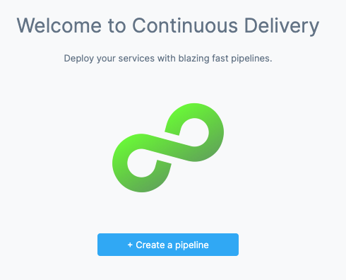

This topic shows you how to deploy a publicly-available NGINX Docker image and manifest into your Kubernetes cluster using a [rolling update strategy](kubernetes-executions/create-a-kubernetes-rolling-deployment.md) in Harness.

## Objectives

You'll learn how to:

* Install and launch a Harness Kubernetes Delegate in your target cluster.
* Set up a Kubernetes Pipeline.
* Run the new Kubernetes Pipeline and deploy a Docker image to your target cluster.

## Before you begin

Make sure you have the following set up before you begin this quickstart:

* **GitHub account:** this quickstart uses a publicly available NGINX manifest and Docker image. DockerHub allows anonymous connections, but GitHub requires that you log into your account to access their repos.

### Set up your Kubernetes cluster

You'll need a target Kubernetes cluster for the Harness Delegate and deployment. Ensure your cluster meets the following requirements:

* **Number of nodes:** 2.
* **vCPUs, Memory, Disk Size:** 4vCPUs, 16GB memory, 100GB disk. In GKE, the **e2-standard-4** machine type is enough for this quickstart.
* **Networking:** outbound HTTPS for the Harness connection to **app.harness.io**, **github.com**, and **hub.docker.com**. Allow TCP port 22 for SSH.
* A **Kubernetes service account** with permission to create entities in the target namespace is required. The set of permissions should include `list`, `get`, `create`, and `delete` permissions. In general, the cluster-admin permission or namespace admin permission is enough.  
For more information, go to [User-Facing Roles](https://kubernetes.io/docs/reference/access-authn-authz/rbac/#user-facing-roles) from Kubernetes.

## Create the deploy stage

Pipelines are collections of stages. For this tutorial, we'll create a new pipeline and add a single stage.

:::note

**Create a Project for your new CD Pipeline:** if you don't already have a Harness project, create a project for your new CD pipeline. Ensure that you add the **Continuous Delivery** module to the project. Go to [create organizations and projects](/docs/platform/organizations-and-projects/projects-and-organizations) for more information.

:::

1. In your Harness project, select **Deployments**, and then select **Create a Pipeline**.
   
2. Enter the name **CD Quickstart** and select **Start**.
   
   Your pipeline appears.

3. Select **Add Stage** and select **Deploy**.
4. Enter the name **Deploy Service**, make sure **Service** is selected, and then select **Set Up Stage**.
   
   The new stage settings appear.
5. In **About the** **Service**, select **New Service**.
   :::note

   Let's take a moment and review Harness services and service definitions (which are explained below). Harness services represent your microservices/apps logically. You can add the same service to as many stages as you need. Service definitions represent your artifacts, manifests, and variables physically. They are the actual files and variable values.  
   
   By separating services and service definitions, you can propagate the same Service across stages while changing the artifacts, manifests, and variables with each stage.

   :::
6. Give the service the name **nginx** and select **Save**.

Once you have created a service, it is persistent and can be used throughout the stages of this or any other pipeline in the project.

## Add the manifest

Next, we can add a Kubernetes manifest for NGINX. We'll use the [publicly-available manifest](https://github.com/kubernetes/website/blob/master/content/en/examples/application/nginx-app.yaml) available from Kubernetes.

1. In **Service Definition**, in **Deployment Type**, select **Kubernetes**.
2. In **Manifests**, select **Add Manifest**.
   :::note

   **What about Artifacts?** In this quickstart we are using a publicly-available NGINX Docker image from DockerHub, and the location of the image is hardcoded in the public manifest from Kubernetes. The **Artifacts** section is only used when the public artifact is not hardcoded in the manifest or the repo is private. In those cases, you add the image in **Artifacts** with a Connector for the repo and then reference the image in your values.yaml (`image: <+artifact.image>`). For more information, go to [Add Container Images as Artifacts for Kubernetes Deployments](cd-kubernetes-category/add-artifacts-for-kubernetes-deployments.md).

   :::
1. Select **K8s Manifest**, and select **Continue**.
2. In **Select K8sManifest Store**, select **GitHub**, and then select **New GitHub Connector**.
3. The **Git Connector** settings appear. Enter the following settings.
   * **Name:** enter a name for the connector.
   * **URL Type:** select **Repository**.
   * **Connection Type:** select **HTTP**.
   * **Git Repository URL:** enter `https://github.com/kubernetes/website`.
   * **Username and Token:** Enter the username and a Github Personal Access Token (PAT) for your GitHub account. You'll have to create a Harness secret for the password.
     1. In **Personal Access Token**, click **Create or Select a Secret**.
     2. Select **New Secret Text**.
     3. In **Secret Name**, enter a name for the secret like **github-pat**.
     4. In **Secret Value**, paste in a GitHub Personal access token. When you're logged into GitHub, these are typically listed at <https://github.com/settings/tokens>. For steps on setting up a GitHub PAT, go to [creating a personal access token](https://docs.github.com/en/authentication/keeping-your-account-and-data-secure/creating-a-personal-access-token) from GitHub. Ensure you PAT has the **repo** scope selected:

     
4. Select **Continue**.
5. In **Connect to the provider**, select **Connect through a Harness Delegate**, and then select **Continue**.
   We don't use the **Connect through Harness Platform** option here simply because you'll need a Delegate later for the connection to your target Kubernetes cluster. Typically, the **Connect through Harness Platform** option is a very quick way to make connections without having to use Delegates.
   
   Expand the section below to learn more about installing delegates.

<details>
<summary>Use the delegate installation wizard</summary>

1. In your Harness project, select **Project Setup**.
2. Select **Delegates**.
3. Select **Install a Delegate**.
4. Follow the delegate installation wizard.

Use this [delegate installation wizard video](https://www.youtube.com/watch?v=yLMCxs3onH8) to guide you through the process.

</details>

```mdx-code-block
import DelegateInstall from '/tutorials/platform/install-delegate.md';
```

<details>
<summary>Install a delegate using the terminal</summary>
<DelegateInstall />
</details>

To learn more, watch the [Delegate overview](https://developer.harness.io/docs/platform/delegates/delegate-concepts/delegate-overview) video.


6. Back in **Set Up Delegates**, you can select the new Delegate.
   In the list of Delegates, you can see your new Delegate and its tags.
7. Select the **Connect using Delegates with the following Tags** option.
8. Enter the tag of the new Delegate and select **Save and Continue**.
   When you are done, the Connector is tested.
9. Select **Continue**.
10. In **Manifest Details**, enter the following settings, test the connection, and click **Submit**. We are going to provide connection and path information for a manifest located at `https://raw.githubusercontent.com/kubernetes/website/main/content/en/examples/application/nginx-app.yaml`.
    * **Manifest Identifier:** enter **nginx**.
    * **Git Fetch Type****:** select **Latest from Branch**.
    * **Branch:** enter **main**.
    * **File/Folder path:**`content/en/examples/application/nginx-app.yaml`. This is the path from the repo root.
    
   The manifest is now listed.

   

11. Select **Next** at the bottom of the **Service** tab.

Now that the artifact and manifest are defined, you can define the target cluster for your deployment.

## Define your target cluster

The target cluster is your own Kubernetes cluster, hosted in your cloud environment. This is where we will deploy the Docker image using the manifest you selected.

Harness connects to all of the common cloud platforms and provides a platform-agnostic Kubernetes cluster connection that can connect to Kubernetes anywhere.

1. In **Infrastructure Details**, in **Specify your environment**, select **New Environment**. Just like with a service, you can create a new environment or selecting an existing one. We'll create a new one.
2. In **New Environment**, enter a name, select **Pre-Production**, and select **Save**. The new environment appears.
3. In **Infrastructure Definition**, select **Kubernetes**.
    :::note

    Let's take a moment and review Harness environments and infrastructure definitions. Harness environments represent your deployment targets logically (QA, Prod, etc). You can add the same Environment to as many stages as you need. Infrastructure definitions represent your target infrastructure physically. They are the actual clusters, hosts, etc.  
    
    By separating environments and infrastructure definitions, you can use the same environment in multiple stages while changing the target infrastructure settings with each stage.

    :::
4. An **Infrastructure Definition** is where you specify the target for your deployment. In this case, your Kubernetes cluster and namespace.
5. In **Cluster Details**, in **Connector**, select **Select a connector**.
6. Select **New Connector**.
7. The Kubernetes cluster connector appears.

   
 
The Kubernetes cluster connector is covered in detail [here](/docs/platform/Connectors/Cloud-providers/ref-cloud-providers/kubernetes-cluster-connector-settings-reference), but let's quickly walk through it.

Let's look at the steps:

1. In **Kubernetes Cluster Connector**, in **Name**, enter **Kubernetes Quickstart**, and select **Continue**.
2. In **Details**, select **Use the credentials of a specific Harness Delegate**. We will select the Delegate next.
   
   

3. Select **Continue**.
4. Select the Kubernetes Delegate you added earlier using its Tags, and then select **Save and Continue**.
   Harness verifies the Connector.
5. Select **Finish**.
6. Select the new Connector and then select **Apply Selected**.
7. Back in **Cluster Details**, in **Namespace**, enter the target namespace for the deployment. For example, **default**. You can use any namespace in your target cluster.
8.  In **Advanced**, in **Release name**, enter `quickstart`.
    For a release name, you can use a built-in or custom expression or any text you like.
    Harness requires a release name for tracking. It is applied to the pods as a label. The release name must be unique across the cluster.
9.  When you are done, the **Cluster Details** will look something like this:

    

    The target infrastructure is complete. Now we can add our stage steps.
10. Select **Next** to move onto **Execution**.

## Add a rollout deployment Step

Now you can select the [deployment strategy](/docs/continuous-delivery/manage-deployments/deployment-concepts.md) for this stage of the pipeline.

1. In **Execution Strategies**, select **Rolling**, and then select **Use Strategy**.

   

2. The **Rollout Deployment** step is added.
   
   

   This is a standard [Kubernetes rolling update](https://kubernetes.io/docs/tutorials/kubernetes-basics/update/update-intro/). By default, Harness uses a `25% max unavailable, 25% max surge` strategy.

That's it. Now the pipeline stage is complete and you can deploy.

## Deploy and review

1. Select **Save** **> Save Pipeline** and then **Run**.
   Now you can select the specific artifact to deploy.
2. In **Primary Artifact**, select **stable**. This is the same as using `docker pull nginx:stable`.
3. Select **Run Pipeline**. Harness will verify the Pipeline and then run it.
   You can see the status of the deployment, and pause or abort it.

   

4. Toggle **Console View** to watch the deployment with more detailed logging. Select the **Rollout Deployment** step and expand **Wait for Steady State**.

   You can see `deployment "my-nginx" successfully rolled out`.

   

Congratulations! The deployment was successful.

In your project's **Deployments**, you can see the deployment listed:


If you run into any errors, it is typically because the cluster does meet the requirements from [Before You Begin](#before_you_begin) section or the cluster's network setting does not allow the Delegate to connect to Docker Hub.In this tutorial, you learned how to:

* Install and launch a Harness Kubernetes Delegate in your target cluster.
* Connect Harness to your Kubernetes cluster and an artifact server.
* Add your manifests to Harness.
* Create an infrastructure definition that targets your cluster and namespace.
* Add a Kubernetes rolling update.
* Deploy your Kubernetes pipeline to your target cluster.

Next, try Harness [Continuous Integration](/docs/continuous-integration) to build a codebase, upload it to a repo, and run unit and integrations tests: [CI pipeline quickstart](/docs/continuous-integration/ci-quickstarts/ci-pipeline-quickstart).

## Clean Up

For steps on deleting the Delgate, go to [delete a delegate](/docs/platform/Delegates/manage-delegates/delete-a-delegate).

## Next Steps

See [CD tutorials](/tutorials/cd-pipelines/) for other deployment features.


