This topic will walk you through creating a Canary deployment in Harness for a Deployment workload.

Harness Canary and [Blue Green](create-a-kubernetes-blue-green-deployment.md) stage steps only support Kubernetes Deployment workloads. The [Rolling Deployment](create-a-kubernetes-rolling-deployment.md) step supports all other workloads except Jobs. The [Apply step](deploy-manifests-using-apply-step.md) can deploy any workloads or objects.

## Before you begin

* [Kubernetes CD Quickstart](/docs/continuous-delivery/deploy-srv-diff-platforms/kubernetes/kubernetes-cd-quickstart.md)
* [Add Kubernetes Manifests](/docs/continuous-delivery/deploy-srv-diff-platforms/kubernetes/cd-kubernetes-category/define-kubernetes-manifests.md)
* [Define Your Kubernetes Target Infrastructure](/docs/continuous-delivery/deploy-srv-diff-platforms/kubernetes/define-your-kubernetes-target-infrastructure.md)

## What workloads can I deploy?

Stages using Harness Canary and Blue Green steps only support [Kubernetes Deployment workloads](https://kubernetes.io/docs/concepts/workloads/controllers/deployment/).

The Rolling Deployment step supports all workloads except Jobs.

The [Apply Step](/docs/continuous-delivery/deploy-srv-diff-platforms/kubernetes/kubernetes-executions/deploy-manifests-using-apply-step) can deploy any workloads or objects.

In Harness, a workload is a Deployment, StatefulSet, or DaemonSet object deployed and managed to steady state.

## Multiple managed workloads

With the Rolling Deployment step, you can deploy multiple managed workloads.

For Canary and Blue Green steps, only one managed object may be deployed per step by default.

You can deploy additional objects using the [Apply Step](/docs/continuous-delivery/deploy-srv-diff-platforms/kubernetes/kubernetes-executions/deploy-manifests-using-apply-step), but it's typically used for deploying Jobs controllers.

## Harness Canary deployments

While you can add multiple steps to a Kubernetes Canary stage, you should simply use the Canary and Primary step groups generated by Harness. Kubernetes deployments have built-in controls for rolling out in a controlled way. The Canary group is a way to test the new build, run your verification, then roll out to the Primary group.A Harness Kubernetes Canary deployment is a little different than a typical Canary deployment.

This is a standard Canary deployment:

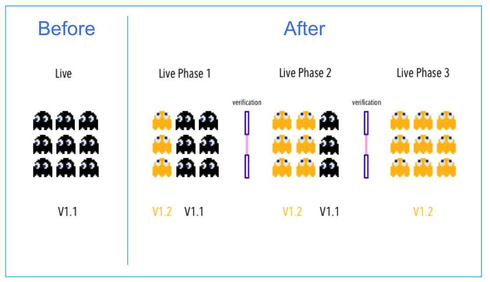

Harness does this a little different:


In a typical Canary deployment, all nodes in a single environment are incrementally updated in small phases, with each phase requiring a verification/gate to proceed to the next phase.

This typical method isn't needed for Kubernetes because Kubernetes includes Rolling Update. Rolling Update is a built-in control for rolling out in a controlled way. It incrementally updates pod instances with new ones. New pods are scheduled on nodes with available resources.

A Harness Kubernetes Canary deployment uses two phases, a Canary and a Primary Deployment group:

1. **Group 1:** Harness creates a Canary version of the Kubernetes Deployment object defined in your Service Definition **Manifests** section. Once that Deployment is verified, the Canary Delete step deletes it by default.  
Harness provides a Canary group as a way to test the new build, run your verification, then rollout to the following Primary Deployment group.
2. **Group 2:** run the actual deployment using a Kubernetes Rolling Update with the number of pods you specify in the **Manifests** files (for example, `replicas: 3`).

When you add a Canary Strategy to a stage, Harness automatically generates the steps for Canary and Primary Deployment groups.

If you're new to Kubernetes RollingUpdate deployments, go to [Performing a Rolling Update](https://kubernetes.io/docs/tutorials/kubernetes-basics/update/update-intro/) from Kubernetes. That guide summaries Rolling Update and provides an interactive online tutorial.Although it isn't covered here, you can also scale your Workloads between the Canary and Rolling steps if you like. You simply add a new Phase and use the Scale step. See [Scale Kubernetes Pods](/docs/continuous-delivery/deploy-srv-diff-platforms/kubernetes/kubernetes-executions/scale-kubernetes-replicas).

## Visual summary

Here's a short video walking through a simple Canary deployment:

<!-- Video:
https://www.youtube.com/watch?v=UL0ie46c9No-->
<docvideo src="https://www.youtube.com/watch?v=UL0ie46c9No" />

This video uses a publicly available manifest on Kubernetes GitHub account: `https://github.com/kubernetes/website/blob/master/content/en/examples/application/nginx-app.yaml`.

## Define the service and infrastructure

Create your CD Pipeline stage.

To set up your Service and Infrastructure in the stage, follow the steps in these topics:

* [Add Kubernetes Manifests](/docs/continuous-delivery/deploy-srv-diff-platforms/kubernetes/cd-kubernetes-category/define-kubernetes-manifests)
* [Define Your Kubernetes Target Infrastructure](/docs/continuous-delivery/deploy-srv-diff-platforms/kubernetes/define-your-kubernetes-target-infrastructure)

Once the Service and Infrastructure are set up, you can add the execution steps.

## Add the execution steps

In the stage's **Execution**, click **Add Step**, and select the **Canary** strategy.

Harness adds all the steps you need to perform the Canary strategy:

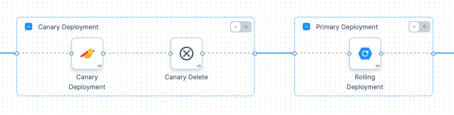

That's it. Harness will perform the Canary and Rollout steps using your manifests and artifacts.

Let's look at the default settings for the Canary Deployment step.

## Canary Deployment group

Click the **Canary Deployment** step.

### Canary Deployment step

In this step, you define how many pods are deployed for a Canary test of the configuration files in your Service Definition **Manifests** section.

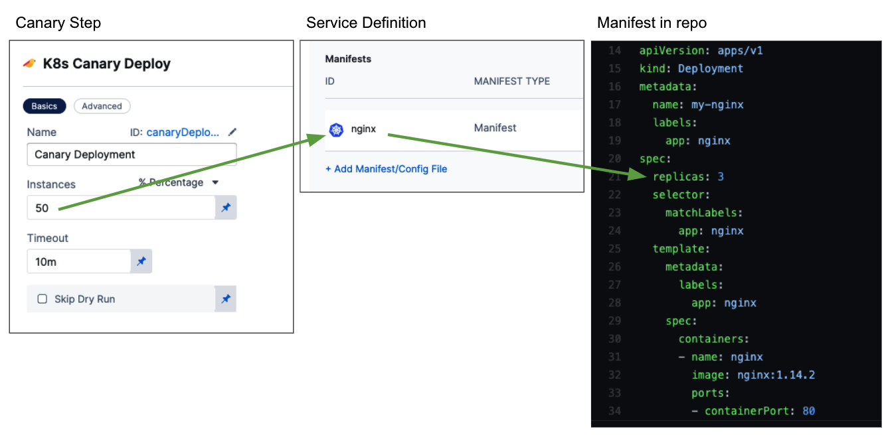

* If you selected **Instance Count**, this is simply the number of pods.
* If you selected **Percentage**, enter a percentage of the pods defined in your Service Definition **Manifests** files to deploy.

For example, if you have `replicas: 4` in a manifest and you enter **50** for **Percentage**, then 2 pods are deployed in this step.

If you have `replicas: 3` in a manifest in Service, and you enter **50** for **Percentage**, then Harness rounds up and 2 pods are deployed in this step.

**Skip Dry Run:** By default, Harness uses the `--dry-run` flag on the `kubectl apply` command during the **Initialize** step of this command, which prints the object that would be sent to the cluster without really sending it. If the **Skip Dry Run** option is selected, Harness will not use the `--dry-run` flag.

#### Canary Delete step

Since the **Canary Deployment** step was successful, it is no longer needed. The **Canary Delete** step is used to clean up the workload deployed by the **Canary Deployment** step. For more information, go to [Canary Delete Step](/docs/continuous-delivery/deploy-srv-diff-platforms/kubernetes/cd-k8s-ref/kubernetes-canary-delete-step).

For step on deleting other Kubernetes resources, you can use the standard **Delete** step. For more details, go to [Delete Kubernetes Resources](/docs/continuous-delivery/deploy-srv-diff-platforms/kubernetes/kubernetes-executions/delete-kubernetes-resources).

## Primary deployment rolling update

The Primary Deployment group runs the actual deployment as a rolling update with the number of pods you specify in the Service Definition **Manifests** files (for example, `replicas: 3`).

Click **Rolling Deployment**. For details on its settings, go to [Kubernetes Rollout Step](/docs/continuous-delivery/deploy-srv-diff-platforms/kubernetes/cd-k8s-ref/kubernetes-rollout-step).

Similar to application-scaling, during a rolling update of a Deployment, the Kubernetes service will load-balance the traffic only to available pods (an instance that is available to the users of the application) during the update.

Rolling updates allow an update of a Deployment to take place with zero downtime by incrementally updating pod instances with new ones. The new pods are scheduled on nodes with available resources. The rolling update Deployment uses the number of pods you specified in the Service Definition **Manifests** (number of replicas).

## Canary deployment

Let's look at how the stage steps deploy the workload.

### Canary Deployment step in deployment

Let's look at an example where the **Canary Deployment** step is configured to deploy a **Percentage** of **50**. Here is the step in the Harness **Deployments** page:

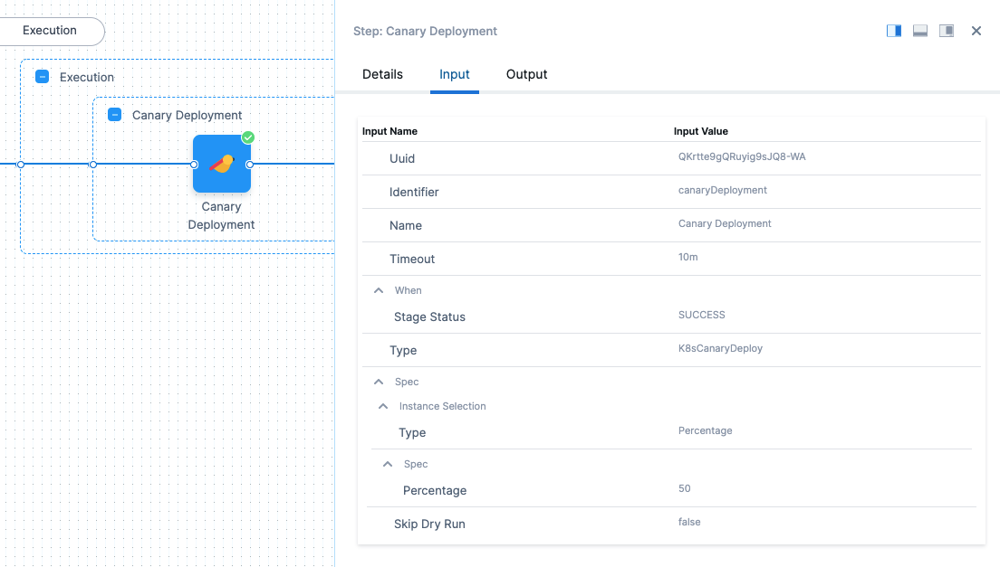

You can see **Percentage** is **2** in **Input**.

In **Details** you can see the logs for the step.

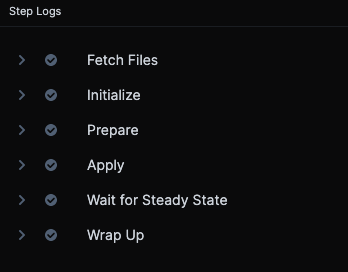

Let's look at the **Prepare**, **Apply**, and **Wait** **for Steady State** sections of the step's deployment log, with comments added:

#### Prepare

Here is the log from the Prepare section:

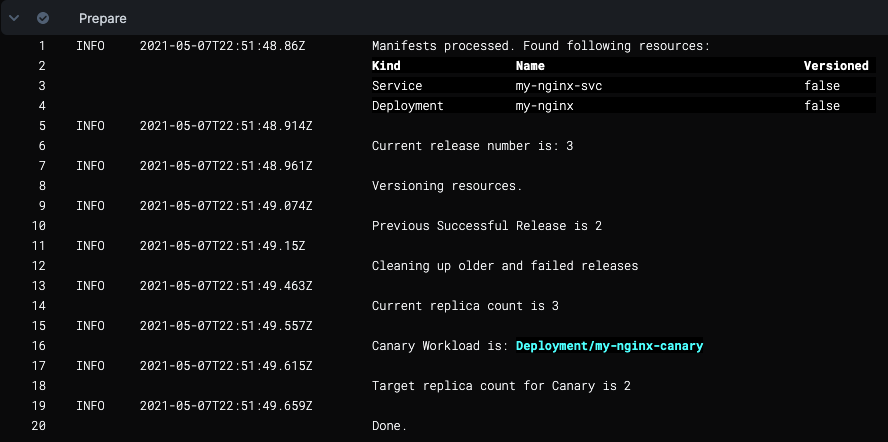

The name of the Deployment workload in the Service Definition **Manifests** file is **my-nginx****.**

As you can see, Harness appends the name with **-canary**, **my-nginx-canary**. This is to identify Canary Deployment step workloads in your cluster.

The next section is **Apply**.

#### Apply

Here you will see the manifests in the Service Definition **Manifests** section applied using kubectl as a single file, **manifests.yaml**.

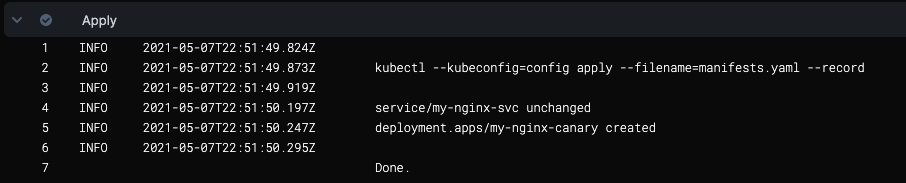

Next, Harness logs the steady state of the pods.

#### Wait for Steady State

Harness displays the status of each pod deployed and confirms steady state.

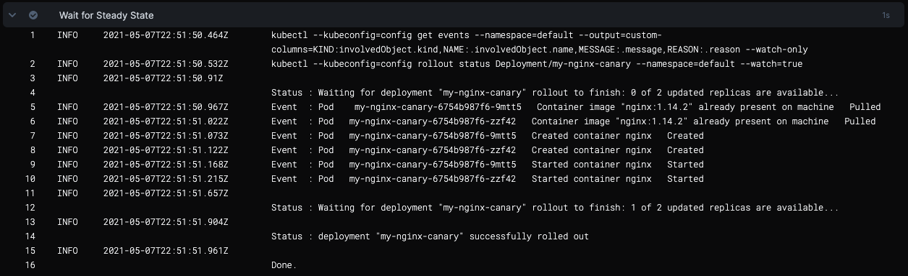

#### Wrap Up

The Wrap Up log is long and describes all of the container and pod information for the step, using the kubectl command:


```
kubectl --kubeconfig=config describe --filename=manifests.yaml
```

### Primary step in deployment

Let's look at an example where the **Primary Deployment** section deploys the Service Definition **Manifests** objects. Here is the step in the Harness **Deployments** page:

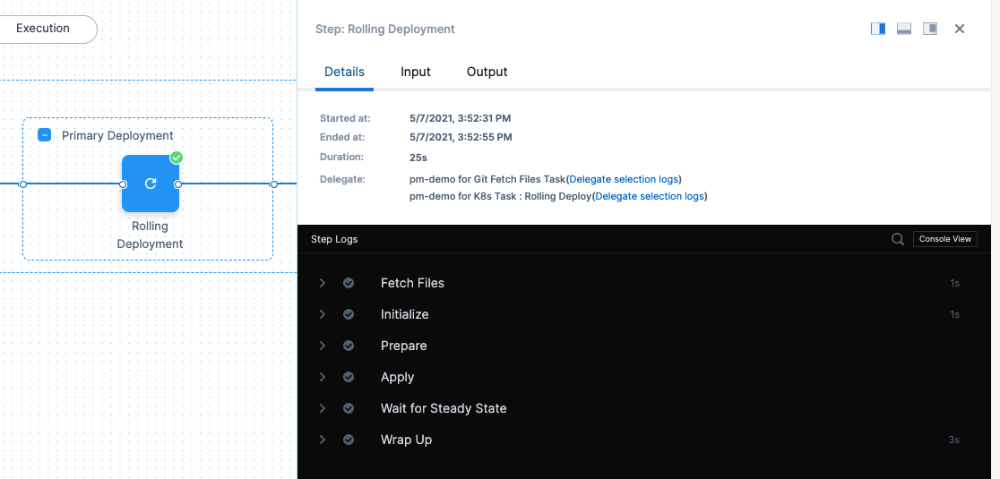

Before we look at the logs, let's look at the Service Definition **Manifests** files it's deploying.

Here is the Deployment object YAML from our Service **Manifests** section:


```yaml
apiVersion: apps/v1  
kind: Deployment  
metadata:  
  name: my-nginx  
  labels:  
    app: nginx  
spec:  
  replicas: 3  
...
```

Let's look at the **Initialize**, **Prepare**, and **Apply** stages of the **Rollout Deployment**.

#### Initialize

In the **Initialize** section of the **Rollout Deployment** step, you can see the same object descriptions as the Service Definition **Manifests** section:  


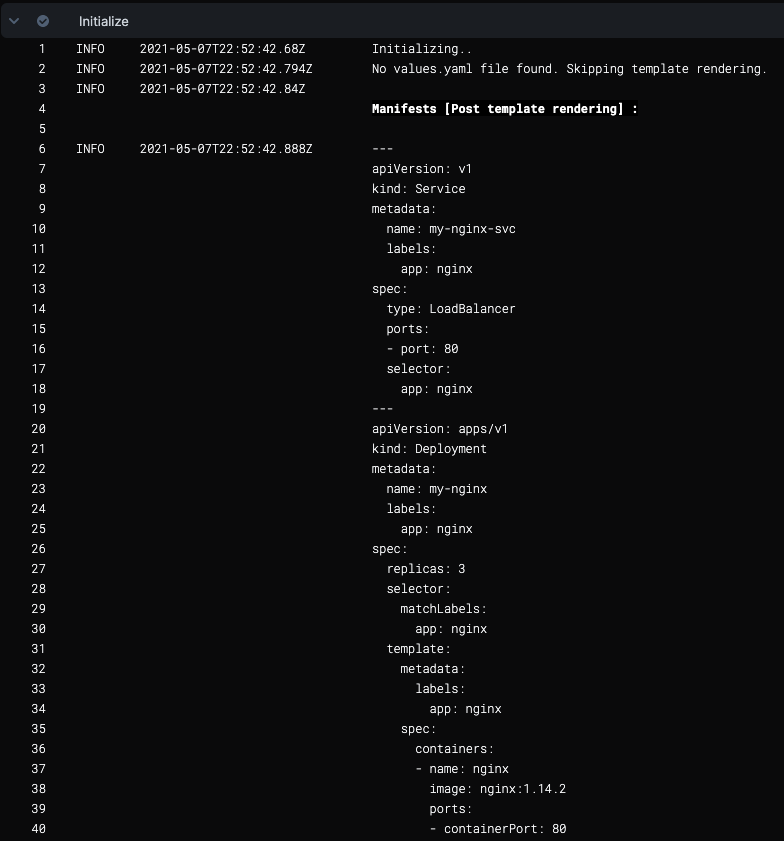

Now that Harness has ensured that manifests can be used, it will process the manifests.

#### Prepare

In the **Prepare** section, you can see that Harness versions release (for more information, see [Kubernetes Releases and Versioning](/docs/continuous-delivery/deploy-srv-diff-platforms/kubernetes/cd-k8s-ref/kubernetes-releases-and-versioning)).

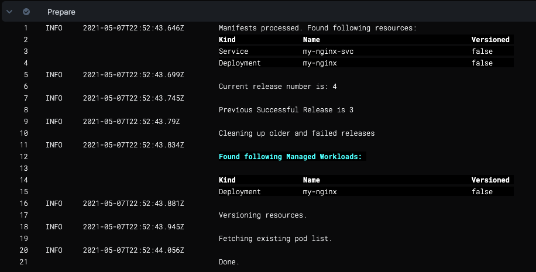

Now Harness can apply the manifests.

#### Apply

The Apply section shows the kubectl commands for applying your manifests.

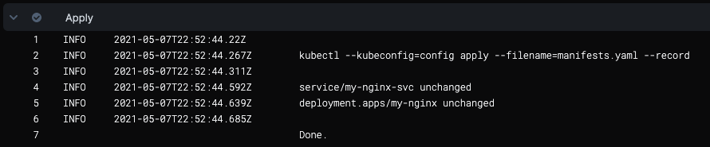

Now that the manifests are applied, you can see the container and pod details described in **Wrap Up**.

#### Wrap Up

Wrap Up is long and uses a kubectl describe command to provide information on all containers and pods deployed:

```
kubectl --kubeconfig=config get events --namespace=default --output=custom-columns=KIND:involvedObject.kind,NAME:.involvedObject.name,NAMESPACE:.involvedObject.namespace,MESSAGE:.message,REASON:.reason --watch-only
```

Here is a sample from the output that displays the Kubernetes RollingUpdate:

```
kubectl --kubeconfig=config rollout status Deployment/my-nginx --namespace=default --watch=true  
  
Status : my-nginx deployment "my-nginx" successfully rolled out
```

As you look through the description in **Wrap Up** you can see label added:

```
add label: harness.io/track=stable 
```

You can use the `harness.io/track=stable` label with the values `canary` or `stable` as a selector for managing traffic to these pods, or for testing the pods. For more information, see  [Kubernetes Releases and Versioning](/docs/continuous-delivery/deploy-srv-diff-platforms/kubernetes/cd-k8s-ref/kubernetes-releases-and-versioning).

The stage is deployed.

Now that you have successfully deployed your artifact to your Kubernetes cluster pods using your Harness Pipeline, look at the completed workload in the deployment environment of your Kubernetes cluster.

Or you can simply connect to your cluster in a terminal and see the pod(s) deployed:

```
john_doe@cloudshell:~ (project-15454)$ kubectl get pods  
NAME                                                        READY     STATUS    RESTARTS   AGE  
my-nginx-7df7559456-xdwg5                 1/1       Running   0          9h
```

## Rollback

For more information, go to [Kubernetes Rollback](/docs/continuous-delivery/deploy-srv-diff-platforms/kubernetes/cd-k8s-ref/kubernetes-rollback).

## Using Horizontal Pod Autoscaler (HPA)

:::info

Currently, this functionality is behind a feature flag, `CDS_SUPPORT_HPA_AND_PDB_NG`. Contact [Harness Support](mailto:support@harness.io) to enable the feature.

:::

The Horizontal Pod Autoscaler (HPA) automatically scales ReplicationControllers, Deployments, ReplicaSets, or StatefulSets based on CPU utilization. Scaling is horizontal, as it affects the number of instances rather than the resources allocated to one container. Upon initial configuration, HPA can make scaling decisions based on custom or external metrics. All you need to do is define the minimum and maximum number of replicas and a trigger limit.

Here's a sample HPA resource: 

```yaml
apiVersion: autoscaling/v1
kind: HorizontalPodAutoscaler
metadata:
 name: hpa
spec:
 scaleTargetRef:
   apiVersion: apps/v1
   kind: Deployment
   name: nginx-deployment
 minReplicas: 1
 maxReplicas: 10
 targetCPUUtilizationPercentage: 50
```
Once configured, the HPA controller checks the metrics and scales your replicas accordingly. HPA checks metrics every 15 seconds by default.

Here is a sample Kubernetes resource with stage color `blue`:

```yaml
apiVersion: apps/v1
kind: Deployment
metadata:
  name: test-deployment
spec:
  replicas: 10
  selector:
    matchLabels:
      app: test-deployment
  template:
    metadata:
      labels:
        app: test-deployment
    spec:
      containers:
      - name: nginx
        image: nginx:latest
        ports:
        - containerPort: 80
```

HPA references its target using `kind` and `name`. After the initial rolling deployment, Harness creates a `test-deployment` deployment and a `test-hpa` HPA resource. For any subsequent Canary deployment, Harness creates a `test-deployment-canary` deployment and a `test-hpa-canary` HPA resource which updates the reference for the `test-deployment-canary` deployment. 

```yaml
apiVersion: autoscaling/v1
kind: HorizontalPodAutoscaler
metadata:
 name: test-hpa-canary
spec:
 scaleTargetRef:
   apiVersion: apps/v1
   kind: Deployment
   name: test-deployment-canary
 minReplicas: 1
 maxReplicas: 10
 targetCPUUtilizationPercentage: 50
```

The release history contains the name of the HPA resource as part of list of resources.

In the Canary Delete step, Harness deletes the resources based on the release history.

## Using Pod Disruption Budget (PDB)

:::info

Currently, this functionality is behind a feature flag, `CDS_SUPPORT_HPA_AND_PDB_NG`. Contact [Harness Support](mailto:support@harness.io) to enable the feature.

:::

A Pod Disruption Budget (PDB) defines the budget for voluntary disruptions. To ensure baseline availability or performance, the PDB lets the cluster know the minimum threshold for pod availability.

PDB can be applied for the following types of controllers:

* Deployment
* ReplicationController
* ReplicaSet
* StatefulSet

Here's a sample PBD resource: 

```yaml
apiVersion: apps/v1
kind: Deployment
metadata:
  name: test-deployment
spec:
  replicas: 10
  selector:
    matchLabels:
      app: test-deployment
  template:
    metadata:
      labels:
        app: test-deployment
    spec:
      containers:
      - name: nginx
        image: nginx:latest
        ports:
        - containerPort: 80
```

After the initial rolling deployment, Harness creates a `test-deployment` deployment and a `test-pdb` PDB resource. For any subsequent Canary deployment, Harness creates a `test-deployment-canary` deployment and a `test-pdb-canary` PDB resource which updates the reference for the `test-deployment-canary` deployment. 

```yaml
apiVersion: policy/v1
kind: PodDisruptionBudget
metadata:
  name: test-pdb-canary
spec:
  minAvailable: 1
  selector:
    matchLabels:
      app: test-deployment-canary
```

Additionally, PDB updates selectors (`.spec.selectors`) to match the selectors of the deployment. 

```yaml
app=test-deployment
harness.io/track=canary
```

The release history contains the name of the PDB resource as part of list of resources.

In the Canary Delete step, Harness deletes the resources based on the release history.

## Important notes

* Harness does not roll back Canary deployments because your production is not affected during Canary. Canary catches issues before moving to production. Also, you might want to analyze the Canary deployment. The Canary Delete step is useful to perform cleanup when required.

## Next steps

* [Create a Kubernetes Rolling Deployment](/docs/continuous-delivery/deploy-srv-diff-platforms/kubernetes/kubernetes-executions/create-a-kubernetes-rolling-deployment)
* [Create a Kubernetes Blue Green Deployment](/docs/continuous-delivery/deploy-srv-diff-platforms/kubernetes/kubernetes-executions/create-a-kubernetes-blue-green-deployment)

