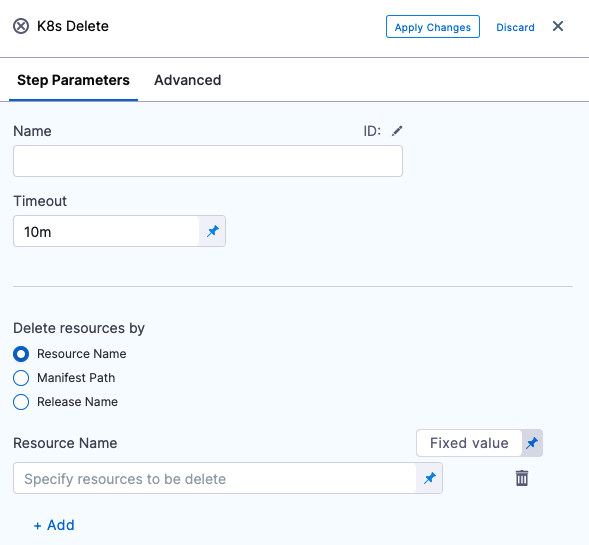
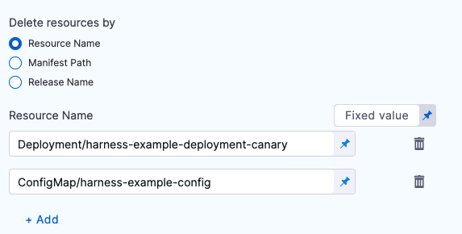
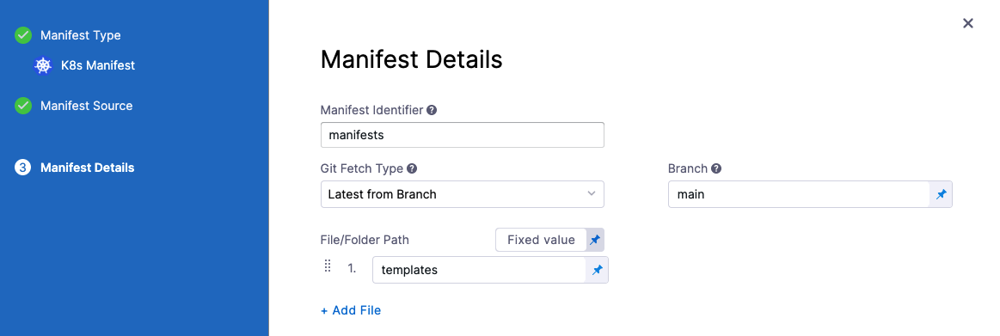
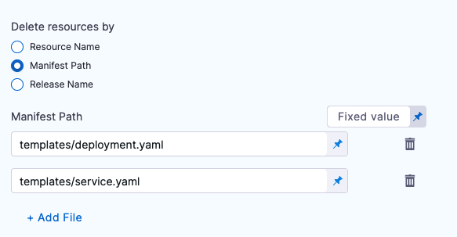
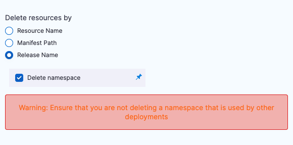

This topic describes how to remove any deployed Kubernetes resources with the **K8s Delete** step.

Looking for Canary Delete? See [Canary Delete Step](/docs/continuous-delivery/deploy-srv-diff-platforms/kubernetes/cd-k8s-ref/kubernetes-canary-delete-step).

### Before you begin

* [Define Kubernetes Manifests](/docs/continuous-delivery/deploy-srv-diff-platforms/kubernetes/cd-kubernetes-category/define-kubernetes-manifests)
* [Create a Kubernetes Canary Deployment](/docs/continuous-delivery/deploy-srv-diff-platforms/kubernetes/kubernetes-executions/create-a-kubernetes-canary-deployment)
* [Create a Kubernetes Blue Green Deployment](/docs/continuous-delivery/deploy-srv-diff-platforms/kubernetes/kubernetes-executions/create-a-kubernetes-blue-green-deployment)
* [Create a Kubernetes Rolling Deployment](/docs/continuous-delivery/deploy-srv-diff-platforms/kubernetes/kubernetes-executions/create-a-kubernetes-rolling-deployment)

## Where to add the Kubernetes Delete step

You can add a Kubernetes Delete step anywhere in your Pipeline, but the resource you want to delete must already exist by the time Pipeline execution reaches the Kubernetes Delete step.

If you are using a Kubernetes Apply step, Canary Deployment, Rolling Deployment, or some provisioning step to create resources, ensure that you only add the Kubernetes Delete step after its target resource is created.

## Add Delete step

In your Harness stage Execution, click **Add Step**, and select **K8s** **Delete**. The K8s Delete settings appear:



You can add a K8s Delete step anywhere in your stage.

Enter a name for the step.

## Select resources to delete

In **Delete resources by**, select how you want to select the resources to be deleted.

There are a few ways to specify the resource to be removed.

### Resource name

Identify a resource name in the format `[namespace]/Kind/Name`, with `namespace` being optional.

You must add a `Kind` before the resource name, like this: 

`Deployment/harness-example-deployment-canary`

Enter multiple resources using **Add**.



To delete all resources, use the **Release Name** option, explained below.

### Manifest path

Enter the path to the manifest for the resource you want to delete. The path is relative to the folder path entered in **File/Folder Path** in the **Manifest Details** settings:



Enter multiple resources using **Add File**.



### Release name

During deployment Harness creates a ConfigMap listing the resources of the release and uses the release name for tracking them. The release name is defined in the **Infrastructure** settings, in **Cluster Details**, in **Advanced**.

If you want to delete all of the resources for a release, select **Release Name**.

If you select the **Delete namespace** option, Harness will delete the namespace(s) defined in the release.



Ensure that you are not deleting a namespace that is used by other deployments.

### Example: Deleting a Deployment

Here is an example of the log from a Delete command:

```
Initializing..  
...  
Resources to delete are:   
- Deployment/harness-example-deployment-canary  
Done.
```

## Deleting all resources and namespaces

Here is an example deleting all resources in the release and the namespace:


```
All Resources are selected for deletion  
Delete Namespace is set to: true  
Fetching all resources created for release: release-44e74aca-279f-3b4a-bb15-06d750393a8d  
  
Resources to delete are:   
- adwait-12/Deployment/harness-example-deployment  
- adwait-12/Service/harness-example-svc  
- adwait-12/ConfigMap/release-44e74aca-279f-3b4a-bb15-06d750393a8d  
- adwait-12/ConfigMap/harness-example-2  
- adwait-12/ConfigMap/harness-example-1  
- adwait-12/Secret/harness-example-2  
- adwait-12/Secret/harness-example-1  
- adwait-12/Namespace/adwait-12  
Done.
```

## Notes

* **Delete and Traffic Management**: If you are splitting traffic using the **Apply step**, move the **K8s** **Delete** step after the traffic shifting. This will prevent any traffic from being routed to deleted pods before traffic is routed to stable pods.

## See also

* [Canary Delete Step](/docs/continuous-delivery/deploy-srv-diff-platforms/kubernetes/cd-k8s-ref/kubernetes-canary-delete-step)

