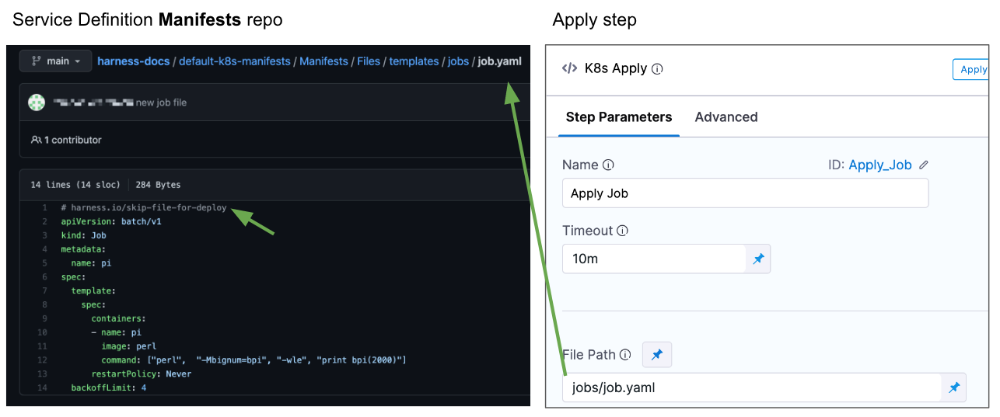
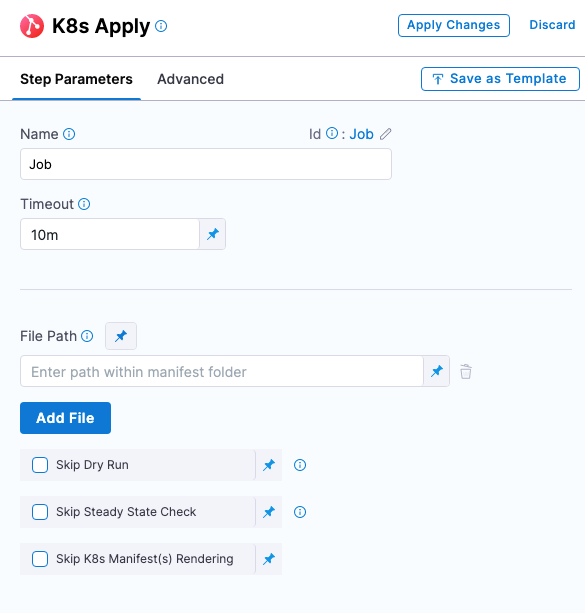
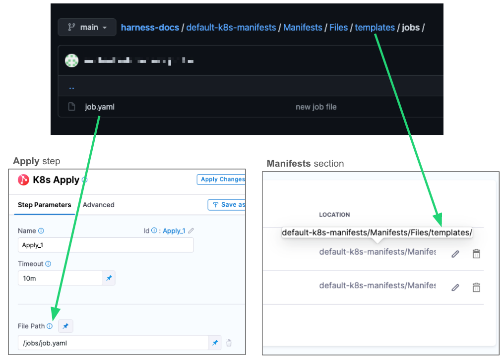
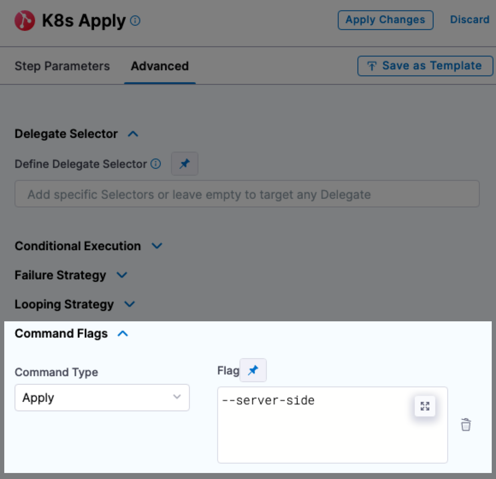
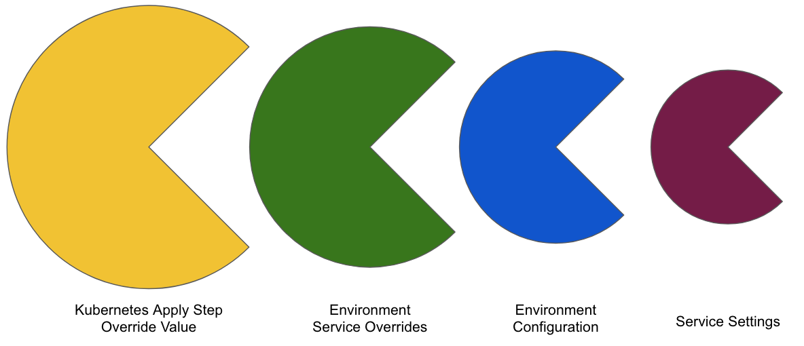

By default, the Harness Kubernetes Rolling, Canary, and Blue Green steps will deploy all of the resources you have set up in the Service Definition **Manifests** section.

In some cases, you might have resources in **Manifests** that you do not want to deploy as part of the main deployment, but want to apply as another step in the stage.

For example, you might want to deploy an additional resource only after Harness has verified the deployment of the main resources in the **Manifests** section.

CD stages include an **Apply** step that allows you to deploy any resource you have set up in the **Manifests** section.

## Apply step behavior

The Apply step performs the following tasks:

1. Fetches the Kubernetes manifests from the repo defined the Harness service.
2. Renders any values.yaml and manifest files using Go templating and previews the files in the step log.
3. Performs a dry run to show you what resources are about to be created.
4. Applies the resources to the target Kubernetes cluster.
5. Checks that all deployed resources reached steady state. Steady state means the pods are healthy and up and running in the cluster.
6. Prints a summary of the applied resources to the step log.

### Apply step failures

In the event of deployment failure, Harness will not roll back the Apply step action because there is no record of its state when the Apply step is performed. 

We recommend users define rollback steps in the **Rollback** section of the stage to undo the Apply step(s) actions. 

Harness will roll back any infrastructure or deployments that happened prior to the failed step.

## What Kubernetes workloads can I include?

The **Apply Step** can deploy all workload types, including Jobs.

All workloads deployed by the Apply step are managed workloads. Managed workloads are tracked until steady state is reached.

The Apply Step is primarily used for deploying Jobs controllers, but it can be used for other resources. Typically, when you want to deploy multiple workloads (Deployment, StatefulSet, and DaemonSet) you will use separate stages for each.Other Kubernetes steps, such as Rolling, are limited to specific workload types.

For a detailed list of what Kubernetes workloads you can deploy in Harness, see [What Can I Deploy in Kubernetes?](/docs/continuous-delivery/deploy-srv-diff-platforms/kubernetes/cd-k8s-ref/what-can-i-deploy-in-kubernetes).

### Rolling vs apply

The following table lists the differences between the Rolling Deployment step (default in a Rolling strategy) and the Apply step (which may be used with any strategy).

|  | **Jobs** | **Rollback** |
| --- | --- | --- |
| **Rolling Deployment step** | No | Yes |
| **Apply step** | Yes | No |

## Skip a specific workload

By default, when you run a CD pipeline, Harness will use all of the manifests in the **Manifests** section, and deploy all of its workloads.

To avoid having a specific workload deployed as part of the standard deployment, you add the Harness comment  `# harness.io/skip-file-for-deploy` to the **top** of the file.

This comment instructs Harness to ignore this manifest. Later, you will use the **Apply Step** to deploy this manifest.

For example, here is a ConfigMap file using the `# harness.io/skip-file-for-deploy` comment:


```yaml
# harness.io/skip-file-for-deploy  
  
{{- if .Values.env.config}}  
apiVersion: v1  
kind: ConfigMap  
metadata:  
  name: {{.Values.name}}  
data:  
{{.Values.env.config | toYaml | indent 2}}  
---  
{{- end}}
```

Now, when this pipeline is executed, this resource will not be applied.

Later, you can apply a skipped manifest using the **Apply** step. Here's an example using a Kubernetes Job:

<!--  -->

<docimage path={require('./static/5ec2523eac5fa7169bf2101a9b4920cfe7aa2efe688075fea0ee57f775c0b05b.png')} />

### Important

* The comment `# harness.io/skip-file-for-deploy` must be at the **top** of the file. If it is on the second line it will not work and the resource will be deployed as part of the main stage rollout.
* If you apply the ignore comment `# harness.io/skip-file-for-deploy` to a resource but do not use the resource in an **Apply** step, the resource is never deployed.

## Add the manifest

1. Add the commented manifest to the **Manifests** section of your CD stage.

See [Add Kubernetes Manifests](/docs/continuous-delivery/deploy-srv-diff-platforms/kubernetes/cd-kubernetes-category/define-kubernetes-manifests).

## Add the Apply step

1. In your pipeline, click **Add step**, and then click **Apply**. The Apply step appears.

  


Enter a name for the step. Harness will create a step Id using the name, but you can change it.

## Timeout

You can use:

- `w` for weeks.
- `d` for days.
- `h` for hours.
- `m` for minutes.
- `s` for seconds.
- `ms` for milliseconds.

The maximum is `53w`.

Timeouts can be set at the pipeline-level also, in the pipeline **Advanced Options**.

## Enter the path and name of the manifest

1. In **File Path**, enter the path to a manifest file.

The **File Path** setting contains the path to the file you want deployed. The file must be in the same repo as the manifest(s) you selected in the Harness service being deployed by this stage. 

The repo is specified in the service's **Service Definition** settings, in **Manifests**. The file entered in **File Path** must be subordinate to that path.

In the following example, the path used in the **Manifests** section of the Service Definition is `default-k8s-manifests/Manifests/Files/templates/`. The **Apply** step uses a Job manifest in the subfolder `jobs/job.yaml`.

<!--  -->

<docimage path={require('./static/bded796afd9394b571b7c2229ac96ad99ff608558bfa4aa2daf5ab670f886578.png')} />


You can enter multiple file paths in **File Path**. Simply click **Add File**.

### File path runtime inputs

You can set [Fixed Values, Runtime Inputs, and Expressions](/docs/platform/References/runtime-inputs) for File Path settings.

Here are the options:

* **File Path setting:**
	+ **Fixed Value:** this is the default. Selecting **Fixed Value** means that you will set a static file path or expression in the step.
	+ **Runtime Input:** select this option if you want to enter a value at runtime or using [Input Sets and Overlays](/docs/platform/Pipelines/input-sets).
* **File path field:**
	+ **Fixed Value:** this is the default. Selecting **Fixed Value** means that you will set a static file path in the step.
	+ **Expression:** Selecting **Expression** means that you will use a variable in the step, such as a [stage variable](/docs/platform/pipelines/add-a-stage/).

## Skip dry run

By default, Harness uses the `--dry-run` flag on the `kubectl apply` command, which prints the object that would be sent to the cluster without really sending it. If the **Skip Dry Run** option is selected, Harness will not use the `--dry-run` flag.

## Skip steady state check

By default, Harness checks to see if a deployed workload has reached steady state.

If you select this option, Harness will not check that the workload has reached steady state.

## Skip k8s manifest(s) rendering

By default, Harness uses Go templating and a values.yaml for templating manifest files. 

In some cases, you might not want to use Go templating because your manifests use some other formatting.

Use the **Skip K8s Manifest(s) Rendering** option if you want Harness to skip rendering your manifest files using Go templating.

For details, go to [Deploy Manifests Separately using Apply Step](/docs/continuous-delivery/deploy-srv-diff-platforms/kubernetes/kubernetes-executions/deploy-manifests-using-apply-step).

## Command flags

Kubernetes command flags are command-line options that can be passed to a Kubernetes command to modify its behavior.

You can add command flags in your Apply step and Harness will run them after the `kubectl apply -f <filename>` command it runs to deploy your manifest.

The availability of specific command flags is based on the version of the kubectl binary that is installed on the Harness delegate performing deployment. For example, `kubectl apply -f <filename> --server-side` is only available on kubectl version 1.22. 

To use command flags, do the following:

1. In the Apply step, click **Advanced**.
2. In **Command Flags**, click **Add**.
3. In **Command Type**, select **Apply**.
4. In Flag, enter the flag in the standard `kubectl` format of `--[flag name]`, such as `--server-side`.

  


:::note

You cannot use `kubectl` subcommands in the **Command Flags** setting. For example, the subcommand `kubectl apply set-last-applied` will not work.

:::

For more information on command flags, go to [Apply](https://kubernetes.io/docs/reference/generated/kubectl/kubectl-commands#apply) in the Kubernetes documentation.


## Override value

You can override some or all of the values in the values YAML file or the Kuztomize Patch file selected in the Harness service **Service Definition** or environment overrides.

Values YAML files can be specified at several places in Harness:

* Environment service overrides (if you are using [Services and Environments v2](/docs/continuous-delivery/get-started/services-and-environments-overview))
* Environment configuration (if you are using [Services and Environments v2](/docs/continuous-delivery/get-started/services-and-environments-overview))
* Service definition manifests

You can also add values YAML values and/or files or Kustomize Patch files in the Apply step **Override Value**.

1. Select **Add Manifest**.
2. In **Specify Manifest Type**, select **Values YAML** or **Kustomize Patches**, and then select **Continue**.
   * To add a values YAML value and/or files, select a values YAML store. You can select remote stores such as Git, GitHub, GitLab, Bitbucket, Azure Repo, or Harness file store, or Inline.
     - If you select a remote store, select or add a connector to that repo, and then enter a path to the folder or file.
     - If you select Harness file store, select a values YAML file from project, organization, or account in the file store.
     - If you select **Inline**, enter a name for you to identify values YAML and the `name:value` pairs for the override.
   * To add a Kustomize Patch file, select a Kustomize Patches store. You can select remote stores such as Git, GitHub, GitLab, Bitbucket, Azure Repo, or Harness file store, or Inline.
     - If you select a remote store, select or add a connector to that repo, and then enter a path to the folder or file.
     - If you select Harness file store, select a Kustomize Patch file from project, organization, or account in the file store.
     - If you select **Inline**, enter a name for you to identify the Kustomize Patch file and the Patch YAML values for the override.
       
       <details>
       <summary>Sample Kuztomize Patch YAML</summary>

       ```
       apiVersion: apps/v1
       kind: Deployment
       metadata:
         name: example-deploy
         namespace: default
       spec:
         template :
           spec:
             containers:
               - name: example-app
                 image: <+stages.s1.variables.image>
       ---
       apiVersion: apps/v1
       kind: Deployment
       metadata:
         name: example-deploy
         namespace: default
       spec:
         replicas: <+stages.s1.variables.replica>
       ```

       </details> 

3. Select **Submit**. 

You can add multiple overrides to the Apply step.

### Override priority

At pipeline runtime, Harness compiles a single values YAML for the deployment using all of the values YAML files you have set up across the stage's service, environment overrides, and the Apply step.

Harness merges all of the values YAML values/files into one file.

If two or more sources have the same `name:value` pairs (for example, `replicas: 2`), that is a conflict that Harness resolves using the following priority order (from highest to lowest):

1. Kubernetes Apply Step **Override Value**.
2. Environment Service Overrides (if you are using [Services and Environments v2](/docs/continuous-delivery/get-started/services-and-environments-overview)).
3. Environment Configuration (if you are using [Services and Environments v2](/docs/continuous-delivery/get-started/services-and-environments-overview)).
4. Service Definition Manifests.



The override priority for these is in reverse order, so 2 overrides 1 and so on.

## YAML example of Apply step

Here's a YAML example of an Apply step.

```yaml
...
          - step:
              type: K8sApply
              name: Apply DB Migration Job
              identifier: Apply_DB_Migration_Job
              spec:
                filePaths:
                  - database-migration.yaml
                skipDryRun: false
                skipSteadyStateCheck: true
                skipRendering: false
                commandFlags: 
                  - commandType: Apply
                    flag: "--dry-run=true --server-side"
                overrides:
                  - manifest:
                      identifier: DBValues
                      type: Values
                      spec:
                        store:
                          type: Github
                          spec:
                            connectorRef: account.ThisRohanGupta
                            gitFetchType: Branch
                            paths:
                              - migration-values.yaml
                            repoName: Product-Management
                            branch: "main"
              timeout: 10m
              failureStrategies:
                - onFailure:
                    errors:
                      - AllErrors
                    action:
                      type: Retry
                      spec:
                        retryCount: 3
                        retryIntervals:
                          - 2s
                        onRetryFailure:
                          action:
                            type: StageRollback
...
```


## Apply step examples

Deploying a resource out of sync with the main resource deployment in a stage can be useful if a specific resource requires some external service processing that is orchestrated around your main rollout, such as database migration.

One reason why a Job controller object is a good use of the Kubernetes Apply step is that it represents a finite task that runs to completion rather than managing an ongoing desired state. You can run a Job to do perform work outside of the primary object deployment, such as large computation and batch-oriented tasks.

In another example, let's say you have two services, serviceA calls serviceB to populate a product page. The primary Deployment rollout deploys serviceB successfully and then the Apply step deploys serviceA next, ensuring serviceA only calls serviceB after serviceB is deployed successfully.

Another example of the use of the Apply step is service mesh traffic shifting. Your main workload rollout can deploy your services and then an Apply step can apply the resource that modifies the service mesh for the deployed services.

## Kustomize deployment with the Apply step

You can use the Apply step in your Kustomize deployments.

When you use Kustomize, the **File Path** in the Apply Step should be set according to how you set up the Manifest Details in the Service.

For details, see **Kustomize deployment with the Apply step** in [Use Kustomize for Kubernetes Deployments](/docs/continuous-delivery/deploy-srv-diff-platforms/kustomize/use-kustomize-for-kubernetes-deployments).

## Notes

* The Apply step does not version ConfigMap and Secret objects. ConfigMap and Secret objects are overwritten on each deployment. This is the same as when ConfigMap and Secret objects are marked as unversioned in typical rollouts (`harness.io/skip-versioning: true`). See [Kubernetes Releases and Versioning](/docs/continuous-delivery/deploy-srv-diff-platforms/kubernetes/cd-k8s-ref/kubernetes-releases-and-versioning).

## Next steps

* [Kubernetes Annotations and Labels](/docs/continuous-delivery/deploy-srv-diff-platforms/kubernetes/cd-k8s-ref/kubernetes-annotations-and-labels)
