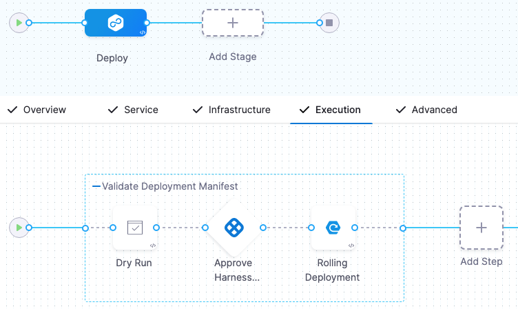

This topic discusses how to set up the Dry Run step for a Kubernetes deployment.

The Dry Run step fetches the Kubernetes manifests or Helm charts in a stage and performs a dry run of those resources. This is the same as running a `kubectl apply --filename=manifests.yaml --dry-run`.

You can use the Dry Run step to check your manifests before deployment. You can follow the step with an [Approval](/docs/category/approvals/) step to ensure the manifests are valid before deployment.

You can reference the resolved manifest from the Dry Run step in subsequent steps using a Harness variable expression.

```
<+pipeline.stages.[Stage_Id].spec.execution.steps.[Step_Id].k8s.manifestDryRun>
```

:::note

When Harness performs a deployment, it compiles all values YAML files and manifests in the stage as a single manifest and applies it. The Dry Run step performs the dry run using this compiled manifest.

:::

## Limitations

The Dry Run step's resolved manifests are stored in the Harness cloud. There is a storage limit of 5MB per Dry Run step execution.


## Add the Dry Run step

You add the Dry Run step before the deployment step(s) in your stage (such as the Apply, Rolling, Canary, Blue Green deployment steps). 

You can add an [Approval](/docs/category/approvals/) step after the Dry Run step to have a Harness user(s) validate the manifest output before deployment.

For example, here is a stage with a Dry Run step followed by an Approval step and subsequent Rolling Deployment step.



To add the Dry Run step, do the following:


import Tabs from '@theme/Tabs';
import TabItem from '@theme/TabItem';


<Tabs>
  <TabItem value="Visual" label="Visual" default>


1. In the CD stage **Execution**, select **Add Step**.
2. Select the **Dry Run** step.
3. Enter a name for the step.
4. In **Timeout**, enter how long this step should run before failing and initiating the step or stage [failure strategy](/docs/platform/pipelines/failure-handling/define-a-failure-strategy-on-stages-and-steps).

    You can use:

   - `w` for weeks.
   - `d` for days.
   - `h` for hours.
   - `m` for minutes.
   - `s` for seconds.
   - `ms` for milliseconds.

   The maximum is `53w`.

   Timeouts can be set at the pipeline-level also, in the pipeline **Advanced Options**.
5. Select **Apply Changes**.

The Dry Run step is ready.


</TabItem>
  <TabItem value="YAML" label="YAML">


1. In **Pipeline Studio**, select **YAML**.
2. Paste the following YAML example and select **Save**:

```
              - step:
                  type: K8sDryRun
                  name: Output Service Manifests
                  identifier: OutputService
                  spec: {}
                  timeout: 10m
```


</TabItem>
</Tabs>


## Step output example

When you run the pipeline, the output of the Dry Run step indicates that the manifest was applied as a dry run using `(dry run)`:

```Sh
Validating manifests with Dry Run
kubectl --kubeconfig=config apply --filename=manifests-dry-run.yaml --dry-run
namespace/dev created (dry run)
configmap/nginx-k8s-config created (dry run)
service/nginx-k8s-svc created (dry run)
deployment.apps/nginx-k8s-deployment created (dry run)

Done.
```

## Using the Dry Run step output in other steps

You can reference the resolved dry run manifest from the Dry Run step using this Harness expression:

```
<+pipeline.stages.[Stage_Id].spec.execution.steps.[Step_Id].k8s.manifestDryRun>
```

For example, if the stage Id is `Deploy` and the Dry Run step Id is `Dry_Run` the expression would be:

```
<+pipeline.stages.Deploy.spec.execution.steps.Dry_Run.k8s.manifestDryRun>
```

Another example is to use a Harness [Shell Script step](/docs/continuous-delivery/x-platform-cd-features/cd-steps/utilities/shell-script-step) to perform logic using `kubectl diff`:

```
cat << EOM > manifest.yaml
<+pipeline.stages.Deploy.spec.execution.steps.Dry_Run.k8s.manifestDryRun>
EOM
cat manifest.yaml
echo "K8s client/server version:"
kubectl version --output yaml
echo "K8s manifest diff:"
# kubectl diff exist codes: 0 - no diff, 1 - there is a diff, 2 - something is wrong
# Since exit code 1 is failure, make will always fail if there is a diff, so code modification required
kubectl -n <+env.variables.DEPLOY_ENV> diff -f manifest.yaml || (st=$?; if [ $st = 1 ]; then exit 0; else echo $st; exit $st; fi)
```

:::warning
If you do not quote the ('`EOM`'), any variables and commands within the block will be substituted.
:::


You can enter the expression in subsequent steps such as the [Shell Script step](/docs/continuous-delivery/x-platform-cd-features/cd-steps/utilities/shell-script-step) or [Approval](/docs/category/approvals/) steps.


## Dry Run steps and Skip Dry Run settings

The Apply, Rolling, Canary, and Blue Green deployment steps include a **Skip Dry Run** setting.


By default, Harness uses the `--dry-run` flag on the `kubectl apply` command for all these steps. If the **Skip Dry Run** setting is selected, Harness will not use the `--dry-run` flag.

The **Skip Dry Run** setting is different from the Dry Run step. The Dry Run step only performs a dry run. The Dry Run step does not impact whether or not a deployment step performs a dry run.


## Using the Dry Run with a Native Helm Deployment

When using the Dry Run step with a native Helm deployment, Harness will run a Helm template and render the manifests. In the  Dry Run step log you will see something like this:

```
KUBECONFIG=/opt/harness-delegate/repository/k8s/7d800125-18f7-3ad9-9db4-a32ec8876c3e/config /opt/harness-delegate/client-tools/helm/v3.12.0/helm template release-10b758 /opt/harness-delegate/repository/k8s/7d800125-18f7-3ad9-9db4-a32ec8876c3e/manifest-files/nginx-ingress-controller  --namespace dev  -f values-0.yaml
```

The above will run the Helm template against the manifests fetched. After running the Helm template, Harness will then perform the dry run on the templated and rendered manifest resources.

```
Validating manifests with Dry Run
kubectl --kubeconfig=config apply --filename=manifests-dry-run.yaml --dry-run=client
configmap/release-10b758-nginx-ingress-controller-default-backend created (dry run)
serviceaccount/release-10b758-nginx-ingress-controller created (dry run)
clusterrole.rbac.authorization.k8s.io/release-10b758-nginx-ingress-controller created (dry run)
clusterrolebinding.rbac.authorization.k8s.io/release-10b758-nginx-ingress-controller created (dry run)
role.rbac.authorization.k8s.io/release-10b758-nginx-ingress-controller created (dry run)
rolebinding.rbac.authorization.k8s.io/release-10b758-nginx-ingress-controller created (dry run)
service/release-10b758-nginx-ingress-controller created (dry run)
service/release-10b758-nginx-ingress-controller-default-backend created (dry run)
deployment.apps/release-10b758-nginx-ingress-controller created (dry run)
deployment.apps/release-10b758-nginx-ingress-controller-default-backend created (dry run)
ingressclass.networking.k8s.io/nginx created (dry run)
```


