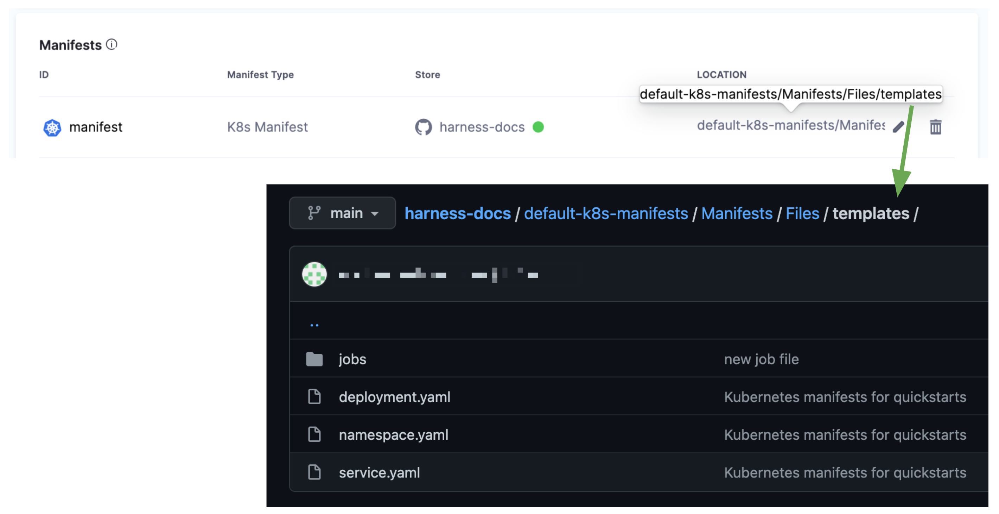
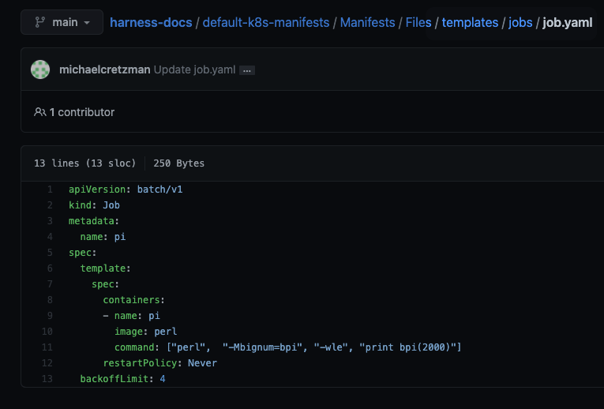
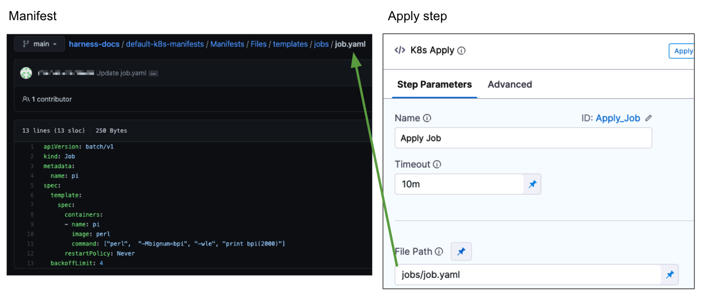

In this topic, we will show you how to execute a Job in a Harness Kubernetes deployment as part of the main deployment.

Kubernetes [Jobs](https://kubernetes.io/docs/concepts/workloads/controllers/jobs-run-to-completion/) create one or more pods to carry out commands. For example, a calculation or a backup operation.

In a Harness Kubernetes CD stage, you define Jobs in the Service **Manifests**. Next you add the **Apply** step to your Harness Workflow to execute the Job.

Typically, Jobs are not part of the main deployment. You can exclude them from the main deployment and simply call them at any point in the stage using the Apply step. For steps on ignoring the Job as part of the main deployment and executing it separately, see [Deploy Manifests Separately using Apply Step](/docs/continuous-delivery/deploy-srv-diff-platforms/kubernetes/kubernetes-executions/deploy-manifests-using-apply-step).

## Before you begin

* **​Kubernetes Jobs:** We assume you are familiar with [Kubernetes Jobs](https://kubernetes.io/docs/concepts/workloads/controllers/jobs-run-to-completion/).
* **Apply step:** The Harness Apply step allows you to deploy any resource you have set up in the Service **Manifests** section at any point in your stage. See [Deploy Manifests Separately using Apply Step](/docs/continuous-delivery/deploy-srv-diff-platforms/kubernetes/kubernetes-executions/deploy-manifests-using-apply-step).
* **Ignoring Manifests:** You can annotate a manifest to have Harness ignore it when performing its main deployment operations. Then you can use the Apply step to execute the manifest wherever you want to run it in the stage. See [Ignore a Manifest File During Deployment](/docs/continuous-delivery/deploy-srv-diff-platforms/kubernetes/cd-kubernetes-category/ignore-a-manifest-file-during-deployment).
* **Delete Jobs before rerunning deployments:** Once you've deployed the Job, you must delete it before deploying a Job of the same name to the same namespace.

## Apply step

CD stages include an **Apply** step that allows you to deploy *any resource* you have set up in the Service **Manifests** section.

For details on what you can deploy in different Harness deployment types, see [What Can I Deploy in Kubernetes?](/docs/continuous-delivery/deploy-srv-diff-platforms/kubernetes/cd-k8s-ref/what-can-i-deploy-in-kubernetes).

The Apply step can deploy *all workload types*, including Jobs in any deployment type.

You can add an Apply step anywhere in your Harness stage. This makes the Apply step useful for running Kubernetes Jobs.

Here are some Job examples:

* Run independent but related work items in parallel: sending emails, rendering frames, transcoding files, or scanning database keys.
* Create a new pod if the first pod fails or is deleted due to a node hardware failure or node reboot.
* Create a Job that cleans up the configuration of an environment, to create a fresh environment for deployment.
* Use a Job to spin down the replica count of a service, to save on cost.

Any workload deployed with the **Apply** step is not rolled back by Harness.**Delete Jobs before rerunning deployments:** Once you've deployed the Job, you must delete it before deploying a Job of the same name to the same namespace.### Step 1: Add Job Manifest

In a CD stage, click Service.

In **Manifests**, add your manifests as described in [Add Kubernetes Manifests](/docs/continuous-delivery/deploy-srv-diff-platforms/kubernetes/cd-kubernetes-category/define-kubernetes-manifests).

Include your Job manifest in the folder you specify in **Manifests**.

For example, here's a Manifests section that points to the **templates** folder.



In the templates folder, there is a folder named **jobs** and a **job.yaml** manifest.



## Define target cluster

Jobs do not require any changes to the way you specify the target cluster in Harness.

For steps on setting up the target cluster, see [Define Your Kubernetes Target Infrastructure](/docs/continuous-delivery/deploy-srv-diff-platforms/kubernetes/define-your-kubernetes-target-infrastructure).

## Add the Job to the execution using the Apply step

The Apply step can be used in any Kubernetes deployment strategy.

In the stage **Execution**, click **Add Step** wherever you want to deploy you Job.

In the **Apply Step**, in **File Path**, enter the path to the Job manifest relative to the path entered in the Service **Manifests** section.

For example, the path in **Manifests** is `default-k8s-manifests/Manifests/Files/templates` and the Job manifest is in the subfolder of `templates` named `jobs/job.yaml`.

In the **Apply Step**, in **File Path**, enter `jobs/job.yaml`.



## Skip dry run

By default, Harness uses the `--dry-run` flag on the kubectl apply command, which prints the object that would be sent to the cluster without really sending it.

If the **Skip Dry Run** option is selected, Harness will not use the `--dry-run` flag.

## Skip steady state check

If you select this option, Harness will not check that the workload (Job) has reached steady state.

## Deploy the Job

In your Pipeline, click **Save**, **Run**, and then **Run Pipeline**.

Let's look at the output of the execution.

In the execution, click the Apply step, and then click **Console View**.

In **Fetch Files**, you'll see that Harness successfully fetched the job.yaml:


```
...  
Successfully fetched following files:  
- configmaps/configmap.yaml  
- service.yaml  
- jobs/job.yaml  
- namespace.yaml  
- deployment.yaml  
...
```

In **Initialize**, you can see Harness render the manifest and perform a dry run:


```
Initializing..  
Release Name: [release-b6f492c6530a10cd8fd1792890fc42e05641051b]  
Found following files to be applied in the state  
- jobs/job.yaml  
  
Rendering manifest files using go template  
Only manifest files with [.yaml] or [.yml] extension will be processed  
  
Manifests [Post template rendering] :  
---  
apiVersion: batch/v1  
kind: Job  
metadata:  
  name: pi  
spec:  
  template:  
    spec:  
      containers:  
      - name: pi  
        image: perl  
        command: ["perl",  "-Mbignum=bpi", "-wle", "print bpi(2000)"]  
      restartPolicy: Never  
  backoffLimit: 4  
  
Validating manifests with Dry Run  
kubectl --kubeconfig=config apply --filename=manifests-dry-run.yaml --dry-run  
job.batch/pi created (dry run)  
  
Done.
```

In **Prepare**, you can see Harness process the manifest before applying it:


```
Manifests processed. Found following resources:   
  
Kind                Name                                    Versioned   
Job                 pi                                      false  
```

In **Apply**, you can see the `kubectl apply`:


```
kubectl --kubeconfig=config apply --filename=manifests.yaml --record  
job.batch/pi created  
  
Done.
```

In **Wait for Steady State**, you can see Harness wait for the Job to reach steady state. In Harness, this is a [managed workload](/docs/continuous-delivery/deploy-srv-diff-platforms/kubernetes/cd-k8s-ref/what-can-i-deploy-in-kubernetes) because Harness verifies it has reached steady state and fails the Pipeline if it does not.


```
kubectl --kubeconfig=config get events --namespace=default --output=custom-columns=KIND:involvedObject.kind,NAME:.involvedObject.name,NAMESPACE:.involvedObject.namespace,MESSAGE:.message,REASON:.reason --watch-only  
kubectl --kubeconfig=config get jobs pi --namespace=default --output=jsonpath='{.status}'  
  
Status : pi   'map[]'  
Event  : pi   Job    pi     default     Created pod: pi-xfshh   SuccessfulCreate  
Event  : pi   Pod   pi-xfshh   default   Successfully assigned default/pi-xfshh to gke-doc-account-default-pool-d910b20f-25cj   Scheduled  
Event  : pi   Pod   pi-xfshh   default   Pulling image "perl"   Pulling  
  
Status : pi   'map[startTime:2021-09-30T22:51:33Z active:1]'  
  
Status : pi   'map[startTime:2021-09-30T22:51:33Z active:1]'  
Event  : pi   Pod   pi-xfshh   default   Successfully pulled image "perl" in 12.344900106s   Pulled  
  
Status : pi   'map[active:1 startTime:2021-09-30T22:51:33Z]'  
  
Status : pi   'map[startTime:2021-09-30T22:51:33Z active:1]'  
Event  : pi   Pod   pi-xfshh   default   Created container pi   Created  
Event  : pi   Pod   pi-xfshh   default   Started container pi   Started  
  
Status : pi   'map[startTime:2021-09-30T22:51:33Z active:1]'  
Event  : pi   Job   pi    default   Job completed   Completed  
  
Status : pi   'map[conditions:[map[type:Complete status:True lastProbeTime:2021-09-30T22:52:04Z lastTransitionTime:2021-09-30T22:52:04Z]] startTime:2021-09-30T22:51:33Z completionTime:2021-09-30T22:52:04Z succeeded:1]'
```

## Showing Job output

To view Job output after the Apply step, you can use a simple script in a Shell Script step:


```
echo  
  
pods=$(kubectl get pods -n <+infra.namespace> --selector=job-name=my-job --output=jsonpath='{.items[*].metadata.name}')  
  
kubectl logs -n <+infra.namespace> $pods  
  
echo
```
In the case of the Job used in this topic, the output will be π to 2000 places:


```
Console View  
Executing command ...  
3.1415926535897932384626433832795028841971693993751058209749445923078164062862089986280348253421170679821480865132823066470938446095505822317253594081284811174502841027019385211055596446229489549303819644288109756659334461284756482337867831652712019091456485669234603486104543266482133936072602491412737245870066063155881748815209209628292540917153643678925903600113305305488204665213841469519415116094330572703657595919530921861173819326117931051185480744623799627495673518857527248912279381830119491298336733624406566430860213949463952247371907021798609437027705392171762931767523846748184676694051320005681271452635608277857713427577896091736371787214684409012249534301465495853710507922796892589235420199561121290219608640344181598136297747713099605187072113499999983729780499510597317328160963185950244594553469083026425223082533446850352619311881710100031378387528865875332083814206171776691473035982534904287554687311595628638823537875937519577818577805321712268066130019278766111959092164201989380952572010654858632788659361533818279682303019520353018529689957736225994138912497217752834791315155748572424541506959508295331168617278558890750983817546374649393192550604009277016711390098488240128583616035637076601047101819429555961989467678374494482553797747268471040475346462080466842590694912933136770289891521047521620569660240580381501935112533824300355876402474964732639141992726042699227967823547816360093417216412199245863150302861829745557067498385054945885869269956909272107975093029553211653449872027559602364806654991198818347977535663698074265425278625518184175746728909777727938000816470600161452491921732172147723501414419735685481613611573525521334757418494684385233239073941433345477624168625189835694855620992192221842725502542568876717904946016534668049886272327917860857843838279679766814541009538837863609506800642251252051173929848960841284886269456042419652850222106611863067442786220391949450471237137869609563643719172874677646575739624138908658326459958133904780275901  
Command completed with ExitCode (0)
```

If you need to show the logs during job execution rather than after the Apply step, then modify the script and run the step in parallel with Apply.

Alternatively, if you have your cluster logs going to a log service you can generate a URL to that system that shows the job logs in parallel as well.

## Summary

Using the Apply step, you are able to configure, manage, and deploy a Kubernetes Job.

