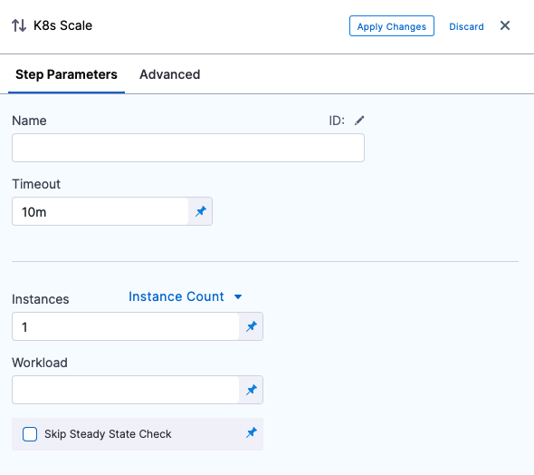
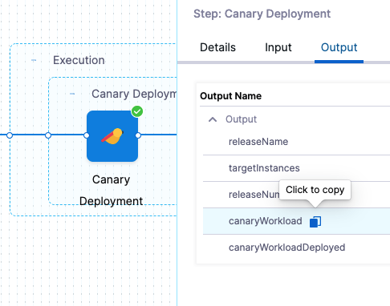

This topic describes how to update the number of Kubernetes pods running.

When you deploy a Kubernetes workload using Harness, the number of pods you want is set in your manifests and in the deployment steps.

With the **Scale** step, you can scale this number of running pods up or down by count or percentage.

## Before you begin

* [Kubernetes CD Quickstart](/docs/continuous-delivery/deploy-srv-diff-platforms/kubernetes/kubernetes-cd-quickstart)

## Add Scale step

In your Harness stage, in Execution, click **Add Step**, and select **K8s** **Scale**. The **K8s Scale** settings appear.

Name the step and then provide the scaling strategy, described below.

## Pick count or percentage

The **K8s Scale** step updates the number of instances running, either by count or percentage.

In **Instances**, select **Instance Count** or **% Percentage**.

* **Instance Count**: The number is simply the number of pods.
* **Percentage**: A percentage of the pods defined in your Harness Service **Manifests** files.

## Set the number of pods

In **Instances**, enter the number of pods to scale up or down compared to the number of instances specified *before* the **K8s Scale** step.

The number may come from the manifest in Service or a previous step, whichever set the number of pods right before the **K8s Scale** step.

For example, in you have `replicas: 4` in a manifest, and you enter **50** **PERCENT** in **Instances**, then 2 pods are deployed in this step.

If you have an odd number of instances, such as 3 instances, and then enter 50% in **K8s Scale**, the number of instances is scaled down to 2.### Step 4: Specify Resources to Scale

In **Workload**, enter the name of the resource in the format `[namespace/]Kind/Name`, with `namespace` optional. For example: 

`my-namespace/Deployment/harness-example-deployment-canary`

You can scale Deployment, DaemonSet, or StatefulSet.

You can only enter one resource in **Workload**. To scale another resource, add another **K8s Scale** step.

In **Workload**, you can use a Harness expression for the output of another step, like the **K8s Canary** step, in **Workload**. 

For example, here is a deployed Canary step where you can copy the workload expression:

The expression will look something like this:

`<+pipeline.stages.Canary.spec.execution.steps.canaryDepoyment.steps.canaryDeployment.output.canaryWorkload>`

Enter that expression in **Workload** and Harness will scale that workload.

## Notes

* You can scale down to **0** to remove all instances.

## Next Steps

* [Delete Kubernetes Resources](/docs/continuous-delivery/deploy-srv-diff-platforms/kubernetes/kubernetes-executions/delete-kubernetes-resources)
* [Canary Delete Step](/docs/continuous-delivery/deploy-srv-diff-platforms/kubernetes/cd-k8s-ref/kubernetes-canary-delete-step)

