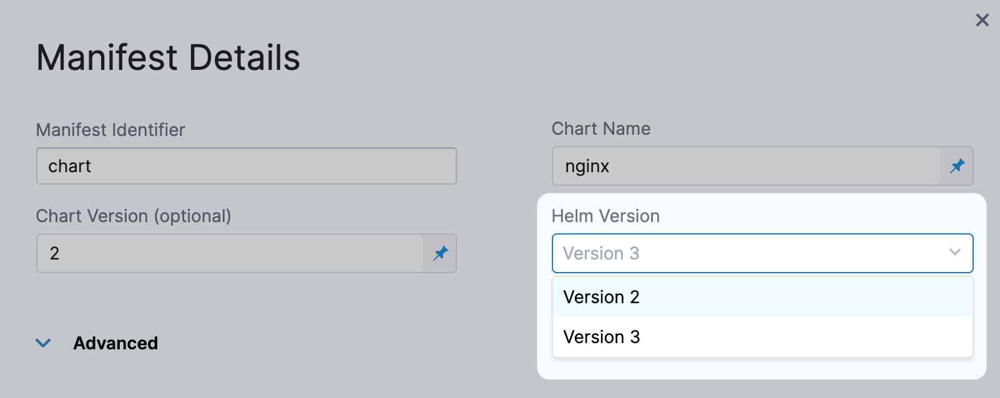

This article addresses some frequently asked questions about Kubernetes deployments in Harness.

### What is a Harness Kubernetes deployment?

Harness takes the artifacts and Kubernetes manifests you provide and deploys them to the target Kubernetes cluster. You can simply deploy Kubernetes objects via manifests and you can provide manifests using remote sources and Helm charts.

See the [Kubernetes deployment tutorial](/docs/continuous-delivery/deploy-srv-diff-platforms/kubernetes/kubernetes-cd-quickstart) and [Kubernetes deployments overview](/docs/continuous-delivery/deploy-srv-diff-platforms/kubernetes/kubernetes-deployments-overview).

For detailed instructions on using Kubernetes in Harness, see the [Kubernetes how-tos](/docs/category/kubernetes).

### What workloads can Harness deploy in a Kubernetes cluster?

See [What can I deploy in Kubernetes?](/docs/continuous-delivery/deploy-srv-diff-platforms/kubernetes/cd-k8s-ref/what-can-i-deploy-in-kubernetes).

### Does Harness support everything in Kubernetes?

Yes. Any standard Kubernetes features in your Kubernetes manifests will be deployed.

Harness tracks deployment status to ensure pods reach steady state before considering the deployment successful, but other, even unrelated Kubernetes features, are supported. For example, liveness, readiness, and startup probes are supported.

### For Kubernetes, does Harness count only pods as a service instance (SI)? What about a ConfigMap or a Secret?

Only pods. Only pods will consume SI licenses. ConfigMaps and Secrets do not consume SI licenses.

### How is Harness sure that a pod is a service instance?

Harness tracks the workloads it deploys. Harness checks every 10 minutes using the Kubernetes API to see how many pods are currently running for the given workload.

### If I create a pod using Harness and keep managing it, is it still counted as a service instance?

Yes. Sidecar containers within pods (log proxy, service mesh proxy) do not consume SI licenses. Harness licenses by pod, not the number of containers in a pod.

### Does Harness support OpenShift?

Yes. Harness supports [DeploymentConfig](https://docs.openshift.com/container-platform/4.1/applications/deployments/what-deployments-are.html), [Route](https://docs.openshift.com/enterprise/3.0/architecture/core_concepts/routes.html), and [ImageStream](https://docs.openshift.com/enterprise/3.2/architecture/core_concepts/builds_and_image_streams.html#image-streams) across Canary, Blue Green, and Rolling deployment strategies. Please use `apiVersion: apps.openshift.io/v1` and not `apiVersion: v1`.

You can leverage Kubernetes list objects as needed without modifying your YAML for Harness.

When you deploy, Harness will render the lists and show all the templated and rendered values in the log.

Harness supports:

* List
* NamespaceList
* ServiceList
* For Kubernetes deployments, these objects are supported for all deployment strategies (canary, rolling, blue/green).

If you run `kubectl api-resources` you should see a list of resources, and `kubectl explain` will work with any of these.

### Can I use Helm?

Yes. Harness Kubernetes deployments support Helm v2 and v3.

Harness supports Helm charts in its Kubernetes implementation.

Harness Kubernetes deployments allow you to use your own Kubernetes manifests or a Helm chart, and Harness executes the Kubernetes API calls to build everything without Helm and Tiller needing to be installed in the target cluster.

Harness Kubernetes deployments also support all deployment strategies (canary, blue/green, rolling, and so on).

### Should I use Kubernetes or Native Helm?

Harness includes both Kubernetes and Helm deployments, and you can use Helm charts in both. Here's the difference:

* Harness [Kubernetes deployments](/docs/continuous-delivery/deploy-srv-diff-platforms/kubernetes/kubernetes-cd-quickstart) allow you to use your own Kubernetes manifests or a Helm chart (remote or local), and Harness executes the Kubernetes API calls to build everything without Helm and Tiller needing to be installed in the target cluster.  
Harness Kubernetes deployments also support all deployment strategies (canary, blue/green, rolling, and so on).
* For Harness [Native Helm deployments](/docs/continuous-delivery/deploy-srv-diff-platforms/helm/native-helm-quickstart), you must always have Helm and Tiller (for Helm v2) running on one pod in your target cluster. Tiller makes the API calls to Kubernetes in these cases. You can perform a Rolling deployment strategy only (no canary or blue/green). For Harness Native Helm v3 deployments, you no longer need Tiller, but you are still limited to the Rolling deployment strategy.
	+ **Versioning:** Harness Kubernetes deployments version all objects, such as ConfigMaps and secrets. Native Helm does not.
	+ **Rollback:** Harness Kubernetes deployments will roll back to the last successful version. Native Helm will not. If you did two bad Native Helm deployments, the second one will roll back to the first. Harness will roll back to the last successful version.

### Can I deploy Helm charts without adding an artifact source to Harness?

Yes.

Harness Kubernetes deployments using Helm charts can involve adding your artifact (image) to Harness in addition to your chart. The chart refers to the artifact you added to Harness (through its values.yaml file). During deployment, Harness deploys the artifact you added to Harness and uses the chart to manage it.

In addition to this method, you can also deploy the Helm chart without adding your artifact to Harness. Instead, the Helm chart identifies the artifact. Harness installs the chart, gets the artifact from the repo, and then installs the artifact. We call this a *Helm chart deployment*.

See [Deploy helm charts](/docs/continuous-delivery/deploy-srv-diff-platforms/helm/deploy-helm-charts).

### Can I run Kubernetes jobs?

Yes. In Harness Kubernetes deployments, you define jobs in the Harness Service **Manifests**. Next you add the Apply step to your Harness workflow to execute the job.

See [Run Kubernetes jobs](/docs/continuous-delivery/deploy-srv-diff-platforms/kubernetes/kubernetes-executions/run-kubernetes-jobs).

### Can I deploy a Kubernetes resources using CRDs?

Yes. Harness supports all Kubernetes default resources, such as pods, deployments, StatefulSets, DaemonSets, etc. For these resources, Harness supports steady state checking, versioning, displays instances on Harness dashboards, performs rollback, and other enterprise features.

In addition, Harness provides many of the same features for Kubernetes [custom resource](https://kubernetes.io/docs/tasks/extend-kubernetes/custom-resources/custom-resource-definitions/) deployments using Custom Resource Definitions (CRDs). CRDs are resources you create that extend the Kubernetes API to support your application.

:::note 
Harness supports CRDs for both Kubernetes and OpenShift. There is no difference in their custom resource implementation.
:::

### Can I deploy resources outside of the main Kubernetes workload?

Yes. By default, the Harness Kubernetes workflow will deploy all of the resources you have set up in the Service **Manifests** section.

In some cases, you might have resources that you do not want to deploy as part of the main workflow deployment, but want to apply as another step in the workflow. For example, you might want to deploy an additional resource only after Harness has verified the deployment of the main resources in the Service **Manifests** section.

workflows include an **Apply** step that allows you to deploy any resource you have set up in the Service **Manifests** section.

See [Deploy manifests separately using the Apply step](/docs/continuous-delivery/deploy-srv-diff-platforms/kubernetes/kubernetes-executions/deploy-manifests-using-apply-step).

### Can I ignore a manifest during deployment?

You might have manifest files for resources that you do not want to deploy as part of the main deployment.

Instead, you tell Harness to ignore these files and then apply them separately using the Harness [Kubernetes Apply step](/docs/continuous-delivery/deploy-srv-diff-platforms/kubernetes/cd-k8s-ref/kubernetes-apply-step).

Or you can simply ignore them until you wish to deploy them as part of the main deployment.

See [Ignore a manifest file during deployment](/docs/continuous-delivery/deploy-srv-diff-platforms/kubernetes/cd-kubernetes-category/ignore-a-manifest-file-during-deployment).

### Can I pull an image from a private registry?

Typically, If the Docker artifact source is in a private registry, Harness has access to that registry using the credentials set up in the Harness [Artifact connector](/docs/platform/connectors/artifact-repositories/connect-to-an-artifact-repo).

If some cases, your Kubernetes cluster might not have the permissions needed to access a private Docker registry. For these cases, the values.yaml file added in the Service **Manifests** section must contain `dockercfg: <+artifact.imagePullSecret>` . This key will import the credentials from the Docker credentials file in the artifact.

See [Pull an image from a private registry for Kubernetes](/docs/continuous-delivery/deploy-srv-diff-platforms/kubernetes/cd-kubernetes-category/pull-an-image-from-a-private-registry-for-kubernetes).

### Can I use remote sources for my manifests?

You can use your Git repo for the configuration files in **Manifests** and Harness uses them at runtime. You have the following options for remote files:

* **Kubernetes Specs in YAML format** - These files are simply the YAML manifest files stored on a remote Git repo. See [Add Kubernetes manifests](/docs/continuous-delivery/deploy-srv-diff-platforms/kubernetes/cd-kubernetes-category/define-kubernetes-manifests).
* **Helm Chart from Helm Repository** - Helm charts files stored in standard Helm syntax in YAML on a remote Helm repo. See [Helm chart deployment tutorial](/docs/continuous-delivery/deploy-srv-diff-platforms/helm/helm-cd-quickstart).
* **Kustomization Configuration** — kustomization.yaml files stored on a remote Git repo. See [Kustomize deployment tutorial](/docs/continuous-delivery/deploy-srv-diff-platforms/kustomize/kustomize-quickstart).
* **OpenShift Template** — OpenShift params file from a Git repo.

:::note 
Remote files can also use Go templating.
:::

### Do you support Go templating for Kubernetes manifests?

Yes. you can use [Go templating](https://godoc.org/text/template) and Harness built-in variables in combination in your **Manifests** files.

See [Example Kubernetes manifests using Go templating](/docs/continuous-delivery/deploy-srv-diff-platforms/kubernetes/cd-k8s-ref/example-kubernetes-manifests-using-go-templating).

### Can I provision Kubernetes infrastructure?

Yes, you can use:

- [Terraform](/docs/continuous-delivery/cd-infrastructure/terraform-infra/terraform-provisioning-with-harness)
- [Terragrunt](/docs/continuous-delivery/cd-infrastructure/terragrunt-howtos)
- Azure ARM and Blueprint
- [AWS CloudFormation](/docs/continuous-delivery/cd-infrastructure/cloudformation-infra/cloud-formation-how-tos)
- Shell script (custom)

### What deployment strategies can I use with Kubernetes?

You can use canary, rolling, and blue/green. See:

* [Create a Kubernetes canary deployment](/docs/continuous-delivery/deploy-srv-diff-platforms/kubernetes/kubernetes-executions/create-a-kubernetes-canary-deployment)
* [Create a Kubernetes rolling deployment](/docs/continuous-delivery/deploy-srv-diff-platforms/kubernetes/kubernetes-executions/create-a-kubernetes-rolling-deployment)
* [Create a Kubernetes blue/green deployment](/docs/continuous-delivery/deploy-srv-diff-platforms/kubernetes/kubernetes-executions/create-a-kubernetes-blue-green-deployment)

### Can I select namespaces during deployment?

Yes. You can select namespaces on the fly using Harness variables that are evaluated at runtime.

### Do you support Kustomize?

Yes. Harness supports [Kustomize](https://kustomize.io/) kustomizations in your Kubernetes deployments. You can use overlays, multibase, plugins, sealed secrets, and so on, just as you would in any native kustomization.

See [Kustomize deployment tutorial](/docs/continuous-delivery/deploy-srv-diff-platforms/kustomize/kustomize-quickstart).

### Can I use Ingress traffic routing?

Yes. You can route traffic using the Ingress rules defined in your Harness Kubernetes manifests.

### Can I scale my pods up and down?

Yes. When you deploy a Kubernetes workload using Harness, you set the number of pods you want in your manifests and in the deployment steps.

With the Scale step, you can scale this number of running pods up or down, by count or percentage.

See [Scale Kubernetes pods](/docs/continuous-delivery/deploy-srv-diff-platforms/kubernetes/kubernetes-executions/scale-kubernetes-replicas).


### Can I prune resources?

Yes. You can manually delete Kubernetes resources using the [Delete](/docs/continuous-delivery/deploy-srv-diff-platforms/kubernetes/kubernetes-executions/delete-kubernetes-resources) step, but you can also set Harness to perform resource pruning during deployment using the **Enable Kubernetes Pruning** setting in the **Rolling Deployment** and **Stage Deployment** (used in blue green deployments) steps.


### How do I delete Kubernetes resources?

Harness includes a Delegate step to remove any deployed Kubernetes resources.

See [Delete Kubernetes resources](/docs/continuous-delivery/deploy-srv-diff-platforms/kubernetes/kubernetes-executions/delete-kubernetes-resources).

### Can I use Helm 3 with Kubernetes?

Yes. You can use Helm 3 charts.

You can select Helm 3 when you create the service, or upgrade Helm 2 to Helm 3.



See [Deploy Helm charts](/docs/continuous-delivery/deploy-srv-diff-platforms/helm/deploy-helm-charts).

### Can I use Helm Chart Hooks in Kubernetes deployments?

Yes. You can use [Helm chart hooks](https://helm.sh/docs/topics/charts_hooks/) in your Kubernetes deployments to intervene at specific points in a release cycle.

You use a Harness Kubernetes Canary or Blue Green deployment and apply the hooks flexibly with the Apply step.

A Harness Kubernetes deployment runs `kubectl apply` for manifest files. There is no Tiller involved in this process because Harness is not running any Helm commands.

### Can you tell me which specific authentication flows are supported for OIDC authentication to Kubernetes? Or, are you saying that Harness only supports the Okta identity provider and not any OIDC provider? Also, for authenticating to Kubernetes, I'm assuming based on the UI prompt for client Id and client secret that it should be a Client Credential authentication flow, and that makes sense for system to system authentication.

Currently, Harness supports only [OAuth 2.0 Password Grant Type](https://oauth.net/2/grant-types/password/) password authentication flow. 

`client_id` and `client_secret` are required for the [RFC 6749: The OAuth 2.0 Authorization Framework](https://datatracker.ietf.org/doc/html/rfc6749#section-2.3.1) password authentication flow.


### How do I save the dry-run step rendered manifest?

You can view the dry-run manifest as an output variable of the step.

### I'm getting "Secret in version "v1" cannot be handled as a Secret: illegal base64 data at input byte".  What does it mean?

Kubernetes secrets need to be encoded with base64.  If the encoding is wrong you might get this error.  If you're creating a Kubernetes secrets and it's not base64 encoded, then you can use stringData instead. For more information, go to [Constraints on Secret names and data](https://kubernetes.io/docs/concepts/configuration/secret/#restriction-names-data).

### Can I encrypt the Token/Secret passed in the INIT_SCRIPT?

It cannot be encrypted directly but this can be achieved by creating the k8s secret for the credentials and referring them in the init script.

**example** -

``` aws_access_key=kubectl get secrets/pl-credentials --template={{.data.aws_access_key}} | base64 -d```
```aws_secret_key= kubectl get secrets/pl-credentials --template={{.data.aws_secret_key}} | base64 -d```

Another approach would be saving the value in Harness's secret manager/any other secret manager and referencing it in the script.
Check for more info in [Documentation](https://developer.harness.io/docs/platform/secrets/add-use-text-secrets).

### How does Harness retrieve the events in the Wait for Steady State phase in the Kubernetes Rollout Deployment step?

During the "Wait for Steady State" phase, Harness uses the ```kubectl rollout status``` command to retrieve information directly from the Kubernetes API server. Harness continuously polls the Kubernetes API server while a rollout is in progress, ensuring that it remains updated until the rollout is either completed or encounters an error.

### When migrating from FirstGen to NextGen, will the release number of ConfigMaps and Secrets stored in a Kubernetes cluster be reset to 1?

In the case of migrating from Harness FirstGen to Harness NextGen, the numbering of `ConfigMaps` and `Secrets` in Kubernetes will not be automatically reset to start from 1 again. The numbering is based on the release history and is incremented based on the latest release number.

When you migrate your application to Harness NextGen and continue to use the same release name as before, the versioning will not be reset. Harness will fetch the `ConfigMap` in the cluster that stores all the Harness releases with their respective numbers. It will retrieve the latest release number from the `ConfigMap` and increment it by 1 for the next deployment. If versioning is enabled, Harness will append `-<release-number>` to each `ConfigMap`/`Secret` declared in the manifest.

Therefore, if you migrate to Harness NextGen and use the same cluster and release name, the release number will not break. The numbering will continue based on the existing release history.

It's important to note that Harness provides a declarative rollback feature, which eliminates the need for resource versioning. This means that even if you don't maintain the numbering scheme, you can still perform rollbacks effectively using the declarative rollback feature provided by Harness.

For more information, go to [Harness Declarative Rollback](https://developer.harness.io/docs/continuous-delivery/deploy-srv-diff-platforms/kubernetes/cd-k8s-ref/kubernetes-rollback/#declarative-rollback).


### If I delete an infrastructure definition after deployments are done to it, what are the implications other than potential dashboard data loss for those deployments?

At the moment there is no dependency on the instance sync and infrastructure definition. Infrastructure definition is used only to generate infrastructure details. The instance sync is done for service and environment. Only in case if any these are deleted, the instance sync will stop and delete instances.

:::info

If you are using the default release name format in Harness FirstGen as `release-${infra.kubernetes.infraId}`, it's important to note that when migrating to Harness NextGen, you will need to replace `${infra.kubernetes.infraId}` with the new expression. In Harness NextGen, a similar expression `<+INFRA_KEY>` is available for defining release names. However, it's crucial to understand that these expressions will resolve to completely different values compared to the expressions used in Harness FirstGen.

:::


### Error when the release name in a infrastructure definition is too long for a Kubernetes deployment.

In the deployment logs in Harness, you may get an error similar to this:

```
6m11s Warning FailedCreate statefulset/release-xxx-xxx create Pod release-xxx-xxx-0 in StatefulSet release-xxx-xxx failed error: Pod "release-xxx-xxx-0" is invalid: metadata.labels: Invalid value: "release-xxx-xxx-xxx": must be no more than 63 characters
```

This is an error coming from the kubernetes cluster stating that the release name is too long.  This can be adjusted in the Environments section.
1. Select the environment in question.
2. Select infrastructure definitions, and select the name of the infrastructure definition.
3. Scroll down and expand **Advanced**, and then modify the release name to be something shorter.


### How Kubernetes pruning option work during the deployment?

If you have enabled the Kubernetes pruning in your deployment, it will remove any resources that were present in old manifests that are no longer present in the manifest used for the current deployment.

For more details, go to [Prune Kubernetes resources](https://developer.harness.io/docs/continuous-delivery/deploy-srv-diff-platforms/kubernetes/cd-kubernetes-category/prune-kubernetes-resources/).


### Is on-demand token generation valid for both Vault's Kubernetes auth type and app role-based auth?

No, on-demand token generation is only valid for app role-based auth.


### Is there a configuration option to preserve more than two older release secrets and config maps in Kubernetes deployments?

No. Currently, there is no configurable option to increase the number of older release secrets and config maps that can be preserved. The number of stored releases are fixed.


### How is the release history stored for Kubernetes deployments?

If declarative rollback is used, the release history is stored in secrets. Otherwise, it is stored in a single config map or secret.


### Can I override some values in the Helm chart during the deployment of a service in Kubernetes?

Yes, you can override values in the Helm chart during the service deployment in Kubernetes.


### In the declarative rollback, it will rollback also the secrets and config maps used in the last successful execution and can we retain more than 2 older release secrets and config maps?

During rollback, Harness reapplies the previous manifest. This is the declarative method, and it includes the ConfigMap and Secrets of the last known good state. Harness uses a fixed limit of 2 in its release history cleanup logic. This value cannot be changed. 
For more details, go to [Documentation](https://developer.harness.io/docs/continuous-delivery/deploy-srv-diff-platforms/kubernetes/cd-k8s-ref/kubernetes-rollback/#important-notes).


### How do I add annotations to Canary deployments?

Annotations can be added to canary deployment by following either of these methods:

1. Use apply step to create the canary ingress rule. We do support additional values.yaml override with apply step and this can be used for shifting the traffic, for example:
   1. Create ingress template/ingress-canary:
      ```
      nginx.ingress.kubernetes.io/canary: true nginx.ingress.kubernetes.io/canary-by-header: always nginx.ingress.kubernetes.io/canary-by-header-value: x-checkout-canary nginx.ingress.kubernetes.io/canary-weight: {{.Values.weight}} ```
 
   2. Using apply step, apply templates/ingress-canary with values.yaml content:
      ```weight: 10```
 
   3. To progress, using apply step, apply template/ingress-canary with values.yaml content:
      ```weight: n```

2. If weight is a constant value and having a loose ingress resource is not an issue then  declare both primary and canary ingress in the manifest that will be applied during both canary and primary deployment. Since there wouldn’t be any changes to the ingress rules itself then there shouldn’t be any effect if they are going to reapply canary ingress in the primary deployment.

Our recommendation is to use the first option. Harness doesn’t track ingress rules, so by using the Apply step, you don’t lose anything.


### How do I delete Kubernetes resources that are part of a release?

During deployment, Harness creates a ConfigMap listing the resources of the release and uses the release name for tracking them. The release name is defined in the Infrastructure settings, in Cluster Details, in Advanced.
 
If this config map is deleted or if the resource is not deployed via Harness then we delete step won't be able to find the given resources.


### How can we deploy a specific resource in a Helm chart as part of rolling deployment?

If it is a Kubernetes/Helm, you can use an Apply Step
 
Please refer more on this in [Documentation](https://developer.harness.io/docs/continuous-delivery/deploy-srv-diff-platforms/kubernetes/kubernetes-executions/deploy-manifests-using-apply-step/).
 
You can take a specific file from the manifest and execute it separately (before or after) the normal deployment.  To prevent the file from being included in the normal part of the deployment, you would include this ```# harness.io/skip-file-for-deploy``` at the top of the file.


### If declarative rollback is enabled, will it rollback Secrets and ConfigMaps or should I enable versioning?

No, Versioning is not done when declarative rollback is enabled. Please refer more on this in following [Documentation](https://developer.harness.io/docs/continuous-delivery/deploy-srv-diff-platforms/kubernetes/cd-k8s-ref/kubernetes-releases-and-versioning/)


###  Do we have the export manifests option in Next Gen like we have in First Gen?

No, we have a dry-run step, that will export manifest for customer to use in other steps, but there is no option to inherit manifest. Please refer more on this in the following [Documentation](https://developer.harness.io/docs/continuous-delivery/deploy-srv-diff-platforms/kubernetes/kubernetes-executions/k8s-dry-run/).

### How do I save the dry-run step rendered manifest?

You can view the dry-run manifest as an output variable of the step.

### If I have two deploy stages in a pipeline, is it possible for me to rollback the stage 1 deployment if the stage 2 tests returned errors?

We do have a pipeline rollback feature that is behind a feature flag. This might work better as you would be able to have both stages separate, with different steps, as you did before, but a failure in the test job stage could roll back both stages.
 
[Documentation](https://developer.harness.io/docs/platform/pipelines/failure-handling/define-a-failure-strategy-for-pipelines)
  
Also, for the kubernetes job, if you use the Apply step instead of Rollout then the step will wait for the job to complete before proceeding, and you would not need the wait step.

### What are the benefits of using Kustomize manifest with Harness Next-Gen for Kubernetes deployments?

Using Kustomize with Harness simplifies the management of Kubernetes manifests by providing a declarative and version-controlled approach to customizations. It ensures consistency across environments and simplifies the deployment process.


### How do I dynamically load values.yaml per environment?

Many of Harness's fields allow you to switch from a static field to an expression field. In your Helm chart/kubernetes manifests declaration, you can switch the values field to an expression field and use an expression like `<+env.name>-values.yaml`. Then, in your repository, create a value per environment.


### What annotations can be applied in Harness for Kubernetes resources?

Harness provides several annotations that can be applied to Kubernetes resources. Here are the annotations and their purposes:

1. `harness.io/skip-versioning: "true"`:
   - Purpose: Use this annotation when versioning of a resource is not required. Harness stores this information in a ConfigMap in your Kubernetes cluster.
   - Reference: [Kubernetes Versioning and Annotations](https://developer.harness.io/docs/continuous-delivery/deploy-srv-diff-platforms/kubernetes/cd-k8s-ref/kubernetes-annotations-and-labels/)

2. `harness.io/direct-apply: "true"|"false"`:
   - Purpose: Set this annotation to "true" to make a manifest an unmanaged workload. This is useful for scenarios like Canary and Blue-Green deployments where you want to deploy additional workloads as unmanaged.
   - Reference: [What can I deploy in Kubernetes?](https://developer.harness.io/docs/continuous-delivery/deploy-srv-diff-platforms/kubernetes/cd-k8s-ref/what-can-i-deploy-in-kubernetes/)

3. `annotations: harness.io/primary-service: "true"` and `annotations: harness.io/stage-service: "true"`:
   - Purpose: Use these annotations when you have multiple services, and Harness needs to identify the primary service. These annotations are commonly used in Blue-Green Deployments.
   - Reference: [Create a Kubernetes Blue-Green deployment](https://developer.harness.io/docs/continuous-delivery/deploy-srv-diff-platforms/kubernetes/kubernetes-executions/create-a-kubernetes-blue-green-deployment/)

4. `harness.io/skipPruning: "true"`:
   - Purpose: Apply this annotation to ensure that a resource is not pruned. This is typically used for resources deployed by Harness to prevent accidental removal.
   - Reference: [Prune Kubernetes resources](https://developer.harness.io/docs/continuous-delivery/deploy-srv-diff-platforms/kubernetes/cd-kubernetes-category/prune-kubernetes-resources/)

These annotations help customize and control how Harness manages and deploys resources in your Kubernetes environment.


### Can customer control **Skip Harness label selector** or they need to be simply added for Kubernetes deployment types? 

No, Harness will automatically change behavior.
The expected behavior is as follows: In the scenario where a canary deployment is initially performed and subsequently switched to a rolling deployment for the same service and manifest, users will no longer encounter the selector error.
Please refer more on this in the following [Documentation](https://developer.harness.io/docs/continuous-delivery/deploy-srv-diff-platforms/kubernetes/cd-kubernetes-category/skip-harness-label-selector-tracking-on-kubernetes-deployments/)


### Is there a way to get Canary Deployments to deploy resources that aren't Kubernetes Deployments?

No. The above feature on to manage cronjobs in next-gen is yet to come.


### Kubernetes deployment is failing with the error, "Invalid request: Failed to get namespace/ConfigMap/release-releaseid"?

Looks like while trying to fetch the release ConfigMap the command is failing try running the command directly to see the behavior on the delegate host.

```
kubectl get pods -n namespace
kubectl describe configmaps release-releaseid
```

### What is one possible reason for implementing a delegate per namespace in a Kubernetes cluster, particularly when multiple teams are operating out of the same cluster and don't want to grant cluster-admin access to all teams?

One reason to have a delegate per namespace is when multiple teams work within the same Kubernetes cluster. It's not feasible to grant cluster-admin access to every team, so instead, they can use Kubernetes connectors on a per-namespace basis.

An alternative approach is to use read-only delegates with service account tokens and the cluster master URL. However, if long-lived tokens are undesirable, teams can opt for a delegate per namespace in their respective projects, with Kubernetes connectors that choose the right delegate selector.

### How to get the kubeconfig that a Kubernetes deployment runs with?

The Kubernetes configuration can be accessed in the same stage the kubernetes deployment ran. To access the configuration we can set the kubeconfig with below environment variable configuration and run the corresponding kubectl commands:

```
export KUBECONFIG=${HARNESS_KUBE_CONFIG_PATH}
kubectl get configmaps
```

### Is there a way to avoid using Helm template command in Kubernetes Helm deployment?

For Kubernetes Helm we will always run the template command as this is how we get the rendered manifest. The workflow using kubernetes helm perform the final deployment using the rendered manifest and `kubectl` commands.
 
If we do not want to use template command we need to be using native Helm type of deployment.


### Can one deduce that the objective involves fetching files from S3 for Kubernetes Helm deployment?

Yes, one can try to use a service deployment and use our `Custom Remote Manifest Option` to fetch it.
Please read more on this in the following [Documentation](https://developer.harness.io/docs/continuous-delivery/deploy-srv-diff-platforms/kubernetes/cd-kubernetes-category/add-a-custom-remote-script-and-manifests/)


### Every time when I run Kubernetes deployment, Harness create new version of ConfigMap even of there were no changes which force pods redeployment. Is there a way to specify for harness to create new ConfigMap only when changes detected?

You can skip the versioning, it can be skipped by using these two ways:
 
* Annotate the manifest provided in the Harness service's Manifests section with harness.io/skip-versioning: "true".
 
* In the Harness service's Manifest Configuration page, select Manifests > Advanced, and then select the Skip Versioning checkbox.


### Is it possible to get a KUBECONFIG file in a shell script within Harness for K8s connectors?

Yes, we have it documentated for the steps. Please refer to the following documentations on [Shell script include infrastructure](https://developer.harness.io/docs/continuous-delivery/x-platform-cd-features/cd-steps/utilities/shell-script-step/#include-infrastructure-selectors) and [Shell script run K8s](https://developer.harness.io/docs/continuous-delivery/x-platform-cd-features/cd-steps/utilities/shell-script-step/#running-kubernetes-commands-in-the-shell-script)


### What is the oldest version of Kubernetes we support for the delegates for FirstGen and NextGen?

Oldest Kubectl Client version being used is `1.16`. Please read more on this in the following [Documentation](https://developer.harness.io/docs/continuous-delivery/cd-integrations/)

### How the order or precedence of file in the k8sdeploy component is used when multiple values YAML were used?
When using multiple values YAML files in Harness Kubernetes Services, the highest priority is given to the last file, and the lowest priority to the first file.

### Does Kubernetes Delegate step requires service as input?

The K8s Delete Step requires a Service because it's configured in a deploy stage. The user needs to provide a service and Harness can delete the namespace, the release name, or a manifest file associated with the Service.

### Can we apply any Kubernetes Manifest without a Harness Kubernetes Service?

Yes, One can apply any Kubernetes Manifest without a Harness Kubernetes Service . Please read more on this in the following [Documentation](https://developer.harness.io/docs/continuous-delivery/deploy-srv-diff-platforms/kubernetes/cd-k8s-ref/kubernetes-apply-step/#apply-manifests-from-a-remote-source). Also consider watching this video based on use case [here](https://www.loom.com/share/492afdbb9cb8484980b6d1617830a399?sid=8fc34aec-009c-491a-85f5-ffd5e062e4d0).

### What is the proper method for constructing a Harness pipeline to execute a rolling restart of a service, analogous to the kubectl rollout restart deployment deploymentName command?

Harness uses `patchManifest` stage type with `LAST_ROLLOUT = now()` in Spinnaker to achieve it today. Please read more on this in the Spinnaker [Documentation](https://spinnaker.io/docs/guides/user/kubernetes-v2/patch-manifest/).


### Is it necessary to associate the IAM (Identity and Access Management) with the Service Account (SA) for Kubernetes ?

Yes, it is required. Please read more on this in the following [Documentation](https://developer.harness.io/docs/platform/connectors/cloud-providers/ref-cloud-providers/aws-connector-settings-reference/#connect-to-elastic-kubernetes-service-eks)


### Why the Kubernetes deployment pipeline gets failed with message "deployment exceeded it's progress deadline"?

When we deploy any workload in our kubernetes deployment after the deployment is done we run the wait for steady step during which we check for the status of the deployment done in kubernetes with help of kubectl command. If the command is not returning anything and it exceeds the task run time threshold on kubernetes we see this error message. Also as we were unable to confirm the status of the deployment due to above failure we mark the deployment as failure as well.

### Is it considered an error when using helm template "--show-only templates/secret.yaml my-chart" results in an empty manifest, even though the template exists, and how can one prevent or handle this error message ?

It will be feasible for them to consider adding a line at the top of their manifests to prevent rendering to be empty when using helm template `--show-only`. This approach would not only address the error but also provide the advantage of skipping these objects during deployment. Please read more on this in the following [Documentation](https://developer.harness.io/docs/continuous-delivery/deploy-srv-diff-platforms/kubernetes/cd-kubernetes-category/ignore-a-manifest-file-during-deployment/#ignore-a-manifest)


### Does Harness provides drift detection for the Kubernetes non-GitOps pipelines ?

No, this feature is still under development and not yet supported. We hope to deliver this soon!

### Do we need to add the SecurityContext for installing custom certs?

If you are already running the delegate as the root user, then this setting is not required. By default, if fsGroup is not set, Kubernetes will mount files with user=root and group=root. In this scenario, only the root user can read the file. Setting fsGroup to 1001 allows a non-root user to read the file. When starting a delegate without running as root and also setting fsGroup to 1001, the delegate can import certs into the Java trust store but is unable to import them into the underlying OS.


### What is the default release name used for Kubernetes or Helm deployments done via Harness pipeline?

The default release name is `release-<+INFRA_KEY_SHORT_ID>`.


### Why my Kubernetes rollout replacing all pods from the old version without waiting for the new version to surge?

During a rollout, Harness does not change the behavior of how Kubernetes kills and starts pods. This depends on the strategy defined in the maxSurge and maxUnavailable attributes. Please, read Kubernetes documentation for more information.


### Why am I seeing this alert “No values.yaml found for manifest” in my Kubernetes deployment?

When deploying a Kubernetes application type, the system checks for a ```values.yaml``` file as part of the manifest, similar to how Helm evaluates its default values file. If you receive the alert ```no values.yaml found for manifest```, it simply means that your manifest doesn't include a ```values.yaml``` file. This file is not mandatory, and the alert is harmless.

### What limitations in Go template rendering of manifests compared to Helm have been identified, and how has the decision been made to address this issue by running it as a Helm job ?

Helm template can render the manifests but Go template cannot. There are limitations in the go template. One may run it as a helm job.
**Note**
- In case of Helm template and application of network policy update with usage of Blue-Green or Canary deployments, please try to run the apply step and apply the network policies before deploying.

  Please read more on Apply Step in the following [Documentation](https://developer.harness.io/docs/continuous-delivery/deploy-srv-diff-platforms/kubernetes/cd-k8s-ref/kubernetes-apply-step/).

### Step group variables not accessible between steps using stepGroup expression in container step.

The Container Step creates its step group with the Init and Run steps during pipeline execution. The reason why the container step creates its own Step Group is, that the additional Init Step is needed to create a build pod with containers.

Since the inner container step group is created, the ```<+stepGroup>``` expression in the Container Step script refers to the inner step group, not to the outer Deployment Dry Run group. Hence, we can’t use ```<+stepGroup>``` in the container step to access the outer step group steps.

We need to use the following expressions to get the Deployment Dry Run group steps identifiers/names in the Container Step,

Get Deployment Dry Run step identifier:

```
<+execution.steps.kubernetes_compliance_check1.steps.k8s_dry_run.identifier>
or,
<+pipeline.stages.Test_Policy.spec.execution.steps.kubernetes_compliance_check1.steps.k8s_dry_run.identifier>

Get Deployment Dry Run step name:

<+execution.steps.kubernetes_compliance_check1.steps.k8s_dry_run.name>
or,
<+pipeline.stages.Test_Policy.spec.execution.steps.kubernetes_compliance_check1.steps.k8s_dry_run.name>
```

### Conditional service overrides or manifest overrides?

You can override at environment level:
https://developer.harness.io/docs/continuous-delivery/deploy-srv-diff-platforms/kubernetes/cd-kubernetes-category/add-and-override-values-yaml-files
 
So you can create multiple yaml file and can use expression in yaml path to resolve correctly.
 
You can also override at runtime:
https://developer.harness.io/docs/continuous-delivery/deploy-srv-diff-platforms/kubernetes/cd-kubernetes-category/add-and-override-values-yaml-files#override-values-at-runtime


### How does rollback works if there are any configuration related changes like change in env variable between earlier version and current version?

This will depend on your deployment type. Let's suppose you're using Kubernetes. As mentioned in the response to the first question, we're going to revert all the manifests that were changed using a declarative approach or the standard approach (Kubernetes default).
 
For example:
Declarative approach: kubectl apply -f (prevision version of manifest) instead of kubectl rollout undo
Standard: kubectl rollout undo
 
To enable declarative rollback, configure the Harness service options. These options are defined in the service because they are tied to the service's manifests.


### How to delete a job after its execution is complete?

You can add a shell script to check the job status before executing the Kubernetes Delete. To run kubectl commands, it's required to use the Harness Kubeconfig as an environment variable. Here's an example script for guidance:

```
export KUBECONFIG=${HARNESS_KUBE_CONFIG_PATH}
kubectl wait --for=condition=complete job/myjob -n <+infra.namespace>
```

### Which command does Harness use to apply the manifests during a blue-green deployment?

We use a kubectl command similar to the one below: `kubectl --kubeconfig=config apply --filename=manifests.yaml --record`


### Can we utilize Kubernetes pruning for Kubernetes Helm deployments?

Kubernetes helm deployments are similar to native kubernetes deployment once the template is rendered from the helm chart. Hence we can take advantage of the pruning functionality for the templates which we want to remove if not present in the rendered manifest template.


### Can we see the commit associated with the manifest Harness pulls for a Kubernetes Deploy step ?

To fetch manifest commit id in service one can use the [expression](https://developer.harness.io/docs/platform/variables-and-expressions/harness-variables) `<+manifest.MANIFEST_ID.commitId>`. One can also go through delegate logs for morew suitable requests.


### Is there a method to execute `K8sBlueGreenStageScaleDown` across various stages within the deployment ? 

Yes, Harness supports execution of `K8sBlueGreenStageScaleDown` step in one stage with deployment in other.
Please find a suitable example in the following [Documentation](https://developer.harness.io/docs/continuous-delivery/deploy-srv-diff-platforms/kubernetes/kubernetes-executions/create-a-kubernetes-blue-green-deployment/#add-the-execution-steps)


### Does Harness support Kubernetes traffic shifting for Istio ?

Yes, Kubernetes Traffic Shifting Support for Istio and other Open Source Service Mesh Providers
- One can now integrate with istio and generic service mesh interface providers like flomesh
- One can perform traffic shifting for Blue Green and Canary Deployments
- One generate the configuration for traffic shifting on the fly or you can bring your own traffic shifting definition

Please read more on this in the following [Documentation](https://developer.harness.io/docs/continuous-delivery/deploy-srv-diff-platforms/kubernetes/cd-k8s-ref/traffic-shifting-step/).

### What is the impact on Kubernetes deployments when it comes to the immutability of labels?

Kubernetes labels are immutable. If a specific deployment object already exists in the cluster, you cannot change its labels.
- If the deployment object already exists before the Harness deployment, it might conflict with the default Harness Kubernetes canary deployment due to the use of the label `harness.io/track`.
- If you are deploying different Harness deployment objects to the same cluster, you might encounter a selector error.
For more details, go to [Invalid value LabelSelector](https://developer.harness.io/docs/continuous-delivery/deploy-srv-diff-platforms/kubernetes/cd-kubernetes-category/skip-harness-label-selector-tracking-on-kubernetes-deployments/).


### Is it normal for the Kubernetes Delete step with the release name option to delete only specific entities, unlike Helm uninstall, when the chart was initially deployed using the native Helm option?

The current behavior is as expected. Initially, only Kubernetes delete with the release name label was supported. However, a feature request has been made to support Helm uninstall or delete, which would be a separate type of step.
Please read more on this in the following [Documentation](https://developer.harness.io/docs/continuous-delivery/deploy-srv-diff-platforms/kubernetes/kubernetes-executions/delete-kubernetes-resources/).


### Does Harness support deleting a Service and automatically removing associated resources from Kubernetes?

Yes, Harness initially considered the request, but it was ultimately rejected. The majority of our users prefer to manage their Kubernetes clusters' cleanup processes independently. Uniformity across the platform is crucial, and introducing special actions within the delete service feature was deemed inappropriate. Instead, users can utilize a Kubernetes delete step by providing the manifest YAML or objects for cleanup, which aligns with current practices. For customers seeking cloud and infrastructure management capabilities, alternative solutions can be explored, such as those available through platforms like Spinnaker, which offer dedicated cloud management features.


### what is a stateful set?

Stateful Blue-Green Deployment in Kubernetes is a method of updating applications in a way that reduces downtime and ensures data consistency, especially for applications that store data or have stateful components like databases [Doc](https://developer.harness.io/docs/continuous-delivery/deploy-srv-diff-platforms/kubernetes/cd-k8s-ref/what-can-i-deploy-in-kubernetes/).


###  How to ensure a stage with a step group appears before a stage with a deployment of Kubernetes?

You can create a OPA policy to ensure this.


### What is ingress.yaml used for?

An ingress.yaml file in Kubernetes serves as a configuration blueprint for managing Ingress resources, which control external access to services within the cluster. These files contain settings defining rules for routing incoming HTTP and HTTPS traffic based on specified criteria such as hostnames and URL paths. Typically structured in YAML format, an ingress.yaml file outlines how requests from external sources are directed to different services within the Kubernetes cluster. This includes specifying which services handle traffic for particular hostnames or paths, along with any necessary configurations such as load balancing or SSL termination. In essence, ingress.yaml files provide a way to centrally manage and define the ingress behaviour for applications running in a Kubernetes environment, facilitating efficient routing and external access control.


### We need an option of kubectl replace command in Kubernetes Rolling Deployment?

Currently, this feature is not available in the Harness Platform but there is an enhancement request for this in the [Harness ideas portal](https://harness-io.canny.io/continuous-delivery/p/need-an-option-of-kubectl-replace-command-in-kubernetes-rolling-deployment).


### What is the recommended way to name Kubernetes jobs in Harness pipelines when using Rolling Deployment and native Helm deployment for the same chart?

When deploying Kubernetes jobs in Harness pipelines, especially when utilizing Rolling Deployment alongside native Helm deployment for the same chart, it's essential to adopt a consistent naming convention for jobs to ensure successful tracking and management. While applying a unique suffix such as `{{ now | unixEpoch }}` can facilitate parallel job execution during Rolling Deployment, it can lead to tracking issues when Helm renders the chart with a different job name.

The recommended approach is to use a naming convention that accounts for both scenarios.

For Rolling Deployment, maintaining a unique suffix like `{{ now | unixEpoch }}` is suitable.

For Native Helm deployment, it's advisable to utilize a name that remains consistent across deployments, such as `job-migration-db-{{ .Release.Revision }}`.


### Why does a variable of type string get converted to an octal equivalent when passed to the manifest?

A variable that is of string type might be getting converted to an octal equivalent when being passed to a kubernetes manifest. Example: The variable `020724`  would be passed through as `8660`.

The Go templating is converting to the octal equivalent if the numerical input starts with 0 before applying them to the cluster. Adding double quotes around the JEXL in the values.yaml file shall preserve the actual value (Example: `"<+pipeline.variables.date>"`).


### Why am I getting UPGRADE FAILED when trying to deploy my Helm Chart?

```
Error: UPGRADE FAILED: unable to build kubernetes objects from current release manifest: resource mapping not found for name: "$RESOURCE_NAME" namespace: "" from "": no matches for kind "HorizontalPodAutoscaler" in version "autoscaling/v2beta2" ensure CRDs are installed first
```

This error happens if you have recently upgraded your Kuberenetes Cluster without ensuring that your Helm Releases' API Versions are supported in the new Kubernetes Cluster version. When attempting to upgrade them after, Helm will throw the above error due to the deprecated API no longer existing in the current Kubernetes Cluster. To fix this, you'll need to upgrade the API Version on the Helm Release manually by following the steps in the [Helm Documentation](https://helm.sh/docs/topics/kubernetes_apis/#updating-api-versions-of-a-release-manifest).

To avoid this in the future, please make sure to perform any Helm Release upgrades prior to upgrading your Kubernetes Cluster. A detailed list of deprecated and supported Kubernetes APIs can be found in the [Kubernetes Documentation](https://kubernetes.io/docs/reference/using-api/deprecation-guide/).


### Does Harness support Helm hooks (excluding service hooks) similar to the support provided in First Gen?

No, Harness does not support Helm hooks in Kubernetes deployments in the same way as in First Gen.

The recommended approach in both First Gen and NextGen is to remove Helm hooks and integrate them as shell script steps within the workflow. This method is applicable in both generations of Harness.

For unchanged utilization of Helm hooks, native Helm deployment can be chosen. However, native Helm's ability to process hooks and deploy simultaneously is limited. This limitation stems from Helm's post-render functionality, which prevents Harness from processing hooks effectively.

For detailed instructions on integrating Helm charts in Kubernetes deployments with Harness, please refer to the Harness [documentation](https://developer.harness.io/docs/first-gen/continuous-delivery/kubernetes-deployments/use-helm-chart-hooks-in-kubernetes-deployments/).


### Why aren't my old Kubernetes Resources not deleted when deploying a new version?

By default Harness does not remove resources from previous deployments. If you would like Harness to remove the older resources, you will need to enable the `Enable Kubernetes Pruning` option under the Optional Configuration in either the `K8sRollingDeploy` or `K8sBlueGreenDeploy` step.

For detailed instructions on how this functionality works, please check out the Harness documentation - [Prune Kubernetes resources](https://developer.harness.io/docs/continuous-delivery/deploy-srv-diff-platforms/kubernetes/cd-kubernetes-category/prune-kubernetes-resources/)


### How do I adjust the kubectl rollout command in Harness?

You can export kubeconfig and can run the kubectl command manually by using the shell script step


### How do I get the logs from a Kubernetes job deployed via Helm?

You can view the detailed logs for the command applied (with manifest applied and status) in Execution. To view logs after deployment, use shell script and run the `kubectl logs` command after exporting kubeconfig.


### Can I run a containerized step group on a self-managed VM or local infrastructure?

No, containerized step group can only run on Kubernetes infrastructure.


### Can I pass a list or array to a path field in a Kubernetes Manifest?

Currently, to pass a list or array to a path field, you'll must enable the feature flag `CDS_ENABLE_NEW_PARAMETER_FIELD_PROCESSOR`. Contact [Harness Support](mailto:support@harness.io) to enable the feature.

Once enabled, you can add an array to a path field in a Kubernetes Manifest by:

1. Creating a stage variable containing your list or array contents, such as `path1,path2,path3`.
2. Passing the array to the manifest by using the following expression:

   ```
   <+<+stage.variables.VARNAME>.split(",")>
   ```


### Can we use a Kubernetes connector to get the Kubernetes context in a Shell Script step?

It is not possible currently to get the Kubernetes context from Kubernetes connector. If it is part of K8s deploy stage we have a option to use the kubeconfig created for the deploy stage, but we can not directly use the Kubernetes connector to get the kubeconfig and use it in the shell step.


### Why is my rendered manifest truncated in the logs?

We have a log limit for each log line. As the manifest entry is part of the a single log-line, if the manifest goes beyond the log line threshold it gets truncated.

You can access the full rendered manifest through manifests.yaml or kubernetes-dry-run-manifests.yaml using service hooks.
 
Below is example of a service hook command, you can add it as a post hook to template or pre hook to wait for steady state:
```
cp /opt/harness-delegate/repository/k8s/*/manifests-dry-run.yaml /opt/harness-delegate/test.yaml
```

### Why does my K8s deployment time out in 10 minutes while in "wait for steady state" when the step timeout is higher? 

This timeout is from the Kubernetes event check for steady state. Kubernetes listens for the event after the deployment to confirm if the rollout has been success or not. 
After its own threshold crosses it errors out with the below:

```
deployment spelling-grammar-llm-service-deployment exceeded its progress deadline
```
 
Therefore, we also consider it a failure and fail the pipeline as soon as Kubernetes throws the above error. You will need to check the application log for the pods on why they are not coming up within the specified threshold.

### The release files are created in OpenShift under the configMap section every time a pipeline executes (this is expected as we’re versioning the deployment). Will cleaning up and deleting older release files in prod and lower environments cause any issues during rollback?

Deleting older ConfigMaps won’t impact deployments. However, the n-1 version is needed for a proper rollback. We recommend that you keep the last 2 ConfigMaps at least.

#### What is the concern regarding Kubernetes pruning if the manifest length exceeds 0.5 MB?
If the manifest length exceeds 0.5 MB, it affects manifest handling since it is stored in secrets for declarative rollback.

#### How does Harness handle large manifests in Kubernetes?
Harness compresses the manifest using gzip at level 9 before storing it in secrets. If any service violates this size limit, the execution fails because release secrets are critical for performing automated rollbacks.

#### Is there a way to determine which services have a manifest size greater than 0.5 MB?
Currently, there is no way to check which services have a manifest size greater than 0.5 MB.

#### What happens when pruning is enabled for the first time?
When pruning is enabled for the first time, there will be no pruning during execution or rollback because the previous release was run with pruning disabled, safeguarding against unintended pruning.

#### Can approval be added if pruning is going to occur in Kubernetes?
No, adding approval for pruning is not supported. Pruning is integrated within the Kubernetes steps.

#### Why are release secrets critical in Harness?
Release secrets are critical because they store the compressed manifest and are essential for performing automated rollbacks in case of a failure.

#### What does Harness use for declarative rollback in Kubernetes?
Harness uses the entire manifest stored in secrets to perform declarative rollbacks.

#### What compression method does Harness use for manifests?
Harness uses gzip compression at level 9 to compress the manifest before storing it in secrets.

#### What safeguard is in place when enabling pruning for the first time?
The safeguard is that no pruning will occur during the first execution or rollback when pruning is initially enabled, preventing unintended pruning of resources.

#### Is there any feature to alert or approve before pruning happens in Kubernetes within Harness?
No, currently, there is no feature for providing approvals or alerts before pruning happens as it is built into the Kubernetes steps.

#### Can Kubernetes and NativeHelm Infrastructures be used interchangably?
No its not possible, as both are treated as separate deployment type to make sure any changes related to that swimlane should not affect other

#### Is the shift traffic feature available for EKS (Elastic Kubernetes Service) deployments?
Yes, Harness does support traffic shifting for EKS deployments.
It can be implemented in the following ways:
- Using an ingress controller that supports splitting traffic across services by percentage, such as Istio or Nginx
- Via a Kubernetes Apply step, which would work with any ingress controller supporting traffic splitting

For more details please refer to the Harness documentation on [Traffic Shifting Step](https://developer.harness.io/docs/continuous-delivery/deploy-srv-diff-platforms/kubernetes/cd-k8s-ref/traffic-shifting-step/)

#### Does Harness support traffic-shifting for SpotInst deployments?
No, the shift traffic feature is not currently available for SpotInst deployments

#### Does Harness support Manual Authentication Configuration for Kubernetes EKS Deployments?
Yes, Harness does support the manual authentication configurations for Kubernetes EKS deployments. User can pass in the URL to the cluster and any other authentication meta data for Harness to authenticate and deploy to the cluster.
To use this feature, user should use Harness versions `24.07.83600` or above and must enable the Feature flag : `CDS_AWS_EKS_CLUSTER_MANUAL_CONFIGURATION`.

For more details, please refer to the Harness documentation on [Define your Kubernetes Target Infrastructure](https://developer.harness.io/docs/continuous-delivery/deploy-srv-diff-platforms/kubernetes/define-your-kubernetes-target-infrastructure#aws-elastic-kubernetes-service-eks)

### What does the error "no values.yaml found for manifest" mean, and how can it be resolved?
The issue "no values.yaml found for manifest" typically indicates that Helm or Kubernetes is unable to locate the values.yaml file in the expected location when deploying or processing a Helm chart.

### Which deployment types currently support post deployment rollback?
Post deployment rollback is supported for Kubernetes, AWS Auto Scale Group (ASG), Tanzu Application Services (TAS), Amazon Elastic Container Service (ECS), and Native Helm. Support for additional deployment types is anticipated in the future.