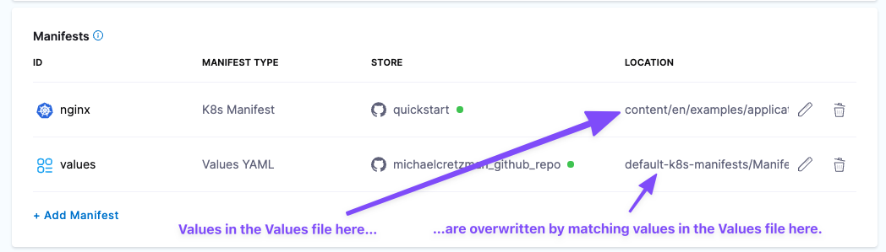

This topic describes how to add and configure a Harness Kubernetes service.

A Kubernetes service represents the microservices and other workloads you want to deploy to the cluster.

Setting up a Kubernetes service involves the following steps:

1. Add your manifests.
2. Add the artifacts you want to deploy.
3. Add any service variables you want to use in your manifests or pipeline.

## Manifests

Harness supports the following manifest types and orchestration methods.

```mdx-code-block
import Tabs from '@theme/Tabs';
import TabItem from '@theme/TabItem';
```

### Kubernetes

<details>
<summary>Use Kubernetes manifests</summary>

You can use:

- Standard Kubernetes manifests hosted in any repo or in Harness.
- Values YAML files that use Go templating to template manifests.
- Values YAML files can use a mix of hardcoded values and Harness expressions.

<details>
<summary>Watch a short video</summary>
Here's a quick video showing you how to add manifests and Values YAML files in Harness. It covers Kubernetes as well as other types like Helm Charts.

 
<!-- Video:
https://www.youtube.com/watch?v=dVk6-8tfwJc-->
<docvideo src="https://www.youtube.com/watch?v=dVk6-8tfwJc" />
</details>


```mdx-code-block
<Tabs>
  <TabItem value="YAML" label="YAML">
```
Here's a YAML example for a service with manifests hosted in Github and the nginx image hosted in Docker Hub.

<details>
<summary>Example</summary>

```yaml
service:
  name: Kubernetes
  identifier: Kubernetes
  serviceDefinition:
    type: Kubernetes
    spec:
      artifacts:
        primary:
          primaryArtifactRef: <+input>
          sources:
            - spec:
                connectorRef: Docker_Hub_with_Pwd
                imagePath: library/nginx
                tag: <+input>
              identifier: nginx
              type: DockerRegistry
      manifests:
        - manifest:
            identifier: nginx
            type: K8sManifest
            spec:
              store:
                type: Github
                spec:
                  connectorRef: harnessdocs2
                  gitFetchType: Branch
                  paths:
                    - default-k8s-manifests/Manifests/Files/templates
                  branch: main
              valuesPaths:
                - default-k8s-manifests/Manifests/Files/ng-values.yaml
              skipResourceVersioning: false
  gitOpsEnabled: false
```
</details>

```mdx-code-block
  </TabItem>
  <TabItem value="API" label="API">
```

Create a service using the [Create Services](https://apidocs.harness.io/tag/Services#operation/createServicesV2) API.

<details>
<summary>Services API example</summary>

```json
curl -i -X POST \
  'https://app.harness.io/gateway/ng/api/servicesV2/batch?accountIdentifier=<Harness account Id>' \
  -H 'Content-Type: application/json' \
  -H 'x-api-key: <Harness API key>' \
  -d '[{
    "identifier": "KubernetesTest",
    "orgIdentifier": "default",
    "projectIdentifier": "CD_Docs",
    "name": "KubernetesTest",
    "description": "string",
    "tags": {
      "property1": "string",
      "property2": "string"
    },
    "yaml": "service:\n  name: KubernetesTest\n  identifier: KubernetesTest\n  serviceDefinition:\n    type: Kubernetes\n    spec:\n      artifacts:\n        primary:\n          primaryArtifactRef: <+input>\n          sources:\n            - spec:\n                connectorRef: account.harnessImage\n                imagePath: library/nginx\n                tag: stable-perl\n              identifier: nginx\n              type: DockerRegistry\n      manifests:\n        - manifest:\n            identifier: myapp\n            type: K8sManifest\n            spec:\n              store:\n                type: Harness\n                spec:\n                  files:\n                    - /Templates\n              valuesPaths:\n                - /values.yaml\n              skipResourceVersioning: false\n              enableDeclarativeRollback: false\n  gitOpsEnabled: false"
  }]'
```
</details>


```mdx-code-block
  </TabItem>  
  <TabItem value="Terraform Provider" label="Terraform Provider">
```

For the Terraform Provider resource, go to [harness_platform_service](https://registry.terraform.io/providers/harness/harness/latest/docs/resources/platform_service).

<details>
<summary>Example</summary>

```yaml
resource "harness_platform_service" "example" {
  identifier  = "identifier"
  name        = "name"
  description = "test"
  org_id      = "org_id"
  project_id  = "project_id"

  ## SERVICE V2 UPDATE
  ## We now take in a YAML that can define the service definition for a given Service
  ## It isn't mandatory for Service creation 
  ## It is mandatory for Service use in a pipeline

  yaml = <<-EOT
                service:
                  name: name
                  identifier: identifier
                  serviceDefinition:
                    spec:
                      manifests:
                        - manifest:
                            identifier: manifest1
                            type: K8sManifest
                            spec:
                              store:
                                type: Github
                                spec:
                                  connectorRef: <+input>
                                  gitFetchType: Branch
                                  paths:
                                    - files1
                                  repoName: <+input>
                                  branch: master
                              skipResourceVersioning: false
                      configFiles:
                        - configFile:
                            identifier: configFile1
                            spec:
                              store:
                                type: Harness
                                spec:
                                  files:
                                    - <+org.description>
                      variables:
                        - name: var1
                          type: String
                          value: val1
                        - name: var2
                          type: String
                          value: val2
                    type: Kubernetes
                  gitOpsEnabled: false
              EOT
}
```
</details>


```mdx-code-block
  </TabItem>  
  <TabItem value="Pipeline Studio" label="Pipeline Studio">
```
To add Kubernetes manifests to your service, do the following:

1. In your project, in CD (Deployments), select **Services**.
2. Select **Manage Services**, and then select **New Service**.
3. Enter a name for the service and select **Save**.
4. Select **Configuration**.
5. In **Service Definition**, select **Kubernetes**.
6. In **Manifests**, click **Add Manifest**.
7. In **Specify Manifest Type**, select **K8s Manifest**, and then click **Continue**.
8. In **Specify K8s Manifest Store**, select the Git provider.
   
   The settings for each Git provider are slightly different, but you simply want to point to the Git account For example, click GitHub, and then select or create a new GitHub Connector. See [Connect to Code Repo](/docs/platform/Connectors/Code-Repositories/connect-to-code-repo).
9.  Click **Continue**. **Manifest Details** appears.
10. In **Manifest Identifier**, enter an Id for the manifest.
11. If you selected a Connector that uses a Git account instead of a Git repo, enter the name of the repo where your manifests are located in **Repository Name**.
12. In **Git Fetch Type**, select **Latest from Branch** or **Specific Commit ID**, and then enter the branch or commit Id for the repo.
13. For **Specific Commit ID**, you can also use a [Git commit tag](https://git-scm.com/book/en/v2/Git-Basics-Tagging).
14. In **File/Folder Path**, enter the path to the manifest file or folder in the repo. The Connector you selected already has the repo name, so you simply need to add the path from the root of the repo.
    
    If you are using a values.yaml file and it's in the same repo as your manifests, in **Values YAML**, click **Add File**.
15. Enter the path to the values.yaml file from the root of the repo.
    
    Here's an example with the manifest and values.yaml file added.
    
    
    
    If you use multiple files, the highest priority is given from the last file, and the lowest priority to the first file. For example, if you have 3 files and the second and third files contain the same key:value as the first file, the third file's key:value overrides the second and first files.
    
    
16. Click **Submit**. The manifest is added to **Manifests**.


```mdx-code-block
  </TabItem>  
  <TabItem value="Values YAML" label="Values YAML">
```

Harness Kubernetes Services can use Values YAML files just like you would using Helm. Harness manifests can use [Go templating](#go_templating) with your Values YAML files and you can include [Harness variable expressions](/docs/platform/Variables-and-Expressions/harness-variables) in the Values YAML files.

If you are using a Values YAML file and it's in the same repo as your manifests, you can add it when you add your manifests, as described above (**Values YAML** --> **Add File**).

If you are using a Values YAML file and it's in a separate repo from your manifests, or you simply want to add it separately, you can add it as a separate file, described below.

You cannot use Harness variables expressions in your Kubernetes object manifest files. You can only use Harness variables expressions in Values YAML files.Add a Values YAML fileWhere is your Values YAML file located?

* **Same folder as manifests:** If you are using a values.yaml file and it's in the same repo as your manifests, you can add it when you add your manifests, as described above (**Values YAML** --> **Add File**).
* **Separate from manifests:** If your values file is located in a different folder, you can add it separately as a **Values YAML** manifest type, described below.

To add a Values YAML file, do the following:

1. In your project, in CD (Deployments), select **Services**.
2. Select **Manage Services**, and then select **New Service**.
3. Enter a name for the service and select **Save**.
4. Select **Configuration**.
5. In **Service Definition**, select **Kubernetes**.
6. In **Manifests**, click **Add Manifest**.
7. In **Specify Manifest Type**, select **Values YAML**, and click **Continue.**
8. In **Specify Values YAML Store**, select the Git repo provider you're using and then create or select a Connector to that repo. The different Connectors are covered in [Connect to a Git Repo](/docs/platform/Connectors/Code-Repositories/connect-to-code-repo).
   
   If you haven't set up a Harness Delegate, you can add one as part of the Connector setup. This process is described in [Kubernetes CD tutorial](/docs/continuous-delivery/deploy-srv-diff-platforms/kubernetes/kubernetes-cd-quickstart), [Helm CD tutorial](/docs/continuous-delivery/deploy-srv-diff-platforms/helm/helm-cd-quickstart) and [Install a Kubernetes delegate](https://developer.harness.io/docs/platform/Delegates/install-delegates/overview).
9.  Once you've selected a Connector, click **Continue**.
10. In **Manifest Details**, you tell Harness where the values.yaml is located.
11. In **Manifest Identifier**, enter a name that identifies the file, like **values**.
12. If you selected a Connector that uses a Git account instead of a Git repo, enter the name of the repo where your manifests are located in **Repository Name**.
13. In **Git Fetch Type**, select a branch or commit Id for the manifest, and then enter the Id or branch.
    * For **Specific Commit ID**, you can also use a [Git commit tag](https://git-scm.com/book/en/v2/Git-Basics-Tagging).
    * In **File Path**, enter the path to the values.yaml file in the repo.
   
   You can enter multiple values file paths by clicking **Add File**. At runtime, Harness will compile the files into one values file.
   
   If you use multiple files, the highest priority is given from the last file, and the lowest priority to the first file. For example, if you have 3 files and the second and third files contain the same key:value as the first file, the third file's key:value overrides the second and first files.
   
   
14. Click **Submit**.

The values file(s) are added to the Service.

#### Values files in both the Manifests and Values YAML

If you have Values files in both the K8s Manifest **File/Folder Path** and the Values YAML, the Values YAML will overwrite any matching values in the Values YAML in the Manifest **File/Folder Path**.



```mdx-code-block
  </TabItem>
</Tabs>
```

#### Ignore a manifest file during deployment

You might have manifest files for resources that you do not want to deploy as part of the main deployment.

Instead, you can tell Harness to ignore these files and then apply them separately using the Harness [Apply](/docs/continuous-delivery/deploy-srv-diff-platforms/kubernetes/cd-k8s-ref/kubernetes-apply-step) step. Or you can simply ignore them and deploy them later.

See [Ignore a manifest file during deployment](/docs/continuous-delivery/deploy-srv-diff-platforms/kubernetes/cd-kubernetes-category/ignore-a-manifest-file-during-deployment) and [Apply](/docs/continuous-delivery/deploy-srv-diff-platforms/kubernetes/cd-k8s-ref/kubernetes-apply-step).

#### Notes

- If this is your first time using Harness for a Kubernetes deployment, see [Kubernetes CD tutorial](/docs/continuous-delivery/deploy-srv-diff-platforms/kubernetes/kubernetes-cd-quickstart).
- For a task-based walkthroughs of different Kubernetes features in Harness, see [Kubernetes How-tos](/docs/category/kubernetes).
- You can hardcode your artifact in your manifests, our add your artifact source to your **Service Definition** and then reference it in your manifests.

</details>


### Helm Charts

<details>
<summary>Use Helm Charts</summary>

You can use Helm charts stored in an HTTP Helm Repository, OCI Registry, a Git repo provider, a cloud storage service (Google Cloud Storage, AWS S3, Azure Repo), a custom repo, or the [Harness File Store](/docs/continuous-delivery/x-platform-cd-features/services/add-inline-manifests-using-file-store).


```mdx-code-block
import Tabs1 from '@theme/Tabs';
import TabItem1 from '@theme/TabItem';
```

<Tabs1>
  <TabItem1 value="YAML" label="YAML" default>

Here's a YAML example for a service with manifests hosted in Github and the nginx image hosted in Docker Hub.

<details>
<summary>Example</summary>

```yaml
service:
  name: Helm Chart
  identifier: Helm_Chart
  tags: {}
  serviceDefinition:
    spec:
      manifests:
        - manifest:
            identifier: nginx
            type: HelmChart
            spec:
              store:
                type: Http
                spec:
                  connectorRef: Bitnami
              chartName: nginx
              helmVersion: V3
              skipResourceVersioning: false
              commandFlags:
                - commandType: Template
                  flag: mychart -x templates/deployment.yaml
    type: Kubernetes
```

</details>


```mdx-code-block
  </TabItem1>
  <TabItem1 value="API" label="API">
```

Create a service using the [Create Services](https://apidocs.harness.io/tag/Services#operation/createServicesV2) API.

<details>
<summary>Services API example</summary>

```json
[
  {
    "identifier": "KubernetesTest",
    "orgIdentifier": "default",
    "projectIdentifier": "CD_Docs",
    "name": "KubernetesTest",
    "description": "string",
    "tags": {
      "property1": "string",
      "property2": "string"
    },
    "yaml": "service:\n  name: Helm Chart\n  identifier: Helm_Chart\n  tags: {}\n  serviceDefinition:\n    spec:\n      manifests:\n        - manifest:\n            identifier: nginx\n            type: HelmChart\n            spec:\n              store:\n                type: Http\n                spec:\n                  connectorRef: Bitnami\n              chartName: nginx\n              helmVersion: V3\n              skipResourceVersioning: false\n              commandFlags:\n                - commandType: Template\n                  flag: mychart -x templates/deployment.yaml\n    type: Kubernetes"
  }
]
```
</details>

```mdx-code-block
  </TabItem1>
  <TabItem1 value="Terraform Provider" label="Terraform Provider">
```

For the Terraform Provider resource, go to [harness_platform_service](https://registry.terraform.io/providers/harness/harness/latest/docs/resources/platform_service).

<details>
<summary>Example</summary>

```yaml
resource "harness_platform_service" "example" {
  identifier  = "identifier"
  name        = "name"
  description = "test"
  org_id      = "org_id"
  project_id  = "project_id"

  ## SERVICE V2 UPDATE
  ## We now take in a YAML that can define the service definition for a given Service
  ## It isn't mandatory for Service creation 
  ## It is mandatory for Service use in a pipeline

  yaml = <<-EOT
                service:
                  name: Helm Chart
                  identifier: Helm_Chart
                  tags: {}
                  serviceDefinition:
                    spec:
                      manifests:
                        - manifest:
                            identifier: nginx
                            type: HelmChart
                            spec:
                              store:
                                type: Http
                                spec:
                                  connectorRef: Bitnami
                              chartName: nginx
                              helmVersion: V3
                              skipResourceVersioning: false
                              commandFlags:
                                - commandType: Template
                                  flag: mychart -x templates/deployment.yaml
                    type: Kubernetes
              EOT
}
```
</details>

```mdx-code-block
  </TabItem1>
  <TabItem1 value="Pipeline Studio" label="Pipeline Studio">
```

To add a Helm chart to your service, do the following:

1. In your project, in CD (Deployments), select **Services**.
2. Select **Manage Services**, and then select **New Service**.
3. Enter a name for the service and select **Save**.
4. Select **Configuration**.
5. In **Service Definition**, select **Kubernetes**.
6. In **Manifests**, click **Add Manifest**.
7. In **Specify Manifest Type**, select **Helm Chart**, and click **Continue**.
8. In **Specify Helm Chart Store**, select the storage service you're using.
   
     


   For the steps and settings of each option, go to [Connectors](/docs/category/connectors) or [Connect to a Git repo](/docs/platform/Connectors/Code-Repositories/connect-to-code-repo).
   
   Once your Helm chart is added, it appears in the **Manifests** section. For example:
   
   

```mdx-code-block
  </TabItem1>
</Tabs1>
```

#### Important notes

- If this is your first time using Harness for a Helm Chart deployment, see [Helm Chart deployment tutorial](/docs/continuous-delivery/deploy-srv-diff-platforms/helm/helm-cd-quickstart).
- For a detailed walkthrough of deploying Helm Charts in Harness, including limitations and binary support, see [Deploy Helm Charts](/docs/continuous-delivery/deploy-srv-diff-platforms/helm/deploy-helm-charts).
- Harness does not support AWS cross-account access for [ChartMuseum](https://chartmuseum.com/) and AWS S3. For example, if the Harness delegate used to deploy charts is in AWS account A, and the S3 bucket is in AWS account B, the Harness connector that uses this delegate in A cannot assume the role for the B account.
- Harness cannot fetch Helm chart versions with Helm OCI because Helm OCI no longer supports `helm chart list`. See [OCI Feature Deprecation and Behavior Changes with Helm v3.7.0](https://helm.sh/docs/topics/registries/#oci-feature-deprecation-and-behavior-changes-with-v370).
- Currently, you cannot list the OCI image tags in Harness. This is a Helm limitation. For more information, go to [Helm Search Repo Chart issue](https://github.com/helm/helm/issues/11000).
  

</details>

### Kustomize

<details>
<summary>Use Kustomize</summary>

Harness supports Kustomize deployments. You can use overlays, multibase, plugins, sealed secrets, patches, etc, just as you would in any native kustomization.

```mdx-code-block
import Tabs2 from '@theme/Tabs';
import TabItem2 from '@theme/TabItem';
```

<Tabs2>
  <TabItem2 value="YAML" label="YAML" default>

Here's a YAML example for a service using a publicly available [helloword kustomization](https://github.com/wings-software/harness-docs/tree/main/kustomize/helloWorld) cloned from Kustomize.

<details>
<summary>Example</summary>

```yaml
service:
  name: Kustomize
  identifier: Kustomize
  serviceDefinition:
    type: Kubernetes
    spec:
      manifests:
        - manifest:
            identifier: kustomize
            type: Kustomize
            spec:
              store:
                type: Github
                spec:
                  connectorRef: Kustomize
                  gitFetchType: Branch
                  folderPath: kustomize/helloworld
                  branch: main
              pluginPath: ""
              skipResourceVersioning: false
  gitOpsEnabled: false
```
</details>


```mdx-code-block
  </TabItem2>
  <TabItem2 value="API" label="API">
```

Create a service using the [Create Services](https://apidocs.harness.io/tag/Services#operation/createServicesV2) API.

<details>
<summary>Services API example</summary>

```json
[
  {
    "identifier": "KubernetesTest",
    "orgIdentifier": "default",
    "projectIdentifier": "CD_Docs",
    "name": "KubernetesTest",
    "description": "string",
    "tags": {
      "property1": "string",
      "property2": "string"
    },
    "yaml": "service:\n  name: Kustomize\n  identifier: Kustomize\n  serviceDefinition:\n    type: Kubernetes\n    spec:\n      manifests:\n        - manifest:\n            identifier: kustomize\n            type: Kustomize\n            spec:\n              store:\n                type: Github\n                spec:\n                  connectorRef: Kustomize\n                  gitFetchType: Branch\n                  folderPath: kustomize/helloworld\n                  branch: main\n              pluginPath: \"\"\n              skipResourceVersioning: false\n  gitOpsEnabled: false"
  }
]
```
</details>

```mdx-code-block
  </TabItem2>
  <TabItem2 value="Terraform Provider" label="Terraform Provider">
```

For the Terraform Provider resource, go to [harness_platform_service](https://registry.terraform.io/providers/harness/harness/latest/docs/resources/platform_service).

<details>
<summary>Example</summary>

```yaml
resource "harness_platform_service" "example" {
  identifier  = "identifier"
  name        = "name"
  description = "test"
  org_id      = "org_id"
  project_id  = "project_id"

  ## SERVICE V2 UPDATE
  ## We now take in a YAML that can define the service definition for a given Service
  ## It isn't mandatory for Service creation 
  ## It is mandatory for Service use in a pipeline

  yaml = <<-EOT
              service:
                name: Kustomize
                identifier: Kustomize
                serviceDefinition:
                  type: Kubernetes
                  spec:
                    manifests:
                      - manifest:
                          identifier: kustomize
                          type: Kustomize
                          spec:
                            store:
                              type: Github
                              spec:
                                connectorRef: Kustomize
                                gitFetchType: Branch
                                folderPath: kustomize/helloworld
                                branch: main
                            pluginPath: ""
                            skipResourceVersioning: false
                gitOpsEnabled: false
            EOT
}
```
</details>

```mdx-code-block
  </TabItem2>
  <TabItem2 value="Pipeline Studio" label="Pipeline Studio">
```

To add a kustomization, do the following:

1. In your project, in CD (Deployments), select **Services**.
2. Select **Manage Services**, and then select **New Service**.
3. Enter a name for the service and select **Save**.
4. Select **Configuration**.
5. In **Service Definition**, select **Kubernetes**.
6. In **Manifests**, click **Add Manifest**.
7. In your CD stage, click **Service**.
8. In **Service Definition**, select **Kubernetes**.
9. In **Manifests**, click **Add Manifest**.
10. In **Specify Manifest Type**, click **Kustomize**, and click **Continue**.
11. In **Specify Manifest Type**, select a Git provider, [Harness File Store](/docs/continuous-delivery/x-platform-cd-features/services/add-inline-manifests-using-file-store), or Azure Repo.
12. In **Manifest Details**, enter the following settings, test the connection, and click **Submit**.

    + **Manifest Identifier:** enter **kustomize**.
    + **Git Fetch Type:** select **Latest from Branch**.
    + **Branch:** enter **main**.
    + **Kustomize Folder Path:** kustomize/helloWorld. This is the path from the repo root.
    
    The kustomization is now listed.
    
    

```mdx-code-block
  </TabItem2>
  <TabItem2 value="Kustomize Patches" label="Kustomize Patches" default>
```

You cannot use Harness variables in the base manifest or kustomization.yaml. You can only use Harness variables in kustomize patches you add in **Kustomize Patches Manifest Details**.

**How Harness uses patchesStrategicMerge:** 

- Kustomize patches override values in the base manifest. Harness supports the `patchesStrategicMerge` patches type.
- If the `patchesStrategicMerge` label is missing from the kustomization YAML file, but you have added Kustomize Patches to your Harness Service, Harness will add the Kustomize Patches you added in Harness to the `patchesStrategicMerge` in the kustomization file. If you have hardcoded patches in `patchesStrategicMerge`, but not add these patches to Harness as Kustomize Patches, Harness will ignore them.

For a detailed walkthrough of using patches in Harness, go to [Use Kustomize for Kubernetes deployments](/docs/continuous-delivery/deploy-srv-diff-platforms/kustomize/use-kustomize-for-kubernetes-deployments).

To use Kustomize Patches, do the following:

1. In your project, in CD (Deployments), select **Services**.
2. Select **Manage Services**, and then select **New Service**.
3. Enter a name for the service and select **Save**.
4. Select **Configuration**.
5. In **Service Definition**, select **Kubernetes**.
6. In **Manifests**, select **Add Manifest**.
7. In **Specify Manifest Type**, select **Kustomize Patches**, and select**Continue**.
8. In **Specify Kustomize Patches Store**, select your Git provider and Connector. See [Connect to a Git Repo](/docs/platform/Connectors/Code-Repositories/connect-to-code-repo).
   
   The Git Connector should point to the Git account or repo where you Kustomize files are located. In **Kustomize Patches** you will specify the path to the actual patch files.
9.  Select **Continue**.
10. In **Manifest Details**, enter the path to your patch file(s):
    + **Manifest Identifier:** enter a name that identifies the patch file(s). You don't have to add the actual filename.
    + **Git Fetch Type:** select whether to use the latest branch or a specific commit Id.
    + **Branch**/**Commit Id**: enter the branch or commit Id.
    + **File/Folder Path:** enter the path to the patch file(s) from the root of the repo.
11. Click **Add File** to add each patch file. The files you add should be the same files listed in `patchesStrategicMerge` of the main kustomize file in your Service.
    
    The order in which you add file paths for patches in **File/Folder Path** is the same order that Harness applies the patches during the kustomization build.
    
    Small patches that do one thing are recommended. For example, create one patch for increasing the deployment replica number and another patch for setting the memory limit.
12. Select **Submit**. The patch file(s) is added to **Manifests**.
    
    When the main kustomization.yaml is deployed, the patch is rendered and its overrides are added to the deployment.yaml that is deployed.


```mdx-code-block
  </TabItem2>  
</Tabs2>
```

If this is your first time using Harness for a Kustomize deployment, see the [Kustomize Quickstart](/docs/continuous-delivery/deploy-srv-diff-platforms/kustomize/kustomize-quickstart).

For a detailed walkthrough of deploying Kustomize in Harness, including limitations, see [Use Kustomize for Kubernetes Deployments](/docs/continuous-delivery/deploy-srv-diff-platforms/kustomize/use-kustomize-for-kubernetes-deployments).

#### Important notes

* Harness supports Kustomize and Kustomize Patches for Rolling, Blue Green and Delete steps.
* Harness does not use Kustomize for rollback. Harness renders the templates using Kustomize and then passes them onto kubectl. A rollback works exactly as it does for native Kubernetes.
* You cannot use Harness variables in the base manifest or kustomization.yaml. You can only use Harness variables in kustomize patches you add in **Kustomize Patches Manifest Details**.
* **Kustomize binary versions:**
  * Harness includes Kustomize binary versions 3.5.4 and 4.0.0. By default, Harness uses 3.5.4. 
  * To use 4.0.0, you must enable the feature flag `NEW_KUSTOMIZE_BINARY` in your account. Contact [Harness Support](mailto:support@harness.io) to enable the feature.
* Harness will not follow symlinks in the Kustomize and Kustomize Patches files it pulls.

</details>


### OpenShift templates

<details>
<summary>Use OpenShift templates</summary>

Harness supports OpenShift for Kubernetes deployments.

For an overview of OpenShift support, see [Using OpenShift with Harness Kubernetes](/docs/continuous-delivery/deploy-srv-diff-platforms/kubernetes/cd-k8s-ref/using-open-shift-with-harness-kubernetes).

```mdx-code-block
import Tabs3 from '@theme/Tabs';
import TabItem3 from '@theme/TabItem';
```

<Tabs3>
  <TabItem3 value="YAML" label="YAML" default>

Here's a YAML example for a service using an OpenShift template that is stored in the [Harness File Store](/docs/continuous-delivery/x-platform-cd-features/services/add-inline-manifests-using-file-store).

<details>
<summary>Example</summary>

```yaml
service:
  name: OpenShift Template
  identifier: OpenShift
  tags: {}
  serviceDefinition:
    spec:
      manifests:
        - manifest:
            identifier: nginx
            type: OpenshiftTemplate
            spec:
              store:
                type: Harness
                spec:
                  files:
                    - /OpenShift/templates/example-template.yml
              skipResourceVersioning: false
    type: Kubernetes
```
</details>

```mdx-code-block
  </TabItem3>
  <TabItem3 value="API" label="API">
```

Create a service using the [Create Services](https://apidocs.harness.io/tag/Services#operation/createServicesV2) API.

<details>
<summary>Services API example</summary>

```json
[
  {
    "identifier": "KubernetesTest",
    "orgIdentifier": "default",
    "projectIdentifier": "CD_Docs",
    "name": "KubernetesTest",
    "description": "string",
    "tags": {
      "property1": "string",
      "property2": "string"
    },
    "yaml": "service:\n  name: OpenShift Template\n  identifier: OpenShift\n  tags: {}\n  serviceDefinition:\n    spec:\n      manifests:\n        - manifest:\n            identifier: nginx\n            type: OpenshiftTemplate\n            spec:\n              store:\n                type: Harness\n                spec:\n                  files:\n                    - /OpenShift/templates/example-template.yml\n              skipResourceVersioning: false\n    type: Kubernetes"
  }
]
```
</details>

```mdx-code-block
  </TabItem3>
  <TabItem3 value="Terraform Provider" label="Terraform Provider">
```

For the Terraform Provider resource, go to [harness_platform_service](https://registry.terraform.io/providers/harness/harness/latest/docs/resources/platform_service).

<details>
<summary>Example</summary>

```yaml
resource "harness_platform_service" "example" {
  identifier  = "identifier"
  name        = "name"
  description = "test"
  org_id      = "org_id"
  project_id  = "project_id"

  ## SERVICE V2 UPDATE
  ## We now take in a YAML that can define the service definition for a given Service
  ## It isn't mandatory for Service creation 
  ## It is mandatory for Service use in a pipeline

  yaml = <<-EOT
              service:
                name: OpenShift Template
                identifier: OpenShift
                tags: {}
                serviceDefinition:
                  spec:
                    manifests:
                      - manifest:
                          identifier: nginx
                          type: OpenshiftTemplate
                          spec:
                            store:
                              type: Harness
                              spec:
                                files:
                                  - /OpenShift/templates/example-template.yml
                            skipResourceVersioning: false
                  type: Kubernetes
              EOT
}
```
</details>

```mdx-code-block
  </TabItem3>
  <TabItem3 value="Pipeline Studio" label="Pipeline Studio">
```

To add an OpenShift Template to a service, do the following:

1. In your project, in CD (Deployments), select **Services**.
2. Select **Manage Services**, and then select **New Service**.
3. Enter a name for the service and select **Save**.
4. Select **Configuration**.
5. In **Service Definition**, select **Kubernetes**.
6. In **Manifests**, click **Add Manifest**.
7.  In **Specify Manifest Type**, select **OpenShift Template**, and then select **Continue.**
8.  In **Specify OpenShift Template Store**, select where your template is located. 
  
  You can use a Git provider, the [Harness File Store](/docs/continuous-delivery/x-platform-cd-features/services/add-inline-manifests-using-file-store), a custom repo, or Azure Repos.
1.  For example, click **GitHub**, and then select or create a new GitHub Connector. See [Connect to Code Repo](/docs/platform/Connectors/Code-Repositories/connect-to-code-repo).
2.  Select **Continue**. **Manifest Details** appears.
3.  In **Manifest Identifier**, enter an Id for the manifest. It must be unique. It can be used in Harness expressions to reference this template's settings.
4.  In **Git Fetch Type**, select **Latest from Branch** or **Specific Commit Id/Git Tag**, and then enter the branch or commit Id/[tag](https://git-scm.com/book/en/v2/Git-Basics-Tagging) for the repo.
5.  In **Template** **File Path**, enter the path to the template file. The Connector you selected already has the repo name, so you simply need to add the path from the root of the repo to the file.
6.  Select **Submit**. The template is added to **Manifests**.

```mdx-code-block
  </TabItem3>
  <TabItem3 value="OpenShift Param" label="OpenShift Param" default>
```

OpenShift Param Files can be added in the following ways:

1. Attached to the OpenShift Template you added.
2. Added as a separate manifest.


For an overview of OpenShift support, see [Using OpenShift with Harness Kubernetes](/docs/continuous-delivery/deploy-srv-diff-platforms/kubernetes/cd-k8s-ref/using-open-shift-with-harness-kubernetes).

Let's look at an example where the OpenShift Param is attached to a template already added:

1. In your project, in CD (Deployments), select **Services**.
2. Select **Manage Services**, and then select the service with the OpenShift template.
3. Select **Configuration**.
4. In **Manifests**, select **Attach OpenShift Param**.
5. In **Enter File Path**, select where your params file is located.
6. Select **Submit**. The params file is added to **Manifests**.

You can now see the params file in the OpenShift Template **Manifest Details**.


```mdx-code-block
  </TabItem3>
</Tabs3>
```

#### Deployment strategy support

In addition to standard workload type support in Harness (see [What can I deploy in Kubernetes?](/docs/continuous-delivery/deploy-srv-diff-platforms/kubernetes/cd-k8s-ref/what-can-i-deploy-in-kubernetes)), Harness supports [DeploymentConfig](https://docs.openshift.com/container-platform/4.1/applications/deployments/what-deployments-are.html), [Route](https://docs.openshift.com/enterprise/3.0/architecture/core_concepts/routes.html), and [ImageStream](https://docs.openshift.com/enterprise/3.2/architecture/core_concepts/builds_and_image_streams.html#image-streams) across Canary, Blue Green, and Rolling deployment strategies.

Please use `apiVersion: apps.openshift.io/v1` and not `apiVersion: v1`.

#### Harness supports list objects

You can leverage Kubernetes list objects as needed without modifying your YAML for Harness.

When you deploy, Harness will render the lists and show all the templated and rendered values in the log.

Harness supports:

* List
* NamespaceList
* ServiceList
* For Kubernetes deployments, these objects are supported for all deployment strategies (Canary, Rolling, Blue/Green).
* For Native Helm, these objects are supported for Rolling deployments.

If you run `kubectl api-resources` you should see a list of resources, and `kubectl explain` will work with any of these.

#### Important notes

* Make sure that you update your version to `apiVersion: apps.openshift.io/v1` and not `apiVersion: v1`.
* The token does not need to have global read permissions. The token can be scoped to the namespace.
* The Kubernetes containers must be OpenShift-compatible containers. If you are already using OpenShift, then this is already configured. But be aware that OpenShift cannot simply deploy any Kubernetes container. You can get OpenShift images from the following public repos: <https://hub.docker.com/u/openshift> and <https://access.redhat.com/containers>.
* Useful articles for setting up a local OpenShift cluster for testing: [How To Setup Local OpenShift Origin (OKD) Cluster on CentOS 7](https://computingforgeeks.com/setup-openshift-origin-local-cluster-on-centos/), [OpenShift Console redirects to 127.0.0.1](https://chrisphillips-cminion.github.io/kubernetes/2019/07/08/OpenShift-Redirect.html).


</details>

## Artifacts

You have two options when referencing the artifacts you want to deploy:

- Add an artifact source to the Harness service and reference it using the Harness expression `<+artifacts.primary.image>` in the values YAML file.
- Hardcode the artifact into the manifests or values YAML file.

<details>
<summary>Use the artifact expression</summary>

Add the image location to Harness as an artifact in the **Artifacts** section of the service.


This allows you to reference the image in your values YAML files using the Harness expression `<+artifacts.primary.image>`.

```yaml
...  
image: <+artifacts.primary.image>  
...
```

You cannot use Harness variables expressions in your Kubernetes object manifest files. You can only use Harness variables expressions in values YAML files, or Kustomize Patch file.

When you select the artifact repo for the artifact, like a Docker Hub repo, you specify the artifact and tag/version to use. 

You can select a specific tag/version, use a [runtime input](/docs/platform/references/runtime-inputs/) so that you are prompted for the tag/version when you run the pipeline, or you can use an Harness variable expression to pass in the tag/version at execution.

Here's an example where a runtime input is used and you select which image version/tag to deploy.


With a Harness artifact, you can template your manifests, detaching them from a hardcoded location. This makes your manifests reusable and dynamic.

</details>

<details>
<summary>Hardcode the artifact</summary>

If a Docker image location is hardcoded in your Kubernetes manifest (for example, `image: nginx:1.14.2`), then you can simply add the manifest to Harness in **Manifests** and Kubernetes will pull the image during deployment.

When you hardcode the artifact in your manifests, any artifacts added to your Harness service are ignored.
</details>


### Docker

<details>
<summary>Use artifacts in any Docker registry</summary>

```mdx-code-block
import Tabs5 from '@theme/Tabs';
import TabItem5 from '@theme/TabItem';
```
```mdx-code-block
<Tabs5>
  <TabItem5 value="YAML" label="YAML" default>
```

To use a Docker artifact, you create or use a Harness connector to connect to your Docker repo and then use that connector in your Harness service and reference the artifact to use.

<details>
<summary>Docker connector YAML</summary>

```yaml
connector:
  name: Docker Hub with Pwd
  identifier: Docker_Hub_with_Pwd
  description: ""
  orgIdentifier: default
  projectIdentifier: CD_Docs
  type: DockerRegistry
  spec:
    dockerRegistryUrl: https://index.docker.io/v2/
    providerType: DockerHub
    auth:
      type: UsernamePassword
      spec:
        username: johndoe
        passwordRef: Docker_Hub_Pwd
    executeOnDelegate: false
```

</details>

<details>
<summary>Service using Docker artifact YAML</summary>

```yaml
service:
  name: Example K8s2
  identifier: Example_K8s2
  serviceDefinition:
    type: Kubernetes
    spec:
      manifests:
        - manifest:
            identifier: myapp
            type: K8sManifest
            spec:
              store:
                type: Harness
                spec:
                  files:
                    - /Templates/deployment.yaml
              valuesPaths:
                - /values.yaml
              skipResourceVersioning: false
      artifacts:
        primary:
          primaryArtifactRef: <+input>
          sources:
            - spec:
                connectorRef: Docker_Hub_with_Pwd
                imagePath: library/nginx
                tag: stable-perl
              identifier: myimage
              type: DockerRegistry
  gitOpsEnabled: false

```
</details>


```mdx-code-block
  </TabItem5>
  <TabItem5 value="API" label="API">
```

Create the Docker connector using the [Create a Connector](https://apidocs.harness.io/tag/Connectors#operation/createConnector) API.

<details>
<summary>Docker connector example</summary>

```yaml
curl --location --request POST 'https://app.harness.io/gateway/ng/api/connectors?accountIdentifier=123456' \
--header 'Content-Type: text/yaml' \
--header 'x-api-key: pat.123456.123456' \
--data-raw 'connector:
  name: dockerhub
  identifier: dockerhub
  description: ""
  tags: {}
  orgIdentifier: default
  projectIdentifier: APISample
  type: DockerRegistry
  spec:
    dockerRegistryUrl: https://index.docker.io/v2/
    providerType: DockerHub
    auth:
      type: Anonymous'
```
</details>

Create a service with an artifact source that uses the connector using the [Create Services](https://apidocs.harness.io/tag/Services#operation/createServicesV2) API.


```mdx-code-block
  </TabItem5>
  <TabItem5 value="Terraform Provider" label="Terraform Provider">
```

For the Terraform Provider Docker connector resource, go to [harness_platform_connector_docker](https://registry.terraform.io/providers/harness/harness/latest/docs/resources/platform_connector_docker).

<details>
<summary>Docker connector example</summary>

```json
# credentials anonymous
resource "harness_platform_connector_docker" "test" {
  identifier  = "identifer"
  name        = "name"
  description = "test"
  tags        = ["foo:bar"]

  type               = "DockerHub"
  url                = "https://hub.docker.com"
  delegate_selectors = ["harness-delegate"]
}

# credentials username password
resource "harness_platform_connector_docker" "test" {
  identifier  = "identifer"
  name        = "name"
  description = "test"
  tags        = ["foo:bar"]

  type               = "DockerHub"
  url                = "https://hub.docker.com"
  delegate_selectors = ["harness-delegate"]
  credentials {
    username     = "admin"
    password_ref = "account.secret_id"
  }
}
```
</details>

For the Terraform Provider service resource, go to [harness_platform_service](https://registry.terraform.io/providers/harness/harness/latest/docs/resources/platform_service).

<details>
<summary>Service example</summary>

```json
resource "harness_platform_service" "example" {
  identifier  = "identifier"
  name        = "name"
  description = "test"
  org_id      = "org_id"
  project_id  = "project_id"

  ## SERVICE V2 UPDATE
  ## We now take in a YAML that can define the service definition for a given Service
  ## It isn't mandatory for Service creation 
  ## It is mandatory for Service use in a pipeline

 yaml = <<-EOT
              service:
                name: Example K8s2
                identifier: Example_K8s2
                serviceDefinition:
                  type: Kubernetes
                  spec:
                    manifests:
                      - manifest:
                          identifier: myapp
                          type: K8sManifest
                          spec:
                            store:
                              type: Harness
                              spec:
                                files:
                                  - /Templates/deployment.yaml
                            valuesPaths:
                              - /values.yaml
                            skipResourceVersioning: false
                    artifacts:
                      primary:
                        primaryArtifactRef: <+input>
                        sources:
                          - spec:
                              connectorRef: Docker_Hub_with_Pwd
                              imagePath: library/nginx
                              tag: stable-perl
                            identifier: myimage
                            type: DockerRegistry
                gitOpsEnabled: false
              EOT
}
```
</details>

```mdx-code-block
  </TabItem5>
  <TabItem5 value="Pipeline Studio" label="Pipeline Studio">
```

To add an artifact from a Docker registry, do the following:

1. In your project, in CD (Deployments), select **Services**.
2. Select **Manage Services**, and then select **New Service**.
3. Enter a name for the service and select **Save**.
4. Select **Configuration**.
5. In **Service Definition**, select **Kubernetes**.
6. In **Artifacts**, select **Add Artifact Source**.
7. In **Select Artifact Repository Type**, select the registry where your Docker artifact is hosted. For this example, we'll select **Docker Registry**, and then click **Continue**.
8. Select or create a [Docker Registry Connector](/docs/platform/Connectors/Cloud-providers/ref-cloud-providers/docker-registry-connector-settings-reference).
9.  Select **Continue**.
10. In **Artifact Source Name**, enter a name that identifies your artifact.
11. In **Image path**, enter the name of the artifact you want to deploy, such as `library/nginx` or `jsmtih/privateimage`.

    Official images in public repos often need the label `library`, e.g. `library/tomcat`.

    Wildcards are not supported.
11. In **Tag**, enter or select the [Docker image tag](https://docs.docker.com/engine/reference/commandline/tag/) for the image.
    
    
12. Click **Submit**.
13. The Artifact is added to the Service Definition.

```mdx-code-block
  </TabItem5>
</Tabs5>
```

#### Important notes

- For pulling Docker images from Docker repos, Harness is restricted by the limits of the Docker repo. For example, [Docker Hub limits](https://docs.docker.com/docker-hub/download-rate-limit/).
- The maximum number of artifact image tags fetched by Harness that is 10000.

</details>


### Google Container Registry (GCR)

<details>
<summary>Use GCR artifacts</summary>

You connect to GCR using a Harness GCP Connector. For details on all the GCR requirements for the GCP Connector, see [Google Cloud Platform (GCP) Connector Settings Reference](/docs/platform/Connectors/Cloud-providers/ref-cloud-providers/gcs-connector-settings-reference).

```mdx-code-block
import Tabs6 from '@theme/Tabs';
import TabItem6 from '@theme/TabItem';
```
```mdx-code-block
<Tabs6>
  <TabItem6 value="YAML" label="YAML" default>
```

To use a GCR artifact, you create or use a Harness GCP Connector to connect to GCR repo and then use that connector in your Harness service and reference the artifact to use.

<details>
<summary>GCP connector YAML</summary>

This example uses a Harness delegate installed in GCP for credentials.

```yaml
connector:
  name: GCR
  identifier: GCR
  description: ""
  orgIdentifier: default
  projectIdentifier: CD_Docs
  type: Gcp
  spec:
    credential:
      type: InheritFromDelegate
    delegateSelectors:
      - gcpdocplay
    executeOnDelegate: true
```

</details>

<details>
<summary>Service using GCR artifact YAML</summary>

```yaml
service:
  name: Google Artifact
  identifier: Google_Artifact
  serviceDefinition:
    type: Kubernetes
    spec:
      manifests:
        - manifest:
            identifier: manifests
            type: K8sManifest
            spec:
              store:
                type: Harness
                spec:
                  files:
                    - account:/Templates
              valuesPaths:
                - account:/values.yaml
              skipResourceVersioning: false
      artifacts:
        primary:
          primaryArtifactRef: <+input>
          sources:
            - spec:
                connectorRef: GCR
                imagePath: docs-play/todolist-sample
                tag: <+input>
                registryHostname: gcr.io
              identifier: myapp
              type: Gcr
  gitOpsEnabled: false
```
</details>

```mdx-code-block
  </TabItem6>
  <TabItem6 value="API" label="API">
```
Create the GCR connector using the [Create a Connector](https://apidocs.harness.io/tag/Connectors#operation/createConnector) API.

<details>
<summary>GCR connector example</summary>

```curl
curl --location --request POST 'https://app.harness.io/gateway/ng/api/connectors?accountIdentifier=12345' \
--header 'Content-Type: text/yaml' \
--header 'x-api-key: pat.12345.6789' \
--data-raw 'connector:
  name: GCRexample
  identifier: GCRexample
  description: ""
  orgIdentifier: default
  projectIdentifier: CD_Docs
  type: Gcp
  spec:
    credential:
      type: InheritFromDelegate
    delegateSelectors:
      - gcpdocplay
    executeOnDelegate: true'
```
</details>

Create a service with an artifact source that uses the connector using the [Create Services](https://apidocs.harness.io/tag/Services#operation/createServicesV2) API.

```mdx-code-block
  </TabItem6>
  <TabItem6 value="Terraform Provider" label="Terraform Provider">
```

For the Terraform Provider GCP connector resource, go to [harness_platform_connector_gcp](https://registry.terraform.io/providers/harness/harness/latest/docs/resources/platform_connector_gcp).

<details>
<summary>GCP connector example</summary>

```json
# Credential manual
resource "harness_platform_connector_gcp" "test" {
  identifier  = "identifier"
  name        = "name"
  description = "test"
  tags        = ["foo:bar"]

  manual {
    secret_key_ref     = "account.secret_id"
    delegate_selectors = ["harness-delegate"]
  }
}

# Credentials inherit_from_delegate
resource "harness_platform_connector_gcp" "test" {
  identifier  = "identifier"
  name        = "name"
  description = "test"
  tags        = ["foo:bar"]

  inherit_from_delegate {
    delegate_selectors = ["harness-delegate"]
  }
}
```
</details>

For the Terraform Provider service resource, go to [harness_platform_service](https://registry.terraform.io/providers/harness/harness/latest/docs/resources/platform_service).

```mdx-code-block
  </TabItem6>
  <TabItem6 value="Pipeline Studio" label="Pipeline Studio">
```

You connect to GCR using a Harness GCP Connector. For details on all the GCR requirements for the GCP Connector, see [Google Cloud Platform (GCP) Connector Settings Reference](/docs/platform/Connectors/Cloud-providers/ref-cloud-providers/gcs-connector-settings-reference).

To add an artifact from GCR, do the following:

1. In your project, in CD (Deployments), select **Services**.
2. Select **Manage Services**, and then select **New Service**.
3. Enter a name for the service and select **Save**.
4. Select **Configuration**.
5. In **Service Definition**, select **Kubernetes**.
6. In **Artifacts**, select **Add Artifact Source**.
7. In **Select Artifact Repository Type**, click **GCR**, and then click **Continue**.
8. In **GCR Repository**, select or create a [Google Cloud Platform (GCP) Connector](/docs/platform/Connectors/Cloud-providers/ref-cloud-providers/gcs-connector-settings-reference) that connects to the GCP account where the GCR registry is located.
9. Click **Continue**.
10. In **Artifact Source Name**, enter a name for the artifact.
11. In **GCR Registry URL**, select the GCR registry host name, for example `gcr.io`.
12. In **Image Path**, enter the name of the artifact you want to deploy.

    Images in repos need to reference a path starting with the project Id that the artifact is in, for example: `myproject-id/image-name`.
13. In **Tag**, enter or select the [Docker image tag](https://docs.docker.com/engine/reference/commandline/tag/) for the image or select a [runtime input or expression](/docs/platform/references/runtime-inputs/).
    
    
    
    If you use runtime input, when you deploy the pipeline, Harness will pull the list of tags from the repo and prompt you to select one.
14. Click **Submit**.
    
    The Artifact is added to the **Service Definition**.

```mdx-code-block
  </TabItem6>
</Tabs6>
```

#### Permissions

For Google Container Registry (GCR), the following roles are required:

- Storage Object Viewer (roles/storage.objectViewer)
- Storage Object Admin (roles/storage.objectAdmin)

For more information, go to the GCP documentation about [Cloud IAM roles for Cloud Storage](https://cloud.google.com/storage/docs/access-control/iam-roles).

Ensure the Harness delegate you have installed can reach `storage.cloud.google.com` and your GCR registry host name, for example `gcr.io`. 

</details>


### Google Artifact Registry

<details>
<summary>Use Google Artifact Registry artifacts</summary>

You connect to Google Artifact Registry using a Harness GCP Connector. 

For details on all the Google Artifact Registry requirements for the GCP Connector, see [Google Cloud Platform (GCP) Connector Settings Reference](/docs/platform/Connectors/Cloud-providers/ref-cloud-providers/gcs-connector-settings-reference).

```mdx-code-block
import Tabs7 from '@theme/Tabs';
import TabItem7 from '@theme/TabItem';
```
```mdx-code-block
<Tabs7>
  <TabItem7 value="YAML" label="YAML" default>
```

This example uses a Harness delegate installed in GCP for credentials.

<details>
<summary>Google Artifact Registry connector YAML</summary>

```yaml
connector:
  name: Google Artifact Registry
  identifier: Google_Artifact_Registry
  description: ""
  orgIdentifier: default
  projectIdentifier: CD_Docs
  type: Gcp
  spec:
    credential:
      type: InheritFromDelegate
    delegateSelectors:
      - gcpdocplay
    executeOnDelegate: true
```
</details>

<details>
<summary>Service using Google Artifact Registry artifact YAML</summary>

```yaml
service:
  name: Google Artifact Registry
  identifier: Google_Artifact_Registry
  tags: {}
  serviceDefinition:
    spec:
      manifests:
        - manifest:
            identifier: myapp
            type: K8sManifest
            spec:
              store:
                type: Harness
                spec:
                  files:
                    - /Templates
              valuesPaths:
                - /values.yaml
              skipResourceVersioning: false
              enableDeclarativeRollback: false
      artifacts:
        primary:
          primaryArtifactRef: <+input>
          sources:
            - identifier: myapp
              spec:
                connectorRef: Google_Artifact_Registry
                repositoryType: docker
                project: docs-play
                region: us-central1
                repositoryName: quickstart-docker-repo
                package: quickstart-docker-repo
                version: <+input>
              type: GoogleArtifactRegistry
    type: Kubernetes

```
</details>

```mdx-code-block
  </TabItem7>
  <TabItem7 value="API" label="API">
```

Create the Google Artifact Registry connector using the [Create a Connector](https://apidocs.harness.io/tag/Connectors#operation/createConnector) API.

<details>
<summary>GCR connector example</summary>

```curl
curl --location --request POST 'https://app.harness.io/gateway/ng/api/connectors?accountIdentifier=12345' \
--header 'Content-Type: text/yaml' \
--header 'x-api-key: pat.12345.6789' \
--data-raw 'connector:
  name: Google Artifact Registry
  identifier: Google_Artifact_Registry
  description: ""
  orgIdentifier: default
  projectIdentifier: CD_Docs
  type: Gcp
  spec:
    credential:
      type: InheritFromDelegate
    delegateSelectors:
      - gcpdocplay
    executeOnDelegate: true'
```
</details>

Create a service with an artifact source that uses the connector using the [Create Services](https://apidocs.harness.io/tag/Services#operation/createServicesV2) API.


```mdx-code-block
  </TabItem7>
  <TabItem7 value="Terraform Provider" label="Terraform Provider">
```

For the Terraform Provider GCP connector resource, go to [harness_platform_connector_gcp](https://registry.terraform.io/providers/harness/harness/latest/docs/resources/platform_connector_gcp).

<details>
<summary>GCP connector example</summary>

```json
# Credential manual
resource "harness_platform_connector_gcp" "test" {
  identifier  = "identifier"
  name        = "name"
  description = "test"
  tags        = ["foo:bar"]

  manual {
    secret_key_ref     = "account.secret_id"
    delegate_selectors = ["harness-delegate"]
  }
}

# Credentials inherit_from_delegate
resource "harness_platform_connector_gcp" "test" {
  identifier  = "identifier"
  name        = "name"
  description = "test"
  tags        = ["foo:bar"]

  inherit_from_delegate {
    delegate_selectors = ["harness-delegate"]
  }
}
```
</details>

For the Terraform Provider service resource, go to [harness_platform_service](https://registry.terraform.io/providers/harness/harness/latest/docs/resources/platform_service).

```mdx-code-block
  </TabItem7>
  <TabItem7 value="Pipeline Studio" label="Pipeline Studio">
```

You connect to Google Artifact Registry using a Harness GCP Connector. 

For details on all the Google Artifact Registry requirements for the GCP Connector, see [Google Cloud Platform (GCP) Connector Settings Reference](/docs/platform/Connectors/Cloud-providers/ref-cloud-providers/gcs-connector-settings-reference).

To add an artifact from Google Artifact Registry, do the following:


1. In your project, in CD (Deployments), select **Services**.
2. Select **Manage Services**, and then select **New Service**.
3. Enter a name for the service and select **Save**.
4. Select **Configuration**.
5. In **Service Definition**, select **Kubernetes**.
6. In **Artifacts**, select **Add Artifact Source**.
7. In **Artifact Repository Type**, select **Google Artifact Registry**, and then select **Continue**.
8. In **GCP Connector**, select or create a [Google Cloud Platform (GCP) Connector](/docs/platform/Connectors/Cloud-providers/ref-cloud-providers/gcs-connector-settings-reference) that connects to the GCP account where the Google Artifact Registry is located. 
9. Select **Continue**.
10. In **Artifact Details**, you are basically creating the pull command. For example:
    
    ```
    docker pull us-central1-docker.pkg.dev/docs-play/quickstart-docker-repo/quickstart-image:v1.0
    ```
12. In **Artifact Source Name**, enter a name for the artifact.
13. In **Repository Type**, select the format of the artifact.
14. In **Project**, enter the Id of the GCP project.
15. In **Region**, select the region where the repo is located.
16. In **Repository Name**, enter the name of the repo.
17. In **Package**, enter the artifact name.
18. In **Version Details**, select **Value** or **Regex**.
19. In **Version**, enter or select the [Docker image tag](https://docs.docker.com/engine/reference/commandline/tag/) for the image or select [runtime input or expression](/docs/platform/references/runtime-inputs/).
    
    
    If you use runtime input, when you deploy the pipeline, Harness will pull the list of tags from the repo and prompt you to select one.

    :::note
    
    If you used Fixed Value in **Version** and Harness is not able to fetch the image tags, ensure that the GCP service account key used in the GCP connector credentials, or in the service account used to install the Harness delegate, has the required permissions. See the **Permissions** tab in this documentation. 
    
    :::
20. Click **Submit**.
    The Artifact is added to the **Service Definition**.


```mdx-code-block
  </TabItem7>
</Tabs7>
```

#### Permissions

For Google Artifact Registry, the following roles are required:

- Artifact Registry Reader
- Artifact Registry Writer

For more information, go to the GCP documentation [Configure roles and permissions](https://cloud.google.com/artifact-registry/docs/access-control).

Ensure the Harness delegate you have installed can reach your Google Artifact Registry region, for example `us-central1`. 

</details>


### Amazon Elastic Container Registry (ECR)

<details>
<summary>Use ECR artifacts</summary>

You connect to ECR using a Harness AWS connector. For details on all the ECR requirements for the AWS connector, see [AWS Connector Settings Reference](/docs/platform/Connectors/Cloud-providers/ref-cloud-providers/aws-connector-settings-reference).

```mdx-code-block
import Tabs8 from '@theme/Tabs';
import TabItem8 from '@theme/TabItem';
```
```mdx-code-block
<Tabs8>
  <TabItem8 value="YAML" label="YAML" default>
```

This example uses a Harness delegate installed in AWS for credentials.

<details>
<summary>ECR connector YAML</summary>

```yaml
connector:
  name: ECR
  identifier: ECR
  orgIdentifier: default
  projectIdentifier: CD_Docs
  type: Aws
  spec:
    credential:
      type: ManualConfig
      spec:
        accessKey: xxxxx
        secretKeyRef: secretaccesskey
      region: us-east-1
    delegateSelectors:
      - doc-immut
    executeOnDelegate: true
```
</details>

<details>
<summary>Service using ECR artifact YAML</summary>

```yaml
service:
  name: ECR
  identifier: ECR
  tags: {}
  serviceDefinition:
    spec:
      manifests:
        - manifest:
            identifier: myapp
            type: K8sManifest
            spec:
              store:
                type: Harness
                spec:
                  files:
                    - /values.yaml
              valuesPaths:
                - /Templates
              skipResourceVersioning: false
              enableDeclarativeRollback: false
      artifacts:
        primary:
          primaryArtifactRef: <+input>
          sources:
            - spec:
                connectorRef: ECR
                imagePath: todolist-sample
                tag: "1.0"
                region: us-east-1
              identifier: myapp
              type: Ecr
    type: Kubernetes
```
</details>

```mdx-code-block
  </TabItem8>
  <TabItem8 value="API" label="API">
```

Create the ECR connector using the [Create a Connector](https://apidocs.harness.io/tag/Connectors#operation/createConnector) API.

<details>
<summary>ECR connector example</summary>

```curl
curl --location --request POST 'https://app.harness.io/gateway/ng/api/connectors?accountIdentifier=12345' \
--header 'Content-Type: text/yaml' \
--header 'x-api-key: pat.12345.6789' \
--data-raw 'connector:
  name: ECR
  identifier: ECR
  orgIdentifier: default
  projectIdentifier: CD_Docs
  type: Aws
  spec:
    credential:
      type: ManualConfig
      spec:
        accessKey: xxxxx
        secretKeyRef: secretaccesskey
      region: us-east-1
    delegateSelectors:
      - doc-immut
    executeOnDelegate: true'
```
</details>

Create a service with an artifact source that uses the connector using the [Create Services](https://apidocs.harness.io/tag/Services#operation/createServicesV2) API.


```mdx-code-block
  </TabItem8>
  <TabItem8 value="Terraform Provider" label="Terraform Provider">
```

For the Terraform Provider ECR connector resource, go to [harness_platform_connector_aws](https://registry.terraform.io/providers/harness/harness/latest/docs/resources/platform_connector_aws).

<details>
<summary>ECR connector example</summary>

```json
# Credential manual
resource "harness_platform_connector_aws" "test" {
  identifier  = "identifier"
  name        = "name"
  description = "test"
  tags        = ["foo:bar"]

  manual {
    secret_key_ref     = "account.secret_id"
    delegate_selectors = ["harness-delegate"]
  }
}

# Credentials inherit_from_delegate
resource "harness_platform_connector_aws" "test" {
  identifier  = "identifier"
  name        = "name"
  description = "test"
  tags        = ["foo:bar"]

  inherit_from_delegate {
    delegate_selectors = ["harness-delegate"]
  }
}
```
</details>

For the Terraform Provider service resource, go to [harness_platform_service](https://registry.terraform.io/providers/harness/harness/latest/docs/resources/platform_service).

```mdx-code-block
  </TabItem8>
  <TabItem8 value="Pipeline Studio" label="Pipeline Studio">
```

You connect to ECR using a Harness AWS Connector. For details on all the ECR requirements for the AWS Connector, see [AWS Connector Settings Reference](/docs/platform/Connectors/Cloud-providers/ref-cloud-providers/aws-connector-settings-reference).

To add an artifact from ECR, do the following:

1. In your project, in CD (Deployments), select **Services**.
2. Select **Manage Services**, and then select **New Service**.
3. Enter a name for the service and select **Save**.
4. Select **Configuration**.
5. In **Service Definition**, select **Kubernetes**.
6. In **Artifacts**, select **Add Artifact Source**.
7. In **Artifact Repository Type**, click **ECR**, and then select **Continue**.
8. In **ECR Repository**, select or create an [AWS connector](/docs/platform/Connectors/Cloud-providers/add-aws-connector) that connects to the AWS account where the ECR registry is located.
9. Select **Continue**.
10. In **Artifact Details**, in **Region**, select the region where the artifact source is located.
11. In **Image Path**, enter the name of the artifact you want to deploy.
12. In **Tag**, enter or select the [Docker image tag](https://docs.docker.com/engine/reference/commandline/tag/) for the image.
    
    
    
    If you use runtime input, when you deploy the pipeline, Harness will pull the list of tags from the repo and prompt you to select one.
13. Select **Submit**.
    
    The Artifact is added to the Service Definition.

    


```mdx-code-block
  </TabItem8>
</Tabs8>
```

#### Permissions

Ensure that the AWS IAM user account you use in the AWS Connector has the following policy.

<details>
<summary>Pull from ECR policy</summary>

* **Policy Name:** `AmazonEC2ContainerRegistryReadOnly`
* **Policy ARN:** `arn:aws:iam::aws:policy/AmazonEC2ContainerRegistryReadOnly`
* **Description:** `Provides read-only access to Amazon EC2 Container Registry repositories.`
* **Policy JSON:**

```
{
  "Version": "2012-10-17",
  "Statement": [
      {
              "Effect": "Allow",
              "Action": [
                  "ecr:GetAuthorizationToken",
                  "ecr:BatchCheckLayerAvailability",
                  "ecr:GetDownloadUrlForLayer",
                  "ecr:GetRepositoryPolicy",
                  "ecr:DescribeRepositories",
                  "ecr:ListImages",
                  "ecr:DescribeImages",
                  "ecr:BatchGetImage"
              ],
              "Resource": "*"
      }
  ]
}
```

</details>

</details>


### Azure Container Registry (ACR)

<details>
<summary>Use ACR artifacts</summary>

You connect to ACR using a Harness Azure Connector. For details on all the Azure requirements for the Azure Connector, see [Add a Microsoft Azure cloud connector](/docs/platform/Connectors/Cloud-providers/add-a-microsoft-azure-connector).


```mdx-code-block
import Tabs9 from '@theme/Tabs';
import TabItem9 from '@theme/TabItem';
```
```mdx-code-block
<Tabs9>
  <TabItem9 value="YAML" label="YAML" default>
```

This example uses a Harness delegate installed in Azure for credentials.

<details>
<summary>Azure connector for ACR YAML</summary>

```yaml
connector:
  name: ACR-docs
  identifier: ACRdocs
  description: ""
  orgIdentifier: default
  projectIdentifier: CD_Docs
  type: Azure
  spec:
    credential:
      type: ManualConfig
      spec:
        applicationId: xxxxx-xxxx-xxxx-xxxx-xxxxx
        tenantId: xxxxx-xxxx-xxxx-xxxx-xxxxx
        auth:
          type: Secret
          spec:
            secretRef: acrvalue
    azureEnvironmentType: AZURE
    executeOnDelegate: false
```
</details>

<details>
<summary>Service using ACR artifact YAML</summary>

```yaml
service:
  name: Azure with ACR
  identifier: Azure
  tags: {}
  serviceDefinition:
    spec:
      manifests:
        - manifest:
            identifier: myapp
            type: K8sManifest
            spec:
              store:
                type: Harness
                spec:
                  files:
                    - /Templates
              valuesPaths:
                - /values.yaml
              skipResourceVersioning: false
              enableDeclarativeRollback: false
      artifacts:
        primary:
          primaryArtifactRef: <+input>
          sources:
            - spec:
                connectorRef: ACRdocs
                tag: <+input>
                subscriptionId: <+input>
                registry: <+input>
                repository: <+input>
              identifier: myapp
              type: Acr
    type: Kubernetes
```
</details>

```mdx-code-block
  </TabItem9>
  <TabItem9 value="API" label="API">
```

Create the ACR connector using the [Create a Connector](https://apidocs.harness.io/tag/Connectors#operation/createConnector) API.

<details>
<summary>ACR connector example</summary>

```curl
curl --location --request POST 'https://app.harness.io/gateway/ng/api/connectors?accountIdentifier=12345' \
--header 'Content-Type: text/yaml' \
--header 'x-api-key: pat.12345.6789' \
--data-raw 'connector:
  name: ACR-docs
  identifier: ACRdocs
  description: ""
  orgIdentifier: default
  projectIdentifier: CD_Docs
  type: Azure
  spec:
    credential:
      type: ManualConfig
      spec:
        applicationId: xxxxx-xxxx-xxxx-xxxx-xxxxx
        tenantId: xxxxx-xxxx-xxxx-xxxx-xxxxx
        auth:
          type: Secret
          spec:
            secretRef: acrvalue
    azureEnvironmentType: AZURE
    executeOnDelegate: false'
```
</details>

Create a service with an artifact source that uses the connector using the [Create Services](https://apidocs.harness.io/tag/Services#operation/createServicesV2) API.


```mdx-code-block
  </TabItem9>
  <TabItem9 value="Terraform Provider" label="Terraform Provider">
```

For the Terraform Provider ACR connector resource, go to [harness_platform_connector_azure_cloud_provider](https://registry.terraform.io/providers/harness/harness/latest/docs/resources/platform_connector_azure_cloud_provider).

<details>
<summary>ACR connector example</summary>

```json
resource "harness_platform_connector_azure_cloud_provider" "manual_config_secret" {
  identifier  = "identifier"
  name        = "name"
  description = "example"
  tags        = ["foo:bar"]

  credentials {
    type = "ManualConfig"
    azure_manual_details {
      application_id = "application_id"
      tenant_id      = "tenant_id"
      auth {
        type = "Secret"
        azure_client_secret_key {
          secret_ref = "account.${harness_platform_secret_text.test.id}"
        }
      }
    }
  }

  azure_environment_type = "AZURE"
  delegate_selectors     = ["harness-delegate"]
}

resource "harness_platform_connector_azure_cloud_provider" "manual_config_certificate" {
  identifier  = "identifier"
  name        = "name"
  description = "example"
  tags        = ["foo:bar"]

  credentials {
    type = "ManualConfig"
    azure_manual_details {
      application_id = "application_id"
      tenant_id      = "tenant_id"
      auth {
        type = "Certificate"
        azure_client_key_cert {
          certificate_ref = "account.${harness_platform_secret_text.test.id}"
        }
      }
    }
  }

  azure_environment_type = "AZURE"
  delegate_selectors     = ["harness-delegate"]
}

resource "harness_platform_connector_azure_cloud_provider" "inherit_from_delegate_user_assigned_managed_identity" {
  identifier  = "identifier"
  name        = "name"
  description = "example"
  tags        = ["foo:bar"]

  credentials {
    type = "InheritFromDelegate"
    azure_inherit_from_delegate_details {
      auth {
        azure_msi_auth_ua {
          client_id = "client_id"
        }
        type = "UserAssignedManagedIdentity"
      }
    }
  }

  azure_environment_type = "AZURE"
  delegate_selectors     = ["harness-delegate"]
}

resource "harness_platform_connector_azure_cloud_provider" "inherit_from_delegate_system_assigned_managed_identity" {
  identifier  = "identifier"
  name        = "name"
  description = "example"
  tags        = ["foo:bar"]

  credentials {
    type = "InheritFromDelegate"
    azure_inherit_from_delegate_details {
      auth {
        type = "SystemAssignedManagedIdentity"
      }
    }
  }

  azure_environment_type = "AZURE"
  delegate_selectors     = ["harness-delegate"]
}
```
</details>

For the Terraform Provider service resource, go to [harness_platform_service](https://registry.terraform.io/providers/harness/harness/latest/docs/resources/platform_service).

```mdx-code-block
  </TabItem9>
  <TabItem9 value="Pipeline Studio" label="Pipeline Studio">
```

You connect to ACR using a Harness Azure Connector. For details on all the Azure requirements for the Azure Connector, see [Add a Microsoft Azure Cloud Connector](/docs/platform/Connectors/Cloud-providers/add-a-microsoft-azure-connector).

To add an artifact from ACR, do the following:


1. In your project, in CD (Deployments), select **Services**.
2. Select **Manage Services**, and then select **New Service**.
3. Enter a name for the service and select **Save**.
4. Select **Configuration**.
5. In **Service Definition**, select **Kubernetes**.
6. In **Artifacts**, select **Add Artifact Source**.
7. In **Artifact Repository Type**, click **ACR**, and then select **Continue**.
8. In **ACR Repository**, select or create an [Azure Connector](/docs/platform/Connectors/Cloud-providers/add-a-microsoft-azure-connector) that connects to the Azure account where the ACR registry is located.
9. Select **Continue**.
10. In **Artifact Details**, in **Subscription Id**, select the Subscription Id where the artifact source is located.
11. In **Registry**, select the ACR registry to use.
12. In **Repository**, select the repo to use.
13. In **Tag**, enter or select the tag for the image.
    
    
    
    If you use runtime input, when you deploy the pipeline, Harness will pull the list of tags from the repo and prompt you to select one.
14. Click **Submit**.
    The artifact is added to the Service Definition.


```mdx-code-block
  </TabItem9>
</Tabs9>
```

#### Permissions

The Harness Azure connectors that you'll use to connect Harness to ACR must have the **Reader** role, at minimum. You can also use a custom role that includes the permissions of the Reader role.

<details>
<summary>Reader role information</summary>


The Reader role must be assigned at the Subscription or Resource Group level that is used by the Application (Client) Id that you'll use in the Azure connector's settings. The application must have permission to list all container registries.

:::tip

Make sure you:

- Don't put the Reader role in a different IAM section of Azure.
- Don't provide only the **AcrPull** role, instead of Reader. It might appear that the AcrPull role gives access to a specific registry, but Harness needs to list all registries.

:::

</details>

<details>
<summary>Custom role information</summary>

The following permissions (actions) are necessary for any Service Principal and/or Managed Identity user, regardless of whether you are using Kubernetes RBAC or Azure RBAC:
* `Microsoft.ContainerRegistry/registries/read`
* `Microsoft.ContainerRegistry/registries/builds/read`
* `Microsoft.ContainerRegistry/registries/metadata/read`
* `Microsoft.ContainerRegistry/registries/pull/read`
* `Microsoft.ContainerService/managedClusters/read`
* `Microsoft.ContainerService/managedClusters/listClusterUserCredential/action`
* `Microsoft.Resource/subscriptions/resourceGroup/read`

For Helm deployments, the version of Helm must be >= 3.2.0. The Harness `HELM_VERSION_3_8_0` feature flag must be activated.

You can't use Pod Assigned Managed Identity and System Assigned Managed Identity for the same cluster.

The following JSON sample creates a custom role with the required permissions. To use this sample, replace `xxxx` with the role name, subscription Id, and resource group Id.

```json
{
    "id": "/subscriptions/xxxx/providers/Microsoft.Authorization/roleDefinitions/xxxx",
    "properties": {
        "roleName": "xxxx",
        "description": "",
        "assignableScopes": [
            "/subscriptions/xxxx/resourceGroups/xxxx"
        ],
        "permissions": [
            {
                "actions": [],
                "notActions": [],
                "dataActions": [
                    "Microsoft.ContainerService/managedClusters/configmaps/read",
                    "Microsoft.ContainerService/managedClusters/configmaps/write",
                    "Microsoft.ContainerService/managedClusters/configmaps/delete",
                    "Microsoft.ContainerService/managedClusters/secrets/read",
                    "Microsoft.ContainerService/managedClusters/secrets/write",
                    "Microsoft.ContainerService/managedClusters/secrets/delete",
                    "Microsoft.ContainerService/managedClusters/apps/deployments/read",
                    "Microsoft.ContainerService/managedClusters/apps/deployments/write",
                    "Microsoft.ContainerService/managedClusters/apps/deployments/delete",
                    "Microsoft.ContainerService/managedClusters/events/read",
                    "Microsoft.ContainerService/managedClusters/events/write",
                    "Microsoft.ContainerService/managedClusters/events/delete",
                    "Microsoft.ContainerService/managedClusters/namespaces/read",
                    "Microsoft.ContainerService/managedClusters/nodes/read",
                    "Microsoft.ContainerService/managedClusters/pods/read",
                    "Microsoft.ContainerService/managedClusters/pods/write",
                    "Microsoft.ContainerService/managedClusters/pods/delete",
                    "Microsoft.ContainerService/managedClusters/services/read",
                    "Microsoft.ContainerService/managedClusters/services/write",
                    "Microsoft.ContainerService/managedClusters/services/delete",
                    "Microsoft.ContainerService/managedClusters/apps/statefulsets/read",
                    "Microsoft.ContainerService/managedClusters/apps/statefulsets/write",
                    "Microsoft.ContainerService/managedClusters/apps/statefulsets/delete",
                    "Microsoft.ContainerService/managedClusters/apps/replicasets/read",
                    "Microsoft.ContainerService/managedClusters/apps/replicasets/write",
                    "Microsoft.ContainerService/managedClusters/apps/replicasets/delete"
                ],
                "notDataActions": []
            }
        ]
    }
}
```
</details>

#### Important notes

- Harness supports 500 images from an ACR repo. If you don't see some of your images, then you might have exceeded this limit. This is the result of an Azure API limitation.
- If you connect to an ACR repo via the platform-agnostic Docker Connector, the limit is 100.

</details>


### Nexus

<details>
<summary>Use Nexus artifacts</summary>

You connect to Nexus using a Harness Nexus Connector. For details on all the requirements for the Nexus Connector, see [Nexus Connector Settings Reference](/docs/platform/Pipelines/w_pipeline-steps-reference/nexus-connector-settings-reference).

```mdx-code-block
import Tabs10 from '@theme/Tabs';
import TabItem10 from '@theme/TabItem';
```
```mdx-code-block
<Tabs10>
  <TabItem10 value="YAML" label="YAML" default>
```

<details>
<summary>Nexus connector YAML</summary>

```yaml
connector:
  name: Harness Nexus
  identifier: Harness_Nexus
  description: ""
  orgIdentifier: default
  projectIdentifier: CD_Docs
  type: HttpHelmRepo
  spec:
    helmRepoUrl: https://nexus3.dev.harness.io/repository/test-helm/
    auth:
      type: UsernamePassword
      spec:
        username: harnessadmin
        passwordRef: nexus3pwd
    delegateSelectors:
      - gcpdocplay
```
</details>

<details>
<summary>Service using Nexus artifact YAML</summary>

```yaml
service:
  name: Nexus Example
  identifier: Nexus_Example
  tags: {}
  serviceDefinition:
    spec:
      manifests:
        - manifest:
            identifier: myapp
            type: K8sManifest
            spec:
              store:
                type: Harness
                spec:
                  files:
                    - /Templates
              valuesPaths:
                - /values.yaml
              skipResourceVersioning: false
              enableDeclarativeRollback: false
      artifacts:
        primary:
          primaryArtifactRef: <+input>
          sources:
            - spec:
                connectorRef: account.Harness_Nexus
                repository: todolist
                repositoryFormat: docker
                tag: "4.0"
                spec:
                  artifactPath: nginx
                  repositoryPort: "6661"
              identifier: myapp
              type: Nexus3Registry
    type: Kubernetes
```
</details>


```mdx-code-block
  </TabItem10>
  <TabItem10 value="API" label="API">
```

Create the Nexus connector using the [Create a Connector](https://apidocs.harness.io/tag/Connectors#operation/createConnector) API.

<details>
<summary>Nexus connector example</summary>

```curl
curl --location --request POST 'https://app.harness.io/gateway/ng/api/connectors?accountIdentifier=12345' \
--header 'Content-Type: text/yaml' \
--header 'x-api-key: pat.12345.6789' \
--data-raw 'connector:
  name: Harness Nexus
  identifier: Harness_Nexus
  description: ""
  orgIdentifier: default
  projectIdentifier: CD_Docs
  type: HttpHelmRepo
  spec:
    helmRepoUrl: https://nexus3.dev.harness.io/repository/test-helm/
    auth:
      type: UsernamePassword
      spec:
        username: harnessadmin
        passwordRef: nexus3pwd
    delegateSelectors:
      - gcpdocplay'
```
</details>

Create a service with an artifact source that uses the connector using the [Create Services](https://apidocs.harness.io/tag/Services#operation/createServicesV2) API.


```mdx-code-block
  </TabItem10>
  <TabItem10 value="Terraform Provider" label="Terraform Provider">
```

For the Terraform Provider Nexus connector resource, go to [harness_platform_connector_nexus](https://registry.terraform.io/providers/harness/harness/latest/docs/resources/platform_connector_nexus).

<details>
<summary>Nexus connector example</summary>

```json
# Credentials username password
resource "harness_platform_connector_nexus" "test" {
  identifier  = "identifier"
  name        = "name"
  description = "test"
  tags        = ["foo:bar"]

  url                = "https://nexus.example.com"
  delegate_selectors = ["harness-delegate"]
  version            = "3.x"
  credentials {
    username     = "admin"
    password_ref = "account.secret_id"
  }
}

# Credentials anonymous
resource "harness_platform_connector_nexus" "test" {
  identifier  = "identifier"
  name        = "name"
  description = "test"
  tags        = ["foo:bar"]

  url                = "https://nexus.example.com"
  version            = "version"
  delegate_selectors = ["harness-delegate"]
}
```
</details>

For the Terraform Provider service resource, go to [harness_platform_service](https://registry.terraform.io/providers/harness/harness/latest/docs/resources/platform_service).


```mdx-code-block
  </TabItem10>
  <TabItem10 value="Pipeline Studio" label="Pipeline Studio">
```

You connect to Nexus using a Harness Nexus Connector. For details on all the requirements for the Nexus Connector, see [Nexus Connector Settings Reference](/docs/platform/Pipelines/w_pipeline-steps-reference/nexus-connector-settings-reference).

To add an artifact from Nexus, do the following:

1. In your project, in CD (Deployments), select **Services**.
2. Select **Manage Services**, and then select **New Service**.
3. Enter a name for the service and select **Save**.
4. Select **Configuration**.
5. In **Service Definition**, select **Kubernetes**.
6. In **Artifacts**, click **Add Artifact Source**.
7. In **Artifact Repository Type**, click **Nexus**, and then select **Continue**.
8. In **Nexus Repository**, select of create a Nexus Connector that connects to the Nexus account where the repo is located. 
9. Select **Continue**.
10. Select **Repository URL** or **Repository Port**.
    
    + **Repository Port** is more commonly used and can be taken from the repo settings. Each repo uses its own port.
    + **Repository URL** is typically used for a custom infrastructure (for example, when Nexus is hosted behind a reverse proxy).
11. In **Repository**, enter the name of the repo.
12. In **Artifact Path**, enter the path to the artifact you want.
13. In **Tag**, enter or select the [Docker image tag](https://docs.docker.com/engine/reference/commandline/tag/) for the image.
    
    
    
    If you use runtime input, when you deploy the pipeline, Harness will pull the list of tags from the repo and prompt you to select one.
14. Click **Submit**.
    
    The Artifact is added to the Service Definition.


```mdx-code-block
  </TabItem10>
</Tabs10>
```

#### Permissions

Ensure the connected user account has the following permissions in the Nexus Server.

* Repo: All repositories (Read)
* Nexus UI: Repository Browser


See [Nexus Managing Security](https://help.sonatype.com/display/NXRM2/Managing+Security).

For Nexus 3, when used as a **Docker** repo, the user needs:

- A role with the `nx-repository-view-*_*_*` privilege.

</details>

### Artifactory

<details>
<summary>Use Artifactory artifacts</summary>

You connect to Artifactory (JFrog) using a Harness Artifactory Connector. For details on all the requirements for the Artifactory Connector, see [Artifactory Connector Settings Reference](/docs/platform/Connectors/Cloud-providers/ref-cloud-providers/artifactory-connector-settings-reference).

```mdx-code-block
import Tabs11 from '@theme/Tabs';
import TabItem11 from '@theme/TabItem';
```
```mdx-code-block
<Tabs11>
  <TabItem11 value="YAML" label="YAML" default>
```

<details>
<summary>Artifactory connector YAML</summary>

```yaml
connector:
  name: artifactory-tutorial-connector
  identifier: artifactorytutorialconnector
  orgIdentifier: default
  projectIdentifier: CD_Docs
  type: Artifactory
  spec:
    artifactoryServerUrl: https://harness.jfrog.io/artifactory/
    auth:
      type: Anonymous
    executeOnDelegate: false
```
</details>


<details>
<summary>Service using Artifactory artifact YAML</summary>

```yaml
service:
  name: Artifactory Example
  identifier: Artifactory_Example
  tags: {}
  serviceDefinition:
    spec:
      manifests:
        - manifest:
            identifier: myapp
            type: K8sManifest
            spec:
              store:
                type: Harness
                spec:
                  files:
                    - /Templates
              valuesPaths:
                - /values.yaml
              skipResourceVersioning: false
              enableDeclarativeRollback: false
      artifacts:
        primary:
          primaryArtifactRef: <+input>
          sources:
            - spec:
                connectorRef: artifactorytutorialconnector
                artifactPath: alpine
                tag: 3.14.2
                repository: bintray-docker-remote
                repositoryUrl: harness-docker.jfrog.io
                repositoryFormat: docker
              identifier: myapp
              type: ArtifactoryRegistry
    type: Kubernetes
```
</details>


```mdx-code-block
  </TabItem11>
  <TabItem11 value="API" label="API">
```

Create the Artifactory connector using the [Create a Connector](https://apidocs.harness.io/tag/Connectors#operation/createConnector) API.

<details>
<summary>Artifactory connector example</summary>

```curl
curl --location --request POST 'https://app.harness.io/gateway/ng/api/connectors?accountIdentifier=12345' \
--header 'Content-Type: text/yaml' \
--header 'x-api-key: pat.12345.6789' \
--data-raw 'connector:
  name: artifactory-tutorial-connector
  identifier: artifactorytutorialconnector
  orgIdentifier: default
  projectIdentifier: CD_Docs
  type: Artifactory
  spec:
    artifactoryServerUrl: https://harness.jfrog.io/artifactory/
    auth:
      type: Anonymous
    executeOnDelegate: false'
```
</details>

Create a service with an artifact source that uses the connector using the [Create Services](https://apidocs.harness.io/tag/Services#operation/createServicesV2) API.


```mdx-code-block
  </TabItem11>
  <TabItem11 value="Terraform Provider" label="Terraform Provider">
```

For the Terraform Provider Artifactory connector resource, go to [harness_platform_connector_artifactory](https://registry.terraform.io/providers/harness/harness/latest/docs/resources/platform_connector_artifactory).

<details>
<summary>Artifactory connector example</summary>

```json
# Authentication mechanism as username and password
resource "harness_platform_connector_artifactory" "example" {
  identifier  = "identifier"
  name        = "name"
  description = "test"
  tags        = ["foo:bar"]
  org_id      = harness_platform_project.test.org_id
  project_id  = harness_platform_project.test.id

  url                = "https://artifactory.example.com"
  delegate_selectors = ["harness-delegate"]
  credentials {
    username     = "admin"
    password_ref = "account.secret_id"
  }
}

# Authentication mechanism as anonymous
resource "harness_platform_connector_artifactory" "test" {
  identifier  = "identifier"
  name        = "name"
  description = "test"
  tags        = ["foo:bar"]
  org_id      = harness_platform_project.test.org_id
  project_id  = harness_platform_project.test.id

  url                = "https://artifactory.example.com"
  delegate_selectors = ["harness-delegate"]
}
```
</details>

For the Terraform Provider service resource, go to [harness_platform_service](https://registry.terraform.io/providers/harness/harness/latest/docs/resources/platform_service).

```mdx-code-block
  </TabItem11>
  <TabItem11 value="Pipeline Studio" label="Pipeline Studio">
```

You connect to Artifactory (JFrog) using a Harness Artifactory Connector. For details on all the requirements for the Artifactory Connector, go to [Artifactory Connector Settings Reference](/docs/platform/Connectors/Cloud-providers/ref-cloud-providers/artifactory-connector-settings-reference).

To add an artifact from Artifactory, do the following:

1. In your project, in CD (Deployments), select **Services**.
2. Select **Manage Services**, and then select **New Service**.
3. Enter a name for the service and select **Save**.
4. Select **Configuration**.
5. In **Service Definition**, select **Kubernetes**.
6. In **Artifacts**, select **Add Artifact Source**.
7. In **Artifact Repository Type**, select **Artifactory**, and then select **Continue**.
8. In **Artifactory Repository**, select of create an Artifactory Connector that connects to the Artifactory account where the repo is located. Click **Continue**.
9. The **Artifact Details** settings appear.
10. In **Repository URL**, enter the URL from the `docker login` command in Artifactory's **Set Me Up** settings.
    
    
11. In **Repository**, enter the repo name. If the full path is `docker-remote/library/mongo/3.6.2`, you would enter `docker-remote`.
12. In **Artifact Path**, enter the path to the artifact. If the full path is `docker-remote/library/mongo/3.6.2`, you would enter `library/mongo`.
13. In **Tag**, enter or select the [Docker image tag](https://docs.docker.com/engine/reference/commandline/tag/) for the image.
    
    
14. If you use runtime input, when you deploy the pipeline, Harness will pull the list of tags from the repo and prompt you to select one.
15. Select **Submit**. The Artifact is added to the Service Definition.


```mdx-code-block
  </TabItem11>
</Tabs11>
```

#### Permissions

Make sure the following permissions are granted to the user:

* Privileged User is required to access API, whether Anonymous or a specific username (username and passwords are not mandatory).
* Read permission to all Repositories.

If used as a Docker Repo, user needs:

* List images and tags
* Pull images

See [Managing Permissions: JFrog Artifactory User Guide](https://www.jfrog.com/confluence/display/RTF/Managing+Permissions).

</details>


### Github packages

<details>
<summary>Use Github packages as artifacts</summary>

You can use Github Packages as artifacts for deployments.

Currently, Harness supports only the packageType as `docker(container)`. Support for npm, maven, rubygems, and nuget is coming soon. 

You connect to Github using a Harness [Github Connector](/docs/platform/Connectors/Code-Repositories/ref-source-repo-provider/git-hub-connector-settings-reference), username, and Personal Access Token (PAT).

:::tip

**New to Github Packages?** This [quick video](https://www.youtube.com/watch?v=gqseP_wTZsk) will get you up to speed in minutes.

:::

```mdx-code-block
import Tabs12 from '@theme/Tabs';
import TabItem12 from '@theme/TabItem';
```
```mdx-code-block
<Tabs12>
  <TabItem12 value="YAML" label="YAML" default>
```

<details>
<summary>GitHub Packages connector YAML</summary>

```yaml
connector:
  name: GitHub Packages
  identifier: GitHub_Packages
  orgIdentifier: default
  projectIdentifier: CD_Docs
  type: Github
  spec:
    url: https://github.com/johndoe/myapp.git
    validationRepo: https://github.com/johndoe/test.git
    authentication:
      type: Http
      spec:
        type: UsernameToken
        spec:
          username: johndoe
          tokenRef: githubpackages
    apiAccess:
      type: Token
      spec:
        tokenRef: githubpackages
    delegateSelectors:
      - gcpdocplay
    executeOnDelegate: true
    type: Repo
```
</details>

<details>
<summary>Service using Github Packages artifact YAML</summary>

```yaml
service:
  name: Github Packages
  identifier: Github_Packages
  tags: {}
  serviceDefinition:
    spec:
      manifests:
        - manifest:
            identifier: myapp
            type: K8sManifest
            spec:
              store:
                type: Harness
                spec:
                  files:
                    - /Templates
              valuesPaths:
                - /values.yaml
              skipResourceVersioning: false
              enableDeclarativeRollback: false
      artifacts:
        primary:
          primaryArtifactRef: <+input>
          sources:
            - identifier: myapp
              spec:
                connectorRef: GitHub_Packages
                org: ""
                packageName: tweetapp
                packageType: container
                version: latest
              type: GithubPackageRegistry
    type: Kubernetes
```
</details>


```mdx-code-block
  </TabItem12>
  <TabItem12 value="API" label="API">
```

Create the Github connector using the [Create a Connector](https://apidocs.harness.io/tag/Connectors#operation/createConnector) API.

<details>
<summary>Github connector example</summary>

```curl
curl --location --request POST 'https://app.harness.io/gateway/ng/api/connectors?accountIdentifier=12345' \
--header 'Content-Type: text/yaml' \
--header 'x-api-key: pat.12345.6789' \
--data-raw 'connector:
  name: GitHub Packages
  identifier: GitHub_Packages
  orgIdentifier: default
  projectIdentifier: CD_Docs
  type: Github
  spec:
    url: https://github.com/johndoe/myapp.git
    validationRepo: https://github.com/johndoe/test.git
    authentication:
      type: Http
      spec:
        type: UsernameToken
        spec:
          username: johndoe
          tokenRef: githubpackages
    apiAccess:
      type: Token
      spec:
        tokenRef: githubpackages
    delegateSelectors:
      - gcpdocplay
    executeOnDelegate: true
    type: Repo'
```
</details>

Create a service with an artifact source that uses the connector using the [Create Services](https://apidocs.harness.io/tag/Services#operation/createServicesV2) API.

```mdx-code-block
  </TabItem12>
  <TabItem12 value="Terraform Provider" label="Terraform Provider">
```

For the Terraform Provider Github connector resource, go to [harness_platform_connector_github](https://registry.terraform.io/providers/harness/harness/latest/docs/resources/platform_connector_github).

<details>
<summary>Github connector example</summary>

```json
resource "harness_platform_connector_github" "test" {
  identifier  = "identifier"
  name        = "name"
  description = "test"
  tags        = ["foo:bar"]

  url                = "https://github.com/account"
  connection_type    = "Account"
  validation_repo    = "some_repo"
  delegate_selectors = ["harness-delegate"]
  credentials {
    http {
      username  = "username"
      token_ref = "account.secret_id"
    }
  }
}

resource "harness_platform_connector_github" "test" {
  identifier  = "identifier"
  name        = "name"
  description = "test"
  tags        = ["foo:bar"]

  url                = "https://github.com/account"
  connection_type    = "Account"
  validation_repo    = "some_repo"
  delegate_selectors = ["harness-delegate"]
  credentials {
    http {
      username  = "username"
      token_ref = "account.secret_id"
    }
  }
  api_authentication {
    token_ref = "account.secret_id"
  }
}

resource "harness_platform_connector_github" "test" {
  identifier  = "identifier"
  name        = "name"
  description = "test"
  tags        = ["foo:bar"]

  url                = "https://github.com/account"
  connection_type    = "Account"
  validation_repo    = "some_repo"
  delegate_selectors = ["harness-delegate"]
  credentials {
    http {
      username  = "username"
      token_ref = "account.secret_id"
    }
  }
  api_authentication {
    github_app {
      installation_id = "installation_id"
      application_id  = "application_id"
      private_key_ref = "account.secret_id"
    }
  }
}
```
</details>

For the Terraform Provider service resource, go to [harness_platform_service](https://registry.terraform.io/providers/harness/harness/latest/docs/resources/platform_service).

```mdx-code-block
  </TabItem12>
  <TabItem12 value="Pipeline Studio" label="Pipeline Studio">
```

You connect to Github using a Harness Github Connector, username, and Personal Access Token (PAT).

To add an artifact from Github Packages, do the following:

1. In your project, in CD (Deployments), select **Services**.
2. Select **Manage Services**, and then select **New Service**.
3. Enter a name for the service and select **Save**.
4. Select **Configuration**.
5. In **Service Definition**, select **Kubernetes**.
6. In **Artifacts**, select **Add Artifact Source**.
7. In **Artifact Repository Type**, select **Github Package Registry**, and then select **Continue**.
8. In **Github Package Registry Repository**, select or create a Github Connector that connects to the Github account where the package repo is located. 

    Ensure that you enable **API Access** in the Github connector, and use a Personal Access Token (PAT) that meets the requirements listed in **Permissions**.
9. Select **Continue**.
10. The **Artifact Details** settings appear.
11. In **Artifact Source Name**, enter a name for this artifact source.
12. In **Package Type**, select the type of package you are using.
13. In **Package Name**, select the name of the package.
14. In **Version**, select the version to use. 
  
  If you use [runtime input](/docs/platform/references/runtime-inputs/), when you deploy the pipeline, Harness will pull the list of tags from the repo and prompt you to select one.
15. Select **Submit**. The Artifact is added to the Service Definition.

```mdx-code-block
  </TabItem12>
</Tabs12>
```

#### Permissions

The Github Personal Access Token (PAT) must have the `write:packages` and `read:packages` permissions.

Ensure that you enable **API access** in the Harness Github connector. In the Github connector YAML, the setting is `apiAccess`:

<details>
<summary>GitHub Packages connector YAML</summary>

```yaml
connector:
  name: GitHub Packages
  identifier: GitHub_Packages
  orgIdentifier: default
  projectIdentifier: CD_Docs
  type: Github
  spec:
    url: https://github.com/johndoe/myapp.git
    validationRepo: https://github.com/johndoe/test.git
    authentication:
      type: Http
      spec:
        type: UsernameToken
        spec:
          username: johndoe
          tokenRef: githubpackages
    apiAccess:
      type: Token
      spec:
        tokenRef: githubpackages
    delegateSelectors:
      - gcpdocplay
    executeOnDelegate: true
    type: Repo
```
</details>

You can use the same Harness secret that you used for user authentication.

</details>


### Custom artifact source

<details>
<summary>Use artifacts from a custom artifact source</summary>

For enterprises that use a custom repository, Harness provides the Custom Artifact Source.

To use this artifact source, you provide a script to query your artifact server via its API (for example, REST) and then Harness stores the output on the Harness Delegate in the Harness-initialized variable `$HARNESS_ARTIFACT_RESULT_PATH`.

The output must be a JSON array, with a mandatory key for a Build Number/Version. You then map a key from your JSON output to the Build Number/Version variable.

For steps on adding a Custom Artifact source, go to [Add a custom artifact source for CD](/docs/continuous-delivery/x-platform-cd-features/services/add-a-custom-artifact-source-for-cd).

</details>


## Go templating

Harness supports [Go templating](https://godoc.org/text/template) for Kubernetes manifests and values YAML files. 

You can add one or more values YAML files containing values for different scenarios, and then use Go templating in the manifest files to reference the values in the values YAML files.

Built-in Go templating support enables you to use Kubernetes without the need for Helm.

For more information, see [Example Kubernetes Manifests using Go Templating](/docs/continuous-delivery/deploy-srv-diff-platforms/kubernetes/cd-k8s-ref/example-kubernetes-manifests-using-go-templating).

Let's look at a few Kubernetes templating examples.

<details>
<summary>Basic values YAML and manifests for a public image</summary>

Here's the values YAML file:

```yaml
name: <+stage.name>  
replicas: 2  
  
image: <+artifacts.primary.image>  
# dockercfg: <+artifacts.primary.imagePullSecret>  
  
createNamespace: true  
namespace: <+infra.namespace>  
  
serviceType: LoadBalancer  
  
servicePort: 80  
serviceTargetPort: 80  
  
env:  
  config:  
    key1: value10  
  secrets:  
    key2: value2
```

Here's the manifest containing multiple objects referring to the values in the values YAML file:

```go
{{- if .Values.env.config}}  
apiVersion: v1  
kind: ConfigMap  
metadata:  
 name: {{.Values.name}}  
data:  
{{.Values.env.config | toYaml | indent 2}}  
---  
{{- end}}  
  
{{- if .Values.env.secrets}}  
apiVersion: v1  
kind: Secret  
metadata:  
 name: {{.Values.name}}  
stringData:  
{{.Values.env.secrets | toYaml | indent 2}}  
---  
{{- end}}  
  
{{- if .Values.dockercfg}}  
apiVersion: v1  
kind: Secret  
metadata:  
 name: {{.Values.name}}-dockercfg  
 annotations:  
 harness.io/skip-versioning: true  
data:  
 .dockercfg: {{.Values.dockercfg}}  
type: kubernetes.io/dockercfg  
---  
{{- end}}  
  
apiVersion: apps/v1  
kind: Deployment  
metadata:  
 name: {{.Values.name}}-deployment  
spec:  
 replicas: {{int .Values.replicas}}  
 selector:  
 matchLabels:  
 app: {{.Values.name}}  
 template:  
 metadata:  
 labels:  
 app: {{.Values.name}}  
 spec:  
 {{- if .Values.dockercfg}}  
 imagePullSecrets:  
 - name: {{.Values.name}}-dockercfg  
 {{- end}}  
 containers:  
 - name: {{.Values.name}}  
 image: {{.Values.image}}  
 {{- if or .Values.env.config .Values.env.secrets}}  
 envFrom:  
 {{- if .Values.env.config}}  
 - configMapRef:  
 name: {{.Values.name}}  
 {{- end}}  
 {{- if .Values.env.secrets}}  
 - secretRef:  
 name: {{.Values.name}}  
 {{- end}}  
 {{- end}}
```

</details>


## Pull an image from a private registry

Typically, if the Docker image you are deploying is in a private registry, Harness has access to that registry using the credentials set up in the Harness connector you use with your service **Artifacts**.

If some cases, your Kubernetes cluster might not have the permissions needed to access a private Docker registry. 

For these cases, the values YAML file in Service Definition **Manifests** section must use the `dockercfg` parameter.

If the Docker image is added in the Service Definition **Artifacts** section, then you reference it like this: `dockercfg: <+artifacts.primary.imagePullSecret>`.

This key will import the credentials from the Docker credentials file in the artifact.

Open the values.yaml file you are using for deployment.

Verify that `dockercfg` key exists, and uses the `<+artifacts.primary.imagePullSecret>` expression to obtain the credentials:

```yaml
name: <+stage.variables.name>  
replicas: 2  
  
image: <+artifacts.primary.image>  
dockercfg: <+artifacts.primary.imagePullSecret>  
  
createNamespace: true  
namespace: <+infra.namespace>  
...
```

### Reference dockercfg in Kubernetes objects

Next, verify that the Deployment and Secret objects reference `dockercfg: {{.Values.dockercfg}}`.

<details>
<summary>Reference dockercfg in Kubernetes objects</summary>

```yaml
...  
{{- if .Values.dockercfg}}  
apiVersion: v1  
kind: Secret  
metadata:  
  name: {{.Values.name}}-dockercfg  
  annotations:  
    harness.io/skip-versioning: true  
data:  
  .dockercfg: {{.Values.dockercfg}}  
type: kubernetes.io/dockercfg  
---  
{{- end}}  
  
apiVersion: apps/v1  
kind: Deployment  
metadata:  
  name: {{.Values.name}}-deployment  
spec:  
  replicas: {{int .Values.replicas}}  
  selector:  
    matchLabels:  
      app: {{.Values.name}}  
  template:  
    metadata:  
      labels:  
        app: {{.Values.name}}  
    spec:  
      {{- if .Values.dockercfg}}  
      imagePullSecrets:  
      - name: {{.Values.name}}-dockercfg  
      {{- end}}  
      containers:  
      - name: {{.Values.name}}  
        image: {{.Values.image}}  
...
```
With these requirements met, the cluster imports the credentials from the Docker credentials file in the artifact.
</details>


## Sidecar workloads

You can use Harness to deploy both primary and sidecar Kubernetes workloads.

Kubernetes sidecar workloads are a powerful way to modularize and encapsulate application functionality while keeping the overall architecture simple and easy to manage.

Sidecars are commonly used to implement cross-cutting concerns like logging, monitoring, and security. By separating these concerns into separate containers, it's possible to add or modify them without affecting the primary container or the application running inside it.

For example, a logging sidecar can be used to capture and store application logs, metrics, and other data, without requiring the primary container to implement any logging code.

Sidecars can also be used to implement advanced features like load balancing, service discovery, and circuit breaking. By using a sidecar container for these features, it's possible to keep the primary container simple and focused on its core functionality, while still providing advanced capabilities to the application.

For more information, go to [Add a Kubernetes sidecar container](/docs/continuous-delivery/deploy-srv-diff-platforms/kubernetes/cd-kubernetes-category/add-a-kubernetes-sidecar-container).


## Variables

In the **Variables** section of the service you can add variables are use them in values YAML and params files, or in other settings in your stage that support expressions.


You can use the variable in your values YAML files. For example, here's a service variable used in the `name` key in the values YAML:

<details>
<summary>Service variable in values YAML file</summary>

```yaml
name: <+serviceVariables.appname>  
replicas: 2  
  
image: <+artifacts.primary.image>  
# dockercfg: <+artifacts.primary.imagePullSecret>  
  
createNamespace: true  
namespace: <+infra.namespace>  
  
serviceType: LoadBalancer  
  
servicePort: 80  
serviceTargetPort: 80  
  
env:  
  config:  
    key1: value10  
  secrets:  
    key2: value2
```
</details>


You can set variable values as runtime inputs and then provide their values when the pipeline is run.

For more information on runtime inputs and expressions, go to [Fixed values runtime inputs and expressions](https://developer.harness.io/docs/platform/references/runtime-inputs/).

### Harness pipeline, stage, service, and built-in variables

You can use pipeline, stage, service, environment, and Harness built-in variables in your values YAML files and service settings.

See [Built-in Harness variables reference](/docs/platform/Variables-and-Expressions/harness-variables) or watch this [short video](https://youtu.be/lqbmO6EVGuU).

### Propagate and override artifacts, manifests, and service variables

You can propagate services between stages and override service settings by using multiple values YAML files and/or **Environment Overrides**. 

For more information, go to:

- [Propagating CD services](/docs/continuous-delivery/x-platform-cd-features/services/propagate-and-override-cd-services)
- [Add and override values YAML files](/docs/continuous-delivery/deploy-srv-diff-platforms/kubernetes/cd-kubernetes-category/add-and-override-values-yaml-files)

## Next steps

Once you've configured your service, you can move onto the stage's **Environment** settings and define the target Kubernetes cluster and namespace for your deployment.

See [Define your Kubernetes target infrastructure](/docs/continuous-delivery/deploy-srv-diff-platforms/kubernetes/define-your-kubernetes-target-infrastructure).

