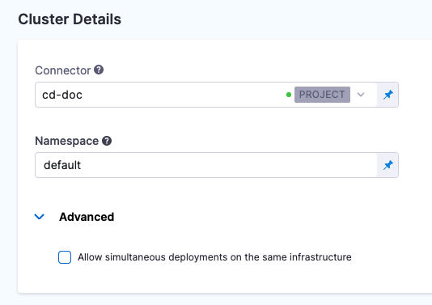

Harness supports [Kustomize](https://kustomize.io/) kustomizations in your Kubernetes deployments. You can use overlays, multibase, plugins, sealed secrets, etc, just as you would in any native kustomization.

This Kustomize tutorial will deploy multiple variants of a simple public Hello World server using a [rolling update strategy](../kubernetes/kubernetes-executions/create-a-kubernetes-rolling-deployment) in Harness.

## Objectives

You'll learn how to:

* Install and launch a Harness Kubernetes Delegate in your target cluster.
* Set up a Kustomize Pipeline.
* Run the new Kustomize Pipeline and deploy an NGINX Docker image to your target cluster.

## Before you begin

Make sure you have the following set up before you begin this quickstart:

* **GitHub account:** this quickstart uses a publicly available kustomization and Docker image. DockerHub allows anonymous connections, but GitHub requires that you log into your account to access their repos.

### Visual summary

<!-- Video:
https://harness-1.wistia.com/medias/j920372crr -->
<docvideo src="https://harness-1.wistia.com/medias/j920372crr" />


### Set up your Kubernetes cluster

You'll need a target Kubernetes cluster for the Harness Delegate and deployment. Ensure your cluster meets the following requirements:

* **Number of nodes:** 2.
* **vCPUs, Memory, Disk Size:** 4vCPUs, 16GB memory, 100GB disk. In GKE, the **e2-standard-4** machine type is enough for this quickstart.
* **Networking:** outbound HTTPS for the Harness connection to **app.harness.io**, **github.com**, and **hub.docker.com**. Allow TCP port 22 for SSH.
* A **Kubernetes service account** with permission to create entities in the target namespace is required. The set of permissions should include `list`, `get`, `create`, and `delete` permissions. In general, the cluster-admin permission or namespace admin permission is enough.  
For more information, see [User-Facing Roles](https://kubernetes.io/docs/reference/access-authn-authz/rbac/#user-facing-roles) from Kubernetes.

## Create the Deploy stage

Pipelines are collections of stages. For this quickstart, we'll create a new Pipeline and add a single stage.

:::note

**Create a Project for your new CD Pipeline:** if you don't already have a Harness Project, create a Project for your new CD Pipeline. Ensure that you add the **Continuous Delivery** module to the Project. See [Create Organizations and Projects](/docs/platform/organizations-and-projects/create-an-organization).

:::


1. In your Harness Project, click **Deployments**, and then click **Create a** **Pipeline**.

   

2. Enter the name **Kustomize Quickstart** and click **Start**.
   Your Pipeline appears.

   

3. Click **Add Stage** and select **Deploy**.
4. Enter the name **Kustomize**, make sure **Service** is selected, and then click **Set Up Stage**.
   The new stage settings appear.
5. In **About the** **Service**, click **New Service**.
    :::note

    Let's take a moment and review Harness Services and Service Definitions (which are explained below). Harness Services represent your microservices/apps logically. You can add the same Service to as many stages are you need. Service Definitions represent your artifacts, manifests, and variables physically. They are the actual files and variable values.  
    
    By separating Services and Service Definitions, you can propagate the same Service across stages while changing the artifacts, manifests, and variables with each stage.

    :::
6.  Give the Service the name **nginx** and click **Save**.

   

Once you have created a Service, it is persistent and can be used throughout the stages of this or any other Pipeline in the Project.

## Add the kustomization

Now we can connect Harness to the repo containing the kustomization. We'll use a publicly available [hellword kustomization](https://github.com/wings-software/harness-docs/tree/main/kustomize/helloWorld) cloned from Kustomize.

All connections and operations are performed by Harness Delegates. So we'll also add a Harness Delegate to your target cluster. You can add the Delegate separately or as part of adding the kustomization files.

1. In **Service Definition**, in **Deployment Type**, click **Kubernetes**.
2. In **Manifests**, click **Add Manifest**.
    :::note

    **What about Artifacts?** In this quickstart the kustomization uses a publicly-available NGINX Docker image from DockerHub, and the location of the image is hardcoded in the manifest. The **Artifacts** section is only used when the public artifact is not hardcoded in the manifest or the repo is private. In those cases, you add the image in **Artifacts** with a Connector for the repo and then reference the image in a Kustomize Patch file (`image: <+artifact.image>`).

    :::
3. In **Specify Manifest Type**, click **Kustomize**, and click **Continue**.

   

4. In **Specify Kustomize Type**, select **GitHub**.
5. Click **New GitHub Connector**.
6. The **Git Connector** settings appear. Enter the following settings.
   * **Name:** enter a name for the Connector.
   * **URL Type:** select **Repository**.
   * **Connection Type:** select **HTTP**.
   * **Git Account URL:** enter `https://github.com/wings-software/harness-docs.git`.
   * **Username and Token:** Enter the username and a Github Personal Access Token for your Github account. You'll have to create a Harness secret for the password.
     * In **Personal Access Token**, click **Create or Select a Secret**.
     * Click **New Secret Text**.
     * In **Secret Name**, enter a name for the secret like **github-pat**.
     * In **Secret Value**, paste in a GitHub Personal access token. When you're logged into GitHub, these are typically listed at <https://github.com/settings/tokens>. For steps on setting up a GitHub PAT, see [Creating a personal access token](https://docs.github.com/en/authentication/keeping-your-account-and-data-secure/creating-a-personal-access-token) from GitHub.
     * Ensure you PAT has the **repo** scope selected:

       
7. Click **Continue**.
8. In **Connect to the provider**, select **Connect through a Harness Delegate**, and then click **Continue**.
   We don't use the **Connect through Harness Platform** option here simply because you'll need a Delegate later for the connection to your target Kubernetes cluster. Typically, the **Connect through Harness Platform** option is a very quick way to make connections without having to use Delegates.

   Expand the section below to learn more about installing delegates.

   <details>
   <summary>Install a new delegate</summary>

    1. In **Delegates Setup**, select **Install new Delegate**. The delegate wizard appears.
    2. In the **New Delegate** dialog, in **Select where you want to install your Delegate**, select **Kubernetes**.
    3. In **Install your Delegate**, select **Kubernetes Manifest**.
    4. Enter a delegate name.
        - Delegate names must be unique within a namespace and should be unique in your cluster. 
        - A valid name includes only lowercase letters and does not start or end with a number. 
        - The dash character (“-”) can be used as a separator between letters.
    5. At a terminal, run the following cURL command to copy the Kuberntes YAML file to the target location for installation.

    `curl -LO https://raw.githubusercontent.com/harness/delegate-kubernetes-manifest/main/harness-delegate.yaml`

    1. Open the `harness-delegate.yaml` file. Find and specify the following placeholder values as described.

    | **Value** | **Description** |
    | :-- | :-- |
    | `PUT_YOUR_DELEGATE_NAME` | Name of the delegate. |
    | `PUT_YOUR_ACCOUNT_ID` | Harness account ID. |
    | `PUT_YOUR_MANAGER_ENDPOINT` | URL of your cluster. See the following table of Harness clusters and endpoints. |
    | `PUT_YOUR_DELEGATE_TOKEN` | Delegate token. To find it, go to **Account Settings** > **Account Resources**, select **Delegate**, and select **Tokens**. For more information on how to add your delegate token to the harness-delegate.yaml file, go to [Secure delegates with tokens](/docs/platform/delegates/secure-delegates/secure-delegates-with-tokens/). |

    Your Harness manager endpoint depends on your Harness SaaS cluster location. Use the following table to find the Harness manager endpoint in your Harness SaaS cluster.

    | **Harness cluster location** | **Harness Manager endpoint** |
    | :-- | :-- |
    | SaaS prod-1 | https://app.harness.io |
    | SaaS prod-2 | https://app.harness.io/gratis |
    | SaaS prod-3 | https://app3.harness.io |

    1. Install the delegate by running the following command:

    `kubectl apply -f harness-delegate.yaml`

    The successful output looks like this.
    
    ```
    namespace/harness-delegate-ng unchanged
    clusterrolebinding.rbac.authorization.k8s.io/harness-delegate-cluster-admin unchanged
    secret/cd-doc-delegate-account-token created
    deployment.apps/cd-doc-delegate created
    service/delegate-service configured
    role.rbac.authorization.k8s.io/upgrader-cronjob unchanged
    rolebinding.rbac.authorization.k8s.io/upgrader-cronjob configured
    serviceaccount/upgrader-cronjob-sa unchanged
    secret/cd-doc-delegate-upgrader-token created
    configmap/cd-doc-delegate-upgrader-config created
    cronjob.batch/cd-doc-delegate-upgrader-job created
    ```

   1. Select **Verify** to make sure that the delegate is installed properly.
   
   </details>

9.  Back in **Set Up Delegates**, you can select the new Delegate.
    In the list of Delegates, you can see your new Delegate and its tags.
10. Select the **Connect using Delegates with the following Tags** option.
11. Enter the tag of the new Delegate and click **Save and Continue**.
    When you are done, the Connector is tested.
12. Click **Continue**.
13. In **Manifest Details**, enter the following settings, test the connection, and click **Submit**.
    We are going to provide connection and path information for a kustomization located at `https://github.com/wings-software/harness-docs/blob/main/kustomize/helloWorld/kustomization.yaml`.
    * **Manifest Identifier:** enter **kustomize**.
    * **Git Fetch Type**: select **Latest from Branch**.
    * **Branch:** enter **main**.
    * **Kustomize Folder Path:** enter `kustomize/helloWorld`. This is the path from the repo root.
    The kustomization is now listed.

    

14. Click **Next** at the bottom of the **Service** tab.

Now that the kustomization is defined, you can define the target cluster for your deployment.

## Define the infrastructure

There is nothing unique about defining the target cluster infrastructure definition for a Kustomize deployment. It is the same process as a typical Harness Kubernetes deployment.

For more information, go to [Define Your Kubernetes Target Infrastructure](/docs/continuous-delivery/deploy-srv-diff-platforms/kubernetes/define-your-kubernetes-target-infrastructure).

### Pre-existing and dynamically provisioned infrastructure

There are two methods of specifying the deployment target infrastructure:

- **Pre-existing**: the target infrastructure already exists and you simply need to provide the required settings.
- **Dynamically provisioned**: the target infrastructure will be dynamically provisioned on-the-fly as part of the deployment process.

For details on Harness provisioning, go to [Provisioning overview](/docs/continuous-delivery/cd-infrastructure/provisioning-overview).

### Define a pre-existing target cluster

The target cluster is your own Kubernetes cluster, hosted in your cloud environment. This is where we will deploy the kustomization and its Docker image.

Harness connects to all of the common cloud platforms and provides a platform-agnostic Kubernetes cluster connection that can connect to Kubernetes anywhere.

1. In **Infrastructure Details**, in **Specify your environment**, click **New Environment**. Just like with a Service, you can create a new Environment or selecting an existing one. We'll create a new one.
2. In **New Environment**, enter a name, select **Non-Production**, and click **Save**. The new Environment appears.
3. In **Infrastructure Definition**, click **Kubernetes**.
    :::note

    Let's take a moment and review Harness Environments and Infrastructure Definitions. Harness Environments represent your deployment targets logically (QA, Prod, etc). You can add the same Environment to as many stages are you need. Infrastructure Definitions represent your target infrastructure physically. They are the actual clusters, hosts, etc.  
    By separating Environments and Infrastructure Definitions, you can use the same Environment in multiple stages while changing the target infrastructure settings with each stage.

    :::
1. An **Infrastructure Definition** is where you specify the target for your deployment. In this case, your Kubernetes cluster and namespace.
2. In **Cluster details**, in **Connector**, click **Select a connector**.
3. Click **New Connector**.
   The Kubernetes Cluster Connector appears.

   

The Kubernetes Cluster Connector is covered in detail [here](/docs/platform/Connectors/Cloud-providers/ref-cloud-providers/kubernetes-cluster-connector-settings-reference), but let's quickly walk through it.

Let's look at the steps:

1. In **Kubernetes Cluster Connector**, in **Name**, enter **Kustomize Quickstart**, and click **Continue**.
2. In **Details**, select **Use the credentials of a specific Harness Delegate**. We will select the Delegate next.

   

3. Click **Continue**.
4. Select the Kubernetes Delegate you added earlier using its Tags, and then click **Save and Continue**.
   Harness verifies the Connector.
5. Click **Finish**.
6. Select the new Connector and then click **Apply Selected**.
7. Back in **Cluster Details**, in **Namespace**, enter the target namespace for the deployment. For example, **default**. You can use any namespace in your target cluster.
8.  When you are done, **Cluster Details** will look something like this:

   

   The target infrastructure is complete. Now we can add our stage steps.
9.  Click **Next**.

## Add a Rollout Deployment step

When you click **Next** the [deployment strategy](/docs/continuous-delivery/manage-deployments/deployment-concepts) options are provided:


1. Click **Rolling**, and then click **Apply**.

The Rollout Deployment step is added. There's nothing to set up. Harness will perform a Kubernetes rolling update in your target cluster automatically.

## Deploy and review

1. Click **Save** and then **Run**.
2. Click **Run Pipeline**. Harness will verify the Pipeline and Connectors and then run the Pipeline.
   There are no artifacts to select because the NGINX artifact is hardcoded in the kustomization.
   You can see the status of the deployment, and pause or abort it.

   

3. Toggle **Console View** to watch the deployment with more detailed logging.Click the **Rollout Deployment** step.

   

4. Expand **Fetch Files** to see Harness fetch the repo, including the kustomization files.
5. In **Initialize** you can see the manifest rendered using the kustomization and then validated with a `kubectl dry run`.
6. Expand **Wait for Steady State**. You will the pods reach steady state:

   `Status : "the-deployment" successfully rolled out`

Congratulations! The deployment was successful.

In your Project's Deployments, you can see the deployment listed:


If you run into any errors, it is typically because the cluster does meet the requirements from [Before You Begin](/docs/continuous-delivery/deploy-srv-diff-platforms/kubernetes/kubernetes-cd-quickstart#before-you-begin) or the cluster's network setting does not allow the Delegate to connect to Docker Hub.

In this tutorial, you learned how to:

* Install and launch a Harness Kubernetes Delegate in your target cluster.
* Connect Harness to your Kubernetes cluster and Git provider.
* Add your kustomization files to Harness.
* Create an Infrastructure Definition that targets your cluster and namespace.
* Add a Kubernetes rolling update.
* Deploy your Kustomize Pipeline to your target cluster.

Next, try the following quickstarts:

* [Kubernetes deployment tutorial](/docs/continuous-delivery/deploy-srv-diff-platforms/kubernetes/kubernetes-cd-quickstart)
* [Helm Chart deployment tutorial](/docs/continuous-delivery/deploy-srv-diff-platforms/helm/helm-cd-quickstart)

### Clean Up

For steps on deleting the Delgate, go to [Delegate a delegate](/docs/platform/Delegates/manage-delegates/delete-a-delegate).

### Next Steps

See [Use Kustomize for Kubernetes Deployments](/docs/continuous-delivery/deploy-srv-diff-platforms/kustomize/use-kustomize-for-kubernetes-deployments) for more details on all the settings and Kustomize support in Harness.

