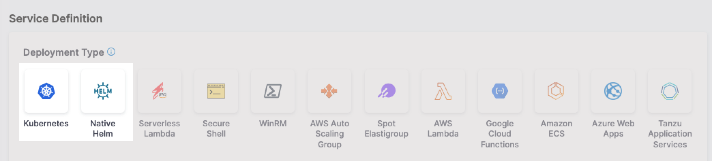

This topic shows you how to perform Native Helm deployments using Harness.

## Kubernetes and Helm vs Native Helm deployments

Harness supports the use of Helm in its Kubernetes deployment type. Harness also includes a separate Native Helm deployment type.

When you create a Harness service, you will see both Kubernetes and Native Helm options and wonder what are their differences.

  

Here are the differences:

```mdx-code-block
import Tabs from '@theme/Tabs';
import TabItem from '@theme/TabItem';
```
```mdx-code-block
<Tabs>
  <TabItem value="Kubernetes" label="Kubernetes" default>
```

- Harness Kubernetes deployments allow you to use your own Kubernetes manifests or a Helm chart (remote or local), and Harness executes the Kubernetes API calls to build everything without requiring a Helm installation in the target cluster.
- Harness Kubernetes deployments also support all deployment strategies (canary, blue green, rolling, custom).
- **Versioning:** Harness Kubernetes deployments version all objects, such as ConfigMaps and Secrets.
- **Rollback:** In the event of deployment failure, Harness Kubernetes deployments will roll back to the last successful version.

```mdx-code-block
  </TabItem>
  <TabItem value="Native Helm" label="Native Helm">
```

- For Harness Native Helm Deployments, you must always have Helm running on one pod in your target cluster.
- You can perform a rolling deployment strategy only (no canary or blue green). 
- **Versioning:** Native Helm does not version deployments.
- **Rollback:** Harness does not perform rollback. Instead, Harness uses Helm's native rollback functionality.

```mdx-code-block
  </TabItem>
</Tabs>
```

### Helm 2 in Native Helm

Helm 2 was deprecated by the Helm community in November 2020 and is no longer supported by Helm. If you continue to maintain the Helm 2 binary on your delegate, it might introduce high and critical vulnerabilities and put your infrastructure at risk.
  
To safeguard your operations and protect against potential security vulnerabilities, Harness deprecated the Helm 2 binary from delegates with an immutable image type (image tag `yy.mm.xxxxx`). For information on delegate types, go to [Delegate image types](/docs/platform/delegates/delegate-concepts/delegate-image-types).

If your delegate is set to auto-upgrade, Harness will automatically remove the binary from your delegate. This will result in pipeline and workflow failures for services deployed via Helm 2. 

:::info note
If your development team still uses Helm 2, you can reintroduce the binary on the delegate. Harness is not responsible for any vulnerabilities or risks that might result from reintroducing the Helm 2 binary.
:::

For more information about updating your delegates to reintroduce Helm 2, go to:

- [Delegate automatic upgrades and expiration policy](/docs/platform/delegates/install-delegates/delegate-upgrades-and-expiration/)

- [Install a delegate with third-party tool custom binaries](/docs/platform/delegates/install-delegates/install-a-delegate-with-3-rd-party-tool-custom-binaries/)

Contact [Harness Support](mailto:support@harness.io) if you have any questions.


## Deployment requirements

A Native Helm deployment requires the following:

* Helm chart.
* Kubernetes cluster.
* A **Kubernetes service account** with permission to create entities in the target namespace is required. The set of permissions should include `list`, `get`, `create`, and `delete` permissions. In general, the cluster-admin permission or namespace admin permission is enough.  
For more information, go to [User-Facing Roles](https://kubernetes.io/docs/reference/access-authn-authz/rbac/#user-facing-roles) from Kubernetes.

## Native Helm deploy stage

The following steps take you through a typical Native Helm pipeline stage setup to demonstrate the Harness settings involved.

:::note

**Create a Project for your new CD Pipeline:** If you don't already have a Harness Project, create a Project for your new CD Pipeline. Ensure that you add the **Continuous Delivery** module to the Project. Go to [Create Organizations and Projects](/docs/platform/organizations-and-projects/create-an-organization).

:::

1. In your Harness Project, select **Deployments**, and then select **Create a Pipeline**.
2. Enter a name like **Native Helm Example** and select **Start**.
3. Your Pipeline appears.
4. Select **Add Stage** and select **Deploy**.
5. Enter a name like **quickstart**.
6. In **Deployment Type**, select **Native Helm**, and then select **Set Up Stage**.
7. In **Select Service**, select **Add Service**. 
8.  Give the service a name.
   
   Once you have created a Service, it is persistent and can be used throughout the stages of this or any other Pipeline in the Project.

Next, we'll add the NGINX Helm chart for the deployment.

## Add a Helm chart to a Native Helm service

To add a Helm chart in this example, we will add a Harness connector to the HTTP server hosting the chart. This connector uses a Harness Delegate to verify credentials and pull charts. Ensure you have a Harness Delegate installed also. For steps on installing a delegate, go to [Delegate installation overview](/docs/platform/Delegates/install-delegates/overview).

1. In the Harness service for your Native Helm deployment, in **Manifests**, select **Add Manifest**.

   You can select a Helm Values YAML file or a Helm chart. For this example, we'll use a publicly available Helm chart.
   The process isn't very different between these options. For Values YAML, you simply provide the Git branch and path to the Values YAML file.
   
2. Select **Helm Chart**, and then select **Continue**.
3. In **Specify Helm Chart Store**, select **HTTP Helm**.
   In this example, we're pulling a Helm chart for NGINX from the Bitnami repo at `https://charts.bitnami.com/bitnami`. You don't need any credentials for pulling this public chart.
4. Select **New HTTP Helm Repo Connector**.
5. In the **HTTP Helm Repo Connector**, enter a name and select **Continue**.
6. In **Helm Repository URL**, enter `https://charts.bitnami.com/bitnami`.
7. In **Authentication**, select **Anonymous**.
8. Select **Continue**.
9. In **Delegates Setup**, select/create a delegate, and then select **Save and Continue**.
    
    For steps on installing a delegate, go to [Delegate installation overview](/docs/platform/Delegates/install-delegates/overview).

    When you are done, the Connector is tested. If it fails, your Delegate might not be able to connect to `https://charts.bitnami.com/bitnami`. Review its network connectivity and ensure it can connect.  
    If you are using Helm v2, you will need to install Helm v2 and Tiller on the delegate pod. For steps on installing software on the delegate, go to [Build custom delegate images with third-party tools](/docs/platform/Delegates/install-delegates/build-custom-delegate-images-with-third-party-tools).
10. In **Manifest Details**, enter the following settings can select **Submit**.
   * **Manifest Identifier**: enter **nginx**.
   * **Chart Name**: enter **nginx**.
   * **Chart Version**: enter **8.8.1**.
   * **Helm Version**: select **Version 3**.

The Helm chart is added to the Service Definition.


Next, you can target your Kubernetes cluster for deployment.

### Using multiple Helm charts in a single Harness service

import HelmMultiManifests from '/docs/continuous-delivery/shared/multiple-helm-charts.md';

<HelmMultiManifests name="helmmultimanifests" />

## Define the target Native Helm infrastructure

Defining the target cluster infrastructure definition for a Native Helm chart deployment is the same process as a typical Harness Kubernetes deployment.

For more information, go to [Define Your Kubernetes Target Infrastructure](/docs/continuous-delivery/deploy-srv-diff-platforms/kubernetes/define-your-kubernetes-target-infrastructure).

### Pre-existing and dynamically provisioned infrastructure

There are two methods of specifying the deployment target infrastructure:

- **Pre-existing**: the target infrastructure already exists and you simply need to provide the required settings.
- **Dynamically provisioned**: the target infrastructure will be dynamically provisioned on-the-fly as part of the deployment process.

For details on Harness provisioning, go to [Provisioning overview](/docs/continuous-delivery/cd-infrastructure/provisioning-overview).

### Define your pre-existing target cluster

1. In **Infrastructure**, in **Environment**, select **New Environment**.
2. In **Name**, enter **quickstart**, select **Non-Production**, and select **Save**.
3. In **Infrastructure Definition**, select the **Kubernetes**.
4. In **Cluster Details**, select **Select Connector**. We'll create a new Kubernetes connector to your target platform. We'll use the same Delegate you installed earlier.
5. Select **New Connector**.
6. Enter a name for the Connector and select **Continue**.
7. In **Details**, select **Use the credentials of a specific Harness Delegate**, and then select **Continue**.
   
8. In **Set Up Delegates**, select the Delegate you added earlier by entering one of its Tags.
9.  Select **Save and Continue**. The Connector is tested. Select **Finish**.
10. Select the new Connector and select **Apply Selector**.
11. In **Namespace**, enter **default** or the namespace you want to use in the target cluster.
12. In **Release Name**, enter **quickstart**.
13. Select **Next**. The deployment strategy options appear.

## Add a Helm Deployment step

In this example, we're going to use a Rolling [deployment strategy](/docs/continuous-delivery/manage-deployments/deployment-concepts).

1. Select **Rolling**, and select **Apply**.
2. The **Helm Deployment** step is added to **Execution**.

That's it. Now you're ready to deploy.

## Deploy and review

1. Select **Save** to save your pipeline.
2. Select **Run**.
3. Select **Run Pipeline**.

   Harness verifies the connections and then runs the Pipeline.
4. Toggle **Console View** to watch the deployment with more detailed logging.

   

5. Select the **Helm Deployment** step and expand **Wait for Steady State**.

You can see `Status : quickstart-quickstart deployment "quickstart-quickstart" successfully rolled out.`

Congratulations! The deployment was successful.

In your project's **Deployments**, you can see the deployment listed.

## Spec requirements for steady state check and versioning

Harness requires that the `release` label be used in **every** Kubernetes spec to ensure that Harness can identify a release, check its steady state, and perform verification and rollback on it.

Ensure that the `release` label is in every Kubernetes object's manifest. If you omit the `release` label from a manifest, Harness cannot track it.

The [Helm built-in Release object](https://helm.sh/docs/chart_template_guide/builtin_objects/) describes the release and allows Harness to identify each release. For this reason, the `harness.io/release: {{ .Release.Name }}` label must be used in your Kubernetes spec.

See these Service and Deployment object examples:

```go
{{- if .Values.env.config}}  
apiVersion: apps/v1  
kind: Deployment  
metadata:  
  name: {{ template "todolist.fullname" . }}  
  labels:  
    app: {{ template "todolist.name" . }}  
    chart: {{ template "todolist.chart" . }}  
    release: "{{ .Release.Name }}"  
    harness.io/release: {{ .Release.Name }}  
    heritage: {{ .Release.Service }}  
spec:  
  replicas: {{ .Values.replicaCount }}  
  selector:  
    matchLabels:  
      app: {{ template "todolist.name" . }}  
      release: {{ .Release.Name }}  
  template:  
    metadata:  
      labels:  
        app: {{ template "todolist.name" . }}  
        release: {{ .Release.Name }}  
        harness.io/release: {{ .Release.Name }}  
    spec:  
      {{- if .Values.dockercfg}}  
      imagePullSecrets:  
      - name: {{.Values.name}}-dockercfg  
      {{- end}}  
      containers:  
        - name: {{ .Chart.Name }}  
          image: {{.Values.image}}  
          imagePullPolicy: {{ .Values.pullPolicy }}  
          {{- if or .Values.env.config .Values.env.secrets}}  
          envFrom:  
          {{- if .Values.env.config}}  
          - configMapRef:  
              name: {{.Values.name}}  
          {{- end}}  
          {{- if .Values.env.secrets}}  
          - secretRef:  
              name: {{.Values.name}}  
          {{- end}}  
          {{- end}}  
...  
apiVersion: v1  
kind: Service  
metadata:  
  name: {{ template "todolist.fullname" . }}  
  labels:  
    app: {{ template "todolist.name" . }}  
    chart: {{ template "todolist.chart" . }}  
    release: {{ .Release.Name }}  
    heritage: {{ .Release.Service }}  
spec:  
  type: {{ .Values.service.type }}  
  ports:  
    - port: {{ .Values.service.port }}  
      targetPort: http  
      protocol: TCP  
      name: http  
  selector:  
    app: {{ template "todolist.name" . }}  
    release: {{ .Release.Name }}
```

The **Release name** setting in the stage **Infrastructure** is used as the Helm Release Name to identify and track the deployment per namespace:


## Native Helm notes

Please review the following notes.

### Ignore release history failed status

By default, if the latest Helm release failed, Harness does not proceed with the install/upgrade and throws an error.

For example, let's say you have a Pipeline that performs a Native Helm deployment and it fails during execution while running `helm upgrade` because of a timeout error from an etcd server.

You might have several retries configured in the Pipeline, but all of them will fail when Harness runs a `helm history` in the prepare stage with the message: `there is an issue with latest release <latest release failure reason>`.

Enable the **Ignore Release History Failed Status** option to have Harness ignore these errors and proceed with install/upgrade.

## Next Steps

See [Kubernetes How-tos](/docs/category/kubernetes) for other deployment features.

