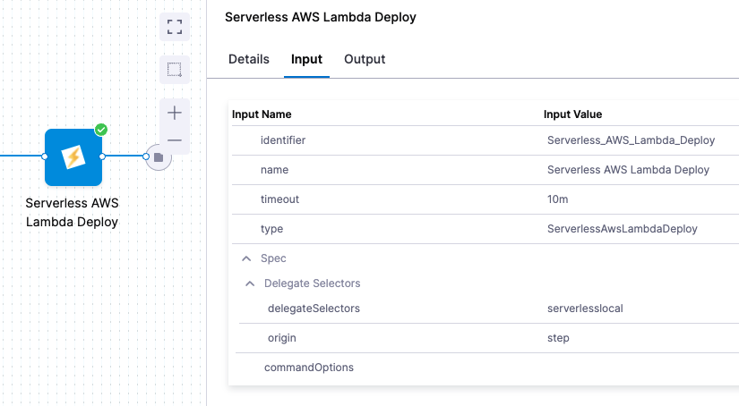

```mdx-code-block
import Tabs from '@theme/Tabs';
import TabItem from '@theme/TabItem';
```

# Serverless.com framework for AWS Lambda deployments

This topic shows you how to deploy a Serverless Lambda application to AWS Lambda using Harness. 

In this topic, we'll use a publicly-available serverless.yaml and artifact and deploy them to your AWS Lambda service using a Harness Pipeline.

New to Serverless.com Framework? See [Tutorial: Your First Serverless Framework Project](https://www.serverless.com/framework/docs/tutorial) from Serverless.

## Overview

Setting up a Serverless Lambda application involves the following steps:

1. Add a serverless.yaml file and ZIP artifact to a Harness Pipeline stage.
2. Define your AWS Lambda service as the deployment target.
3. Deploy the Serverless application to Lambda.

### Visual summary
<!-- Video:
https://harness-1.wistia.com/medias/tnjairdt6m-->
<docvideo src="https://harness-1.wistia.com/medias/tnjairdt6m" />

## Containerized and non-containerized

:::note

Currently, containerized Serverless Lambda support is behind the feature flag `CDS_SERVERLESS_V2`. Contact [Harness Support](mailto:support@harness.io) to enable the feature.

:::

You have two options for deploying a Serverless.com Framework Lambda application:

- **Containerized:** Deploy your Serverless Lambda application in Harness using containerized steps that allow you to select the Serverless image to use for each step.
  
  For more information containerized step groups, go to [Containerize step groups](/docs/continuous-delivery/x-platform-cd-features/cd-steps/containerized-steps/containerized-step-groups).
- **Non-containerized:** Deploy your Serverless Lambda application in Harness using one or more Serverless versions running on one or more Harness delegates.

You select whether to use a containerized or non-containerized method in the **Execution** section of the your pipeline Deploy stage. This topic covers both methods.

<details>
<summary>Why containerized?</summary>

Not all teams use the same version of the Serverless.com framework. Also, teams use different versions of Serverless packages. This can result in different versions being installed on different delegates, and requires that users select which delegate to use via delegate tags. 

Rather than installing and cleaning up the various Serverless versions on delegates, you can use containerized steps to spin up a fresh container with parameters like:

- Serverless.com version.
- Serverless plugins.
- Jobs execution using Serverless.

Once a containerized step is run, Harness terminates the container.

</details>


## Before you begin

Review [Harness Key Concepts](/docs/getting-started/learn-harness-key-concepts) to establish a general understanding of Harness.
* **GitHub account:** this quickstart uses a publicly available serverless.yaml file, but GitHub requires that you use a GitHub account for fetching files.
* **(Non-containerized) Harness Delegate with Serverless installed:** the Harness Delegate is a worker process that performs all deployment tasks. Typically, you will install a Kubernetes delegate in your own cluster.
	+ You can use a cluster hosted on a cloud platform or run one in minikube using Docker Desktop locally. The installation steps are the same.
	+ The Delegate pod(s) must have Serverless installed. We'll add the Serverless installation script using the delegate environment variable `INIT_SCRIPT` to the delegate YAML file later in this quickstart.
* **(Containerized) Kubernetes cluster and namespace where each container will run:** Each containerized step will run in a Kubernetes cluster you provide.
* **AWS User account with required policy:** Serverless deployments require an AWS User with specific AWS permissions, as described in [AWS Credentials](https://www.serverless.com/framework/docs/providers/aws/guide/credentials) from Serverless.com. To create the AWS User, do the following:
	+ Log into your AWS account and go to the Identity & Access Management (IAM) page.
	+ Click **Users**, and then **Add user**. Enter a name. Enable **Programmatic access** by clicking the checkbox. Click **Next** to go to the **Permissions** page. Do one of the following:
    - View and copy the API Key and Secret to a temporary place. You'll need them when setting up the Harness AWS Connector later in this quickstart.
		- **Full Admin Access:** click on **Attach existing policies directly**. Search for and select **AdministratorAccess** then click **Next: Review**. Check to make sure everything looks good and click **Create user**.
		- **Limited Access:** click on **Create policy**. Select the **JSON** tab, and add the JSON using the following code from the [Serverless gist](https://gist.github.com/ServerlessBot/7618156b8671840a539f405dea2704c8) IAMCredentials.json:

<details>
<summary>IAMCredentials.json</summary>

```json
{  
 "Statement": [  
     {  
         "Action": [  
             "apigateway:*",  
             "cloudformation:CancelUpdateStack",  
             "cloudformation:ContinueUpdateRollback",  
             "cloudformation:CreateChangeSet",  
             "cloudformation:CreateStack",  
             "cloudformation:CreateUploadBucket",  
             "cloudformation:DeleteStack",  
             "cloudformation:Describe*",  
             "cloudformation:EstimateTemplateCost",  
             "cloudformation:ExecuteChangeSet",  
             "cloudformation:Get*",  
             "cloudformation:List*",  
             "cloudformation:UpdateStack",  
             "cloudformation:UpdateTerminationProtection",  
             "cloudformation:ValidateTemplate",  
             "dynamodb:CreateTable",  
             "dynamodb:DeleteTable",  
             "dynamodb:DescribeTable",  
             "dynamodb:DescribeTimeToLive",  
             "dynamodb:UpdateTimeToLive",  
             "ec2:AttachInternetGateway",  
             "ec2:AuthorizeSecurityGroupIngress",  
             "ec2:CreateInternetGateway",  
             "ec2:CreateNetworkAcl",  
             "ec2:CreateNetworkAclEntry",  
             "ec2:CreateRouteTable",  
             "ec2:CreateSecurityGroup",  
             "ec2:CreateSubnet",  
             "ec2:CreateTags",  
             "ec2:CreateVpc",  
             "ec2:DeleteInternetGateway",  
             "ec2:DeleteNetworkAcl",  
             "ec2:DeleteNetworkAclEntry",  
             "ec2:DeleteRouteTable",  
             "ec2:DeleteSecurityGroup",  
             "ec2:DeleteSubnet",  
             "ec2:DeleteVpc",  
             "ec2:Describe*",  
             "ec2:DetachInternetGateway",  
             "ec2:ModifyVpcAttribute",  
             "events:DeleteRule",  
             "events:DescribeRule",  
             "events:ListRuleNamesByTarget",  
             "events:ListRules",  
             "events:ListTargetsByRule",  
             "events:PutRule",  
             "events:PutTargets",  
             "events:RemoveTargets",  
             "iam:AttachRolePolicy",  
             "iam:CreateRole",  
             "iam:DeleteRole",  
             "iam:DeleteRolePolicy",  
             "iam:DetachRolePolicy",  
             "iam:GetRole",  
             "iam:PassRole",  
             "iam:PutRolePolicy",  
             "iot:CreateTopicRule",  
             "iot:DeleteTopicRule",  
             "iot:DisableTopicRule",  
             "iot:EnableTopicRule",  
             "iot:ReplaceTopicRule",  
             "kinesis:CreateStream",  
             "kinesis:DeleteStream",  
             "kinesis:DescribeStream",  
             "lambda:*",  
             "logs:CreateLogGroup",  
             "logs:DeleteLogGroup",  
             "logs:DescribeLogGroups",  
             "logs:DescribeLogStreams",  
             "logs:FilterLogEvents",  
             "logs:GetLogEvents",  
             "logs:PutSubscriptionFilter",  
             "s3:GetBucketLocation",  
             "s3:CreateBucket",  
             "s3:DeleteBucket",  
             "s3:DeleteBucketPolicy",  
             "s3:DeleteObject",  
             "s3:DeleteObjectVersion",  
             "s3:GetObject",  
             "s3:GetObjectVersion",  
             "s3:ListAllMyBuckets",  
             "s3:ListBucket",  
             "s3:PutBucketNotification",  
             "s3:PutBucketPolicy",  
             "s3:PutBucketTagging",  
             "s3:PutBucketWebsite",  
             "s3:PutEncryptionConfiguration",  
             "s3:PutObject",  
             "sns:CreateTopic",  
             "sns:DeleteTopic",  
             "sns:GetSubscriptionAttributes",  
             "sns:GetTopicAttributes",  
             "sns:ListSubscriptions",  
             "sns:ListSubscriptionsByTopic",  
             "sns:ListTopics",  
             "sns:SetSubscriptionAttributes",  
             "sns:SetTopicAttributes",  
             "sns:Subscribe",  
             "sns:Unsubscribe",  
             "states:CreateStateMachine",  
             "states:DeleteStateMachine"  
         ],  
         "Effect": "Allow",  
         "Resource": "*"  
     }  
 ],  
 "Version": "2012-10-17"  
}
```
The `s3:GetBucketLocation` action is required for a custom S3 bucket only.

</details>
    


## Serverless framework support

* Harness supports Serverless framework 1.82 and later.
* Harness supports Serverless framework CLI versions 2.x.x and 3.x.x.
* Harness supports all language runtimes that Serverless supports.
* Harness supports ZIP files and Docker image artifacts only.
	+ ZIP files are supported with JFrog Artifactory.
	+ Docker images are supported with AWS ECR.

### Containerized step images

Currently, for the containerized Serverless steps Harness provides, the base images Harness provides on Docker Hub have Node version 12.20.0 and Serverless version 3.30.1 installed. These are Linux AMD64 images.

## Create the Deploy stage

Pipelines are collections of stages. For this quickstart, we'll create a new Pipeline and add a single stage.

:::note

**Create a Project for your new CD Pipeline:** if you don't already have a Harness Project, create a Project for your new CD Pipeline. Make sure that you add the **Continuous Delivery** module to the Project. See [Create Organizations and Projects](/docs/platform/organizations-and-projects/create-an-organization).

:::

1. In your Harness Project, click **Deployments**, and then click **Create a** **Pipeline**.
2. Enter the name **Serverless Quickstart** and click **Start**. Your Pipeline appears.
3. Click **Add Stage** and select **Deploy**.
4. Enter the name **Deploy Service**, make sure **Service** is selected, and then click **Set Up Stage**.

   
   
   The new stage settings appear.
5. In **About the** **Service**, click **New Service**.
6. Give the Service the name **quickstart** and click **Save**.


:::note

Let's take a moment and review Harness Services and Service Definitions (which are explained below). A Harness Service represents your microservice/app logically.  
You can add the same Service to as many stages as you need. Service Definitions represent your artifacts, manifests, and variables physically. They are the actual files and variable values.  
By separating Services and Service Definitions, you can propagate the same Service across stages while changing the artifacts, manifests, and variables with each stage.

::: 

Once you have created a Service, it's persistent and you can use it throughout the stages of this or any other Pipeline in the Project.

## Add the manifest

Next, we can add a serverless.yaml for our deployment. We'll use [the publicly-available serverless.yaml file](https://github.com/wings-software/harness-docs/tree/main/serverless/artifacts) available from Harness.

1. In **Service Definition**, in **Deployment Type**, click **Serverless Lambda**.
2. In **Manifests**, click **Add Manifest**.
3. Select **Serverless Lambda Manifest**, and click **Continue**.
4. In **Specify Serverless Lambda Manifest Store**, click **GitHub**, and then click **New GitHub Connector**.
   The **Git Connector** settings appear. Enter the following settings.
   * **Name:** `serverless`.
   * **URL Type:** `Repository`.
   * **Connection Type:** `HTTP`.
   * **GitHub Repository URL:** `https://github.com/wings-software/harness-docs.git`.
   * **Username:** Enter your GitHub account username.
   * In **Personal Access Token**, click **Create or Select a Secret**.
     * Click **New Secret Text**.
     * In **Secret Name**, enter a name for the secret like **github-pat**.
     * In **Secret Value**, paste in a GitHub Personal access token.When you're logged into GitHub, these tokens are listed at <https://github.com/settings/tokens>. For steps on setting up a GitHub PAT, see [Creating a personal access token](https://docs.github.com/en/authentication/keeping-your-account-and-data-secure/creating-a-personal-access-token) from GitHub.
     * Make sure your PAT has the **repo** scope selected:

	
5. Select **Connect through Harness Platform**.
6. Click **Finish**.
7. Back in **Specify Serverless Lambda Manifest Store**, click **Continue**.
8. In **Manifest Details**, enter the following.
   * **Manifest Identifier:** `serverless`.
   * **Git Fetch Type:** `Latest from Branch`.
   * **Branch:** `main`.
   * **Folder Path:** `serverless/artifacts`.
   * In **Advanced**, you can see **Serverless Config File Path**. Use this setting when your Serverless manifest isn't named `serverless.yml|.yaml|.js|.json`. This option is the same as the `--config` option in `serverless deploy`. See [AWS - deploy](https://www.serverless.com/framework/docs/providers/aws/cli-reference/deploy) from Serverless.
  
You can see the serverless.yaml manifest in Harness.


Here's what the serverless.yaml looks like:

```yaml
service: <+service.name>  
frameworkVersion: '2 || 3'  
  
provider:  
  name: aws  
  runtime: nodejs12.x  
functions:  
  hello:  
    handler: handler.hello  
    events:  
      - httpApi:  
          path: /tello  
          method: get    
package:  
  artifact: <+artifact.path>          
plugins:  
  - serverless-deployment-bucket@latest
```

You can see the [Harness expression](/docs/platform/Variables-and-Expressions/harness-variables) `<+artifact.path>` in `artifact: <+artifact.path>`. The expression `<+artifact.path>` tells Harness to get the artifact from **Artifacts** section of the Service. We'll add the artifact next.

The expression `<+service.name>` simply uses the Harness Service name for the deployed service name.

For Docker images, you use the expression `<+artifact.image>`.

## Add the artifact

Currently, Harness supports ZIP file artifacts only. Harness doesn't support Docker images yet.Next, we'll add a publicly-available artifact to your Service. The artifact is a zip file with a JavaScript function hosted in Artifactory.

We'll add a new Artifactory Connector and install a Harness Kubernetes Delegate in a Kubernetes cluster. The Delegate is a worker process that performs the deployment operations. The Delegate will use the URL and credentials you provide in the Connector to connect to Artifactory and fetch the artifact at runtime.

1. In **Artifact**, click **Add Primary**.
2. In **Specify Artifact Repository Type**, click **Artifactory**, and click **Continue.**
3. In **Artifactory Repository**, click **New Artifactory Connector**.
4. In **Create or Select an Existing Connector**, click **New Artifactory Connector**.
5. Enter a name for the Connector, such as **JFrog Serverless**. Click **Continue**.
6. In **Details**, in **Artifactory Repository URL**, enter `https://harness.jfrog.io/artifactory/`.
7. In **Authentication**, select **Anonymous**.
   
   

8. In **Connect to the provider**, select **Connect through a Harness Delegate**, and then select **Continue**.
   We don't recommend using the **Connect through Harness Platform** option here because you'll need a delegate later for connecting to your target environment. Typically, the **Connect through Harness Platform** option is a quick way to make connections without having to use delegates.

   Expand the section below to learn more about installing delegates.

   <details>
   <summary>Install a new delegate</summary>

    1. In **Delegates Setup**, select **Install new Delegate**. The delegate wizard appears.
    2. In the **New Delegate** dialog, in **Select where you want to install your Delegate**, select **Kubernetes**.
    3. In **Install your Delegate**, select **Kubernetes Manifest**.
    4. Enter a delegate name.
        - Delegate names must be unique within a namespace and should be unique in your cluster. 
        - A valid name includes only lowercase letters and does not start or end with a number. 
        - The dash character (“-”) can be used as a separator between letters.
    5. At a terminal, run the following cURL command to copy the Kuberntes YAML file to the target location for installation.

    `curl -LO https://raw.githubusercontent.com/harness/delegate-kubernetes-manifest/main/harness-delegate.yaml`

    6. Open the `harness-delegate.yaml` file. Find and specify the following placeholder values as described.

    | **Value** | **Description** |
    | :-- | :-- |
    | `PUT_YOUR_DELEGATE_NAME` | Name of the delegate. |
    | `PUT_YOUR_ACCOUNT_ID` | Harness account ID. |
    | `PUT_YOUR_MANAGER_ENDPOINT` | URL of your cluster. See the following table of Harness clusters and endpoints. |
    | `PUT_YOUR_DELEGATE_TOKEN` | Delegate token. To find it, go to **Account Settings** > **Account Resources**, select **Delegate**, and select **Tokens**. For more information on how to add your delegate token to the harness-delegate.yaml file, go to [Secure delegates with tokens](/docs/platform/delegates/secure-delegates/secure-delegates-with-tokens/). |

    Your Harness manager endpoint depends on your Harness SaaS cluster location. Use the following table to find the Harness manager endpoint in your Harness SaaS cluster.

    | **Harness cluster location** | **Harness Manager endpoint** |
    | :-- | :-- |
    | SaaS prod-1 | https://app.harness.io |
    | SaaS prod-2 | https://app.harness.io/gratis |
    | SaaS prod-3 | https://app3.harness.io |

    7. Install the delegate by running the following command:

    `kubectl apply -f harness-delegate.yaml`

    The successful output looks like this.
    
    ```
    namespace/harness-delegate-ng unchanged
    clusterrolebinding.rbac.authorization.k8s.io/harness-delegate-cluster-admin unchanged
    secret/cd-doc-delegate-account-token created
    deployment.apps/cd-doc-delegate created
    service/delegate-service configured
    role.rbac.authorization.k8s.io/upgrader-cronjob unchanged
    rolebinding.rbac.authorization.k8s.io/upgrader-cronjob configured
    serviceaccount/upgrader-cronjob-sa unchanged
    secret/cd-doc-delegate-upgrader-token created
    configmap/cd-doc-delegate-upgrader-config created
    cronjob.batch/cd-doc-delegate-upgrader-job created
    ```

   8. Select **Verify** to make sure that the delegate is installed properly.
   
   </details>

9. Back in **Set Up Delegates**, in the list of Delegates, you can see your new Delegate and its tags.
10. Select the **Connect using Delegates with the following Tags** option.
11. Enter the tag of the new Delegate and click **Save and Continue**.
   
   

12. In **Connection Test**, you can see that the connection is successful. Click **Finish**.
   
   


### Install Serverless on the delegate

For a **non-containerized** execution, you need to edit the YAML to install Serverless when the delegate pods are created.

1. Open the delegate YAML in a text editor.
2. Locate the Environment variable `INIT_SCRIPT` in the `StatefulSet` (Legacy Delegate) or `Deployment` (Harness Delegate) object:
	```yaml
	...  
			- name: INIT_SCRIPT  
			value: ""  
	...
	```
1. Replace the value with the following Serverless installation script (the Harness Delegate uses the Red Hat Universal Base Image (UBI)).
	
	Here's an example using microdnf and npm:
	
	```yaml
	...  
        - name: INIT_SCRIPT  
        value: |-  
            #!/bin/bash
            
            # Install Node.js and npm on the Red Hat UBI image using Microdnf
            microdnf install -y nodejs
            
            # Install the Serverless Framework using npm
            npm install -g serverless@2.50.0 
	...
	
	```

	Here's an example using yum and npm:
	
	```yaml
	...  
        - name: INIT_SCRIPT  
        value: |-  
            #!/bin/bash

            # Install Node.js and npm on the Red Hat UBI image
            yum install -y nodejs

            # Install the Serverless Framework using npm
            npm install -g serverless@2.50.0
	...	
	
	```

In cases when the Delegate OS doesn't support `apt` (Red Hat Linux), you can edit this script to install `npm`. The rest of the code should remain the same. If you are using Harness Delegate, the base image is Red Hat UBI.Save the YAML file as **harness-delegate.yml**.	
   
### Add the artifact

1. Back in **Artifactory Repository**, click **Continue**.
2. Enter the following artifact settings and click **Submit**. The following image shows how the Artifactory settings correspond to **Artifact Details**.
   * **Repository:** `lambda`.
   * **Artifact Directory:** `serverless`.
   * **Artifact Details:** `Value`.
   * **Artifact Path:** `handler.zip`.
	When you click one of the settings, the Delegate fetches artifact metadata from Artifactory.
1. Click **Submit**.

	The artifact is now in the Service.

	

2. Click **Continue** to view the **Infrastructure**.

Now that you have configured the Service, we can define the target for our deployment.​

## Define the infrastructure

You define the target infrastructure for your deployment in the **Environment** settings of the pipeline stage. You can define an environment separately and select it in the stage, or create the environment within the stage **Environment** tab.

There are two methods of specifying the deployment target infrastructure:

- **Pre-existing**: the target infrastructure already exists and you simply need to provide the required settings.
- **Dynamically provisioned**: the target infrastructure will be dynamically provisioned on-the-fly as part of the deployment process.

For details on Harness provisioning, go to [Provisioning overview](/docs/continuous-delivery/cd-infrastructure/provisioning-overview).

### Pre-existing infrastructure

1. In **Infrastructure**, we'll add an AWS Connector to connect Harness with your Lambda service.
2. In **Infrastructure Details**, in **Specify your environment**, click **New Environment**. Just like with a Service, you can create a new Environment or select an existing one. We'll create a new one.
3. In **New Environment**, enter a name, select **Pre-Production**, and click **Save**. The new Environment appears.
4. In **Infrastructure Definition**, click **AWS**.
5. In **Amazon Web Services Details**, click in **Connector**.
6. In **Create or Select an Existing Connector**, click **New Connector**.
7. Enter the following and click **Save and Continue**.
	* **Name:** `AWS Serverless`.
	* **Credentials:** `AWS Access Key`. Enter the AWS access key for the AWS User you created with the required policies in [Before You Begin](#before-you-begin).
	* Enter the secret key as a [Harness Text Secret](/docs/platform/Secrets/add-use-text-secrets). The Harness Delegate uses these credentials to authenticate Harness with AWS at deployment runtime.
	* **Delegates Setup:** `Only use Delegates with all of the following tags`.
	* Select the Delegate you added earlier in this quickstart.
1. The **Connection Test** verifies the connection. Click **Finish**.
2. Back in **Amazon Web Services Details**, in **Region**, enter the region for your AWS Lambda service, such as **us-east-1**.
3. In **Stage**, enter the name of the stage in your service that you want to deploy to, such as **dev**. This is the same as the `--stage` option in the `serverless deploy` command.
   
   
   
   When you run your deployment, you'll see these settings used in the logs. For example: `serverless deploy list --stage dev --region us-east-1`.
4. Click **Continue**. The **Execution** steps appear.

### Dynamically provisioned infrastructure

:::note

Currently, the dynamic provisioning documented in this topic is behind the feature flag `CD_NG_DYNAMIC_PROVISIONING_ENV_V2`. Contact [Harness Support](mailto:support@harness.io) to enable the feature.

:::

Here is a summary of the steps to dynamically provision the target infrastructure for a deployment:

1. **Add dynamic provisioning to the CD stage**:
   1. In a Harness Deploy stage, in **Environment**, enable the option **Provision your target infrastructure dynamically during the execution of your Pipeline**.
   2. Select the type of provisioner that you want to use.
   
      Harness automatically adds the provisioner steps for the provisioner type you selected.
   3. Configure the provisioner steps to run your provisioning scripts.
   4. Select or create a Harness infrastructure in **Environment**.
2. **Map the provisioner outputs to the Infrastructure Definition**:
   1. In the Harness infrastructure, enable the option **Map Dynamically Provisioned Infrastructure**.
   2. Map the provisioning script/template outputs to the required infrastructure settings.

#### Supported provisioners

The following provisioners are supported for Serverless.com Framework Lambda deployments:

- Terraform
- Terragrunt
- Terraform Cloud
- CloudFormation
- Shell Script

#### Adding dynamic provisioning to the stage

To add dynamic provisioning to a Harness pipeline Deploy stage, do the following:

1. In a Harness Deploy stage, in **Environment**, enable the option **Provision your target infrastructure dynamically during the execution of your Pipeline**.
2. Select the type of provisioner that you want to use.
   
   Harness automatically adds the necessary provisioner steps.
3. Set up the provisioner steps to run your provisioning scripts.

For documentation on each of the required steps for the provisioner you selected, go to the following topics:

- Terraform:
  - [Terraform Plan](/docs/continuous-delivery/cd-infrastructure/terraform-infra/run-a-terraform-plan-with-the-terraform-plan-step)
  - [Terraform Apply](/docs/continuous-delivery/cd-infrastructure/terraform-infra/run-a-terraform-plan-with-the-terraform-apply-step)
  - [Terraform Rollback](/docs/continuous-delivery/cd-infrastructure/terraform-infra/rollback-provisioned-infra-with-the-terraform-rollback-step). To see the Terraform Rollback step, toggle the **Rollback** setting.
- [Terragrunt](/docs/continuous-delivery/cd-infrastructure/terragrunt-howtos)
- [Terraform Cloud](/docs/continuous-delivery/cd-infrastructure/terraform-infra/terraform-cloud-deployments)
- CloudFormation:
  - [Create Stack](/docs/continuous-delivery/cd-infrastructure/cloudformation-infra/provision-with-the-cloud-formation-create-stack-step)
  - [Delete Stack](/docs/continuous-delivery/cd-infrastructure/cloudformation-infra/remove-provisioned-infra-with-the-cloud-formation-delete-step)
  - [Rollback Stack](/docs/continuous-delivery/cd-infrastructure/cloudformation-infra/rollback-provisioned-infra-with-the-cloud-formation-rollback-step). To see the Rollback Stack step, toggle the **Rollback** setting.
- [Shell Script](/docs/continuous-delivery/cd-infrastructure/shell-script-provisioning)


#### Mapping provisioner output

Once you set up dynamic provisioning in the stage, you must map outputs from your provisioning script/template to specific settings in the Harness Infrastructure Definition used in the stage.

1. In the same CD Deploy stage where you enabled dynamic provisioning, select or create (**New Infrastructure**) a Harness infrastructure.
2. In the Harness infrastructure, in **Select Infrastructure Type**, select **AWS** if it is not already selected.
3. In **Amazon Web Services Details**, enable the option **Map Dynamically Provisioned Infrastructure**.
   
   A **Provisioner** setting is added and configured as a runtime input.
4. Map the provisioning script/template outputs to the required infrastructure settings.

To provision the target deployment infrastructure, Harness needs specific infrastructure information from your provisioning script. You provide this information by mapping specific Infrastructure Definition settings in Harness to outputs from your template/script.

For Serverless.com framework Lambda, Harness needs the following settings mapped to outputs:

- Region
- Stage

:::note

Ensure the **Region** and **Stage** settings are set to the **Expression** option.

:::

For example, here's a snippet of a CloudFormation template that provisions the infrastructure for a Serverless.com Framework Lambda deployment and includes the required outputs:

```yaml

AWSTemplateFormatVersion: '2010-09-09'
Description: CloudFormation template for provisioning Serverless Framework infrastructure

Parameters:
  StageName:
    Type: String
    Default: dev
    Description: The stage name for the Serverless deployment

Resources:
  ServerlessDeploymentBucket:
    Type: AWS::S3::Bucket
    Properties:
      BucketName: !Sub "${AWS::StackName}-deployment-bucket"
      AccessControl: Private

  ServerlessDeploymentApplication:
    Type: AWS::Serverless::Application
    Properties:
      Location:
        ApplicationId: arn:aws:serverlessrepo:us-east-1:112758395563:applications/awslabs/serverless-application-model
        SemanticVersion: 1.1.0
      Parameters:
        BucketName: !Ref ServerlessDeploymentBucket
        ObjectVersion: !Ref ServerlessDeploymentVersion
        AutoPublishAlias: !Ref StageName

  ServerlessDeploymentVersion:
    Type: AWS::S3::BucketVersioning
    Properties:
      BucketName: !Ref ServerlessDeploymentBucket

Outputs:
  region_name:
    Value: !Ref AWS::Region
    Description: AWS region where the Serverless Framework application is deployed

  stage_name:
    Value: !Ref StageName
    Description: The stage name for the Serverless deployment

```


In the Harness Infrastructure Definition, you map outputs to their corresponding settings using expressions in the format `<+provisioner.OUTPUT_NAME>`, such as `<+provisioner.region_name>`.


<figure>

<docimage path={require('./static/ded18c31118528f146d29b1570264a4a637b61957c93093e62bb47a77593564d.png')} width="60%" height="60%" title="Click to view full size image" />

<figcaption>Figure: Mapped outputs.</figcaption>
</figure>

## Containerized steps

This section describes how to set up the stage **Execution** when you are using containerized steps.

### Authentication with AWS

AWS authentication occurs in the Harness AWS connector used in the Infrastructure Definition and when using AWS ECR or S3 for the Harness service artifact.

For infrastructure authentication, when the pipeline stage's containerized steps run, Harness passes the AWS access key (`PLUGIN_AWS_ACCESS_KEY`) and secret key (`PLUGIN_AWS_SECRET_KEY`) you configured in your AWS connector(s) as environment variables into the containers.

The container images pick up the access and secret keys based on these specific environment variables.

For ECR artifacts, Harness passes in the `PLUGINS_ECR_AWS_ACCESS_KEY` and `PLUGINS_ECR_AWS_SECRET_KEY` as environment variables.

For S3 artifacts, Harness passes in the `PLUGIN_S3_AWS_ACCESS_KEY` and `PLUGIN_S3_AWS_SECRET_KEY` as environment variables.

### Step group

Harness adds the step group and steps needed for a deployment automatically when you select the stage execution strategy in the **Execution** section.

To configure the step group, do the following:

1. Open the step group.
2. In **Kubernetes Cluster**, add a Harness Kubernetes Cluster connector to connect to the cluster where the containers will run.
3. In **Namespace**, enter an existing namespace in the cluster.

For information on the remaining step group settings, go to [Containerize step groups](/docs/continuous-delivery/x-platform-cd-features/cd-steps/containerized-steps/containerized-step-groups).

#### Harness Docker Registry connector for all steps

In most steps in the containerized step group, you must provide a Harness connector to a container registry and an image for the container step to run.

You can create the connector in the any of the steps and then select it in the other steps, or you can create it separately and select it in all of the steps.

You select the image to use in each step separately.

For steps on adding a Docker Registry connector, go to [Docker Connector Settings Reference](https://developer.harness.io/docs/platform/connectors/cloud-providers/ref-cloud-providers/docker-registry-connector-settings-reference).

### Download Manifests step

The Download Manifests Step triggers a Git clone step for each manifest in the Harness service in the **Service** section of the stage.

<details>
<summary>Example: Log of a Download Manifest step</summary>

```yaml
[DEBUG] setting default home directory
+ git init
hint: Using 'master' as the name for the initial branch. This default branch name
hint: is subject to change. To configure the initial branch name to use in all
hint: of your new repositories, which will suppress this warning, call:
hint: 
hint: 	git config --global init.defaultBranch <name>
hint: 
hint: Names commonly chosen instead of 'master' are 'main', 'trunk' and
hint: 'development'. The just-created branch can be renamed via this command:
hint: 
hint: 	git branch -m <name>
Initialized empty Git repository in /harness/iden/.git/
+ git remote add origin https://github.com/**************/manifest.git
+ set +x
+ git fetch --depth=50 origin +refs/heads/main:
From https://github.com/**************/manifest
 * branch            main       -> FETCH_HEAD
 * [new branch]      main       -> origin/main
+ git checkout -b main origin/main
Switched to a new branch 'main'
branch 'main' set up to track 'origin/main'.
+ exit 0
```

</details>

#### Serverless directory path

After the Download Manifest step, you can access the directly where the manifest has been downloaded using the expression `<+serverlessV2.serverlessDirectoryPath>`.

For example, you could add a [Run](/docs/continuous-delivery/x-platform-cd-features/cd-steps/containerized-steps/run-step) or [Shell Script](/docs/continuous-delivery/x-platform-cd-features/cd-steps/utilities/shell-script-step) step with the following:

```
cd <+serverlessV2.serverlessDirectoryPath>
pwd
exit 1
```


### Serverless Prepare Rollback step

The Serverless Prepare Rollback step describes the CloudFormation stack and gets its current state. This information is stored and passed to the Serverless Rollback Step, and used in the case of rollback.

By default, this step is configured to use the Harness image `harnessdev/serverless-preparerollback:1.82.0-latest`, hosted on Docker Hub. You can use another image, hosted in your own Docker registry.

To configure the Serverless Prepare Rollback step, do the following:

1. Open the Serverless Prepare Rollback step.
2. In **Container Registry**, add a Harness Docker Registry connector to connect to Docker Hub.
3. In **Image**, enter the path, image, and tag for the image you want to run in this step. For example, the default, `harnessdev/serverless-preparerollback:1.82.0-latest`. 

For information on the remaining settings, go to [Common settings for all steps](#common-settings-for-all-steps).

### Serverless Package step

This step performs the Serverless [package command](https://www.serverless.com/framework/docs/providers/aws/cli-reference/package).

By default, this step is configured to use the Harness image `harnessdev/serverless-package:1.82.0-latest`, hosted on Docker Hub. You can use another image, hosted in your own Docker registry.

To configure the Serverless Package step, do the following:

1. Open the Serverless Package step.
2. In **Container Registry**, add a Harness Docker Registry connector to connect to Docker Hub.
3. In **Image**, enter the path, image, and tag for the image you want to run in this step. For example, the default, `harnessdev/serverless-package:1.82.0-latest`. 

For information on the remaining settings, go to [Common settings for all steps](#common-settings-for-all-steps).

<details>
<summary>Example: Log from the Serverless Package step</summary>

```yaml

Found package.json in directory :
/harness/iden
Doing npm install -C /harness/iden
npm WARN read-shrinkwrap This version of npm is compatible with lockfileVersion@1, but package-lock.json was generated for lockfileVersion@2. I'll try to do my best with it!
updated 1 package and audited 1 package in 8.694s
found 0 vulnerabilities

Framework Core: 3.30.1
Plugin: 6.2.3
SDK: 4.3.2

Populating manifest with artifact values
Setting up AWS config credentials..

✔ Profile "default" has been configured
Config Credential command executed successfully..
Skipping downloading artifact step as it is not needed..
Serverless Package Starting..


serverless package --stage stage1 --region us-east-1


Packaging newcheckstrynew for stage stage1 (us-east-1)

✔ Service packaged (1s)
Serverless Package Command succeeded

```

</details>


### Serverless Deploy step

This step performs the Serverless [deploy command](https://www.serverless.com/framework/docs/providers/aws/cli-reference/deploy).

The Serverless stage and AWS region are taken from the Harness Infrastructure Definition configured in the Harness pipeline stage's **Environment** section.

By default, this step is configured to use the Harness image `harnessdev/serverless-deploy:1.82.0-latest`, hosted on Docker Hub. You can use another image, hosted in your own Docker registry.

To configure the Serverless Deploy step, do the following:

1. Open the Serverless Deploy step.
2. In **Container Registry**, add a Harness Docker Registry connector to connect to Docker Hub.
3. In **Image**, enter the path, image, and tag for the image you want to run in this step. For example, the default, `harnessdev/serverless-deploy:1.82.0-latest`. 

For information on the remaining settings, go to [Common settings for all steps](#common-settings-for-all-steps).

<details>
<summary>Example: Log from the Serverless Deploy step</summary>

```yaml

Framework Core: 3.30.1
Plugin: 6.2.3
SDK: 4.3.2

Setting up AWS config credentials..

✔ Profile "default" has been configured
Config Credential command executed successfully..
Serverless Deployment Starting..


serverless deploy --stage stage1 --region us-east-1


Deploying newcheckstrynew to stage stage1 (us-east-1)

✔ Service deployed to stack newcheckstrynew-stage1 (104s)

endpoints:
  GET - https://wfnsukmwh4.execute-api.us-east-1.amazonaws.com/time
  GET - https://wfnsukmwh4.execute-api.us-east-1.amazonaws.com/time1
functions:
  currentTime54: newcheckstrynew-stage1-currentTime54
  currentTime55: newcheckstrynew-stage1-currentTime55
Serverless Deployment succeeded

```

</details>


### Serverless Rollback Step

Toggle the **Execution**/**Rollback** setting in **Execution** to see the Serverless Rollback step.

The Serverless Rollback step reads the CloudFormation stack name and state generated by the Serverless Prepare Rollback step and performs rollback, if needed.

By default, this step is configured to use the Harness image `harnessdev/serverless-rollback:1.82.0-latest`, hosted on Docker Hub. You can use another image, hosted in your own Docker registry.

To configure the Serverless Rollback step, do the following:

1. Open the Serverless Rollback step.
2. In **Container Registry**, add a Harness Docker Registry connector to connect to Docker Hub.
3. In **Image**, enter the path, image, and tag for the image you want to run in this step. For example, the default, `harnessdev/serverless-rollback:1.82.0-latest`. 

For information on the remaining settings, go to [Common settings for all steps](#common-settings-for-all-steps).

### Common settings for all steps

All of the containerized steps include the following settings:

- **Image Pull Policy:** Select an option to set the pull policy for the image:
  - **Always:** The kubelet queries the container image registry to resolve the name to an image digest every time the kubelet launches a container. If the kubelet encounters an exact digest cached locally, it uses its cached image; otherwise, the kubelet downloads (pulls) the image with the resolved digest, and uses that image to launch the container.
  - **If Not Present:** The image is pulled only if it is not already present locally.
- **  Never:** The image is assumed to exist locally. No attempt is made to pull the image.
- **Privileged:** The standard `privileged` property for Kubernetes `securityContext`.
  - When this setting is enabled, it grants the container elevated privileges within the underlying host environment. This means that the container has access to all Linux kernel capabilities and devices, similar to running processes outside the container. It effectively removes the isolation provided by the container runtime and can potentially pose security risks if not used carefully.
- **Environment Variables:** You can inject environment variables into a container and use them in the **Command** script. You must input a **Name** and **Value** for each variable.
  - You can reference environment variables in the **Command** script by their name. For example, a Bash script would use `$var_name` or `${var_name}`, and a Windows PowerShell script would use `$Env:varName`.


## Non-containerized steps

This section describes how to set up the stage **Execution** when you are using non-containerized steps.

### Add a Serverless AWS Lambda Deploy step

In **Execution**, you add the steps that define how Harness deploys your Serverless Lambda service.

Harness automatically adds two Serverless Lambda steps to **Execution**:
* **Serverless Lambda Deploy:** this step performs the deployment.
* **Serverless Lambda Rollback:** this step performs a rollback in the event of a deployment failure. To see this step, toggle the Execution/Rollback setting.
 


1. In **Execution**, click **Serverless Lambda Deploy**.
2. Click the **Advanced** tab and select the Delegate that you installed in **Delegate Selector**.
   
   
   
   If you only have one Delegate installed in your Project, then this isn't necessary. But if you have multiple Delegates, you want to make sure the Serverless Lambda Deploy step uses the Delegate where you installed Serverless.
3. Click **Apply Changes**.

Now you're ready to deploy.

### Serverless Deploy Command Options

In **Serverless Deploy Command Options**, you can add any `serverless deploy` command options. See the [Serverless AWS - Deploy](https://www.serverless.com/framework/docs/providers/aws/cli-reference/deploy) doc for the list of options.

In the deployment logs, you'll see the options added to the serverless deploy command.

For example, if you add `--conceal` in **Serverless Deploy Command Options** you'll see the following:

```
serverless deploy --stage dev --region us-east-1 --conceal
```

## Deploy and review

1. Save your Pipeline and then click **Run**, and then **Run Pipeline**. The Pipeline executes.
2. In the **Serverless AWS Lambda Deploy** step, click **Input** to see the deployment inputs:

   

3. Click **Output** to see what's deployed:
   
   
4. Click **Details** or **Console View** to see the logs.

In the logs you can see the successful deployment.

```
Deploying..  
  
Serverless Deployment Starting..  
serverless deploy --stage dev --region us-east-1  
Serverless: Deprecation warning: Support for Node.js versions below v12 will be dropped with next major release. Please upgrade at https://nodejs.org/en/  
            More Info: https://www.serverless.com/framework/docs/deprecations/#OUTDATED_NODEJS  
Serverless: Deprecation warning: Resolution of lambda version hashes was improved with better algorithm, which will be used in next major release.  
            Switch to it now by setting "provider.lambdaHashingVersion" to "20201221"  
            More Info: https://www.serverless.com/framework/docs/deprecations/#LAMBDA_HASHING_VERSION_V2  
Serverless: Packaging service...  
Serverless: Uploading CloudFormation file to S3...  
Serverless: Uploading artifacts...  
Serverless: Uploading service artifactFile file to S3 (721 B)...  
Serverless: Validating template...  
Serverless: Updating Stack...  
Serverless: Checking Stack update progress...  
.........  
Serverless: Stack update finished...  
Service Information  
service: myfunction  
stage: dev  
region: us-east-1  
stack: myfunction-dev  
resources: 11  
api keys:  
  None  
endpoints:  
  GET - https://85h6zffizc.execute-api.us-east-1.amazonaws.com/tello  
functions:  
  hello: myfunction-dev-hello  
layers:  
  None  
  
Deployment completed successfully.
```

Congratulations! You have successfully deployed a function using Serverless Lambda and Harness.

## Clean up

For steps on deleting the Delgate, go to [Delete a delegate](/docs/platform/Delegates/manage-delegates/delete-a-delegate).

## Notes

Now that you're done the quickstart, here's some more information to help you extend your Harness Serverless Lambda deployments.

### Serverless manifest supports Harness secrets and expressions

The serverless.yaml file you use with Harness can use Harness secret and built-in expressions.

Expression support lets you take advantage of Runtime Inputs and Input Sets in your serverless.yaml files. For example, you could use a Stage variable as a runtime input to change plugins with each stage deployment:

```yaml
service: <+service.name>  
frameworkVersion: '2 || 3'  
  
provider:  
  name: aws  
  runtime: nodejs12.x  
functions:  
  hello:  
    handler: handler.hello  
    events:  
      - httpApi:  
          path: /tello  
          method: get    
package:  
  artifact: <+artifact.path>            
plugins:  
  - <+stage.variables.devplugins>
```

See:

* [Add and Reference Text Secrets](/docs/platform/Secrets/add-use-text-secrets)
* [Built-in Harness Variables Reference](/docs/platform/Variables-and-Expressions/harness-variables)
* [Run Pipelines using Input Sets and Overlays](/docs/platform/Pipelines/run-pipelines-using-input-sets-and-overlays)

### Supported stores for Serverless Lambda YAML files

Harness can fetch your YAML files and packaged code from the following stores:

- AWS S3 buckets.
  - You can store the serverless.yml and the artifact code in AWS S3, including in the same bucket.
  - You can use the .Zip format to grab the serverless.yaml and the packaged code that has been bundled in .zip and published in S3.
  - Harness will extrapolate the serverless.yaml file and use that for deployment.
  - For S3, you use a Harness AWS Connector. The IAM role permissions required by Harness for S3 are described in [AWS Connector Settings Reference](/docs/platform/Connectors/Cloud-providers/ref-cloud-providers/aws-connector-settings-reference#aws-s3).
- Git providers.

### Rollback timestamps

In a Serverless CLI rollback (`serverless rollback --timestamp timestamp`), you'd have to manually identify and select the timestamp of the last successful deployment. This can be difficult because you need to know which timestamp to use. With multiple developers deploying, there's the possibility of rolling back to the wrong version.

Harness avoids this issue by automatically identifying the last successful deployment using its timestamp. During the event of a rollback, Harness will automatically rollback to that deployment.

You can see the timestamps in the deployment logs:

```
Serverless: Listing deployments:  
Serverless: -------------  
Serverless: Timestamp: 1653065606430  
Serverless: Datetime: 2022-05-20T16:53:26.430Z  
Serverless: Files:  
Serverless: - compiled-cloudformation-template.json  
Serverless: - myfunction.zip  
Serverless: -------------  
Serverless: Timestamp: 1653344285842  
Serverless: Datetime: 2022-05-23T22:18:05.842Z  
Serverless: Files:  
Serverless: - artifactFile  
Serverless: - compiled-cloudformation-template.json  
Serverless: -------------  
Serverless: Timestamp: 1653415240343  
Serverless: Datetime: 2022-05-24T18:00:40.343Z  
Serverless: Files:  
Serverless: - artifactFile  
Serverless: - compiled-cloudformation-template.json
```

If there is no change in code, Serverless doesn't deploy anything new. In the logs you'll see `Serverless: Service files not changed. Skipping deployment...`.

While this is somewhat similar to how rollback is performed in Serverless CLI, Harness performs rollback automatically and always uses the timestamp of the last successful deployment.

During a Harness rollback, you can see the timestamp used to rollback to the last successful deployment (`rollback --timestamp 1653415240343 --region us-east-1 --stage dev`):

```
Rollback..  
  
Serverless Rollback Starting..  
serverless rollback --timestamp 1653415240343 --region us-east-1 --stage dev  
Serverless: Deprecation warning: Support for Node.js versions below v12 will be dropped with next major release. Please upgrade at https://nodejs.org/en/  
            More Info: https://www.serverless.com/framework/docs/deprecations/#OUTDATED_NODEJS  
Serverless: Deprecation warning: Resolution of lambda version hashes was improved with better algorithm, which will be used in next major release.  
            Switch to it now by setting "provider.lambdaHashingVersion" to "20201221"  
            More Info: https://www.serverless.com/framework/docs/deprecations/#LAMBDA_HASHING_VERSION_V2  
Serverless: Updating Stack...  
  
Rollback completed successfully.
```

### Versioning

Serverless Lambda deployments are versioned using the timestamp of their deployment. This versioning has no relation to the [versioning in AWS Lambda](https://docs.aws.amazon.com/lambda/latest/dg/configuration-versions.html).

### Sidecar artifacts

You reference sidecar artifacts with the format `<+artifacts.sidecars.[artifact_Id]>`.

The artifact Id comes from the Artifact Details:


You can see it in the artifact list:


#### Docker sidecars

Here's an example of a serverless.yaml referencing primary and sidecar artifacts:

```yaml

...  
functions:  
  hello:  
    image: <+artifact.image>  
  hello1:  
    image: <+artifacts.sidecars.mysidecar>  
...

```

#### Non-container sidecars

Here's an example of a serverless.yaml referencing primary and sidecar artifacts:

```yaml
service: my-project-134fadsaez  
frameworkVersion: '2.35.0'  
  
provider:  
  name: aws  
  runtime: java8  
  
package:  
  artifact: <+artifact.path>  
  
functions:  
  currentTime:  
    handler: com.serverless.Handler  
    events:  
      - httpApi:  
          path: /time  
          method: get  
    layers:  
      # Ref name is generated by TitleCasing the layer name & appending LambdaLayer  
      - { Ref: CommonLibsLambdaLayer }  
  
layers:  
  commonLibs:  
    package:  
      artifact: <+artifacts.sidecars.mysidecar>
```
#### Plugin support

Harness supports Serverless plugins in your serverless.yaml file.

You simply add the plugin using the standard Serverless `plugins` format and Harness adds the plugin at runtime.

```yaml
service: <+service.name>  
frameworkVersion: '2 || 3'  
  
provider:  
  name: aws  
  runtime: nodejs12.x  
functions:  
  hello:  
    handler: handler.hello  
    events:  
      - httpApi:  
          path: /tello  
          method: get    
package:  
  artifact: <+artifact.path>            
plugins:  
  - serverless-deployment-bucket@latest
```

### Serverless YAML for files and images

The serverless.yaml format for files (for example, ZIP, JAR, WAR) is different from the format for Docker images.

#### Serverless YAML for files

```yaml
service: example-service  
frameworkVersion: '2 || 3'  
  
provider:  
  name: aws  
  runtime: nodejs12.x  
functions:  
  hello:  
    handler: handler.hello  
    events:  
      - httpApi:  
          path: /tello  
          method: get    
package:  
  artifact: <+artifact.path>  
plugins:  
  - serverless-deployment-bucket@latest
```

#### Serverless YAML for Docker images

```yaml
service: example-service  
frameworkVersion: '2 || 3'  
  
provider:  
  name: aws  
  
functions:  
  hello:  
    image: <+artifact.image>

```
