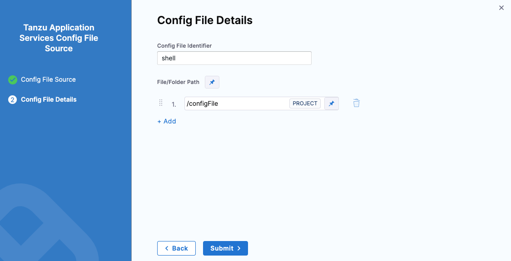
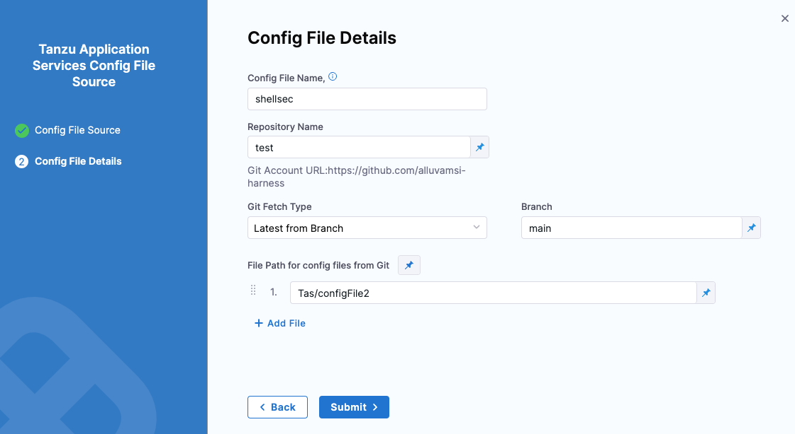

Service configuration files enable you to specify information in the Harness service that can be referenced in other parts of the Harness application. In this topic, we'll cover using these configuration files for Tanzu Application Service (TAS, formerly PCF).

```mdx-code-block
import Tabs from '@theme/Tabs';   
import TabItem from '@theme/TabItem';
```
```mdx-code-block
<Tabs>
    <TabItem value="Harness" label="Harness" default>
```
1. In the Harness service, in Config Files, select **Add Config File**.
2. In **Config File Source**, select **Harness**, and then select **Continue**.
3. In **Config File Identifier**, enter a name for the file.
4. In **File/Folder Path**, select the config file from Harness file store. 
   
   For more information, go to [add inline service using file store](/docs/continuous-delivery/x-platform-cd-features/services/add-inline-manifests-using-file-store).
5. Select **Add** to attach multiple files as a single config file.
6. Select **Submit**.
   

For more information, go to [using config file in your deployments](/docs/continuous-delivery/x-platform-cd-features/services/cd-services-config-files/).

You can view the config files added to your service definition.

You can reference this config file as an expression in a pipeline from the **Execution** tab. 

For example, in a Tanzu Command step, you can reference the config file by entering the following script in the step's **Step Parameters>** **Script>** **Inline**. 

`echo "<+configFile.getAsString("shell")>"` 

```mdx-code-block
</TabItem>
<TabItem value="GitHub" label="GitHub">
```
:::note
Currently, this feature is behind a feature flag `CDS_GIT_CONFIG_FILES`. Contact [Harness Support](mailto:support@harness.io) to enable this feature. 
:::

1. Select a GitHub connector, and select **Continue**. You can also add a [new GitHub connector](/docs/platform/Connectors/Code-Repositories/ref-source-repo-provider/git-hub-connector-settings-reference) here and reference it.
2. In **Config File Details**, enter a config file name.
3. Enter the name of the repository you want to reference from your GitHub account.
4. In **Git Fetch Type**, select **Latest from Branch**, and then specify the **Branch** name. 
5. Enter the file path for config files from GitHub. 
6. Select **Add File** to attach multiple files as a single config file.
7. Select **Submit**.
  
  

You can view the config files added to your service definition.

You can reference this config file as an expression in a pipeline from the **Execution** tab. 

For example, in a Tanzu Command step, you can reference the config file by entering the following script in the step's **Step Parameters>** **Script>** **Inline**. 

`echo "<+configFile.getAsString("shellsec")>"` 

```mdx-code-block
</TabItem>  
</Tabs>
```


