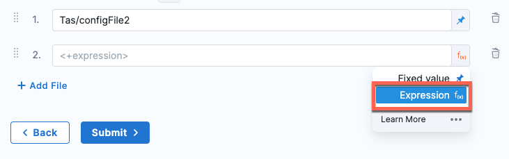

Service configuration files enable you to specify information in the Harness service that can be referenced in other parts of the Harness application. In this topic we'll cover using these configuration files for Tanzu Application Service (TAS, formerly PCF).

1. Select the **Service** tab, then select **Add Service**.  
2. Enter a service name. For example, TAS.
  
   Services are persistent and can be used throughout the stages of this pipeline or any other pipeline in the project.

3. In **Service Definition**, in **Deployment Type**, verify if **Tanzu Application Services** is selected.
5. In **Config Files**, select **Add Config File**.
6. In **Config File Source**, select **Harness** or **GitHub** and select **Continue**.

```mdx-code-block
import Tabs from '@theme/Tabs';   
import TabItem from '@theme/TabItem';
```
```mdx-code-block
<Tabs>
    <TabItem value="Harness" label="Harness" default>
```
* Enter a config file identifier name.
* Select **File/Folder Path** then select **Project**, **Organization**, or **Account** to create or select an existing config file.
    1. Select **New**, select **New Folder**, enter a folder name, and then select **Create**.
    2. Select the new folder, select **New**, select **New File**, and then enter a file name. For example, enter `config`.
    3. Enter the following in the `config` file, and then click **Save**.
       
       ```
       expression: <+pipeline.name>
       secret: <+secrets.getValue("expression")>
       notsecret: notsecret
       ```
    For more information, go to [add inline service using file store](/docs/continuous-delivery/x-platform-cd-features/services/add-inline-manifests-using-file-store).
       
* Select **Apply Selected**.
* You can also add a config file as an expression. For example, `<+configFile.getAsString(“configFIle_ID”)>`.
  
  

* Select **Add** and repeat step 2 to add more config files.

```mdx-code-block
</TabItem>
<TabItem value="GitHub" label="GitHub">
```
:::note
Currently, this feature is behind a feature flag `CDS_GIT_CONFIG_FILES`. Contact [Harness Support](mailto:support@harness.io) to enable this feature. 
:::

* Enter a name for the connector, and select **Continue**.
* Select **Account** or **Repository** in **URL Type**.
* Select **Connection Type** as **HTTP** or **SSH**.
   
   For SSH, ensure that the key is not OpenSSH, but rather PEM format. To generate an SSHv2 key, use: `ssh-keygen -t ecdsa -b 256 -m PEM` The `-m PEM` ensure that the key is PEM. Next, follow the prompts to create the PEM key. For more information, see the [ssh-keygen man page](https://linux.die.net/man/1/ssh-keygen) and [connecting to GitHub with SSH](https://help.github.com/en/github/authenticating-to-github/connecting-to-github-with-ssh).

* Enter your **GitHub Account URL**.
* In **Test Repository**, enter your repository name to test the connection.
* Select **Continue**.
* In **Credentials** enter your **Username**. You can use either plaintext or a [Harness encrypted text secret](/docs/platform/Secrets/add-use-text-secrets).
* In **Personal Access Token**, either create a new [encrypted text](/docs/platform/Secrets/add-file-secrets) or use an existing one that has your Git token. Harness requires the token for API access. Generate the token in your account on the Git provider and add it to Harness as a Secret.

  To use a personal access token with a GitHub organization that uses SAML single sign-on (SSO), you must first authorize the token. See [authorizing a personal access token for use with SAML single sign-on](https://docs.github.com/en/enterprise-cloud@latest/authentication/authenticating-with-saml-single-sign-on/authorizing-a-personal-access-token-for-use-with-saml-single-sign-on) from GitHub.
  * The GitHub user account used to create the Personal Access Token must have admin permissions on the repo.
  * GitHub doesn't provide a way of scoping a PAT for read-only access to repos. You must select the following permissions:

  If you selected **SSH** as the connection protocol, you must add the **SSH Key** to use with the connection as a [Harness encrypted text secret](/docs/platform/Secrets/add-use-text-secrets). For detailed steps to create an SSH Key, see [add new SSH key](https://docs.github.com/en/authentication/connecting-to-github-with-ssh/adding-a-new-ssh-key-to-your-github-account) from GitHub.

  Make sure the **Username** for your **SSH Credential** is `git` for the Test Connection to be successful.  

  Harness also supports [GitHub deploy keys](https://docs.github.com/en/developers/overview/managing-deploy-keys#deploy-keys). Deploy keys grant access to a single repo. Using a deploy key ensures that the Connector only works with the specific repo you selected in **URL Type**.

* (Optional) In **API Authentication**, you can use the same token you used in **Personal Access Token**.

  This option is required for using Git-based triggers, Webhooks management, and updating Git statuses.

* Select **Continue**.
* In **Select Connectivity Mode**, you have two options:
   * **Connect Through Harness Platform:** Harness SaaS will connect to your Git repo whenever it needs to pull code or a file or sync.
    * **Secrets:** if you select **Connect Through Harness Platform**, the Harness Manager exchanges a key pair with the Secrets Manager configured in Harness using an encrypted connection. Next, the Harness Manager uses the encrypted key and the encrypted secret and then discards them. The keys never leave the Harness Manager. Secrets are always encrypted in transit, in memory, and in the Harness database.If you select **Connect Through** **Harness Platform**, click **Save and Continue**.
   * **Connect Through a Harness Delegate:** Harness will make all connections using the Harness Delegate. This option is used for Harness Self-Managed Enterprise Edition Overview often, but it is also used for Harness SaaS. See [Harness self-managed enterprise edition overview](/docs/self-managed-enterprise-edition/introduction/getting-started-with-self-managed-enterprise-edition/).
    * If you select **Connect Through a Harness Delegate**, click **Continue** and then select/add the Delegate you want to use in **Delegates Setup**. See [delegate installation overview](/docs/platform/Delegates/delegate-concepts/delegate-overview).
* You can also add a config file as an expression. For example, `<+configFile.getAsString(“configFIle_ID”)>`.
  
  

* Select **Add** and repeat the steps above to add more config files.
* Select **Save and Continue**.
* Harness tests the connection. Select **Finish** once the verification is successful. 

The GitHub connector is listed in connectors.

```mdx-code-block
</TabItem>  
</Tabs>
```
7. Select **Submit**.

You can view the config files added to your service definition.


