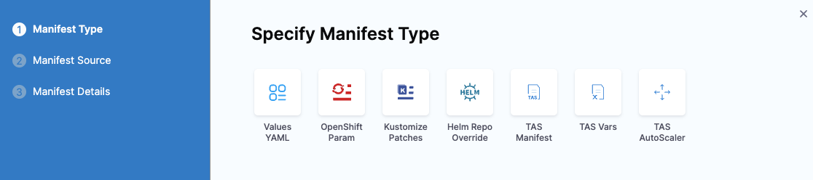
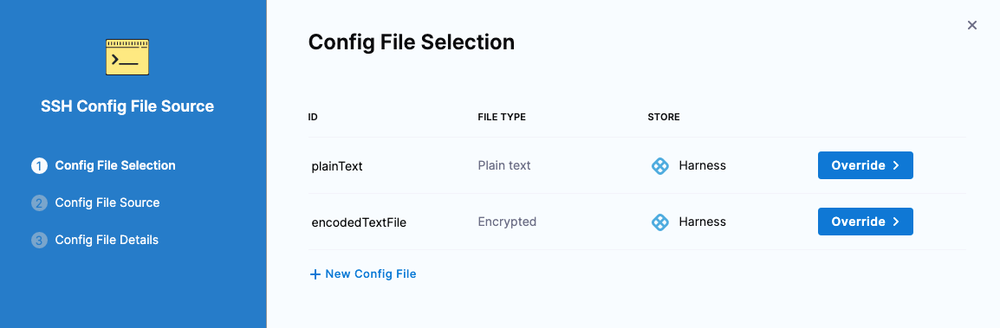
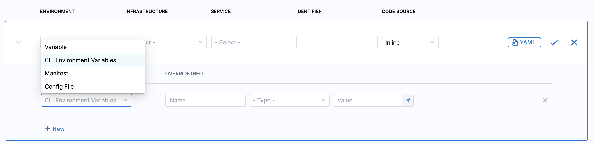

A Tanzu Application Service (TAS) service and environment are used together when you set up a pipeline to deploy your TAS app. You can configure your environment to override settings of the Harness TAS services that use the environment, thereby making the environment dictate TAS manifests, variables, and config file values.

For example, a TAS service uses a `manifest.yaml` file that specifies specific routes, but an environment might need to change the routes because it is deploying the app in the manifest to a QA space.

## Override TAS manifests

import Tabs from '@theme/Tabs';   
import TabItem from '@theme/TabItem';

<Tabs>
<TabItem value="Environment overrides" label="Environment overrides" default>

To override the manifests of all services deployed to an environment, do the following: 

1. In **Environments**, select an environment.
2. In the environment's **Configuration** tab **> Environment Overrides**, select **+ New Manifest Override** under **Manifests**.
3. Specify a manifest type, and select **Continue**. 
   
   You can select TAS Manifest, TAS Vars, and TAS AutoScaler manifest types.

4. Follow the same steps as you would when adding a manifest, and then select **Submit**.

</TabItem>
<TabItem value="Service overrides" label="Service overrides">

To override the manifests of specific services deployed to an environment, do the following:

1. In **Environments**, select an environment.
2. In the environment's **Service Overrides** tab, select **New configuration overrides**.
3. In **Service**, select a service you want to override when it is deployed to the selected environment.
4. In **Override Type**, select **Manifest**, and then select **New Manifest Override**.
5. Specify a manifest type, and select **Continue**. 
   
   You can select TAS Manifest, TAS Vars, and TAS AutoScaler manifest types.

   

6. Follow the same steps as you would when adding a manifest in a service, and then select **Submit**.

</TabItem>    
</Tabs>

## Override config files

import Tabs2 from '@theme/Tabs';   
import TabItem2 from '@theme/TabItem';

<Tabs2>
<TabItem2 value="Environment overrides" label="Environment overrides" default>

To override the config files of all services deployed to an environment, do the following: 

1. In **Environments**, select an environment.
2. In the environment's **Configuration** tab **> Environment Overrides**, select **+ New Config File Override** under **Config Files**.
3. In **Config File Selection**, select the config file to override, and then select **Submit**.

</TabItem2>
<TabItem2 value="Service overrides" label="Service overrides">

To override the config files of specific services deployed to an environment, do the following:

1. In **Environments**, select an environment.
2. In the environment's **Service Overrides** tab, select **New configuration overrides**.
3. In **Service**, select a service you want to override when it is deployed to the selected environment.
4. In **Override Type**, select **Config File**, and then select **New Config File Override**.
5. In **Config File Selection**, select the config file to override, and then select **Override**.
   
   

6. Follow the steps to select the override file, and then select **Submit**.

</TabItem2>    
</Tabs2>

## Override variables 

import Tabs3 from '@theme/Tabs';   
import TabItem3 from '@theme/TabItem';

<Tabs3>
<TabItem3 value="Environment overrides" label="Environment overrides" default>

To override the variables of all services deployed to an environment, do the following:

1. In **Environments**, select an environment.
2. In the environment's **Configuration** tab **> Advanced (Optional)**, select **+ New Variable** under **Variables**.
3. In the **New Variable** dialog, in **Type**, select String, Secret, or Number, and enter a variable name.
4. Enter an override value. It can be fixed value, runtime input, or expression.
5. Select **Save**.

</TabItem3>
<TabItem3 value="Service overrides" label="Service overrides">

To override the variables of specific services deployed to an environment, do the following:

1. In **Environments**, select an environment.
2. In the environment's **Service Overrides** tab, select **New configuration overrides**.
3. In **Service**, select a service you want to override when it is deployed to the selected environment.
4. In **Override Type**, select **Variable**, and then select **New Variable Override**.
5. In **Add Variable**, select the variable name, and enter an override value. 
6. Select **Submit**.

</TabItem3>    
</Tabs3>

:::info note

You can configure CLI Environment Variables override such as CF_STAGING_TIMEOUT and CF_HOME. Select the **CLI Environment Variables** in the **Override Type** dropdown and enter the **Override Info** such as Name, Type and Value.

   

Currently, this feature is behind the feature flag `CDS_CF_CLI_ENVIRONMENT_VARIABLE_SUPPORT`. Please contact [Harness support](mailto:support@harness.io) to enable this feature.

:::