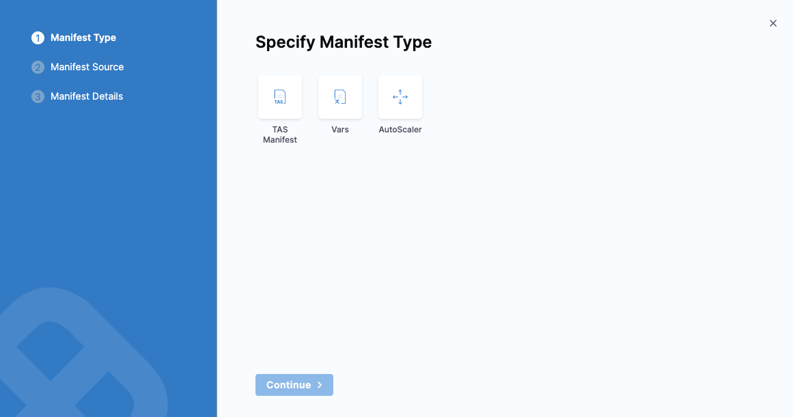
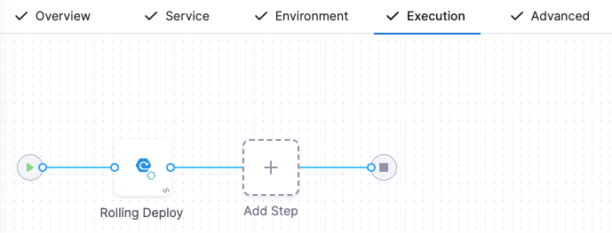

This topic shows you how to deploy a publicly available application to your Tanzu Application Service (TAS, formerly PCF) space by using any [deployment strategy](/docs/continuous-delivery/manage-deployments/deployment-concepts.md) in Harness.

:::note
Currently, this feature is behind feature flags `NG_SVC_ENV_REDESIGN`. Contact [Harness Support](mailto:support@harness.io) to enable this feature. 
:::

## Objectives

You'll learn how to:

* Install and launch a Harness delegate in your target cluster.
* Connect Harness with your TAS account.
* Connect Harness with a public image hosted on Artifactory.
* Specify the manifest to use for the application.
* Set up a TAS pipeline in Harness to deploy the application.

## Important notes

* For TAS deployments, Harness supports the following artifact sources. You connect Harness to these registries by using your registry account credentials.
   * [Artifactory](/docs/continuous-delivery/x-platform-cd-features/services/artifact-sources/#artifactory)
   * [Nexus](/docs/continuous-delivery/x-platform-cd-features/services/artifact-sources/#nexus)
   * [Docker Registry](/docs/continuous-delivery/x-platform-cd-features/services/artifact-sources/#docker) 
   * Amazon S3
   * [Google Container Registry (GCR)](/docs/continuous-delivery/x-platform-cd-features/services/artifact-sources/#google-container-registry-gcr)
   * [Amazon Elastic Container Registry (ECR)](/docs/continuous-delivery/x-platform-cd-features/services/artifact-sources/#amazon-elastic-container-registry-ecr)
   * [Azure Container Registry (ACR)](/docs/continuous-delivery/x-platform-cd-features/services/artifact-sources/#azure-container-registry-acr) 
   * [Google Artifact Registry (GAR)](/docs/continuous-delivery/x-platform-cd-features/services/artifact-sources/#google-artifact-registry)
   * [Google Cloud Storage (GCS)](/docs/continuous-delivery/x-platform-cd-features/services/artifact-sources/#google-cloud-storage-gcs)
   * [GitHub Package Registry](/docs/continuous-delivery/x-platform-cd-features/services/artifact-sources/#github-packages)
   * Azure Artifacts
   * [Jenkins](/docs/platform/Connectors/Artifact-Repositories/connect-to-jenkins)
* Before you create a TAS pipeline in Harness, make sure that you have the **Continuous Delivery** module in your Harness account. For more information, go to [create organizations and projects](https://developer.harness.io/docs/platform/organizations-and-projects/create-an-organization/). 
* Your Harness delegate profile must have [CF CLI v7, `autoscaler`, and `Create-Service-Push` plugins](#install-cloud-foundry-command-line-interface-cf-cli-on-your-harness-delegate) added to it. 

## Connect to a TAS provider

You can connect Harness to a TAS space by adding a TAS connector. Perform the following steps to add a TAS connector.

1. Open a Harness project and select the **Deployments** module.
2. In **Project Setup**, select **Connectors**, then select **New Connector**.
3. In **Cloud Providers**, select **Tanzu Application Service**. The TAS connector settings appear. 
4. Enter a connector name and select **Continue**.
5. Enter the TAS **Endpoint URL**. For example, `https://api.system.tas-mycompany.com`.
6. In **Authentication**, select one of the following options.
    1. **Plaintext** - Enter the username and password. For password, you can either create a new secret or use an existing one.
    2. **Encrypted** - Enter the username and password. You can create a new secret for your username and password or use exiting ones.
7. Select **Continue**.
8. In **Connect to the provider**, select **Connect through a Harness Delegate**, and then select **Continue**.
   We don't recommend using the **Connect through Harness Platform** option here because you'll need a delegate later for connecting to your TAS environment. Typically, the **Connect through Harness Platform** option is a quick way to make connections without having to use delegates.

   Expand the sections below to learn more about installing delegates.

<details>
<summary>Use the delegate installation wizard</summary>

1. In your Harness project, select **Project Setup**.
2. Select **Delegates**.
3. Select **Install a Delegate**.
4. Follow the delegate installation wizard.

Use this [delegate installation wizard video](https://www.youtube.com/watch?v=yLMCxs3onH8) to guide you through the process.

</details>

```mdx-code-block
import DelegateInstall from '/tutorials/platform/install-delegate.md';
```

<details>
<summary>Install a delegate using the terminal</summary>
<DelegateInstall />
</details>

To learn more, watch the [Delegate overview](https://developer.harness.io/docs/platform/delegates/delegate-concepts/delegate-overview) video.

9.  In **Set Up Delegates**, select the **Connect using Delegates with the following Tags** option and enter your delegate name.
10. Select **Save and Continue**.
11. Once the test connection succeeds, select **Finish**. The connector now appears in the **Connectors** list.

## Install Cloud Foundry Command Line Interface (CF CLI) on your Harness delegate

After the delegate pods are created, you must edit your Harness delegate YAML to install CF CLI v7, `autoscaler`, and `Create-Service-Push` plugins.

1. Open the `delegate.yaml` in a text editor.
2. Locate the environment variable `INIT_SCRIPT` in the `Deployment` object.
   ```
   - name: INIT_SCRIPT  
   value: ""  
   ```
3. Replace `value: ""` with the following script to install CF CLI, `autoscaler`, and `Create-Service-Push` plugins.
   
   :::info
   Harness delegate uses Red Hat based distributions like Red Hat Enterprise Linux (RHEL) or Red Hat Universal Base Image (UBI). Hence, we recommend that you use `microdnf` commands to install CF CLI on your delegate. If you are using a package manager in Debian based distributions like Ubuntu, use `apt-get` commands to install CF CLI on your delegate.
   :::

   :::info
   Make sure to use your API token for pivnet login in the following script.
   :::

```mdx-code-block
import Tabs from '@theme/Tabs';   
import TabItem from '@theme/TabItem';
```
```mdx-code-block
<Tabs>
    <TabItem value="microdnf" label="microdnf" default>
```

   ```
   - name: INIT_SCRIPT  
   value: |
    # update package manager, install necessary packages, and install CF CLI v7
    microdnf update
    microdnf install yum
    microdnf install --nodocs unzip yum-utils
    microdnf install -y yum-utils
    echo y | yum install wget
    wget -O /etc/yum.repos.d/cloudfoundry-cli.repo https://packages.cloudfoundry.org/fedora/cloudfoundry-cli.repo
    echo y | yum install cf7-cli -y

    # autoscaler plugin
    # download and install pivnet
    wget -O pivnet https://github.com/pivotal-cf/pivnet-cli/releases/download/v0.0.55/pivnet-linux-amd64-0.0.55 && chmod +x pivnet && mv pivnet /usr/local/bin;
    pivnet login --api-token=<replace with api token>

    # download and install autoscaler plugin by pivnet
    pivnet download-product-files --product-slug='pcf-app-autoscaler' --release-version='2.0.295' --product-file-id=912441
    cf install-plugin -f autoscaler-for-pcf-cliplugin-linux64-binary-2.0.295

    # install Create-Service-Push plugin from community
    cf install-plugin -r CF-Community "Create-Service-Push"

    # verify cf version
    cf --version

    # verify plugins
    cf plugins
   ```

```mdx-code-block
</TabItem>
<TabItem value="apt-get" label="apt-get">
```
   
   ```
   - name: INIT_SCRIPT  
   value: |
    # update package manager, install necessary packages, and install CF CLI v7
    apt-get install wget
    wget -q -O - https://packages.cloudfoundry.org/debian/cli.cloudfoundry.org.key | apt-key add -
    echo "deb https://packages.cloudfoundry.org/debian stable main" | tee /etc/apt/sources.list.d/cloudfoundry-cli.list
    apt-get update
    apt-get install cf7-cli

    # autoscaler plugin
    # download and install pivnet
    wget -O pivnet https://github.com/pivotal-cf/pivnet-cli/releases/download/v0.0.55/pivnet-linux-amd64-0.0.55 && chmod +x pivnet && mv pivnet /usr/local/bin;
    pivnet login --api-token=<replace with api token>

    # download and install autoscaler plugin by pivnet
    pivnet download-product-files --product-slug='pcf-app-autoscaler' --release-version='2.0.295' --product-file-id=912441
    cf install-plugin -f autoscaler-for-pcf-cliplugin-linux64-binary-2.0.295

    # install Create-Service-Push plugin from community
    cf install-plugin -r CF-Community "Create-Service-Push"

    # verify cf version
    cf --version

    # verify plugins
    cf plugins
   ```
  
```mdx-code-block
</TabItem>    
</Tabs>
```
   
4. Apply the profile to the delegate profile and check the logs.

   The output for `cf --version` is `cf version 7.2.0+be4a5ce2b.2020-12-10`.

   Here is the output for `cf plugins`.
   
   ```
   App Autoscaler        2.0.295   autoscaling-apps              Displays apps bound to the autoscaler
   App Autoscaler        2.0.295   autoscaling-events            Displays previous autoscaling events for the app
   App Autoscaler        2.0.295   autoscaling-rules             Displays rules for an autoscaled app
   App Autoscaler        2.0.295   autoscaling-slcs              Displays scheduled limit changes for the app
   App Autoscaler        2.0.295   configure-autoscaling         Configures autoscaling using a manifest file
   App Autoscaler        2.0.295   create-autoscaling-rule       Create rule for an autoscaled app
   App Autoscaler        2.0.295   create-autoscaling-slc        Create scheduled instance limit change for an autoscaled app
   App Autoscaler        2.0.295   delete-autoscaling-rule       Delete rule for an autoscaled app
   App Autoscaler        2.0.295   delete-autoscaling-rules      Delete all rules for an autoscaled app
   App Autoscaler        2.0.295   delete-autoscaling-slc        Delete scheduled limit change for an autoscaled app
   App Autoscaler        2.0.295   disable-autoscaling           Disables autoscaling for the app
   App Autoscaler        2.0.295   enable-autoscaling            Enables autoscaling for the app
   App Autoscaler        2.0.295   update-autoscaling-limits     Updates autoscaling instance limits for the app
   Create-Service-Push   1.3.2     create-service-push, cspush   Works in the same manner as cf push, except that it will create services defined in a services-manifest.yml file first before performing a cf push.
   ``` 
:::note
The CF Command script does not require `cf login`. Harness logs in using the credentials in the TAS cloud provider set up in the infrastructure definition for the workflow executing the CF Command.
:::

## Create the deploy stage

Pipelines are collections of stages. For this tutorial, we'll create a new pipeline and add a single stage.

1. In your Harness project, select **Pipelines**, select **Deployments**, then select **Create a Pipeline**.

   Your pipeline appears.
2. Enter the name **TAS Quickstart** and click **Start**.
   
   

3. Click **Add Stage** and select **Deploy**.
4. Enter the stage name **Deploy TAS Service**, select the **Tanzu Application Services** deployment type, and select **Set Up Stage**.
   
   The new stage settings appear. 
   
   

## Create the Harness TAS service

Harness services represent your microservices or applications. You can add the same service to as many stages as you need. Services contain your artifacts, manifests, config files, and variables. For more information, go to [services and environments overview](https://developer.harness.io/docs/continuous-delivery/onboard-cd/cd-concepts/services-and-environments-overview).

### Create a new service

1. Select the **Service** tab, then select **Add Service**.  
2. Enter a service name. For example, TAS.
  
   Services are persistent and can be used throughout the stages of this pipeline or any other pipeline in the project.

3. In **Service Definition**, in **Deployment Type**, verify if **Tanzu Application Services** is selected.

### Add the manifest

1. In **Manifests**, select **Add Manifest**.  
   Harness uses **TAS Manifest**, **Vars**, and **AutoScaler** manifest types for defining TAS applications, instances, and routes.  
   You can use one TAS manifest and one autoscaler manifest only. You can use unlimited vars file manifests. 

   
 
2. Select **TAS Manifest** and select **Continue**.
3. In **Specify TAS Manifest Store**, select **Harness** and select **Continue**.
4. In **Manifest Details**, enter a manifest name. For example, `nginx`.
5. Select **File/Folder Path**. 
6. In **Create or Select an Existing Config file**, select **Project**. This is where we will create the manifest.
    1. Select **New**, select **New Folder**, enter a folder name, and then select **Create**.
    2. Select the new folder, select **New**, select **New File**, and then enter a file name. For example, enter `manifest`.
    3. Enter the following in the `manifest` file, and then click **Save**.
       
       ```
       applications:
       - name: ((NAME))
       health-check-type: process
       timeout: 5
       instances: ((INSTANCE))
       memory: 750M
       routes:
         - route: ((ROUTE))
       ```
7. Select **Apply Selected**.
   
   You can add only one `manifest.yaml` file.  

8. Select **Vars.yaml path** and repeat steps 6.1 and 6.2 to create a `vars` file. Then, enter the following information:
   
   ```
   NAME: harness_<+service.name>
   INSTANCE: 1
   ROUTE: harness_<+service.name>_<+infra.name>.apps.tas-harness.com
   ```
9.  Select **Apply Selected**.
    
   You can add any number of `vars.yaml` files.  

11. Select **AutoScaler.yaml** and repeat steps 6.1 and 6.2 to create an `autoscaler` file. Then, enter the following information:
    
    ```
    instance_limits:
      min: 1
      max: 2
    rules:
    - rule_type: "http_latency"
      rule_sub_type: "avg_99th"
      threshold:
        min: 100
        max: 200
    scheduled_limit_changes:
    - recurrence: 10
      executes_at: "2032-01-01T00:00:00Z"
      instance_limits:
        min: 1
        max: 2
    ```
12. Select **Apply Selected**.
    
    You can add only one `autoscaler.yaml` file. 

13. Select **Submit**.

### Add the artifact for deployment

1. In **Artifacts**, select **Add Artifact Source**.
2. In **Specify Artifact Repository Type**, select **Artifactory**, and select **Continue**.
   
   :::important

   For TAS deployments, Harness supports the following artifact sources. You connect Harness to these registries by using your registry account credentials.
   * [Artifactory](/docs/continuous-delivery/x-platform-cd-features/services/artifact-sources/#artifactory)
   * [Nexus](/docs/continuous-delivery/x-platform-cd-features/services/artifact-sources/#nexus)
   * [Docker Registry](/docs/continuous-delivery/x-platform-cd-features/services/artifact-sources/#docker) 
   * Amazon S3
   * [Google Container Registry (GCR)](/docs/continuous-delivery/x-platform-cd-features/services/artifact-sources/#google-container-registry-gcr)
   * [Amazon Elastic Container Registry (ECR)](/docs/continuous-delivery/x-platform-cd-features/services/artifact-sources/#amazon-elastic-container-registry-ecr)
   * [Azure Container Registry (ACR)](/docs/continuous-delivery/x-platform-cd-features/services/artifact-sources/#azure-container-registry-acr) 
   * [Google Artifact Registry (GAR)](/docs/continuous-delivery/x-platform-cd-features/services/artifact-sources/#google-artifact-registry)
   * [Google Cloud Storage (GCS)](/docs/continuous-delivery/x-platform-cd-features/services/artifact-sources/#google-cloud-storage-gcs)
   * [GitHub Package Registry](/docs/continuous-delivery/x-platform-cd-features/services/artifact-sources/#github-packages)
   * Azure Artifacts
   * [Jenkins](/docs/platform/Connectors/Artifact-Repositories/connect-to-jenkins)
   
   For this tutorial, we will use Artifactory.
   :::
   

3. In **Artifactory Repository**, click **New Artifactory Connector**.
4. Enter a name for the connector, such as **JFrog**, then select **Continue**.
5. In **Details**, in **Artifactory Repository URL**, enter `https://harness.jfrog.io/artifactory/`.
6. In **Authentication**, select **Anonymous**, and select **Continue**.
   
   

7. In **Delegates Setup**, select **Only use Delegate with all of the following tags** and enter the name of the delegate created in [connect to a TAS provider (step 8)](#connect-to-a-tas-provider).
8. Select **Save and Continue**
9.  After the test connection succeeds, select **Continue**.
10. In **Artifact Details**, enter the following details:
    1.  Enter an **Artifact Source Name**.
    2.  Select **Generic** or **Docker** repository format.
    3.  Select a **Repository** where the artifact is located.
    4.  Enter the name of the folder or repository where the artifact is located.
    5.  Select **Value** to enter a specific artifact name. You can also select **Regex** and enter a tag regex to filter the artifact.
11. Select **Submit**.

## Define the TAS target environment

The target space is your TAS space. This is where you will deploy your application.

1. In **Specify Environment**, select **New Environment**.  
2. Enter the name **TAS tutorial** and select **Pre-Production**.
4. Select **Save**.
5. In **Specify Infrastructure**, select **New Infrastructure**.
6. Enter a name, and then verify that the selected deployment type is **Tanzu Application Type**.
7. Select the [TAS connector](#connect-to-a-tas-provider) you created earlier.
8. In **Organization**, select the TAS org in which want to deploy.
9. In **Space**, select the TAS space in which you want to deploy.
    
    

11. Select **Save**.

## TAS execution strategies

Now you can select the [deployment strategy](/docs/continuous-delivery/manage-deployments/deployment-concepts.md) for this stage of the pipeline.

```mdx-code-block
import Tabs2 from '@theme/Tabs';
import TabItem2 from '@theme/TabItem';
```
```mdx-code-block
<Tabs2>
  <TabItem2 value="Basic" label="Basic">
```

The TAS workflow for performing a basic deployment takes your Harness TAS service and deploys it on your TAS infrastructure definition. 

1. In Execution Strategies, select **Basic**, then select **Use Strategy**.
2. The basic execution steps are added. 
   
   

3. Select the **Basic App Setup** step to define **Step Parameters**.
   
   The basic app setup configuration uses your manifest in Harness TAS to set up your application.

    1. **Name** - Edit the deployment step name.
    2. **Timeout** - Set how long you want the Harness delegate to wait for the TAS cloud to respond to API requests before timeout.
    3. **Instance Count** - Select whether to **Read from Manifest** or **Match Running Instances**.  
       The **Match Running Instances** setting can be used after your first deployment to override the instances in your manifest.
    4. **Existing Versions to Keep** - Enter the number of existing versions you want to keep. This is to roll back to a stable version if the deployment fails.
    5. **Additional Routes** - Enter additional routes if you want to add routes other than the ones defined in the manifests.
    6. Select **Apply Changes**.

4. Select the **App Resize** step to define **Step Parameters**.
    1. **Name** - Edit the deployment step name.
    2. **Timeout** - Set how long you want the Harness delegate to wait for the TAS cloud to respond to API requests before timeout.
    3. **Ignore instance count in Manifest** - Select this option to override the instance count defined in the `manifest.yaml` file with the values specified in the **App Resize** step.
    4. **Total Instances** - Set the number or percentage of running instances you want to keep.
    5. **Desired Instances - Old Version** - Set the number or percentage of instances for the previous version of the application you want to keep. If this field is left empty, the desired instance count will be the difference between the maximum possible instance count (from the manifest or match running instances count) and the number of new application instances.
    6. Select **Apply Changes**.

5. Add a **Tanzu Command** step to your stage if you want to execute custom Tanzu commands in this step. 
    1. **Timeout** - Set how long you want the Harness delegate to wait for the TAS cloud to respond to API requests before timeout.
    2. **Script** - Select one of the following options.
        - **File Store** - Select this option to choose a script from **Project**, **Organization**, or **Account**.
        - **Inline** - Select this option to enter a script inline.
    3. Select **Apply Changes**.
   
6. Add an **App Rollback** step to your stage if you want to roll back to an older version of the application in case of deployment failure.
7. In **Advanced** configure the following options.
   - **Delegate Selector** - Select the delegate(s) you want to use to execute this step. You can select one or more delegates for each pipeline step. You only need to select one of a delegate's tags to select it. All delegates with the tag are selected.
   - **Conditional Execution** - Use the conditions to determine when this step is executed. For more information, go to [conditional execution settings](/docs/continuous-delivery/x-platform-cd-features/executions/step-and-stage-conditional-execution-settings).
   - **Failure Strategy** - Define the failure strategies to control the behavior of your pipeline when there is an error in execution. For more information, go to [failure strategy references](/docs/continuous-delivery/x-platform-cd-features/executions/step-failure-strategy-settings) and [define a failure strategy](/docs/continuous-delivery/x-platform-cd-features/executions/step-and-stage-failure-strategy).
     
     Expand the following section to view the error types and failure strategies supported for the steps in a Basic TAS deployment.

     <details>
     <summary>Error types and failure strategy</summary>

     | Step name | Error types and failure strategy |
     | :--- | :--- |
     | **App Setup** | <table> <thead> <tr> <th>Error type</th> <th>**Rollback Stage**</th> <th>**Manual Intervention**</th> <th>**Ignore Failure**</th> <th>**Retry**</th> <th>**Mark As Success**</th> <th>**Abort**</th> <th>**Mark As Failure**</th> </tr> </thead> <tbody> <tr> <td>**Delegate Provisioning Errors**</td> <td>Supported, but rollback is skipped because app is not setup.</td> <td>Supported</td> <td>Supported</td> <td>Supported</td> <td>Supported</td> <td>Supported</td> <td>Supported</td> </tr> <tr> <td>**Delegate Restart**</td> <td>Supported, but rollback is skipped because app is not setup.</td> <td>Supported</td> <td>Supported</td> <td>Supported</td> <td>Supported</td> <td>Supported</td> <td>Supported</td> </tr> <tr> <td>**Timeout Errors**</td> <td>Supported, but rollback is skipped because app is not setup.</td> <td>Supported</td> <td>Supported</td> <td>Supported</td> <td>Supported</td> <td>Supported</td> <td>Supported</td> </tr> <tr> <td>**Execution-time Inputs Timeout Errors**</td> <td>Supported, but rollback is skipped because app is not setup.</td> <td>Supported</td> <td>Supported</td> <td>Supported</td> <td>Supported</td> <td>Supported</td> <td>Supported</td> </tr> </tbody> </table> |
     | **App Resize** | <table> <thead> <tr> <th>Error type</th> <th>**Rollback Stage**</th> <th>**Manual Intervention**</th> <th>**Ignore Failure**</th> <th>**Retry**</th> <th>**Mark As Success**</th> <th>**Abort**</th> <th>**Mark As Failure**</th> </tr> </thead> <tbody> <tr> <td>**Delegate Provisioning Errors**</td> <td>Supported</td> <td>Supported</td> <td>Supported</td> <td>Supported</td> <td>Supported</td> <td>Supported</td> <td>Supported</td> </tr> <tr> <td>**Delegate Restart**</td> <td>Supported</td> <td>Supported</td> <td>Supported</td> <td>Supported</td> <td>Supported</td> <td>Supported</td> <td>Supported</td> </tr> <tr> <td>**Timeout Errors**</td> <td>Supported</td> <td>Supported</td> <td>Supported</td> <td>Supported</td> <td>Supported</td> <td>Supported</td> <td>Supported</td> </tr> <tr> <td>**Execution-time Inputs Timeout Errors**</td> <td>Supported</td> <td>Supported</td> <td>Supported</td> <td>Supported</td> <td>Supported</td> <td>Supported</td> <td>Supported</td> </tr> </tbody> </table> |
     | **App Rollback** | <table> <thead> <tr> <th>Error type</th> <th>**Rollback Stage**</th> <th>**Manual Intervention**</th> <th>**Ignore Failure**</th> <th>**Retry**</th> <th>**Mark As Success**</th> <th>**Abort**</th> <th>**Mark As Failure**</th> </tr> </thead> <tbody> <tr> <td>**Delegate Provisioning Errors**</td> <td>Invalid</td> <td>Supported</td> <td>Supported</td> <td>Invalid</td> <td>Supported</td> <td>Supported</td> <td>Supported</td> </tr> <tr> <td>**Delegate Restart**</td> <td>Invalid</td> <td>Supported</td> <td>Supported</td> <td>Invalid</td> <td>Supported</td> <td>Supported</td> <td>Supported</td> </tr> <tr> <td>**Timeout Errors**</td> <td>Invalid</td> <td>Supported</td> <td>Supported</td> <td>Invalid</td> <td>Supported</td> <td>Supported</td> <td>Supported</td> </tr> <tr> <td>**Execution-time Inputs Timeout Errors**</td> <td>Invalid</td> <td>Supported</td> <td>Supported</td> <td>Invalid</td> <td>Supported</td> <td>Supported</td> <td>Supported</td> </tr> </tbody> </table> |
     | **Tanzu Command** | <table> <thead> <tr> <th>Error type</th> <th>**Rollback Stage**</th> <th>**Manual Intervention**</th> <th>**Ignore Failure**</th> <th>**Retry**</th> <th>**Mark As Success**</th> <th>**Abort**</th> <th>**Mark As Failure**</th> </tr> </thead> <tbody> <tr> <td>**Delegate Provisioning Errors**</td> <td>Invalid</td> <td>Supported</td> <td>Supported</td> <td>Supported</td> <td>Supported</td> <td>Supported</td> <td>Supported</td> </tr> <tr> <td>**Delegate Restart**</td> <td>Invalid</td> <td>Supported</td> <td>Supported</td> <td>Supported</td> <td>Supported</td> <td>Supported</td> <td>Supported</td> </tr> <tr> <td>**Timeout Errors**</td> <td>Invalid</td> <td>Supported</td> <td>Supported</td> <td>Supported</td> <td>Supported</td> <td>Supported</td> <td>Supported</td> </tr> <tr> <td>**Execution-time Inputs Timeout Errors**</td> <td>Invalid</td> <td>Supported</td> <td>Supported</td> <td>Supported</td> <td>Supported</td> <td>Supported</td> <td>Supported</td> </tr> </tbody> </table> |
     
     :::note
     For the Tanzu Command step, Harness does not provide default rollback steps. You can do a rollback by configuring your own Rollback step.
     :::

     </details>
   - **Looping Strategy** - Select **Matrix**, **Repeat**, or **Parallelism** looping strategy. For more information, go to [looping strategies overview](/docs/platform/pipelines/looping-strategies-matrix-repeat-and-parallelism/).
   - **Policy Enforcement** - Add or modify a policy set to be evaluated after the step is complete. For more information, go to [CD governance](/docs/category/cd-governance).
8. Select **Save**.

Now the pipeline stage is complete and you can deploy.

```mdx-code-block
  </TabItem2>
  <TabItem2 value="Canary" label="Canary">
```
The TAS canary deployment is a phased approach to deploy application instances gradually, ensuring the stability of a small percentage of instances before rolling out to your desired instance count. With canary deployment, all nodes in a single environment are incrementally updated in small phases. You can add verification steps as needed to proceed to the next phase.

Use this deployment method when you want to verify whether the new version of the application is working correctly in your production environment.

The canary deployment contains **Canary App Setup** and **App Resize** steps. You can add more **App Resize** steps to perform gradual deployment. 

1. In **Execution Strategies**, select **Canary**, and then click **Use Strategy**.
2. The canary execution steps are added. 
   
   

3. Select the **Canary App Setup** step to define **Step Parameters**.
    1. **Name** - Edit the deployment step name.
    2. **Timeout** - Set how long you want the Harness delegate to wait for the TAS cloud to respond to API requests before timeout.
    3. **Instance Count** - Select whether to **Read from Manifest** or **Match Running Instances**.  
       The **Match Running Instances** setting can be used after your first deployment to override the instances in your manifest.
    4. **Resize Strategy** - Select **Add new instances first, then downsize old instances** or **Downsize old instances first, then add new instances** strategy. You can also add **Resize Strategy** as a runtime input.
    5.  **Existing Versions to Keep** - Enter the number of existing versions you want to keep. This is to roll back to a stable version if the deployment fails.
    6.  **Additional Routes** - Enter additional routes if you want to add routes other than the ones defined in the manifests.
    7.  Select **Apply Changes**.
4. Select the **App Resize** step to define **Step Parameters**.
    1. **Name** - Edit the deployment step name.
    2. **Timeout** - Set how long you want the Harness delegate to wait for the TAS cloud to respond to API requests before timeout.
    3. **Ignore instance count in Manifest** - Select this option to override the instance count mentioned in the `manifest.yaml` file with the values mentioned in the **App Resize** step.
    4. **Total Instances** - Set the number or percentage of running instances you want to keep.
    5. **Desired Instances - Old Version** - Set the number or percentage of instances for the previous version of the application you want to keep. If this field is left empty, the desired instance count will be the difference between the maximum possible instance count (from the manifest or match running instances count) and the number of new application instances.
    6. Select **Apply Changes**.
5. Add more **App Resize** steps to perform gradual deployment.
6. Add a **Tanzu Command** step to your stage if you want to execute custom Tanzu commands in this step. 
    1. **Timeout** - Set how long you want the Harness delegate to wait for the TAS cloud to respond to API requests before timeout.
    2. **Script** - Select one of the following options.
        - **File Store** - Select this option to choose a script from **Project**, **Organization**, or **Account**.
        - **Inline** - Select this option to enter a script inline.
    3. Select **Apply Changes**.
7. Add an **App Rollback** step to your stage if you want to rollback to an older version of the application in case of deployment failure.
8. In **Advanced** configure the following options.
   - **Delegate Selector** - Select the delegate(s) you want to use to execute this step. You can select one or more delegates for each pipeline step. You only need to select one of a delegate's tags to select it. All the delegates with that specific tag are selected.
   - **Conditional Execution** - Use the conditions to determine when this step is executed. For more information, go to [conditional execution settings](/docs/continuous-delivery/x-platform-cd-features/executions/step-and-stage-conditional-execution-settings).
   - **Failure Strategy** - Define the failure strategies to control the behavior of your pipeline when there is an error in execution. For more information, go to [failure strategy references](/docs/continuous-delivery/x-platform-cd-features/executions/step-failure-strategy-settings) and [define a failure strategy](/docs/continuous-delivery/x-platform-cd-features/executions/step-and-stage-failure-strategy).
     
     Expand the following section to view the error types and failure strategies supported for the steps in a Canary TAS deployment.
     <details>
     <summary>Error types and failure strategy</summary>

     | Step name | Error types and failure strategy |
     | :--- | :--- |
     | **App Setup** | <table> <thead> <tr> <th>Error type</th> <th>**Rollback Stage**</th> <th>**Manual Intervention**</th> <th>**Ignore Failure**</th> <th>**Retry**</th> <th>**Mark As Success**</th> <th>**Abort**</th> <th>**Mark As Failure**</th> </tr> </thead> <tbody> <tr> <td>**Delegate Provisioning Errors**</td> <td>Supported, but not required. Rollback step is skipped.</td> <td>Supported</td> <td>Supported</td> <td>Supported</td> <td>Supported</td> <td>Supported</td> <td>Supported</td> </tr> <tr> <td>**Delegate Restart**</td> <td>Supported, but not required. Rollback step is skipped.</td> <td>Supported</td> <td>Supported</td> <td>Supported</td> <td>Supported</td> <td>Supported</td> <td>Supported</td> </tr> <tr> <td>**Timeout Errors**</td> <td>Supported, but not required. Rollback step is skipped.</td> <td>Supported</td> <td>Supported</td> <td>Supported</td> <td>Supported</td> <td>Supported</td> <td>Supported</td> </tr> <tr> <td>**Execution-time Inputs Timeout Errors**</td> <td> Supported, but not required. Rollback step is skipped.</td> <td>Supported</td> <td>Supported</td> <td>Supported</td> <td>Supported</td> <td>Supported</td> <td>Supported</td> </tr> </tbody> </table> |
     | **App Resize** | <table> <thead> <tr> <th>Error type</th> <th>**Rollback Stage**</th> <th>**Manual Intervention**</th> <th>**Ignore Failure**</th> <th>**Retry**</th> <th>**Mark As Success**</th> <th>**Abort**</th> <th>**Mark As Failure**</th> </tr> </thead> <tbody> <tr> <td>**Delegate Provisioning Errors**</td> <td>Supported</td> <td>Supported</td> <td>Supported</td> <td>Supported</td> <td>Supported</td> <td>Supported</td> <td>Supported</td> </tr> <tr> <td>**Delegate Restart**</td> <td>Supported</td> <td>Supported</td> <td>Supported</td> <td>Supported</td> <td>Supported</td> <td>Supported</td> <td>Supported</td> </tr> <tr> <td>**Timeout Errors**</td> <td>Supported</td> <td>Supported</td> <td>Supported</td> <td>Supported</td> <td>Supported</td> <td>Supported</td> <td>Supported</td> </tr> <tr> <td>**Execution-time Inputs Timeout Errors**</td> <td>Supported</td> <td>Supported</td> <td>Supported</td> <td>Supported</td> <td>Supported</td> <td>Supported</td> <td>Supported</td> </tr> </tbody> </table> |
     | **App Rollback** | <table> <thead> <tr> <th>Error type</th> <th>**Rollback Stage**</th> <th>**Manual Intervention**</th> <th>**Ignore Failure**</th> <th>**Retry**</th> <th>**Mark As Success**</th> <th>**Abort**</th> <th>**Mark As Failure**</th> </tr> </thead> <tbody> <tr> <td>**Delegate Provisioning Errors**</td> <td>Invalid</td> <td>Supported</td> <td>Supported</td> <td>Invalid</td> <td>Supported</td> <td>Supported</td> <td>Supported</td> </tr> <tr> <td>**Delegate Restart**</td> <td>Invalid</td> <td>Supported</td> <td>Supported</td> <td>Invalid</td> <td>Supported</td> <td>Supported</td> <td>Supported</td> </tr> <tr> <td>**Timeout Errors**</td> <td>Invalid</td> <td>Supported</td> <td>Supported</td> <td>Invalid</td> <td>Supported</td> <td>Supported</td> <td>Supported</td> </tr> <tr> <td>**Execution-time Inputs Timeout Errors**</td> <td>Invalid</td> <td>Supported</td> <td>Supported</td> <td>Invalid</td> <td>Supported</td> <td>Supported</td> <td>Supported</td> </tr> </tbody> </table> |
     | **Tanzu Command** | <table> <thead> <tr> <th>Error type</th> <th>**Rollback Stage**</th> <th>**Manual Intervention**</th> <th>**Ignore Failure**</th> <th>**Retry**</th> <th>**Mark As Success**</th> <th>**Abort**</th> <th>**Mark As Failure**</th> </tr> </thead> <tbody> <tr> <td>**Delegate Provisioning Errors**</td> <td>Invalid</td> <td>Supported</td> <td>Supported</td> <td>Supported</td> <td>Supported</td> <td>Supported</td> <td>Supported</td> </tr> <tr> <td>**Delegate Restart**</td> <td>Invalid</td> <td>Supported</td> <td>Supported</td> <td>Supported</td> <td>Supported</td> <td>Supported</td> <td>Supported</td> </tr> <tr> <td>**Timeout Errors**</td> <td>Invalid</td> <td>Supported</td> <td>Supported</td> <td>Supported</td> <td>Supported</td> <td>Supported</td> <td>Supported</td> </tr> <tr> <td>**Execution-time Inputs Timeout Errors**</td> <td>Invalid</td> <td>Supported</td> <td>Supported</td> <td>Supported</td> <td>Supported</td> <td>Supported</td> <td>Supported</td> </tr> </tbody> </table> |
     
     :::note
     For the Tanzu Command step, Harness does not provide default rollback steps. You can do a rollback for this step by configuring your own Rollback step.
     :::

     </details>
   - **Looping Strategy** - Select **Matrix**, **Repeat**, or **Parallelism** looping strategy. For more information, go to [looping strategies overview](/docs/platform/pipelines/looping-strategies-matrix-repeat-and-parallelism/).
   - **Policy Enforcement** - Add or modify a policy set to be evaluated after the step is complete. For more information, go to [CD governance](/docs/category/cd-governance).
9.  Select **Save**.

Now the pipeline stage is complete and can be deployed.

```mdx-code-block
  </TabItem2>
  <TabItem2 value="Blue Green" label="Blue Green">
```
Harness TAS blue green deployments use the route(s) in the TAS manifest and a temporary route you specify in the deployment configuration.

The blue green deployment deploys the applications using the temporary route first using the **App Setup** configuration. Next, in the **App Resize** configuration, Harness maintains the number of instances at 100% of the `instances` specified in the TAS manifest.

Use this deployment method when you want to perform verification in a full production environment, or when you want zero downtime.

For blue green deployments, by default, the **App Resize** step is 100% because it does not change the number of instances as it did in the canary deployment. However, you can define the percentage in the **App Resize** step. In blue green, you are deploying the new application to the number of instances set in the **App Setup** step and keeping the old application at the same number of instances. You 

Once the deployment is successful, the **Swap Routes** configuration switches the networking routing, directing production traffic (green) to the new application and stage traffic (blue) to the old application.

1. In Execution Strategies, select **Blue Green**, and then click **Use Strategy**.
2. The blue green execution steps are added. 
   
   

3. Select the **BG App Setup** step to define **Step Parameters**.
    1. **Name** - Edit the deployment step name.
    2. **Timeout** - Set how long you want the Harness delegate to wait for the TAS cloud to respond to API requests before timeout.
    3. **Instance Count** - Select whether to **Read from Manifest** or **Match Running Instances**.  
       The **Match Running Instances** setting can be used after your first deployment to override the instances in your manifest.
    4. **Existing Versions to Keep** - Enter the number of existing versions you want to keep. This is to roll back to a stable version if the deployment fails.
    5. **Additional Routes** - Add additional routes in addition to the routes added in the TAS manifest.
   
       Additional routes has two uses in blue green deployments.
       * Select the routes that you want to map to the application in addition to the routes already mapped in the application in the manifest in your Harness service.
       * You can also omit routes in the manifest in your Harness service, and select them in **Additional Routes**. The routes selected in **Additional Routes** will be used as the final (green) routes for the application.
    6. **Temporary Routes** - Add temporary routes in addition to additional routes.
   
       Later, in the **Swap Route** step, Harness will replace these routes with the routes in the TAS manifest in your service.  
       If you do not select a route in Temporary Routes, Harness will create one automatically.
    7. Select **Apply Changes**.
4. Select the **App Resize** step to define **Step Parameters**.
    1. **Name** - Edit the deployment step name.
    2. **Timeout** - Set how long you want the Harness delegate to wait for the TAS cloud to respond to API requests before timeout.
    3. **Ignore instance count in Manifest** - Select this option to override the instance count defined in the `manifest.yaml` file with the values specified in the **App Resize** step.
    4. **Total Instances** - Set the number or percentage of running instances you want to keep.
    5. **Desired Instances - Old Version** - Set the number or percentage of instances for the previous version of the application you want to keep. If this field is left empty, the desired instance count will be the difference between the maximum possible instance count (from the manifest or match running instances count) and the number of new application instances.
    6. Select **Apply Changes**.
5. Select the **Swap Routes** step to define **Step Parameters**.
    1. **Name** - Edit the deployment step name.
    2. **Timeout** - Set how long you want the Harness delegate to wait for the TAS cloud to respond to API requests before timeout.
    3. **Downsize Old Application** - Select this option to down size older applications.
    4. Select **Apply Changes**.
6. Add a **Tanzu Command** step to your stage if you want to execute custom Tanzu commands in this step. 
    1. **Timeout** - Set how long you want the Harness delegate to wait for the TAS cloud to respond to API requests before timeout.
    2. **Script** - Select one of the following options.
        - **File Store** - Select this option to choose a script from **Project**, **Organization**, or **Account**.
        - **Inline** - Select this option to enter a script inline.
    3. Select **Apply Changes**.   
7. Add a **Swap Rollback** step to your stage if you want to rollback to an older version of the application in case of deployment failure.

   When **Swap Rollback** is used in a deployment's **Rollback Steps**, the application that was active before the deployment is restored to its original state with the same instances and routes it had before the deployment.

   The failed application  is deleted.
8. In **Advanced** configure the following options.
   - **Delegate Selector** - Select the delegate(s) you want to use to execute this step. You can select one or more delegates for each pipeline step. You only need to select one of a delegate's tags to select it. All the delegates with the specified tag are selected.
   - **Conditional Execution** - Use the conditions to determine when this step should be executed. For more information, go to [conditional execution settings](/docs/continuous-delivery/x-platform-cd-features/executions/step-and-stage-conditional-execution-settings).
   - **Failure Strategy** - Define the failure strategies to control the behavior of your pipeline when there is an error in execution. For more information, go to [failure strategy references](/docs/continuous-delivery/x-platform-cd-features/executions/step-failure-strategy-settings) and [define a failure strategy](/docs/continuous-delivery/x-platform-cd-features/executions/step-and-stage-failure-strategy).
     
     Expand the following section to view the error types and failure strategies supported for the steps in a Blue Green TAS deployment.
     <details>
     <summary>Error types and failure strategy</summary>

     | Step name | Error types and failure strategy |
     | :--- | :--- |
     | **App Setup** | <table> <thead> <tr> <th>Error type</th> <th>**Rollback Stage**</th> <th>**Manual Intervention**</th> <th>**Ignore Failure**</th> <th>**Retry**</th> <th>**Mark As Success**</th> <th>**Abort**</th> <th>**Mark As Failure**</th> </tr> </thead> <tbody> <tr> <td>**Delegate Provisioning Errors**</td> <td>Supported, but not required. Rollback step is skipped.</td> <td>Supported</td> <td>Supported</td> <td>Supported</td> <td>Supported</td> <td>Supported</td> <td>Supported</td> </tr> <tr> <td>**Delegate Restart**</td> <td>Supported, but not required. Rollback step is skipped.</td> <td>Supported</td> <td>Supported</td> <td>Supported</td> <td>Supported</td> <td>Supported</td> <td>Supported</td> </tr> <tr> <td>**Timeout Errors**</td> <td>Supported, but not required. Rollback step is skipped.</td> <td>Supported</td> <td>Supported</td> <td>Supported</td> <td>Supported</td> <td>Supported</td> <td>Supported</td> </tr> <tr> <td>**Execution-time Inputs Timeout Errors**</td> <td> Supported, but not required. Rollback step is skipped.</td> <td>Supported</td> <td>Supported</td> <td>Supported</td> <td>Supported</td> <td>Supported</td> <td>Supported</td> </tr> </tbody> </table> |
     | **App Resize** | <table> <thead> <tr> <th>Error type</th> <th>**Rollback Stage**</th> <th>**Manual Intervention**</th> <th>**Ignore Failure**</th> <th>**Retry**</th> <th>**Mark As Success**</th> <th>**Abort**</th> <th>**Mark As Failure**</th> </tr> </thead> <tbody> <tr> <td>**Delegate Provisioning Errors**</td> <td>Supported</td> <td>Supported</td> <td>Supported</td> <td>Supported</td> <td>Supported</td> <td>Supported</td> <td>Supported</td> </tr> <tr> <td>**Delegate Restart**</td> <td>Supported</td> <td>Supported</td> <td>Supported</td> <td>Supported</td> <td>Supported</td> <td>Supported</td> <td>Supported</td> </tr> <tr> <td>**Timeout Errors**</td> <td>Supported</td> <td>Supported</td> <td>Supported</td> <td>Supported</td> <td>Supported</td> <td>Supported</td> <td>Supported</td> </tr> <tr> <td>**Execution-time Inputs Timeout Errors**</td> <td>Supported</td> <td>Supported</td> <td>Supported</td> <td>Supported</td> <td>Supported</td> <td>Supported</td> <td>Supported</td> </tr> </tbody> </table> |
     | **Swap Routes** | <table> <thead> <tr> <th>Error type</th> <th>**Rollback Stage**</th> <th>**Manual Intervention**</th> <th>**Ignore Failure**</th> <th>**Retry**</th> <th>**Mark As Success**</th> <th>**Abort**</th> <th>**Mark As Failure**</th> </tr> </thead> <tbody> <tr> <td>**Delegate Provisioning Errors**</td> <td>Support coming soon</td> <td>Rollback changes required</td> <td>Rollback changes required</td> <td>Rollback changes required</td> <td>Rollback changes required</td> <td>Rollback changes required</td> <td>Rollback changes required</td> </tr> <tr> <td>**Delegate Restart**</td> <td>Support coming soon</td> <td>Rollback changes required</td> <td>Rollback changes required</td> <td>Rollback changes required</td> <td>Rollback changes required</td> <td>Rollback changes required</td> <td>Rollback changes required</td> </tr> <tr> <td>**Timeout Errors**</td> <td>Support coming soon</td> <td>Rollback changes required</td> <td>Rollback changes required</td> <td>Rollback changes required</td> <td>Rollback changes required</td> <td>Rollback changes required</td> <td>Rollback changes required</td> </tr> <tr> <td>**Execution-time Inputs Timeout Errors**</td> <td>Support coming soon</td> <td>Rollback changes required</td> <td>Rollback changes required</td> <td>Rollback changes required</td> <td>Rollback changes required</td> <td>Rollback changes required</td> <td>Rollback changes required</td> </tr> </tbody> </table> |
     | **Swap Rollback** | <table> <thead> <tr> <th>Error type</th> <th>**Rollback Stage**</th> <th>**Manual Intervention**</th> <th>**Ignore Failure**</th> <th>**Retry**</th> <th>**Mark As Success**</th> <th>**Abort**</th> <th>**Mark As Failure**</th> </tr> </thead> <tbody> <tr> <td>**Delegate Provisioning Errors**</td> <td>Invalid</td> <td>Supported</td> <td>Supported</td> <td>Invalid</td> <td>Supported</td> <td>Supported</td> <td>Supported</td> </tr> <tr> <td>**Delegate Restart**</td> <td>Invalid</td> <td>Supported</td> <td>Supported</td> <td>Invalid</td> <td>Supported</td> <td>Supported</td> <td>Supported</td> </tr> <tr> <td>**Timeout Errors**</td> <td>Invalid</td> <td>Supported</td> <td>Supported</td> <td>Invalid</td> <td>Supported</td> <td>Supported</td> <td>Supported</td> </tr> <tr> <td>**Execution-time Inputs Timeout Errors**</td> <td>Invalid</td> <td>Supported</td> <td>Supported</td> <td>Invalid</td> <td>Supported</td> <td>Supported</td> <td>Supported</td> </tr> </tbody> </table> |
     | **Tanzu Command** | <table> <thead> <tr> <th>Error type</th> <th>**Rollback Stage**</th> <th>**Manual Intervention**</th> <th>**Ignore Failure**</th> <th>**Retry**</th> <th>**Mark As Success**</th> <th>**Abort**</th> <th>**Mark As Failure**</th> </tr> </thead> <tbody> <tr> <td>**Delegate Provisioning Errors**</td> <td>Invalid</td> <td>Supported</td> <td>Supported</td> <td>Supported</td> <td>Supported</td> <td>Supported</td> <td>Supported</td> </tr> <tr> <td>**Delegate Restart**</td> <td>Invalid</td> <td>Supported</td> <td>Supported</td> <td>Supported</td> <td>Supported</td> <td>Supported</td> <td>Supported</td> </tr> <tr> <td>**Timeout Errors**</td> <td>Invalid</td> <td>Supported</td> <td>Supported</td> <td>Supported</td> <td>Supported</td> <td>Supported</td> <td>Supported</td> </tr> <tr> <td>**Execution-time Inputs Timeout Errors**</td> <td>Invalid</td> <td>Supported</td> <td>Supported</td> <td>Supported</td> <td>Supported</td> <td>Supported</td> <td>Supported</td> </tr> </tbody> </table> |
     
     :::note
     For the Tanzu Command step, Harness does not provide any default rollback steps. You can do a rollback for this step by configuring your own Rollback step.
     :::

     </details>
   - **Looping Strategy** - Select **Matrix**, **Repeat**, or **Parallelism** looping strategy. For more information, go to [looping strategies overview](/docs/platform/pipelines/looping-strategies-matrix-repeat-and-parallelism/).
   - **Policy Enforcement** - Add or modify a policy set to be evaluated after the step is complete. For more information, go to [CD governance](/docs/category/cd-governance).
9. Select **Save**.

Now the pipeline stage is complete and can be deployed.

```mdx-code-block
  </TabItem2>
  <TabItem2 value="Rolling" label="Rolling">
```
The TAS rolling deployment deploys all pods or instances in a single environment incrementally added one-by-one with a new service or artifact version.

Use this deployment method when you want to support both new and old deployments. You can also use with load balancing scenarios that require reduced downtime. 

1. In Execution Strategies, select **Rolling**, and then click **Use Strategy**.
2. The rolling deploy step is added. 
   
   

3. Select the **Rolling Deploy** step to define **Step Parameters**.
    1. **Name** - Edit the deployment step name.
    2.  **Timeout** - Set how long you want the Harness delegate to wait for the TAS cloud to respond to API requests before timeout.
    3.  **Additional Routes** - Add additional routes in addition to the routes added in the TAS manifest.
4. Add a **Tanzu Command** step to your stage if you want to execute custom Tanzu commands in this step. 
    1. **Timeout** - Set how long you want the Harness delegate to wait for the TAS cloud to respond to API requests before timeout.
    2. **Script** - Select one of the following options.
        - **File Store** - Select this option to choose a script from **Project**, **Organization**, or **Account**.
        - **Inline** - Select this option to enter a script inline.
    3. Select **Apply Changes**.   
5. Add a **Rolling Rollback** step to your stage if you want to rollback to an older version of the application in case of deployment failure.
6. In **Advanced** configure the following options.
   - **Delegate Selector** - Select the delegate(s) you want to use to execute this step. You can select one or more delegates for each pipeline step. You only need to select one of a delegate's tags to select it. All delegates with the specified tag are selected.
   - **Conditional Execution** - Use the conditions to determine when this step should be executed. For more information, go to [conditional execution settings](/docs/continuous-delivery/x-platform-cd-features/executions/step-and-stage-conditional-execution-settings).
   - **Failure Strategy** - Define the failure strategies to control the behavior of your pipeline when there is an error in execution. For more information, go to [failure strategy references](/docs/continuous-delivery/x-platform-cd-features/executions/step-failure-strategy-settings) and [define a failure strategy](/docs/continuous-delivery/x-platform-cd-features/executions/step-and-stage-failure-strategy).
     
     Expand the following section to view the error types and failure strategies supported for the steps in a Rolling TAS deployment.
     <details>
     <summary>Error types and failure strategy</summary>

     | Step name | Error types and failure strategy |
     | :--- | :--- |
     | **Rolling Deploy** | <table> <thead> <tr> <th>Error type</th> <th>**Rollback Stage**</th> <th>**Manual Intervention**</th> <th>**Ignore Failure**</th> <th>**Retry**</th> <th>**Mark As Success**</th> <th>**Abort**</th> <th>**Mark As Failure**</th> </tr> </thead> <tbody> <tr> <td>**Delegate Provisioning Errors**</td> <td>Supported</td> <td>Supported</td> <td>Supported</td> <td>Supported</td> <td>Supported</td> <td>Supported</td> <td>Supported</td> </tr> <tr> <td>**Delegate Restart**</td> <td>Supported</td> <td>Supported</td> <td>Supported</td> <td>Supported</td> <td>Supported</td> <td>Supported</td> <td>Supported</td> </tr> <tr> <td>**Timeout Errors**</td> <td>Supported</td> <td>Supported</td> <td>Supported</td> <td>Supported</td> <td>Supported</td> <td>Supported</td> <td>Supported</td> </tr> <tr> <td>**Execution-time Inputs Timeout Errors**</td> <td>Supported</td> <td>Supported</td> <td>Supported</td> <td>Supported</td> <td>Supported</td> <td>Supported</td> <td>Supported</td> </tr> </tbody> </table> |
     | **Rolling Rollback** | <table> <thead> <tr> <th>Error type</th> <th>**Rollback Stage**</th> <th>**Manual Intervention**</th> <th>**Ignore Failure**</th> <th>**Retry**</th> <th>**Mark As Success**</th> <th>**Abort**</th> <th>**Mark As Failure**</th> </tr> </thead> <tbody> <tr> <td>**Delegate Provisioning Errors**</td> <td>Invalid</td> <td>Supported</td> <td>Supported</td> <td>Invalid</td> <td>Supported</td> <td>Supported</td> <td>Supported</td> </tr> <tr> <td>**Delegate Restart**</td> <td>Invalid</td> <td>Supported</td> <td>Supported</td> <td>Invalid</td> <td>Supported</td> <td>Supported</td> <td>Supported</td> </tr> <tr> <td>**Timeout Errors**</td> <td>Invalid</td> <td>Supported</td> <td>Supported</td> <td>Invalid</td> <td>Supported</td> <td>Supported</td> <td>Supported</td> </tr> <tr> <td>**Execution-time Inputs Timeout Errors**</td> <td>Invalid</td> <td>Supported</td> <td>Supported</td> <td>Invalid</td> <td>Supported</td> <td>Supported</td> <td>Supported</td> </tr> </tbody> </table> |
     | **Tanzu Command** | <table> <thead> <tr> <th>Error type</th> <th>**Rollback Stage**</th> <th>**Manual Intervention**</th> <th>**Ignore Failure**</th> <th>**Retry**</th> <th>**Mark As Success**</th> <th>**Abort**</th> <th>**Mark As Failure**</th> </tr> </thead> <tbody> <tr> <td>**Delegate Provisioning Errors**</td> <td>Invalid</td> <td>Supported</td> <td>Supported</td> <td>Supported</td> <td>Supported</td> <td>Supported</td> <td>Supported</td> </tr> <tr> <td>**Delegate Restart**</td> <td>Invalid</td> <td>Supported</td> <td>Supported</td> <td>Supported</td> <td>Supported</td> <td>Supported</td> <td>Supported</td> </tr> <tr> <td>**Timeout Errors**</td> <td>Invalid</td> <td>Supported</td> <td>Supported</td> <td>Supported</td> <td>Supported</td> <td>Supported</td> <td>Supported</td> </tr> <tr> <td>**Execution-time Inputs Timeout Errors**</td> <td>Invalid</td> <td>Supported</td> <td>Supported</td> <td>Supported</td> <td>Supported</td> <td>Supported</td> <td>Supported</td> </tr> </tbody> </table> |

     
     :::note
     For the Tanzu Command step, Harness does not provide any default rollback steps. You can do a rollback for this step by configuring your own Rollback step.
     :::
   
     </details>
   - **Looping Strategy** - Select **Matrix**, **Repeat**, or **Parallelism** looping strategy. For more information, go to [looping strategies overview](/docs/platform/pipelines/looping-strategies-matrix-repeat-and-parallelism/).
   - **Policy Enforcement** - Add or modify a policy set to be evaluated after the step is complete. For more information, go to [CD governance](/docs/category/cd-governance).
7. Select **Save**.

Now the pipeline stage is complete and can be deployed.

```mdx-code-block
  </TabItem2>    
</Tabs2>
```

## Deploy and review

1. Click **Save** **> Save Pipeline**, then select **Run**.
   Now you can select the specific artifact to deploy.
2. Select a **Primary Artifact**.
3. Select a **Tag**.
4. Select the following **Infrastructure** parameters.
    1. **Connector**
    2. **Organization**
    3. **Space**
5. Click **Run Pipeline**. Harness will verify the pipeline and then run it.
   You can see the status of the deployment, pause or abort it.

6. Toggle **Console View** to watch the deployment with more detailed logging.  

The deployment was successful.

In your project's **Deployments**, you can see the deployment listed.


## Next steps

See [CD tutorials](/tutorials/cd-pipelines/) for other deployment features.

