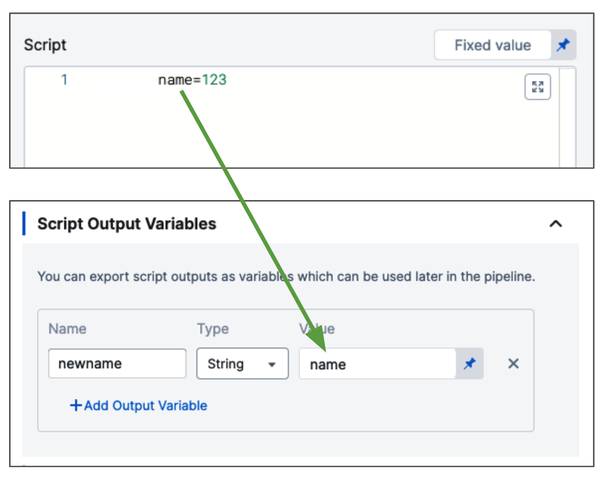
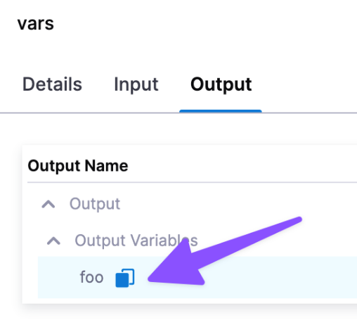
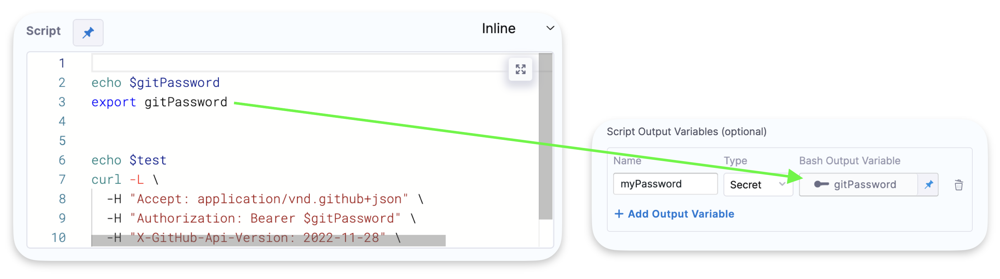
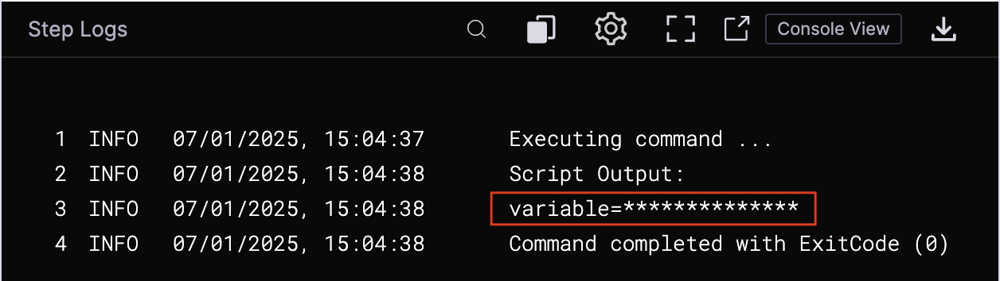

The Tanzu Command step enables you to run scripts in the same Tanzu environment you are using for deployment in your pipeline.

The step can be used for multiple purposes, such as provisioning the org and space or creating environment variables.

Harness performs the `cf login` using the credentials in the stage Infrastructure Definition before executing the script.


## Important notes

- You can use the CF Command to run any [CF CLI command](https://cli.cloudfoundry.org/en-US/v6/) or script at any point in your Harness Tanzu Command step.
- Secret variable types are not supported for **Input Variables** and **Output Variables** at this time. String and Number are supported.
- The Tanzu Command step can be added to a Deploy stage only.
- Output variables have a maximum size of 512KB.

## Add the Tanzu Command step

The Tanzu Command step can be added anywhere in the **Execution** of a Tanzu deployment stage.

To add the Tanzu Command step, do the following:

1.  In your Tanzu deployment stage **Execution**, select **Add Step**, and then select **Tanzu Command**.
2.  Enter a name for the command. An Id is generated automatically. You will use this Id in expressions that reference the step's setting and Output variables.
3.  Enter a timeout for the step.

  You can use:
  
  - `w` for weeks.
  - `d` for days.
  - `h` for hours.
  - `m` for minutes.
  - `s` for seconds.
  - `ms` for milliseconds.
  
  The maximum is `53w`.
  
  Timeouts can be set at the pipeline-level also, in the pipeline **Advanced Options**.
4.  In **Script**, enter the script you want to run.
5.  In **Input Variables**, enter any environment variables that you want to use in the script.
6.  In **Output Variables**, reference any variables in the script that you want to use in subsequent steps or settings.


## Script source

You can enter the script inline or use the [Harness File Store](/docs/continuous-delivery/x-platform-cd-features/services/add-inline-manifests-using-file-store).

## Script input variables and script output variables

The Tanzu Command step includes Input Variables and Output Variables. 

### Input variables

While you can simply declare a variable in your script using a Harness expression or string for its value, using **Input Variables** provides some additional benefits:

- You can more easily identify and manage the Harness expressions used in your script.
- You can template your script.

These variables are set as environment variables and can be accessed in the script using `$variable_name`.

The following variable types are supported:

- String
- Number

### Output variables

To export variables from the script to other steps in the stage, you use the **Output Variables** option.

The following variable types are supported:

- String
- Secret

Output variables are passed from the the script output to the Harness pipeline and can be referenced in subsequent steps and settings using expressions.

The **name** of the variable is used to reference it in subsequent steps and settings.


Let's look at a simple example of a script with the variable name:

```
name=123
```

The `name` variable cannot be used outside the script unless you use **Output Variables**.

You do not need to use export for the variables to use them with **Output Variables**. You can simply declare them, like `name="123"`. Export is for using the variables in child processes within the script.

In **Output Variables**, in **Value**, you enter the name of the script variable you want to output (`name`).

  

The format to reference the output variable can be one of the following:

- Within the stage:

  `<+execution.steps.[step_id].output.outputVariables.[output_variable_name]>`
- Anywhere in the pipeline:
  
  `<+pipeline.stages.[stage_Id].spec.execution.steps.[step_Id].output.outputVariables.[output_variable_name]>`
- When step is inside a step group:
  
  `<+pipeline.stages.[stage_Id].spec.execution.steps.[step_group_Id].steps.stepId.build.[output_variable_name]`

To find the expression to reference your output variables, you can begin typing `<+pipeline.stages.[stage_Id].spec.execution.steps...` and Harness will autocomplete or you can find the step in the pipeline execution, and click its **Output** tab.

  

:::note

If you exit from the script (`exit 0`), Harness does not populate the output variables because the step has exited.

:::

You can access a secret configured in the **Secrets Manager** using an expression. For example, `<+secrets.getValue('SECRET_NAME')>`.

You can also configure variables of type Secret as output variables. When an output variable is configured as a secret, its value is encrypted. 



The encrypted secret is decrypted and made available for use in the script. However, the script's output will not display the secret, even if the secret is explicitly passed to the output stream.



### Using manifests in your scripts

In order to use defined manifests in the Service in Tanzu command script you have to use a special expression `${service.manifest}`

If you are accessing remote manifest files using a Git repository, `${service.manifest}` refers to the file or folder path containing your manifest files and `${service.manifest.repoRoot}` refers to the root folder of the repository.

For example, you can use `${service.manifest.repoRoot}/tas/manifest.yml` to access `/tas/manifest.yml` from your repository and `${service.manifest.repoRoot}/tas/vars.yml` to access `/tas/vars.yml`.

## Using Harness expressions in your scripts

If you need quotes around the Harness variable expressions in your script, use single quotes, like this:

```
export EVENT_PAYLOAD='<+trigger.eventPayload>'
```

If you use Harness variable expressions in comments in your script, Harness will still try to evaluate and render the variable expressions. Don't use variable expressions that Harness cannot evaluate. For example, expressions that will not be resolved until later in the stage.
