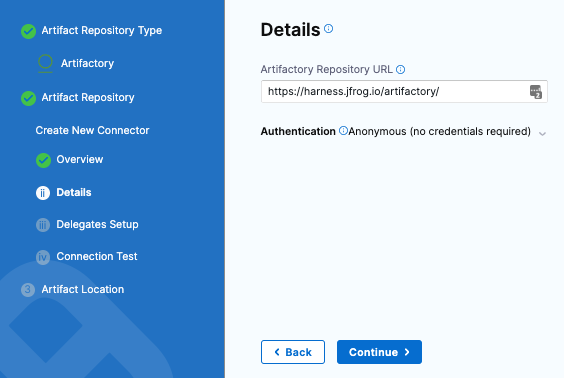
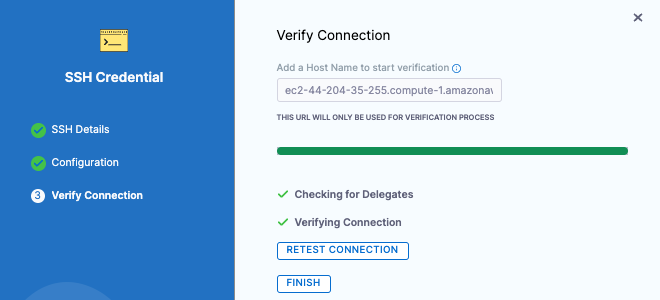

# VM deployments using SSH

You can use a Secure Shell (SSH) deployment type to deploy your artifacts to VM or bare-metal hosts located in Microsoft Azure, AWS, or any platform-agnostic Physical Data Center (PDC).

:::note

Many traditional deployments use runtime environments such as Tomcat or JBoss. Your target hosts should have these installed before deployment. You can use the Harness [Command](/docs/continuous-delivery/x-platform-cd-features/cd-steps/cd-general-steps/download-and-copy-artifacts-using-the-command-step) step to install them in the same pipeline as your SSH deployment.

:::

## Deployment summary

An SSH deployment involves configuring the following:

1. Create a Harness Secure Shell service.
2. Set up a Harness connector to access your repository.
3. Define the target infrastructure for deployment.
   1. Add the Harness connector for the target infrastructure.
   2. Add the credentials needed to connect to target hosts.
4. Select the deployment strategy.
5. Run the pipeline and review.

## SSH stages

To start a SSH deployment, create a new pipeline and add a stage for **Secure Shell** deployments.


Next, you create the service, environment, and execution steps for the stage.

## SSH Services

SSH Services define the artifact you want to deploy and any config files you want to use.

In the stage **Service** tab, you add the artifact metadata and the related config files to execute on the target hosts.

### Create a Harness Secure Shell service

1. For **Select Service**, select **New Service,** enter a name for the service.
2. For **Service Definition**, in **Deployment Type**, select **Secure Shell**.

### Add the artifact connector

For Secure Shell, you can access artifacts from the following sources:
- Jenkins
- Artifactory
- Bamboo 
- Amazon S3
- Amazon ECR
- Nexus2
- Azure Artifacts
- GCR
- ACR
- Docker Registry (platform-agnostic)
- Custom. If you select **Custom**, you will need to provide a Bash script.

The supported artifact package types include Docker, JAR, TAR, WAR, RPM and ZIP.

Harness includes connectors for all the major artifact repositories. In this example, we will use Artifactory and a publicly available artifact.

1. In **Artifacts**, select **Add Primary Artifact**.
2. In **Specify Artifact Repository Type**.

   <docimage path={require('./static/911d27b9753c2eee8709a32910a80cf2ce42605db121b3067f2ddc4b2cd0be0e.png')} width="60%" height="60%" title="Select to view full size image" />

   1. As an example, select **Artifactory** and select **Continue**. You can use another artifact repo if you like.
3. For the Artifactory Connector, select **New Artifactory Connector**.
4. In **Name**, enter a name for the connector and select **Continue**.
5. In **Details**, enter the the following URL path for **Artifactory Repository URL**: `https://harness.jfrog.io/artifactory`. In this example, we will use the artifacts stored in that repository.
6. For **Authentication**, select **Anonymous** and select **Continue**.
   
   

7. Select **Continue** to connect with Artifactory by using a Harness Delegate.
8. In **Delegates Setup**, select **Connect through the Harness Platform**.
9.  Select **Save and Continue**.
10. In **Connection Test**, Harness validates authentication and permissions for the repo.
11. Select **Continue**.


### Set up artifact location and details

For this example, we'll use a publicly available **ToDo List** app artifact, **todolist.war**, available in a public Harness Artifactory repo.

In **Artifact Details**, enter the following:

1. In **Artifact Source Name**, enter **Todolist**.
2. In **Repository Format**, keep the default value **Generic**.
3. For **Repository**, enter: **todolist-tutorial**. Note that if you select **Repository**, Harness loads any available repositories and displays them for selection.
4. In **Artifact Directory**, enter a forward slash **/**.
5. In **Artifact Details**, keep the default **Value**.
6. In **Artifact Path**, leave the default Runtime Input value **<+input>** for that field. 
7. Select **Submit.**

   

   The artifact is added to your service.

   

8. Select **Save**. The Service is added to your stage.
9.  Select **Continue** to set up the target Environment.


## SSH Environments

In the stage **Environment** section, you define the infrastructure definition for the target hosts.

### Add the target infrastructure

1. In **Specify Environment**, select **New Environment** and enter a name. 
2. For **Environment Type**, select **Pre-****Production**, and select **Save**.
3. For **Specify Infrastructure**, select **New infrastructure**.
4. Enter a name for the new infrastructure.
5. For **Select Infrastructure Type**, select where you want to deploy. For this example, we'll use **Physical Data Center**.
   1. Keep the default selection: **Select preconfigured hosts from Physical Data Center**.
   
   

### Create the PDC connector for the hosts

1. In **Infrastructure Definition**, for **Connector**, select **Select Connector** to create the Connector for PDC.
   
   

2. In **Create or Select an Existing Connector**, select **New Connector**.
3.  In **Physical Data Center**, enter a name for this connector: **PDC-Connector**.
4.  Select **Continue**.
   
   

5.  In **Details**, keep the default for **Manually enter host names** and enter the hostname for the EC2 instance.
6.  Select **Continue**.

   

7.  In **Delegates Setup**, keep the default for **Use any available Delegate**. 
8.  Select **Save and Continue**. Harness validates connectivity for the PDC connector.
   
   
   
9.  Select **Finish**. The Infrastructure Definition is updated with the PDC Connector.
  


### Use an SSH credential for authenticating to the target hosts

You can use an SSH Key or Kerberos for authenticating to the target host. In this tutorial, we will use an SSH Key.

1. In **Specify Credentials**, select **Create or Select a Secret**.
2. In **Create or Select an Existing Secret**, select **New SSH Credential**.
3. In **SSH Details**, for **Name**, enter a name for this SSH Credential and select **Continue**.
   
   

4. In **Configuration and Authentication**, you have three authentication options: In this example, we will use **Username/SSH Key**. Select the down-drop menu and select **Username/SSH Key**.
   
   

5. For username, enter **ec2-user**. This is the user for the EC2 instance.
6. For **Select or create a SSH Key**, select **Create or Select a Secret**.
7. in **Create or Select an Existing Secret**, select **New Secret File**.
   
   

8. in **Add new Encrypted File**, enter a name for **Secret Name**: **ssh-key-name**. This is the name you will use to reference this file.
9. For **Select File**, select **Browse**. On your machine, browse for the .pem file that you downloaded from your EC2 instance. Select that file and Harness uploads it to the **Select File** field. 
10. Select **Save**.
   
   

11. In **Configuration and Authentication**, keep the default values for **Passphrase** and **SSH port**. Select **Save and Continue**.
    
    
    
12. In **Verify Connection**, enter the hostname for the EC2 instance in the **Add a Host Name to start verification** field and select **Connection Test**.
    
    
    
13. The Secure Shell connection to the EC2 instance is tested. Select **Finish**. Select **Continue**.
    
    
    
    You can use the **Preview Hosts** section to test the connection at any time.\
    
    

14. Select **Save**.
15. Back in **Environment**, select **Continue**.

Next, you'll select the deployment strategy for this stage, the package type, and the number of instances to deploy on.


## SSH Executions

In **Execution**, Harness automatically adds the steps required to deploy the service to the environment according to the deployment strategy you select.

The **Execution Strategies** supported for Secure Shell include **Blank Canvas**, **Basic**, **Rolling**, and **Canary**. Let's look at Basic.

### Basic deployments

1. In **Execution Strategies**, select **Basic**. Typically, you use basic when deploying to one host and rolling or canary for multiple hosts.
2. For **Package type**, select **WAR**.
3. Select **Use Strategy**. Harness adds the **Deploy** step for execution.
4. Select the **Deploy** step. Here is where you add the scripts for your package. We'll use the defaults for this example. So, we'll simply copy the artifact to the target host.
   
   

5. In **Command Scripts**, edit **Copy Config**.
6. In **Edit Command**, for **Select file type to copy**, select **Artifact**.
   
   

7. Select **Save**.
8. **Review Looping Strategy:** the looping strategy repeats deployments for multiple hosts and for different deployment strategies (Basic, Rolling, Canary).
	1. Select **Advanced**.
	2. Select **Looping Strategy**. You can see that the step will be repeated for all hosts using the `<+stage.output.hosts>` expression.  
	For example, if you had two hosts the step would be repeated for each host.
  
  

9.  Select **Apply Changes**.
10. When you're done, select **Save** to publish the Pipeline.


## Deploy and review

Let's look at an example SSH deployment.

1. Select **Run** to run the pipeline.
2. In **Run Pipeline**, for **Primary Artifact**, select **Todolist**.
3. In **Artifact Path**, Harness displays a list of available artifact packages.
4. Select **todolist.war**.
   
   

5. Select **Run Pipeline**. Harness runs the pipeline and the **Console View** displays the tasks executed for each step.

### Review deployment

Let's review what is happening in the Deploy step. Most sections correspond to the commands you can see in the Deploy step.

1. **Initialize:** initialize the connection to the host(s) and create a temp directory for the deployment.
2. **Setup Runtime Paths:** create folders for runtime, backup, and staging.
3. **Copy Artifact:** copy the artifact to the host.
4. **Copy Config:** copy the config files (if any) to the host.
5. **Cleanup:** remove temp directories.

```
Initialize  
  
Initializing SSH connection to ec2-54-201-142-249.us-west-2.compute.amazonaws.com ....  
Connecting to ec2-54-201-142-249.us-west-2.compute.amazonaws.com ....  
Connection to ec2-54-201-142-249.us-west-2.compute.amazonaws.com established  
Executing command mkdir -p /tmp/aCy-RxnYQDSRmL8xqX4MZw ...  
Command finished with status SUCCESS  
Initializing SSH connection to ec2-54-201-142-249.us-west-2.compute.amazonaws.com ....  
Connecting to ec2-54-201-142-249.us-west-2.compute.amazonaws.com ....  
  
Setup Runtime Paths  
  
Initializing SSH connection to ec2-54-201-142-249.us-west-2.compute.amazonaws.com ....  
Connecting to ec2-54-201-142-249.us-west-2.compute.amazonaws.com ....  
Connection to ec2-54-201-142-249.us-west-2.compute.amazonaws.com established  
Executing command...  
Command finished with status SUCCESS  
  
Copy Artifact  
  
Filename contains slashes. Stripping off the portion before last slash.  
Got filename: todolist.war  
Connecting to ec2-54-201-142-249.us-west-2.compute.amazonaws.com ....  
Connection to ec2-54-201-142-249.us-west-2.compute.amazonaws.com established  
Begin file transfer todolist.war to ec2-54-201-142-249.us-west-2.compute.amazonaws.com:/home/ec2-user/tutorial-service-ssh2/ssh-tutorial-env  
File successfully transferred to ec2-54-201-142-249.us-west-2.compute.amazonaws.com:/home/ec2-user/tutorial-service-ssh2/ssh-tutorial-env  
Command finished with status SUCCESS  
  
Copy Config  
  
Filename contains slashes. Stripping off the portion before last slash.  
Got filename: todolist.war  
Connecting to ec2-54-201-142-249.us-west-2.compute.amazonaws.com ....  
Connection to ec2-54-201-142-249.us-west-2.compute.amazonaws.com established  
Begin file transfer todolist.war to ec2-54-201-142-249.us-west-2.compute.amazonaws.com:/home/ec2-user/tutorial-service-ssh2/ssh-tutorial-env  
File successfully transferred to ec2-54-201-142-249.us-west-2.compute.amazonaws.com:/home/ec2-user/tutorial-service-ssh2/ssh-tutorial-env  
Command finished with status SUCCESS  
  
Cleanup  
  
Initializing SSH connection to ec2-54-201-142-249.us-west-2.compute.amazonaws.com ....  
Connecting to ec2-54-201-142-249.us-west-2.compute.amazonaws.com ....  
Connection to ec2-54-201-142-249.us-west-2.compute.amazonaws.com established  
Executing command rm -rf /tmp/aCy-RxnYQDSRmL8xqX4MZw ...  
Command finished with status SUCCESS
```
Congratulations! You have now successfully created and completed the steps for running a pipeline by using Secure Shell.


## Notes

### Selecting multiple hosts

You can add multiple hosts in the Physical Data Center Connector:


During deployment, you'll see each host listed in the loop:


### Looping strategies for each deployment strategy

:::note

Only the Repeat Looping strategy is supported by the Command step. Also, only the `items` parameter is supported when running the Command step on multiple target hosts:

```yaml
repeat:  
  items: <+stage.output.hosts>
```

:::

The Repeat looping strategy is used differently for the basic, rolling, and canary deployment types.

The looping strategy is automatically added to the **Deploy** step and configured for the deployment type you selected:


Let's look how it's used for different deployment types.

#### Basic

The looping strategy for the basic deployment simply repeats the deployment on all the target hosts.

```yaml
repeat:  
  items: <+stage.output.hosts>
```

#### Rolling

For a rolling strategy, you specify how many instances you want to deploy per phase.

Let’s say you have 10 target hosts in the stage **Infrastructure Definition** and you want to have 3 instances per phase. 

In **Instances**, you would enter 3. 

As a result, when execution starts there will be 4 phases: 3, 3, 3, 1. The number of instances per phase can be provided as a count or a percentage.

This is an example of the rolling strategy using 2 hosts with 50% in **Instances**.


This means, that Harness will roll out to 50% of target hosts first, and then the remaining 50% if the first 50% were successful.

Harness creates 2 phases.


You can add any Approval steps inside the Phase Group. For more information, go to [Approvals](https://developer.harness.io/docs/category/approvals).

The looping strategy for the first phase deploys to 50% of the hosts (partitions):

```yaml
repeat:  
  items: <+stage.output.hosts>  
  maxConcurrency: 1  
  partitionSize: 50  
  unit: Percentage
```

The looping strategy for the second phase repeats the partition count:

```yaml
repeat:  
  items: <+repeat.partition>
```

The `<+repeat.partition>` expression resolves how many instances (`items`) to iterate over per one partition (phase).

Let’s say we have 10 hosts and 4 partitions organized as 3, 3, 3, 1. The first partition includes 3 hosts, the second and third each have 3, and the last one has 1 host.

So, partition1 = host1, host2, host3, partition2 = host4, host5, host6, partition3 = host7, host8, host9, and partition4 = host10.

#### Canary

For canary strategies, Harness calculates phase instances based on the number of hosts and the number of requested instances per phase.

Let’s say you have 10 hosts and you add 2 phases with 50% and 100%. This means Harness deploys on 5 instances in the first phase and on the rest of the instances in the second phase.

Here is an example of the Canary strategy using 2 hosts and 2 phases. The first phase deploys to 50% and the second phase deploys to 100%.


This means, that Harness will roll out to 50% of target hosts first, and then the remaining 50% if the first 50% were successful.

Harness creates 2 phases as step groups.


You can add any Approval steps between the Step Groups. See [Adding ServiceNow Approval Steps and Stages](/docs/continuous-delivery/x-platform-cd-features/cd-steps/approvals/using-harness-approval-steps-in-cd-stages), [Adding Jira Approval Stages and Steps](/docs/platform/Approvals/adding-jira-approval-stages), and [Adding ServiceNow Approval Steps and Stages](/docs/platform/Approvals/service-now-approvals).

The Looping Strategy for the first Phase selects 50% of the target hosts:

```yaml
repeat:  
  items: <+stage.output.hosts>  
  start: 0  
  end: 50  
  unit: Percentage
```

The Looping Strategy for the second Phase starts at the 50% from the first phase and continues to 100%:

```
repeat:  
  items: <+stage.output.hosts>  
  start: 50  
  end: 100  
  unit: Percentage
```


### Reference hosts in steps using expressions

You can use all of the `<+instance...>` expressions to reference your hosts.

For Microsoft Azure, AWS, or any platform-agnostic Physical Data Center (PDC):

* `<+instance.hostName>`
* `<+instance.host.hostName>`
* `<+instance.name>`

For Microsoft Azure or AWS:

* `<+instance.host.privateIp>`
* `<+instance.host.publicIp>`


`instance.name` has the same value as `instance.hostName`. Both are available for backward compatibility.

For more details, go to [Built-in and custom Harness variables reference](https://developer.harness.io/docs/platform/variables-and-expressions/harness-variables/).

