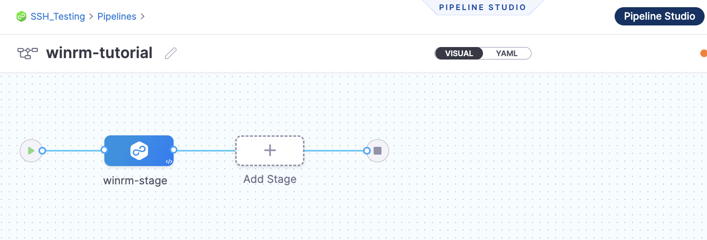
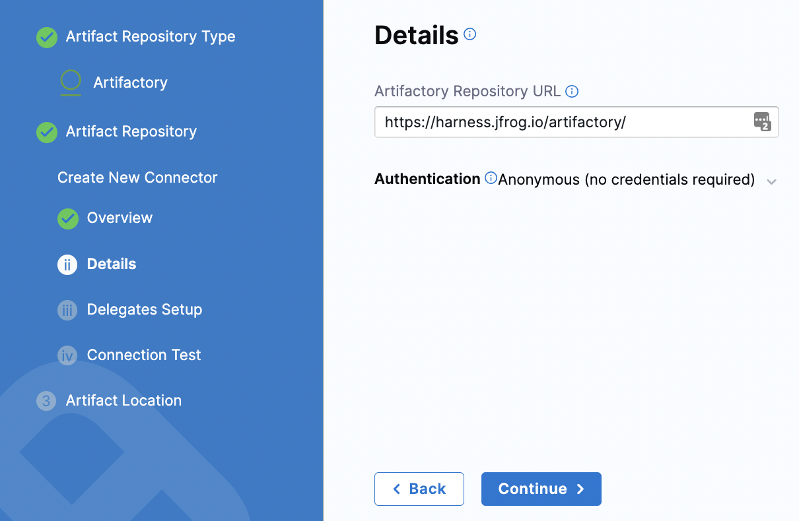
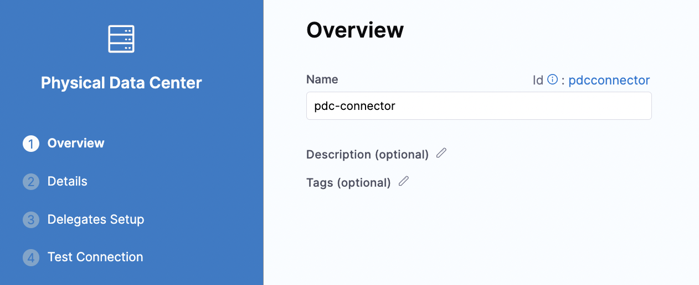
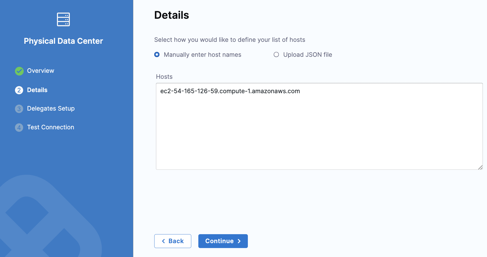
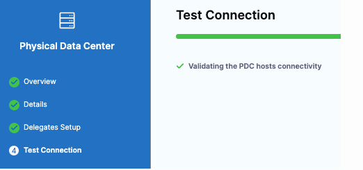
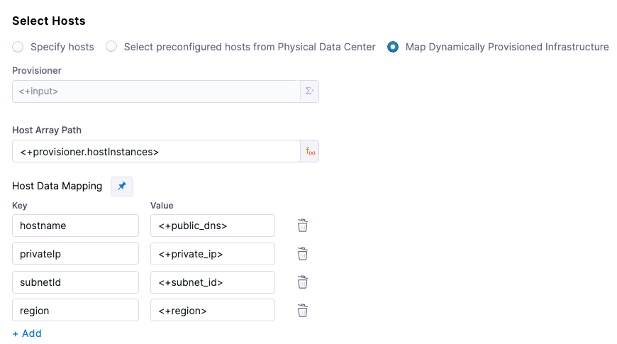

# Windows VM deployments using WinRM

You can use Windows Remote Management (WinRM) to deploy your artifacts to Windows VM or bare-metal hosts located in Microsoft Azure, AWS, or any platform-agnostic Physical Data Center (PDC). Harness connects to your target Windows instances using the WinRM protocol and executes PowerShell commands to deploy your artifact.

In this topic, we will deploy a .zip file to an AWS EC2 Windows instance using Harness. We will pull a publicly-available .zip file from Artifactory and deploy it to an EC2 Windows instance in your AWS account by using the Basic execution strategy.

Harness connects to your target Windows instances using the WinRM protocol and executes PowerShell commands to deploy your artifact.

For WinRM, you can access artifacts from **Jenkins**, **Artifactory**, **Custom**, **Nexus** and **Amazon S3**.

The **Execution Strategies** supported for WinRM include **Blank Canvas**, **Basic**, **Rolling**, and **Canary**.

Supported security protocols for WinRM include Kerberos and Windows New Technology LAN Manager (NTLM).

[Harness File Store](/docs/continuous-delivery/x-platform-cd-features/services/add-inline-manifests-using-file-store) should be enabled if you want to upload Config files from the file store.

## Before You Begin

* Review Harness Key Concepts [Harness Key Concepts](/docs/getting-started/learn-harness-key-concepts) to establish a general understanding of Harness.
* Make sure that you have a Delegate available in your environment.
	+ You can install a Kubernetes or Docker Delegate.
	+ Ideally, you should install the Delegate in the same subnet as the target host(s)
* Target host — In this guide, we use an AWS EC2 instance as the target host.
* Credentials and other details for the EC2 Instance 
  * To configure and authenticate your WinRM credentials by using NTLM, you should have the domain name, username and password for the EC2 instance.

## Objectives

You will learn how to:

* Create a Harness WinRM service by using Windows New Technology LAN Manager (NTLM)
* Set up a Harness Artifactory Connector
* Add credentials needed to connect to the target host
* Define the target infrastructure for deployment (AWS hosts)
* Select the Basic deployment strategy
* Add the required commands for the execution
* Run the Pipeline and review

## Create the Deploy Stage

Pipelines are collections of stages. In this tutorial, we will create a new Pipeline and add a stage for WinRM deployments of artifacts to a target host.

1. In your Harness project, click **Pipelines**, and then **Create a Pipeline**.
2. Enter a name for the pipeline: **winrm****-tutorial**. Keep the default **Inline (Pipeline is stored in Harness)** for **How do you want to set up your pipeline**.
3. Click **Start** and your pipeline appears.
4. Click **Add Stage**.
5. For **Select Stage Type**, select **Deploy**.
6. For **Stage Name**, enter: **winrm****-stage.**
7. For **Deployment Type**, select **WinRM** and click **Set Up Stage**.



## Create a Harness WinRM Service

Next, you will create a Harness Service that represents your application. Once you have created a Service, it is persistent and can be used throughout the stages of this or any other Pipeline in the Project.

The Harness WinRM Service contains the application package artifact (file or metadata) and the related config files to deploy on the target host.

Let's create the Service for an application artifact.

1. For **Select Service**, click **New Service,** enter a name for the service: **winrm-service****.** You will use this name when selecting this Service in Harness Environments.
2. For **Service Definition**, in **Deployment Type**, select **WinRM** and click **Continue.**

### Add the Artifactory Connector

Harness includes Connectors for all the major artifact repositories. In this tutorial, we will use a **todolist.zip** file, available in a public Harness Artifactory repo.

1. In **Artifacts**, click **Add Primary Artifact**.
2. In **Specify Artifact Repository Type**, select **Artifactory** and click **Continue**.
3. For the Artifactory Connector, select **New Artifactory Connector**.
4. In **Name**, enter a name for the connector: **artifactory-connector** and click **Continue**.
5. In **Details**, enter the following URL path for **Artifactory Repository URL** or click the tooltip and copy the URL: **https://harness.jfrog.io/artifactory**. In this tutorial, we will use the artifacts stored in that repository.
6. For **Authentication**, click the down-drop arrow for **Username and Password**. Then, select **Anonymous (no credentials required)**. Click **Continue**.
   	
	

7. Click **Continue** to connect with Artifactory by using a Harness Delegate.
8. In **Delegates Setup**, retain the default selection: **Use any available delegate**.
9. Click **Save and Continue**.
10. In **Connection Test**, Harness validates the Artifactory Repository authentication and permissions for the repo. Click **Continue**. If the test fails, that means the Delegate can't connect to **https://harness.jfrog.io/artifactory/**. Make sure that the EC2 instance hosting the Delegate can make outbound connections to **https://harness.jfrog.io/artifactory**/.

### Set up Artifact Location and Details

For this tutorial, we'll use a **ToDo List** app artifact, **todolist.zip**, available in a public Harness Artifactory repo.

1. In **Artifact Details**, for **Repository Format**, keep the default value **Generic**.
2. For **Repository**, enter: **todolist-tutorial**. Note that if you select the down-drop menu for Repository, Harness loads any available repositories and displays them for selection.
3. for **Artifact Directory**, enter a forward slash **/**.
4. For **Artifact Details**, keep the default **Value**.
5. For **Artifact Path**, leave the default Runtime Input value **<+input>** for that field. Click **Submit.** The **Artifactory Connector** is added to **Artifacts.** Click **Continue**.

## Define the target infrastructure

You define the target infrastructure for your deployment in the **Environment** settings of the pipeline stage. You can define an environment separately and select it in the stage, or create the environment within the stage **Environment** tab.

There are two methods of specifying the deployment target infrastructure:

- **Pre-existing**: the target infrastructure already exists and you simply need to provide the required settings.
- **Dynamically provisioned**: the target infrastructure will be dynamically provisioned on-the-fly as part of the deployment process.

For details on Harness provisioning, go to [Provisioning overview](/docs/continuous-delivery/cd-infrastructure/provisioning-overview).

### Selecting hosts

When you set up the Infrastructure Definition for the stage, there are three options for selecting the target hosts:

- **Specify hosts**
- **Select preconfigured hosts from Physical Data Center**
- **Map Dynamically Provisioned Infrastructure**

The **Specify hosts** or **Select preconfigured hosts from Physical Data Center** options are used when you are deploying to a pre-existing infrastructure.

The **Map Dynamically Provisioned Infrastructure** option is used when your are deploying to a dynamically provisioned infrastructure.

### Pre-existing infrastructure

Let's look at an example of setting up an Infrastructure Definition for a pre-existing infrastructure.

1. In **Specify Environment**, click **New Environment** enter **winrm-env** for **Name.** This is the name that you will use when you select this Infrastructure Definition.
2. For **Environment Type**, select **Pre-****Production**, and click **Save**.
3. For **Specify Infrastructure**, click **New infrastructure**.
4. Enter a name for the new infrastructure: **winrm-infra**.
5. For **Select Infrastructure Type**, select **Physical Data Center**.
6. Scroll down to view Infrastructure definition.
7. Keep the default selection: **Select preconfigured hosts from Physical Data Center**.

#### Create the PDC Connector for the Host

1. In **Infrastructure Definition**, for **Connector**, click **Select Connector** to create the Connector for PDC.
2. In **Create or Select an Existing Connector**, select **New Connector**.
3. For **Name**, enter **pdc-connector** and click **Continue**.

   

4. In **Details**, keep the default selection for **Manually enter host names**. In **Hosts**, enter the host name for your EC2 instance and click **Continue**.
   
   

5. In **Delegates Setup**, keep the default for **Use any available Delegate**. Click **Save** and **Continue**.
6. In **Test Connection**, Harness validates the connectivity for the PDC host. Click **Finish**.
   
   

#### Use WinRM Credentials with NTLM to Authenticate

We will now create the credentials for the secret that is used by Harness to connect to the target host.

1. For **Specify Credentials**, click **Create or Select a Secret**.
2. in **Create or Select an Existing Secret**, click **New WinRm Credential**.
3. In **WinRm Details**, enter a name for this credential.
4. For **Select an Auth Scheme**, keep the default **NTLM**.
5. For **Domain**, enter the domain name for your EC2 instance.
6. For **Username**, enter the user name used to access the EC2 instance.
7. For **Password**, click **Create or Select a Secret**.
8. In **Create or Select an Existing Secret**, click **New Secret Text**.
9. In **Add new Encrypted text**, enter a name for this secret. This is the name you will use to reference the text elsewhere in your resources.
10. In **Secret Value**, enter the password that you use to access the EC2 instance. Click **Save** and **Password** is populated with the secret you created.
11. Click the checkboxes for **Use SSL** and **Skip Cert Check**. Leave the **Use No Profile checkbox** empty.
12. For **WinRM Port**, keep the default port number **5986**. Click **Save and Continue**.
13. For **Add a Host Name to start Verification**, enter the hostname for your EC2 instance and click **Test Connection**. Harness checks for Delegates and verifies the connection to the target host.
14. In **Create New Infrastructure**, click **Preview Hosts**.
15. Click the checkbox for the host and click **Test Connection.** The WinRM connection to the EC2 instance is tested. Click **Finish**. Click **Continue**.

### Dynamically provisioned infrastructure

:::note

Currently, the dynamic provisioning documented in this topic is behind the feature flag `CD_NG_DYNAMIC_PROVISIONING_ENV_V2`. Contact [Harness Support](mailto:support@harness.io) to enable the feature.

:::

Here is a summary of the steps to dynamically provision the target infrastructure for a deployment:

1. **Add dynamic provisioning to the CD stage**:
   1. In a Harness Deploy stage, in **Environment**, enable the option **Provision your target infrastructure dynamically during the execution of your Pipeline**.
   2. Select the type of provisioner that you want to use.
   
      Harness automatically adds the provisioner steps for the provisioner type you selected.
   3. Configure the provisioner steps to run your provisioning scripts.
   4. Select or create a Harness infrastructure in **Environment**.
2. **Map the provisioner outputs to the Infrastructure Definition**:
   1. In the Harness infrastructure, enable the option **Map Dynamically Provisioned Infrastructure**.
   2. Map the provisioning script/template outputs to the required infrastructure settings.

#### Supported provisioners

The following provisioners are supported for WinRM deployments:

- Terraform
- Terragrunt
- Terraform Cloud
- CloudFormation
- Azure Resource Manager (ARM)
- Azure Blueprint
- Shell Script

#### Adding dynamic provisioning to the stage

To add dynamic provisioning to a Harness pipeline Deploy stage, do the following:

1. In a Harness Deploy stage, in **Environment**, enable the option **Provision your target infrastructure dynamically during the execution of your Pipeline**.
2. Select the type of provisioner that you want to use.
   
   Harness automatically adds the necessary provisioner steps.
3. Set up the provisioner steps to run your provisioning scripts.

For documentation on each of the required steps for the provisioner you selected, go to the following topics:

- Terraform:
  - [Terraform Plan](/docs/continuous-delivery/cd-infrastructure/terraform-infra/run-a-terraform-plan-with-the-terraform-plan-step)
  - [Terraform Apply](/docs/continuous-delivery/cd-infrastructure/terraform-infra/run-a-terraform-plan-with-the-terraform-apply-step)
  - [Terraform Rollback](/docs/continuous-delivery/cd-infrastructure/terraform-infra/rollback-provisioned-infra-with-the-terraform-rollback-step). To see the Terraform Rollback step, toggle the **Rollback** setting.
- [Terragrunt](/docs/continuous-delivery/cd-infrastructure/terragrunt-howtos)
- [Terraform Cloud](/docs/continuous-delivery/cd-infrastructure/terraform-infra/terraform-cloud-deployments)
- CloudFormation:
  - [Create Stack](/docs/continuous-delivery/cd-infrastructure/cloudformation-infra/provision-with-the-cloud-formation-create-stack-step)
  - [Delete Stack](/docs/continuous-delivery/cd-infrastructure/cloudformation-infra/remove-provisioned-infra-with-the-cloud-formation-delete-step)
  - [Rollback Stack](/docs/continuous-delivery/cd-infrastructure/cloudformation-infra/rollback-provisioned-infra-with-the-cloud-formation-rollback-step). To see the Rollback Stack step, toggle the **Rollback** setting.
- [Azure Resource Management (ARM)](/docs/continuous-delivery/cd-infrastructure/azure-arm-provisioning)
- [Azure Blueprint](/docs/continuous-delivery/cd-infrastructure/azure-blueprint-provisioning)
- [Shell Script](/docs/continuous-delivery/cd-infrastructure/shell-script-provisioning)


#### Mapping provisioner output

Once you set up dynamic provisioning in the stage, you must map outputs from your provisioning script/template to specific settings in the Harness Infrastructure Definition used in the stage.

1. In the same CD Deploy stage where you enabled dynamic provisioning, select or create (**New Infrastructure**) a Harness infrastructure.
2. In the Harness infrastructure, in **Select Infrastructure Type**, select **Physical Data Center**, **Azure**, or **AWS**.
3. In **Select Hosts/Azure/Amazon Web Services Infrastructure Details**, enable the option **Map Dynamically Provisioned Infrastructure**.
   
   A **Provisioner** setting is added and configured as a runtime input.
4. Map the provisioning script/template outputs to the required infrastructure settings.

To provision the target deployment infrastructure, Harness needs specific infrastructure information from your provisioning script. You provide this information by mapping specific Infrastructure Definition settings in Harness to outputs from your template/script.

For WinRM infrastructures, Harness needs the following settings mapped to outputs:

- Physical Data Center (PDC):
  - **Host Array Path**
  - **Host Data Mapping**: you should map outputs for all of the necessary connection information. For example, if the VM(s) on a cloud platform:
    - hostname
    - privateIp
    - subnetId
    - region
- Azure:
  - **Subscription Id**
  - **Resource Group**
  - **Tag** (optional)
- AWS:
  - **Region**
  - **Tag** (optional)

:::note

Ensure the mapped settings are set to the **Expression** option.

:::

#### Host Array Path

For WinRM PDC deployments, you use the expression `<+provisioner.OUTPUT_NAME>` for the **Host Array Path** setting. 

For the subsequent **Host Data Mapping** key-value pairs, you use the expression format `<+HOST_PROPERTY>`. For example, `<+public_dns>`.

Here's an example:

  


#### Example

Here's a snippet of a Terraform script that provisions the infrastructure for an AWS EC2 VM WinRM deployment and includes the required outputs for Physical Data Center:

```json

provider "aws" {
  region = "us-east-1"  # Replace with your desired AWS region
}

resource "aws_vpc" "example" {
  cidr_block = "10.0.0.0/16"
}

resource "aws_subnet" "example" {
  vpc_id     = aws_vpc.example.id
  cidr_block = "10.0.1.0/24"
}

resource "aws_security_group" "example" {
  name_prefix = "example-"
}

resource "aws_instance" "example" {
  ami                    = "ami-xxxxxxxxxxxxxxxxx"  # Replace with the desired Windows AMI ID
  instance_type          = "t2.micro"
  subnet_id              = aws_subnet.example.id
  vpc_security_group_ids = [aws_security_group.example.id]

  tags = {
    Name = "ExampleInstance"
  }

  provisioner "remote-exec" {
    inline = [
      "winrm quickconfig -q",
      "winrm set winrm/config/service/auth @{Basic=\"true\"}",
      "winrm set winrm/config/service @{AllowUnencrypted=\"true\"}",
      "winrm set winrm/config/winrs @{MaxMemoryPerShellMB=\"1024\"}",
    ]
  }

  connection {
    type        = "winrm"
    user        = "Administrator"
    password    = "YourPassword"  # Replace with your desired Windows password
    timeout     = "10m"
    insecure    = true
    https       = true
  }
}

output "hostname" {
  value = aws_instance.example.public_dns
}

output "privateIp" {
  value = aws_instance.example.private_ip
}

output "subnetId" {
  value = aws_subnet.example.id
}

output "region" {
  value = provider.aws.region
}

```


In the Harness Infrastructure Definition, you map outputs to their corresponding settings using expressions in the format `<+provisioner.OUTPUT_NAME>`, such as `<+provisioner.region>`.

<figure>

<docimage path={require('./static/8722541e819fd752abc35693bd00e38cca2bce5df264afa89cbf61288fbc0604.png')} width="60%" height="60%" title="Click to view full size image" />

<figcaption>Figure: Mapped outputs</figcaption>
</figure>

#### Reference mapped instance properties

Once you have mapped provisioning script outputs to the stage Infrastructure Definition, you can reference them in **Execution** of the stage.

To reference a mapped output, you use an expression in the format `<+instance.properties.*>`.

For example, here are some **Host Data Mapping** *keys* and expressions that reference them:

- hostname: `<+instance.properties.hostname>`
- privateIp: `<+instance.properties.privateIp>`
- subnetId: `<+instance.properties.subnetId>`
- region: `<+instance.properties.region>`

## Use a Basic Deployment for WinRM Execution

You are now taken to **Execution Strategies** where you will use a deployment strategy and run your pipeline.

1. In **Execution Strategies**, select **Basic**.
2. For **Package type**, select **tudolist.zip** and keep the defaults for the other selections.
3. Click **Use Strategy**. Harness adds the **Deploy** step for execution.
4. In the **Deploy** step that is added to your pipeline, click **Deploy**.

## Run the Pipeline to Deploy and Review

After selecting the Execution Strategy, we are now ready to run the pipeline.

1. Click **Run** to run the pipeline.
2. In **Run Pipeline**, for **Artifact Path**, click the down-drop arrow. Harness displays a list of available artifact packages.
3. Select **todolist.zip** file.
4. Click **Run Pipeline**. Harness runs the pipeline and the **Console View** displays the tasks executed for each step.

You have now successfully created and completed the steps for running a pipeline by using WinRM.

## Notes

### Reference hosts in steps using expressions

You can use all of the `<+instance...>` expressions to reference your hosts.

For Microsoft Azure, AWS, or any platform-agnostic Physical Data Center (PDC):

* [<+instance.hostName>](/docs/platform/Variables-and-Expressions/harness-variables#instancehostname)
* [<+instance.host.hostName>](/docs/platform/Variables-and-Expressions/harness-variables#instancehostinstancename)
* [<+instance.name>](/docs/platform/Variables-and-Expressions/harness-variables#instancename)

For Microsoft Azure or AWS:

* [<+instance.host.privateIp>](/docs/platform/Variables-and-Expressions/harness-variables#instancehostprivateip)
* [<+instance.host.publicIp>](/docs/platform/Variables-and-Expressions/harness-variables#instancehostpublicip)

`instance.name` has the same value as `instance.hostName`. Both are available for backward compatibility.
