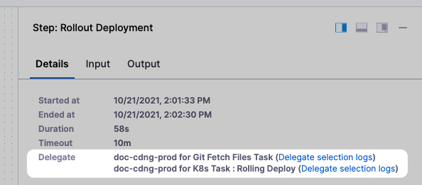

This article addresses some frequently asked questions about Harness Continuous Delivery & GitOps.

For an overview of Harness' support for platforms, methodologies, and related technologies, go to [Supported platforms and technologies](/docs/platform/platform-whats-supported.md).

For a list of CD supported platforms and tools, go to [CD integrations](/docs/continuous-delivery/cd-integrations.md).


### Harness entities

For an overview of Harness entities, see [Learn Harness' key concepts](/docs/platform/get-started/key-concepts.md).

#### What is a service instance in Harness?

A service is an independent unit of software you deploy through Harness CD pipelines.

This will typically map to a service in Kubernetes apps, or to an artifact you deploy in traditional VM-based apps.

Service instances represent the dynamic instantiation of a service you deploy with Harness.

For example, for a service representing a Docker image, service instances are the number of pods running the Docker image.


Notes:

* For services with more than 20 service instances - active pods or VMs for that service - additional service licenses will be counted for each 20 service instances. This typically happens when you have large monolith services.
* See the **Pricing FAQ** at [Harness pricing](https://harness.io/pricing/).

#### What are organizations and projects?

Harness organizations (orgs) allow you to group projects that share the same goal. For example, all projects for a business unit or division.

Within each org you can add several Harness projects.

A Harness project contains Harness pipelines, users, and resources that share the same goal. For example, a project could represent a business unit, division, or simply a development project for an app.

Think of projects as a common space for managing teams working on similar technologies. A space where the team can work independently and not need to bother account admins or even org admins when new entities like connectors, delegates, or secrets are needed.

Much like account-level roles, project members can be assigned project admin, member, and viewer roles

#### What is a Harness pipeline?

Typically, a pipeline is an end-to-end process that delivers a new version of your software. But a pipeline can be much more: a pipeline can be a cyclical process that includes integration, delivery, operations, testing, deployment, real-time changes, and monitoring.

For example, a pipeline can use the CI module to build, test, and push code, and then a CD module to deploy the artifact to your production infrastructure.

#### What's a Harness stage?

A stage is a subset of a pipeline that contains the logic to perform one major segment of the pipeline process. Stages are based on the different milestones of your pipeline, such as building, approving, and delivering.


Some stages, like a deploy stage, use strategies that automatically add the necessary steps.


#### What are services in Harness?

A service represents your microservices and other workloads logically.

A service is a logical entity to be deployed, monitored, or changed independently.

#### What are service definitions?

When a service is added to the stage in a pipeline, you define its service definition. Service definitions represent the real artifacts, manifests, and variables of a service. They are the actual files and variable values.

You can also propagate and override a service in subsequent stages by selecting its name in that stage's service settings.

#### What artifacts does Harness support?

Harness supports all of the common repos.

See [Connect to an artifact repo](/docs/platform/connectors/artifact-repositories/connect-to-an-artifact-repo).

#### What's a Harness environment?

Environments represent your deployment targets logically (QA, production, and so on). You can add the same environment to as many stages as you need.

#### What are Harness infrastructure definitions?

Infrastructure definitions represent an environment's infrastructure physically. They are the actual clusters, hosts, and so on.

#### What are Harness connectors?

Connectors contain the information necessary to integrate and work with third-party tools.

Harness uses connectors at pipeline runtime to authenticate and perform operations with a third-party tool.

For example, a GitHub connector authenticates with a GitHub account and repo and fetches files as part of a build or deploy stage in a pipeline.

See Harness [Connectors how-tos](/docs/category/connectors).

### Secrets management

#### How does Harness manage secrets?

Harness includes built-in secrets management to store your encrypted secrets, such as access keys, and use them in your Harness account. Harness integrates will all popular secrets managers.

See [Harness secrets management overview](/docs/platform/secrets/secrets-management/harness-secret-manager-overview).

### Harness variables expressions

Harness includes built-in expressions to identify settings.

See [Built-in Harness variables reference](../platform/variables-and-expressions/harness-variables.md).

Most settings in Harness pipelines allow you to use fixed values, runtime inputs, and expressions.

See [Fixed values, runtime inputs, and expressions](/docs/platform/variables-and-expressions/runtime-inputs).

#### Can I reference settings using expressions?

Yes. Everything in Harness can be referenced by a fully qualified name (FQN). The FQN is the path to a setting in the YAML definition of your pipeline.

See [Built-in Harness variables reference](../platform/variables-and-expressions/harness-variables.md).

#### Can I enter values at runtime?

Yes. You can use runtime Inputs to set placeholders for values that will be provided when you start a pipeline execution.

See [Fixed values, runtime inputs, and expressions](/docs/platform/variables-and-expressions/runtime-inputs).

#### Can I evaluate values at run time?

Yes. With expressions, you can use Harness input, output, and execution variables in a setting.

All of these variables represent settings and values in the pipeline before and during execution.

At run time, Harness will replace the variable with the runtime value.

See [Fixed Values, runtime inputs, and expressions](/docs/platform/variables-and-expressions/runtime-inputs).

#### Error evaluating certain expressions in a Harness pipeline

Some customers have raised concerns about errors while trying to evaluable expressions (example: `<+pipeline.sequenceId>`) while similar expressions do get evaluated. In this case the concatenation in the expression `/tmp/spe/<+pipeline.sequenceId>` is not working because a part of expression `<+pipeline.sequenceId>` is integer so the concatenation with `/tmp/spec/` is throwing error because for concat, both the values should be string only. 

So we can invoke the `toString()` on the integer value then our expression should work. So the final expression would be `/tmp/spe/<+pipeline.sequenceId.toString()>`. 

#### How to carry forward the output variable when looping steps?

If you are using looping strategies on steps or step groups in a pipeline, and need to carry forward the output variables to consecutive steps or with in the loop, you can use  `<+strategy.iteration>` to denote the iteration count.

For example, assume a looping strategy is applied to a step with the identifier `my_build_step.` which has an output variable `my_variable` The expression `<+pipeline.stages.my_build_step.output.outputVariables.my_variable>` won't work. Instead, you must append the index value to the identifier in the expression, such as: `<+pipeline.stages.my_build_step_0.output.outputVariables.my_variable>`

If you are using with in the loop you can denote the same as `<+pipeline.stages.my_build_step_<+strategy.iteration>.output.outputVariables.my_variable>`

See [Iteration Counts](/docs/platform/pipelines/looping-strategies/looping-strategies-matrix-repeat-and-parallelism/#iteration-counts)

#### How do I get the output variables from pipeline execution using Harness NG API?

We have an api to get the pipeline summary:
 
https://apidocs.harness.io/tag/Pipeline-Execution-Details#operation/getExecutionDetailV2
 
If you pass the flag `renderFullBottomGraph` as true to this api it also gives you the output variables in the execution. You can parse the response to get the output variables and use it accordingly.

#### We have multiple accounts, like sandbox and prod, and we want to move the developments from sandbox to prod easily. Is there a solution for this?

Absolutely! We recommend customers to use test orgs or projects for sandbox development. Our hierarchical separation allows them to isolate test cases from production workloads effectively.

For pipeline development concerns, we have a solution too. Customers can utilize our built-in branching support from GitX. You can create a separate branch for building and testing pipeline changes. Once the changes are tested and verified, you can merge the changes into their default branch.

Sandbox accounts are most valuable for testing external automation running against Harness, which helps in building or modifying objects. This way, you can test changes without affecting production environments.


#### Is there an environment variable to set when starting the container to force the Docker delegate to use client tool libs from harness-qa-public QA repo?

To achieve this, you need to create a test image that points to the harness-qa-public QA repository. This involves updating the Docker file with the appropriate path to the QA buckets.


#### If I delete an infrastructure definition after deployments are done to it, what are the implications other than potential dashboard data loss for those deployments ?

At the moment there is no dependency on the instance sync and infrastructure definition. Infrastructure definition is used only to generate infrastructure details. The instance sync is done for service and environment. Only in case if any these are deleted, the instance sync will stop and delete instances.

:::info

If you are using the default release name format in Harness FirstGen as `release-${infra.kubernetes.infraId}`, it's important to note that when migrating to Harness NextGen, you will need to replace `${infra.kubernetes.infraId}` with the new expression. In Harness NextGen, a similar expression `<+INFRA_KEY>` is available for defining release names. However, it's crucial to understand that these expressions will resolve to completely different values compared to the expressions used in Harness FirstGen.

:::

#### Error when release name is too long.

In the deployment logs in Harness, you may get an error similar to this:

```
6m11s Warning FailedCreate statefulset/release-xxx-xxx create Pod release-xxx-xxx-0 in StatefulSet release-xxx-xxx failed error: Pod "release-xxx-xxx-0" is invalid: metadata.labels: Invalid value: "release-xxx-xxx-xxx": must be no more than 63 characters
```

This is an error coming from the kubernetes cluster stating that the release name is too long.  This can be adjusted in the Environments section.
1. Select the environment in question.
2. Select infrastructure definitions, and select the name of the infrastructure definition.
3. Scroll down and expand **Advanced**, and then modify the release name to be something shorter.


#### Is it possible to apply notification rule on environment level for workflow failure/success?

Workflow notification strategy can only interpret Condition,Scope, and User Group fields. So, all the notification rules are applied on workflow level.


#### Can we use matrices to deploy multiple services to multiple environments when many values in services and environments are not hardcoded?

Yes, you can use matrices for deploying multiple services to multiple environments even if many values in services and environments are not hardcoded.


#### How to test Harness entities (service, infra, environment) changes through automation?

Harness by default will not let the user push something or create any entity which is not supported or is incorrect as our YAML validator always makes sure the entity is corrected in the right format.
 
You can use YAML lint to verify the YAML format of the entity. There is no way to perform testing (automation testing, unit testing, etc.) of Harness entities before releasing any change within those entities.


#### Can we use variables in the vault path to update the location dynamically based on environment?

A expression can be used in the URL, for example - Setting up a PATH variable in the pipeline and calling that variable in the get secret - echo "text secret is: " ```<+secrets.getValue(<+pipeline.variables.test>)>```


#### How do I use OPA policy to enforce environment type for each deployment stage in a pipeline i.e. prod or pre-prod?

The infra details are passed as stage specs.

For example, to access the environment type, the path would be - ```input.pipeline.stages[0].stage.spec.infrastructure.environment.type```
You will have to loop across all the stages to check its infra spec.


#### Do we support services and environments at the org level ?

Yes, we do. For more please refer this in following [Documentation](https://developer.harness.io/docs/continuous-delivery/get-started/services-and-environments-overview/#creating-services-at-an-account-or-organization-level).


#### How do I created a OPA policy to enforce environment type?

The infra details are passed as stage specs.
For example, to access the environment type, the path would be - ```input.pipeline.stages[0].stage.spec.infrastructure.environment.type```
You will have to loop across all the stages to check its infra spec.


#### How to view Deployment history (Artifact SHA) for a single service on an environment?

You can go to Service under the project --> Summary will show you the details with what artifact version and environment. 


#### Question about deployToAll yaml field, The pipeline yaml for the environment contains deployToAll field. What does that field do?

The field is used when you use the deploy to multiple infrastructures option. 
This field is for deploy to all infra inside an environment. 
[Documentation](https://developer.harness.io/docs/continuous-delivery/x-platform-cd-features/advanced/multiserv-multienv/).


#### What is the purpose of overriding Service Variables in the Environment configured in the Stage Harness?
Overriding Service Variables allows you to modify or specify specific values for your services in a particular environment or stage, ensuring that each deployment uses the appropriate configurations.


#### How do I override Service Variables in a Harness Environment within a Stage?
You can override Service Variables in Harness by navigating to the specific Environment within a Stage configuration and then editing the Environment's settings. You can specify new values for the Service Variables in the Environment settings.


#### Can I override Service Variables for only certain services within an Environment?
You can selectively override Service Variables for specific services within an Environment.


#### What happens if I don't override Service Variables for a specific Environment in a Stage?
If you don't override Service Variables for a particular Environment in a Stage, the values defined at the Service level will be used as the default configuration. This can be useful for consistent settings across multiple Environments.


#### Can I revert or undo the overrides for Service Variables in an Environment?
You can revert or undo the overrides for Service Variables in an Environment anytime you can revert variables to their default values.


#### What are some common use cases for overriding Service Variables in an Environment?

   - **Environment-specific configurations:** Tailoring database connection strings, API endpoints, or resource sizes for different environments (e.g., dev, staging, production).
   - **Scaling:** Adjusting resource allocation and load balancer settings for different deployment environments.


#### Where can I find more information and documentation on overriding Service Variables in Harness?

You can find detailed documentation and resources on how to override Service Variables in Harness here: [Documentation](https://developer.harness.io/docs/continuous-delivery/x-platform-cd-features/environments/service-overrides/)


#### Can I use Harness to manage environment-specific configurations for my Cloud Functions?
Yes, Harness supports environment-specific configurations for your functions. You can use Harness secrets management to store sensitive information, such as API keys or database credentials, and inject them into your Cloud Functions during deployment.


#### Can I control sequence of serial and parallel in  Multi Services/Environments ?

No, we cannot control the sequence for Multi Services/Environment deployments. Please refer more on this in the following [Documentation](https://developer.harness.io/docs/continuous-delivery/x-platform-cd-features/advanced/multiserv-multienv/#deploying-in-parallel-or-serial)


#### Is it possible to add variables at the Infrastructure Definition level?
As of now, Harness does not provide direct support for variables within infrastructure definitions. However, you can achieve a similar outcome by using tags in the form of `key:value`. For example, you can define a tag like `region:us-east` and reference it using the following expression: `<+infra.tags.region>`.


####  How do I propagate an environment's namespace to another stage?
By using the following expression on the target stage, you will be able to propagate the namespace. Expression: `<+pipeline.stages.STAGE_IDENTIFIER.spec.infrastructure.output.namespace>`


#### How do I dynamically load values.yaml per environment?
Many of Harness's fields allow you to switch from a static field to an expression field. In your Helm chart/kubernetes manifests declaration, you can switch the values field to an expression field and use an expression like `<+env.name>-values.yaml`. Then, in your repository, create a value per environment.


#### How can a customer do migrating of Service Override for Environments for large configurations?

* **Terraform or APIs Used for Initial Configuration:** If the customer initially created the Harness configuration using Terraform, they can easily change the organization identifier by modifying the configuration file. Likewise, if APIs were used for the initial configuration, the same approach applies to change the organization identifier.
* **Creation from UI:** If the customer originally created the configuration through the user interface (UI), a different process is required. In such cases, the customer can follow these steps:
   - Utilize GET APIs to retrieve the existing configuration.
   - Create a new configuration for the new organization using the create APIs.
   - This allows for the necessary overrides and adaptations as needed for the new organization's requirements.

Please refer more on this in the following documentation: [Get Service Overrides](https://apidocs.harness.io/tag/ServiceOverrides#operation/getServiceOverrides) and [Create Service Overrides](https://apidocs.harness.io/tag/ServiceOverrides#operation/createServiceOverride).


#### Is there a specific rationale behind the restriction on using expressions when defining the deployment group for multi-environment deployments ?

Yes, this is indeed a limitation at present. When we initially introduced this feature, it was designed with fixed and runtime input support. Additionally, it's worth noting that we do not currently support passing a list for the service or environment field via an expression.


#### Is it possible to configure a Step Group to run on only a subset of the VMs in the infrastructure?

No, it is not possible to configure a Step Group to run on only a subset of the VMs in the infrastructure. The VMs are grouped at the Environment/Infrastructure level and cannot be further restricted at the Step Group level. 

You would need to apply the restriction at the Step level for each step that needs to run on a subset of the VMs.


#### How to pass the Environment and Infrastructure Definition as a string as a runtime parameter?
You can use the expression \<+trigger.webhook.payload.ref> to get the branch name from the GitHub webhook payload and pass it as the Environment value. In your pipeline, go to the stage where you want to set the Environment value, click on the Environment dropdown, select Runtime Input, and then enter a name for the input. In the Value field, enter the expression \<+trigger.webhook.payload.ref>. 
 
This will dynamically set the Environment value to the branch name from the GitHub webhook payload.


#### Is there an option to copy services/environments/connectors from one project to another?

The easiest way for this would be to copy the yaml for the service/environment or connectors and create the service/env / connector in another project via yaml and paste and create it. But no direct way to copy it to another project. 


#### How to set up allowed value for entity reference?

Unfortunately, it won't work. These are supposed to be ENTITY types. This is by design. 
In the entity type, you can't specify the allowed values. It's only for the Text, Email & Number type. The infrastructure definition is dependent field on the environment. Hence it will populate once you select the environment. 


#### Creation of environment via API?

We do support API's for the nextgen : https://apidocs.harness.io/tag/Environments#operation/createEnvironmentV2

```
curl -i -X POST \
  'https://app.harness.io/ng/api/environmentsV2?accountIdentifier=string' \
  -H 'Content-Type: application/json' \
  -H 'x-api-key: YOUR_API_KEY_HERE' \
  -d '{
    "orgIdentifier": "string",
    "projectIdentifier": "string",
    "identifier": "string",
    "tags": {
      "property1": "string",
      "property2": "string"
    },
    "name": "string",
    "description": "string",
    "color": "string",
    "type": "PreProduction",
    "yaml": "string"
  }'
```

#### Question about new update to Services and Environments (V2).

The v2 experience has more robust service and environment entities. V2 has service variables, independent infrastructure definitions, environment groups, and file and variable overrides.

With v2, you'll notice a major reduction in the configuration included in pipelines. These changes are also reflected in the Harness APIs.

All new deployment types (ECS, Deployment Template, SSH, WinRM, etc.) are available in v2 only. New innovations such as Enterprise GitOps, multi-services and multi-environments, and environment groups, are in v2 only.

The new v2 experience has been designed to provided users and organizations with simpler configurations and an improved ability to scale.


####  I am working on overrides creation using Terraform. As I see according to the latest update overrides were moved from the Environments tab to a separate tab. We have a use case where I must create all the 3 types provided under service-specific overrides. How to get YAML representation for all 3 types of override

You can get the the detail under Example Usage here https://registry.terraform.io/providers/harness/harness/latest/docs/resources/platform_service_overrides_v2


#### What are OAuth App access restrictions in a Git environment, and how do they affect my ability to push changes to a repository?

OAuth App access restrictions in a Git environment are security measures implemented by an organization to limit data access by third-party applications, even if the user has correct authorization credentials. These restrictions are typically applied to protect sensitive data and ensure secure collaboration. When these restrictions are in place, it may affect your ability to push changes to a repository. If you encounter an error message similar to "Although you appear to have the correct authorization credentials, the organization has enabled OAuth App access restrictions," it means that you are subject to these limitations.


#### Why one cannot configure multiple manifests in non-helm environment ?

At present, we only support Helm K8s and Helm deployments ( not charts as they are treated as artifacts) with multiple manifest services because , allowing for all swimlanes can cause a mega service that can deploy multiple applications and can cause problem in management of the same.


#### How do I change the service artifact source based on environment?

You can use variable expressions in artifact source templates to allow team members to select the repository, path, and tags to use when they run pipelines using artifact source templates. To override service variables at the environment level, you can create environment-level variables and override them for different environments.


#### Which has higher priority, Namespace set in manifest or Namespace provided in infra definition in Harness?

The namespace mentioned in the YAML file will have higher priority than the one mentioned in the infra definition.


#### Is "Scope to Specific Services" for Infra definitions going to available for NG as well ?

Yes, Scope to Specific Services for Infra definitions will be onboarded soon for Next-Gen as well.
For how to use Scope to Specific Services in First-Gen, please follow this [Documentation](https://developer.harness.io/docs/first-gen/continuous-delivery/model-cd-pipeline/environments/infrastructure-definitions/)


#### Is it possible to use Harness for managing cluster updates like ingress and IAM roles in EKS, without the Infrastructure Definition targeting a specific namespace, and ensuring that my YAML files are applied as expected?

The namespace in the YAML file will have higher priority than the one in the infra definition.


#### Can a Step Group be configured to run on a specific subset of the VMs within the infrastructure?

No, it's not possible to configure a Step Group to run on only a subset of the VMs in the infrastructure. VMs are grouped at the Environment/Infrastructure level, and this grouping cannot be further restricted at the Step Group level. To achieve this, you would need to apply the restriction at the individual Step level for each step that needs to run on a specific subset of the VMs.


#### Are services, environments, connectors, and overrides available for versioning within the GitExperience like pipelines?

Unfortunately, these entities cannot be versioned at the moment. However, you can manage and control them using Terraform, which allows for versioning.


#### Does Harness give Jenkins prompt as well while executing Jenkins jobs in pipeline?

The Jenkins prompt message are very specific to jenkins environment and the interaction for the prompts need to be done in jenkins itselg. We do not show the same prompt for interaction in pipeline execution.


#### How do I change the service artifact source based on the environment?

You can use variable expressions in artifact source templates to allow team members to select the repository, path, and tags to use when they run pipelines using artifact source templates. To override service variables at the environment level, you can create environment-level variables and override them for different environments.


#### Is there a way to filter how many of the deployments were to production ?

Yes, we can filter deployments if the environments used for the same are marked as `Prod`


#### How can multi-service pipelines be executed in parallel as stages while ensuring that users select a single environment for all these parallel stages?

One can use the following expression : `<+pipeline.variables.var_name>`


#### Does Harness allow passing of multi-environment as an expression ?

No, we don’t support passing in multi environment as an expression. The feature will be available soon
Please read more on this in the following [Documentation](https://developer.harness.io/docs/continuous-delivery/x-platform-cd-features/advanced/multiserv-multienv/)


#### Can one use a Repeat Looping Strategy if the infrastructure definitions are stored in a variable as CSV, and how can one access and perform actions for individual items within the Repeat Loop ?

You can leverage a Repeat Looping Strategy to iterate through infrastructure definitions stored in a CSV variable. Utilize the following YAML snippet:
```sh
repeat:
  items: <+VariableExpression>.split(",")
```

To access individual items within the Repeat Loop, use the `<+repeat.item>` expression


#### Is there a way to simply update the ECS scaling policy without redeploying the ECS service ?

Many users opt for a shell script approach, where a configuration file is utilized and set as an environment variable. Subsequently, a shell script is crafted to execute the relevant AWS CLI commands, facilitating the update of scaling policies for a deployed service. This versatile method allows for customization and automation across various scenarios and configurations


#### I have a pipeline containing different stages DEV-QA-UAT-PROD. In UAT I'm using Canary deployment and in PROD it's Blue-Green. In these scenarios how Harness provides proper Roll Back strategies?
Harness provides a declarative rollback feature that can perform rollbacks effectively in different deployment scenarios.
 
For Canary deployment in UAT, you can define the percentage of traffic to route to the new version and set up conditions to switch traffic between the old and new versions. If an anomaly is detected during the canary deployment, Harness will automatically trigger a rollback to the previous version.
 
For Blue-Green deployment in PROD, you can define the conditions to switch traffic between the blue and green environments. If an issue is detected in the green environment, you can easily switch back to the blue environment using the declarative rollback feature.
 
You can define the failure strategy on stages and steps in your pipeline to set up proper rollback strategies. You can add a failure strategy in the deploy stage by either ignoring the failure for the shell script or getting a manual intervention where you can mark that step as a success. Additionally, you can use the declarative rollback feature provided by Harness to perform rollbacks effectively in different deployment scenarios.


#### How to refer to the name and identifier for Infrastructure Definition using build-in variables from another stage?
ENV details can be referred from the previous stage using output expressions of that stage.


#### How to disable auto sync for production environments only within the GitOps app
You can update the RBAC to disable auto-sync for the entire GitOps app, but this may not be ideal if you want to enable auto-sync for other environments within the app.


#### Unable to delete a service

When you are trying to delete a service and it gives you an error saying it has running insatances. But you have already remove the pipeline/environment etc
As When you deploy using Harness , Harness runs a perpetal task to validate about the depployed instance using the infrastructure definition. 
Yoi can either bring down the instance from the infrastucture and then delete the service or use the Force Delete option in Harness if you want to delete the servie but still keep the deployed instance up and running. 


#### Is there a platform page where we can view the deployed image tags for each environment associated with a service ?

One can click on a service and  see all the environments and the artifacts that have been deployed. Higher level views can be accomplished through dashboard like DORA metrics. Please read  more insights on this in the documentation on [Monitor deployments and services in CD dashboards](https://developer.harness.io/docs/continuous-delivery/monitor-deployments/monitor-cd-deployments/)


#### How are Input Sets used during deployments?

During deployments, variables and secrets defined in Input Sets are injected into your application code or environment configurations.


#### What are Harness Overlays?

Harness Overlays are specialized Input Sets that enable you to customize deployments for specific environments or stages. They allow you to override or augment existing Input Set configurations without modifying the original set.


#### Can you provide an example of dynamic provisioning using AWS CDK TypeScript for an ECS deployment?
In the Harness Infrastructure Definition, you map outputs to their corresponding settings using expressions in the format \<+provisioner.STACK_NAME.OUTPUT_NAME>. For example, \<+provisioner.EcsCdkStack.RegionOutput> maps the required AWS region output for an ECS deployment.


#### Can access to specific environments be restricted for users or user groups?

Yes, access to specific environments can be restricted to users or user groups. By creating resource groups, and roles, and assigning permissions, users or groups can be limited to deploying to specific environments only.


#### What role do environment variables play, and where can they be utilized?

Environment variables serve as global variables for a specific environment. These variables can be leveraged in pipelines, manifests, and other configurations associated with that environment.


#### How are service configurations overridden in specific environments?

Service configuration overrides allow you to override service properties when deploying into a particular environment. This flexibility enables you to customize settings based on the target environment.


#### Can an environment have multiple infrastructure definitions?

Yes, an environment can contain multiple infrastructure definitions, each representing a specific VM, Kubernetes cluster, or target infrastructure. When selecting an environment in a pipeline, you can choose from these definitions.


#### What is the role of Environment Service Overrides in override priority?

Environment Service Overrides take precedence at the highest level in the priority order. Understanding how these overrides impact service settings is crucial for effective configuration.


#### How can remote Services, Environment and Infrastructure be created and consumed in Git Experience ?

In Git Experience one can have following options: 
- Remote resources can be persisted in different repositories and branches
- Support for linking these entities in Remote and Inline pipelines
- Moving inline resources to Remote resources
- Support for in-built features such as Service Dashboard and  Post Production Rollback for remote Services


#### Is there a way to restrict user to have only create permission for all the environment but execute on only few ?

For environment we do have access role , in case you do not want to give the user the ability to deploy to the environment and just create/edit it you can remove the access role for the same. So one uer can have a role binding with create access for all the environment types and another role binding with access permission to only few environment types to which we want to allow this user to deploy.


#### Can we create our own custom environment types?

We do not have a way to create environment types, by default there are only two environment types, production and pre-production.


#### What could be the reason for getting following error for Jenkins : `Invalid request: Failed to collect environment variables from Jenkins` ?

It is possible that the EnvInject plugin is not properly configured or enabled in Jenkins. You can check if the plugin is installed and enabled by going to `Jenkins > Manage Jenkins > Manage Plugins` and searching for `EnvInject`. If it is not installed, you can install it from the `Available` tab. If it is installed but not enabled, you can enable it from the Installed tab. Additionally, make sure that the job has the necessary permissions to access the environment variables.
Please read more on this in the following [Documentation](https://developer.harness.io/docs/internal-developer-portal/plugins/available-plugins/jenkins)


#### What is the purpose of merging values YAML files?
Merging values YAML files allows for:

* Overriding default values with environment-specific settings.
* Combining configuration from multiple sources (e.g., Service Definition and Service Overrides).
* Adapting deployments to different environments without modifying the base configuration.


#### What types of settings can be overridden?

* Manifests
* Config Files
* Variables
* Application Settings and Connection Strings (Global Environment only)


#### Can I combine different strategies in my pipeline? 
Yes, you can combine strategies, like using a canary deployment within a blue-green approach for further gradual rollout within the separate environment.


#### Does the Azure connector support service principles ?

Yes. We support System Assigned Managed Identity and User Assigned Managed Identity in the Azure Global and Government environments.
The service principal maps to a managed identity.


#### How would licensing work if a prospect prefers to use Harness CD solely as a script orchestrator for their existing pre-defined process without utilizing Harness Service or Environment for tracking ?

We don't charge separately for infrastructure provisioning swimlanes or custom script orchestration like 'cdk deploy.' Our current licensing model is straightforward, and there's no additional fee for this usage.


#### Can the linking of a GitOps cluster to an environment behave similarly to updating existing entities, allowing for seamless updates rather than producing an error when a link already exists ?

Indeed, the linking of a GitOps cluster to an environment involves an 'insert' call, creating a new link. However, it's worth noting that there's also an 'update' call in place, enabling the system to update the link when necessary, akin to the behavior observed with secret/connector/pipeline entities.
Please follow more in our [API Documentation](https://apidocs.harness.io/tag/Clusters/#operation/AgentClusterService_Update)


#### Do we have predefined rollback step while using shell script provisioning

No, Out for the box Rollback step is not available and you need to add your own scripts under Rollback section of the stage Environment


#### What does the exceeding quota log error in the harness delegate log mean?

We collect delegate logs in case we need to troubleshoot any issues in your pipelines so that you don't have to collect and send us logs. The error is harmless since it doesn't affect any functionality. You can choose to disable sending logs to us by adding an env variable in the delegate YAML documented at https://developer.harness.io/docs/platform/delegates/delegate-reference/delegate-environment-variables/


#### When we deploy multiple service to same infra, will it get a unique identifier if we are using the default release name ```release-<+INFRA_KEY_SHORT_ID>```?

Yes, The infrastructure key is generated by combining the serviceIdentifier, environmentIdentifier, and a specific set of values unique to each infrastructure definition implementation. Hence we would get a unique release name even when we deploy multiple services to same infra using the default release name.


#### How can I enable debug logging for the Terraform Plan Step?

To activate debug logging for the Terraform Plan step, include the environment variable ```TF_LOG=debug``` in the Advanced tab of your Terraform Plan step.


#### How is infra key formed for deployments.

The Infrastructure key (the unique key used to restrict concurrent deployments) is now formed with the Harness account Id + org Id + project Id + service Id + environment Id + connector Id + infrastructure Id.


#### What if the infra key formed in case when account Id + org Id + project Id + service Id + environment Id are same and the deployments are getting queued because of it.

To make the deployment work you can :

1. Add a connector in the select host field and specify the host.
2. Change the secret identifie (create a new with same key but differen identifier)


#### Does using organizational environments come with the same limitations observed at the organizational and account levels, particularly regarding the unavailability of the service metric page and rollback features ?

The service metrics page is not available for organizational/environment-level services. However, all other features are on par with project-level/ org-level services and environments without limitations.
Please read more on CD Service monitoring in the following [Documentation](https://developer.harness.io/docs/continuous-delivery/monitor-deployments/monitor-cd-deployments/)


#### What is the purpose of Harness PR Pipelines in GitOps?

Harness PR Pipelines provide first-class support for modifying GitOps Applications, especially those generated by ApplicationSets with the Git Generator. These pipelines enable users to make targeted changes to microservices in specific target environments, such as development or staging.


#### How does a GitOps ApplicationSet differ from traditional GitOps Applications?

An ApplicationSet acts as an Application factory, defining an application template and syncing it to multiple target environments. It uses generators, such as the Git Generator, to dynamically generate parameters and achieve application automation across various target environments.


#### Is the user can deploy the service to individual environments?
Yes, the user can configure the environment as runtime input.


#### The user would like to be able to deploy multiple artifacts in the same execution and not have to choose only one. Is that possible?
Yes, User can configure the multi-service deployment or else you can configure the parallel stages with the same service with different artifact. Doc: https://developer.harness.io/docs/continuous-delivery/x-platform-cd-features/advanced/multiserv-multienv/#deploy-multiple-services-to-one-environment


#### Is it possible for me to specify an artifact source based on the environment?

You can create overrides for manifest, config file, variable, and values.yaml.
For artifact overrides, I would suggest creating a variable override. You can define the artifact as an expression and use the variable expression.
Create separate variables for prod and non-prod and override the values based on the env.


#### How can you use CloudFormation with Harness?

You can use Harness with CloudFormation in two ways:
Dynamic infrastructure provisioning: you can provision the target infrastructure for a deployment as part of the stage's Environment settings, and then deploy to that provisioned infrastructure in the same stage.
Ad hoc provisioning: provision any resources other than the target infrastructure for the deployment.


#### Accessing a variable in namepsace of an environment which is defined in the shell script step of the pipeline.

You will need to add a custom stage and then export an output variable in order to use this output variable in the deploy stage environment variable as when the pipeline will execute it will initialize the service and environment before getting to tht shell setp. 


#### Environment Selection Options appearing in Custom Stages

Yes you can have the environment selection in custom stage. 
https://developer.harness.io/docs/platform/pipelines/add-a-stage/#environments-and-infrastructure-definitions-in-custom-stages


#### Conditional service overrides or manifest overrides?

You can override at environment level:
https://developer.harness.io/docs/continuous-delivery/deploy-srv-diff-platforms/kubernetes/cd-kubernetes-category/add-and-override-values-yaml-files
 
So you can create multiple yaml file and can use expression in yaml path to resolve correctly.
 
You can also override at runtime:
https://developer.harness.io/docs/continuous-delivery/deploy-srv-diff-platforms/kubernetes/cd-kubernetes-category/add-and-override-values-yaml-files#override-values-at-runtime


#### How does Harness NG rollback if something goes wrong in Production. Will it be automatically done or do we need to trigger anything manually?

You can perform rollbacks manually, automatically, or use a hybrid option (triggering it automatically but requiring approval before it happens).
Post-deployment rollback: This can be considered a manual approach, allowing you to rollback deployments that succeeded on technical criteria but that you want to roll back for other reasons. 
Rollback as a failure strategy: This could be considered an automatic approach. Whenever something is deployed into your environment and an issue occurs during the execution, the failure strategy will trigger the rollback flow. This can be a custom flow or a pre-generated one by Harness.


#### How to delete a job after its execution is complete?

You can add a shell script to check the job status before executing the Kubernetes Delete. To run kubectl commands, it's required to use the Harness Kubeconfig as an environment variable. Here's an example script for guidance:

```
export KUBECONFIG=${HARNESS_KUBE_CONFIG_PATH}
kubectl wait --for=condition=complete job/myjob -n <+infra.namespace>
```


#### How can I create overrides V2 at the infrastructure, environment, and service levels using CLI/API?

You can use the following API method to create overrides: [Create Service Override API](https://apidocs.harness.io/tag/ServiceOverrides#operation/createServiceOverride).


#### Do we need to have the service variable available in service configuration to add an override at environment level?

If the variable is not existing at the service level while creating environment override we will not get the variable in the list for selection. We still however can add a new variable and that will be considered for the override. 


#### Is there any known limitations with Harness CI/CD that we need to be aware of as it relates to being FedRamp ready in SMP ?

There should be no operational challenges encountered while utilizing Harness SMP within current FedRAMP environment.


#### How can a stage be skipped when asserting a CD built-in variable with multi-service/multi-env ?

In a multi-service, multi-environment scenario, an approach to bypass the staging process involves using the `<+matrix.identifier>` to skip based on the infrastructure identifier. It seems the intention is to skip specific infrastructures in a multi-service configuration, based on their configuration.


#### How are GCP Cloud Run services billed ?

They are facilitated through Deployment Templates. Consequently, deploying a service to a specific environment, such as "infra1," incurs billing for one service.


#### How can we mimic the functionality of assigning Usage Scopes in FirstGen connectors to specify allowed usage for environment types within NextGen ?

Functionality for assigning scopes are not yet possible to create. One can try using policies to enforce restriction.
Please read more on OPA Policies the following [Documentation](https://developer.harness.io/docs/continuous-delivery/x-platform-cd-features/advanced/cd-governance/harness-governance-overview/)

#
#### How is infra key formed for deployments

The infra key is formed from service Id + environment Id + connector Id +  infrastructure Id


#### How to differentiate between infra key if service Id, environment Id, connector Id, infrastructure Id are same to ensure deployments are not queued

You can either change the connector id (creating duplicate connector with same spec) or Change the secret identifier in case of secure shell deployments.


#### In the overview page why Environments always showed 0 when the reality there are some environments

The overview page offers a summary of deployments and overall health metrics for the project. Currently, the fields are empty as there are no deployments within the project. Once a deployment is in the project, these fields will be automatically updated.


#### What is the optimal number of ArgoCD instances required for bootstrapping environments and managing GitOps infrastructure?

The installation of the ArgoCD reconciler concurrently with environment creation streamlines the execution of GitOps practices at scale, thus mitigating the complexities associated with bootstrapping environments and managing GitOps infrastructure.
Please read more on this in our blog on [ArgoCD, Terraform and Harness](https://www.harness.io/blog/argocd-terraform-and-harness)


#### How can one obtain the overall status of a group after the looping process, particularly within a multi-environment deployment stage?

Harness provides the overall status after the looping process. The `Expression Engine V2` serves this purpose and was specifically designed for such use-cases.
Please read more on this in the following [Documentation][https://developer.harness.io/docs/platform/variables-and-expressions/expression-v2/]


#### In the context of a multi-environment deployment stage followed by a custom notification stage, is there a method to ascertain the status of the deployment stage?

Yes, there is a method to determine the status of the deployment stage within such a setup. Utilizing the Expression Engine V2 facilitates this requirement. Comprehensive information and guidance on this functionality can be found in the provided [Documentation](https://developer.harness.io/docs/platform/variables-and-expressions/expression-v2/)


#### What considerations need to be addressed regarding the integration of S3 steps within our containerized CD step groups, particularly concerning multi-line environment variables and file sharing across different stages?

Harness provides plugins which execute predefined functions and essentially serve as templated scripts, adaptable to any programming language, to perform specific tasks. One can also leverage [Drone plugin](https://plugins.drone.io/plugins/s3) for the same.
Please read more on this in the following [Documentation](https://developer.harness.io/docs/continuous-delivery/x-platform-cd-features/cd-steps/containerized-steps/plugin-step/)


#### For Helm Subchart support, if there are multiple subcharts, is there a way to define and manage these additional subcharts beyond the single field provided?

The utilization of Multiple Helm Charts facilitates the deployment of individual standalone Helm Charts via a single service. These charts, akin to artifact sources, correspond to Helm Charts per environment. The Sub Chart feature becomes particularly beneficial when users possess an umbrella chart with dependencies, as exemplified in the provided [GitHub repository](https://github.com/thisrohangupta/custom-remote-test-repo/tree/main/parent-chart/charts). Upon accessing`/charts/`, both the primary chart and child chart can be obtained.
One can also configure the YAML to add additional sub chart dependencies.
Please read more on this in the following [Documentation](https://developer.harness.io/docs/continuous-delivery/deploy-srv-diff-platforms/helm/deploy-helm-charts#using-subcharts)


#### How to trigger one pipeline from another and use the first pipeline's shell script output as inputs for the second, ensuring runtime inputs like environment and infrastructure names are passed?

One can use output variables from one pipeline as inputs for another, defining the receiving pipeline's variables as runtime inputs.
Please read more on this in the following [Documentation](https://developer.harness.io/kb/continuous-delivery/articles/output-variable-for-powershell-script/)


#### Why can't I see a new Service Override I created through the API in the UI

If using the `updateServiceOverride` [V1 Service API](https://apidocs.harness.io/tag/ServiceOverrides/#operation/updateServiceOverride) API, you will not be able to see the Service Override as this API is creating a V1 Service Override. V1 Services have been deprecated and thus is no longer supported. To create a Service Override via the API, use the new [V2 Service API ](https://apidocs.harness.io/tag/Environments/#operation/upsertServiceOverride).


#### Why I am not getting option to select multiple infrastructure?

Multiple infrastructure option is enabled only when the option "Deploy to multiple Environments or Infrastructures" is selected in the environment section of the pipeline.


#### What is ingress.yaml used for?

An ingress.yaml file in Kubernetes serves as a configuration blueprint for managing Ingress resources, which control external access to services within the cluster. These files contain settings defining rules for routing incoming HTTP and HTTPS traffic based on specified criteria such as hostnames and URL paths. Typically structured in YAML format, an ingress.yaml file outlines how requests from external sources are directed to different services within the Kubernetes cluster. This includes specifying which services handle traffic for particular hostnames or paths, along with any necessary configurations such as load balancing or SSL termination. In essence, ingress.yaml files provide a way to centrally manage and define the ingress behaviour for applications running in a Kubernetes environment, facilitating efficient routing and external access control.


#### Can I pull in environment files from Git?

It is not possible to pull the environment YAML file from Git. Import from Git feature is not yet available for service and Environment for GitEx.


#### How can I configure the delegate to utilize a new version of the Helm binary?

To integrate a new version of the Helm binary with the delegate:

1. Install the desired version of the Helm binary on the delegate host.
2. Set `HELM3_PATH` environment variable to point to the location of the newly installed Helm binary.

   This can be accomplished by adding the following lines to the delegate's YAML file:

   ```
   - name: HELM3_PATH
     value: /path/to/new/helm/binary
   ```

   Replace `/path/to/new/helm/binary` with the actual path to the newly installed Helm binary.

3. Restart the delegate to apply the changes.


#### Which entities such as service or environment are factors that determine the metrics displayed in Deployment Dashboard?

In our setup, two Looker dashboard models are specifically designed to showcase data solely from pipeline executions with a CD stage. The data aggregation and presentation within these views adapt dynamically based on the chosen attributes for display on the dashboard
Please read more on Looker/Dashboard Behaviour in the following [Doumentation](https://developer.harness.io/docs/cloud-cost-management/use-ccm-cost-reporting/ccm-cost-categories/cost-categories-usage/#behaviour)


#### What's the difference between matchType all and any?

If using a Filtered List to deploy to multiple environments, you can dynamically set which environments to deploy to using tags. The `matchType` field is used to define the operator for the tags list.

All - Only deploy to environments matching all the tags.

Any - Deploy to environments matching any of the tags.


#### Can our git experience be used for services. environments, and pipelines? Can we enforce that all resources for a specific projects only come from a specific git repo?

Yes, git experience can be used for services, envs and infra as well, also one can always enforce git repo for all entities at all levels (account, org, project).


#### Is it expected behavior for members of a group with permissions to create/edit Non-Production environments to be able to delete infrastructure definitions within those environments, despite not having explicit deletion permissions?

Yes, The behavior of infrastructure deletion is consistent with environment update operations. Infrastructure operations are treated as environment updates, which explains the ability to delete infrastructure definitions within the environment.
Please read more on Environment and InfraDefintion behaviour in the following [Documentation](https://developer.harness.io/docs/continuous-delivery/x-platform-cd-features/environments/create-environments/#important-notes).


#### In FirstGen, within the Infrastructure Definition, there was an option to provide Target Group details for a pipeline of type ASG deployment, which has now migrated to NextGen. How can this be provided in the NextGen pipeline?

Although ASG support has been redesigned in NextGen, we will be taking the target groups attached with your base ASG. So, all the target groups that the base ASG you provided in infrastructure is attached with will get attached to your new ASG also. No need to provide the target groups separately.


#### How do I setup TLS in GitOps Agent?

To setup TLS in the GitOps Agent, mount the certificates onto the Agent deployment:

```
containers:
  volumeMounts:
  - mountPath: /path/to/cert
    name: your-tls-cert-volume
volumes:
- name: your-tls-cert-volume
  configMap:
    name: your-tls-cert-configMap
    defaultMode: 420
```

Next, set the `SSL_CERT_FILE` environment variable in the Agent deployment manifest:

```
containers:
- command:
    - /app/agent
  name: gitops-agent
  image: harness/gitops-agent:v0.72.0
  imagePullPolicy: Always
  env:
    - SSL_CERT_FILE: "/path/to/cert/crt.pem"
```

This environment variable will tell the Agent to look at the file specified in the given path. In this example, the Agent will look at `/path/to/cert/cert/crt.pem` and use it for TLS.


#### When a Shell Script step is run on a delegate in a Custom stage, what is the environment that it is run within? As in, what is the current working directory it uses?

The default directory that the Shell Script steps run in is `/tmp` and is removed after the step finishes its execution.


#### How can one effectively manage remote environments and infrastructures within Harness SMP?

To enable remote environments and infrastructures in your Service Management Platform (SMP), follow these implementation guidelines:

- Make sure your SMP is updated to the latest version. 
- Activate the feature flag, `CDS_ENV_GITX` on the designated environment.
Go to [Manage Harness environments and infrastructures from Git](https://developer.harness.io/docs/platform/git-experience/manage-environments-infra-definitions) for more information.


#### Does Harness support the use of OpenID Connect(OIDC) for connecting to various systems such as Amazon Web Services(AWS) and Google Cloud Platform (GCP)?

Yes, we currently support OIDC integration for [Google Cloud Platform (GCP)](https://developer.harness.io/docs/platform/connectors/cloud-providers/ref-cloud-providers/gcs-connector-settings-reference/#use-openid-connect-oidc) and [Amazon Web Services (AWS)](https://developer.harness.io/docs/platform/connectors/cloud-providers/ref-cloud-providers/aws-connector-settings-reference/#credentials).

Additional support is coming soon, including facilitating authentication, short-lived token acquisition based on Harness context, and various operational tasks like deployment, builds, or secret retrieval within the respective cloud provider environments.


#### What options are available for freezing deployments in Harness?

In Harness, you can freeze deployments at different levels such as project, environment, or organization.


#### How can I specify freeze windows for specific test environments within projects in Harness?

To specify freeze windows for specific test environments within projects, you can utilize the Freeze Window feature at the project level in Harness. This allows you to halt specific environments as needed.


#### How can I handle uppercase environment identifiers in Harness variables and deploy pipelines?

Harness variables provide flexibility in managing environment identifiers, but dealing with uppercase identifiers like UAT and DR can pose challenges. One common requirement is converting these identifiers to lowercase for consistency. Here's how you can address this:

- Using [Ternary Operator](https://developer.harness.io/kb/continuous-delivery/articles/ternary-operator/): While if-else statements aren't directly supported in variables, you can leverage the ternary operator to achieve conditional logic.

- Updating Environment Setup: Another approach is to update your environment setup to ensure identifiers like UAT and DR are stored in lowercase. By maintaining consistency in the environment setup, you can avoid issues with case sensitivity in your deployment pipelines.


#### How can I prevent Terraform state drift caused by AWS ECR permissions policies created by Harness?

There are a couple of approaches you can take to mitigate this issue:

- Pre-create ECR repository: To avoid state drift, consider creating the ECR repository with the necessary permissions beforehand. Create an IAM policy that grants the required permissions for Harness actions, such as creating and updating services, tasks, and container instances. Attach this policy to the IAM role used by the ECS cluster. By doing this, ensure that the ECR repository has the correct permissions from the start, reducing the likelihood of drift.
- Modify Harness AWS connector permissions: Another option is to prevent Harness from altering IAM policies by adjusting the permissions within the Harness AWS connector. However, be cautious with this approach as it may impact the functionality of your deployment pipeline. Removing permissions related to the IAM policy from the Harness AWS connector can prevent unwanted changes to ECR permissions policies. Evaluate the impact on your workflow before implementing this solution.

By managing permissions and considering the implications of changes made by Harness, you can effectively address Terraform state drift and maintain the stability of your deployment environment.


#### How to get stage.Selected env?

You can use environment variables like `<+env.name>` or `<+env.identifier>`, so that it resolves to the environment used for that stage.


#### Can the two releases have the same name?

Yes. The release name is based on `serviceIdentifier-environmentIdentifier-connectorRef-namespace`. If both pipeline have same `serviceIdentifier`, `environmentIdentifier`, `connectorRef`, and `namespace`, then both releases have the same name.


#### Is the environment required in a custom stage?

No.


#### Can I set variables at the environment level with environments V2?

You can add variables directly in the Environment by navigating to override and selecting the environment tag.

If a service variable with same name exist, it is treated as overridden, otherwise it creates a variable you can access with the service variable expression syntax.


#### What does the Update Release Repo step expect for GitOps?

For the Update Release Repo step, you can enter variables in the step to update key-value pairs in the config file you are deploying. If there is a matching variable name in the variables of the Harness service or environment used in this pipeline, the variable entered in this step will override them.


#### Can I compare environment services in Harness?

Currently, this isn't possible in the UI. However, you can use the Harness API to retrieve environment configurations and compare them externally.


#### If the "All environments" option is used for a multiple environment deployment, why can we not specify infrastructure?
When the "All environments" option is selected we do not provide infrastructure selection in the pipeline editor. The infrastructure options are available in the run form.


#### How do I use all environments and only select infrastructure for multiple environment deployments?
Use filtered lists for this purpose. You can specify "Filter on Entities" as Environment in the first filter and select "Type" as all. Now for the infrastructure you can add another filter and provide the tag filter.


#### Why can a user with no permissions in an environment edit service and infrastructure specific overrides?
The user does not need environment related permissions for service and infrastructure specific overrides but only service edit/create permission. Hence even when they do not have access to a specific environment they will still be able to edit this override.


#### What does the feature flag, `HARNESS_AWS_ASSUME_ROLE_DURATION` do?
Once the `HARNESS_AWS_ASSUME_ROLE_DURATION` feature flag is enabled, you can set the environment variable value to override the default duration for assuming AWS roles. This feature requires Harness Delegate version 01.04.82700 or higher.


#### What is the most efficient method in Harness to allow users to select from one set of options while automatically populating the remaining variables without requiring user intervention?
You can achieve similar functionality using Overrides in Harness. Overrides enable you to define values for runtime inputs based on the specific environment or infrastructure where the pipeline is executed.

You can establish a default set of values for these inputs and then utilize overrides to populate them based on user selections. 

This streamlines the user experience by presenting only the relevant options, while automatically filling in the remaining values based on the selection.
For more information, go to [Service overrides](https://developer.harness.io/docs/continuous-delivery/x-platform-cd-features/environments/service-overrides/).


#### How can different versions be deployed to separate clusters or stages within a single pipeline?
You can enable the multi-service and multi-environment deployment strategy in your CD stage to deploy different service versions to different clusters or stages within the same pipeline using overrides at environment value.


#### Are environment level `<+input>` fields supported in the pipeline run screen?
Any variable used as `<+input>` will be asked to provide a value at the runtime.


#### How can I restrict a user to provide CPU and Memory values of CI step within the limit in harness?
This can be achieved via an OPA policy. You can create an OPA policy to check the values values for CPU and memory and warn and prevent the user from saving the pipeline if the values exceed your limit.
Here is an example of the Run step:
```
package pipeline_environment
deny[msg] {
input.pipeline.stages[_].stage.spec.execution.steps[_].step.spec.resources.limits.memory > "500M"
    # Error message with details about the naming convention
    msg := "Pipeline is using more memory than allowed"
}
deny[msg] {
input.pipeline.stages[_].stage.spec.execution.steps[_].step.spec.resources.limits.cpu > "0.5"
 msg := "Pipeline is using more CPU than allowed"
}
```

#### Does Harness support the ability to apply Kubernetes patches against existing resources?
Yes, the new Kubernetes Patch step enables users to apply specific configurations on deployments or post-deployment processes.
To effectively employ this feature, it is imperative to fulfill the following prerequisites:
- Ensure that your delegate version is 828xx or newer.
- Enable the Feature Flag `CDS_K8S_PATCH_STEP_NG` within your operational environment.
To learn more about this step, go to [Kubernetes Patch Step](https://developer.harness.io/docs/continuous-delivery/deploy-srv-diff-platforms/kubernetes/cd-k8s-ref/kubernetes-patch-step)


#### How do I export deployments from the UI or the API??
You can download pipeline or step execution logs via the UI. You can download the pipeline, stage, and step execution logs via the API.
The process of downloading logs is the same for all Harness modules. Your access to certain modules and settings limits the functionality available to you.
To effectively employ this feature, enable the Feature Flag `SPG_LOG_SERVICE_ENABLE_DOWNLOAD_LOGS` within your operational environment.
For more information, go to [Download execution logs](https://developer.harness.io/docs/platform/pipelines/executions-and-logs/download-logs/)


#### Are environment-level ```<+input>``` fields supported when running a pipeline?
Yes, Harness supports using environment-level ```<+input>``` fields when running a pipeline. These runtime inputs can be defined in the environment and then selected at runtime when running the pipeline.


#### Is it expected behaviour for the environment drop-down to display all environments when there's no mapping associated with the environment group?
Yes, that is the expected behaviour. When there's no mapping associated with the environment group, all environments will be displayed in the drop-down menu.

### CD steps

For frequently asked questions about CD steps, go to [CD steps FAQs](/docs/continuous-delivery/x-platform-cd-features/cd-steps/cd-steps-faqs).

### Infrastructure provisioning

For frequently asked questions about Harness infrastructure provisioning, go to [Infrastructure provisioning FAQs](/docs/continuous-delivery/cd-infrastructure/provisioning-faqs).

### Deployment types 

For frequently asked questions about deployment swimlanes supported by Harness, go to the following docs:  

- [Gitness and Community Edition FAQs](/docs/continuous-delivery/deploy-srv-diff-platforms/community-ed/gitness-community-edition-faqs)
- [Kubernetes deployment FAQs](/docs/continuous-delivery/deploy-srv-diff-platforms/kubernetes/kubernetes-faqs)
- [Helm and Native Helm deployment FAQs](/docs/continuous-delivery/deploy-srv-diff-platforms/helm/helm-deployment-faqs)
- [Kustomize deployment FAQs](/docs/continuous-delivery/deploy-srv-diff-platforms/kustomize/kustomize-faqs)
- [Azure deployment FAQs](/docs/continuous-delivery/deploy-srv-diff-platforms/azure/azure-faqs)
- [AWS deployment FAQs](/docs/continuous-delivery/deploy-srv-diff-platforms/aws/aws-deployment-faqs)
- [Google Cloud Functions FAQS](/docs/continuous-delivery/deploy-srv-diff-platforms/google-cloud-functions/google-functions-faqs)
- [Serverless Lambda deployments FAQs](/docs/continuous-delivery/deploy-srv-diff-platforms/serverless/serverless-deployment-faqs)
- [Custom deployment FAQs](/docs/continuous-delivery/deploy-srv-diff-platforms/custom/custom-deployment-faqs)
- [Tanzu deployment FAQs](/docs/continuous-delivery/deploy-srv-diff-platforms/tanzu/tanzu-application-service-deployment-faqs)
- [SSH and WinRM deployment FAQs](/docs/continuous-delivery/deploy-srv-diff-platforms/traditional/ssh-winrm-faqs)
- [Integrations FAQs](/docs/continuous-delivery/deploy-srv-diff-platforms/integrations/integrations-faqs)

### Execution strategies

For frequently asked questions about the execution strategies supported by Harness, go to [Deployment strategies FAQs](/docs/continuous-delivery/manage-deployments/deployment-faqs).

### Continuous Verification

For frequently asked questions about Harness Continuous Verification, go to [Continuous Verification FAQs](/docs/continuous-delivery/verify/continuous-verification-faqs).

### GitOps

For frequently asked questions about Harness GitOps, go to [GitOps FAQs](/docs/continuous-delivery/gitops/gitops-faqs).

### Git Experience


#### What is Git Experience in NextGen?

- With the Git Experience, you can store configurations for resources, like pipelines and templates, in one of the following: 
  - Git repository
  - Harness database

- You can edit any configuration saved in Git using the Harness UI.
- You can store the following configurations in Git using the Git Experience in NextGen: 
    - Pipelines
    - Templates
    - Input sets
    - Services
    - Environments
    - Infrastructure Definitions

In the Git Experience, Git acts as the primary source of truth. As a result, Harness does not keep a record of any resources other than the pipeline name, identifier, and configuration required to retrieve the pipeline from Git. Moreover, Harness does not perform reconciliation or cross-synchronization of resources. Instead, it leverages the native capabilities of Git, such as branching, managing files in different repositories, and prioritizing the state of the file in Git above all other sources.

For more information, go to [Git Experience](/docs/category/git-experience).


#### How does the Harness Git Experience compare to other products?

The nesting and relational constructs of Continuous Deployment entities make them difficult to manage as code. Correlations and changes between the interdependent entities are difficult to process and prone to user error. However, with Harness, you can manage your code and repositories as per your needs. 

| **Feature**                   | **Harness** | **Gitlab** | **Git Actions** | **Azure DevOps** | **Jenkins** | **Google Deploy** |
|-------------------------------|-------------|------------|--------------------|------------------|-------------|-------------------|
| **Service**                   | Yes         | No         | No                 | No               | No          | No                |
| **Environment**               | Yes         | No         | No                 | No               | No          | No                |
| **Infrastructure Definition** | Yes         | No         | No                 | No               | No          | No                |
| **Pipeline**                  | Yes         | Yes        | Yes                | Yes              | Yes         | Yes               |
| **Trigger**                   | No          | No         | No                 | No               | No          | No                |
| **Template**                  | Yes         | Yes        | No                 | No               | Yes         | No                |
| **Input Set**                 | Yes         | No         | No                 | No               | No          | No                |


#### What is the difference between Git Experience and Config as Code?

In FirstGen, Harness retained a copy of all the changes in its database to read all configurations. This means the changes you made in the UI or Git would first apply to the database before showing up in their respective destinations (i.e. UI or Git). These frequent changes caused sync conflicts with the Harness database and Git. 

The Git Experience in NextGen is designed to have one source of truth which is Git. Harness only reads Git and pulls the latest or a specific branch. The Git Experience gives more flexibility in branching strategies and testing pipelines, templates, and input sets than the Configuration as Code experience in FirstGen.

#### Why did Harness reduce the number of supported entities backed by Git?

There were Git sync issues with Configuration as Code while maintaining the correct and stable state of Harness entities like service, environment, infrastructure definitions, workflows, pipelines, and workflows. The Git state was overwritten by Harness' current state which was often not the correct state. Focusing on core platform entities like pipelines, templates, and input sets, the Git Experience provides multi-branch, multi-version support to manage your resources.

For more information, go to:

- [Pipelines](/docs/platform/git-experience/manage-a-harness-pipeline-repo-using-git-experience/)
- [Input Set](/docs/platform/git-experience/manage-input-sets-in-simplified-git-experience)
- [Templates](/docs/platform/templates/templates-best-practices#remote-template-versioning)
- [Services](/docs/platform/git-experience/manage-services-using-git-experience.md)

#### Why does Harness support the storage of only a few entities in Git?

You can store the following configurations in Git using the Git Experience: 
- Pipelines
- Templates
- Input sets
- Services
- Environment 
- Infrastructure Definitions

Implementing pipelines as code is an industry standard. The most recommended practice for Continuous Integration and Continuous Deployment is to manage the pipeline state in Git. 

Following are some benefits of implementing pipelines as code:

- Facilitates the sharing of pipeline configurations between different teams.
- Ability to manage configurations in Git and track changes using Git's commit and audit capabilities.
- Ability to test different versions of the pipeline before promoting to the main or stable version.

The above benefits apply to both Continuous Integration and Continuous Deployment. Harness extends these benefits to entities like templates and input sets because they are part of the pipeline. They would benefit from similar capabilities as pipeline as code.

#### What is an alternative to managing other entities in Git?

Harness recommends leveraging the Harness Terraform Provider or APIs to automate the management of your configurations like services, environments, and infrastructure definitions. Terraform is the industry standard for managing and updating configurations. You can manage your Harness resources as code via corresponding Terraform configuration files through the Terraform Provider. Modules that generate and update services may use a `tfvars` file to pass in the proper and configurable parameters. Harness orchestrates the process to make the change reliably without conflict using pipelines. While the Harness database remains the source of truth, you can vet and publish changes through automation.

You can automate YAML configurations in Git and pass them to API calls for CRUD operations. Using pipelines, you can integrate Harness APIs or build your own onboarding and automation applications (via a containerized application or serverless functions).

For more information on Harness Terraform Provider, go to: 

- [Terraform Provider Quickstart](/docs/platform/automation/terraform/harness-terraform-provider-overview)
- [Terraform Provider Automated Onboarding Guide](/docs/platform/automation/terraform/automate-harness-onboarding)
- [Terraform Provider Scaling Automation Guide](/docs/platform/automation/terraform/advanced-terraform-onboarding)
- [Terraform Registry for Harness Provider](https://registry.terraform.io/providers/harness/harness/latest/docs)


For more information on Harness APIs, go to:

- [Get started with Harness APIs](/docs/platform/automation/api/api-quickstart)
- [API Docs](https://apidocs.harness.io/)


#### How can I use the Git Experience with Terraform?

Harness recommends using the Git Experience to manage pipelines, input sets, and templates. These are the core `Pipeline as Code` constructs Harness offers. You can update and track changes to these entities in Git and view them in the Harness UI. The state of the pipeline must have the proper contractual relationship between the template that it references and the input set when changes are made to one of these entities. Changes to the pipeline or template must be reflected in the input set and the location of other entities.

Harness recommends Terraform Provider for external resources managed separately from the pipeline. Using Terraform, you can manage and audit Harness Continuous Deployment configurations. Additionally, you can automate the definition of service, environment, and infrastructure life cycles via Harness pipelines.
 
For more information, go to [Terraform Provider Automated Onboarding Guide](/docs/platform/automation/terraform/automate-harness-onboarding).


### General FAQs


#### How does Harness calculate pricing for CD?

See [Service-based licensing and usage for CD](/docs/continuous-delivery/get-started/service-licensing-for-cd/)

#### My definition of a service differs from the above standard definition. How will pricing work in my case?

Harness allows deployment of various custom technologies such as Terraform scripts, background jobs, and other non-specified deployments. These require custom evaluation to assess the correct Licensing model. Please contact the Harness Sales team to discuss your specific technologies and deployment use cases.

See the **Pricing FAQ** at [Harness pricing](https://harness.io/pricing/).

#### Are there other mechanisms to license Harness CD beyond services?

See the **Pricing FAQ** at [Harness pricing](https://harness.io/pricing/).

Yes, we are happy to have Harness Sales team work with you and understand the specifics of what you are trying to achieve and propose a custom licensing/pricing structure.

#### Do unused/stale services consume a license?

See the **Pricing FAQ** at [Harness pricing](https://harness.io/pricing/).

Harness CD actively tracks and provides visibility into all active services that consume a license.

An active service is defined as a service that has been deployed at least once in the last 30 days. A service deemed inactive (no deployments in the last 30 days), does not consume a license.

#### How will I know if I am exceeding my licensed service usage?

See the **Pricing FAQ** at [Harness pricing](https://harness.io/pricing/).

Harness CD has built-in license tracking and management dashboards that provide you real-time visibility into your license allocation and usage.

If you notice that you are nearing or exceeding your licensed services, please get in touch with Harness Sales team to plan ahead and ensure continued usage and compliance of the product.

#### How many users can I onboard onto Harness CD? Is there a separate pricing for Users?

Harness CD has been designed to empower your entire Engineering and DevOps organization to deploy software with agility and reliability. We do not charge for users who onboard Harness CD and manage various aspects of the deployment process, including looking through deployment summaries, reports, and dashboards. We empower users with control and visibility while pricing only for the actual ‘services’ you deploy as a team.

#### If I procure a certain number of service licenses on an annual contract, and realize that more licenses need to be added, am I able to procure more licenses mid-year through my current contract?

See the **Pricing FAQ** at [Harness pricing](https://harness.io/pricing/).

Yes, Harness Sales team is happy to work with you and help fulfill any Harness-related needs, including mid-year plan upgrades and expansions.

#### If I procure a certain number of service licenses on an annual contract, and realize that I may no longer need as many, am I able to reduce my licenses mid-year through my current contract?

See the **Pricing FAQ** at [Harness pricing](https://harness.io/pricing/).

While an annual contract can not be lowered mid-year through the contract, please contact us and we will be very happy to work with you. In case you are uncertain at the beginning of the contract of how many licenses should be procured - you can buy what you use today to start and expand mid-year as you use more. You can also start with a monthly contract and convert to an annual subscription.

#### What if I am building an open source project?

We love Open Source and are committed to supporting our Community. We recommend the open-source [Gitness](https://gitness.com) for hosting your source code repository as well as CI/CD pipelines.

Contact us and we will be happy to provide you with a no restriction SaaS Plan!

#### What if I add more service instance infrastructure outside of Harness?

See the **Pricing FAQ** at [Harness pricing](https://harness.io/pricing/).

If you increase the Harness-deployed service instance infrastructure outside of Harness, Harness considers this increase part of the service instance infrastructure and licensing is applied.

#### When is a service instance removed?

If Harness cannot find the service instance infrastructure it deployed, it removes it from the Services dashboard.

If Harness cannot connect to the service instance infrastructure, it will retry until it determines if the service instance infrastructure is still there.

#### If the instance/pod is in a failed state does it still count towards the service instance count?

Harness performs a steady state check during deployment and requires that each instance/pod reach a healthy state.

A Kubernetes liveness probe failing later would mean the pod is restarted. Harness continues to count it as a service instance.

A Kubernetes readiness probe failing later would mean traffic is no longer routed to the pods. Harness continues to count pods in that state.

Harness does not count an instance/pod if it no longer exists. For example, if the replica count is reduced.

#### What deployment strategies can I use?

Harness supports all deployment strategies, such as blue/green, rolling, and canary.

See [Deployment concepts and strategies](./manage-deployments/deployment-concepts.md

#### How do I filter deployments on the Deployments page?

You can filter deployments on the the Deployments page according to multiple criteria, and save these filters as a quick way to filter deployments in the future.

#### How do I know which Harness Delegates were used in a deployment?

Harness displays which Delegates performed each task in the Details of each step.



#### Can I restrict deployments to specific User Groups?

Yes, you can enable the Role permission Pipeline Execute and then apply that Role to specific User Groups.


See [Manage roles](../platform/role-based-access-control/add-manage-roles).

#### Can I deploy a service to multiple infrastructures at the same time?

Each stage has a service and target Infrastructure. If your Pipeline has multiple stages, you can deploy the same service to multiple infrastructures.

See [Define your Kubernetes target infrastructure](/docs/continuous-delivery/deploy-srv-diff-platforms/kubernetes/define-your-kubernetes-target-infrastructure.md).

#### Can I re-run a failed deployment?

Yes, select **Re-run Pipeline**.


#### How to handle the scenario where powershell scripts does not correctly return the status code on failure ?

Though it is an issue with Powershell where it does not return the error code correctly we need this for our step to proceed further and reflect the status correctly. Consider wrapping the code like below in the script:

```
$ErrorActionPreference = [System.Management.Automation.ActionPreference]::Stop

<execution code>

exit $LASTEXITCODE
```

#### Can we persist variables in the pipeline after the pipeline run is completed ?

We do not persist the variables and the variables are only accessible during the context of execution. You can make api call to write it as harness config file and later access the Harness file or alternatively you have a config file in git where you can push the var using a shell script and later access the same config file.


#### How do I access one pipeline variables from another pipeline ?

Directly, it may not be possible. 
 
As a workaround, A project or org or account level variable can be created and A shell script can be added in the P1 pipeline after the deployment which can update this variable with the deployment stage status i.e success or failure then the P2 pipeline can access this variable and perform the task based on its value.
 
The shell script will use this API to update the value of the variable - https://apidocs.harness.io/tag/Variables#operation/updateVariable


#### Why some data for the resource configurations returned by api are json but not the get pipeline detail api ?

The reason the get api call for pipeline is returning a yaml because the pipeline is stored as yaml in harness. As this api call is for fetching the pipeline hence it is returning the yaml definition of the pipeline and not the json.
If still you need json representation of the output you can use a parser like yq to convert the response.


#### How to exit a workflow without marking it as failed

You can add a failure strategy in the deploy stage by either ignoring the failure for the shell script or getting a manual intervention where you can mark that step as a success. 


#### 2 Deployments in pipeline, is it possible for me to rollback the stage 1 deployment if the stage 2 tests returned errors?

We do have a pipeline rollback feature that is behind a feature flag. This might work better as you would be able to have both stages separate, with different steps, as you did before, but a failure in the test job stage could roll back both stages.
 
[Documentation](https://developer.harness.io/docs/platform/pipelines/failure-handling/define-a-failure-strategy-for-pipelines)
  
Also, for the kubernetes job, if you use the Apply step instead of Rollout then the step will wait for the job to complete before proceeding, and you would not need the Wait step.


#### CDNG Notifications custom slack notifications

 It is possible to create a shell script that sends notifications through Slack, in this case, we can refer to this article:

 https://discuss.harness.io/t/custom-slack-notifications-using-shell-script/749


#### Creation of environment via API?

We do support API's for the nextgen : https://apidocs.harness.io/tag/Environments#operation/createEnvironmentV2

```
curl -i -X POST \
  'https://app.harness.io/ng/api/environmentsV2?accountIdentifier=string' \
  -H 'Content-Type: application/json' \
  -H 'x-api-key: YOUR_API_KEY_HERE' \
  -d '{
    "orgIdentifier": "string",
    "projectIdentifier": "string",
    "identifier": "string",
    "tags": {
      "property1": "string",
      "property2": "string"
    },
    "name": "string",
    "description": "string",
    "color": "string",
    "type": "PreProduction",
    "yaml": "string"
  }'
```

#### Download artifact for winrm is not working while Nexus if windows machine is behind proxy in CG
Nexus is supported for NG but not in CG, so you can use custom powershell script something like below:
Invoke-WebRequest -Uri "$\{URI}" -Headers $Headers -OutFile "$\{OUT_FILE}" -Proxy "$env:HTTP_PROXY"


#### How can we automatically create a new service whenever a new service yaml is uploaded to my source repo?
We can create a pipeline with api call for service creation and in that pipeline we can add a trigger to our source repo where service yaml is uploaded. Now whenever there will be a new service yaml the pipeline will get triggered and we can fetch this new service yaml using git cli in the shell step and use the yaml to make the api call for service creation.

#### How do I use all environments and only select infrastructure for multiple environment deployments?
Use filtered lists for this purpose. You can specify "Filter on Entities" as Environment in the first filter and select "Type" as all. Now for the infrastructure you can add another filter and provide the tag filter.


#### How do I list Github Tags for custom artifact when the curl returns a json array without any root element?

We cannot provide an array directly to the custom artifact. It needs a root element to parse the json response.


#### How to use the Stage Variable inside the Shell Script?

A variable expression can be used to access stage variables in pipelines.
Just hover over your variable name, and you will see an option to copy the variable expression path, You can reference this path in shell script.


#### How can we return dynamically generated information to a calling application upon the successful completion of pipelines initiated by API calls from other applications?

You can configure pipeline outputs throughout the stages to include all the data you want to compile. Then, upon execution completion, you can include a shell script that references these outputs and sends the compiled information to the desired API.


#### Can we get details what branch did trigger the pipeline and who did it; the time the pipeline failed or terminated,  while using Microsoft Teams Notification 
These details are not available by default as only (status, time, pipeline name url etc) is only sent and if you need these details might ned to use custom shell script


#### How to pass list of multiple domains for allowing whitelisting while using api ?

Domain whitelisting api takes domain as input array. So if we have multiple domains to be passed this needs to be done as coma separeted string entries in the array. Below is a sample for the same:

```
curl -i -X PUT \
  'https://app.harness.io/ng/api/authentication-settings/whitelisted-domains?accountIdentifier=xxxx' \
  -H 'Content-Type: application/json' \
  -H 'x-api-key: REDACTED' \
  -d '["gmail.com","harness.io"]'
```


#### I have a pipeline containing different stages DEV-QA-UAT-PROD. In UAT I'm using Canary deployment and in PROD it's Blue-Green. In these scenarios how Harness provides proper Roll Back strategies?
Harness provides a declarative rollback feature that can perform rollbacks effectively in different deployment scenarios.
 
For Canary deployment in UAT, you can define the percentage of traffic to route to the new version and set up conditions to switch traffic between the old and new versions. If an anomaly is detected during the canary deployment, Harness will automatically trigger a rollback to the previous version.
 
For Blue-Green deployment in PROD, you can define the conditions to switch traffic between the blue and green environments. If an issue is detected in the green environment, you can easily switch back to the blue environment using the declarative rollback feature.
 
You can define the failure strategy on stages and steps in your pipeline to set up proper rollback strategies. You can add a failure strategy in the deploy stage by either ignoring the failure for the shell script or getting a manual intervention where you can mark that step as a success. Additionally, you can use the declarative rollback feature provided by Harness to perform rollbacks effectively in different deployment scenarios.


#### How to pass the dynamic tag of the image from the CI pipeline to the CD Pipeline to pull the image.
A project or org or account level variable can be created and A shell_script/Run Step can be added in the P1 pipeline to export or output the required variable then the P2 pipeline can access this variable and perform the task based on its value.
 
The shell script will use this API to [update the value of the variable](https://apidocs.harness.io/tag/Variables#operation/updateVariable).


#### Where can one find the API request and response demo for execution of Pipeline with Input Set ?

One can use the below curl example to do so :

```sh
curl -i -X POST \
  'https://app.harness.io/pipeline/api/pipeline/execute/{identifier}/inputSetList?accountIdentifier=string&orgIdentifier=string&projectIdentifier=string&moduleType=string&branch=string&repoIdentifier=string&getDefaultFromOtherRepo=true&useFQNIfError=false&notesForPipelineExecution=' \
  -H 'Content-Type: application/json' \
  -H 'x-api-key: YOUR_API_KEY_HERE' \
  -d '{
    "inputSetReferences": [
      "string"
    ],
    "withMergedPipelineYaml": true,
    "stageIdentifiers": [
      "string"
    ],
    "lastYamlToMerge": "string"
  }'
```

Please read more on this in the following documentation on [Execute a Pipeline with Input Set References](https://apidocs.harness.io/tag/Pipeline-Execute/#operation/postPipelineExecuteWithInputSetList).

#### How do we pass the output list of first step to next step looping strategy "repeat", the output can be a list or array which needs to be parsed ?

The Output Variable of the shell script is a string, which you are trying to pass as a list of strings, to avoid this :
- First you need to convert your array list into a string and then pass it as an output variable.
- Then convert this string into a list of string again before passing it to the repeat strategy.

Please read more on this in the following [Documentation](https://developer.harness.io/kb/continuous-delivery/articles/repeat-strategy).

#### I need to run my step in delegate host?

You can create a shell script and select option as execute on delegate under Execution Target


#### How to fetch files from the harness file store in the run step?
To fetch files from the Harness file store in a Run step, you can use the following example:

```
- step:
    type: Run
    name: Fetch Files from File Store
    identifier: fetch_files
    spec:
      shell: Sh
      command: |
        harness file-store download-file --file-name <file_name> --destination <destination_path>
```
Replace "filename" with the name of the file you want to fetch from the file store, and "destinationpath" with the path where you want to save the file on the target host.

#### Does Harness supports multiple IaC provisioners?

Harness does support multiple Iac provisioners, few examples are terraform, terragrunt, cloud formation, shell script provisioning etc. 

#### How do I setup a Pipeline Trigger for Tag and Branch creation in Github?

The out of the box Github Trigger type does not currently support this however, you can use a Custom Webhook trigger and follow the below steps in order to achieve this. 

1. Create a Custom Webhook trigger
2. Copy the Webhook URL of the created trigger
3. Configure a Github Repository Webhook pasting in the URL copied from Step 2 in the Payload URL
4. Set the content type to `application/json`
5. Select `Let me select individual events.` for the `Which events would you like to trigger this webhook?` section
6. Check the `Branch or tag creation` checkbox


#### What are reserved symbols in PowerShell, and how do I handle them in Harness secrets in Powershell scripts?

Symbols such as `|`, `^`, `&`, `<`, `>`, and `%` are reserved in PowerShell and can have special meanings. It's important to be aware of these symbols, especially when using them as values in Harness secrets.

If a reserved symbol needs to be used as a value in a Harness secret for PowerShell scripts, it should be escaped using the `^` symbol. This ensures that PowerShell interprets the symbol correctly and does not apply any special meanings to it.

The recommended expression to reference a Harness secret is `<+secrets.getValue('secretID')>`. This ensures that the secret value is obtained securely and without any issues, especially when dealing with reserved symbols.


#### Which API is utilized for modifying configuration in the update-git-metadata API request for pipelines?

Please find an example API call below:

```sh
curl --location --request PUT 'https://app.harness.io/gateway/pipeline/api/pipelines/<PIPELINE_IDENTIFIER>/update-git-metadata?accountIdentifier=<ACCOUNT_ID>&orgIdentifier=<ORG_ID>&projectIdentifier=<PROJECT_IDENTIFIER>&connectorRef=<CONNECTOR_REF_TO_UPDATE>&repoName=<REPO_NAME_TO_UPDATE>&filePath=<FILE_PATH_TO_UPDATE>' \
  -H 'x-api-key: <API_KEY>' \
  -H 'content-type: application/json' \

```
Please read more on this in the following [Documentation](https://apidocs.harness.io/tag/Pipeline#operation/importPipeline)


#### How do I perform iisreset on a Windows machine?

You can create a WinRM connector and use a powershell script to perform the iisreset. Make sure the user credentials used for the connection have admin access.


#### If the assigned delegate executing a task goes down does the task gets re-assigned to other available delegates?
If a delegate fails or disconnects, then the assigned task will fail. We do not perform the re-assignment. If the step is idempotent then we can use a retry strategy to re-execute the task.


#### If the "All environments" option is used for a multiple environment deployment, why can we not specify infrastructure?
When the "All environments" option is selected we do not provide infrastructure selection in the pipeline editor. The infrastructure options are available in the run form.

#### We have an updated manifest file for deployment, but delegate seems to be fetching old manifest. How can we update this?

You can clear the local cached repo.

Local repository is stored at `/opt/harness-delegate/repository/gitFileDownloads/Nar6SP83SJudAjNQAuPJWg/<connector-id>/<repo-name>/<sha1-hash-of-repo-url>`.


#### Can we get the pipeline execution url from the custom trigger api response?
The custom trigger api response contains a generic url for pipeline execution and not the exact pipeline execution. If we need the exact pipeline execution for any specific trigger we need to use the trigger activity page.

#### Does Harness offer a replay feature similar to Jenkins?

Yes, Harness provides a feature similar to Jenkins' **Replay** option, allowing you to rerun a specific build or job with the same parameters and settings as the previous execution. In Harness, this functionality is known as **Retry Failed Executions**. You can resume pipeline deployments from any stage or from a specific stage within the pipeline.

To learn more about how to utilize this feature in Harness, go to [Resume pipeline deployments](https://developer.harness.io/docs/platform/pipelines/failure-handling/resume-pipeline-deployments/) documentation.


#### How can I handle uppercase environment identifiers in Harness variables and deploy pipelines?

Harness variables provide flexibility in managing environment identifiers, but dealing with uppercase identifiers like UAT and DR can pose challenges. One common requirement is converting these identifiers to lowercase for consistency. Here's how you can address this:

- Using [Ternary Operator](https://developer.harness.io/kb/continuous-delivery/articles/ternary-operator/): While if-else statements aren't directly supported in variables, you can leverage the ternary operator to achieve conditional logic.

- Updating Environment Setup: Another approach is to update your environment setup to ensure identifiers like UAT and DR are stored in lowercase. By maintaining consistency in the environment setup, you can avoid issues with case sensitivity in your deployment pipelines.


#### What does "buffer already closed for writing" mean?

This error occurs in SSH or WinRM connections when some command is still executing and the connection is closed by the host. It needs further debugging by looking into logs and server resource constraints.


#### Where do I get the metadata for the Harness download/copy command?

This metadata is detected in the service used for the deployment. Ideally, you would have already configured an artifact, and the command would use the same config to get the metadata.


#### Can I use SSH to copy an artifact to a target Windows host?

If your deployment type is WinRM, then WinRM is the default option used to connect to the Windows host.


#### Why doesn't the pipeline skip steps in a step group when another step in the group fails?

If you want this to occur, you neeed to define a conditional execution of `<+stage.liveStatus> == "SUCCESS"` on each step in the group.

#### Why am I getting an error that the input set does not exist in the selected Branch?
This happens because pipelines and input sets need to exist in the same branch when storing them in Git. For example, if your pipeline exists in the `dev` branch but your input set exists in the `main` branch, then loading the pipeline in the `dev` branch and attempting to load the input set will cause this error. To fix this, please ensure that both the pipeline and input set exist in the same branch and same repository.

#### When attempting to import a **.yaml file** from GitHub to create a new pipeline, the message `This file is already in use by another pipeline` is displayed. Given that there are no other pipelines in this project, is there a possibility of a duplicate entry that I may not be aware of?

It's possible that there are two pipeline entities in the database, each linked to the same file path from the Harness account and the GitHub URL. Trying to import the file again may trigger the `File Already Imported` pop-up on the screen. However, users can choose to bypass this check by clicking the `Import` button again.

#### How can you seamlessly integrate Docker Compose for integration testing into your CI pipeline without starting from scratch?

Run services for integration in the background using a `docker-compose.yaml` file. Connect to these services via their listening ports. Alternatively, while running `docker-compose up` in CI with an existing `docker-compose.yaml` is possible, it can complicate the workflow and limit pipeline control, including the ability to execute each step, gather feedback, and implement failure strategies.

#### What lead time do customers have before the CI starts running the newer version of images?

Customers typically have a one-month lead time before the CI starts running the newer versions of images. This allows them to conduct necessary tests and security scans on the images before deployment.


#### Can I export my entire FirstGen deployment history and audit trail from Harness?

You can use the following Harness FirstGen APIs to download your FirstGen audit trial and deployment history:

* [FirstGen Audit Trails API](https://developer.harness.io/docs/first-gen/firstgen-platform/techref-category/api/use-audit-trails-api)
* [FirstGen API](https://developer.harness.io/docs/category/harness-api-firstgen)


#### Why does a remote input set need a commit message input?

Harness requires a commit message so Harness can store the input set YAML in your Git Repo by making a commit to your Git repo.


#### What is the difference between "Remote Input Set" and "Import Input Set from Git"?

**Remote Input Set** is used when you create an input set and want to store it remotely in SCM.

**Import Input Set from Git** it is used when you already have an input set YAML in your Git repo that you want to import to Harness. This is a one-time import.

#### Why does the deleted service remain shown on the overview?

The dashboard is based on historical deployment data based on the selected time frame. Once the deleted service is not present in the selected time frame it will stop showing up on the dashboard.

#### In the overview page why Environments always showed 0 when the reality there are some environments?

The overview page offers a summary of deployments and overall health metrics for the project. Currently, the fields are empty as there are no deployments within the project. Once a deployment is in the project, these fields will be automatically updated.


#### What is the log limit of CI step log fetch step and how can one export the logs ?

Harness deployment logging has the following limitations:

- A hard limit of **25MB** for an entire step's logs. Deployment logs beyond this limit are skipped and not available for download.
The log limit for Harness CI steps is **5MB**, and you can export full CI logs to an external cache.
- The Harness log service has a limit of 5000 lines. Logs rendered in the Harness UI are truncated from the top if the logs exceed the 5000 line limit.


#### Does Harness support any scripts available to migrate GCR triggers to GAR ?

No, one can create a script and use the api to re-create them.
Please read more on this in our [API Docs](https://apidocs.harness.io/tag/Triggers#operation/createTrigger).

Please read more on this in the following [Documentation on logs and limitations](https://developer.harness.io/docs/continuous-delivery/manage-deployments/deployment-logs-and-limitations/) and [Truncated execution logs](https://developer.harness.io/kb/continuous-integration/continuous-integration-faqs/#truncated-execution-logs).

#### In a Helm deployment with custom certificates, what is essential regarding DNS-compliant keys? ? How should delegates be restarted after modifying the secret for changes to take effect ?

Please follow below suggestions:

- Ensure that the secret containing custom certificates adheres strictly to DNS-compliant keys, avoiding underscores primarily. Following any modification to this secret, it is imperative to restart all delegates to seamlessly incorporate the changes.
- Helm Installation Command:
```sh
helm upgrade -i nikkelma-240126-del --namespace Harness-delegate-ng --create-namespace \
  Harness-delegate/Harness-delegate-ng \
  --set delegateName=nikkelma-240126-del \
  --set accountId=_specify_account_Id_ \
  --set delegateToken=your_Delegatetoken_= \
  --set managerEndpoint=https://app.Harness.io/gratis \
  --set delegateDockerImage=Harness/delegate:version_mentioned \
  --set replicas=1 --set upgrader.enabled=true \
  --set-literal destinationCaPath=_mentioned_path_to_destination \
  --set delegateCustomCa.secretName=secret_bundle
```
- CA Bundle Secret Creation (Undesirable):
```sh
kubectl create secret generic -n Harness-delegate-ng ca-bundle --from-file=custom_certs.pem=./local_cert_bundle.pem
```
- CA Bundle Secret Creation (Desirable, no underscore in first half of from-file flag):
```sh
kubectl create secret generic -n Harness-delegate-ng ca-bundle --from-file=custom-certs.pem=./local_cert_bundle.pem
```
Please read more on Custom Certs in the following [Documentation](https://developer.harness.io/docs/platform/delegates/secure-delegates/install-delegates-with-custom-certs/).

#### Can we use Continuous Verification inside CD module without any dependency of SRM ?

Yes, one can set up a Monitored Service in the Service Reliability Management module or in the `Verify step` in a CD stage.
Please read more on this in the following [Documentation](https://developer.harness.io/docs/continuous-delivery/verify/configure-cv/verify-deployments-with-new-relic/#review-cv-setup-options).

#### How do I create a Dashboard in NG, which shows all the CD pipelines which are executing currently, in real-time ?

You can use the "status" field in dashboards to get the status of the deployments.


#### How is infra key formed for deployments.

The Infrastructure key (the unique key used to restrict concurrent deployments) is now formed with the Harness account Id + org Id + project Id + service Id + environment Id + connector Id + infrastructure Id.


#### What if the infra key formed in case when account Id + org Id + project Id + service Id + environment Id are same and the deployments are getting queued because of it.

To make the deployment work you can :

1. Add a connector in the select host field and specify the host.
2. Change the secret identifier (create a new with same key but different identifier).


#### I have a terraform code which I will need to use it deploy resources for Fastly service. And, I would like to know should I create a pipeline in CI or CD module and what's the reasoning behind it?

The decision on whether to create your pipeline in the Continuous Deployment (CD) module or Continuous Integration (CI) module depends on your specific use case and deployment strategy.

If your goal is to automate the deployment of infrastructure whenever there are changes in your code, and you are using Terraform for provisioning, it is advisable to create a pipeline in the CD module. This ensures that your application's infrastructure stays current with any code modifications, providing seamless and automated deployment.

Alternatively, if your use of Terraform is focused on provisioning infrastructure for your CI/CD pipeline itself, it is recommended to establish a pipeline in the CI module. This allows you to automate the provisioning of your pipeline infrastructure, ensuring its availability and keeping it up-to-date.

In broad terms, the CI module is typically dedicated to building and testing code, while the CD module is designed for deploying code to production. However, the specific use case and deployment strategy will guide your decision on where to create your pipeline.

It's worth noting that you also have the option to incorporate both types of processes within a single pipeline, depending on your requirements and preferences.

#### Is there a way to get notified whenever a new pipeline is created?
No, As per the current design it's not possible.

#### Does harness support polling on folders?
We currently, do not support polling on folders. We have an open enhancement request to support this.

#### How do I filter out Approvals for Pipeline Execution Time in Dashboards?
You can get the Approval step duration from the **Deployments and Services V2** data source.


