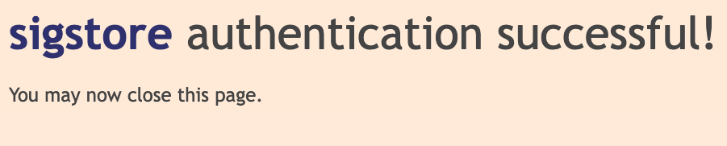
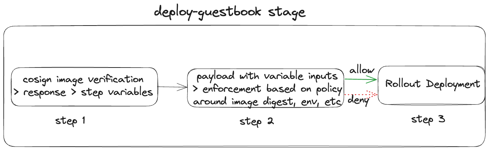

<CTABanner
  buttonText="Learn More"
  title="Continue your learning journey."
  tagline="Take a Continuous Delivery & GitOps Certification today!"
  link="/university/continuous-delivery"
  closable={true}
  target="_self"
/>

<DocsTag text="Harness Enterprise Feature" />

Imagine that you're deploying a container image to a Kubernetes cluster. But how can you verify that the container image is safe to deploy? [Cosign](https://github.com/sigstore/cosign) is a tool for container image signing and verification. Open Policy Agent (OPA) is an open-source, general-purpose policy engine that enables policy-based control across various software stacks, including Kubernetes deployments. Harness Continuous Delivery & GitOps includes OPA to ensure compliance in your deployment pipelines. In the [Kubernetes Manifest tutorial](manifest.md), you deployed a container image for the guestbook application to a Kubernetes cluster. In this tutorial, we'll leverage the combined power of Cosign and OPA to ensure the secure deployment of container images to your Kubernetes cluster.

This tutorial is also available as a video.

<DocVideo src="https://www.youtube.com/watch?v=PLvjcCCStzs" />

## Before you begin

Ensure that you have the following:

1. A Harness Enterprise Account, paid or trial.
   1. If you do not have an account, [can sign up](https://app.harness.io/auth/#/signup/?module=cd&utm_source=website&utm_medium=harness-developer-hub&utm_campaign=cd-plg&utm_content=tutorials-cd-kubernetes-cosign-opa).
2. Completion of the [Kubernetes Manifest tutorial](manifest.md) (either GitOps Workflow or CD Pipeline). This tutorial is a continuation of that tutorial. You will reuse the existing pipeline and other resources you created there.
3. Familiarity with Harness [pipelines](/docs/platform/get-started/key-concepts.md#pipelines), [stages](/docs/platform/get-started/key-concepts.md#stages), and [steps](/docs/platform/get-started/key-concepts.md#steps-and-step-groups) concepts.

## Architectural Diagrams

Without Cosign or OPA in place, your CD pipeline could pull an image and deploy it to your Kubernetes cluster without verification. With Cosign and OPA in place, the flow (simplified version) looks something like this:


Let's dive into the project of securing image signing for your containerized applications.

## Image signing using Cosign

---

Imagine that you’re the architect for this project and you’re tasked to create a secure base image using Cosign. In this section, you’ll pull the public image for the guestbook application, tag it with a different image name and tag, sign it using Cosign, and then push it to an image registry. Cosign's keyless signing, authenticated through OIDC protocols with trusted providers like Google, GitHub, or Microsoft, offers a more secure and convenient alternative to traditional key-based signing methods.

Let's use Docker Hub as an example of an image registry.

1. Log in to Docker hub from the terminal (this is required for you to be able to push the image):

   ```bash
   docker login
   ```

2. Pull the public image for the guestbook app:

   ```bash
   docker pull gcr.io/heptio-images/ks-guestbook-demo:0.1
   ```

3. Tag two versions of the image - one for **dev** and another for **prod** environment:

   ```bash
   docker tag gcr.io/heptio-images/ks-guestbook-demo:0.1 YOUR_DOCKERHUB_USERNAME/guestbook-dev:0.1

   docker tag gcr.io/heptio-images/ks-guestbook-demo:0.1 YOUR_DOCKERHUB_USERNAME/guestbook-prod:0.1
   ```

4. [Download and install Cosign](https://github.com/sigstore/cosign#installation).

5. ```bash
   export IMAGE_DEV=YOUR_DOCKERHUB_USERNAME/guestbook-dev:0.1

   export IMAGE_PROD=YOUR_DOCKERHUB_USERNAME/guestbook-prod:0.1
   ```

6. Push the image:

   ```bash
   docker push $IMAGE_DEV

   docker push $IMAGE_PROD
   ```

7. Check your docker repository to obtain the image digest for both images (in the form of **sha256:xxxx...**). It is likely that both images will have the same digest since they were tagged from the same source image. It is recommended to sign the image using a digest instead of a tag. Signing the image using a tag can lead you to sign a different image than intended.

   ```bash
   cosign sign YOUR_DOCKERHUB_USERNAME/guestbook-dev@YOUR_IMAGE_DIGEST -a env=dev

   cosign sign YOUR_DOCKERHUB_USERNAME/guestbook-prod@YOUR_IMAGE_DIGEST -a env=prod
   ```

Here, the flag `-a` adds an annotation to each signature. A window will open for both commands for you to sign in to your OIDC provider and, once authenticated, you'll see a success message from Sigstore:



The response in your terminal should look like this:

```bash
Generating ephemeral keys...
Retrieving signed certificate...

The sigstore service, hosted by Sigstore a Series of LF Projects, LLC, is ...

...
Are you sure you would like to continue? [y/N] Y
Your browser will now be opened to:
...
Successfully verified SCT...

tlog entry created with index: XXXXXXXX
Pushing signature to: index.docker.io/YOUR_DOCKERHUB_USERNAME/guestbook-dev
```

Check your image registry, and you'll notice two new repositories, each with two digests with different tags. When an image is signed using Cosign, it generates a detached signature for the image. This detached signature is a separate cryptographic file that verifies the authenticity and integrity of the container image. Both the image and its detached signature are pushed to the image registry, ensuring that the signed image and its associated signature are stored together and can be retrieved for verification. This dual-commit process helps maintain the security and trustworthiness of container images within a registry.

## The goal

Before your developers can deploy the image, you need to put some required plumbing in place so that an image gets verified before deployment. You have three container images for the same guestbook application. Here's an example of these three images and how the digests and annotations compare:

| Image                                  | Tag | Digest             | Annotation | Signed |
| -------------------------------------- | --- | ------------------ | ---------- | ------ |
| gcr.io/heptio-images/ks-guestbook-demo | 0.1 | sha256:fe18...7f47 | -          | No     |
| dewandemo/guestbook-dev                | 0.1 | sha256:aa11...9975 | env:dev    | Yes    |
| dewandemo/guestbook-prod               | 0.1 | sha256:aa11...9975 | env:prod   | Yes    |

Looking at the above example, your goal is to allow the deployment of `dewandemo/guestbook-dev@sha256:aa11...9975` image with an annotation of `env:dev` and deny any other image (`dewandemo/guestbook-dev` is shown as an example and the image details will be different for you).

## Image verification using Cosign and OPA

From the [**Kubernetes Manifest tutorial**](manifest.md), you have a stage **deploy-guestbook** within the deployment pipeline **harness_guestbook_pipeline** which has single step **Rollout Deployment**. Add two steps before the **Rollout Deployment** step for image verification using cosign and policy enforcement using open policy agent.



For the first step, add a [Shell Script step](https://developer.harness.io/docs/continuous-delivery/x-platform-cd-features/cd-steps/utilities/shell-script-step/). Let's call it **cosign_verify**. Keeping all other settings to default, add the following to the Script section. Replace `YOUR_DOCKERHUB_USERNAME`, `YOUR_OIDC_CERTIFICATE_IDENTITY` (could be your associated email), and `YOUR_OIDC_ISSUER` (google, microsoft, github, or gitlab) accordingly. The oidc-issuer for Google is `https://accounts.google.com`, Microsoft is `https://login.microsoftonline.com`, GitHub is `https://github.com/login/oauth`, and GitLab is `https://gitlab.com`.

```bash
curl -O -L "https://github.com/sigstore/cosign/releases/latest/download/cosign-linux-amd64"
mv cosign-linux-amd64 /usr/local/bin/cosign
chmod +x /usr/local/bin/cosign

output=$(cosign verify YOUR_DOCKERHUB_USERNAME/guestbook-dev:0.1 --certificate-identity=YOUR_OIDC_CERTIFICATE_IDENTITY --certificate-oidc-issuer=YOUR_OIDC_ISSUER)

image_registry=$(echo "$output" | awk -F'"docker-reference":"' '{print $2}' | cut -d '"' -f 1)
image_digest=$(echo "$output" | awk -F'"docker-manifest-digest":"' '{print $2}' | cut -d '"' -f 1)
image_signed_string=$(echo "$output" | awk -F'"type":"' '{print $2}' | cut -d '"' -f 1)
image_sign_issuer=$(echo "$output" | awk -F'"Issuer":"' '{print $2}' | cut -d '"' -f 1)
image_env=$(echo "$output" | awk -F'"env":"' '{print $2}' | cut -d '"' -f 1)
```

The first part of this script downloads and installs the cosign tool, the second part stores the response from `cosign verify…` command and the third part parses specific parts of the response as step variables. Define [script output variables](https://developer.harness.io/docs/continuous-delivery/x-platform-cd-features/cd-steps/utilities/shell-script-step/#script-output-variables) for all 5 output variables. For example, here's how I mapped each bash output variable to a script output variable:

| script output variable  | bash output variable |
| ----------------------- | -------------------- |
| sov_image_registry      | image_registry       |
| sov_image_digest        | image_digest         |
| sov_image_signed_string | image_signed_string  |
| sov_image_sign_issuer   | image_sign_issuer    |
| sov_image_env           | image_env            |

When referencing any of these variables in the following step, use the format `<+execution.steps.cosign_verify.output.outputVariables.sov_image_registry>`. Note that your step name might be different from `cosign_verify`.

The first four variables on this list are used to ensure that the correct image with the right digest is coming from an approved image registry vetted by an appropriate OIDC provider. The last variable is an annotation for the image tag indicating the environment the image is for. You can modify the script and variables based on what information is important to you for image sign validation.

## Write the policies

Let's add a [policy step](https://developer.harness.io/docs/continuous-delivery/x-platform-cd-features/advanced/cd-governance/add-a-governance-policy-step-to-a-pipeline/) after the **cosign_verify** step (you can call this **policy_enforcement** step). You can define and store policies directly in the OPA service in Harness.

:::warning

Policy Based Governance is a paid feature on the Harness platform.

:::

Policies are written in [Rego](https://www.openpolicyagent.org/docs/latest/policy-language/). Let's create two policies - one to verify image digest and the other to verify the annotation of **env=dev**. From the **Project Setup**, go to **Policies** and create two new policies. Let's call these policies **Check Image Digest** and **Check Environment**. Store both inline so that they are stored within Harness. Here are the policy definitions for both:

**Check Image Digest** policy:

```rego
package main

deny {
    not input.digest == "YOUR_IMAGE_DIGEST_FOR_GUESTBOOK-DEV"
}
```

This Rego policy denies access if the "digest" value in the input data is not "YOUR_IMAGE_DIGEST_FOR_GUESTBOOK-DEV" (be sure to replace with the actual image digest value).

**Check Environment** policy:

```rego
package main

deny {
    not input.env == "dev"
}
```

This Rego policy denies access unless the "env" value in the input data is "dev".

Save both policies. In Harness, you add Rego policies to a Policy Set and when certain events happen (e.g. saving or running a Pipeline), Harness reaches out to the Harness OPA server to evaluate the action using the Policy Set.

From the **Policies** navigation menu, click on **Policy Sets** and **+ New Policy Set**. Give this policy a name (e.g. `Check Image Sign Policy Set`), select `Custom` for **Entity Type that this policy set applies to**, and `On Step` for **On what event should the policy set be evaluated**. Click **Next**, select **Check Image Digest** and **Check Environment** policies, and click **Finish**.

Now, let's go back to the pipeline and click on the **policy_enforcement** step. With all the default settings, select `Check Image Sign Policy Set` for the policy set and add the following in the payload section:

```bash
{
    "digest": "<+execution.steps.image_sign_verify.output.outputVariables.sov_image_digest>",
    "env": "<+execution.steps.image_sign_verify.output.outputVariables.sov_image_env>"
}
```

You'll notice that the parameters within this payload is getting the values from the script output variables defined in the previous step.

## Testing the policy enforcement

Now it's time to test and validate this setup. The assumption is that you [forked harnesscd-example-apps](https://github.com/harness-community/harnesscd-example-apps/fork) already.

For the positive case, update this file `https://github.com/YOUR_GITHUB_USERNAME/harnesscd-example-apps/blob/master/guestbook/guestbook-ui-deployment.yaml` and modify spec.containers.image value with `YOUR_DOCKERHUB_USERNAME/guestbook-dev:0.1`. On your Harness pipeline, the **cosign_verify** step is already checking for this signed container image. Run the pipeline and both **Check Image Digest** and **Check Environment** policies should pass. You can click on Project Setup --> Policies --> Evaluations and check out the recent policy evaluation which shows the policy and the payload match. The **Rollout Deployment** step will execute and there will be a successful deployment.

You'll do two negative cases - one for the unsigned image (no matching digest) and one for the other signed image (environment not matching). For the unsigned image case, update this file `https://github.com/YOUR_GITHUB_USERNAME/harnesscd-example-apps/blob/master/guestbook/guestbook-ui-deployment.yaml` and modify spec.containers.image value with the publicly available and unsigned version of the image `gcr.io/heptio-images/ks-guestbook-demo:0.1`. On your Harness pipeline, update the following line under the **cosign_verify** shell script step:

```bash
output=$(cosign verify gcr.io/heptio-images/ks-guestbook-demo:0.1 --certificate-identity=YOUR_OIDC_CERTIFICATE_IDENTITY --certificate-oidc-issuer=YOUR_OIDC_ISSUER)
```

This time, the policy validation will fail due to multiple mismatches between the policy and the payload resulting in both **Check Image Digest** and **Check Environment** policies to fail. The deployment will not happen as expected.

For the signed image case (different environment), update this file `https://github.com/YOUR_GITHUB_USERNAME/harnesscd-example-apps/blob/master/guestbook/guestbook-ui-deployment.yaml` and modify spec.containers.image value with the other signed version of the image `YOUR_DOCKERHUB_USERNAME/guestbook-prod:0.1`. On your Harness pipeline, update the following line under the **cosign_verify** shell script step:

```bash
output=$(cosign verify YOUR_DOCKERHUB_USERNAME/guestbook-prod:0.1 --certificate-identity=YOUR_OIDC_CERTIFICATE_IDENTITY --certificate-oidc-issuer=YOUR_OIDC_ISSUER)
```

This time, the **Check Image Digest** policy will pass since the image digests are the same but the **Check Environment** policy will fail since the annotations are different (**prod** versus **dev**). The deployment will not happen as expected.

## Homework

Surprise! There's a homework for you but it is a fun one! The more observant among you may have noticed that while five script output variables were declared, only two (`sov_image_digest` and `sov_image_env`) were utilized in the policies. Your task is to introduce another policy to the policy set that verifies whether the image originated from the approved image registry. Hint: `sov_image_registry` is the variable to use here. Similarly, you can leverage the two other unused script output variables for additional policy enforcements.

### Congratulations!🎉

You've just learned how to use **Cosign** and **Open Policy Agent** to sign and verify container images before those are deployed.

#### What's Next?

- [Generate and verify SLSA Provenance](/docs/software-supply-chain-assurance/slsa/generate-slsa) using the Harness SCS steps in Harness CI/CD pipelines.
- Visit the [Harness Developer Hub](https://developer.harness.io/) for more CI/CD documentation.
