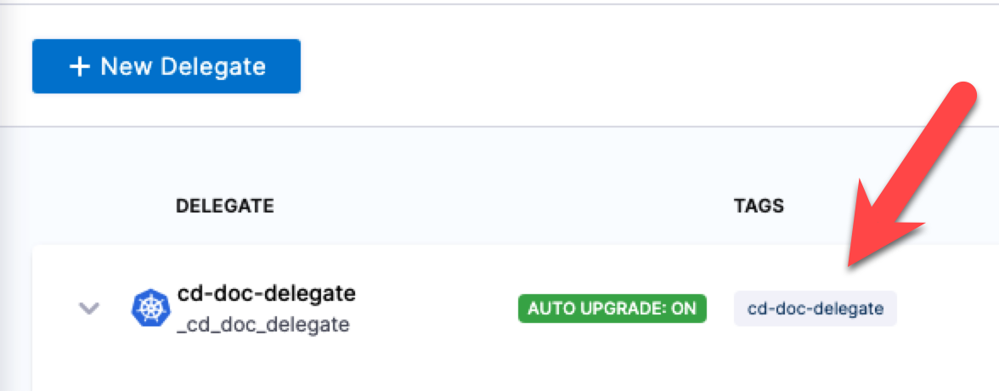
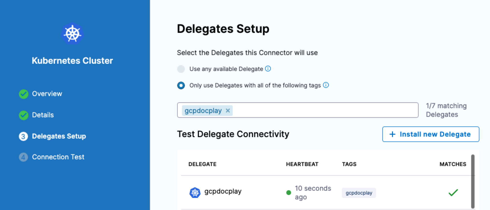
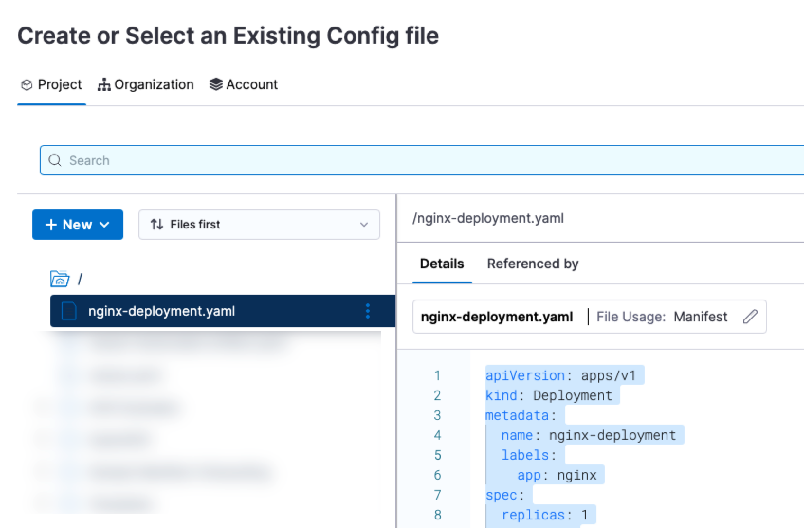
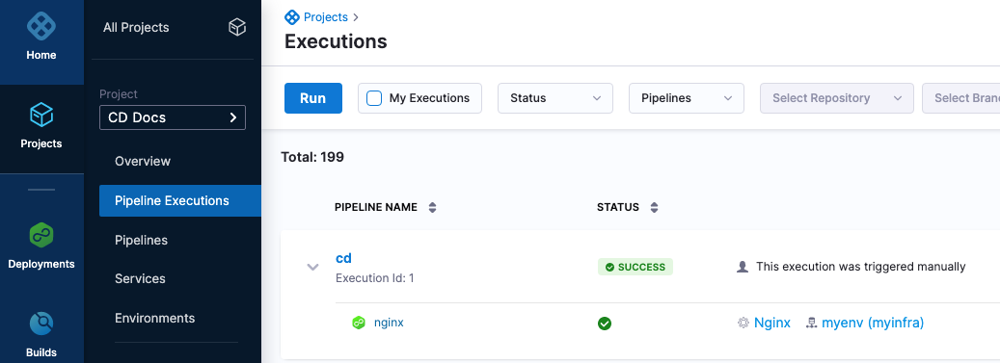
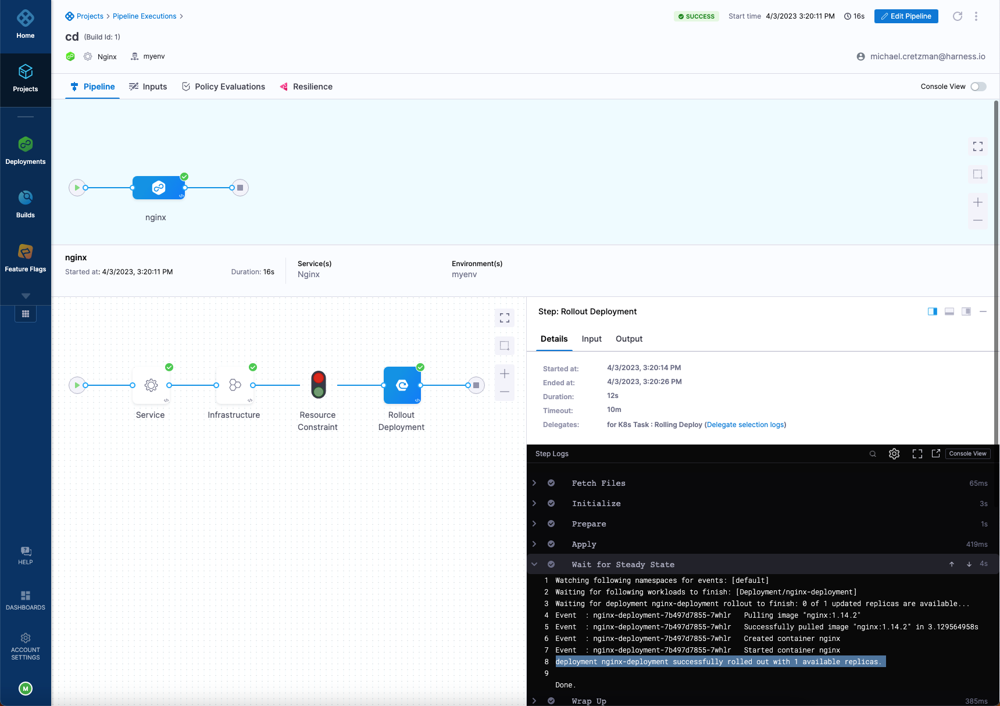

This is a step-by-step tour of using Harness CD pipelines to deploy an application. We show you how to use our YAML, API, Terraform Provider, and console (Pipeline Studio) methods for building pipelines.

<details>
<summary>Want to try out Harness CD locally?</summary>

You can also run all of Harness CD locally using the Harness CD Community Edition. 

Harness CD Community Edition is a lightweight version of Harness that you can download and run on your laptop or any VM with 3GB RAM and 2 CPUs. Harness CD Community Edition is intended to get devs started with Harness quickly without having to sign up for a Harness SaaS account.

For more information, go to:
- [Harness CD Community Edition Overview](../deploy-srv-diff-platforms/community-ed/harness-community-edition-overview)
- [Harness Community Edition deployments](../deploy-srv-diff-platforms/community-ed/harness-community-edition-quickstart)

</details>

## Prerequisites

All you need is a deployment environment and a Harness delegate installed where it can reach the environment and Harness.

### Deployment environment

If you already have access to a cluster, you can skip this section. Simply install a Harness delegate in the cluster as described in the next section.

Here are several options for creating a cluster, including popular cloud platforms and local options.

```mdx-code-block
import Tabs from '@theme/Tabs';
import TabItem from '@theme/TabItem';
```
```mdx-code-block
<Tabs>
  <TabItem value="Minikube" label="Minikube (local)" default>
```

If you want to use Minikube, use Minikube minimum version v1.22.0 or later installed locally.

```
minikube start --memory=4g --cpus=1 --nodes=2
```

After running this command, you can verify that the cluster is running by running the following command:

```
kubectl get nodes
```

```mdx-code-block
  </TabItem>
  <TabItem value="Docker Desktop" label="Docker Desktop (local)">
```

To set up a Kubernetes cluster with 2 replicas, 4GB of memory, and 1 CPU in Docker Desktop, you can follow these steps:

1. Open Docker Desktop and go to the **Settings** menu.
2. Select the **Kubernetes** tab.
3. Enable Kubernetes by checking the **Enable Kubernetes** checkbox.
4. Set the number of replicas to **2** by adjusting the **Replicas** slider.
5. Set the amount of memory to **4GB** and the number of CPUs to **1** by adjusting the **Memory** and **CPU** sliders.
6. Select the **Apply & Restart** button to apply the changes and restart Docker Desktop.

After Docker Desktop restarts, you can verify that the cluster is running by running the following command:

```
kubectl get nodes
```

```mdx-code-block
  </TabItem>
  <TabItem value="Google GKE" label="Google GKE">
```

Replace `ZONE` with your GCP region, for example us-central1-c:

```
gcloud container clusters create [CLUSTER-NAME] --num-nodes=2 --machine-type=[MACHINE-TYPE] --disk-size=10GB --zone=[ZONE]
```

For example:

```
gcloud container clusters create my-cluster --num-nodes=2 --machine-type=n1-standard-1 --disk-size=10GB --zone=us-central1-a
```

After running this command, you can verify that the cluster is running by running the following command:

```
kubectl get nodes
```

```mdx-code-block
  </TabItem>
  <TabItem value="Azure AKS" label="Azure AKS">
```

Replace `myResourceGroup` with your AKS resource group:

```
az aks create -g myResourceGroup -n myAKSCluster --enable-managed-identity --node-count 2 --enable-addons monitoring --enable-msi-auth-for-monitoring --generate-ssh-keys
```

After running this command, you can verify that the cluster is running by running the following command:

```
kubectl get nodes
```

```mdx-code-block
  </TabItem>
  <TabItem value="AWS EKS" label="AWS EKS">
```

You can replace `my-cluster` and `my-nodegroup` with whatever names you want and `us-west-2` with the region you want to use:

```
eksctl create cluster --name=my-cluster --version=1.21 --nodegroup-name=my-nodegroup --node-type=t3.small --nodes-min=2 --nodes-max=2 --node-volume-size=20 --region=us-west-2
```

After running this command, you can verify that the cluster is running by running the following command:

```
kubectl get nodes
```

```mdx-code-block
  </TabItem>
</Tabs>
```

### Harness delegate

We now need to install a Harness delegate in the target Kubernetes cluster.

Delegates are worker processes that run on your infrastructure to execute tasks on behalf of the Harness platform. Delegates make outbound, secure connections to Harness and your other providers only.

<details>
<summary>Use the delegate installation wizard</summary>

1. In your Harness project, select **Project Setup**.
2. Select **Delegates**.
3. Select **Install a Delegate**.
4. Follow the delegate installation wizard.

Use this [delegate installation wizard video](https://www.youtube.com/watch?v=yLMCxs3onH8) to guide you through the process.

</details>


```mdx-code-block
import DelegateInstall from '/tutorials/platform/install-delegate.md';
```

<details>
<summary>Install a delegate using the terminal</summary>
<DelegateInstall />
</details>

For details and a video, go to [Delegate overview](https://developer.harness.io/docs/platform/delegates/delegate-concepts/delegate-overview).


## Create your first pipeline

Harness provides multiple methods for creating your pipelines. 

The process is the same for all methods: 

1. Add a Kubernetes Cluster connector to connect Harness with your cluster.
2. Define a Harness service that represents your app or microservice. This includes your manifest and artifact but we'll only using a manifest with a hardcoded artifact in this topic.
3. Define a target environment.
4. Define the pipeline execution steps. If you use the Harness Manager, Harness automatically adds the steps you need for different [deployment strategies](../manage-deployments/deployment-concepts).

First, let's add the manifest we'll be using to the Harness File Store in your project. You can add a manifest from any remote repo, but we'll use the File Store in this topic.

1. In your Harness project, select **Project Setup**, and then select **File Store**.
2. Select **New**, and then select **New File**.
3. Name the file **nginx-deployment.yaml**, in **File Usage** select **Manifest**, and the select **Create**.
4. Paste the following manifest into the new file and select **Save**.

<details>
<summary>nginx-deployment.yaml</summary>

```yaml
apiVersion: apps/v1
kind: Deployment
metadata:
  name: nginx-deployment
  labels:
    app: nginx
spec:
  replicas: 1
  selector:
    matchLabels:
      app: nginx
  template:
    metadata:
      labels:
        app: nginx
    spec:
      containers:
      - name: nginx
        image: nginx:1.14.2
        ports:
        - containerPort: 80
```

</details>


Next, choose one of the following methods for building your pipeline.

```mdx-code-block
import Tabs1 from '@theme/Tabs';
import TabItem1 from '@theme/TabItem';
```

<Tabs1>
  <TabItem1 value="YAML" label="YAML" default>

The following example creates the Harness entities needed for a simple pipeline that deploys a publicly available Docker Nginx image to your target cluster using the manifest we just added.

For information on using YAML in Harness, go to [Harness YAML Quickstart](https://developer.harness.io/docs/platform/pipelines/harness-yaml-quickstart/).

<details>
<summary>Create the Harness connector</summary>

We'll create a Harness Kubernetes Cluster connector to connect to your target cluster.

Kubernetes Cluster connector:

```yaml
connector:
  name: K8sCluster
  identifier: K8sCluster
  description: ""
  orgIdentifier: default
  projectIdentifier: CD_Docs
  type: K8sCluster
  spec:
    credential:
      type: InheritFromDelegate
    delegateSelectors:
      - [delegate tag]
```

Replace `[delegate tag]` with tag of the delegate you installed in your cluster. For example:




</details>


<details>
<summary>Create the Harness service</summary>

The following service uses the manifest you added to the Harness File Store earlier.

```yaml
service:
  name: Nginx
  identifier: Nginx
  tags: {}
  serviceDefinition:
    spec:
      manifests:
        - manifest:
            identifier: nginx
            type: K8sManifest
            spec:
              store:
                type: Harness
                spec:
                  files:
                    - /nginx-deployment.yaml
              skipResourceVersioning: false
              enableDeclarativeRollback: false
      artifacts:
        primary: {}
    type: Kubernetes
```

</details>


<details>
<summary>Create the Harness environment and infrastructure definition</summary>

First, create the Harness environment.

```yaml
environment:
  name: myenv
  identifier: myenv
  tags: {}
  type: PreProduction
  orgIdentifier: default
  projectIdentifier: CD_Docs
  variables: []
```
Next, create the infrastructure definition for that environment. This infrastructure definition uses the Kubernetes Cluster connector you created earlier and targets the `default` namespace. You can enter a different namespace.

```yaml
infrastructureDefinition:
  name: myinfra
  identifier: myinfra
  description: ""
  tags: {}
  orgIdentifier: default
  projectIdentifier: CD_Docs
  environmentRef: myenv
  deploymentType: Kubernetes
  type: KubernetesDirect
  spec:
    connectorRef: K8sCluster
    namespace: default
    releaseName: release-<+INFRA_KEY>
  allowSimultaneousDeployments: false
```
</details>

<details>
<summary>Create the pipeline</summary>

Now we can put everything together in a pipeline with a CD stage that deploys the Harness service to the infrastructure definition we added.

The pipeline uses a Kubernetes rolling deployment.

```yaml
pipeline:
  name: cd
  identifier: cd
  projectIdentifier: CD_Docs
  orgIdentifier: default
  tags: {}
  stages:
    - stage:
        name: nginx
        identifier: nginx
        description: ""
        type: Deployment
        spec:
          deploymentType: Kubernetes
          service:
            serviceRef: Nginx
          environment:
            environmentRef: myenv
            deployToAll: false
            infrastructureDefinitions:
              - identifier: myinfra
          execution:
            steps:
              - step:
                  name: Rollout Deployment
                  identifier: rolloutDeployment
                  type: K8sRollingDeploy
                  timeout: 10m
                  spec:
                    skipDryRun: false
                    pruningEnabled: false
            rollbackSteps:
              - step:
                  name: Rollback Rollout Deployment
                  identifier: rollbackRolloutDeployment
                  type: K8sRollingRollback
                  timeout: 10m
                  spec:
                    pruningEnabled: false
        tags: {}
        failureStrategies:
          - onFailure:
              errors:
                - AllErrors
              action:
                type: StageRollback
```

You can now run your pipeline.

</details>


```mdx-code-block
  </TabItem1>
  <TabItem1 value="API" label="API">
```
The following example creates the Harness entities needed for a simple pipeline that deploys a publicly available Docker Nginx image to your target cluster using the manifest we just added.

For information on using the Harness API, go to [Harness API Quickstart](/docs/platform/Resource-Development/APIs/api-quickstart). For information on the security token, go to [Add and Manage API Keys](/docs/platform/User-Management/add-and-manage-api-keys).

<details>
<summary>Create the Harness connector</summary>

Create the Kubernetes Cluster connector using the [Create a Connector API](https://apidocs.harness.io/tag/Connectors#operation/createConnector).

The Harness API uses API keys to authenticate requests. You create the API key in your Harness Manager User Profile, add a Personal Access Token (PAT) to the key, and then use the PAT in your API requests. For steps, go to [Add and Manage API Keys](/docs/platform/User-Management/add-and-manage-api-keys).

Replace the following request settings in `[]` with your account information.

```yaml
curl --location --request POST 'https://app.harness.io/gateway/ng/api/connectors?accountIdentifier=[account Id]' \
--header 'Content-Type: text/yaml' \
--header 'x-api-key: [security token]' \
--data-raw 'connector:
  name: K8s Cluster
  identifier: K8sCluster
  description: ""
  orgIdentifier: default
  projectIdentifier: [project Id]
  type: K8sCluster
  spec:
    credential:
      type: InheritFromDelegate
    delegateSelectors:
      - [delegate tag]'
```

Replace `[delegate tag]` with tag of the delegate you installed in your cluster. For example:


</details>


<details>
<summary>Create the Harness service</summary>

Create a service using the [Create Services API](https://apidocs.harness.io/tag/Services#operation/createServicesV2).

```yaml
curl -i -X POST \
  'https://app.harness.io/gateway/ng/api/servicesV2/batch?accountIdentifier=[account Id]' \
  -H 'Content-Type: application/json' \
  -H 'x-api-key: [security token]' \
  -d '[{
    "identifier": "KubernetesTest",
    "orgIdentifier": "default",
    "projectIdentifier": "[project Id]",
    "name": "KubernetesTest",
    "description": "string",
    "tags": {
      "property1": "string",
      "property2": "string"
    },
    "yaml": ""service:\n  name: Nginx\n  identifier: Nginx\n  tags: {}\n  serviceDefinition:\n    spec:\n      manifests:\n        - manifest:\n            identifier: nginx\n            type: K8sManifest\n            spec:\n              store:\n                type: Harness\n                spec:\n                  files:\n                    - /nginx-deployment.yaml\n              skipResourceVersioning: false\n              enableDeclarativeRollback: false\n      artifacts:\n        primary: {}\n    type: Kubernetes""
  }]'
```

</details>


<details>
<summary>Create the Harness environment and infrastructure definition</summary>

Create the environment using the [Create an Environment API](https://apidocs.harness.io/tag/Environments#operation/createEnvironmentV2).

```yaml
curl -i -X POST \
  'https://app.harness.io/gateway/ng/api/environmentsV2?accountIdentifier=[account Id]' \
  -H 'Content-Type: application/json' \
  -H 'x-api-key: [security token]' \
  -d '{
    "orgIdentifier": "default",
    "projectIdentifier": "[project Id]",
    "identifier": "string",
    "tags": {
      "property1": "string",
      "property2": "string"
    },
    "name": "myenv",
    "description": "string",
    "color": "string",
    "type": "PreProduction",
    "yaml": "environment:\n  name: myenv\n  identifier: myenv\n  tags: {}\n  type: PreProduction\n  orgIdentifier: default\n  projectIdentifier: [project Id]\n  variables: []"
  }'
```

Create the infrastructure definition in that environment using the [Create an Infrastructure in an Environment](https://apidocs.harness.io/tag/Infrastructures#operation/createInfrastructure) API.

```yaml
curl -i -X POST \
  'https://app.harness.io/gateway/ng/api/infrastructures?accountIdentifier=[account Id]' \
  -H 'Content-Type: application/json' \
  -H 'x-api-key: [security token]' \
  -d '{
    "name": "myinfra",
    "identifier": "myinfra",
    "description": "infrastructure description",
    "tags": {},
    "orgIdentifier": "default",
    "projectIdentifier": "[project Id]",
    "environmentRef": "myenv",
    "deploymentType": "Kubernetes",
    "type": "KubernetesDirect",
    "yaml": "infrastructureDefinition:\n  name: myinfra1\n  identifier: myinfra1\n  description: \"\"\n  tags: {}\n  orgIdentifier: default\n  projectIdentifier: [project Id]\n  environmentRef: myenv\n  deploymentType: Kubernetes\n  type: KubernetesDirect\n  spec:\n    connectorRef: K8sCluster_1679347042448\n    namespace: default\n    releaseName: release-<+INFRA_KEY>\n  allowSimultaneousDeployments: false"
  }'
```

</details>


<details>
<summary>Create the pipeline</summary>

Create the pipeline using the [Create a Pipeline API](https://apidocs.harness.io/tag/Pipeline#operation/postPipelineV2).

```yaml
curl -i -X POST \
  'https://app.harness.io/gateway/pipeline/api/pipelines/v2?accountIdentifier=[account Id]&orgIdentifier=default&projectIdentifier=[project Id]' \
  -H 'Content-Type: application/yaml' \
  -H 'x-api-key: [security token]' \
  -d '"pipeline:\n  name: cd\n  identifier: cd\n  projectIdentifier: [project Id]\n  orgIdentifier: default\n  tags: {}\n  stages:\n    - stage:\n        name: nginx\n        identifier: nginx\n        description: \"\"\n        type: Deployment\n        spec:\n          deploymentType: Kubernetes\n          service:\n            serviceRef: Nginx\n          environment:\n            environmentRef: myenv\n            deployToAll: false\n            infrastructureDefinitions:\n              - identifier: myinfra\n          execution:\n            steps:\n              - step:\n                  name: Rollout Deployment\n                  identifier: rolloutDeployment\n                  type: K8sRollingDeploy\n                  timeout: 10m\n                  spec:\n                    skipDryRun: false\n                    pruningEnabled: false\n            rollbackSteps:\n              - step:\n                  name: Rollback Rollout Deployment\n                  identifier: rollbackRolloutDeployment\n                  type: K8sRollingRollback\n                  timeout: 10m\n                  spec:\n                    pruningEnabled: false\n        tags: {}\n        failureStrategies:\n          - onFailure:\n              errors:\n                - AllErrors\n              action:\n                type: StageRollback"'
```

You can now run your pipeline.

</details>


```mdx-code-block
  </TabItem1>
  <TabItem1 value="Terraform Provider" label="Terraform Provider">
```

The following example creates the Harness entities needed for a simple pipeline that deploys a publicly available Docker Nginx image to your target cluster using the manifest we just added.

For information on using the Harness Terraform Provider, go to [Onboard with Terraform Provider](https://developer.harness.io/tutorials/platform/onboard-terraform-provider).

<details>
<summary>Create the Harness connector</summary>

For the Terraform Provider resource, go to [harness_platform_connector_kubernetes](https://registry.terraform.io/providers/harness/harness/latest/docs/resources/platform_connector_kubernetes).

```json
## Create the Kubernetes cluster connector

resource "harness_platform_connector_kubernetes" "inheritFromDelegate" {
  identifier  = "K8sCluster"
  name        = "K8s Cluster"
  description = "description"
  tags        = ["foo:bar"]

  inherit_from_delegate {
    delegate_selectors = ["[delegate tag]"]
  }
}
```
Replace `[delegate tag]` with tag of the delegate you installed in your cluster. For example:


</details>


<details>
<summary>Create the Harness service</summary>

For the Terraform Provider resource, go to [harness_platform_service](https://registry.terraform.io/providers/harness/harness/latest/docs/resources/platform_service).

```json
## Configure the service

resource "harness_platform_service" "example" {
  identifier  = "Nginx"
  name        = "Nginx"
  description = ""
  org_id      = "default"
  project_id  = "[project_id]"
  yaml = <<-EOT
                service:
                  name: Nginx
                  identifier: Nginx
                  tags: {}
                  serviceDefinition:
                    spec:
                      manifests:
                        - manifest:
                            identifier: nginx
                            type: K8sManifest
                            spec:
                              store:
                                type: Harness
                                spec:
                                  files:
                                    - /nginx-deployment.yaml
                              skipResourceVersioning: false
                              enableDeclarativeRollback: false
                      artifacts:
                        primary: {}
                    type: Kubernetes
              EOT
}
```

</details>


<details>
<summary>Create the Harness environment and infrastructure definition</summary>

For the Terraform Provider resources, go to [harness_platform_environment](https://registry.terraform.io/providers/harness/harness/latest/docs/resources/platform_environment) and [harness_platform_infrastructure](https://registry.terraform.io/providers/harness/harness/latest/docs/resources/platform_infrastructure).

```json
## Configure the environment

resource "harness_platform_environment" "example" {
  identifier = "myenv"
  name       = "myenv"
  org_id     = "default"
  project_id = "[product Id]"
  tags       = ["foo:bar", "baz"]
  type       = "PreProduction"

  yaml = <<-EOT
                environment:
                  name: myenv
                  identifier: myenv
                  tags: {}
                  type: PreProduction
                  orgIdentifier: default
                  projectIdentifier: [product Id]
                  variables: []
      EOT
}

## Configure the infrastructure definition

resource "harness_platform_infrastructure" "example" {
  identifier      = "myinfra"
  name            = "myinfra"
  org_id          = "default"
  project_id      = "[project Id]"
  env_id          = "myenv"
  type            = "KubernetesDirect"
  deployment_type = "Kubernetes"
  yaml            = <<-EOT
                infrastructureDefinition:
                  name: myinfra
                  identifier: myinfra
                  description: ""
                  tags: {}
                  orgIdentifier: default
                  projectIdentifier: [project Id]
                  environmentRef: myenv
                  deploymentType: Kubernetes
                  type: KubernetesDirect
                  spec:
                    connectorRef: K8sCluster
                    namespace: default
                    releaseName: release-<+INFRA_KEY>
                  allowSimultaneousDeployments: false
      EOT
}
```

</details>


<details>
<summary>Create the pipeline</summary>

For the Terraform Provider resource, go to [harness_platform_pipeline](https://registry.terraform.io/providers/harness/harness/latest/docs/resources/platform_pipeline).

```json
## Configure the pipeline

resource "harness_platform_pipeline" "example" {
  identifier = "cd"
  org_id     = "default"
  project_id = "[project Id]"
  name       = "cd"
  yaml = <<-EOT
      pipeline:
        name: cd
        identifier: cd
        projectIdentifier: [project Id]
        orgIdentifier: default
        tags: {}
        stages:
          - stage:
              name: nginx
              identifier: nginx
              description: ""
              type: Deployment
              spec:
                deploymentType: Kubernetes
                service:
                  serviceRef: Nginx
                environment:
                  environmentRef: myenv
                  deployToAll: false
                  infrastructureDefinitions:
                    - identifier: myinfra
                execution:
                  steps:
                    - step:
                        name: Rollout Deployment
                        identifier: rolloutDeployment
                        type: K8sRollingDeploy
                        timeout: 10m
                        spec:
                          skipDryRun: false
                          pruningEnabled: false
                  rollbackSteps:
                    - step:
                        name: Rollback Rollout Deployment
                        identifier: rollbackRolloutDeployment
                        type: K8sRollingRollback
                        timeout: 10m
                        spec:
                          pruningEnabled: false
              tags: {}
              failureStrategies:
                - onFailure:
                    errors:
                      - AllErrors
                    action:
                      type: StageRollback
  EOT
}
```

You can now run your pipeline.

</details>


```mdx-code-block
  </TabItem1>
  <TabItem1 value="Pipeline Studio" label="Pipeline Studio">
```

The following example creates the Harness entities needed for a simple pipeline that deploys a publicly available Docker Nginx image to your target cluster using the manifest we just added.

<details>
<summary>Create the Harness connector</summary>

For steps on adding the Kubernetes Cluster connector, go to [Add a Kubernetes Cluster Connector](/docs/platform/Connectors/Cloud-providers/add-a-kubernetes-cluster-connector).

In **Delegates Setup**, ensure that you select the delegate you installed. For example:



</details>


<details>
<summary>Create the Harness service</summary>

To add Kubernetes manifests to your service, do the following:

1. In your project, in CD (Deployments), select **Services**.
2. Select **Manage Services**, and then select **New Service**.
3. Enter a name for the service and select **Save**.
4. Select **Configuration**.
5. In **Service Definition**, select **Kubernetes**.
6. In **Manifests**, click **Add Manifest**.
7. In **Specify Manifest Type**, select **K8s Manifest**, and then click **Continue**.
8. In **Specify K8s Manifest Store**, select **Harness**.
9. In **Manifest Details**, in **Name**, enter a name for the manifest.
10. Select **File/Folder Path**, and then, in **Create or Select an Existing Config file**, select the manifest we added earlier, and select **Apply Selected**.
     
    
11. Select **Submit**.
12. Save the service.


</details>


<details>
<summary>Create the Harness environment and infrastructure definition</summary>

To add the environment and infrastructure definition, do the following:

1. In your project, in CD (Deployments), select **Environments**.
2. Select **New Environment**.
3. Enter a name for the environment, select the **Pre-Production** environment type, and select **Save**.
4. In the new environment, select **Infrastructure Definitions**.
5. Select **Infrastructure Definition** to create a new infrastructure definition.
6. Enter a name and select the **Kubernetes** deployment type.
7. In **Select Infrastructure Type**, select **Kubernetes**.
8. In **Cluster Details**, select the Kubernetes Cluster connector you added earlier.
9. In **Namespace**, enter the namespace where you want to deploy, such as `default`.
10. Select **Save**.

</details>


<details>
<summary>Create the pipeline</summary>

To add the pipeline, do the following:

1. In your project, in CD (Deployments), select **Pipelines**.
2. Select **Create a Pipeline**.
3. Enter a name for the pipeline, and select **Start**.
4. Select **Add Stage**, select **Deploy**, select the **Kubernetes** deployment type, and select **Set Up Stage**.
5. In **Service**, select the service you added earlier.
6. In **Environment**, select the environment and infrastructure definition you added earlier.
7. In **Execution**, select the rolling or canary strategy. Harness will automatically populate the steps you need for each strategy.

You can now run your pipeline.

</details>


```mdx-code-block
  </TabItem1>
</Tabs1>
```


## View and manage your pipelines

You can view your pipeline executions in **Pipeline Executions**.

  

Select any execution to view its steps and logs.

  


## Next steps

Now that you know the basics of CD pipeline modeling in Harness, go to [CD third-party integrations](../cd-integrations) to see how Harness supports your manifest and artifact repos and deployment environments. 
