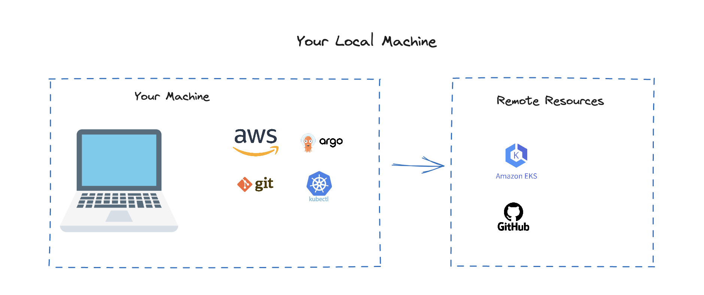
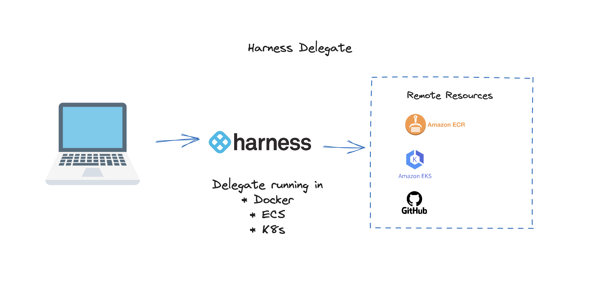
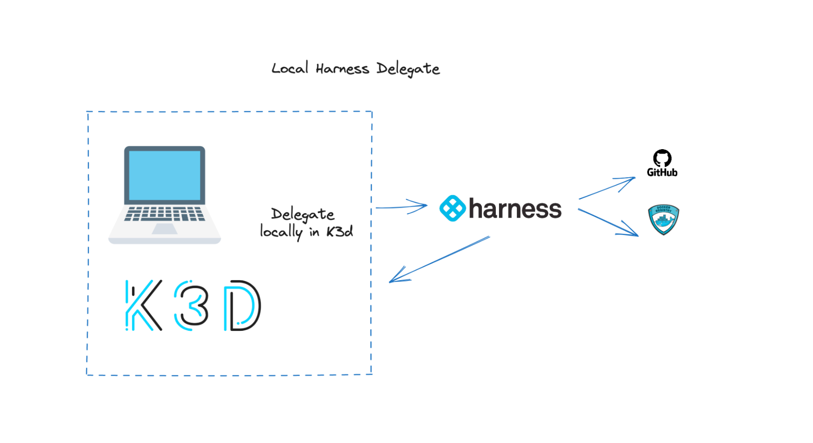
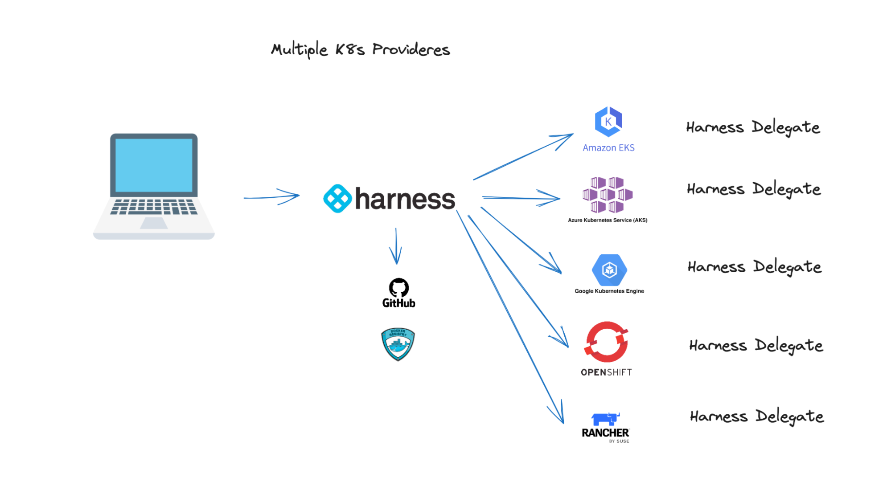
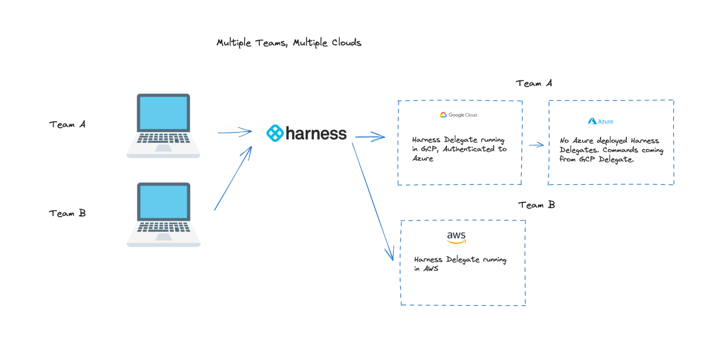
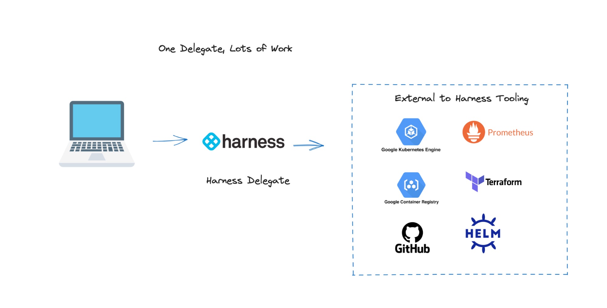
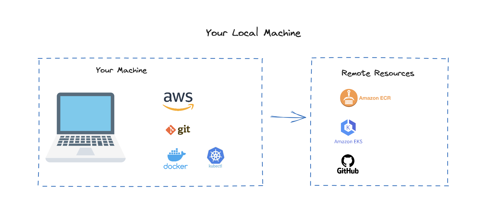
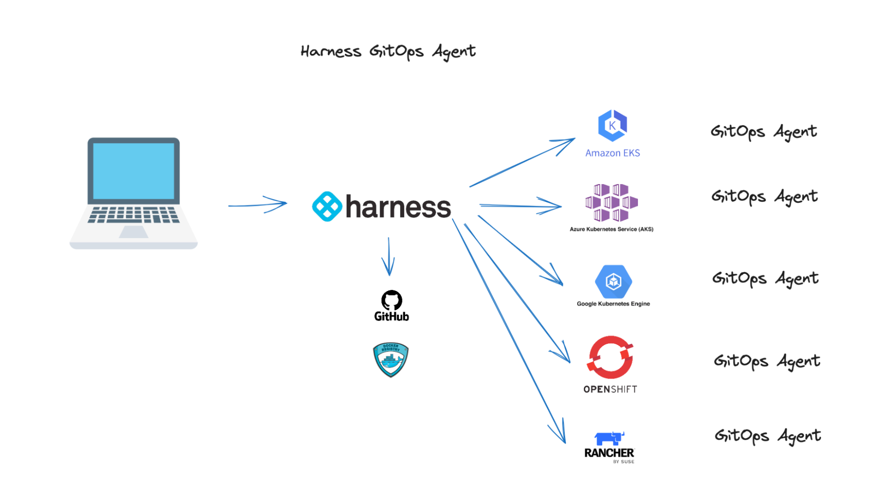
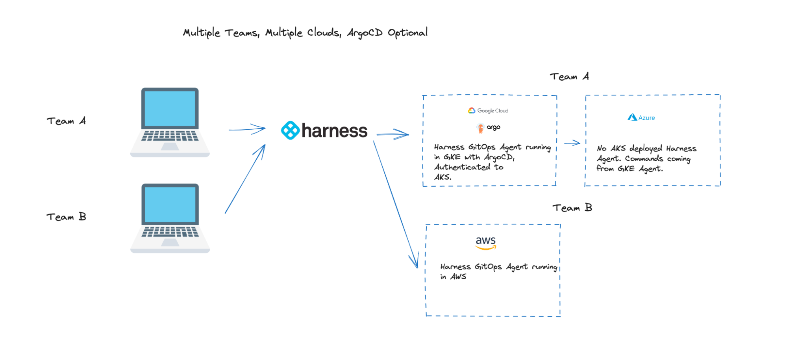

By leveraging a Harness Delegate or GitOps Agent, you are able to model commands you would have to maintain locally for remote execution. There are a multitude of benefits to this approach which pays dividends on day two operations. Starting with a local approach to get started, can  build to a remote approach. 

## Non-Harness Local Machine Commands
Core to automating commands that run on your machine is to run those commands off your machine e.g on a remote machine. Harness has a concept of Delegates that will run your commands on your behalf. When building, publishing, and deploying an application, several commands need to run. With these commands, the dependencies such as CLIs and authentication needs to be installed and authenticated against. Below, is a sample series of commands.  

```
git clone https://github.com/harness-community/cv-example-app.git
aws ecr get-login-password --region us-east-1 | docker login --username AWS --password-stdin id.dkr.ecr.us-east-1.amazonaws.com
docker build --platform linux/amd64 -t id.dkr.ecr.us-east-1.amazonaws.com/your_ecr/app:tag
docker push id.dkr.ecr.us-east-1.amazonaws.com/your_ecr/app:tag.
Kubectl apply -f https://raw.githubusercontent.com/harness-community/cv-example-app/main/harness-cv-example-deployment.yaml
```


## Leverage Remote, Introducing the Harness Delegate
Getting these commands off of your local machine, you could mimic 1:1 the commands you have run locally into something like a bastion host so the remote bastion host will communicate to the external services. Building your own remote instance does have complexities that need to be managed such as access control, uptime, and maintenance such as library upgrades. 

Harness delivers this concept for you instead and instead of mimicking your commands in lengthy shell scripts, you are modeling your commands with Harness. By using a Delegate, you are also able to position the Delegate to run on your infrastructure and ability to be separated as necessary. For security/sensitivity concerns, having work done on your infrastructure allows you to build a more secure perimeter. 

The Harness Delegate is a containerized worker node that has the ability to be run in Docker, ECS, and Kubernetes anywhere on your infrastructure. Harness just needs the ability to communicate to the Delegate so segregation is straightforward. 



## Platform Operations Challenges Solved with Harness Delegates
The power of the Harness Delegate shows itself in several scenarios. You are free to install as many Delegates as you need. The Delegates can also be scoped to restrict usage. 

### Direct Access to Your Kubernetes Cluster
Both models are supported by the Harness Delegate. The Delegate can have direct access which requires no configuration on your part to the Kubernetes cluster it is deployed into. If you are getting started with Harness, most users would install a Delegate into where they want their workload to be deployed, in the below example, [K3d](https://k3d.io). 



This example can be extrapolated by deploying Harness Kubernetes Delegates across multiple clusters with direct access to those clusters across multiple cloud providers. Once Harness has connectivity to those clusters, creating a multi-cloud, multi-cluster scenario is easy, just install another Delegate and use Harness as the deployment control plane. 



Having multiple delegates across multiple cloud providers is not a requirement. A single Harness Delegate can handle multiple authentications and be positioned in appropriate infrastructure to run tasks. 

### Separation of Duties 
Harness delegates can be scoped to run certain tasks or be limited to certain scopes inside the Harness Platform. In a more complicated example, Team A can deploy to GCP and Azure for disaster recovery and Team B can only deploy to AWS. This can actually be accomplished with one Delegate but for scaling/separation of duties, can wire two different Delegates to take on different workloads for each team. 



## Additional Delegate Workloads 
The Harness Delegate is a main point of communication between Harness and your services/integrations that need to be run. For example if using [Continuous Verification](/docs/continuous-delivery/verify/verify-deployments-with-the-verify-step), the Harness Delegate is facilitating communication between your observability solutions and the Harness Machine Learning to validate your deployment. With a Delegate, you do not need to install tooling/client CLIs on the Delegate for supported workloads. 



## Installing a Delegate
There are multiple ways to install a delegate. Take a look at our [Delegate Installation Tutorial](/tutorials/platform/install-delegate/) to match your preferred installation  method to the infrastructure you want to deploy a Delegate to. For very Kubernetes centric workloads and embracing GitOps methodologies, Harness also has a GitOps Agents designed to scale tasks similar to the Harness Delegate. 

## GitOps, a new set of Capabilities and Challenges
With Kubernetes becoming mainstream, the GitOps paradigm is becoming more popular. Leveraging the declarative nature of Kubernetes with source control, GitOps allows you to have your source of truth of Kubernetes-centric infrastructure in source control. 

### Non-Harness Local Machine GitOps Commands
Getting started with ArgoCD from your local machine requires several [commands to get started](https://argo-cd.readthedocs.io/en/stable/getting_started/). With these commands, the dependencies such as CLIs and authentication needs to be installed and authenticated against to perform these tasks. Below, is a sample series of commands.

```
aws eks --region ap-southeast-1 update-kubeconfig --name some-eks-cluster
kubectl create namespace argocd
kubectl apply -n argocd -f https://raw.githubusercontent.com/argoproj/argo-cd/stable/manifests/install.yaml
kubectl patch svc argocd-server -n argocd -p '{"spec": {"type": "LoadBalancer"}}'
kubectl get service -n argocd argocd-server #id.ap-southeast-1.elb.amazonaws.com
argocd admin initial-password -n argocd
argocd login id.ap-southeast-1.elb.amazonaws.com
argocd account update-password
kubectl config set-context --current --namespace=argocd
argocd app create cvexample --repo https://github.com/harness-community/cv-example-app.git --dest-server https://kubernetes.default.svc --dest-namespace default
```  



If you had only one cluster to deploy to, e.g the same cluster that is running ArgoCD in and only had one person administer ArgoCD, this model makes sense. Though a[ fallacy of distributed computing](https://en.wikipedia.org/wiki/Fallacies_of_distributed_computing) is that there is only one administrator. Management complexity starts to be introduced with multiple clustered for deployments and as the number of administrators/users start to scale. Some of the complexity is covered by an [Argo ApplicationSet](https://argo-cd.readthedocs.io/en/stable/user-guide/application-set/), but clusters can change. This is where Harness’s GitOps Agent comes in. 

### Leverage Remote, Introducing the Harness GitOps Agent
Expanding on the above example, if you needed to add an additional Kubernetes cluster there are a few approaches. The first would be to install and manage multiple ArgoCD instances and have a manifest [or ability to template] to apply per cluster. Second, Leveraging Argo’s ApplicationSets, can leverage an array of cluster objects via a Cluster Generator. Third, would allow Harness’s GitOps Agents to handle this complexity for you. 

If you open your local KubeConfig file, there is a combination of a certificate [e.g ca.crt], a role/token, and an address needed to communicate with the Kubernetes Admin API Endpoint. That is how connections are made between clusters. That is the information that is needed to wire communication with another cluster. Leveraging an ApplicationSet, does come with the point of view from the Argo project that ApplicationSets [are a privileged entity](https://argo-cd.readthedocs.io/en/stable/operator-manual/applicationset/Security/) and have security implications. 

To facilitate abstraction and the GitOps work that is needed to be performed, Harness has created a [GitOps Agent](/docs/continuous-delivery/gitops/use-gitops/install-a-harness-git-ops-agent/) that will facilitate and execute commands on your behalf. You do not need to have an existing ArgoCD installation to leverage the Harness GitOps Agent. In the below example, you only need one manifest that will be synchronized across multiple clusters, which can even be across multiple providers. The wirings that are needed to communicate back to Harness if installing a GitOps Agent from your Harness Account comes pre-wired. 



Also with Harness, you can bring your existing ArgoCD instances to be managed with the Harness GitOps Agent(s).

### Art of the Possible with Harness GitOps Agent
Similarly in a more complicated example, Team A can deploy to GCP and Azure for disaster recovery and Team B can only deploy to AWS. This can actually be accomplished with one GitOps Agent but for scaling/separation of duties, can wire two different GitOps Agents to take on different workloads for each team. Only Team A has an ArgoCD instance and Team B does not have to manage their own ArgoCD instance. 



### Installing a GitOps Agent
Installing a Harness GitOps Agent is straightforward. Can [follow the documentation](/docs/continuous-delivery/gitops/use-gitops/install-a-harness-git-ops-agent/) and pick the installation type you would prefer. Can decided if you are bringing your own ArgoCD instance or letting Harness takeover complete management of the GitOps infrastructure. If using AWS, you can have the GitOps Agent even [assume an IAM Role](/docs/continuous-delivery/gitops/use-gitops/create-cluster-with-iam) to access underlying AWS Infrastructure via IAM. 

## Agents and Delegates, Your Onramp to Scale
In technology, complexity never goes away. The adage that complexity is like an abacus, just moving left to right holds true. Installing a Harness Delegate or GitOps Agent is something else to install but by taking the initial effort to install an entity to do work on your behalf, underlying distributed system complexity burden can be less as you and your organization scale. 