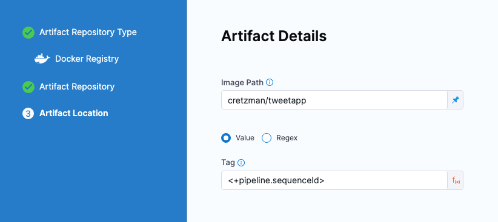

This topic describes a few of the cross-module use cases in the Harness platform.

## Harness Continuous Integration

You can couple Harness Continuous Integration (CI) and Continuous Delivery (CD) in a single pipeline.

You can use Harness CI as the first stage in the pipeline to build, test, and push your app to a repo, and then have a subsequent CD stage pull that app version from the repo and deploy it to a dev, QA, or prod environment.

Here's the YAML for a simple example that builds and pushes an app in the CI stage and then pulls and deploys the app in the CD stage.

<details>
<summary>YAML</summary>

```yaml
pipeline:
  name: tweety
  identifier: tweety
  projectIdentifier: CD_Docs
  orgIdentifier: default
  tags: {}
  properties:
    ci:
      codebase:
        connectorRef: tweetapp
        build: <+input>
  stages:
    - stage:
        name: Tweetapp
        identifier: Tweetapp
        type: CI
        spec:
          cloneCodebase: true
          infrastructure:
            type: KubernetesDirect
            spec:
              connectorRef: docimmut
              namespace: default
              automountServiceAccountToken: true
              nodeSelector: {}
              os: Linux
          execution:
            steps:
              - step:
                  type: BuildAndPushDockerRegistry
                  name: Build Tweet App
                  identifier: Build_Tweet_App
                  spec:
                    connectorRef: Docker_Hub_with_Pwd
                    repo: cretzman/tweetapp
                    tags:
                      - <+pipeline.sequenceId>
          service:
            serviceRef: ""
        variables: []
    - stage:
        name: deploy tweety
        identifier: deploy_tweety
        description: ""
        type: Deployment
        spec:
          deploymentType: Kubernetes
          service:
            serviceRef: Tweety
          environment:
            environmentRef: Tweety
            deployToAll: false
            infrastructureDefinitions:
              - identifier: Tweety
          execution:
            steps:
              - step:
                  name: Rollout Deployment
                  identifier: rolloutDeployment
                  type: K8sRollingDeploy
                  timeout: 10m
                  spec:
                    skipDryRun: false
                    pruningEnabled: false
            rollbackSteps:
              - step:
                  name: Rollback Rollout Deployment
                  identifier: rollbackRolloutDeployment
                  type: K8sRollingRollback
                  timeout: 10m
                  spec:
                    pruningEnabled: false
        tags: {}
        failureStrategies:
          - onFailure:
              errors:
                - AllErrors
              action:
                type: StageRollback
        when:
          pipelineStatus: Success
  allowStageExecutions: true
```
</details>

Here's what the pipeline looks like in pipeline studio:

```mdx-code-block
import Tabs from '@theme/Tabs';
import TabItem from '@theme/TabItem';
```
```mdx-code-block
<Tabs>
  <TabItem value="CI stage" label="CI stage" default>
```

Here's the push step from the CI stage:

<docimage path={require('./static/f2f3a47b93bed917ba2df30fc996ee9a859119c2ce7288eebbf0c8e9d81d8f0d.png')} width="60%" height="60%" title="Click to view full size image" />

Note the `<+pipeline.sequenceId>` expression. This is used to tag the artifact pushed to Docker Hub. You can tag your artifact versions in a number of ways. The expression `<+pipeline.sequenceId>` is incremented each time the pipeline is run.

The expression `<+pipeline.sequenceId>` will be used in the subsequent CD stage to fetch the app version.

```mdx-code-block
  </TabItem>
  <TabItem value="CD stage" label="CD stage">
```

Here's the Kubernetes Rollout Deployment step from the CD stage.

<docimage path={require('./static/d3f2a764bed2a191ddb13ae8c4f2a607da97c7aa22e94f433eeac946da54cb15.png')} width="60%" height="60%" title="Click to view full size image" />

In the stage's service, the expression `<+pipeline.sequenceId>` is used pull the the app version.



It's that simple to integrate Harness CI and CD.

```mdx-code-block
  </TabItem>
</Tabs>
```

### Learn more

This was just a simple introduction to the integration.

For a longer tutorial of Harness CI and CD integration, go to [Build and Deploy a NodeJS App to Kubernetes](/tutorials/cd-pipelines/unified-cicd).

## Harness Chaos Engineering

The Harness Chaos Engineering (HCE) integration with Harness CD allows chaos experiments to be executed as part of a Harness CD pipeline.

For a tutorial of this integration, go to [Integration with Harness CD](/tutorials/chaos-experiments/integration-with-harness-cd).
