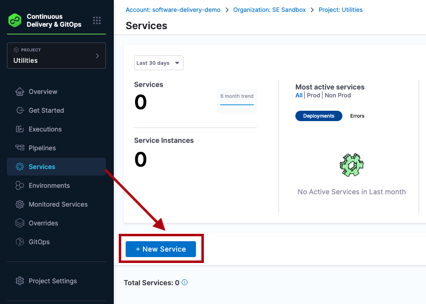
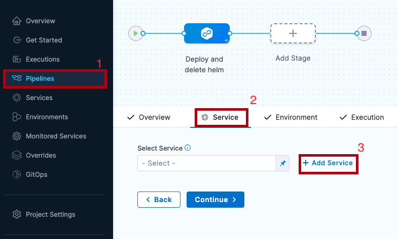

This topic describes Harness Continuous Delivery (CD) services and environments.

If you are new to Harness, please review [Harness key concepts](../../getting-started/learn-harness-key-concepts.md) and [CD pipeline modeling overview](./cd-pipeline-modeling-overview.md).

## Video: Services

<!-- Video:
https://harness-1.wistia.com/medias/xtmi0c0z95-->
<docvideo src="https://harness-1.wistia.com/medias/xtmi0c0z95" />


### Video: Services and environments at the account and org level

<!-- Video:
https://harness-1.wistia.com/medias/s89yka6hal-->
<docvideo src="https://harness-1.wistia.com/medias/s89yka6hal" />


## Services

Services represent your microservices and other workloads. Each service contains a **Service Definition** that defines your deployment artifacts, manifests or specifications, configuration files, and service-specific variables.

You can create services from: 
* An account
* An Organization
* Within a pipeline
* Outside a pipeline 

### Creating services at an account or organization level

You can create a service at an account or organization level from the Harness UI using APIs or Terraform.

```mdx-code-block
import Tabs from '@theme/Tabs';
import TabItem from '@theme/TabItem';
```
```mdx-code-block
<Tabs>
  <TabItem value="Pipeline Studio" label="Pipeline Studio">
```
To create a service at an account or organization level, go to **Organization Resources** **>Services**.

Creating an account level service enables you to manage the service globally across the organizations and projects within the account. 

An account level service can only reference connectors for the manifests and artifacts within the account. These services are global and cannot have dependencies at a lower hierarchy level.

Shared services can also be created and managed at account or organization levels.


:::note
When using an account level deployment stage template, you can referencing an account level service only. Similarly, for organization level stage templates, you can reference organization level services only. 

However, when using a deployment stage in a pipeline that has service configured as a runtime input, you can pick services from project, organization, or account levels to pass them as runtime inputs based on your RBAC. 

Go to [add a stage template](/docs/platform/13_Templates/add-a-stage-template.md) for more information.
:::

Expand the section below to see a sample account level service YAML.

<details>
   <summary>Account level service YAML</summary>

```
service:
  name: nginx
  identifier: nginx
  tags: {}
  serviceDefinition:
    spec:
      manifests:
        - manifest:
            identifier: nginx-base
            type: K8sManifest
            spec:
              store:
                type: Github
                spec:
                  connectorRef: account.Harness_K8sManifest
                  gitFetchType: Branch
                  paths:
                    - cdng/
                  repoName: <+input>
                  branch: main
              skipResourceVersioning: false
      artifacts:
        primary:
          primaryArtifactRef: <+input>
          sources:
            - spec:
                connectorRef: account.Harness_DockerHub
                imagePath: library/nginx
                tag: <+input>
                digest: <+input>
              identifier: harness dockerhub
              type: DockerRegistry
    type: Kubernetes
```
</details>

Expand the section below to see a sample organization level service YAML.

<details>
   <summary>Organization level service YAML</summary>

```
service:
  name: redis
  identifier: redis
  tags: {}
  serviceDefinition:
    spec:
      manifests:
        - manifest:
            identifier: redis
            type: HelmChart
            spec:
              store:
                type: Http
                spec:
                  connectorRef: org.bitnami
              chartName: redis
              chartVersion: ""
              subChartName: ""
              helmVersion: V3
              skipResourceVersioning: false
              enableDeclarativeRollback: false
        - manifest:
            identifier: Redis Values
            type: Values
            spec:
              store:
                type: Github
                spec:
                  connectorRef: account.Rohan_Github
                  gitFetchType: Branch
                  paths:
                    - redis/values.yaml
                  repoName: Product-Management
                  branch: main
      variables:
        - name: namespace
          type: String
          description: "namespace for the redis service"
          value: redis
    type: Kubernetes
  description: sample redis service
```
</details>

```mdx-code-block
  </TabItem>
  <TabItem value="API" label="API">
```
For information about creating a service API, go to [create a service](https://apidocs.harness.io/tag/Services#operation/createServiceV2).

The `orgIdentifier` and `projectIdentifier` field definitions are optional, and depend on where you want to create the service. For example, if you create a service at an account level, you will not need org or project identifiers in the post API call payload.

```mdx-code-block
  </TabItem>
  <TabItem value="Terraform" label="Terraform">
```
For information about creating a Harness platform service, go to [harness_platform_service (Resource)](https://registry.terraform.io/providers/harness/harness/latest/docs/resources/platform_service).

The `org_id` and `project_id` field definitions are optional, and depend on where you want to create the service. For example, if you create a service at an account level, you will not need org or project identifiers.

Expand the section below to see a sample platform service in Terraform. 

<details>
   <summary>Harness platform service</summary>

```
resource "harness_platform_service" "example" {
  identifier  = "identifier"
  name        = "name"
  description = "test"
  org_id      = "org_id"
  project_id  = "project_id"

  ## SERVICE V2 UPDATE
  ## We now take in a YAML that can define the service definition for a given Service
  ## It isn't mandatory for Service creation 
  ## It is mandatory for Service use in a pipeline

  yaml = <<-EOT
                service:
                  name: name
                  identifier: identifier
                  serviceDefinition:
                    spec:
                      manifests:
                        - manifest:
                            identifier: manifest1
                            type: K8sManifest
                            spec:
                              store:
                                type: Github
                                spec:
                                  connectorRef: <+input>
                                  gitFetchType: Branch
                                  paths:
                                    - files1
                                  repoName: <+input>
                                  branch: master
                              skipResourceVersioning: false
                      configFiles:
                        - configFile:
                            identifier: configFile1
                            spec:
                              store:
                                type: Harness
                                spec:
                                  files:
                                    - <+org.description>
                      variables:
                        - name: var1
                          type: String
                          value: val1
                        - name: var2
                          type: String
                          value: val2
                    type: Kubernetes
                  gitOpsEnabled: false
              EOT
}
```
</details>

```mdx-code-block
  </TabItem>    
</Tabs>
```

### Creating services outside a pipeline

To create a service from outside of a pipeline, you use **Services** in the navigation pane.



### Creating services inside a pipeline

To create a service from inside of a pipeline, select the **Services** tab of a new CD stage, then select **New Service**.



Once the service and its service definition are saved, you can select it in any pipeline.

When you select the service in a pipeline, you can select **Edit Service** to edit its **Service Definition**.

When you create the new service you define its **Service Definition**. For example, a Kubernetes **Service Definition** with a Kubernetes manifest and Docker artifact.

## Environments

Environments represent your deployment targets (QA, Prod, etc). Each environment contains one or more **Infrastructure Definitions** that list your target clusters, hosts, namespaces, etc.

You can create environments from: 
* An Account
* An Organization
* Within a pipeline
* Outside a pipeline 

Next you can define all of its settings:

* **Configuration:** the default environment configuration, including variables, manifests, specifications, and config files that will be used every time the environment is used in a stage.
* **Service Overrides:** override specific services. You select a service and define what will be overridden whenever that Service is deployed to this environment.
* **Infrastructure Definitions:** represent one or more environment infrastructures.
  * Infrastructure definitions are the actual clusters, hosts, etc., where Harness deploys a service. For example, you might have a QA environment with separate Kubernetes clusters (infrastructure definitions) for each service you want to test.
  * You can add multiple infrastructure definitions to a single environment and select an infrastructure definition when you add the environment to a stage.
* **GitOps Clusters:** adding Harness GitOps clusters to an environment lets you select them as the deployment target in stages. For more information on Harness GitOps, go to [Harness GitOps Basics](/docs/continuous-delivery/gitops/harness-git-ops-basics.md).


### Creating environments at an account or organization level

You can create an environment and provide infrastructure definitions at an account or organization level from the Harness UI, using APIs or Terraform.

```mdx-code-block
import Tabs2 from '@theme/Tabs';
import TabItem2 from '@theme/TabItem';
```
```mdx-code-block
<Tabs2>
  <TabItem2 value="Pipeline Studio" label="Pipeline Studio">
```

To create an environment at an account or organization level, go to **Organization Resources** **>Environments**. 


Expand the section below to see a sample account level environment YAML.

<details>
   <summary>Account level environment YAML</summary>

```
environment:
  name: dev
  identifier: dev
  description: account wide dev environment
  tags:
    status: non-regulated
  type: PreProduction
  variables:
    - name: port
      type: String
      value: "8080"
      description: ""
    - name: namespace
      type: String
      value: <+service.name>-dev
      description: "namespace environment variable"
```
</details>

Expand the section below to see a sample account level infrastructure definition YAML.

<details>
   <summary>Account level infrastructure definition YAML</summary>

```
infrastructureDefinition:
  name: dev-k8s
  identifier: dev
  description: development Kubernetes cluster
  tags: {}
  environmentRef: dev
  deploymentType: Kubernetes
  type: KubernetesDirect
  spec:
    connectorRef: account.Harness_Kubernetes_Cluster
    namespace: <+service.name>-dev
    releaseName: release-<+INFRA_KEY>
  allowSimultaneousDeployments: false
```
</details>

Expand the section below to see a sample organization level environment YAML.

<details>
   <summary>Organization level environment YAML</summary>

```
environment:
  name: prod
  identifier: prod
  description: production environment for the organization
  tags:
    status: regulated
  type: Production
  orgIdentifier: default
  variables:
    - name: namespace
      type: String
      value: <+service.name>-prod
      description: "namespace for prod environment"
    - name: port
      type: String
      value: "8080"
      description: "port for prod environment"
```
</details>

Expand the section below to see a sample organization level infrastructure definition YAML.

<details>
   <summary>Organization level infrastructure definition YAML</summary>

```
infrastructureDefinition:
  name: prod-k8s
  identifier: prodk8s
  description: production kubernetes cluster
  tags: {}
  orgIdentifier: default
  environmentRef: prod
  deploymentType: Kubernetes
  type: KubernetesDirect
  spec:
    connectorRef: account.Harness_Kubernetes_Cluster
    namespace: production
    releaseName: release-<+INFRA_KEY>
  allowSimultaneousDeployments: false
```
</details>

```mdx-code-block
  </TabItem2>
  <TabItem2 value="API" label="API">
```
For information about creating an environment API, go to [create an environment](https://apidocs.harness.io/tag/Environments#operation/createEnvironmentV2).

For information about creating infrastructure definition API, go to [create an infrastructure in an environment](https://apidocs.harness.io/tag/Infrastructures#operation/createInfrastructure).

The `orgIdentifier` and `projectIdentifier` field definitions are optional, and depend on where you want to create the environment. For example, if you create an environment at an account level, you will not need org or project identifiers in the post API call payload.

```mdx-code-block
  </TabItem2>
  <TabItem2 value="Terraform" label="Terraform">
```
For information about creating a Harness platform environment, go to [harness_platform_environment (Resource)](https://registry.terraform.io/providers/harness/harness/latest/docs/resources/platform_environment).

Expand the section below to see a sample platform environment in Terraform. 

<details>
   <summary>Harness platform environment</summary>

```
resource "harness_platform_environment" "example" {
  identifier = "identifier"
  name       = "name"
  org_id     = "org_id"
  project_id = "project_id"
  tags       = ["foo:bar", "baz"]
  type       = "PreProduction"

  ## ENVIRONMENT V2 Update
  ## The YAML is needed if you want to define the Environment Variables and Overrides for the environment
  ## Not Mandatory for Environment Creation nor Pipeline Usage

  yaml = <<-EOT
               environment:
         name: name
         identifier: identifier
         orgIdentifier: org_id
         projectIdentifier: project_id
         type: PreProduction
         tags:
           foo: bar
           baz: ""
         variables:
           - name: envVar1
             type: String
             value: v1
             description: ""
           - name: envVar2
             type: String
             value: v2
             description: ""
         overrides:
           manifests:
             - manifest:
                 identifier: manifestEnv
                 type: Values
                 spec:
                   store:
                     type: Git
                     spec:
                       connectorRef: <+input>
                       gitFetchType: Branch
                       paths:
                         - file1
                       repoName: <+input>
                       branch: master
           configFiles:
             - configFile:
                 identifier: configFileEnv
                 spec:
                   store:
                     type: Harness
                     spec:
                       files:
                         - account:/Add-ons/svcOverrideTest
                       secretFiles: []
      EOT
}
```
</details>

For information about creating a Harness platform infrastructure definition, go to [harness_platform_infrastructure (Resource)](https://registry.terraform.io/providers/harness/harness/latest/docs/resources/platform_infrastructure).

Expand the section below to see a sample platform infrastructure definition in Terraform.

<details>
   <summary>Harness platform infrastructure definition</summary>

```
resource "harness_platform_infrastructure" "example" {
  identifier      = "identifier"
  name            = "name"
  org_id          = "orgIdentifer"
  project_id      = "projectIdentifier"
  env_id          = "environmentIdentifier"
  type            = "KubernetesDirect"
  deployment_type = "Kubernetes"
  yaml            = <<-EOT
        infrastructureDefinition:
         name: name
         identifier: identifier
         description: ""
         tags:
           asda: ""
         orgIdentifier: orgIdentifer
         projectIdentifier: projectIdentifier
         environmentRef: environmentIdentifier
         deploymentType: Kubernetes
         type: KubernetesDirect
         spec:
          connectorRef: account.gfgf
          namespace: asdasdsa
          releaseName: release-<+INFRA_KEY>
          allowSimultaneousDeployments: false
      EOT
}
```
</details>

The `org_id` and `project_id` field definitions are optional, and depend on where you want to create the environment. For example, if you create an environment at an account level, you will not need org or project identifiers.

```mdx-code-block
  </TabItem2>    
</Tabs2>
```
### Creating environments inside a pipeline

To create an environment from inside of a pipeline, select **New Environment** in the **Infrastructure** tab of a new CD stage.


### Creating environments outside a pipeline

To create an Environment from outside of a pipeline, you use **Environments** in the navigation pane.


### Configuration

In the environment **Configuration**, you can manage the **Name**, **Description**, **Tags**, and **Environment Type** of the environment.


You can also set default manifests, specifications, config files, and variables to use whenever Harness deploys a service to this environment.

For example, a stage has a Kubernetes service with a manifest but whenever that service is deployed to the **QA** environment, the manifest in that environment's **Configuration** overwrites the namespace of with the manifest in the service with `QA`.

### Service overrides

Service overrides are different from **Environment Configuration** in the following ways:

* Environment **Configuration**: applies to every service that is used with the environment.
* Environment **Service Overrides**: applies to specific services you select. Whenever that service is used with that environment, the **Service Override** is applied.

:::note
Runtime inputs are not supported if you are trying to override services in multi-service and multi-environment set ups.
:::

#### Override priority

When you are using environment configuration and service override to override service settings, it's important to understand the priority of the overrides.

The priority from top to bottom is:

1. Environment service overrides
2. Environment configuration
3. Service settings


#### Override priority example

Suppose you have a pipeline that runs as follows:

* Deploys a service named `myService`, which has a variable `cpu` set to 1. 
* Deploys `myService` to `myEnvironmentAlpha`, and then overrides the `myService` variable `cpu` value to 2. 

In this case, the environment variable takes precedence, and overrides the service variable. When the pipeline runs, it uses the `cpu` value of 2. 

Now, suppose you have a another pipeline that deploys `myService` to `myEnvironmentKappa`, which has a service override that sets `cpu` to 4. In this case, the environment service override takes precedence over the environment configuration and the service setting. When the pipeline runs, it uses  the `cpu` value of 4. 

### Infrastructure definitions

Infrastructure definitions represent an environment's infrastructures physically. They are the actual clusters, hosts, namespaces, etc, where you are deploying a service.

An environment can have multiple **Infrastructure Definitions**. 


When you select an environment in a stage, you can select the **Infrastructure Definition** to use for that stage.


#### Infrastructure Tags

Tags can be attached to infrastructure definitions representing their characteristics. These tags can be key value pairs. 


When you select the **Infrastructure Definition** for a stage, the attached tags can be accessed using their keys with the expression, ```<+infra.tags.tag_key>```. This expression is available for use throughout the stage. 

For example, skipping certain steps in pipeline based on the tags attached to the infrastructure. 


## Values YAML overrides and merges

You can specify values YAML files at the environment's **Service Overrides** and **Configuration**, and the service itself.

Here is an example of specifying it at the environment's **Configuration**:


When you have a values yaml file at two or more of the environment **Service Overrides**, **Environment Configuration**, and the service itself, Harness merges the files into a single values YAML for deployment. This merging is performed at pipeline execution runtime.

Overriding occurs when the higher priority setting has the same `name:value` pair as a lower priority setting.

Let's look at two examples.

### Merging values YAML name:value pairs

An environment's **Service Overrides** values YAML has the name:value pair `servicePort: 80` but no `replicas` name:value.

A service's **Service Definition** has a values YAML with `replicas: 2` but no `servicePort` name:value.

At runtime, the two values YAML files are merged into one.

The `servicePort: 80` from the environment **Service Overrides** values YAML is merged with the **Service Definition**'s `replicas: 2` in the values YAML:


### Fully overriding values YAML name:value pairs

An environment's **Service Overrides** values YAML has the name:value pairs `replicas: 2` and `servicePort: 80`. 

A service's **Service Definition** has a values YAML with `replicas: 4` and `servicePort: 8080`. 

At runtime, the name:value pairs from the environment **Service Overrides** values YAML fully override the service values YAML. The `replicas: 2` and `servicePort: 80` from the environment **Service Overrides** are used.


## Config files and variables are completely overridden

Config files are a black box that can contain multiple formats and content, such as YAML, JSON, plain text, etc. Consequently, they cannot be overridden like Values YAML files.

Variables cannot be partially overridden either. They are completely replaced.

When you have **Config files** at two or more of the environment **Service Overrides**, **Configuration**, and the service itself, the standard override priority is applied.

When you have **Variables** with the same name at two or more of the environment **Service Overrides**, **Configuration**, and the service itself, the standard override priority is applied.

## GitOps Clusters

When you use Harness GitOps you can add GitOps clusters to an environment. 

To learn more about Harness GitOps, go to [Harness GitOps Basics](/docs/continuous-delivery/gitops/harness-git-ops-basics.md). 

Next, when you create a pipeline, you can select the environment and the GitOps cluster(s) to use.


GitOps clusters are used in a PR pipeline. A PR pipeline creates and merges a Git PR on the `config.json` for a destination cluster as part of an ApplicationSet. The PR Pipeline runs, merges a change to the config.json, and a GitOps sync on the ApplicationSet is initiated.

GitOps Clusters are not used in standard CD pipelines. They're used when using GitOps only.

## Runtime inputs and expressions in services and environments

If you use runtime inputs in your services and environments, users will need to provide values for these when they run pipeline using these services and environments.

If you use expressions in your services and environments, Harness must be able to resolve these expressions when users run pipeline using these services and environments.

Select **Runtime input** for the service and environment.


When you run the pipeline, you can select the service and environment for their runtime inputs.


For more information on runtime inputs and expressions, go to [Fixed Values, Runtime Inputs, and Expressions](/docs/platform/20_References/runtime-inputs.md).

## Services and environments RBAC

Please review these key RBAC uses cases for services and environments.

For extensive information on Harness RBAC, go to [Harness Role-Based Access Control Overview](../../platform/4_Role-Based-Access-Control/1-rbac-in-harness.md) and [Harness Role-Based Access Control Quickstart](../../platform/4_Role-Based-Access-Control/10-set-up-rbac-pipelines.md).


### Access permission is needed to deploy to a service or environment

One of the most important advantages of services and environments is the ability to define roles that determines who can deploy them.

In order for a role to allow deployments using services and/or environments, the role must have the access permission enabled for services and/or environments.


The **View**, **Create**, **Edit**, **Delete**, and **Manage** permissions enable you to deploy a service and environment.

If a role does not have the **Access** permission for **Environments**, a user or user group assigned that role cannot deploy to any environment.

If a role does not have the **Access** permission for **Services**, a user or user group assigned that role cannot deploy any service.

### Restrict access to specific services or environments for a user or user group

You can restrict a user or user group to using specific services and environments only. The process is the same for services and environments. 

Let's look at an example using environments.

If you want to restrict a user or user group to deploy to a specific environment only, do the following:

1. Create a resource group and select the environment.
2. Create a Role and give the user or user group permissions. The **Access** permission is needed for deployments.
3. Assign the role and resource group to the user or user group.


## Environment groups

Environment groups are simple a way to group environments so you can assign permissions to multiple environments in a role.


