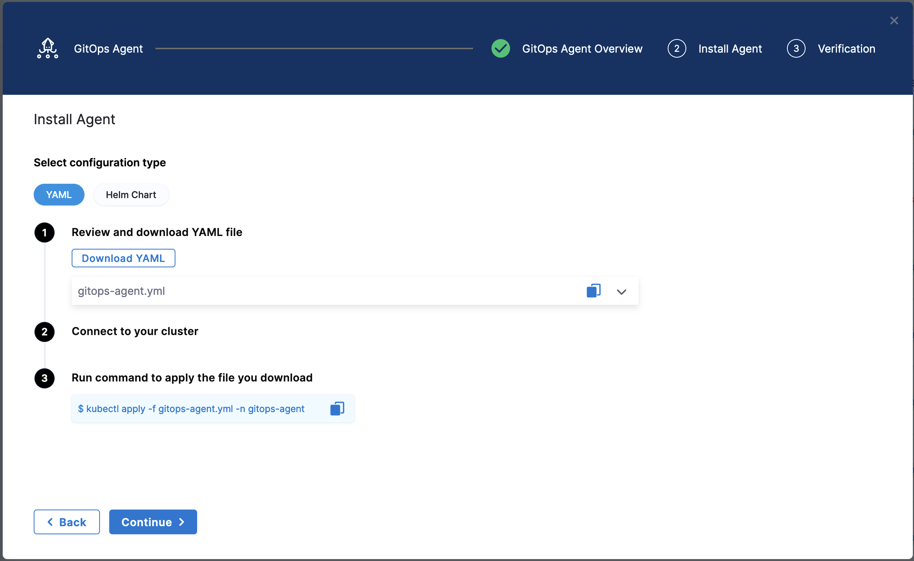
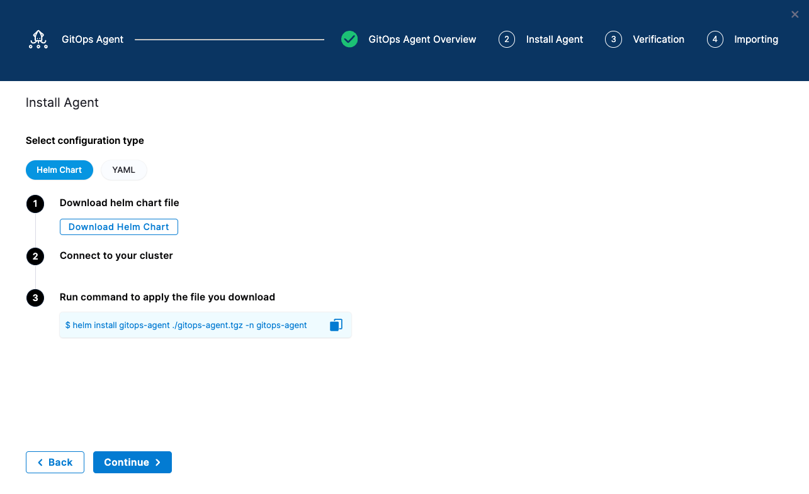
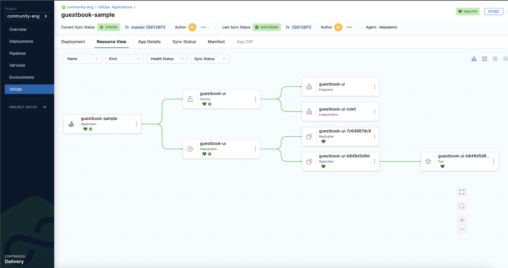
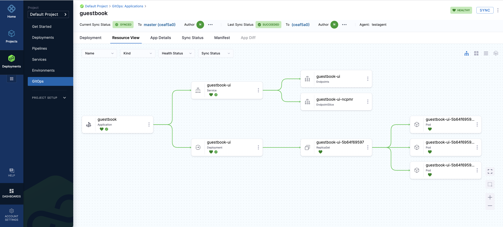

<CTABanner
  buttonText="Learn More"
  title="Continue your learning journey."
  tagline="Take a Continuous Delivery & GitOps Certification today!"
  link="/university/continuous-delivery"
  closable={true}
  target="_self"
/>

import Tabs from '@theme/Tabs';
import TabItem from '@theme/TabItem';

<!--
Import statements for CLI downloads
<MacOSCLI />, <WindowsCLI />, <ARMCLI />, <AMDCLI />
-->

import MacOSCLI from '/docs/platform/shared/cli/mac.md';
import WindowsCLI from '/docs/platform/shared/cli/windows.md';
import ARMCLI from '/docs/platform/shared/cli/arm.md';
import AMDCLI from '/docs/platform/shared/cli/amd.md';

<style>
{`
.tabs-centered .tabs {
  display: flex;
  justify-content: center;
}
.tabs-centered .tabs__item {
  flex: 1;
  text-align: center;
}
`}
</style>

This topic explains how to deploy a sample application (Guestbook) using a publicly available Kubernetes manifest and Docker image with Harness Continuous Delivery (CD).

Harness CD offers two ways to deploy the Guestbook application:

- [CD pipeline](#getting-started-harness-cd-ui): You build a Harness pipeline that deploys the manifest to your target cluster.
- [GitOps workflow](#getting-started-harness-gitops): You install a Harness GitOps Agent, connect it to your Git repo and target cluster, and let Harness (using Argo CD) sync the desired state from Git into your cluster.

:::note

<a href="https://app.harness.io/auth/#/signup/?module=cd&utm_source=website&utm_medium=harness-developer-hub&utm_campaign=cd-plg&utm_content=tutorials-cd-kubernetes-manifest" target="_blank" rel="noopener noreferrer">Sign up</a> today to get started with Harness CD.

:::

---

## What will you learn in this topic?

- How to set up a [delegate](#delegate), [secret](#secrets), [connectors](#connectors), [environment](#environment), [service](#services), and [pipeline](#pipeline) to deploy the Guestbook application.
- How to choose a rolling, canary, or Blue Green [deployment strategy](#pipeline) for your pipeline.
- How to install a [Harness GitOps Agent](#gitops-agent) and [sync the desired state](#synchronize-the-application) from your Git repository into your cluster using Argo CD.
- How to deploy the Guestbook application using the Harness [UI](#getting-started-harness-cd-ui), [CLI](#getting-started-harness-cd-ui), or [Harness Terraform Provider](#set-up-harness-terraform-provider).

---

## Before you begin

Ensure you have the following:

- **GitHub personal access token**: A token with the `repo` scope. Go to <a href="https://help.github.com/en/github/authenticating-to-github/creating-a-personal-access-token-for-the-command-line" target="_blank" rel="noopener noreferrer">creating a personal access token</a> to generate one.
- **Kubernetes cluster**: Use your own cluster, or install <a href="https://k3d.io/v5.5.1/" target="_blank" rel="noopener noreferrer">K3D</a> to run Harness Delegates and the sample application in a local development environment. Go to <a href="/docs/platform/delegates/delegate-concepts/delegate-requirements" target="_blank" rel="noopener noreferrer">Delegate system and network requirements</a> to review the requirements.
- **Helm CLI**: Install the <a href="https://helm.sh/docs/intro/install/" target="_blank" rel="noopener noreferrer">Helm CLI</a> to install the Harness Helm delegate.
- **Forked example repository**: Fork the <a href="https://github.com/harness-community/harnesscd-example-apps/fork" target="_blank" rel="noopener noreferrer">harnesscd-example-apps</a> repository through the GitHub web interface. Go to <a href="https://docs.github.com/en/get-started/quickstart/fork-a-repo#forking-a-repository" target="_blank" rel="noopener noreferrer">GitHub docs</a> to fork a repository.
- **Harness API token (CLI or Terraform method only)**: A token required to run the CLI or Terraform steps. Go to <a href="/docs/platform/automation/api/add-and-manage-api-keys/" target="_blank" rel="noopener noreferrer">creating a personal API token</a> to generate one.

---

## Deploy the application

:::note

Harness resources such as delegates, secrets, and connectors can be created at the Account, Organization, or Project scope. For simplicity, this tutorial uses Project-scoped resources throughout. If you use resources from a different scope, update the configuration accordingly when you create connectors, environments, services, and the deployment pipeline.

Go to <a href="/docs/platform/organizations-and-projects" target="_blank" rel="noopener noreferrer">Organizations and projects</a> to understand the Harness resource hierarchy and scopes.

:::

You can deploy the Guestbook application using either a Harness CD pipeline or a Harness GitOps workflow.

Run the following command to check your system resources and optionally install a local cluster:

```bash
bash <(curl -fsSL https://raw.githubusercontent.com/harness-community/scripts/main/delegate-preflight-checks/cluster-preflight-checks.sh)
```

<Tabs queryString="pipeline" className="tabs-centered">
<TabItem value="cd-pipeline" label="CD Pipeline" queryString="pipeline">

### Deploy with a CD pipeline \{#getting-started-harness-cd-ui}

Harness CD pipelines allow you to orchestrate and automate your deployment workflows and push updated application images to your target Kubernetes cluster. Pipelines allow extensive control over how you want to progress artifacts through various development, test, staging, or production clusters, when running a variety of scans and tests to ensure the quality and stability standards you and your team have defined.

You can proceed with the tutorial using either the Harness user interface (UI) or the command-line interface (CLI).

<Tabs queryString="interface" className="tabs-centered">
<TabItem value="ui" label="UI">

Perform the following steps to deploy the Guestbook application using the Harness CD Pipeline UI:

1. Log in to <a href="https://app.harness.io/" target="_blank" rel="noopener noreferrer">Harness Manager</a>.
2. Select **Projects**, and then select **Default Project**.
3. After selecting the project, configure the core resources Harness requires to run a deployment, including a delegate, a secret, two connectors, an environment, a service, and a deployment pipeline, as explained in the following sections.

:::warning

For the pipeline to run successfully, follow the remaining steps as they are, including the naming conventions.

:::

#### Delegate

The Harness Delegate is a service that runs in your local network or VPC to establish connections between the Harness Manager and various providers such as artifacts registries, cloud platforms, and so on. The delegate is installed in the target infrastructure, for example, a Kubernetes cluster, and performs operations including deployment and integration. Go to <a href="/docs/platform/delegates/delegate-concepts/delegate-overview/" target="_blank" rel="noopener noreferrer">Delegate Overview</a> to understand the delegate.

Perform the following steps to set up a delegate:

1.  Under **Project Settings**, select **Delegates**.
2.  Click **New Delegate**. 
3.  Select **Kubernetes** in the **Select where you want to install your Delegate** section.
4.  In the **Install your Delegate** section, for this tutorial, install the delegate using **Helm Chart**.
5.  Add the Harness Helm chart repo to your local helm registry using the following command.
    ```bash
    helm repo add harness-delegate https://app.harness.io/storage/harness-download/delegate-helm-chart/
    ```
6. Update the repo using the following command:

   ```bash
   helm repo update harness-delegate
   ```
7. Copy and run the install command from the Delegate installation wizard as shown in the following example:

   Here, the `ACCOUNT_ID`, `MANAGER_ENDPOINT` and `DELEGATE_TOKEN` are auto-populated values you will get from the wizard itself.

   ```bash
   helm upgrade -i helm-delegate --namespace harness-delegate-ng --create-namespace \
   harness-delegate/harness-delegate-ng \
    --set delegateName=helm-delegate \
    --set accountId=ACCOUNT_ID \
    --set managerEndpoint=MANAGER_ENDPOINT \
    --set delegateDockerImage=harness/delegate:23.03.78904 \
    --set replicas=1 --set upgrader.enabled=false \
    --set delegateToken=DELEGATE_TOKEN
   ```
8. Select **Verify** to verify that the delegate is installed successfully and can connect to the Harness Manager.

:::note

You can also follow the <a href="/docs/platform/get-started/tutorials/install-delegate" target="_blank" rel="noopener noreferrer">Install Harness Delegate on Kubernetes or Docker</a> steps to install the delegate using the Harness Terraform Provider or a Kubernetes manifest.

:::

#### Secrets

Harness offers built-in secret management for encrypted storage of sensitive information. Secrets are decrypted when needed, and only the private network-connected Harness Delegate has access to the key management system. You can also integrate your own secret manager. Go to <a href="/docs/platform/secrets/secrets-management/harness-secret-manager-overview/" target="_blank" rel="noopener noreferrer">Harness Secret Manager Overview</a> to understand secrets in Harness.

Perform the following steps to add a secret:

1. Under **Project Settings**, select **Secrets**.
2. Click **New Secret**, and then select **Text**.
3. In the **Add new Encrypted Text** page,
   1. Select the **Secret Manager**. For example, `Harness Built-in Secret Manager`.
   2. Enter the **Secret Name**. For example, `harness_gitpat`.
   3. For the **Secret Value**, paste the GitHub personal access token you saved earlier.
   4. Add the **Description** (Optional) and **Tags** (Optional).
   5. Select **Save**.

#### Connectors

Connectors in Harness enable integration with third party tools, providing authentication and operations during pipeline runtime. For instance, a GitHub connector facilitates authentication and fetching files from a GitHub repository within pipeline stages. Go to <a href="/docs/category/connectors" target="_blank" rel="noopener noreferrer">Connectors</a> to explore connector how-tos.

#### Set up the GitHub connector
Perform the following steps to set up a GitHub connector:
1. Copy the contents of <a href="https://github.com/harness-community/harnesscd-example-apps/blob/master/guestbook/harnesscd-pipeline/github-connector.yml" target="_blank" rel="noopener noreferrer">github-connector.yml</a>.
2. In your Harness project in the Harness Manager, under **Project Settings**, select **Connectors**.
3. Select **Create via YAML Builder** and paste the copied YAML in *Step 1*.
4. Replace `GITHUB_USERNAME` with your GitHub account username in the YAML (assuming you have already forked the <a href="https://github.com/harness-community/harnesscd-example-apps/fork" target="_blank" rel="noopener noreferrer">harnesscd-example-apps</a> repo as noted in Before You Begin).
5. In `projectIdentifier`, verify that the project identifier is correct. You can see the Id in the browser URL (after `account`). If it is incorrect, the Harness YAML editor suggests the correct Id.
6. Select **Save Changes** and verify that the new connector named `harness_gitconnector` is successfully created.
7. Select **Connection Test** under **Connectivity Status** to ensure the connection is successful.

#### Set up the Kubernetes connector
Perform the following steps to set up a Kubernetes connector:
1. Copy the contents of <a href="https://github.com/harness-community/harnesscd-example-apps/blob/master/guestbook/harnesscd-pipeline/kubernetes-connector.yml" target="_blank" rel="noopener noreferrer">kubernetes-connector.yml</a>.
2. In your Harness project, under **Project Settings**, select **Connectors**.
3. Select **Create via YAML Builder** and paste the copied YAML in *Step 1*.
4. Replace `DELEGATE_NAME` with the installed Delegate name. To obtain the Delegate name, navigate to **Project Settings**, and then **Delegates**.
5. Select **Save Changes** and verify that the new connector named `harness_k8sconnector` is successfully created.
6. Select **Connection Test** under **Connectivity Status** to verify the connection is successful.

#### Environment

Environments define the deployment location, categorized as **Production** or **Pre-Production**. Each environment includes infrastructure definitions for VMs, Kubernetes clusters, or other target infrastructures. Go to <a href="/docs/continuous-delivery/x-platform-cd-features/environments/environment-overview/" target="_blank" rel="noopener noreferrer">Environments overview</a> to understand environments.

Perform the following steps to set up an environment:

1. In your Harness project, under **Project Settings**, select **Environments**.
2. Click **New Environment**. 
3. In the **New Environment** page,
   1. Select **YAML**.
   2. Copy the contents of <a href="https://github.com/harness-community/harnesscd-example-apps/blob/master/guestbook/harnesscd-pipeline/environment.yml" target="_blank" rel="noopener noreferrer">environment.yml</a>, paste it into the YAML editor.
   3. Select **Save**.
4. In your new environment, select the **Infrastructure Definitions** tab.
5. Select **Infrastructure Definition**.
6. In the **Create New Infrastructure** page,
   1. Select **YAML**.
   2. Copy the contents of <a href="https://github.com/harness-community/harnesscd-example-apps/blob/master/guestbook/harnesscd-pipeline/infrastructure-definition.yml" target="_blank" rel="noopener noreferrer">infrastructure-definition.yml</a> and paste it into the YAML editor.
   3. Select **Save** and verify that the environment and infrastructure definition are created successfully.

#### Services

In Harness, services represent what you deploy to an environment. You use services to configure variables, manifests, and artifacts. The **Services** dashboard provides service statistics such as deployment frequency and failure rate. Go to <a href="/docs/continuous-delivery/x-platform-cd-features/services/services-overview/" target="_blank" rel="noopener noreferrer">Services overview</a> to understand services.

Perform the following steps to set up a service:

1. In your Harness project, under **Project Settings**, select **Services**.
2. Select **New Service**.
3. On the Add Service page,
   1. Enter the service name. For example, `harnessguestbook`.
   2. Select **Save**.
   3. On the **Configuration** tab, select **YAML** option.
   4. Select **Edit YAML**, copy the contents of <a href="https://github.com/harness-community/harnesscd-example-apps/blob/master/guestbook/harnesscd-pipeline/service.yml" target="_blank" rel="noopener noreferrer">service.yml</a>, and paste it into the YAML editor.
   5. Select **Save**. Verify that the service `harness_guestbook` is successfully created.

#### Pipeline
A pipeline is a comprehensive process encompassing integration, delivery, operations, testing, deployment, and monitoring. It can use CI for code building and testing, followed by CD for artifact deployment in production. A CD Pipeline is a series of stages where each stage deploys a service to an environment. Go to <a href="/docs/continuous-delivery/overview#pipeline" target="_blank" rel="noopener noreferrer">CD pipeline basics</a> to understand CD pipelines.

Pick a deployment strategy from the following:

<Tabs className="tabs-centered">

<TabItem value="rolling" label="Rolling">

Rolling deployments incrementally add nodes in a single environment with a new service version, either one-by-one or in batches defined by a window size. Rolling deployments allow a controlled and gradual update process for the new service version. Go to <a href="/docs/continuous-delivery/manage-deployments/deployment-concepts#when-to-use-rolling-deployments" target="_blank" rel="noopener noreferrer">When to use rolling deployments</a> to understand when to use them.

Perform the following steps to set up a pipeline with rolling deployment:

1. In **Default Project**, select **Pipelines**.
2. Select **Create a Pipeline**.
3. In the **Create new Pipeline** page, 
   1. Enter the name. For example, `guestbook_rolling_pipeline`.
   2. Enter a description (optional).
   3. Enter a tag (optional).
   4. Specify the YAML version. For example, `v0`.
   5. Select **Inline** to store the pipeline in Harness.
   6. Select **Start with Template** to create the pipeline with an existing template in Harness Manager.
   7. Select **Start**.
4. In the Pipeline Studio, toggle to **YAML** to use the YAML editor.
5. Select **Edit YAML** to enable edit mode.
6. Copy the contents of <a href="https://github.com/harness-community/harnesscd-example-apps/blob/master/guestbook/harnesscd-pipeline/rolling-pipeline.yml" target="_blank" rel="noopener noreferrer">rolling-pipeline.yml</a>.
7. In your Harness pipeline YAML editor, paste the YAML.
8. Select **Save**.

You can switch to the **Visual** pipeline editor and confirm the pipeline stage and execution steps as shown below.

<div style={{ textAlign: 'center' }}>
<DocImage path={require('../static/k8s-manifest-tutorial/rolling.png')} alt="Rolling deployment pipeline" width="80%" height="80%" title="Click to view full size image" />
</div>

</TabItem>

<TabItem value="canary" label="Canary">

A canary deployment updates nodes in a single environment gradually, allowing you to use gates between increments. Canary deployments allow incremental updates and ensure a controlled rollout process. Go to <a href="/docs/continuous-delivery/manage-deployments/deployment-concepts#when-to-use-canary-deployments" target="_blank" rel="noopener noreferrer">When to use Canary deployments</a> to understand when to use them.

Perform the following steps to set up a pipeline with canary deployment:

1. In **Default Project**, select **Pipelines**.
2. Select **Create a Pipeline**.
3. In the **Create new Pipeline** page, 
   1. Enter the name. For example, `guestbook_canary_pipeline`.
   2. Enter a description (optional).
   3. Enter a tag (optional).
   4. Specify the YAML version. For example, `v0`.
   5. Select **Inline** to store the pipeline in Harness.
   6. Select **Start with Template** to create the pipeline with an existing template in Harness Manager.
   7. Select **Start**.
4. In the Pipeline Studio, toggle to **YAML** to use the YAML editor.
5. Select **Edit YAML** to enable edit mode.
6. Copy the contents of <a href="https://github.com/harness-community/harnesscd-example-apps/blob/master/guestbook/harnesscd-pipeline/canary-pipeline.yml" target="_blank" rel="noopener noreferrer">canary-pipeline.yml</a>.
7. In your Harness pipeline YAML editor, paste the YAML.
8. Select **Save**.

You can switch to the **Visual** pipeline editor and confirm the pipeline stage and execution steps as shown below.

<div style={{ textAlign: 'center' }}>
<DocImage path={require('../static/k8s-manifest-tutorial/canary.png')} alt="Canary deployment pipeline" width="80%" height="80%" title="Click to view full size image" />
</div>

</TabItem>
<TabItem value="bg" label="Blue Green">

Blue Green deployments involve running two identical environments (staging and production) simultaneously with different service versions. QA and UAT are performed on a new service version in the staging environment first. Next, traffic is shifted from the production environment to staging, and the previous service version running on production is scaled down. Blue Green deployments are also referred to as red/black deployment by some vendors. Go to <a href="/docs/continuous-delivery/manage-deployments/deployment-concepts#when-to-use-blue-green-deployments" target="_blank" rel="noopener noreferrer">When to use Blue Green deployments</a> to understand when to use them.

Perform the following steps to set up a pipeline with Blue Green deployment:

1. In **Default Project**, select **Pipelines**.
2. Select **Create a Pipeline**.
3. In the **Create new Pipeline** page, 
   1. Enter the name. For example, `guestbook_bluegreen_pipeline`.
   2. Enter a description (optional).
   3. Enter a tag (optional).
   4. Specify the YAML version. For example, `v0`.
   5. Select **Inline** to store the pipeline in Harness.
   6. Select **Start with Template** to create the pipeline with an existing template in Harness Manager.
   7. Select **Start**.
4. In the Pipeline Studio, toggle to **YAML** to use the YAML editor.
5. Select **Edit YAML** to enable edit mode.
6. Copy the contents of <a href="https://github.com/harness-community/harnesscd-example-apps/blob/master/guestbook/harnesscd-pipeline/bluegreen-pipeline.yml" target="_blank" rel="noopener noreferrer">bluegreen-pipeline.yml</a>.
7. In your Harness pipeline YAML editor, paste the YAML.
8. Select **Save**.

You can switch to the **Visual** pipeline editor and confirm the pipeline stage and execution steps as shown below.

<div style={{ textAlign: 'center' }}>
<DocImage path={require('../static/k8s-manifest-tutorial/bluegreen.png')} alt="Blue Green deployment pipeline" width="80%" height="80%" title="Click to view full size image" />
</div>

</TabItem>
</Tabs>

</TabItem>
<TabItem value="cli" label="CLI">

Perform the following steps to install and access the Harness CLI:

1. Download and configure the Harness CLI.
<Tabs queryString="cli-os" className="tabs-centered">
<TabItem value="macos" label="MacOS">

   <MacOSCLI />

</TabItem>
<TabItem value="linux" label="Linux">
    
<Tabs queryString="linux-platform" className="tabs-centered">
<TabItem value="arm" label="ARM">
    
<ARMCLI />

</TabItem>
<TabItem value="amd" label="AMD">
    
<AMDCLI />

</TabItem>
</Tabs>

</TabItem>
<TabItem value="windows" label="Windows">

    a. Open Windows Powershell and run the following command to download the Harness CLI:

    <WindowsCLI />

    b. Extract the downloaded zip file and change directory to extracted file location.

    c. Perform the steps below to make it accessible via terminal.

    ```powershell
    $currentPath = Get-Location
    [Environment]::SetEnvironmentVariable("PATH", "$env:PATH;$currentPath", [EnvironmentVariableTarget]::Machine)
    ```

    d. Restart terminal.

</TabItem>
</Tabs>

2. Clone the Forked `harnesscd-example-apps` repo and change directory.

   ```bash
   git clone https://github.com/GITHUB_ACCOUNTNAME/harnesscd-example-apps.git
   cd harnesscd-example-apps
   ```

   :::note

   Replace `GITHUB_ACCOUNTNAME` with your GitHub Account name.

   :::

3. Log in to Harness from the CLI.

   ```bash
   harness login --account-id ACCOUNT_ID --api-key HARNESS_API_TOKEN
   ```

   :::note

   Replace `HARNESS_API_TOKEN` with Harness API Token that you obtained in Before you begin section of this tutorial.

   :::

4. After logging in and selecting the project, configure the core resources Harness requires to run a deployment, including a delegate, a secret, two connectors, an environment, a service, and a deployment pipeline, as explained in the following sections.
:::warning

For the pipeline to run successfully, follow all of the following steps as they are, including the naming conventions.

:::

#### Delegate

The Harness Delegate is a service that runs in your local network or VPC to establish connections between the Harness Manager and various providers such as artifact registries, cloud platforms, etc. The delegate is installed in the target infrastructure (Kubernetes cluster) and performs operations including deployment and integration. Go to <a href="/docs/platform/delegates/delegate-concepts/delegate-overview/" target="_blank" rel="noopener noreferrer">Delegate Overview</a> to understand the delegate.

Perform the following steps to set up a delegate:

1.  Under **Project Settings**, select **Delegates**.
2.  Click **New Delegate**. 
3.  Select **Kubernetes** in the **Select where you want to install your Delegate** section.
4.  In the **Install your Delegate** section, for this tutorial, install the delegate using **Helm Chart**.
5.  Add the Harness Helm chart repo to your local helm registry using the following command.
    ```bash
    helm repo add harness-delegate https://app.harness.io/storage/harness-download/delegate-helm-chart/
    ```
6. Update the repo using the following command:

   ```bash
   helm repo update harness-delegate
   ```
7. Copy and run the install command from the Delegate installation wizard as shown in the following example:

   Here, the `ACCOUNT_ID`, `MANAGER_ENDPOINT` and `DELEGATE_TOKEN` are auto-populated values you will get from the wizard itself.

   ```bash
   helm upgrade -i helm-delegate --namespace harness-delegate-ng --create-namespace \
   harness-delegate/harness-delegate-ng \
    --set delegateName=helm-delegate \
    --set accountId=ACCOUNT_ID \
    --set managerEndpoint=MANAGER_ENDPOINT \
    --set delegateDockerImage=harness/delegate:23.03.78904 \
    --set replicas=1 --set upgrader.enabled=false \
    --set delegateToken=DELEGATE_TOKEN
   ```
8. Select **Verify** to verify that the delegate is installed successfully and can connect to the Harness Manager.

:::note

You can also follow the <a href="/docs/platform/get-started/tutorials/install-delegate" target="_blank" rel="noopener noreferrer">Install Harness Delegate on Kubernetes or Docker</a> steps to install the delegate using the Harness Terraform Provider or a Kubernetes manifest.

:::

#### Secrets

Harness offers built-in secret management for encrypted storage of sensitive information. Secrets are decrypted when needed, and only the private network-connected Harness Delegate has access to the key management system. You can also integrate your own secret manager. Go to <a href="/docs/platform/secrets/secrets-management/harness-secret-manager-overview/" target="_blank" rel="noopener noreferrer">Harness Secret Manager Overview</a> to understand secrets in Harness.

Create a text secret from the GitHub PAT you generated in *Before You Begin* section:

   ```bash
   harness secret --name harness_gitpat --type text --value <YOUR_GITHUB_PAT> apply
   ```

#### Connectors

Connectors in Harness enable integration with third party tools, providing authentication and operations during pipeline runtime. For instance, a GitHub connector facilitates authentication and fetching files from a GitHub repository within pipeline stages. Go to <a href="/docs/category/connectors" target="_blank" rel="noopener noreferrer">Connectors</a> to explore connector how-tos.

#### GitHub connector
Perform the following steps to set up a GitHub connector:

1. Replace `GITHUB_USERNAME` with your GitHub account username in the `github-connector.yaml`.
2. In `projectIdentifier`, verify that the project identifier is correct. You can see the Id in the browser URL (after `account`). If it is incorrect, the Harness YAML editor will suggest the correct Id.
3. Create the **GitHub connector** using the following CLI command:
   ```bash
   harness connector --file github-connector.yml apply --git-user <YOUR GITHUB USERNAME>
   ```
#### Kubernetes Connector

Perform the following steps to set up a Kubernetes connector:

1. In `kubernetes-connector.yml`, confirm the delegate name is set to `helm-delegate` (the name used in the Delegate step earlier).
2. Create the **Kubernetes connector** using the following CLI command:

   ```bash
   harness connector --file kubernetes-connector.yml apply --delegate-name helm-delegate
   ```

#### Environment

Environments define the deployment location, categorized as **Production** or **Pre-Production**. Each environment includes infrastructure definitions for VMs, Kubernetes clusters, or other target infrastructures. Go to <a href="/docs/continuous-delivery/x-platform-cd-features/environments/environment-overview/" target="_blank" rel="noopener noreferrer">Environments overview</a> to understand environments.

Perform the following steps to set up an environment:

1. Run the following CLI Command to create **Environments** in your Harness project:

   ```bash
   harness environment --file environment.yml apply
   ```

2. In your new environment, add **Infrastructure Definitions** using the following CLI command:

   ```bash
   harness infrastructure --file infrastructure-definition.yml apply
   ```

#### Services

In Harness, services represent what you deploy to environments. You use services to configure variables, manifests, and artifacts. The **Services** dashboard provides service statistics like deployment frequency and failure rate. Go to <a href="/docs/continuous-delivery/x-platform-cd-features/services/services-overview/" target="_blank" rel="noopener noreferrer">Services overview</a> to understand services.


Run the following CLI command to create **Services** in your Harness Project.

```bash
harness service --file service.yml apply
```

#### Pipelines

A pipeline is a comprehensive process encompassing integration, delivery, operations, testing, deployment, and monitoring. It can use CI for code building and testing, followed by CD for artifact deployment in production. A CD Pipeline is a series of stages where each stage deploys a service to an environment. Go to <a href="/docs/continuous-delivery/overview#pipeline" target="_blank" rel="noopener noreferrer">CD pipeline basics</a> to understand CD pipelines.

Pick a deployment strategy from the following:

<Tabs queryString="deployment" className="tabs-centered">
<TabItem value="canary" label="Canary">

A canary deployment updates nodes in a single environment gradually, allowing you to use gates between increments. Canary deployments allow incremental updates and ensure a controlled rollout process. Go to <a href="/docs/continuous-delivery/manage-deployments/deployment-concepts#when-to-use-canary-deployments" target="_blank" rel="noopener noreferrer">When to use Canary deployments</a> to understand when to use them.

Run the following CLI Command for canary deployment:

```bash
harness pipeline --file canary-pipeline.yml apply
```

You can switch to the **Visual** editor and confirm the pipeline stage and execution steps as shown below.

<div style={{ textAlign: 'center' }}>
<DocImage path={require('../static/k8s-manifest-tutorial/canary.png')} alt="Canary deployment pipeline" width="80%" height="80%" title="Click to view full size image" />
</div>

</TabItem>
<TabItem value="bg" label="Blue Green">

Blue Green deployments involve running two identical environments (staging and production) simultaneously with different service versions. QA and UAT are performed on a new service version in the staging environment first. Next, traffic is shifted from the production environment to staging, and the previous service version running on production is scaled down. Blue Green deployments are also referred to as red/black deployment by some vendors. Go to <a href="/docs/continuous-delivery/manage-deployments/deployment-concepts#when-to-use-blue-green-deployments" target="_blank" rel="noopener noreferrer">When to use Blue Green deployments</a> to understand when to use them.

Run the following CLI Command for blue-green deployment:

```bash
harness pipeline --file bluegreen-pipeline.yml apply
```

You can switch to the **Visual** pipeline editor and confirm the pipeline stage and execution steps as shown below.

<div style={{ textAlign: 'center' }}>
<DocImage path={require('../static/k8s-manifest-tutorial/bluegreen.png')} alt="Blue Green deployment pipeline" width="80%" height="80%" title="Click to view full size image" />
</div>

</TabItem>
<TabItem value="rolling" label="Rolling">

Rolling deployments incrementally add nodes in a single environment with a new service version, either one-by-one or in batches defined by a window size. Rolling deployments allow a controlled and gradual update process for the new service version. Go to <a href="/docs/continuous-delivery/manage-deployments/deployment-concepts#when-to-use-rolling-deployments" target="_blank" rel="noopener noreferrer">When to use rolling deployments</a> to understand when to use them.

Run the following CLI Command for Rolling deployment:

```bash
harness pipeline --file rolling-pipeline.yml apply
```

You can switch to the **Visual** pipeline editor and confirm the pipeline stage and execution steps as shown below.

<div style={{ textAlign: 'center' }}>
<DocImage path={require('../static/k8s-manifest-tutorial/rolling.png')} alt="Rolling deployment pipeline" width="80%" height="80%" title="Click to view full size image" />
</div>

</TabItem>
</Tabs>

</TabItem>
</Tabs>

### Execute the deployment pipelines
You can execute the pipeline deployment using any of the following:

- Manual - Start the pipeline on demand from the Harness UI whenever you want to perform a deployment.
- Automatic - Configure a trigger so the pipeline runs automatically in response to events such as Git commits, pull requests, or webhook notifications.

Every execution of a CD pipeline results in a deployment to the target environment.

#### Manual deployment

Perform the following steps to manually execute the deployment:

1. After configuring the pipeline, select **Run** to initiate the deployment.
2. Observe the execution logs as Harness deploys the workload and checks for steady state.
3. After a successful execution, you can check the deployment on your Kubernetes cluster using the following command:

   ```bash
   kubectl get pods -n default
   ```
4. To access the Guestbook application deployed by the Harness pipeline, port forward the service and access it at `http://localhost:8080`
   ```bash
   kubectl port-forward svc/guestbook-ui 8080:80
   ```

#### Automatic deployment

##### Using Triggers

With <a href="/docs/category/triggers" target="_blank" rel="noopener noreferrer">Pipeline Triggers</a>, you can start automating your deployments based on events happening in an external system. This system could be a Source Repository, an Artifact Repository, or a third party system. Any Developer with Pipeline Create and Edit permissions can configure a trigger in Harness.

Follow the <a href="/docs/platform/triggers/tutorial-cd-trigger" target="_blank" rel="noopener noreferrer">Pipeline Triggers tutorial</a> to see triggers in action.

##### Using API

You can also use the <a href="/docs/category/api" target="_blank" rel="noopener noreferrer">Harness API</a> to manage resources, view, create/edit, or delete them.

Refer to the <a href="/docs/platform/automation/api/api-quickstart" target="_blank" rel="noopener noreferrer">Get started with Harness API</a> guide to learn how to use the API for automation.

### Deploy your own application

You can use your own microservice application with this tutorial by following the steps below:

- Use the same delegate that you deployed as part of this tutorial. Alternatively, deploy a new delegate, but remember to use a newly created delegate identifier when creating connectors.

- If you intend to use a private Git repository that hosts your manifest files, create a Harness secret containing the Git personal access token (PAT). Subsequently, create a new Git connector using this secret.

- Create a Kubernetes connector if you plan to deploy your applications in a new Kubernetes environment. Ensure to update the infrastructure definition to reference this newly created Kubernetes connector.

- Once you complete all the aforementioned steps, create a new Harness service that uses Kubernetes manifests for deploying applications.

- Establish a new deployment pipeline and select the newly created infrastructure definition and service. Choose a deployment strategy that aligns with your microservice application's deployment needs.

</TabItem>
<TabItem value="gitops" label="GitOps Workflow">

Harness GitOps (built on top of Argo CD) watches the state of your application as defined in a Git repo, and can pull (either automatically or on demand) these changes into your Kubernetes cluster, leading to an application sync. 

Harness GitOps supports Argo CD as the GitOps reconciler.

Whether you are new to GitOps or an experienced practitioner, this tutorial helps assist you in getting started with Harness GitOps.

### Deploy with Harness GitOps \{#getting-started-harness-gitops}

Select any of the following options to get started with Harness GitOps.

<Tabs queryString="iac" className="tabs-centered">
<TabItem value="ui" label="UI">

Perform the following steps to access Harness GitOps using UI:
1. Log in to <a href="https://app.harness.io/" target="_blank" rel="noopener noreferrer">Harness Manager</a>.
2. Select **Projects**, and then select **Default Project**.
3. Select **Deployments**, and then select **GitOps**.
4. Set up a GitOps Agent (connects Harness to your cluster), a Repository (what to deploy), a Cluster (where to deploy it), and an Application (which ties the Agent, Repository, and Cluster) as explained in the following sections.

#### GitOps Agent
    
A Harness GitOps Agent is a worker process that runs in your environment, makes secure, outbound connections to Harness, and performs all the GitOps tasks you request in Harness.

Perform the following steps to set up a GitOps Agent:

1. Select **Settings** in your project.
2. Select **GitOps Agents**.
3. Click **New GitOps Agent**.
4. On the **Agent Installation** page, for **Do you have any existing Argo CD instances?**,
   1. Select **Yes** if you already have a Argo CD Instance.
   2. Select **No** to install the **Harness GitOps Agent**.
<Tabs  queryString="gitopsagent" className="tabs-centered">
<TabItem value="agent-fresh-install" label="(No is selected) Harness GitOps Agent Fresh Install">

Perform the following steps:

1. Select **Start**.
2. In the **Name** field, enter the name for the new Agent.
3. In the **GitOps Operator** field, select **Argo**.
4. In **Namespace**, enter the namespace where you want to install the Harness GitOps Agent.
   - Harness GitOps Agent will have access to create or modify resources in other namespaces so this namespace doesn't necessarily have to be the same as the one where your apps are deployed. For instance, you can have `argocd` as the namespace for installing the GitOps Agent (the example in the image below uses `gitops-agent` as the namespace). 
   - Ensure that this namespace already exists on your Kubernetes cluster.
5. If **Namespaced** is selected, the Harness GitOps Agent is installed without cluster-scoped permissions, and it can access only those resources that are in its own namespace. You can select **Skip Crds** to avoid a collision if already installed.
6. Select **Continue**. 
7. In the **Install Agent** page, 
   1. Select **YAML** or **Helm Chart**.
   
   
   2. Download the Harness GitOps Agent script using the YAML or Helm Chart options. 
      - The **YAML** option provides a manifest file.
      - The **Helm Chart** option offers a Helm chart file. 
      Both can be downloaded and used to install the GitOps Agent on your Kubernetes cluster. 
   3. Run the command to run the installation as per the configurations selected in *Step 4.2*.
   4. Select **Continue** and verify the GitOps Agent is successfully installed and can connect to Harness Manager.

</TabItem>
<TabItem value="existingargo" label="(Yes is selected) Harness GitOps Agent with existing Argo CD instance">

Perform the following steps:

1. Select **Start**.
2. You can not edit any values in **Overview** page.
 
   Harness GitOps Agent will have access to create or modify resources in other namespaces so this namespace doesn't necessarily have to be the same as the one where your apps are deployed. For instance, you can choose `argocd` as the namespace for installing the GitOps Agent (the example in the image below uses `gitops-agent` as the namespace). Ensure that this namespace already exists on your Kubernetes cluster.
3. Click **Continue**.
4. In the **Install Agent** page, 
   1. Select **YAML** or **Helm Chart**.
   
   2. Download the Harness GitOps Agent script using the YAML or Helm Chart options. 
      - The **YAML** option provides a manifest file.
      - The **Helm Chart** option offers a Helm chart file. 
      Both can be downloaded and used to install the GitOps Agent on your Kubernetes cluster. 
   3. Run the command to run the installation as per the configurations selected in *Step 4.2*.
   4. Select **Continue** and verify the GitOps Agent is successfully installed and can connect to Harness Manager.
5. Once you have installed the Agent, Harness will start importing all the entities from the existing Argo CD Project.

</TabItem>
</Tabs>

#### Repositories
    
A Harness GitOps repository contains the declarative description of a desired state. The declarative description can be in Kubernetes manifests, Helm Chart, Kustomize manifests, and so on.

Perform the following steps to add a repository:
1. Select **Settings**, and then select **Repositories**.
2. Click **New Repository**.
3. Specify **Git** as the repository type.
4. In the **Overview** page,
   1. Enter a repo name.
   2. In **GitOps Agent**, select the Agent that you installed in your cluster and select **Apply**.
   3. In **Git Repository URL**, enter `https://github.com/GITHUB_USERNAME/harnesscd-example-apps` and replace `GITHUB_USERNAME` with your GitHub username.
   4. Select **Continue**.
5. In the **Credentials** page,
   1. Select **Specify Credentials For Repository**.
   2. Select **HTTPS** as the **Connection Type**.
   3. Select **Anonymous (no credentials required)** as the **Authentication** method.
   4. Select **Save & Continue** and wait for Harness to verify the connection.
6. After successful verification, click **Finish**.

#### Clusters
    
A Harness GitOps Cluster is the target deployment cluster that is compared to the desired state. Clusters are synced with the source manifests you add as GitOps Repositories.

Perform the following steps to add a new cluster:

1. Select **Settings**, and then select **Clusters**.
2. Click **New Cluster**.
3. In the **Overview** page,
   - In the **Name** field, enter a name for the cluster.
   - In **GitOps Agent**, select the Agent you installed in your cluster, and then select **Apply**.
   - Select **Continue**.
4. In the **Details** page, 
   - select **Use the credentials of a specific Harness GitOps Agent**.
   - Select **Save & Continue** and wait for the Harness to verify the connection.
5.  After successful verification, click **Finish**.

#### Applications
    
GitOps Applications are how you manage GitOps operations for a given desired state and its live instantiation.
A GitOps Application collects the Repository (**what you want to deploy**), Cluster (**where you want to deploy**), and Agent (**how you want to deploy**). You select these entities when you set up your Application.

:::note

Due to an update in the Kustomization Controller, the vanilla YAML files now need to include a namespace. The specific repository and path used in this example include the namespace field in the YAMLs.

:::
Perform the following steps to add a new application:
1. Select **Projects**, and then select **Default Project**.
2. Select **Deployments**, and then select **GitOps**.
3. Select **Applications**.
4. Click **New Application**.
5. In the **Overview** page,
   1. Enter the **Application Name**. For example, `guestbook`.
   2. In **GitOps Operator**, select **Argo**.
   3. In **GitOps Agent**, select the Agent that you installed in your cluster.
   4. Select **Continue**.
6. In the  **Sync Policy** page,
   1. Select **Manual** option.
   2. Ensure **Apply Out of Sync Only** and **Auto-Create Namespace** are checked under **Sync Options** settings.
   3. Use **Foreground** for the **Prune Propagation Policy**.
   4. Select **Continue**.
7. In the **Source** page,
   1. Select **Repo URL** option
   2. Enter the repository URL you created earlier.
   3. Select `master` as the **Target Revision**.
   4. Use `workshop-guestbook` for the **Path**.
   5. Select **Continue**.
8. In the **Destination** page,
   1. Select the cluster you previously created under **Cluster**.
   2. For **Namespace**, enter `guestbook`. This is the target namespace for Harness GitOps to sync the application.
   3. Click **Finish**.
9. Select **Sync** to synchronize the GitOps application state check and details.
10. Select **Synchronize** to initiate the deployment.
11. After a successful execution, you can check the deployment on your Kubernetes cluster using the following command:
    ```bash
    kubectl get pods -n guestbook
    ```
    To access the Guestbook application deployed via the Harness Pipeline, port forward the service and access it at `http://localhost:8080`:

    ```bash
    kubectl port-forward svc/guestbook-ui 8080:80 -n guestbook
    ```
    A successful application sync displays the following status tree under **Resource View**.
    

</TabItem>
<TabItem value="terraform" label="Terraform Provider">

Harness offers a <a href="https://registry.terraform.io/providers/harness/harness/latest/docs" target="_blank" rel="noopener noreferrer">Terraform Provider</a> to help you declaratively manage Harness GitOps entities alongside your application and cluster resources. These steps help you using Terraform to create and install the GitOps Agent, define related Harness entities, and deploy a sample application to your cluster.

A Terraform Provider is a plugin that allows Terraform to define and manage resources using a particular software API. In this tutorial, these resources will be Harness entities.

<DocVideo src="https://www.youtube.com/watch?v=U_XkKcfg8ts" width="75%" />

Before proceeding:

1. Generate a <a href="/docs/platform/automation/api/add-and-manage-api-keys/#create-personal-api-keys-and-tokens" target="_blank" rel="noopener noreferrer">Harness API token</a>.
1. Ensure <a href="https://developer.hashicorp.com/terraform/tutorials/aws-get-started/install-cli" target="_blank" rel="noopener noreferrer">Terraform</a> is installed on  your local machine that can connect to your cluster.

#### Set up Harness Terraform Provider
Perform the following steps to set up Harness Terraform Provider:

1. Clone or download the Harness <a href="https://github.com/harness-community/gitops-terraform-onboarding" target="_blank" rel="noopener noreferrer">gitops-terraform-onboarding</a> project.

   ```bash
   git clone https://github.com/harness-community/gitops-terraform-onboarding.git
   cd gitops-terraform-onboarding/
   ```

2. Initialize the Terraform configuration. This step will also install the Harness provider plugin.

   ```bash
   terraform init
   ```

#### Input variables
Before provisioning the required Harness resources, update the Terraform input variables to match your environment.

Perform the following steps:
1. Open `terraform.tfvars`. This file contains example values for the Harness entities that will be created.

   ```text
   project_id            = "default_project"
   org_id                = "default"
   agent_identifier      = "testagent"
   agent_name            = "testagent"
   agent_namespace       = "default"
   repo_identifier       = "testrepo"
   repo_name             = "testrepo"
   repo_url              = "https://github.com/harness-community/harnesscd-example-apps/"
   cluster_identifier    = "testcluster"
   cluster_name          = "testcluster"
   env_name              = "testenv"
   service_name          = "testservice"
   ```

2. In `terraform.tfvars` file, change the value of `repo_url` to your _GitHub fork_ of the `harnesscd-example-apps` repository. You can keep the other variable values as they are or rename them to suit your environment.

3. Set `account_id` and `harness_api_token` as Terraform environment variables. Your Account ID can be found in the URL after `account` or when you are logged into `app.harness.io`.

   ```bash
   export TF_VAR_account_id="123abcXXXXXXXX"
   export TF_VAR_harness_api_token="pat.abc123xxxxxxxxxx…"
   ```

:::warning

Never store your Harness API key in plain text or commit it to version control. Use an environment variable or a dedicated secrets manager.

:::

#### Terraform module

A Terraform module is a collection of files that define the desired state to be enforced by Terraform. These files normally have the `.tf` extension.

<div style={{ textAlign: 'center' }}>
<DocImage path={require('../static/k8s-manifest-tutorial/terraform-harness-resources.png')} alt="Terraform Harness resources" width="50%" height="50%" title="Click to view full size image" />
</div>

Perform the following steps:

1. Open `agent.tf` file. This file defines the GitOps Agent in Harness and then deploys the agent manifest to your cluster. The agent is created using the `harness_platform_gitops_agent` resource.

   ```json
   resource "harness_platform_gitops_agent" "gitops_agent" {
   identifier = var.agent_identifier
   account_id = var.account_id
   project_id = var.project_id
   org_id     = var.org_id
   name       = var.agent_name
   type       = "MANAGED_ARGO_PROVIDER"
   metadata {
      namespace         = var.agent_namespace
      high_availability = false
   }
   }
   ```
   If you have an _existing_ Argo CD instance, change the `type` argument to `CONNECTED_ARGO_PROVIDER`. Otherwise leave as is.

2. If you have made changes to any configuration files, verify the syntax is still valid.

   ```bash
   terraform validate
   ```

3. Preview the changes Terraform will make in Harness and your cluster.

   ```bash
   terraform plan
   ```

4. Apply the Terraform configuration to create the Harness and cluster resources. Type `yes` to confirm when prompted.

   ```bash
   terraform apply
   ```

   Observe the output of `terraform apply` as your resources are created. It may take a few minutes for all the resources to be provisioned.

#### Verify GitOps deployment
Perform the following steps to verify the GitOps deployment:

1. Log in to the <a href="https://app.harness.io" target="_blank" rel="noopener noreferrer">Harness App</a>. 
2. Select **Deployments**, then **GitOps**.
3. Select **Settings**, and then select **GitOps Agents**.
4. Verify your GitOps Agent is listed and displays a HEALTHY health status.
5. Navigate back to **Settings**, and then select **Repositories**.
6. Verify your `harnesscd-example-apps` repo is listed with Active connectivity status.
7. Navigate back to **Settings**, and then select **Clusters**.
8. Verify you cluster with its associated GitOps Agent is listed with Active connectivity status.
9. Select **Application** from the top right of the **GitOps** page.
10. Click the `guestbook` application. This is the application your deployed from the `harnesscd-example-apps` repo.
11. Select **Resource View** to see the cluster resources that have been deployed. A successful Application sync will display the following status tree.
   
12. Return to a local command line. Confirm you can see the GitOps Agent and guestbook application resources in your cluster.

    ```bash
    kubectl get deployment -n default
    kubectl get svc -n default
    kubectl get pods -n default
    ```
   
    To access the Guestbook application deployed via the Harness Pipeline, port forward the service and access it at `http://localhost:8080`:

    ```bash
    kubectl port-forward svc/guestbook-ui 8080:80
    ```

#### Cleaning up

If you no longer need the resources created in this tutorial, run the following command to delete the GitOps agent and associated Harness entities.

```bash
terraform destroy
```

`terraform destroy` removes the Harness entities but not the cluster resources it deployed. If you no longer need those, run the following commands to manually remove them:

```bash
kubectl delete deployment guestbook-ui -n default
kubectl delete service guestbook-ui -n default
```

</TabItem>
<TabItem value="cli" label="CLI">
You can also complete this tutorial using the Harness CLI. The following steps show how to configure the required resources and deploy the sample application using a GitOps workflow.

Perform the following steps:

1. Go to <a href="/docs/platform/automation/cli/install" target="_blank" rel="noopener noreferrer">Install and configure the Harness CLI</a> to set up the CLI.

2. Clone the Forked `harnesscd-example-apps` repo and change directory.

   ```bash
   git clone https://github.com/GITHUB_ACCOUNTNAME/harnesscd-example-apps.git
   cd harnesscd-example-apps
   ```

   :::note

   Replace `GITHUB_ACCOUNTNAME` with your GitHub Account name.

   :::

3. Select **Deployments**, and then select **GitOps**.
4. Set up a GitOps Agent (connects Harness to your cluster), a Repository (what to deploy), a Cluster (where to deploy it), and an Application (which ties the Agent, Repository, and Cluster) as explained in the following sections.

#### GitOps Agent
    
A Harness GitOps Agent is a worker process that runs in your environment, makes secure, outbound connections to Harness, and performs all the GitOps tasks you request in Harness.

Perform the following steps to set up a GitOps Agent:

1. Select **Settings** in your project.
2. Select **GitOps Agents**.
3. Click **New GitOps Agent**.
4. On the **Agent Installation** page, for **Do you have any existing Argo CD instances?**,
   1. Select **Yes** if you already have a Argo CD Instance.
   2. Select **No** to install the **Harness GitOps Agent**.
<Tabs  queryString="gitopsagent" className="tabs-centered">
<TabItem value="agent-fresh-install" label="(No is selected) Harness GitOps Agent Fresh Install">
Perform the following steps:

1. Select **Start**.
2. In the **Name** field, enter the name for the new Agent.
3. In the **GitOps Operator** field, select **Argo**.
4. In **Namespace**, enter the namespace where you want to install the Harness GitOps Agent. For this tutorial, use the `default` namespace to install the Agent and deploy applications.
5. Select **Continue**. The Review YAML settings appear. This is the manifest YAML for the Harness GitOps Agent. You will download this YAML file and run it in your Harness GitOps Agent cluster.

   ```bash
   kubectl apply -f gitops-agent.yml -n default
   ```

7. Select **Continue** and verify the Agent is successfully installed and can connect to Harness Manager.
8. Before proceeding, store the Agent Identifier value as an environment variable for use in the subsequent commands:

   ```bash
   export AGENT_NAME=GITOPS_AGENT_IDENTIFIER
   ```

   Replace `GITOPS_AGENT_IDENTIFIER` with GitOps Agent Identifier.

</TabItem>
<TabItem value="existingargo" label="(Yes is selected) Harness GitOps Agent with existing Argo CD instance">

Perform the following steps:

1. Select **Start**.
2. In the **Namespace** field, enter the namespace where you want to install the Harness GitOps Agent. Typically, this is the target namespace for your deployment.
3. Select **Next**. The **Review YAML** settings appear. This is the manifest YAML for the Harness GitOps Agent. You will download this YAML file and run it in your Harness GitOps Agent cluster.

   ```yaml
   kubectl apply -f gitops-agent.yml -n default
   ```
4. Once you have installed the Agent, Harness will start importing all the entities from the existing Argo CD Project
5. Before proceeding, store the Agent Identifier value as an environment variable for use in the subsequent commands:

   ```bash
   export AGENT_NAME=GITOPS_AGENT_IDENTIFIER
   ```

   Replace `GITOPS_AGENT_IDENTIFIER` with GitOps Agent Identifier.
</TabItem>
</Tabs>

#### Repositories
    
A Harness GitOps repository contains the declarative description of a desired state. The declarative description can be in Kubernetes manifests, Helm Chart, Kustomize manifests, and so on.

Run the following command to create a repository using CLI:
```bash
harness gitops-repository --file guestbook/harness-gitops/repository.yml apply --agent-identifier $AGENT_NAME
```
#### Clusters
    
A Harness GitOps Cluster is the target deployment cluster that is compared to the desire state. Clusters are synced with the source manifests you add as GitOps Repositories.

Run the following command to create a cluster using CLI:
```bash
harness gitops-cluster --file guestbook/harness-gitops/cluster.yml apply --agent-identifier $AGENT_NAME
```

#### Applications
    
GitOps Applications are how you manage GitOps operations for a given desired state and its live instantiation.
A GitOps Application collects the Repository (**what you want to deploy**), Cluster (**where you want to deploy**), and Agent (**how you want to deploy**). You select these entities when you set up your Application.

Run the following command to create an application using CLI:

```bash
harness gitops-application --file guestbook/harness-gitops/application.yml apply --agent-identifier $AGENT_NAME
```

#### Synchronize the application
After setting up the GitOps workflow, you can synchronize the application with your Kubernetes setup.

Perform the following steps:
1. Navigate to **Harness UI > Default Project > GitOps > Applications**.
2. Click your GitOps application. 
3. Click **SYNC** and then **Synchronize** to kick off the application deployment.
4. Observe the Sync state as Harness synchronizes the workload under **Resource View** tab.
   
5. After a successful execution, you can check the deployment in your Kubernetes cluster using the following command:

   ```bash
   kubectl get pods -n default
   ```
6. To access the Guestbook application deployed via the Harness pipeline, port forward the service and access it at `http://localhost:8080`:

   ```bash
   kubectl port-forward svc/kustomize-guestbook-ui 8080:80
   ```

</TabItem>
</Tabs>

</TabItem>
</Tabs>

---

## Next steps

You have deployed the Guestbook application with Harness CD and GitOps using a Kubernetes manifest. 

Continue your learning journey with the following:

- <a href="/docs/platform/variables-and-expressions/add-a-variable" target="_blank" rel="noopener noreferrer">Variables and expressions</a>: Parameterize your pipeline with reusable values and runtime inputs.
- <a href="/docs/platform/triggers/tutorial-cd-trigger" target="_blank" rel="noopener noreferrer">Pipeline triggers</a>: Run your pipeline automatically in response to Git events.
- <a href="/docs/continuous-delivery/gitops/applicationsets/harness-git-ops-application-set-tutorial" target="_blank" rel="noopener noreferrer">Harness GitOps ApplicationSet tutorial</a>: Explore GitOps ApplicationSets in more depth.
