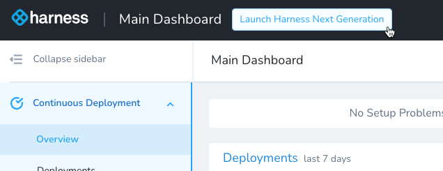

This topic provides answers to common questions about upgrading from Harness Continuous Delivery (CD) FirstGen to NextGen.

For steps on upgrading, go to [Upgrade to CD NextGen](./upgrade-nextgen-cd.md).

For information on the differences between Harness FirstGen and NextGen, go to [Harness FirstGen vs Harness NextGen](../../../getting-started/harness-first-gen-vs-harness-next-gen.md).

## What is Harness Continuous Delivery NextGen?

Harness has reimagined Continuous Delivery (CD) and built a new version of its CD product. 

Continuous Delivery is now part of a broader platform known as the Harness Software Delivery Platform. 

We intend for the platform to improve the developer experience. 

Harness NextGen is designed to empower developers to build, deploy, and manage all aspects of their software with ease. 

We took all our research and user feedback from Harness CD FirstGen and redesigned our CD product from the ground up. 

Harness CD NextGen has more deployment integrations, a redesigned UI, an overhauled Git configuration management experience, and a robust self-service experience that empowers dev teams to manage their deployment operations at scale.

## What will happen to Harness FirstGen CD?

Harness will continue to support FirstGen and ensure that it remains reliable for our customers. 

Any security fixes and product bugs will still be addressed with the same level of support.

For details on End of Life (EOL) dates for FirstGen, go to [Upgrade to CD NextGen](./upgrade-nextgen-cd.md).

## Why should I upgrade to Harness CD NextGen?

Harness CD NextGen offers a new suite of features and integrations that further boost the developer experience. Here are some of the key highlights.

### Automated deployment strategies

Harness provides out-of-the-box canary, blue-green, and rolling deployment capabilities for any technology stack.

### Revamped template library experience

NextGen templates have the following improvements:

- Harness now supports pipelines as templates that you can share across various projects.
- Harness now allows for your stages to be templated as well!
- Templates can now be managed in Git.
- Templates can be enforced automatically across various projects and pipelines with minimal overhead.

### Enterprise GitOps

NextGen includes the following GitOps benefits:

- Harness brings enterprise controls to GitOps deployment with governance, reliability, and visibility at scale.
- Harness GitOps delivers a fully managed GitOps experience that allows teams to scale implementations quickly and spend less time managing environments.

### Continuous Verification (CV) NextGen

Harness CV integrates with your APMs and logging tools to:

- Verify that the deployed service is running safely and perform automatic rollbacks.
- Apply machine learning to every deployment to identify and flag anomalies in future deployments.

Following are some CV features:

- Harness includes a **Verify** step that queries logging and metrics providers from multiple sources at once.
- Next, Harness uses its AI/ML-driven verification capability to automatically validate deployment quality. This capability reduces risk and provides a safety net when code is deployed to production.
- Integrations include Prometheus, Splunk, Google Cloud Operations, Datadog, and other leading logging and metrics providers.

### Policy as code

Harness NextGen includes Harness Policy as Code, a flexible and customized platform for policy-based control across the software development lifecycle. The feature is based on [Open Policy Agent (OPA)](https://www.openpolicyagent.org/), the open source industry standard. 

Harness Policy as Code does the following for you:

- Provides visibility into regulated applications/environments and exposes which compliance rules were not followed.
- Enforces policies when pipelines are saved or run.
- Finds breaches as early as possible through shift-left governance.

### Delegate

Harness NextGen supports an improved delegate. It uses a new type of [image](https://developer.harness.io/docs/platform/Delegates/delegate-concepts/delegate-image-types) and supports the following features:

- Deploy delegate images with or without third-party client tools. We recommend you use the delegate minimal image for added security.
- By default,  the delegate is automatically updated. There is an option to disable automatic updates.

## Does upgrading impact Harness CD FirstGen usage?

No. Upgrading to Harness CD NextGen does not impact your existing FirstGen usage. 

Your deployments will continue to run on Harness FirstGen with no impact. 

You can selectively upgrade Harness applications to move over to NextGen and safely test and validate before deprecating usage in FirstGen. 

Your existing FirstGen delegates aren't impacted. They will not receive any Harness CD NextGen tasks for deployment. 

Your FirstGen configuration (applications, services, workflows, pipelines, triggers, etc.) will continue to operate and won’t be changed when upgrading.

## Does upgrading to Harness CD NextGen impact my licensing or billing?

No. Upgrading to Harness CD NextGen will not impact your current plan. Your current billing plan will remain the same. 

## What is not upgraded from Harness CD FirstGen?

The following FirstGen entities and configurations are not upgraded in NextGen:

- **Delegates**. Harness NextGen leverages new delegates for executing NextGen workloads.
    
    You can run NextGen delegates alongside your FirstGen delegates as you are upgrading. There will be no impact to your existing workloads while running both sets of delegates.
  
  - For details on NextGen delegates, go to [Delegate overview](https://developer.harness.io/docs/platform/delegates/delegate-concepts/delegate-overview/).
- **Triggers**. Harness won’t upgrade FirstGen triggers. You will need to reconfigure triggers for any upgraded pipelines.
  
  - For details on NextGen triggers, go to [Triggers](https://developer.harness.io/docs/category/triggers).
- **Infrastructure provisioners**. Harness CD NextGen no longer provides the construct of infrastructure provisioners as it did in FirstGen.
    
    Infrastructure provisioner capabilities are condensed into execution steps in NextGen. Harness can orchestrate infrastructure by using Terraform, Terragrunt, CloudFormation, shell script provisioning, and Azure ARM and Blueprint.
  
  - For details on NextGen infrastructure provisioning, go to [Terraform](https://developer.harness.io/docs/category/terraform) and [CloudFormation](https://developer.harness.io/docs/category/cloudformation).
- **AWS ECS**. FirstGen ECS deployments can't migrate to NextGen ECS pipelines because the NextGen ECS integration is redesigned.
    
    NextGen now supports rolling, canary, and load balancer–based blue-green deployments. We have deprecated the FirstGen Service Setup and Wait for Steady State steps. Harness NextGen can still use your existing service and infrastructure configurations.

  - For details on NextGen ECS integration, go to [ECS deployment tutorial](/docs/continuous-delivery/deploy-srv-diff-platforms/aws/ecs/ecs-deployment-tutorial.md).
- **Variable references in manifests and steps**. The Harness variable reference format has changed in NextGen.
    
    In FirstGen, variables use the `${...}` format. In NextGen, variables use the `<+...>` format. You must upgrade your references to the new format.
 
  - For details on NextGen variables, go to [Variables and expressions](https://developer.harness.io/docs/category/variables-and-expressions).
- **Tag management**. Harness CD NextGen does not use tag management in the same way as Harness FirstGen.
    
    NextGen does support tags, but there is not a centralized management feature for them as in FirstGen.

  - For details on NextGen tags, go to [Tags reference](https://developer.harness.io/docs/platform/References/tags-reference).
- **SSO providers**. NextGen supports the same SSO providers as FirstGen, but you must reconfigure the SSO provider setup in NextGen.

  - For details on NextGen SSO providers, go to [Authentication overview](https://developer.harness.io/docs/platform/Authentication/authentication-overview).
- **Deployment history for CD dashboards**. Harness NextGen does not retain the deployment data from FirstGen. Harness will recalculate the deployment stats and metrics by using NextGen CD deployments.

  - For details on NextGen dashboards, go to [Monitor deployments and services in CD dashboards](/docs/continuous-delivery/monitor-deployments/monitor-cd-deployments).
- **API automation**. Harness will not upgrade API automation built with FirstGen GraphQL APIs.
    
    GraphQL APIs are not used in NextGen. They are replaced with REST APIs. The API endpoints are different and take different arguments. You must rewrite API-based automation to reintegrate with Harness NextGen.

  - For details on NextGen APIs, go to [APIs](https://developer.harness.io/docs/category/apis).
- **Artifact collection**. Harness will not migrate the artifact history of a FirstGen artifact source to NextGen.
    
    Harness NextGen does not perform artifact polling to collect the list of artifacts and maintain a history for future selection. NextGen fetches the list of tags at pipeline runtime. 

  - For details on NextGen artifact collection, review the artifact sources covered in [Harness Kubernetes services](https://developer.harness.io/docs/continuous-delivery/deploy-srv-diff-platforms/kubernetes/k8s-services/kubernetes-services).

## What are my CD NextGen upgrade options?

There are two Harness CD NextGen upgrade options.

### Option 1: Harness-assisted upgrade (recommended)

1. You schedule a meeting with the Harness team to help plan for an automated upgrade.
2. Harness reviews the CD FirstGen account and proposes an upgrade plan to you.
3. Harness upgrades the configuration to CD NextGen by using its upgrade APIs. This process will not impact your CD FirstGen setup.
4. You and the Harness team review the upgraded configuration.
5. You build your new CD NextGen pipelines and validate the apps deployed through those pipelines. Harness provides guidance as needed.
6. You and the Harness team work together to ensure a smooth upgrade and meet the agreed upon upgrade timeline.

#### Timeline

With the Harness upgrade team involved, the estimated timeline for a complete upgrade is about six weeks. Here is the upgrade process and the timeline for each stage.

### Option 2: Self-service upgrade

1. You access Harness CD NextGen from the home page of Harness FirstGen.

      

2. You pick the FirstGen applications to re-create in NextGen.
   
   This includes connectors, delegates, services, environments, workflows, and pipelines.
3. You deploy and test the new pipelines in Harness CD NextGen.
4. When you are comfortable deploying with Harness CD NextGen, you can remove the application from FirstGen.

You can reach out to Harness for review and validation of your Harness CD NextGen pipelines.

#### Timeline 

You share the start date and end date for the upgrade, including the final cutover date. This enables the Harness upgrade team to provide any assistance needed during your self-service upgrade.

## Are all features from FirstGen available in NextGen?

Yes. NextGen has feature parity. 

Some deployment capabilities have been overhauled:
- AWS ECS deployments have a significantly different experience from FirstGen.
- Deployment templates have been extended. 
- Traditional (SSH and WinRM) deployments have a new configuration experience.
- Infrastructure provisioners in FirstGen are now provisioning steps in NextGen. You can manage the entire infrastructure provisioning configuration in each step.

## What major benefits have upgraded customers noticed in NextGen?

- Full config-as-code. Git is the source of truth for your pipelines and templates.
- Significant efficiencies in build and delivery lead times.
- OPA-based governance helps enforce policies in pipeline designs.
- Standardized deployment processes using shareable templates.
- Reduction in workflow and pipeline management as more common components can be shared.
- Hybrid (multicloud deployment) pipelines and ad-hoc jobs are easier to configure and manage.
- Multi-service and multi-environment deployments at scale.
- Visibility and reporting into software delivery performance.
- Extended support for custom deployments.

