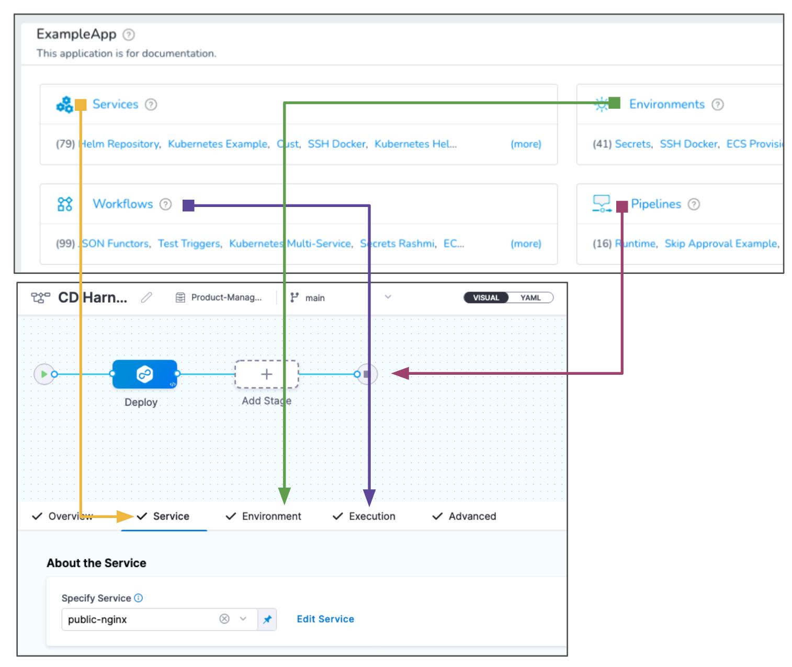

:::warning

This is an End of Life (EOL) notice for the CD FirstGen module.

:::

## What are Harness FirstGen and NextGen?

Harness has two versions of its product suite.

Harness FirstGen is the Harness version that's been around for years, covering all of the common platforms.

Harness NextGen is Harness' new version with a redesigned experience and new Continuous Integration, Feature Flags, Security Testing Orchestration, Service Reliability Management, Cloud Cost Management, and Chaos Engineering modules.

To compare supported platforms and technologies between Harness CD FirstGen and NextGen, go to:

* [FirstGen supported platforms and technologies](/docs/first-gen/starthere-firstgen/supported-platforms.md)
* [NextGen supported platforms and technologies](/docs/continuous-delivery/cd-integrations.md)

## What's happening to the FirstGen CD product?

The Harness FirstGen CD module will be phased out and will reach End of Life (EOL) in about 4/1/2024.

### Timeline

The FirstGen to NextGen CD upgrade will occur on the following dates:

- 1/1/2023: Harness First Gen will be in maintenance mode.
  - No new features will be added.
  - Security and bug fixes will continue to be addressed.
  - Harness will no longer accepts feature/enhancement requests or releases new features for the FirstGen CD module.
  - Harness will continue to support the FirstGen CD module and ensure the current system remains reliable until shutdown. Support includes any customer-found product defects and security issues.

- 10/1/2023: End of SMP releases.
  - Harness will no longer publish new versions of the Self Hosted Harness Platform (SMP) for Harness FirstGen.
  - Only Harness NextGen versions will be released in our SMP releases.

- 1/1/2024: End of support for FirstGen CD.
  - Harness Support will no longer accept support requests for FirstGen CD.
  - Security fixes will still be addressed.
  - Product defects will not be addressed.

- 1/31/2024: End of support for Delegate-Legacy.
  - Harness Support will no longer accept support requests for Delegate-Legacy in both Harness FirstGen and Harness NextGen (including Self Hosted Harness Platform (SMP))
  - Security fixes will still be addressed.
  - Product defects will not be addressed.

- 4/1/2024: FirstGen SaaS product shutdown.
  - Harness Delegates will no longer register with Harness FirstGen SaaS.
  - Users will no longer be able to use the Harness FirstGen UI to perform CD deployments.
  - Triggers will fail as webhook URLs will be deprecated.
  - The default experience for signing into Harness will be Harness CD NextGen.

- TBD: FirstGen documentation removed from HDH.
  - The majority of the documentation currently on the Harness Developer Hub (HDH) applies to Harness NextGen. Until all FirstGen accounts are migrated and a documentation archive/removal date is determined, you can continue to find the [FirstGen documentation on HDH](/docs/first-gen). The documentation in all other sections applies only to NextGen features.

## What's new in Harness NextGen?

Harness launched the next generation (NextGen) of its flagship CD module ten months ago and since then has expanded the offering and reached the feature parity with the FirstGen CD module. NextGen has been fundamentally redesigned to provide a best in class end-to-end developer experience.

Here are some NextGen highlights.

### Automated deployment strategies

Harness provides out-of-the-box Canary, Blue Green, and Rolling Deployment capabilities for any tech stack.

For examples of how these deployment types work with different platforms and services, go to [CD tutorials](/docs/category/cd-and-gitops-tutorials).

### Revamped template library experience

- We now support pipelines as templates that you can share across various projects.
- We now allow for your stages to be templated as well!
- Templates can now be managed in Git.
- Templates can be enforced automatically across various projects and pipelines with minimal overhead.

For details, go to [Templates](/docs/category/templates).

### Enterprise GitOps

- Harness brings enterprise controls to GitOps deployment with governance, reliability, and visibility at scale.
- Harness GitOps delivers a fully managed GitOps experience that allows teams to scale implementations quickly and spend less time managing environments.

For details, go to [GitOps](/docs/category/gitops).

### Continuous Verification (CV) 2.0

Harness CV integrates with your APMs and logging tools to:

- Verify that the deployed service is running safely and perform automatic rollbacks.
- Apply machine learning to every deployment to identify and flag anomalies in future deployments.

Some CV features:
- Harness includes a Verify pipeline step that queries logging and metrics providers from multiple sources at once.
- Next, Harness uses its AI/ML-driven verification capability to automatically validate deployment quality. This capability reduces risk and provides a safety net when code is deployed to production.
- Integrations include Prometheus, Splunk, Google Cloud Operations, Datadog, and other leading log and metric providers.

For details, go to [Continuous Verification](/docs/category/continuous-verification).

### Policy As Code

- A flexible and customized platform for policy-based control across the software development lifecycle.
- Provides visibility into regulated applications/environments and exposes which compliance rules were not followed.
- Enforce policies when pipelines are saved or run.
- Shift-left governance finds breaches as early as possible.
- Based on [Open Policy Agent (OPA)](https://www.openpolicyagent.org/), the open source industry standard.

For details, go to [Policy as Code](/docs/category/policy-as-code).

## Upgrading to NextGen CD

Added an account setting, `allowCrossGenerationAccess`, that you can use to enable cross generational access between CD FirstGen and NextGen. This setting is visible to CD subscribed (free/paid account) users only. This setting can be changed by account admins only.

If this setting is set to true, you can switch between CD FirstGen and NextGen with the click of a button. This feature is currently behind the feature flag, `PLG_ENABLE_CROSS_GENERATION_ACCESS`.

To upgrade to NextGen, select the **Launch Harness Next Generation** button in the Harness FirstGen UI.

To go back to FirstGen, select the **Launch First Generation** button in the Harness NextGen UI.

The default `allowCrossGenerationAccess` value for existing CD accounts in Harness is `TRUE`, but it is set to `FALSE` for non-CD accounts. For all new FirstGen and NextGen user accounts, this value is set to `FALSE` by default.

When you change the `allowCrossGenerationAccess` setting value in FirstGen or NextGen, a FirstGen or NextGen audit is generated respectively.

| `allowCrossGenerationAccess` | FirstGen | NextGen |
| :---| :--- | :--- |
| `TRUE` | The **Launch Harness Next Generation** button will be visible in the UI | The **Launch First Generation** button will be visible in the UI |
| `FALSE` | UI will not show the **Launch Harness Next Generation** button | UI will not show the **Launch First Generation** button |

Reach out to your assigned Customer Success Manager (CSM), Account Executive, or your Customer Success Engineer (CSE) for help upgrading to Harness NextGen, or for any further queries or comments.

### Mapping FirstGen to NextGen entities

Here's a diagram that shows how FirstGen entities like Services, Environments, Workflows, and Pipelines are represented in NextGen:

The following table maps the entities based on how you use them for deployment:

|   | FirstGen | NextGen |
| --- | --- | --- |
| **What I'm deploying.** | Service | Service |
| **Where I'm deploying it.** | Environment | Environment |
| **How I'm deploying it.** | Workflow | Execution |
| **My release process.** | Pipelines | Pipelines |
