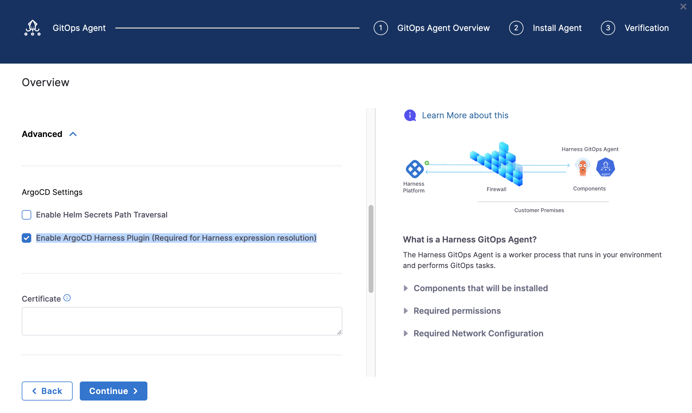

Harness GitOps supports using Harness expressions directly in your ArgoCD application manifests. This allows you to inject dynamic values from your service and environment configurations into Kubernetes manifests during the manifest generation phase, before deployment.

Instead of maintaining separate manifest files for each environment or hardcoding values, you can use expressions to reference variables defined in Harness services and environments. This provides a single source of truth for your configurations and makes it easier to manage deployments across multiple environments.

Expressions are resolved during manifest generation via the ConfigManagementPlugin, which means values are injected before the manifest is applied to your cluster. This approach provides better security, traceability, and consistency across your GitOps deployments.

## Prerequisites

Before using Harness expressions in GitOps applications, ensure you have:

- **Minimum agent version:** v0.105.x or later
- **Minimum version for gitops-agent-installer-helper:** v0.0.11 or later
- **ArgoCD Harness Plugin enabled:** When installing the GitOps agent, ensure the **Enable ArgoCD Harness Plugin (Required for Harness expression resolution)** checkbox is selected



:::important

**For existing Agent installations (BYOA or Harness-installed Argo):** The **Enable ArgoCD Harness Plugin** checkbox cannot be changed after the initial installation. You must configure the Harness ArgoCD plugin by running a patch script on your existing Argo CD installation. For detailed setup instructions, go to [Enable Harness Expression Resolution for Existing Installations](/docs/continuous-delivery/gitops/connect-and-manage/multiple-argo-to-single-harness#enable-harness-expression-resolution-for-byoa).

**For new Agent installations:** Enable the **Enable ArgoCD Harness Plugin (Required for Harness expression resolution)** checkbox during GitOps agent installation to use this feature.

:::

## Supported expression types

Harness GitOps supports the following expression types in ArgoCD manifests:

- **Service variables:** `<+serviceVariables.*>` – Variables defined at the service level.
- **Environment variables:** `<+env.variables.*>` – Variables defined at the environment level.
- **Environment properties:** `<+env.*>` – Environment metadata (name, type, identifier, etc.).
- **Fixed variables:** `<+variable.*>` – Account, organization, or project-level variables.
- **Secrets:** `<+serviceVariables.*>` or `<+env.variables.*>` (when referencing variables of type Secret) – **Supported only in Kubernetes objects of kind: Secret**; secrets will be resolved and actual values injected during manifest generation.

**Resolution timing:** Manifest generation time (pre-deployment, not runtime)

**Override priority:** ENV_SERVICE > Service > ENV_GLOBAL > Environment

## Use service variables

Service variables are defined at the service level and are specific to that service. They're useful for values that vary by service but may need different values per environment.

### Define service variables

1. In your Harness project, go to **Deployments** > **Services**.
2. Select your service, then go to the **Configuration** tab.
3. Under **Variables**, click **Add Variable**.
4. Enter a name, select a type (String, Number, Secret, etc.), and provide a value.
5. Save the service.

### Use service variables in manifests

Reference service variables in your manifests using the `<+serviceVariables.variableName>` syntax:

```yaml
apiVersion: apps/v1
kind: Deployment
metadata:
  name: myapp
spec:
  replicas: <+serviceVariables.replicas>
  template:
    spec:
      containers:
      - name: myapp
        image: myapp:<+serviceVariables.imageTag>
        env:
        - name: API_KEY
          value: <+serviceVariables.apiKey>
```

Common use cases for service variables:
- Replica counts
- Image tags
- Service-specific configuration values
- API keys or tokens

## Use environment variables

Environment variables are defined at the environment level and apply to all services deployed to that environment. They're useful for values that are consistent across all services in an environment.

### Define environment variables

1. In your Harness project, go to **Deployments** > **Environments**.
2. Select your environment, then go to the **Configuration** tab.
3. Under **Variables**, click **Add Variable**.
4. Enter a name, select a type, and provide a value.
5. Save the environment.

### Use environment variables in manifests

Reference environment variables using the `<+env.variables.variableName>` syntax:

```yaml
apiVersion: v1
kind: ConfigMap
metadata:
  name: app-config
  namespace: <+env.variables.namespace>
data:
  log-level: <+env.variables.logLevel>
  cluster-name: <+env.variables.clusterName>
```

Common use cases for environment variables:
- Namespace names
- Cluster names
- Environment-specific configuration (log levels, feature flags)
- Database connection strings

## Use environment properties

Environment properties provide access to environment metadata that's automatically available in Harness. These are read-only values that describe the environment itself.

### Available environment properties

- `<+env.name>` - Environment display name
- `<+env.identifier>` - Environment identifier
- `<+env.type>` - Environment type: "Production" or "PreProduction"
- `<+env.description>` - Environment description
- `<+env.color>` - Environment color code

### Example usage

```yaml
apiVersion: v1
kind: ConfigMap
metadata:
  name: app-config
data:
  environment-name: <+env.name>
  environment-type: <+env.type>
  environment-id: <+env.identifier>
```

## Use fixed variables

Fixed variables are defined at the account, organization, or project level and are accessible across all services and environments. These cannot be overridden at the service or environment level, making them ideal for global configuration values.

### Define fixed variables

1. Go to **Account Settings**, **Organization Settings**, or **Project Settings** (depending on scope).
2. Navigate to **Variables**.
3. Click **Add Variable** and define your variable.
4. Save the settings.

### Use fixed variables in manifests

Reference fixed variables using the appropriate scope prefix:

```yaml
apiVersion: v1
kind: ConfigMap
metadata:
  name: app-config
data:
  account-id: <+variable.account.companyId>
  org-region: <+variable.org.defaultRegion>
  project-name: <+variable.projectCode>
```

:::info Variable type distinctions

- `<+env.variables.xyz>` - Environment variables (can be overridden at ENV_GLOBAL level)
- `<+env.name>` - Environment metadata properties (fixed, read-only)
- `<+variable.account.xyz>` - Fixed variables (cannot be overridden)

:::

## Use secret variables

When you define a variable as type **Secret** in Harness, it follows a two-stage resolution process to ensure secure handling of sensitive values.

### How secret resolution works

Secret variables resolve in two stages:

1. **Expression resolution (manifest generation):** The expression `<+serviceVariables.secretName>` is converted to `<+secrets.getValue('secretReference')>` format
2. **Secret retrieval (deployment time):** The actual secret value is injected when the manifest is applied to the cluster

This two-stage approach ensures that:
- Secret references are properly formatted during manifest generation
- Actual secret values are only retrieved at deployment time
- Harness doesn't need to access your secret manager during the manifest generation phase

### Define a secret variable

1. In your service or environment, add a variable with type **Secret**.
2. In the value field, provide the reference to your Harness secret (for example, `account.prodDbPassword` or `org.apiKey`).
3. Save the configuration.

### Use secret variables in manifests

```yaml
# Service variable definition in Harness
variables:
  - name: dbPassword
    type: Secret
    value: account.prodDbPassword

# In your Kubernetes manifest
apiVersion: v1
kind: Secret
metadata:
  name: app-secrets
type: Opaque
stringData:
  db-password: <+serviceVariables.dbPassword>
```

**Resolution process:**

1. **After expression resolution (Stage 1):**
   ```yaml
   stringData:
     db-password: <+secrets.getValue('account.prodDbPassword')>
   ```

2. **After secret retrieval (Stage 2 - deployment time):**
   ```yaml
   stringData:
     db-password: actual-secret-value-from-harness
   ```

:::tip

Secret variables should only be used in Kubernetes `Secret` objects. The ConfigManagementPlugin only resolves `<+secrets.getValue()>` expressions when they appear within a Secret resource.

:::

## Override variables per environment

You can override variable values for specific service and environment combinations. This allows you to use different values for the same variable depending on where the service is deployed.

### Override service variables (ENV_SERVICE)

Service variables can be overridden for a specific service+environment combination. This is useful when a service needs different configuration values in different environments.

**Override priority:** ENV_SERVICE override > Base service variable

**Example:** Override replica count for production

1. In your service, define a base variable:
   ```yaml
   variables:
     - name: replicas
       value: "3"
   ```

2. Create an ENV_SERVICE override for the production environment:
   - Go to **Deployments** > **Environments** > Select your environment
   - Go to **Service Overrides**
   - Select your service
   - Add an override for the `replicas` variable with value `"10"`

3. When deploying to production:
   ```yaml
   spec:
     replicas: <+serviceVariables.replicas>  # Resolves to "10" in prod, "3" elsewhere
   ```

### Override environment variables (ENV_GLOBAL)

Environment variables can be overridden at the environment level, affecting all services deployed to that environment.

**Override priority:** ENV_GLOBAL override > Base environment variable

**Example:** Override log level for all services in production

1. Define a base environment variable:
   ```yaml
   # Environment: production
   variables:
     - name: logLevel
       value: "INFO"
   ```

2. Create an ENV_GLOBAL override:
   - Go to **Deployments** > **Environments** > Select your environment
   - Go to **Configuration** > **Variables**
   - Override the `logLevel` variable with value `"DEBUG"`

3. All services in production will use:
   ```yaml
   env:
   - name: LOG_LEVEL
     value: <+env.variables.logLevel>  # Resolves to "DEBUG" for all services in prod
   ```

### Override scope summary

| Variable Type | Override Level | Scope |
|--------------|----------------|-------|
| Service variables | ENV_SERVICE | Service-specific per environment |
| Environment variables | ENV_GLOBAL | Environment-wide for all services |

## Understand GitOps vs pipeline expressions

GitOps expressions differ from pipeline expressions in several important ways. Understanding these differences helps you choose the right expression type for your use case.

### Key differences

| Aspect | GitOps Expressions | Pipeline Expressions |
|--------|-------------------|---------------------|
| **Resolution Time** | Manifest generation (pre-deployment) | Runtime (during pipeline execution) |
| **Context** | Service + Environment + Metadata only | Full pipeline context (stage, step, infrastructure, etc.) |
| **Override Types** | ENV_SERVICE, ENV_GLOBAL | Multiple override levels (infrastructure, stage, service, etc.) |
| **Available Expressions** | `serviceVariables.*`, `env.*`, `secrets.getValue()`, `variable.*` | Full library (`pipeline.*`, `artifact.*`, `infra.*`, `stage.*`, etc.) |

### Limitations

GitOps expressions do not support:

- Pipeline-specific expressions (`<+pipeline.*>`, `<+stage.*>`)
- Artifact expressions (`<+artifact.*>`)
- Infrastructure expressions (`<+infra.*>`)
- Output variables from previous pipeline steps
- Runtime pipeline context (execution details, step outputs, etc.)

### When to use GitOps expressions

Use GitOps expressions when:
- You need values that are known at manifest generation time
- Values are tied to service or environment configuration
- You want to inject values into Kubernetes manifests before deployment
- You need environment-specific or service-specific configuration

### When to use pipeline expressions

Use pipeline expressions when:
- You need runtime values (artifact versions, build numbers, etc.)
- Values depend on pipeline execution context
- You need step outputs or infrastructure details
- Values are generated during pipeline execution

## Example: Complete application manifest

This example shows a complete Kubernetes deployment manifest using various Harness expression types.

### Deployment with multiple expression types

```yaml
apiVersion: apps/v1
kind: Deployment
metadata:
  name: myapp
  namespace: <+env.variables.namespace>  # Environment variable
  labels:
    environment: <+env.type>  # Environment property (Production/PreProduction)
    app: myapp
spec:
  replicas: <+serviceVariables.replicas>  # Service variable (Number type)
  selector:
    matchLabels:
      app: myapp
  template:
    metadata:
      labels:
        app: myapp
    spec:
      containers:
      - name: myapp
        image: myapp:<+serviceVariables.imageTag>  # Service variable (String)
        env:
        - name: LOG_LEVEL
          value: <+env.variables.logLevel>  # Environment variable
        - name: API_KEY
          valueFrom:
            secretKeyRef:
              name: app-secrets
              key: api-key
        - name: REGION
          value: <+serviceVariables.region>  # Service variable
        - name: ENVIRONMENT_NAME
          value: <+env.name>  # Environment property
        resources:
          limits:
            memory: <+serviceVariables.memoryLimit>
            cpu: <+serviceVariables.cpuLimit>
          requests:
            memory: <+serviceVariables.memoryRequest>
            cpu: <+serviceVariables.cpuRequest>
```

### ConfigMap example

```yaml
apiVersion: v1
kind: ConfigMap
metadata:
  name: app-config
  namespace: <+env.variables.namespace>
data:
  # Environment metadata
  environment-name: <+env.name>
  environment-type: <+env.type>
  environment-id: <+env.identifier>
  
  # Service variables
  max-connections: "<+serviceVariables.maxConnections>"
  cache-ttl: <+serviceVariables.cacheTtl>
  
  # Environment variables
  log-level: <+env.variables.logLevel>
  cluster-name: <+env.variables.clusterName>
  
  # Nested expressions
  api-endpoint: "https://api.<+serviceVariables.region>.example.com"
  
  # Fixed variables
  company-id: <+variable.account.companyId>
```

### Secret example

```yaml
apiVersion: v1
kind: Secret
metadata:
  name: app-secrets
  namespace: <+env.variables.namespace>
type: Opaque
stringData:
  # Secret variables resolve in two stages:
  # 1. Expression resolution: <+serviceVariables.apiKey> → <+secrets.getValue('account.myApiKey')>
  # 2. Secret retrieval: Actual value injected at deployment time
  api-key: <+serviceVariables.apiKey>
  db-password: <+serviceVariables.dbPassword>
  oauth-token: <+serviceVariables.oauthToken>
```

## Troubleshoot common issues

### Expression not resolving

:::note

Try performing a hard refresh of the application to invalidate cache. Most issues must be fixed by this.

:::

**Symptom:** Expression appears literally in the deployed manifest instead of the resolved value (for example, `<+serviceVariables.replicas>` instead of `3`).

**Possible causes and solutions:**

1. **Variable doesn't exist:**
   - Verify the variable exists in Harness UI (Service → Variables or Environment → Variables)
   - Check that the variable name matches exactly (expressions are case-sensitive)
   - Ensure you're using the correct scope (service variable vs environment variable)

2. **ConfigManagementPlugin not configured:**
   - Verify the ArgoCD Harness Plugin is enabled in your GitOps agent
   - Check that your application is using the Harness plugin for manifest generation
   - Review the agent installation logs for plugin configuration errors

3. **Typo in expression:**
   - Double-check the expression syntax: `<+serviceVariables.variableName>`
   - Ensure there are no extra spaces or special characters
   - Verify the variable name matches the exact spelling in Harness

### Override not working

**Symptom:** Variable override is configured but the original value is still being used.

**Possible causes and solutions:**

1. **Wrong override scope:**
   - Service variables must be overridden at ENV_SERVICE level (Service Overrides in environment)
   - Environment variables must be overridden at ENV_GLOBAL level (Environment Variables)
   - You cannot override service variables using ENV_GLOBAL overrides

2. **Override not saved:**
   - Verify the override was saved in Harness UI
   - Check that you selected the correct service+environment combination for ENV_SERVICE overrides
   - Ensure the variable name in the override matches exactly (case-sensitive)

3. **Override value is invalid:**
   - Check that the override value is not null or empty
   - Verify the value type matches the variable type (Number vs String)
   - Ensure the override is enabled and active

### Secret not resolving

**Symptom:** Secret variable shows the expression or `<+secrets.getValue()>` in the deployed pod instead of the actual secret value.

**Troubleshooting steps:**

1. **Check variable type:**
   - Verify the variable is defined as type **Secret** (not String)
   - Secret variables must be type Secret to trigger the two-stage resolution

2. **Verify secret reference:**
   - Check that the secret exists in Harness Secrets Manager
   - Verify the secret reference format is correct (`account.secretName` or `org.secretName`)
   - Ensure you have access to the secret at the appropriate scope

3. **Check pod environment:**
   ```bash
   # Check actual pod environment
   kubectl exec pod-name -- env | grep API_KEY
   # Should show actual secret value, not expression
   ```
   - If the literal expression appears in the pod, ConfigManagementPlugin secret resolution failed
   - If the value is null or empty, the secret doesn't exist or access is denied
   - Review ConfigManagementPlugin logs for secret resolution errors

### Numeric variable becomes string

**Symptom:** Numeric value appears as a string in the manifest (for example, `replicas: "3"` instead of `replicas: 3`).

**Cause:** Variable was defined as String type instead of Number type.

**Solution:**

1. Go to your service or environment variables
2. Edit the variable and change the type from **String** to **Number**
3. Save the configuration
4. The value will now be preserved as a number in the manifest

```yaml
# Correct variable definition
variables:
  - name: replicas
    type: Number  # Not String
    value: 3
```
## Next steps

You can now use Harness expressions in your GitOps application manifests to inject dynamic values based on service and environment configurations.

- [Manage GitOps Applications](/docs/continuous-delivery/gitops/application/manage-gitops-applications)
- [Use Harness Secret Expressions in Application Manifests](/docs/continuous-delivery/gitops/application/manage-gitops-applications#harness-secret-expressions-in-application-manifests)
- [Secret Injection Harness Plugin](/docs/continuous-delivery/gitops/security/secret-injection-harness-plugin)

