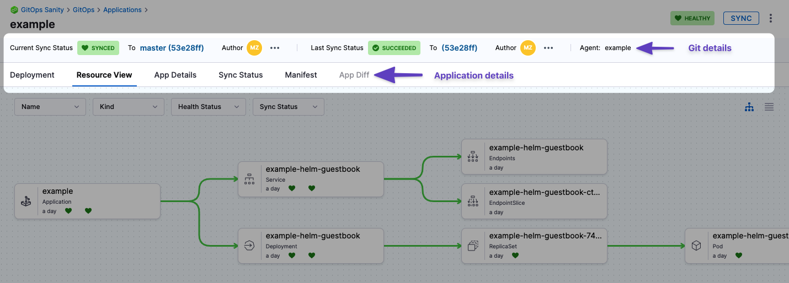

You can manage your applications through the **Applications** found in **GitOps Overview** page. 

<DocVideo src="https://app.tango.us/app/embed/Navigating-GitOps-to-Access-Applications-in-Harness-cad0aa3f8abd4f1d96af0e482c51729e" title="Navigating GitOps to Access Applications in Harness" />

## New Applications

Create a new application by clicking **+New Application** in the top right. To learn more about creating applications, go to [Add a Harness GitOps Application](/docs/continuous-delivery/gitops/get-started/harness-cd-git-ops-quickstart#step-4-add-a-harness-gitops-application)

## Applications Health Status Graph

On the **GitOps Overview** page, you’ll find the **Applications Health Status** bar chart, which shows how many applications are in each of these states:

- **Healthy**: Running without issues  
- **Degraded**: Experiencing reduced functionality  
- **Progressing**: Currently deploying or reconciling  
- **Missing**: No longer found in the cluster  
- **Suspended**: Paused or not actively reconciled  

Each status bar is clickable. Click any bar (for example, **Healthy**) to open the **Applications Dashboard** filtered to show only applications in that state.


<div align="center">
  <DocImage path={require('./static/applications-health-status.png')} width="60%" height="60%" title="Click to view full size image" />
</div>

## Application Operations

Applications are displayed on this page as a series of tiles. You can change this to a list of rows in the top right. 

Each application will display various helpful information such as the application repository or a name and link to the GitOps Agent. 

Each tile will have 3 vertical dots. Clicking this will allow you to manually **Sync**, **Refresh**, or **Delete** the application. 

See the following to learn more about some of these operations:
- [Sync Applications](/docs/continuous-delivery/gitops/application/sync-gitops-applications)
- [Refresh Applications](/docs/continuous-delivery/gitops/get-started/harness-git-ops-basics#refresh)

## Filter Applications

At the top you can filter your applications using a search bar and application attributes.

### Create and Save Filters

You can also create and save custom filters so that you can make sure you're only looking at relevant applications consistently. 

:::note

This feature is currently behind the feature flag `GITOPS_FILTER_PANE_ENABLED`. To enable this feature, contact [Harness Support](mailto:support@harness.io)

:::

To create and save a filter, do the following:

1. Create a filter by doing any of the following:
    - Add a custom search term
    - Choose to filter by **Agents**, **Sync Status**, **Health Status**, **Labels** etc.
    - Add an additional filter field by clicking the **+Add Filter** button.
2. Click **Save**
3. Enter a name for the filter, and choose if you want it visible to **Only me** or **Everyone** in the scope. 

You can then load the filter any time by clicking the filter icon to the right of **Reset** and searching for your saved filter.

#### Filter by Application Labels

You can filter applications by their **labels**.

- **Exact match (Key:Value)**
  - If you want to match specific applications, you can do an exact match using **Key:Value** in the labels.
  - You can add labels to an application in the **App Details** page.

- **Partial match (Key or Value)**
  - Search using a **key** or **value**.
  - Partial matches are supported. For example, if a label key is `team` or a value is `payment-service`, searching for `tea` or `pay` will return that application.
  - The search also considers the **Service name** and **Environment name** associated with the GitOps application as labels, and will match them in partial searches.

## Application Management Dashboard

After you select an application, you will see the application dashboard:



* **Git details:** you can see the Git commit used as the source for the sync. Clicking the commit Ids opens the commit in the source provider.
* **Deployment:** the deployments dashboard shows when the Application was deployed (synced).
* **Resource View:** displays the desired to target state mapping of each Kubernetes object.
  The **Resource View** lets you inspect the live target infrastructure by:
	+ **Name:** Kubernetes object names.
	+ **Kind:** Kubernetes object types.
	+ **Health Status:** the health status of the Application. For example, is it syncing correctly (Healthy)?
	+ **Sync Status:** sort Kubernetes objects by their sync status.

  Select any item to see:
    - **Overview**: An overview of the resource properties, such as name, namespace, or sync status.
    - **Events**: Any events emitted by the pod.
    - **Logs**: The logs of the resource. These logs are searchable, copyable, and downloadable. You can also view the log tail by clicking on the down arrow in the bottom right corner (click image below).
    <div align="center">
      <DocImage path={require('./static/log-tail-down-arrow.png')} width="50%" height="50%" title="Click to view full size image" />
    </div>
    - **Manifest**: The manifest of the resource.
    - **Diff**: The diff between the source manifest and application if they are out of sync.


* **App Details:** displays the settings of the Application. You can edit the settings and apply your changes, including the **Sync Options & Policy**.
* **Sync Status:** displays all of the sync operations performed by the Application.
* **Manifest:** displays the manifest of the Application. This is not the same as the source manifest in the Git source repo.  
You can edit the manifest in **Manifest** and the changes are synced in the target infrastructure, but when you do a full sync from your source repo the state of the source repo overwrites any changes made in **Manifest**.
* **App Diff:** displays a diff against the live state in the cluster and desired state in Git. 

### Health and Sync Status

The **Health** and **Sync** status indicators now include extended metadata in a popover. Hovering over a status reveals additional context such as sync type, revision, and more. This allows you to quickly assess the application state without leaving the dashboard.

<div align="center">
  <DocImage path={require('./static/health-status.png')} width="80%" height="80%" title="Click to view full size image" />
</div>

<div align="center">
  <DocImage path={require('./static/sync-status.png')} width="80%" height="80%" title="Click to view full size image" />
</div>

### Last Sync Details

Users can now view details like sync history, commit ID, sync result, and timestamps in a side drawer that opens directly from the application dashboard. 

<div align="center">
  <DocImage path={require('./static/last-sync-details.png')} width="80%" height="80%" title="Click to view full size image" />
</div>

## Application Configuration Options

### Ignore HPA Changes to Prevent Out-of-Sync Status

When Horizontal Pod Autoscaler (HPA) is enabled, pod scaling can cause GitOps to detect unwanted differences and mark applications as out of sync. 

To prevent this, configure the following in the application to ignore differences on replicas:

```yaml
ignoreDifferences:
    - group: apps
      kind: Deployment
      jsonPointers:
        - /spec/replicas
    - group: apps
      kind: StatefulSet
      jsonPointers:
        - /spec/replicas
syncPolicy: 
  syncOptions: 
  - RespectIgnoreDifferences=true
```

Alternatively, you can add the following to the Argo ConfigMap:

```yaml
apiVersion: v1
kind: ConfigMap
metadata:
  name: argocd-cm
data:
  resource.customizations: |
    apps/Deployment:^(app-with-hpa|hpa-enabled-.*|.*-autoscaled)$:
      ignoreDifferences: |
        jsonPointers:
        - /spec/replicas
```

For more details, see:
- [Argo CD Sync Options](https://argo-cd.readthedocs.io/en/stable/user-guide/sync-options/#respect-ignore-difference-configs)
- [Argo CD Application Specification Reference](https://argo-cd.readthedocs.io/en/stable/user-guide/application-specification/)

## Harness Secret Expressions in Application Manifests

:::note

This feature is behind the feature flag `CDS_GITOPS_SECRET_RESOLUTION_ENABLED`. Contact [Harness Support](mailto:support@harness.io) to enable the feature.

**For existing Agent installations (BYOA or Harness-installed Argo):** The **Enable ArgoCD Harness Plugin** checkbox cannot be changed after the initial installation. You must configure the Harness ArgoCD plugin by running a patch script on your existing Argo CD installation. For detailed setup instructions, go to [Enable Harness Expression Resolution for Existing Installations](/docs/continuous-delivery/gitops/connect-and-manage/multiple-argo-to-single-harness#enable-harness-expression-resolution-for-byoa).

**For new Agent installations:** Enable the **Enable ArgoCD Harness Plugin (Required for Harness expression resolution)** checkbox during GitOps agent installation to use this feature.

Currently, this feature only supports secrets that are configured in Harness and use either HashiCorp Vault or Harness Secret Manager as the secret storage backend. Other secret managers (such as AWS Secrets Manager, Azure Key Vault, or GCP Secret Manager) are not supported.

:::

You can use Harness secret expressions directly in your Kubernetes manifests. When you reference a Harness secret in your YAML files, the secret is resolved and decrypted during the manifest rendering phase. The `<+secrets.getValue()>` expressions are only resolved and decrypted when they appear within a Kubernetes object of type `Secret`.

After the manifest rendering phase decrypts the secrets and shows the diff, you must sync the application to push the resolved secret values to the cluster.

To use Harness secrets in your manifests, you must first create the secrets in Harness at the account, org, or project level. Once created, you can reference them in your manifests using the appropriate expression syntax based on the secret's scope:

- **Account-level secrets**: `<+secrets.getValue("account.secret_id")>`
- **Org-level secrets**: `<+secrets.getValue("org.secret_id")>`
- **Project-level secrets**: `<+secrets.getValue("secret_id")>`

**Example manifest with Harness secrets:**

```yaml
apiVersion: v1
kind: Secret
metadata:
  name: redis-db-vals
stringData:
  # Account-level secret
  secretfordb: <+secrets.getValue("account.vaultsecret")>
  # Account-level secret
  username1: <+secrets.getValue("account.secret2HSM")>
  # Org-level secret
  orgSecret: <+secrets.getValue("org.apikey")>
  # Project-level secret
  projectSecret: <+secrets.getValue("dbpassword")>
```

In this example:
- `account.vaultsecret` and `account.secret2HSM` are secrets configured at the account level
- `org.apikey` is a secret configured at the org level
- `dbpassword` is a secret configured at the project level
- The secret expressions are resolved and decrypted when Argo CD renders the manifests
- Since `stringData` is used, the values are base64-encoded before being stored in the cluster
- Secret values are masked in the Harness UI for security

:::note Security Considerations

Argo CD caches the manifests generated by plugins, along with the injected secrets, in its Redis instance. To mitigate security risks, implement network policies to restrict access to Argo CD components (Redis and repo-server) and consider running Argo CD on a dedicated cluster. For more information, refer to the [Argo CD Secret Management documentation](https://argo-cd.readthedocs.io/en/stable/operator-manual/secret-management/#mitigating-risks-of-secret-injection-plugins).

:::

### Additional Resources

For detailed setup and troubleshooting guide, refer to [Secret Injection Harness Plugin](/docs/continuous-delivery/gitops/security/secret-injection-harness-plugin).

For more samples and detailed explanations about using Harness Secret Expressions in GitOps applications, visit the [GitOps samples repository](https://github.com/harness-community/Gitops-Samples/tree/main/GitOps-Secret-Expressions).