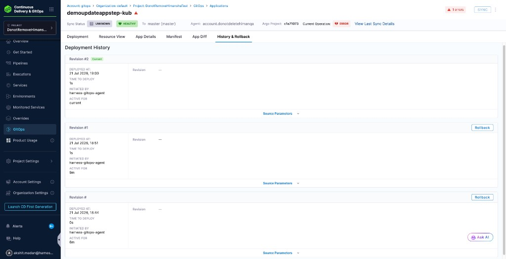
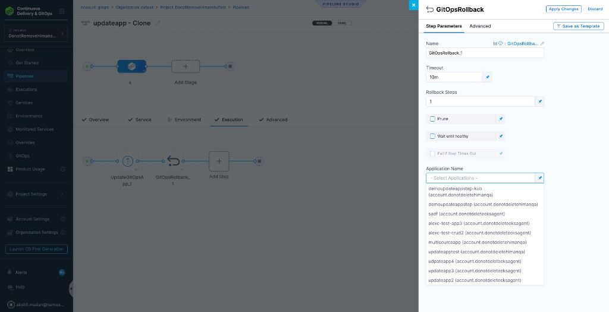

Harness GitOps supports the same rollback operation as Argo CD (`argocd app rollback`). You can restore a previous deployment revision from the application **History & Rollback** tab, or automate the same action with a **GitOps Rollback** pipeline step.

---

## Before you begin

- **GitOps Application:** Create and sync a GitOps Application that has at least one previous deployment revision. Go to [Add a Harness GitOps Application](/docs/continuous-delivery/gitops/get-started/harness-cd-git-ops-quickstart#step-4-add-a-harness-gitops-application) to create one.
- **Deployment history:** Rollback is available only for previous revisions. The current revision does not show a 'Rollback' action.
- **Pipeline stage (pipeline step only):** Use a deployment stage with GitOps enabled when you add the GitOps Rollback step.

---

## Roll back from the History & Rollback tab

Use this path when you want to select a specific previous revision in the UI and roll the application back to it.

1. In your GitOps project, go to **Deployments** > **GitOps** > **Applications**, and then select your application.
2. Select the **History & Rollback** tab.
3. Review the deployment history. Each card shows the revision number, deploy time, how long the revision was active, and who initiated the deploy.
4. On the revision you want to restore, select 'Rollback'.

The current revision is marked with a **Current** badge and does not include a 'Rollback' button.

---

## Roll back with the GitOps Rollback step

Use the **GitOps Rollback** step when a pipeline must roll an application back by a fixed number of revisions. The step takes the application name and the number of rollback steps.

1. Select a pipeline and open the **Execution** tab of a GitOps-enabled deploy stage.
2. Select 'Add Step', and then select 'GitOps Rollback'.
3. Configure the step parameters:

   - **Name:** Enter a step name.
   - **Timeout:** Enter the step timeout, such as `10m`.
   - **Rollback Steps:** Enter how many revisions to roll back. For example, `1` rolls back to the previous revision.
   - **Prune:** Select this option when you want Argo CD to prune resources during the rollback.
   - **Wait until healthy:** Select this option when the step must wait until the application reaches a **Healthy** state.
   - **Fail If Step Times Out:** Available when 'Wait until healthy' is enabled. Select this option when the step must fail if the health check does not pass before the timeout.
   - **Application Name:** Select the GitOps Application to roll back.

4. Select 'Apply Changes'.
5. Save and run the pipeline.

:::tip Wait until healthy and timeout

If 'Wait until healthy' and 'Fail If Step Times Out' are both enabled, the rollback can succeed while the step still fails if the application is not healthy before the timeout. If 'Fail If Step Times Out' is disabled, a successful rollback marks the step as successful even when the health check does not complete in time.

:::

---

## Next steps

- Go to [Sync GitOps applications](/docs/continuous-delivery/gitops/application/sync-gitops-applications) to sync an application after a rollback when you need an explicit sync in the same pipeline.
- Go to [Manage GitOps Applications](/docs/continuous-delivery/gitops/application/manage-gitops-applications) to review the application dashboard tabs and other application operations.
- Go to [GitOps PR Pipelines](/docs/continuous-delivery/gitops/pr-pipelines/pr-pipelines-basics#gitops-pipeline-steps) to review all GitOps pipeline steps.
