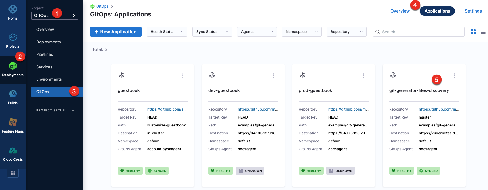
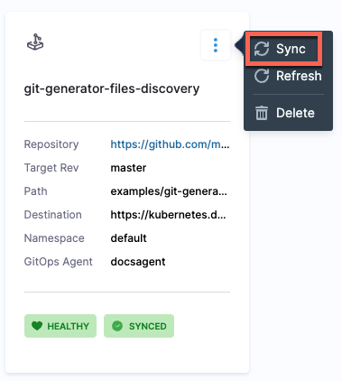
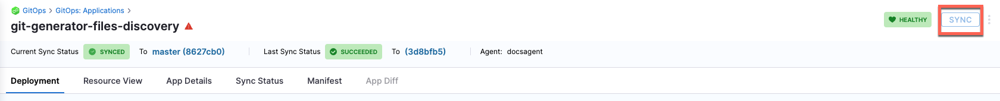
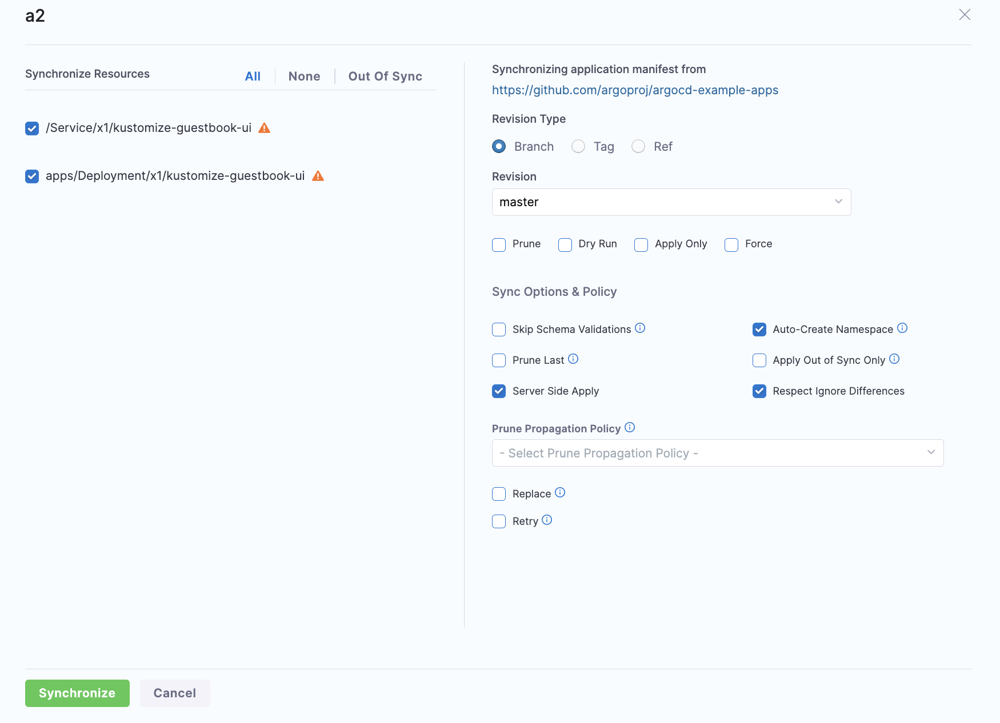
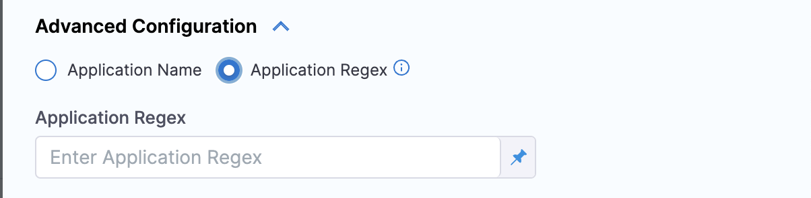
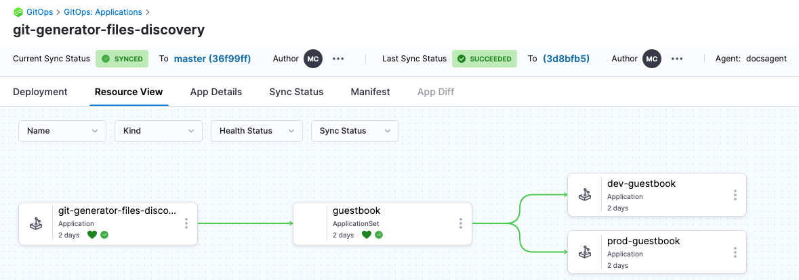
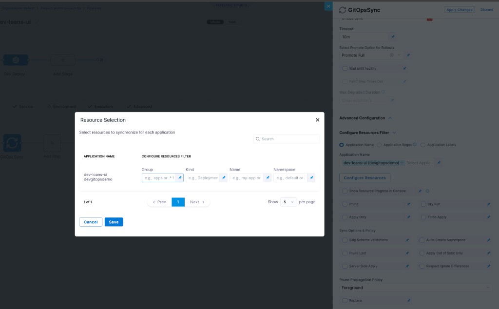
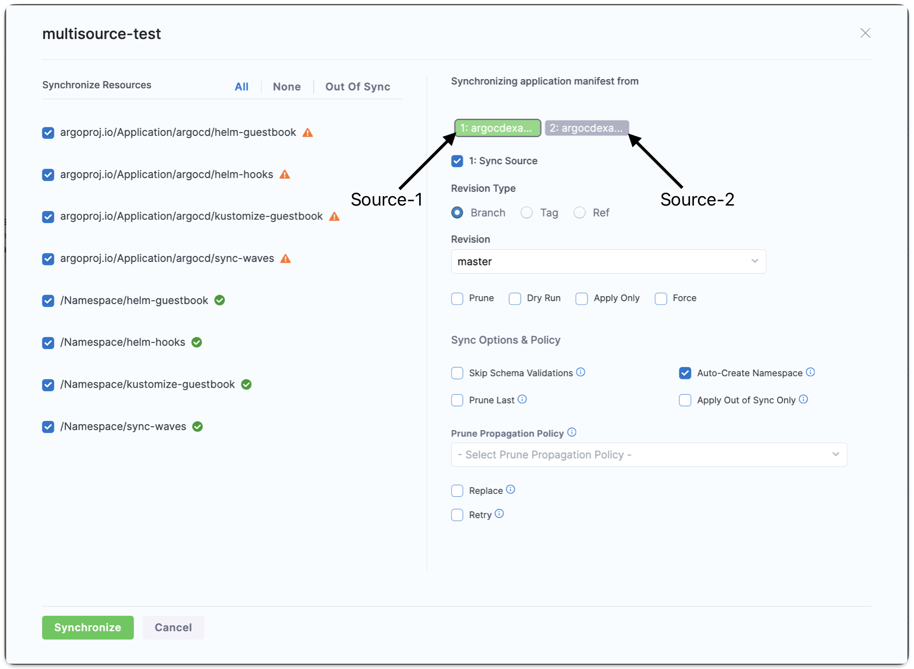
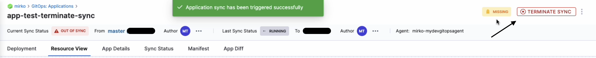
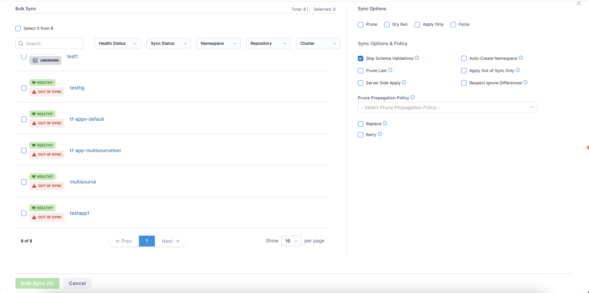

Sync is a process that ensures that the live state of a system matches its desired state by applying a declarative description. This process involves synchronizing the desired Git state with the live cluster state. 

## Sync for Single Sources application.

To sync applications from the **Applications** page: 

1. In your GitOps project, go to **Deployments** > **GitOps** > **Applications**, and then select your application.
   
   

2. To sync the selected application: 
   * Select the more options icon, and then select **Sync**.
   
     
   * Select the application, and then select **SYNC**. 

     
3. Configure the sync options, and then select **Synchronize**.

   When synchronizing the application, you have the option to apply a specific revision. By default, target revision of the application is selected.
   
   The Branch and Tag options display a list of available branches and tags, allowing you to make a selection. Additionally, the Ref option enables synchronization of branches, tags, and commit hashes.
   
   

To sync applications using the **GitOpsSync** step: 

1. Select a pipeline and go to the **Execution** tab of a deploy stage.
   
   :::info

   Make sure that the service, environment, and cluster selected in the pipeline matches the service, environment, and cluster in the application.

   ::: 
   
2. Select **Add Step**, and then select the **GitOpsSync** step.
3. Select the GitOpsSync step to configure step parameters.
4. Optionally, click on the **Wait until healthy** checkbox, if you would like the step to run until the application reaches it's **Healthy** state.
5. Optionally, if you enabled **Wait until healthy** you can enable **Fail If Step Times Out**. 
   This will cause the step to fail if it times out while waiting for the health check to pass. 
   
   :::tip
   For example, if this option is enabled, the step may sync successfully but fail if a healthy state is not achieved before the timeout period expires. In contrast, with this option disabled, the step will always be marked as successful if the sync is successful, regardless of the healthy state.
   :::

6. In **Advanced Configuration**, select the application you want to sync and configure the sync options.
      You can either choose an application or applications manually, or you can match up to 1000 applications using a regex filter. The regex field uses **Go (Golang) regex syntax**, not JEXL. You can test your patterns at [regex101](https://regex101.com/) with the **Golang** flavor selected.

    

   To sync only specific resource types instead of the entire application, select 'Application Name' and go to [Sync specific resource types in the GitOps Sync step](#sync-specific-resource-types-in-the-gitops-sync-step).
 
7. Select 'Apply Changes'.

Here is how the resources would look in Harness after the sync process is complete.

---

## Sync specific resource types in the GitOps Sync step

By default, the GitOps Sync step synchronizes every resource in a GitOps application. Use the 'Configure Resources' filter to limit sync to specific Kubernetes resource types, such as `ConfigMap`, `Deployment`, or `ReplicaSet`.

This does not let you cherry-pick individual resources from a list. You select resource types in **Kind**, and optionally narrow the sync with **Group**, **Name**, and **Namespace** patterns. Harness synchronizes all resources in the application that match your filters.

:::info Minimum versions

This feature requires ng-manager v1.154.0 and next-gen-ui v1.141.0.

:::

### Before you begin

- **Manual application selection:** Select 'Application Name' in the GitOps Sync step. Resource filters are not available when you target applications with 'Application Regex', 'Application Labels', or 'Fetch Linked Apps'.
- **Argo CD behavior:** Resource filtering uses the same capabilities Argo CD provides for selective sync. Any limitation in Argo CD also applies in Harness.

### Configure resource filters

1. In your pipeline, open the GitOps Sync step.
2. In **Advanced Configuration**, under **Application Selection**, select 'Application Name'.
3. Select the GitOps application you want to sync.
4. Select 'Configure Resources'.
5. In the **Resource Selection** dialog, set filters for each application row:
   - **Group:** Filter by API group. For example, `apps` or `.*` to match all groups.
   - **Kind:** Select one or more Kubernetes resource types to sync, such as `Deployment`, `ConfigMap`, or `ReplicaSet`. All resources of the selected kinds in the application are synchronized.
   - **Name:** Filter by resource name pattern. For example, `my-app` or `.*`.
   - **Namespace:** Filter by namespace pattern. For example, `default` or `.*`.
6. Select 'Save', then select 'Apply Changes' on the step.

After the pipeline runs, only resources that match your filters are synchronized. Resources outside the selected kinds or filter patterns remain unchanged by this sync step.

:::info Supported application selection modes

Resource filters are available only when you select applications by name. They do not work with 'Application Regex', 'Application Labels', or 'Fetch Linked Apps'.

:::

---

## Sync for  Multiple Sources application

For more information on creating a multi-source application, refer to the [Support for Multiple Sources](/docs/continuous-delivery/gitops/get-started/harness-cd-git-ops-quickstart#step-4-add-a-harness-gitops-application) documentation

After the application with multiple source is created, you can also choose which source to sync with the application during the sync operation. By default, all applications will be synced.

To sync a specific source:

1. Click the **Sync** button in the top right corner of the **Applications** page.
2. Under **Synchronizing application manifest from**, select the source tab from which you want to sync your application.
3. Check the **Sync Source** checkbox. The tab for the selected source, where the checkbox is enabled, will be highlighted in green.

## Terminate sync

To terminate an in-progress sync, go to the application for the syncing app and locate the **Terminate Sync** button in the top right corner of the UI. Replace the **Sync** button when a sync is in progress.

## Bulk Sync and Refresh

:::note 

This feature is behind the feature flag `GITOPS_BULK_ACTIONS_ENABLED`. Contact [Harness Support](mailto:support@harness.io) to enable it.

:::

:::info Minimum Version

This feature requires GitOps agent version of 0.93 or higher. Please ensure you have the correct agent version. 

Having the incorrect version will result in your bulk syncs timing out after three minutes.

:::

You can bulk sync or refresh your applications from the application page. In your GitOps project, go to **Deployments** > **GitOps** > **Applications** to get to your applications page.

Click the **Bulk Sync** button in the top left to sync many applications at once or click **Refresh** in the top right. The following screen will appear for bulk sync, and a very similar screen will appear for refresh:

In the top left you can select all the applications on the page, or you can select applications individually from the list shown.

On the right you can modify your sync or refresh options. These options will apply to all the applications selected. 

Once you've selected your applications and options, click **Bulk Sync** or **Bulk Refresh**. 

:::warning Batch Size

The recommended batch size is 100 applications. To sync more than 100 applications, increase the `GITOPS_AGENT_NUM_PROCESSORS` value in the config by 1 for every additional 100 applications. For example, set it to 2 for 200 applications.

:::

#### Required Permissions
- Bulk Sync: User must have the `gitops app sync` permission.
- Bulk Refresh: User must have the `gitops app view` permission.

## Sync notifications

You can receive notifications for sync success/failure, out-of-sync drift, and health degradation. Go to [Centralised notification](/docs/platform/notifications/centralised-notification#gitops-application-notifications) to configure alerts for GitOps application events.

