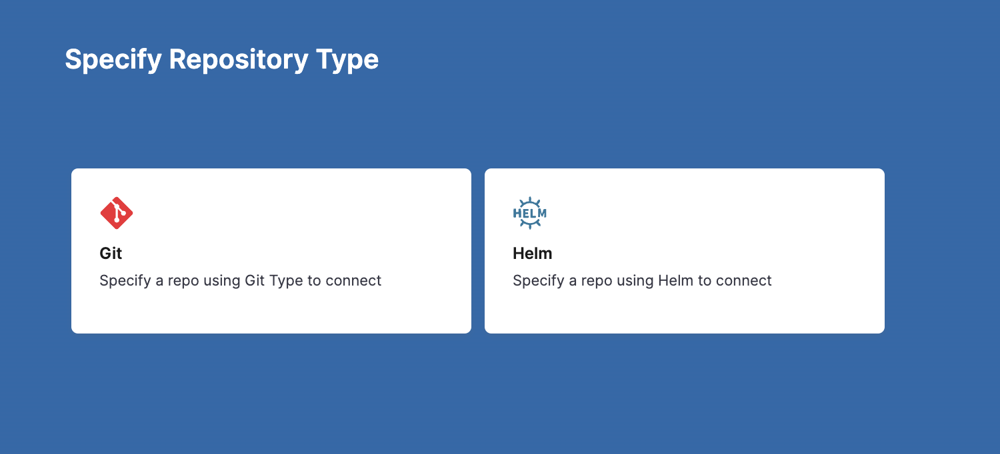

## Introduction
A typical GitOps Application syncs a source manifest to a destination cluster. If you have multiple target clusters, you could create separate GitOps Applications for each one, but that makes management more challenging. What if you want to sync an application with 100s of target clusters? Managing 100s of GitOps Applications is not easy.

To solve this use case, we can explore ApplicationSets.

ApplicationSet can be thought of as a kind of Application factory. It defines one application template and syncs it to multiple target environments. It is similar to an Application but uses a template to achieve application automation with multiple target environments.

ApplicationSet CRD is managed by dedicated kubernetes controller - applicationset-controller similar to Application CRD being managed by application-controller.

ApplicationSets offer the following capabilities:

* Use a single manifest to target multiple Kubernetes clusters.
* Use a single manifest to deploy multiple Applications from a single or multiple git repositories.
* Enhanced support for the monorepos, where multiple Application resources are defined within a single Git repository.

You can find more information about ApplicationSets from the [ApplicationSets documentation site](https://argocd-applicationset.readthedocs.io/en/stable/).

ApplicationSets are often used with the [PR pipeline](https://developer.harness.io/docs/continuous-delivery/gitops/pr-pipelines/). A Harness PR pipeline has the power to update the config and sync changes to the application in just one of the target environments.


## ApplicationSet resource
Each ApplicationSet spec has 2 main fields - generators and template.

### Template
Template is the template for the Application to be created. It has parameterized fields which can be substituted to create the Application.

Parameters should be in the format {{parameter name}}.

### Generator
Generator generate parameters to be substituted in the template section of the ApplicationSet resource. There are different types of generators. 

There are many types of generators, Harness supports all ApplicationSet generators. You can add an ApplicationSet for any generator as an Application in Harness. For more information on the available generators, refer to the [documentation](https://argocd-applicationset.readthedocs.io/en/stable/Generators/).

Each generator solves different use case. Every generator gives you the same end result: Deployed Argo CD Applications. What you use would depend on a lot of factors like the number of clusters managed, git repository layout, etc.

#### Support in PR pipeline
* [Git Generator](https://argocd-applicationset.readthedocs.io/en/stable/Generators-Git/) has first class support with the Update Release Repo and Merge PR steps in the PR pipeline.

* All generators can be used in Shell Script steps. For example, you could create a Cluster generator YAML spec in a Shell Script step as a bash variable, and then use git commands in the script to update the ApplicationSet in your repo with the spec in the step. The updated repo spec will be used in the next Application sync (manual or automatic).

For integration with PR pipeline, please refer to the [pipeline documentation](https://developer.harness.io/docs/continuous-delivery/gitops/pr-pipelines/#review-execution-steps).

### Example

The below is an example for the git generator.
```yaml
apiVersion: argoproj.io/v1alpha1
kind: ApplicationSet
metadata:
  name: addons
spec:
  generators:
  - git:
      repoURL: https://github.com/argoproj/argo-cd.git
      revision: HEAD
      directories:
      - path: applicationset/examples/git-generator-directory/cluster-addons/*
  template:
    metadata:
      name: '{{.path.basename}}'
    spec:
      project: "1bcfghj"
      source:
        repoURL: https://github.com/argoproj/argo-cd.git
        targetRevision: HEAD
        path: '{{.path.path}}'
      destination:
        server: https://kubernetes.default.svc
        namespace: '{{.path.basename}}'
      syncPolicy:
        syncOptions:
        - CreateNamespace=true
```

After the generated parameters are substituted into the template, once for each set of parameters by the ApplicationSet controller, each rendered template is converted into an Application resource, thus creating multiple applications from a unified manifest.

For more information, refer to the [Argo ApplicationSet documentation](https://argo-cd.readthedocs.io/en/stable/operator-manual/applicationset/).

## ApplicationSet requirements

To set up a typical ApplicationSet use case, you'll need the following:

* 3 Kubernetes clusters with a minimum of 2 vCPUs, 8GB Memory, 100 GB disk size (for example the [e2-standard-2](https://cloud.google.com/compute/docs/general-purpose-machines#e2_limitations) in GCP):
	+ 2 target clusters: the ApplicationSet will deploy an app to these 2 clusters.
		- For this tutorial, we will name the clusters **engineering-dev** and **engineering-prod**.  
		We will use the Kubernetes default namespace for the applications, but you can use any namespace.
	- 1 cluster for the Harness GitOps Agent. You can install the Agent in a cluster with or without an existing Argo CD project.
* GitHub account. You will be cloning the Argo Project's [ApplicationSet repo](https://github.com/argoproj/applicationset) and using one of its examples.

## Install a GitOps Agent

For steps on how to install a Harness GitOps Agent, go to [Install a Harness GitOps Agent](/docs/continuous-delivery/gitops/use-gitops/install-a-harness-git-ops-agent.md).

1. Install the Agent in the Kubernetes cluster you have set up for your GitOps Agent, not the target dev or prod target clusters.

Ensure the Agent has access to Harness and to the other 2 target clusters. Once it's installed you'll see it register with Harness:


:::note

**Mapped Harness Project:** if you installed the Agent in a cluster without an existing Argo CD project, there will not be a mapping initially. Once you create a Harness GitOps entity using the Agent, such as a GitOps Cluster or Repo, Harness will automatically create the Argo CD project and map it to the Agent.

:::

## Add the GitOps Clusters

Now we'll add 3 GitOps Clusters in Harness:

* 1 GitOps Cluster for the cluster running your GitOps Agent.
* 1 GitOps Cluster for the cluster that will host the dev application.
* 1 GitOps Cluster for the cluster that will host the prod application.

### GitOps Agent Cluster

1. In **GitOps**, click **Settings**, and then **Clusters**.
   
   

2. Click **New Cluster**.
3. In **Name**, enter the name **appset-example**.
4. In **GitOps Agent**, select the Agent you installed earlier.
5. Click **Continue**.
6. In **Details**, click **Use the credentials of a specific Harness GitOps Agent**.
7. Click **Save and Continue**.
   The connections is verified.
   
   

8. Click **Finish**.

### Dev and Prod Application Clusters

We'll add Harness GitOps Clusters for the two target clusters where we want to add our application.

1. Create a new Harness GitOps Cluster for your dev cluster.
2. Name the cluster **engineering-dev**.
3. In **GitOps Agent**, select the GitOps Agent you added earlier.
   
   

4. In **Details**, select **Specify Kubernetes Cluster URL and credentials**.
5. In **Master URL**, enter the Endpoint URL for the target cluster (you can use `kubectl cluster-info` or your cloud console). Ensure that you use the `https://` scheme.Here's an example:
   
   

6. In **Authentication**, use the authentication method you prefer. In this tutorial, we use the `default` namespace `service-account` token.
7. Click **Save and Continue**. The GitOps Cluster is verified.
8. Click **Finish**.
9.  Repeat the process for the **Prod** cluster.
	1. Name the cluster **engineering-prod**.
	2. Use the same Agent.
	3. For **Master URL**, ensure that you use the `https://` scheme.
	4. Use whatever authentication method you want.

When you're done, you will have three Harness GitOps Clusters: 1 for the GitOps Agent and two for the target clusters.


You might see a Warning status. This status simply indicates that nothing has been deployed to the cluster yet.

## Clone and update the ApplicationSet repo

The repo and example we will use is located in the Argo Project's public [ApplicationSet repo](https://github.com/argoproj/applicationset):

`https://github.com/argoproj/applicationset/tree/master/examples/git-generator-files-discovery`

For a summary of this example, go to [Argo CD docs](https://argocd-applicationset.readthedocs.io/en/stable/Generators-Git/#git-generator-files). You will need to clone this repo into your GitHub account and then update 3 files.

1. Clone the repo `https://github.com/argoproj/applicationset`.
2. Navigate to `applicationset/examples/git-generator-files-discovery/git-generator-files.yaml`.
3. Update `git-generator-files.yaml` with the following YAML keys/values:


```yaml
apiVersion: argoproj.io/v1alpha1  
kind: ApplicationSet  
metadata:  
  name: guestbook  
spec:  
  generators:  
    - git:  
        repoURL: https://github.com/<your account name>/applicationset.git  
        revision: HEAD  
        files:  
        - path: "examples/git-generator-files-discovery/cluster-config/**/config.json"  
  template:  
    metadata:  
      name: '{{cluster.name}}-guestbook'  
    spec:  
      project: <Harness GitOps Agent Project Id>  
      source:  
        repoURL: https://github.com/<your account name>/applicationset.git  
        targetRevision: HEAD  
        path: "examples/git-generator-files-discovery/apps/guestbook"  
      destination:  
        server: '{{cluster.address}}'  
        namespace: default  
      syncPolicy:  
        automated: {}
```
Make sure you update the following:

1. Update `repoURL: https://github.com/argoproj/applicationset.git` with `repoURL: https://github.com/<your account name>/applicationset.git`.
2. `spec.template.spec.project`: replace `default` with the Harness GitOps Agent Project Id.
3. `spec.template.spec.destination.server`: replace `server: https://kubernetes.default.svc` with `server: '{{cluster.address}}'`.
4. Add `syncPolicy.automated: {}` to `spec.template.spec`.
   
   

5. Save your changes.

Next, we'll update the config.json files for the two target clusters.

1. Navigate to `applicationset/examples/git-generator-files-discovery/cluster-config/engineering/dev/config.json`.
2. Replace `"address": "https://1.2.3.4"` with the Endpoint IP address for the **dev** cluster. Ensure that you use the `https://` scheme.
3. Navigate to `applicationset/examples/git-generator-files-discovery/cluster-config/engineering/prod/config.json`.
4. Replace `"address": "https://1.2.3.4"` with the Endpoint IP address for the **prod** cluster. Ensure that you use the `https://` scheme.

Here's an example. Your IP addresses will be different.


## Add the GitOps Repository

Let's add a Harness GitOps Repository for your ApplicationSet repo. Later, you'll select this GitOps Repository when you set up the Harness GitOps Application.

1. In your Harness Project, click **GitOps**, and then click **Settings**.
2. Click **Repositories**.
3. Click **New Repository**.
   
   

4. In **Specify Repository Type**, click **Git**.
5. Enter the following and click **Continue**.
   * **Repository Name:** **applicationset\_examples**.
   * **GitOps Agent:** select the Agent you added earlier.
   * **Git Repository URL:** the URL to your repo. You can simply copy and paste the HTTPS URL from GitHub.
   
   

   1. In **Credentials**, either user your GitHub credentials or, if your repo is public, select Anonymous in Authentication.
   2. Click **Save & Continue**.
6. Once the connection is verified, click **Finish**.

Now you can create the Harness GitOps Application using the Harness GitOps Agent, Clusters, and Repositories you have set up.

## Create the Harness GitOps Application

Now that we have the Agent, Clusters, and Repo, we can create the GitOps Application.

1. In **GitOps**, click **Applications**, and then click **New Application**.
2. Enter the following settings and then click **Continue**.
	1. **Application Name:** enter **git-generator-files-discovery**.
	2. **GitOps Agent:** select the Agent you added earlier.
	3. **Service:** create a new Service named **git-generator-files-discovery**.
	4. **Environment:** create a new Environment named **git-generator-files-discovery**. 
	5. Select **Pre-Production**.
   
   

3. Leave the default **Sync Policy** settings, and click **Continue**.
4. In **Source**, enter the following settings and then click **Continue**.
	1. **Repository URL:** select the GitOps Repository you added earlier.
	2. **Target Revision:** select **master**.
	3. **Path:** enter **examples/git-generator-files-discovery** and click **+** to add it.
   
   

5. In **Destination**, enter the following settings and then click **Finish**.
	1. **Cluster:** select the Agent cluster **appset-example**.
	2. Namespace: enter **default**.

The GitOps Application is added. Now you can [sync](/docs/continuous-delivery/gitops/use-gitops/sync-gitops-applications) it.

## Notes

### ApplicationSet Support

* Do not deploy an ApplicationSet in a namespace other than the namespace where the GitOps Agent is installed. The ApplicationResource has to be deployed in same namespace as the GitOps Agent.
* Harness supports both JSON and YAML formats for ApplicationSets.
* Harness supports all ApplicationSet generators. You can add an ApplicationSet for any generator as an Application in Harness:
	+ [List Generator](https://argocd-applicationset.readthedocs.io/en/stable/Generators-List/)
	+ [Cluster Generator](https://argocd-applicationset.readthedocs.io/en/stable/Generators-Cluster/)
	+ [Git Generator](https://argocd-applicationset.readthedocs.io/en/stable/Generators-Git/)
	+ [Matrix Generator](https://argocd-applicationset.readthedocs.io/en/stable/Generators-Matrix/)
	+ [Merge Generator](https://argocd-applicationset.readthedocs.io/en/stable/Generators-Merge/)
	+ [SCM Provider Generator](https://argocd-applicationset.readthedocs.io/en/stable/Generators-SCM-Provider/)
	+ [Cluster Decision Resource Generator](https://argocd-applicationset.readthedocs.io/en/stable/Generators-Cluster-Decision-Resource/)
	+ [Pull Request Generator](https://argocd-applicationset.readthedocs.io/en/stable/Generators-Pull-Request/)
* [Git Generator](https://argocd-applicationset.readthedocs.io/en/stable/Generators-Git/) has first class support with the **Update Release Repo** and **Merge PR** steps in the Pipeline.
* All generators can be used in Shell Script steps. For example, you could create a Cluster generator YAML spec in a Shell Script step as a bash variable, and then use git commands in the script to update the ApplicationSet in your repo with the spec in the step. The updated repo spec will be used in the next Application sync (manual or automatic).

### Syncing

You can sync using the Harness ApplicationSet Application or sync the individual Harness Applications independently.


If you configure automatic syncing in the ApplicationSet template, then the Applications will be synced automatically. See `syncPolicy.automated` here:


```yaml
  template:  
    metadata:  
      name: '{{cluster.name}}-guestbook'  
    spec:  
      project: 191b68fc  
      source:  
        repoURL: https://github.com/johndoe/applicationset.git  
        targetRevision: HEAD  
        path: "examples/git-generator-files-discovery/apps/guestbook"  
      destination:  
        server: '{{cluster.address}}'  
        namespace: default  
      syncPolicy:  
        automated: {}
```

The `syncPolicy.automated` is applied to all Applications created by the ApplicationSet because it is part of the template.

If you make a change to one of the target Applications and then perform an ApplicationSet sync, the change to target Application will be preserved.

